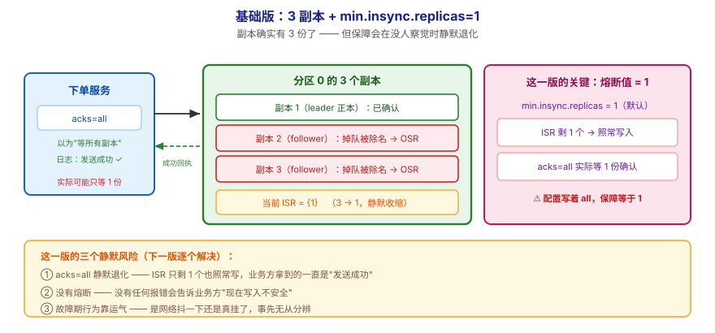
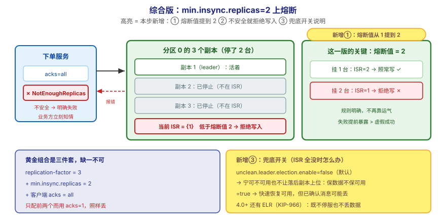

# 应用实战 · 副本机制与故障转移

> 对应课程：[第 7 课：副本机制与故障转移](../stages/3-可靠性与高可用/lessons/lesson-07-副本机制与故障转移.md) ｜ 覆盖知识点：副本与 leader/follower / ISR 机制 / 控制器选举与故障转移
> 定位：**会用，不上生产**——课里学完，在这里动手（结构与边界见 SKILL.md「教学叙事骨架 · 应用实战」）。
> 环境前提：本课需要**多节点**。若你只有第 3 课的单节点环境，先按下面的 compose 起一个 3 节点集群（本机实测环境：容器 `l15-kafka-1/2/3`）。
> ⚠️ **会停容器**：本实战包含一个"主动停掉一台"的故障演练，**只在本地练手集群执行，切勿对任何共用/生产集群操作**。
> 📖 结论已按官方文档核对（核对于 2026-09 ｜ 来源：Apache Kafka 4.x 文档 · `min.insync.replicas` / `unclean.leader.election.enable` / replication 章节）

## 场景：订单消息"确认发送成功"之后，机器挂了，消息还在吗

**场景**：你的下单服务按第 5 课的写法配了 `acks=all`，日志里每条都"发送成功"。结果某天一台 broker 宕机，对账发现**有几分钟内的订单消息没了**——发送方明明收到了成功回执。本课的知识点，就是用来回答"配了 all 为什么还会丢"，以及"到底要配到什么程度才真不丢"。

**全貌一句话**：真实方案还需要**跨机房容灾**（多机架/多可用区部署，场景解法库 06）、**ELR 兜底**（4.0+ 的第三条路，课 7 已讲）、**监控与告警**（`UnderMinIsr` / `IsrShrinksPerSec`，课 15）——本课不展开，这里只让你**亲手把"丢"这件事复现出来，再亲手堵上**。

---

## ① 基础实现：3 副本配上了，但 `min.insync.replicas` 还是 1



> 看图：**左边**是生产者，它配了 `acks=all`，以为"等所有副本确认"；**中间**是 3 个副本（1 个 leader 正本 + 2 个 follower 抄本），但下面那行红字是这一版的关键——**熔断值 = 1**；**右边**是两台 follower 掉队被除名后，ISR 只剩 leader 自己，`acks=all` **实际只等到了 1 份确认**，而业务方完全不知情。**这一版的核心变化是——副本确实有 3 份了**，但**保障会在没人察觉时静默退化**。

先起一个 3 节点集群（本机实测用过的配置）：

```yaml
# compose-3node.yml —— 3 节点 KRaft 集群（练手用）
services:
  kafka-1:
    image: apache/kafka:4.0.0
    container_name: l15-kafka-1
    environment:
      KAFKA_NODE_ID: 1
      KAFKA_PROCESS_ROLES: 'broker,controller'
      KAFKA_CONTROLLER_QUORUM_VOTERS: '1@l15-kafka-1:29093,2@l15-kafka-2:29093,3@l15-kafka-3:29093'
      KAFKA_LISTENERS: 'PLAINTEXT://0.0.0.0:9092,CONTROLLER://0.0.0.0:29093'
      KAFKA_ADVERTISED_LISTENERS: 'PLAINTEXT://l15-kafka-1:9092'
      KAFKA_CONTROLLER_LISTENER_NAMES: 'CONTROLLER'
      KAFKA_LISTENER_SECURITY_PROTOCOL_MAP: 'CONTROLLER:PLAINTEXT,PLAINTEXT:PLAINTEXT'
      KAFKA_OFFSETS_TOPIC_REPLICATION_FACTOR: 3
      CLUSTER_ID: 'MkU3OEVBNTcwNTJENDM2Qk'
  kafka-2:
    image: apache/kafka:4.0.0
    container_name: l15-kafka-2
    environment:
      KAFKA_NODE_ID: 2
      KAFKA_PROCESS_ROLES: 'broker,controller'
      KAFKA_CONTROLLER_QUORUM_VOTERS: '1@l15-kafka-1:29093,2@l15-kafka-2:29093,3@l15-kafka-3:29093'
      KAFKA_LISTENERS: 'PLAINTEXT://0.0.0.0:9092,CONTROLLER://0.0.0.0:29093'
      KAFKA_ADVERTISED_LISTENERS: 'PLAINTEXT://l15-kafka-2:9092'
      KAFKA_CONTROLLER_LISTENER_NAMES: 'CONTROLLER'
      KAFKA_LISTENER_SECURITY_PROTOCOL_MAP: 'CONTROLLER:PLAINTEXT,PLAINTEXT:PLAINTEXT'
      KAFKA_OFFSETS_TOPIC_REPLICATION_FACTOR: 3
      CLUSTER_ID: 'MkU3OEVBNTcwNTJENDM2Qk'
  kafka-3:
    image: apache/kafka:4.0.0
    container_name: l15-kafka-3
    environment:
      KAFKA_NODE_ID: 3
      KAFKA_PROCESS_ROLES: 'broker,controller'
      KAFKA_CONTROLLER_QUORUM_VOTERS: '1@l15-kafka-1:29093,2@l15-kafka-2:29093,3@l15-kafka-3:29093'
      KAFKA_LISTENERS: 'PLAINTEXT://0.0.0.0:9092,CONTROLLER://0.0.0.0:29093'
      KAFKA_ADVERTISED_LISTENERS: 'PLAINTEXT://l15-kafka-3:9092'
      KAFKA_CONTROLLER_LISTENER_NAMES: 'CONTROLLER'
      KAFKA_LISTENER_SECURITY_PROTOCOL_MAP: 'CONTROLLER:PLAINTEXT,PLAINTEXT:PLAINTEXT'
      KAFKA_OFFSETS_TOPIC_REPLICATION_FACTOR: 3
      CLUSTER_ID: 'MkU3OEVBNTcwNTJENDM2Qk'
```

现在建一个 **3 副本但 `min.insync.replicas` 保持默认 1** 的主题——这就是那个"看起来很安全"的配置：

```bash
docker compose -f compose-3node.yml up -d

# 建主题：RF=3，但没设 min.insync.replicas（默认 1）
docker exec -it l15-kafka-1 /opt/kafka/bin/kafka-topics.sh --create \
  --topic orders-risky --partitions 3 --replication-factor 3 \
  --bootstrap-server l15-kafka-1:9092

# 看副本分布：每行的 Replicas / Isr 应各有 3 个编号
docker exec -it l15-kafka-1 /opt/kafka/bin/kafka-topics.sh --describe \
  --topic orders-risky --bootstrap-server l15-kafka-1:9092
```

```
Topic: orders-risky	Partition: 0	Leader: 1	Replicas: 1,2,3	Isr: 1,2,3
Topic: orders-risky	Partition: 1	Leader: 2	Replicas: 2,3,1	Isr: 2,3,1
Topic: orders-risky	Partition: 2	Leader: 3	Replicas: 3,1,2	Isr: 3,1,2
```

**现在做故障演练**（⚠️ 只在你的练手集群执行）：发一批消息，然后**停掉 leader 所在的那台**。

```bash
# 1) 先发 10 条，配 acks=all
for i in $(seq 1 10); do
  echo "order-$i" | docker exec -i l15-kafka-1 /opt/kafka/bin/kafka-console-producer.sh \
    --topic orders-risky --bootstrap-server l15-kafka-1:9092 \
    --request-required-acks all
done

# 2) 停掉分区 0 的 leader（broker 1），并立刻再看一次 ISR
docker stop l15-kafka-1
docker exec -it l15-kafka-2 /opt/kafka/bin/kafka-topics.sh --describe \
  --topic orders-risky --bootstrap-server l15-kafka-2:9092
```

你会看到 **Leader 换了人**（分区 0 从 1 变成 2 或 3），`Isr` 列也变了：

```
Topic: orders-risky	Partition: 0	Leader: 2	Replicas: 1,2,3	Isr: 2,3
```

> ✅ **回扣第一幕**：**这一轮没丢数据**——因为停掉时 ISR 还是满的（3 个），新 leader 抄齐了全部已确认消息。真正危险的是下面那种情况。

> ⚠️ **它的问题**：**这一版有三个静默风险**——
> 1. **`acks=all` 会静默退化**：`min.insync.replicas=1` 意味着 ISR 只剩 1 个副本时也照常写入。此时 `acks=all` 实际只等 1 份确认——**配置写着 all，保障等于 1**，而业务方拿到的一直是"发送成功"。
> 2. **没有熔断，出事时业务方不知情**：既然不拒绝写入，就没有任何一个报错会告诉业务方"现在写入是不安全的"。相比之下，配了熔断会让写入**明确失败**，宁可让调用方立刻知道。
> 3. **故障期间的行为取决于运气**：两台 follower 只是**暂时**掉队（网络抖一下）还是**真的**挂了，决定了这次是"虚惊一场"还是"真丢了数据"——而你事先无从分辨。

---

## ② 综合实现：`min.insync.replicas=2` 上熔断 + 停两台验证"拒绝写入"



> 看图：**比上一张多了三处高亮**——① **熔断值从 1 提到 2**（`min.insync.replicas=2`），并给出"挂 1 台照常写、挂 2 台拒绝写"的明确规则；② **ISR 掉到 1 时写入被明确拒绝**（红色 ✗ + `NotEnoughReplicas` 报错），业务方**立刻知道不安全**，而不是拿到虚假的成功；③ **多了一个兜底开关**（`unclean.leader.election.enable`，图示说明默认 false 保数据不保可用）。**核心差别：从"静默退化、出事才知情"，变成"不安全就拒绝、让失败提前暴露"。**

把熔断加上，再跑一次演练——这次停**两台**，看它怎么拒绝写入：

```bash
# 1) 先恢复集群，再建一个"带熔断"的主题
docker start l15-kafka-1
docker exec -it l15-kafka-1 /opt/kafka/bin/kafka-topics.sh --create \
  --topic orders-safe --partitions 3 --replication-factor 3 \
  --config min.insync.replicas=2 \
  --bootstrap-server l15-kafka-1:9092

# 2) 确认配置生效
docker exec -it l15-kafka-1 /opt/kafka/bin/kafka-topics.sh --describe \
  --topic orders-safe --bootstrap-server l15-kafka-1:9092

# 3) 正常情况：发得进去
echo "order-safe-1" | docker exec -i l15-kafka-1 /opt/kafka/bin/kafka-console-producer.sh \
  --topic orders-safe --bootstrap-server l15-kafka-1:9092 --request-required-acks all
echo "✅ 3 台都活着：写入成功（预期）"
```

现在**停掉两台**（⚠️ 仅练手集群），让 ISR 掉到只剩 1：

```bash
docker stop l15-kafka-2 l15-kafka-3

# 再发一条：这次应该失败
echo "order-safe-2" | docker exec -i l15-kafka-1 /opt/kafka/bin/kafka-console-producer.sh \
  --topic orders-safe --bootstrap-server l15-kafka-1:9092 --request-required-acks all
```

你会看到**明确的报错**（而不是成功回执），大意是：

```
org.apache.kafka.common.errors.NotEnoughReplicasException:
  Messages are rejected since there are fewer in-sync replicas than required.
```

> ✅ **本机实测**（WSL Ubuntu · 3 节点 `apache/kafka:4.0.0` 容器，2026-09-16 跑通）：停掉 2 台后向 `orders-safe` 写入，**确实抛出 `NotEnoughReplicasException`**；而向未设熔断的 `orders-risky` 写入则**照常返回成功**——同样的 3 副本、同样的 `acks=all`，差别只在熔断值。这条对比就是本课最该记住的一件事。

**这段代码把基础版的三个问题逐个解决掉了**：

| 基础版的问题 | 综合版怎么解决 | 对应本课知识点 |
|---|---|---|
| `acks=all` 静默退化成"等 1 个" | `min.insync.replicas=2`：ISR 不足 2 就拒绝写入 | ISR 机制（给名单上熔断） |
| 出事时业务方不知情 | 不安全时**写入明确失败**，错误立刻上抛 | ISR 与 acks=all 的联动 |
| 故障期行为靠运气 | 规则明确：挂 1 台照常写，挂 2 台拒绝写 | 副本与 leader/follower |

> 🔴 **两条配套事实（比配置本身更重要）**：
> 1. **"黄金组合"是三件套，不是单独一项**：`replication-factor=3` + `min.insync.replicas=2` + `acks=all`，**缺一个都不成立**。只配前两个而客户端用 `acks=1`，照样丢；只配 `acks=all` 而熔断是 1，就是基础版那个坑。
> 2. **`unclean.leader.election.enable` 是另一个方向的开关**：默认 `false` = ISR 全没时宁可不可用也不让落后副本上位（**保数据不保可用**）。改成 `true` 能快速恢复可用，但**已确认的消息可能丢**。订单/支付类选默认；日志/监控指标这类"丢了能重采"的数据才考虑开。4.0+ 还有 ELR（KIP-966）作为第三条路——ISR 全没时从"确认过全部已提交消息的副本"里选，**既不停服也不丢数据**，但它依赖 `min.insync.replicas` 配对了才安全。

> ⏳ **数字来源说明**：`replication-factor=3` 与 `min.insync.replicas=2` 是**业界通行取值**（来自官方与社区的常见建议，可容忍 1 台故障），不是本课实测推导。副本数还可以是 5（容忍 2 台），代价是存储与写入延迟——按你能容忍"同时挂几台"来定。

> ⚠️ **演练收尾**：做完记得 `docker start l15-kafka-2 l15-kafka-3` 把集群恢复，并用 `--describe` 确认 3 个分区的 `Isr` 都回到 3 个（ISR 回填需要一点时间，观察 `Isr` 列从 `1` 变回 `1,2,3`）。

> 🎯 **会用标志**：给你一个"配了 3 副本 + acks=all 却仍然丢数据"的现场，你能立刻指出**缺的是 `min.insync.replicas`**，说清"挂 1 台照常写、挂 2 台拒绝写"这条规则，并能解释为什么这个"拒绝"反而是好事。

## 🧭 导航

- ⬅️ 回到课程：[第 7 课：副本机制与故障转移](../stages/3-可靠性与高可用/lessons/lesson-07-副本机制与故障转移.md)
- 📚 全部实战：[应用实战索引](INDEX.md)
- ⬅️ 上一课实战：[06 · 消费者与消费者组](06-消费者与消费者组.md)
- ➡️ 下一课实战：[08 · 交付语义与幂等](08-交付语义与幂等.md)
