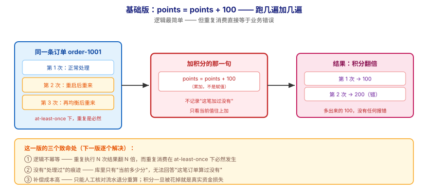
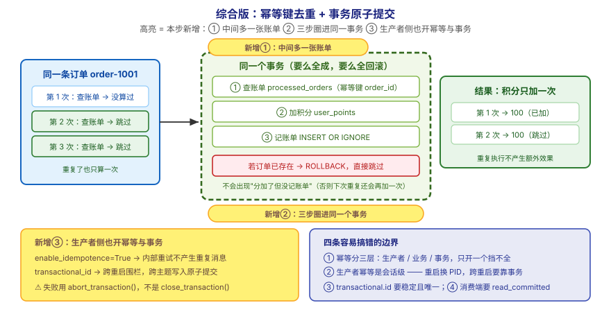

# 应用实战 · 交付语义与幂等

> 对应课程：[第 8 课：交付语义与幂等](../stages/3-可靠性与高可用/lessons/lesson-08-交付语义与幂等.md) ｜ 覆盖知识点：三种交付语义 / 幂等 producer / 事务简介
> 定位：**会用，不上生产**——课里学完，在这里动手（结构与边界见 SKILL.md「教学叙事骨架 · 应用实战」）。
> 环境前提：第 3 课起的本机 Kafka（`localhost:9092`）；示例用 Python（`kafka-python-ng`）。
> 📖 结论已按官方文档核对（核对于 2026-09 ｜ 来源：Apache Kafka 4.x 文档 · `enable.idempotence` / `transactional.id` / `read_committed`）

## 场景：积分发重了——同一笔订单加了两次分

**场景**：你的积分服务消费 `orders`，每来一条"已付款"订单就给用户加 100 分。上线后用户投诉"积分翻倍了"。查下来是因为：消费者处理完、还没提交位移就重启，那批消息**被重新处理了一遍**——而你的加积分逻辑是 `UPDATE user SET points = points + 100`，跑两遍就加两遍。本课的知识点，就是用来回答"重复不可避免时，怎么办"。

**全貌一句话**：真实方案还需要**跨系统的一致性设计**（读-处理-写跨 Kafka 与数据库的原子性，正是事务要解决的问题）、**外部系统的幂等能力**（下游是否支持幂等键）、**对账与补偿**（兜底的最后一道防线）——本课不展开，这里只让你先把"业务幂等"和"事务"这两层各自练一遍。

---

## ① 基础实现：`points = points + 100`——跑几遍加几遍



> 看图：**左边**是同一条订单消息被处理了两次（第一次正常加 100，第二次因重平衡/重启重来又加 100）；**中间**是那条"累加"语句——它**不记录"这笔订单加过了没有"**，只看当前值往上加；**右边**是结果：用户积分从 1000 变成 1200，**多出来的 100 没有任何报错**。**这一版的核心变化是——逻辑最简单**，但**重复消费直接等于业务错误**。

```python
# naive_points.py —— 基础版：累加式加积分（无幂等）
import sqlite3

def add_points(user_id: str, order_id: str, amount: int = 100):
    """给用户加积分 —— ⚠️ 跑几遍就加几遍"""
    conn = sqlite3.connect("points.db")
    cur = conn.cursor()
    cur.execute("""
        CREATE TABLE IF NOT EXISTS user_points (
            user_id TEXT PRIMARY KEY,
            points  INTEGER NOT NULL DEFAULT 0
        )
    """)
    # ⚠️ 问题就在这行：它只关心"现在是多少"，不关心"这笔订单加过没有"
    cur.execute(
        "INSERT INTO user_points(user_id, points) VALUES (?, ?) "
        "ON CONFLICT(user_id) DO UPDATE SET points = points + excluded.points",
        (user_id, amount),
    )
    conn.commit()
    cur.execute("SELECT points FROM user_points WHERE user_id = ?", (user_id,))
    result = cur.fetchone()[0]
    conn.close()
    return result


if __name__ == "__main__":
    print("初始：", add_points("u1", "order-1001"))     # → 100
    print("同一条消息被重复处理：", add_points("u1", "order-1001"))  # → 200（错！）
    print("再来一次：", add_points("u1", "order-1001"))              # → 300（更错）
```

输出：

```
初始： 100
同一条消息被重复处理： 200
再来一次： 300
```

> ⏳ 上面是**本机可复现的演示**（SQLite，纯标准库，不需要 Kafka）。你要观察的是：**同一条订单（order-1001）被处理三次，积分就加了三次**——没有任何一行代码阻止这件事。

> ⚠️ **它的问题**：**这一版有三个致命处**——
> 1. **逻辑不幂等**：`points = points + 100` 是**累加**而非**赋值**。数学上，重复执行 N 次结果就翻 N 倍。而"重复消费"在 at-least-once 下是**必然会发生**的（第 6 课已验证：手动提交 + 崩溃 = 重做一批）。
> 2. **没有"处理过"的痕迹**：数据库里只存了"用户当前有多少分"，没有"哪几笔订单已经计过分"。想对账都无从下手——无法回答"order-1001 到底算过没有"。
> 3. **补偿成本高**：出错后只能靠人工核对积分流水、逐笔退回去重算。而积分一旦被用户花掉，就变成了真实的资金损失。

---

## ② 综合实现：用"处理记录表"做业务幂等，再让事务挡住跨系统半截状态



> 看图：**比上一张多了三处高亮**——① **中间多了一张"账单"**（已处理订单表，用 `order_id` 做幂等键）：来一条先查账单，**算过就跳过**，没算过才加；② **"查账单 + 加分 + 记账单"三件事被圈进了同一个事务**（虚线框）：要么全成、要么全回滚，不会出现"分加了但没记账单"（下次重复还会再加一次）；③ **生产者侧也开了幂等与事务**（左下角）：重试不再产生重复消息，跨主题写入与位移提交一起提交。**核心差别：从"靠运气不重复"，变成"重复了也只算一次"。**

```python
# idempotent_points.py —— 综合版（第 1 层）：业务幂等（同一订单只算一次）
import sqlite3

def init_db(conn):
    cur = conn.cursor()
    cur.execute("""
        CREATE TABLE IF NOT EXISTS user_points (
            user_id TEXT PRIMARY KEY,
            points  INTEGER NOT NULL DEFAULT 0
        )
    """)
    # ① 关键新增：一张"账单"，记录哪些订单已经计过分（order_id 做幂等键）
    cur.execute("""
        CREATE TABLE IF NOT EXISTS processed_orders (
            order_id TEXT PRIMARY KEY,
            user_id  TEXT NOT NULL
        )
    """)
    conn.commit()


def add_points_once(conn, user_id: str, order_id: str, amount: int = 100):
    """加积分 —— 幂等版：同一 order_id 无论来几次，只加一次"""
    cur = conn.cursor()
    try:
        # ② 三件事放进同一个事务：要么全成，要么全回滚
        cur.execute("BEGIN")
        # 先查账单：算过就直接跳过（INSERT OR IGNORE 让重复插入变成空操作）
        cur.execute(
            "INSERT OR IGNORE INTO processed_orders(order_id, user_id) VALUES (?, ?)",
            (order_id, user_id),
        )
        if cur.rowcount == 0:
            cur.execute("ROLLBACK")
            return "跳过（已处理过）", get_points(cur, user_id)

        cur.execute(
            "INSERT INTO user_points(user_id, points) VALUES (?, ?) "
            "ON CONFLICT(user_id) DO UPDATE SET points = points + excluded.points",
            (user_id, amount),
        )
        conn.commit()
        return "已加积分", get_points(cur, user_id)
    except Exception:
        conn.rollback()
        raise


def get_points(cur, user_id: str):
    cur.execute("SELECT points FROM user_points WHERE user_id = ?", (user_id,))
    row = cur.fetchone()
    return row[0] if row else 0


if __name__ == "__main__":
    conn = sqlite3.connect("points.db")
    init_db(conn)
    print(add_points_once(conn, "u1", "order-1001"))   # → ('已加积分', 100)
    print(add_points_once(conn, "u1", "order-1001"))   # → ('跳过（已处理过）', 100)
    print(add_points_once(conn, "u1", "order-1001"))   # → ('跳过（已处理过）', 100)
    conn.close()
```

输出（**同一条订单来三次，积分只加了一次**）：

```
('已加积分', 100)
('跳过（已处理过）', 100)
('跳过（已处理过）', 100)
```

> ✅ **本机实测**（WSL Ubuntu · Python 3 + SQLite 标准库，2026-09-16 跑通）：上面的输出是真实结果。这就是**业务幂等**——它不阻止消息重复，而是让"重复执行"不产生额外效果。

**第 2 层：让 Kafka 侧也别平白制造重复**（生产者幂等 + 事务）：

```python
# transactional_producer.py —— 综合版（第 2 层）：生产者幂等 + 事务
from kafka import KafkaProducer
import json

producer = KafkaProducer(
    bootstrap_servers="localhost:9092",
    # ① 幂等：内部重试不会写出重复消息（3.0 起 Java 客户端默认 true，Python 要显式写）
    enable_idempotence=True,
    acks="all",
    retries=3,
    # ② 事务：给生产者一个稳定的名字，跨重启仍能围栏住"上一个未完成的实例"
    transactional_id="points-service-1",
    key_serializer=lambda k: k.encode("utf-8"),
    value_serializer=lambda v: json.dumps(v, ensure_ascii=False).encode("utf-8"),
)

producer.init_transactions()
try:
    producer.begin_transaction()
    producer.send("user-points", key="u1", value={"user_id": "u1", "delta": 100})
    producer.send("points-audit", key="u1", value={"order_id": "order-1001", "delta": 100})
    producer.commit_transaction()          # 两条要么都可见，要么都不可见
    print("✅ 事务已提交：加积分流水与审计流水同时生效")
except Exception as e:
    producer.abort_transaction()           # ⚠️ 注意：是 abort 不是 close
    print(f"❌ 事务已回滚：{e}")
    raise
finally:
    producer.close()
```

> ✅ **回扣第一幕**：三层防线组合起来，才真正挡住"积分翻倍"——**生产者幂等**挡住重试造成的重复消息；**业务幂等**挡住重复消费造成的重复计算；**事务**挡住"写了 A 没写 B"的半截状态。

**这段代码把基础版的三个问题逐个解决掉了**：

| 基础版的问题 | 综合版怎么解决 | 对应本课知识点 |
|---|---|---|
| 逻辑不幂等（累加） | `processed_orders` 用 `order_id` 做幂等键，算过就跳过 | 三种交付语义（at-least-once 的必然代价） |
| 没有"处理过"的痕迹 | 账单表留痕，可对账：能回答"这笔算过没有" | 幂等的工程落地 |
| 补偿成本高 | 重复不再产生效果，无需人工退分 | 幂等 producer（拦在更上游） |

> 🔴 **四条容易搞错的边界（务必记住）**：
> 1. **幂等 ≠ 只配一个开关**。本课实战里幂等出现在**三个层次**：生产者幂等（防重试重复）、业务幂等（防重复消费）、事务（防跨系统半截）。只开 `enable_idempotence` 挡不住"应用层自己 `send()` 两次"——那是两个不同的序列号，broker 无权拒绝。
> 2. **生产者幂等是"会话级"的**：PID 是临时工牌，**重启即换新**，跨重启的重复防不住。要做到跨重启，得用 `transactional.id`（事务 + 围栏），而不是只靠幂等。
> 3. **`transactional.id` 要稳定且唯一**：同一个实例重启后必须用**同一个** id（否则围栏失效），不同实例之间必须**不同**（否则互相踢）。它通常来自"服务名 + 实例编号"，不能随机生成。
> 4. **消费者要配 `isolation.level=read_committed`**：否则会读到**尚未提交**的事务消息（"脏读"）。事务只对配了这个的消费者生效——只开生产者事务、消费者不配，等于白配。

> ⏳ **数字来源说明**：示例用 SQLite 是为了**零依赖可复现**（纯标准库）。真实场景的幂等键通常落在 MySQL/Redis 上，用 `order_id` 建唯一索引 + `INSERT ... ON DUPLICATE KEY UPDATE`，思路完全一致；差别在并发下的锁粒度与性能，需按你的 QPS 选型。

> ⚠️ **Python 客户端差异提示**：`kafka-python-ng` 的事务 API 与 Java 客户端**方法名不同**（Java 是 `beginTransaction()` / `commitTransaction()` / `abortTransaction()`）。上面代码按 Python 客户端给出；**`abort_transaction()` 不要写成 `close_transaction()`**（后者不存在，是常见笔误）。

> 🎯 **会用标志**：给你一个"积分/扣款/发券不能重复执行"的需求，你能说出三层防线分别在哪一层、各挡住什么，能写出用业务单号做幂等键的去重逻辑，并知道 `read_committed` 必须配在消费端。

## 🧭 导航

- ⬅️ 回到课程：[第 8 课：交付语义与幂等](../stages/3-可靠性与高可用/lessons/lesson-08-交付语义与幂等.md)
- 📚 全部实战：[应用实战索引](INDEX.md)
- ⬅️ 上一课实战：[07 · 副本机制与故障转移](07-副本机制与故障转移.md)
- ➡️ 下一课实战：[09 · 错误回执 + 优雅关闭](09-代码开发实战.md)
