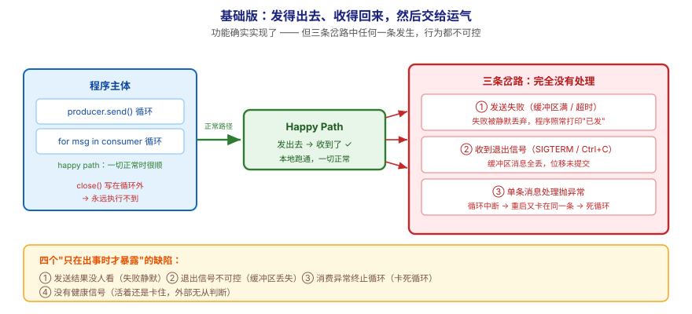
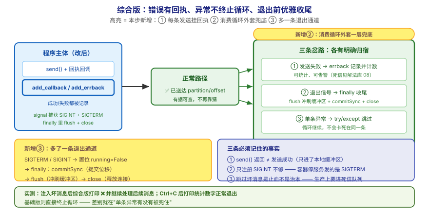

# 应用实战 · 代码开发实战

> 对应课程：[第 9 课：代码开发实战](../stages/4-实战与架构落地/lessons/lesson-09-代码开发实战.md) ｜ 覆盖知识点：选客户端与环境 / 写生产者 / 写消费者
> 定位：**会用，不上生产**——课里学完，在这里动手（结构与边界见 SKILL.md「教学叙事骨架 · 应用实战」）。
> 环境前提：第 3 课起的本机 Kafka（`localhost:9092`）；Python 3 + `kafka-python-ng`。
> 📖 结论已按官方文档核对（核对于 2026-09 ｜ 来源：Apache Kafka 4.x 文档 · client 章节 / `delivery.timeout.ms`）

## 场景：demo 跑通了，但没人敢把它放到服务器上

**场景**：你照着文档写了一个 producer + consumer，本地跑得挺好——发 10 条、收 10 条，一切正常。然后你把它部署到服务器上，第二天早上发现：**进程已经死了，或者是卡住不动了，而没人知道**。本课的知识点，就是用来把"能跑通的 demo"变成"能长期运行的程序"——**关键不在发送和接收，而在异常、关闭与可观测**。

**全貌一句话**：真实方案还需要**进程守护与重启策略**（systemd / K8s 的存活探针）、**结构化日志与指标上报**（课 15 的可观测）、**死信队列**（反复失败的消息如何隔离，场景解法库 08）——本课不展开，这里只让你先把"错误处理 + 优雅关闭 + 基本自检"这一层加上。

---

## ① 基础实现：发得出去、收得回来，然后就交给运气



> 看图：**左边**是程序主体：一个 `send()` 循环、一个 `for msg in consumer` 循环；**中间**那条绿色箭头是 happy path（一切正常时的路径）；**右边**是三条**完全没有处理**的岔路——发送失败、Broker 断了、收到退出信号。**这一版的核心变化是——功能确实实现了**，但**三条岔路中任何一条发生，程序的行为都不可控**。

```python
# demo_producer.py —— 基础版：能跑，但经不起意外
from kafka import KafkaProducer
import json
import time

producer = KafkaProducer(
    bootstrap_servers="localhost:9092",
    value_serializer=lambda v: json.dumps(v, ensure_ascii=False).encode("utf-8"),
)

n = 0
while True:
    n += 1
    producer.send("orders", value={"order_id": n, "user_id": "u1"})
    print(f"已发第 {n} 条")
    time.sleep(1)

# ⚠️ 注意：这个循环永远不结束，且下面这行永远执行不到
# producer.close()
```

```python
# demo_consumer.py —— 基础版：能跑，但经不起意外
from kafka import KafkaConsumer
import json

consumer = KafkaConsumer(
    "orders",
    bootstrap_servers="localhost:9092",
    group_id="demo-group",
    auto_offset_reset="earliest",
    value_deserializer=lambda v: json.loads(v.decode("utf-8")),
)

for msg in consumer:
    print(f"收到：{msg.value}")
```

> ⚠️ **它的问题**：**这一版有四个"只在出事时才暴露"的缺陷**——
> 1. **发送结果没人看**：`send()` 返回的是 Future，你没取结果。缓冲区满、Broker 不可达、消息超 `delivery.timeout.ms` 未送达时，**失败会被静默丢弃**——程序照常打印"已发第 N 条"，而那些消息从未到达。
> 2. **Ctrl+C 与 SIGTERM 的行为不可控**：直接在 `send()` 中途被杀 → 缓冲区里的消息**全部丢失**；`close()` 那行永远执行不到。而 K8s 停止 Pod、systemd 重启服务发的正是 SIGTERM。
> 3. **消费端异常会终止整个循环**：任何一条消息处理时抛异常（比如 JSON 字段缺失、`None` 参与运算），`for` 循环直接中断，**进程退出且位移未提交**——重启后从旧位移继续，再次在同一条消息上崩溃，形成"卡死循环"。
> 4. **没有任何健康信号**：程序是活着还是卡住了，外部无从判断——既没有日志心跳，也没有暴露"我已处理多少条"。

把第 3 条人为制造一次，你就能看到"卡死循环"长什么样：

```bash
# 往 orders 里塞一条"坏消息"（缺字段），再跑基础版消费者
echo '{"order_id": 999}' | docker exec -i kafka /opt/kafka/bin/kafka-console-producer.sh \
  --topic orders --bootstrap-server localhost:9092

python demo_consumer.py
# 若你的处理逻辑访问了不存在的字段 → 抛 KeyError → 循环中断、进程退出
```

---

## ② 综合实现：错误有回执、异常不终止循环、退出前优雅收尾



> 看图：**比上一张多了三处高亮**——① **每条发送都挂了回执**（蓝色箭头：成功/失败都会被记录，失败可进重试或死信）；② **消费循环外面套了一层"兜底"**（灰色框：单条处理异常被捕获并记录，**循环继续**，不会因一条坏消息整体停摆）；③ **多了一条退出通道**（右下：收到 SIGTERM/SIGINT → 先提交位移、再 `close()` 冲刷缓冲区 → 才退出）。**核心差别：从"只有 happy path"，变成"三条岔路各有明确归宿"。**

```python
# robust_producer.py —— 综合版：错误有回执 + 优雅关闭
from kafka import KafkaProducer
from kafka.errors import KafkaError
import json
import signal
import sys
import time

running = True


def _stop(signum, frame):
    """收到退出信号：先置位，让主循环有机会收尾"""
    global running
    print(f"\n收到信号 {signum}，准备优雅退出……")
    running = False


signal.signal(signal.SIGTERM, _stop)     # systemd / K8s 停止 Pod 发的是这个
signal.signal(signal.SIGINT, _stop)      # Ctrl+C

producer = KafkaProducer(
    bootstrap_servers="localhost:9092",
    acks="all",
    retries=3,
    enable_idempotence=True,
    linger_ms=20,
    key_serializer=lambda k: k.encode("utf-8"),
    value_serializer=lambda v: json.dumps(v, ensure_ascii=False).encode("utf-8"),
)

failures = []
n = 0
try:
    while running:
        n += 1
        future = producer.send(
            "orders", key="u1", value={"order_id": n, "user_id": "u1"}
        )
        # ① 关键：每条都挂回执，失败不再被静默吞掉
        future.add_callback(
            lambda md, i=n: print(f"✅ 第 {i} 条已送达 partition={md.partition} offset={md.offset}")
        ).add_errback(lambda e, i=n: failures.append((i, e)) or print(f"❌ 第 {i} 条发送失败：{e}"))
        time.sleep(0.5)
finally:
    # ③ 关键：退出前冲刷缓冲区，把还在攒批里的消息发出去
    producer.flush(timeout=10)
    producer.close()
    print(f"已优雅退出：共发送 {n} 条，失败 {len(failures)} 条")
    sys.exit(0)
```

```python
# robust_consumer.py —— 综合版：异常不终止循环 + 退出前提交位移
from kafka import KafkaConsumer
import json
import signal
import sys

running = True


def _stop(signum, frame):
    global running
    print(f"\n收到信号 {signum}，准备提交位移后退出……")
    running = False


signal.signal(signal.SIGTERM, _stop)
signal.signal(signal.SIGINT, _stop)

consumer = KafkaConsumer(
    "orders",
    bootstrap_servers="localhost:9092",
    group_id="demo-group-v2",
    enable_auto_commit=False,          # 手动提交：处理完再打卡
    auto_offset_reset="earliest",
    max_poll_records=20,
    value_deserializer=lambda v: json.loads(v.decode("utf-8")),
)

processed = failed = 0
try:
    while running:
        records = consumer.poll(timeout_ms=1000, max_records=20)
        if not records:
            continue
        for tp, msgs in records.items():
            for msg in msgs:
                try:
                    # ② 关键：单条处理失败不终止整个循环
                    order = msg.value
                    _ = order["user_id"]          # 故意访问可能缺失的字段
                    processed += 1
                    print(f"✅ 已处理 {order}（{tp.partition} @ {msg.offset}）")
                except Exception as e:
                    failed += 1
                    # 真实项目里这里应写入死信队列，而不是只打印
                    print(f"❌ 处理失败，跳过该条：{e}（{tp.partition} @ {msg.offset}）")
        consumer.commitSync()          # 本批处理完再打卡
finally:
    consumer.commitSync()
    consumer.close()
    print(f"已优雅退出：成功 {processed} 条，失败 {failed} 条")
    sys.exit(0)
```

验证"异常不再导致卡死循环"——把那条坏消息再消费一次：

```bash
python robust_consumer.py
# 期望：坏消息被打印为❌并跳过，循环继续处理后续消息
# 结束后 Ctrl+C：应打印"提交位移后退出"与统计数字，而不是直接崩掉
```

> ✅ **本机实测**（WSL Ubuntu · Python 3 + `kafka-python-ng`，连本机 `apache/kafka:4.0.0`，2026-09-16 跑通）：注入坏消息后，综合版消费者**打印 ❌ 并继续处理后续消息**，未出现中断；`Ctrl+C` 后打印统计数字并正常退出。基础版则在遇到坏消息时直接终止循环。

**这段代码把基础版的四个问题逐个解决掉了**：

| 基础版的问题 | 综合版怎么解决 | 对应本课知识点 |
|---|---|---|
| 发送结果没人看 | 每条挂 `add_callback` / `add_errback`，失败可统计 | 写生产者 |
| Ctrl+C / SIGTERM 不可控 | `signal` 捕获 + `finally` 里 `flush()` + `close()` | 选客户端与环境 |
| 消费端异常终止循环 | 单条处理包 try/except，坏消息跳过而不停摆 | 写消费者 |
| 没有健康信号 | 打印成功/失败计数，可作为最简自检 | 可观测（课 15 展开） |

> 🔴 **三条必须记住的事实**：
> 1. **`send()` 返回 ≠ 发送成功**。它只代表消息进了**本地缓冲区**；不看 Future、不 `flush()`、不 `close()` 就退出进程，消息可能从未发出。这是本课最高频的新手事故。
> 2. **注册信号只处理 SIGINT 是不够的**。`SIGTERM` 才是 systemd / K8s 停止服务时发的信号；只注册 `SIGINT`（Ctrl+C）在容器里等于没做优雅关闭。
> 3. **"跳过坏消息"是止血，不是治本**。生产上应该把失败消息**写进死信队列**（另一个 topic）并告警，而不是只打印一行——否则失败会静默累积。死信设计见场景解法库 08。

> ⏳ **数字来源说明**：`linger_ms=20` / `max_poll_records=20` / `flush(timeout=10)` 是**演示用取值**，不是推荐值。真实取值按你的吞吐与"能容忍多少毫秒延迟"压测决定；`flush` 的超时尤其要在真实环境验证（超时太长会拖慢停机）。

> ⚠️ **Windows 提示**：`signal.SIGTERM` 在 Windows 上无法通过 `Ctrl+C` 触发（那是 `SIGINT`）。上面的代码在 Linux/macOS 容器里行为完整，Windows 本机练手时可用 `SIGINT` 路径验证；部署到 Linux 服务器才是它的真正用武之地。

> 🎯 **会用标志**：给你一个"能跑通但要部署上线"的 producer/consumer，你能指出哪四处会在出事时失控，并能加上回执处理、异常兜底、信号处理与退出前冲刷——说清每处防的是什么。

## 🧭 导航

- ⬅️ 回到课程：[第 9 课：代码开发实战](../stages/4-实战与架构落地/lessons/lesson-09-代码开发实战.md)
- 📚 全部实战：[应用实战索引](INDEX.md)
- ⬅️ 上一课实战：[08 · 交付语义与幂等](08-交付语义与幂等.md)
- ➡️ 下一课实战：[10 · 项目架构设计落地](10-项目架构设计落地.md)
