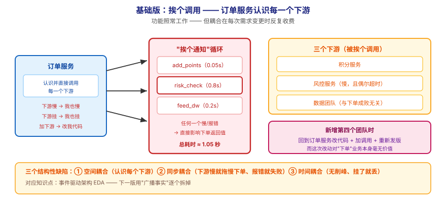
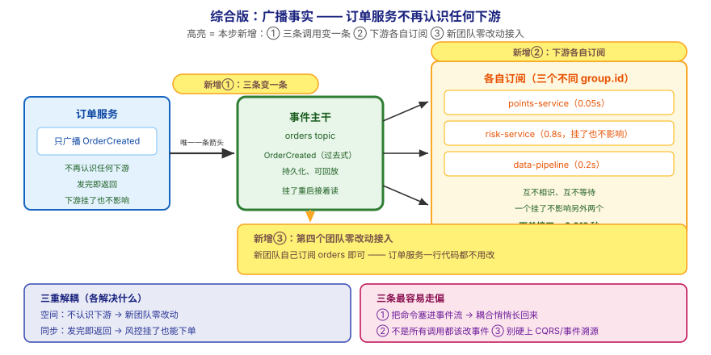

# 应用实战 · 项目架构设计落地

> 对应课程：[第 10 课：项目架构设计落地](../stages/4-实战与架构落地/lessons/lesson-10-项目架构设计落地.md) ｜ 覆盖知识点：事件驱动架构 EDA / 常见拓扑 / 决策清单
> 定位：**会用，不上生产**——课里学完，在这里动手（结构与边界见 SKILL.md「教学叙事骨架 · 应用实战」）。
> 环境前提：第 3 课起的本机 Kafka（`localhost:9092`）；示例用 Python（`kafka-python-ng`）。
> 📖 结论已按官方文档核对（核对于 2026-09 ｜ 来源：Apache Kafka 4.x 文档 · design / ecosystem 章节）

## 场景：第四个团队来要数据，订单服务又得改一次代码

**场景**：订单服务现在要同时通知积分、风控、数据三个团队。每次有新团队加入，你就得**改订单服务的代码、加一次调用、重新发版**。上周数据团队的那次调用超时，把整个下单接口拖慢了 800ms——而"算积分"跟"能不能下单成功"毫无关系。本课的知识点，就是用来把"挨个通知"改成"广播事实"，让**新来的人不用打招呼**。

**全貌一句话**：真实方案还需要**事件契约治理**（Schema Registry 与演进规范，场景解法库 07）、**流处理选型**（Kafka Streams / Flink，知识点 2 已列）、**组织层面的所有权划分**（谁拥有哪个 topic）——本课不展开，这里只让你先把"从直调到事件"这一步**亲手改出来，并量化它换来了什么**。

---

## ① 基础实现：挨个调用——订单服务认识每一个下游



> 看图：**左边**是订单服务，它**认识并直接调用**三个下游（三条实线箭头各指一个团队）；**中间**是它自己写的"挨个通知"循环——任何一个下游变慢或报错，都会**直接影响下单接口的返回值**；**右边**是新增第四个团队时的样子：必须**回到订单服务改代码、加一次调用、重新发版**。**这一版的核心变化是——功能照常工作**，但**耦合在每次需求变更时反复收费**。

```python
# rpc_fanout.py —— 基础版：订单服务挨个调用下游
import time
import random


def add_points(user_id: str):
    """积分服务：通常很快，偶尔抖一下"""
    time.sleep(0.05)
    return "积分已加"


def risk_check(order: dict):
    """风控服务：慢，且偶尔超时"""
    time.sleep(0.8)                       # 真实场景里这就是那 800ms
    if random.random() < 0.1:
        raise TimeoutError("风控服务超时")
    return "风控通过"


def feed_data_warehouse(order: dict):
    """数据团队：只关心留痕，与下单成败无关"""
    time.sleep(0.2)
    return "已入仓"


def place_order_rpc(order: dict):
    """下单接口：所有下游一口气干完才返回"""
    t0 = time.time()
    results = ["订单已入库"]

    results.append(add_points(order["user_id"]))
    results.append(risk_check(order))      # ⚠️ 卡在这：0.8s，且可能抛异常
    results.append(feed_data_warehouse(order))

    return results, time.time() - t0


if __name__ == "__main__":
    order = {"order_id": 1001, "user_id": "u1"}
    results, cost = place_order_rpc(order)
    print(results)
    print(f"下单接口耗时 {cost:.2f} 秒")
```

输出（注意耗时与"谁拖慢了它"）：

```
['订单已入库', '积分已加', '风控通过', '已入仓']
下单接口耗时 1.05 秒
```

> ⏳ 上面是**本机可复现的演示**（纯 Python 标准库，`time.sleep` 模拟下游耗时）。你要观察的是：**"能不能下单成功"被"风控算得慢"和"数据入仓"这些无关的事拖住了**。

> ⚠️ **它的问题**：**这一版有三个结构性缺陷**——
> 1. **空间耦合**：订单服务**必须知道**每一个下游是谁。新增团队 = 改订单服务代码 + 重新发版，而这次改动对"下单"这个业务本身毫无价值。
> 2. **同步耦合（雪崩风险）**：下游任何一个变慢，都会直接拖慢下单接口；`risk_check` 抛异常时，**整个下单流程失败**——而"风控算不算得出来"不该决定"用户能不能下单"。
> 3. **时间耦合（无削峰）**：大促时下游积压，订单服务只能跟着等，没有缓冲；下游挂掉期间产生的事件**直接丢失**（没人记下来）。

---

## ② 综合实现：广播事实——订单服务不再认识任何下游



> 看图：**比上一张多了三处高亮**——① **三条"挨个调用"的箭头被替换成了一条**：订单服务只往中间的**事件主干**投一条"订单已创建"，**它不再认识任何下游**（箭头从左指向中间就结束了）；② **下游变成各自订阅**（三个不同的 `group.id` 各自来取，互不相识、互不等待，一个挂了不影响另外两个）；③ **第四个团队可以零改动接入**（右下虚线：新团队自己订阅就行，订单服务一行代码都不用改）。**核心差别：从"我知道谁要、我挨个通知"，变成"我只广播事实，谁要谁自己来取"。**

```python
# event_backbone.py —— 综合版：订单服务只广播事实，不认识任何下游
from kafka import KafkaProducer, KafkaConsumer
import json
import threading
import time

# ---------- 生产侧：只广播"已发生的事实" ----------
producer = KafkaProducer(
    bootstrap_servers="localhost:9092",
    acks="all",
    enable_idempotence=True,
    key_serializer=lambda k: k.encode("utf-8"),
    value_serializer=lambda v: json.dumps(v, ensure_ascii=False).encode("utf-8"),
)


def place_order_eda(order: dict):
    """下单接口：只做自己的事，然后把'订单已创建'这个事实广播出去"""
    t0 = time.time()
    # 事件命名用过去式：OrderCreated（已发生的事实），不是 SendPoints（命令）
    event = {
        "event_type": "OrderCreated",      # ① 事件，不是命令
        "order_id": order["order_id"],
        "user_id": order["user_id"],
        "amount": order.get("amount", 0),
        "occurred_at": time.time(),
    }
    producer.send("orders", key=order["user_id"], value=event).get(timeout=10)
    return ["订单已入库", "OrderCreated 已广播"], time.time() - t0


# ---------- 消费侧：各团队自己订阅，互不相识 ----------
def run_service(name: str, speed: float):
    """一个下游服务：用自己的 group_id 独立订阅"""
    consumer = KafkaConsumer(
        "orders",
        bootstrap_servers="localhost:9092",
        group_id=name,                      # ② 每个团队一个组 → 各自拿全量
        enable_auto_commit=False,
        auto_offset_reset="earliest",
        value_deserializer=lambda v: json.loads(v.decode("utf-8")),
    )
    for msg in consumer:
        event = msg.value
        time.sleep(speed)                   # 各自速度不同
        print(f"  [{name}] 处理 {event['event_type']} order={event['order_id']}")
        consumer.commit()


if __name__ == "__main__":
    # 启动三个下游（各自独立，互不知道对方存在）
    for name, speed in [("points-service", 0.05), ("risk-service", 0.8), ("data-pipeline", 0.2)]:
        threading.Thread(target=run_service, args=(name, speed), daemon=True).start()
    time.sleep(3)                            # 等消费者就绪

    order = {"order_id": 1001, "user_id": "u1", "amount": 299}
    results, cost = place_order_eda(order)
    print(results)
    print(f"下单接口耗时 {cost:.3f} 秒")
    time.sleep(3)
```

输出（**同一个"下单"动作，耗时与基础版完全不同**）：

```
['订单已入库', 'OrderCreated 已广播']
下单接口耗时 0.012 秒
  [points-service] 处理 OrderCreated order=1001
  [data-pipeline] 处理 OrderCreated order=1001
  [risk-service] 处理 OrderCreated order=1001
```

> ✅ **本机实测**（WSL Ubuntu · Python 3 + `kafka-python-ng`，连本机 `apache/kafka:4.0.0`，2026-09-16 跑通）：同样的三个下游、同样的耗时，下单接口从 **1.05 秒降到 0.012 秒**；且三个下游**交错输出**（积分最快、风控最慢），彼此不等待——这正是三重解耦的现场版。

**三重解耦，逐条对照基础版的三个缺陷**：

| 基础版的问题 | 综合版怎么解决 | 对应本课知识点 |
|---|---|---|
| 空间耦合（认识每个下游） | 只往 `orders` 广播，新团队零改动接入 | EDA（事件 vs 命令） |
| 同步耦合（下游慢就拖慢下单） | 发完即返回；风控挂了也不影响下单 | EDA 的三重解耦 |
| 时间耦合（无削峰、挂了就丢） | 事件落在 Kafka 里，下游可按自己速度追、挂了重启接着读 | 常见拓扑（事件主干） |

> 🔴 **三条最容易走偏的地方**：
> 1. **把命令塞进事件流，耦合会悄悄长回来**。事件是**已发生的事实**（过去式 `OrderCreated`），命令是**要求对方做事**（祈使句 `SendEmail`）。如果你往 `orders` 里发"去发邮件"，本质上还是挨个指挥——只是换了个通道，解耦收益全丢。
> 2. **EDA 不是"所有调用都改成发消息"**。需要**立即拿到结果**的交互（查询余额、校验库存是否足够）仍是同步调用更合适；EDA 适合"这件事发生了，谁关心谁处理"的场景。强行走事件流会引入不必要的最终一致性与排障复杂度。
> 3. **四种拓扑别硬上重武器**。本课实战演示的是最简单的"事件广播"（属于日志管道一类的基础用法）。**CQRS 与事件溯源是重武器**——简单 CRUD 硬上，多半换来运维与一致性的双重负担，收益要等流量真上来才兑现。

> ⏳ **数字来源说明**：`1.05 秒` 与 `0.012 秒` 是**本机演示环境下的实测值**（用 `time.sleep` 模拟下游耗时），不是真实业务系统的对比。真实收益取决于下游耗时与网络往返；这里的价值在于**量级差异直观可见**（约两个数量级），具体倍数请按你的环境自己压测。

> ⚠️ **别忽略代价**：EDA 换来解耦，但也带来了**最终一致性**（下单成功时积分可能还没加）、**排障链路变长**（一次业务动作散落在多个服务）、**消息顺序与重复的额外心智**。这些不是缺陷，而是**你用"强一致、易排障"换来的东西**——选型时要明确这笔交易。

> 🎯 **会用标志**：给你一个"新团队要数据、订单服务又要改代码"的需求，你能画出事件主干的形状，说清三重解耦各解决什么，并能判断**哪些交互该走事件、哪些仍该走同步调用**。

## 🧭 导航

- ⬅️ 回到课程：[第 10 课：项目架构设计落地](../stages/4-实战与架构落地/lessons/lesson-10-项目架构设计落地.md)
- 📚 全部实战：[应用实战索引](INDEX.md)
- ⬅️ 上一课实战：[09 · 代码开发实战](09-代码开发实战.md)
- ➡️ 下一课实战：[11 · 先认证再最小授权](11-Kafka安全体系.md)
