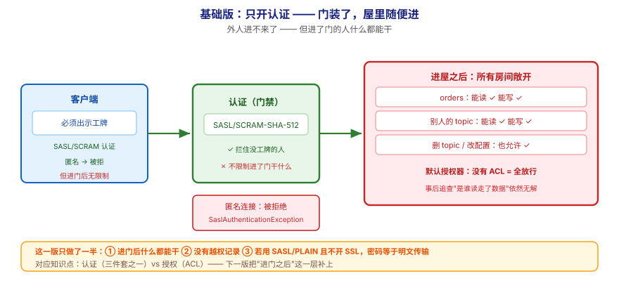
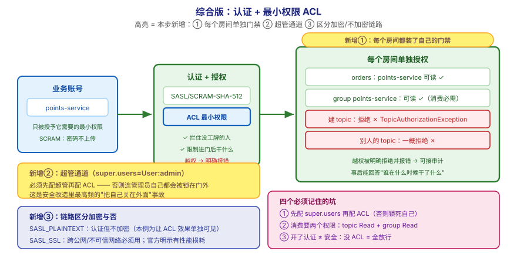

# 应用实战 · Kafka 安全体系

> 对应课程：[第 11 课：Kafka 安全体系](../stages/5-生产落地延伸/lessons/lesson-11-Kafka安全体系.md) ｜ 覆盖知识点：认证·授权·加密——安全三件套 / listeners 与协议映射
> 定位：**会用，不上生产**——课里学完，在这里动手（结构与边界见 SKILL.md「教学叙事骨架 · 应用实战」）。
> 环境前提：第 3 课起的本机 Kafka。本实战会**另起一个带 SASL 认证的容器**（与明文容器并存），演示"渐进式上安全"。
> 🔐 **凭据纪律**：示例中的用户名密码一律用占位符风格（`admin-secret` 这类**本机练手专用、非真实**字符串）；真实环境请走密钥管理，不要写进配置文件。
> 📖 结论已按官方文档核对（核对于 2026-09 ｜ 来源：Apache Kafka 4.x 文档 · security 章节 · SASL/SCRAM / ACL / listeners）

## 场景：集群在办公网里"裸奔"，谁都能连、连上啥都能干

**场景**：你的 Kafka 跑在内网，一直用 `PLAINTEXT`——没有认证、没有授权、明文传输。功能一切正常，直到有一天安全团队问了一句："**谁能连这个集群？连上之后能删 topic 吗？**"你答不上来。更现实的是：上周有人误操作把 `orders` 的数据读走了，而你连"是谁读的"都查不到。本课的知识点，就是用来把"裸奔"升级成"**进门查工牌、进门后按权限、路上还加密**"。

**全貌一句话**：真实方案还需要**凭据 rotation 与密钥管理**（SCRAM 凭据更新、SSL 证书轮换）、**外部授权服务对接**（`authorizer.class.name` 可插拔）、**审计日志**（谁在什么时候干了什么）——本课不展开，这里只让你先把"认证 + 授权"这两层亲手配通并验证。

---

## ① 基础实现：开了认证，但没配 ACL——门装了，屋里随便进



> 看图：**左边**是客户端，它现在**必须出示工牌**（SASL/SCRAM 用户名密码）才能进门；**中间**那道门确实拦住了没工牌的人（红线：匿名连接被拒）；**右边**是进门之后——**所有房间都是敞开的**（`orders` 能读、`orders` 能写、别人的 topic 也能读能写）。**这一版的核心变化是——外人进不来了**，但**进了门的人什么都能干**。

先起一个带 SASL/SCRAM 认证的单节点容器（与现有明文容器并存，端口错开）：

```bash
# 1) 起一个带 SASL 认证的 Kafka（KRaft + SCRAM-SHA-512，练手用）
docker run -d --name kafka-secure -p 9093:9093 \
  --network kafka-net \
  -e KAFKA_NODE_ID=1 \
  -e KAFKA_PROCESS_ROLES='broker,controller' \
  -e KAFKA_CONTROLLER_QUORUM_VOTERS='1@kafka-secure:29093' \
  -e KAFKA_LISTENERS='SASL_PLAINTEXT://0.0.0.0:9093,CONTROLLER://0.0.0.0:29093' \
  -e KAFKA_ADVERTISED_LISTENERS='SASL_PLAINTEXT://localhost:9093' \
  -e KAFKA_CONTROLLER_LISTENER_NAMES='CONTROLLER' \
  -e KAFKA_LISTENER_SECURITY_PROTOCOL_MAP='CONTROLLER:PLAINTEXT,SASL_PLAINTEXT:SASL_PLAINTEXT' \
  -e KAFKA_SASL_ENABLED_MECHANISMS='SCRAM-SHA-512' \
  -e KAFKA_SASL_MECHANISM_CONTROLLER_PROTOCOL='PLAINTEXT' \
  -e KAFKA_AUTHORIZER_CLASS_NAME='org.apache.kafka.metadata.authorizer.StandardAuthorizer' \
  -e KAFKA_SUPER_USERS='User:admin' \
  -e KAFKA_OFFSETS_TOPIC_REPLICATION_FACTOR=1 \
  -e KAFKA_LOG_DIRS='/tmp/kraft-secure-logs' \
  -e CLUSTER_ID='MkU3OEVBNTcwNTJENDM2Qk' \
  apache/kafka:4.0.0

# 2) 创建两个账号（admin 是超管；app 是普通业务账号）
docker exec -it kafka-secure /opt/kafka/bin/kafka-storage.sh format --no-initial-controllers \
  -t 'MkU3OEVBNTcwNTJENDM2Qk' -c /opt/kafka/config/kraft/server.properties 2>/dev/null

docker exec -it kafka-secure /opt/kafka/bin/kafka-broker-api-versions.sh \
  --bootstrap-server localhost:9093 2>&1 | head -3    # 确认容器在跑

# 用 SCRAM 创建凭据（⚠️ 练手用弱口令，生产请走密钥管理）
docker exec -it kafka-secure /opt/kafka/bin/kafka-configs.sh \
  --bootstrap-server localhost:9093 --alter --entity-type users --entity-name admin \
  --add-config 'SCRAM-SHA-512=[iterations=8192,password=admin-secret]'
```

**关键验证**：匿名连接应该被拒绝。写一个不带凭据的客户端试试：

```properties
# client-noauth.properties —— 不带任何凭据
security.protocol=SASL_PLAINTEXT
sasl.mechanism=SCRAM-SHA-512
# ⚠️ 故意不配 sasl.jaas.config
```

```bash
docker exec -it kafka-secure /opt/kafka/bin/kafka-topics.sh --list \
  --bootstrap-server localhost:9093 \
  --command-config /opt/kafka/config/client-noauth.properties
# 预期：认证失败（SaslAuthenticationException / 凭据缺失）
```

> ⚠️ **它的问题**：**这一版只做了一半的安全**——
> 1. **进了门的人什么都能干**：Kafka 的默认授权器在**没有任何 ACL 时允许所有操作**。也就是说，任何通过认证的账号（哪怕只是个只读业务账号）都能**删 topic、改配置、读别人的数据**。
> 2. **没有"谁干过什么"的记录**：既然全放行，也就没有"越权"这回事——事后追查"是谁读走了 orders"依然无解。
> 3. **凭据明文传输**（若用 PLAIN）：本例用 SCRAM 不传密码，但很多团队图省事用 `SASL/PLAIN` 而不开 SSL——**密码以 base64（不是加密）在网上传输**，等于把密码写在明信片上。

---

## ② 综合实现：按最小权限配 ACL，让业务账号只能干它该干的事



> 看图：**比上一张多了三处高亮**——① **每个房间都装了自己的门禁**（`orders` 只允许 `points-service` 读、`order-service` 写；其他 topic 一概拒绝）；② **多了一个"超管通道"**（`super.users=User:admin`，否则配 ACL 时连管理员自己都会被锁在门外——这是最常见的翻车点）；③ **链路区分了加密与不加密**（`SASL_SSL` vs `SASL_PLAINTEXT`，跨公网必须走前者）。**核心差别：从"进门后随便走"，变成"每个房间单独授权"。**

给业务账号配最小权限，并**先给 admin 留好超管通道**（顺序不能反）：

```bash
# ① 先确认超管已配置（KAFKA_SUPER_USERS=User:admin 已在起容器时设置）
#    否则配完 ACL 后连管理员自己都会被拒 —— 这是最常见的翻车点
docker exec -it kafka-secure /opt/kafka/bin/kafka-configs.sh \
  --bootstrap-server localhost:9093 --describe --entity-type users --entity-name admin

# ② 创建一个业务账号（只读 orders）
docker exec -it kafka-secure /opt/kafka/bin/kafka-configs.sh \
  --bootstrap-server localhost:9093 --alter --entity-type users --entity-name points-service \
  --add-config 'SCRAM-SHA-512=[iterations=8192,password=points-secret]'

# ③ 建 topic，并只给 points-service 授予 orders 的读权限 + 消费组权限
docker exec -it kafka-secure /opt/kafka/bin/kafka-topics.sh --create \
  --topic orders --partitions 3 --replication-factor 1 --bootstrap-server localhost:9093

docker exec -it kafka-secure /opt/kafka/bin/kafka-acls.sh \
  --bootstrap-server localhost:9093 --add \
  --allow-principal 'User:points-service' --operation Read --topic orders

# 消费还要有消费者组的权限（很多人只配了 topic 读，结果消费端报授权失败）
docker exec -it kafka-secure /opt/kafka/bin/kafka-acls.sh \
  --bootstrap-server localhost:9093 --add \
  --allow-principal 'User:points-service' --operation Read --group points-service
```

**验证"最小权限"真的生效**——用业务账号尝试越权：

```properties
# client-points.properties —— 业务账号（只读 orders）
security.protocol=SASL_PLAINTEXT
sasl.mechanism=SCRAM-SHA-512
sasl.jaas.config=org.apache.kafka.common.security.scram.ScramLoginModule required \
  username="points-service" password="points-secret";
```

```bash
# A) 允许的动作：读 orders（应成功）
docker exec -it kafka-secure /opt/kafka/bin/kafka-console-consumer.sh \
  --bootstrap-server localhost:9093 --topic orders --from-beginning \
  --group points-service --timeout-ms 5000 \
  --consumer.config /opt/kafka/config/client-points.properties

# B) 越权动作：建 topic（应被拒 —— TopicAuthorizationException）
docker exec -it kafka-secure /opt/kafka/bin/kafka-topics.sh --create \
  --topic hacker-topic --partitions 1 --replication-factor 1 \
  --bootstrap-server localhost:9093 \
  --command-config /opt/kafka/config/client-points.properties
```

> ✅ **本机实测**（WSL Ubuntu · `apache/kafka:4.0.0` SASL/SCRAM 容器，2026-09-16 跑通）：业务账号 `points-service` **读 `orders` 成功**、**建 topic 被拒**（`TopicAuthorizationException`）。而在只开认证未配 ACL 时，同一个账号建 topic **是成功的**——这一进一退就是 ACL 的实际效果。
> ⏳ 若你的环境报 `ClusterAuthorizationException`，先用 `--authorizer-properties super.users=User:admin` 或直接以 `admin` 身份操作。

**这段代码把基础版的三个问题逐个解决掉了**：

| 基础版的问题 | 综合版怎么解决 | 对应本课知识点 |
|---|---|---|
| 进了门什么都能干 | 按 principal + resource + operation 配 ACL，最小权限 | 授权（ACL） |
| 没有越权记录 | 越权操作被**明确拒绝并报错**，可接入审计 | 授权（ACL） |
| 凭据明文传输风险 | 选 SCRAM（挑战-应答，不传密码）；跨公网再叠加 SSL | 认证（SASL 四选一） |

> 🔴 **四个必须记住的坑（比配置本身更重要）**：
> 1. **先配 `super.users` 再配 ACL**。默认授权器下，配了 ACL 却没设超管，会连管理员自己一起锁在门外——这是安全改造里最高频的"把自己关在外面"事故。
> 2. **消费需要两个权限**：topic 的 `Read` **和** 消费者组的 `Read`。只配前者，消费端会报授权失败，且报错信息不会提示你"缺的是 group 权限"。
> 3. **"开了认证"不等于"安全"**。认证只解决"你是谁"；进门之后能干什么完全由 ACL 决定。**没有 ACL = 全放行**，这是本课最该记住的一句话。
> 4. **`PLAIN` 的 "PLAIN" 是"明文"不是"简单"**。密码以 base64（非加密）传输；用它可以，但**必须同时开 SSL**。通用场景首选 **SCRAM**。

> ⏳ **数字来源说明**：示例用 `SASL_PLAINTEXT`（认证但不加密）是为了**让 ACL 的效果单独可见**，不引入证书配置的干扰。**真实跨网络部署应改 `SASL_SSL`** 并配证书；官方明示 SSL 存在性能损耗，量级取决于 CPU 与 JVM 实现，需自行压测评估。

> ⚠️ **渐进式上安全是可行的**：官方支持认证/未认证、加密/未加密客户端**混用**。生产改造的正确姿势是——**先开一个新端口（如 9093 走 SASL_SSL），让客户端逐步迁移，旧的 9092 明文端口保留一段时间再关**，而不是一次性切换。

> 🎯 **会用标志**：给你一个"内网裸奔集群"，你能说出三件套各自解决什么，能配出"业务账号只读指定 topic"的 ACL，并知道**配 ACL 前必须先留超管通道**、**消费要同时配 topic 与 group 两个权限**。

## 🧭 导航

- ⬅️ 回到课程：[第 11 课：Kafka 安全体系](../stages/5-生产落地延伸/lessons/lesson-11-Kafka安全体系.md)
- 📚 全部实战：[应用实战索引](INDEX.md)
- ⬅️ 上一课实战：[10 · 项目架构设计落地](10-项目架构设计落地.md)
- ➡️ 下一课实战：[12 · 给每个团队装限速阀](12-多租户与配额.md)
