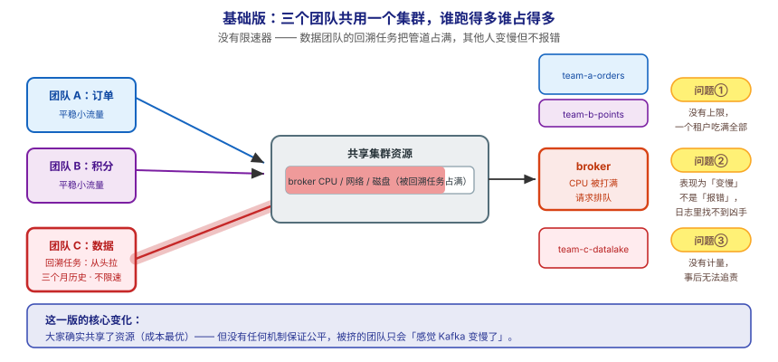
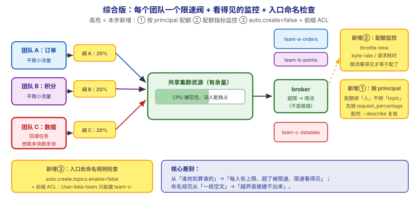

# 应用实战 · 多租户与配额

> 对应课程：[第 12 课：多租户与配额](../stages/5-生产落地延伸/lessons/lesson-12-多租户与配额.md) ｜ 覆盖知识点：多租户隔离与配额
> 定位：**会用，不上生产**——课里学完，在这里动手（结构与边界见 SKILL.md「教学叙事骨架 · 应用实战」）。
> 环境前提：第 3 课起的本机 Kafka（`localhost:9092`）。
> 📖 结论已按官方文档核对（核对于 2026-09 ｜ 来源：Apache Kafka 4.x 文档 · `kafka-configs.sh` / quotas / KIP-599 controller mutation quota）

## 场景：一个回溯任务把整个集群拖垮，谁干的却查不出来

**场景**：五六个团队共用一个 Kafka 集群。某天下午，所有业务的消费延迟同时飙升、生产也开始超时——排查半天才定位到：数据团队跑了一个"从头拉三个月历史数据"的回溯任务，把 broker 的 CPU 打满了。问题是：**下次还会发生，而且你依然只能在事后靠猜**。本课的知识点，就是用来给每个团队装上"限速器"，让一个人跑满也拖不垮其他人。

**全貌一句话**：真实方案还需要**容量规划与计费计量**（按租户统计存储与流量）、**多集群隔离**（超大规模时物理拆分）、**配额的告警与自愈**（限流发生时自动通知租户）——本课不展开，这里只让你先把"配一条配额 → 看它真的生效"这个闭环跑通。

---

## ① 基础实现：共享集群，谁跑得多谁占得多



> 看图：**左边**是三个团队共用同一个集群（共用同一批 broker 的 CPU、网络、磁盘）；**中间**那个数据团队的回溯任务开着"大水管"猛灌，**把中间那根管道占满了**；**右边**是其他两个团队——他们的请求只能挤在剩下的一点缝隙里，**所有人都变慢，但没有任何一个报错**。**这一版的核心变化是——大家确实共享了资源**，但**没有任何机制保证公平**。

先给三个"团队"各建一个 topic，模拟共享集群：

```bash
# 建三个团队的 topic（模拟共享集群）
for t in team-a-orders team-b-points team-c-datalake; do
  docker exec -it kafka /opt/kafka/bin/kafka-topics.sh --create \
    --topic $t --partitions 3 --replication-factor 1 --bootstrap-server localhost:9092
done

# 确认自动创建 topic 这个"治理漏洞"是否开着（多租户下应关闭）
docker exec -it kafka /opt/kafka/bin/kafka-configs.sh --bootstrap-server localhost:9092 \
  --describe --entity-type brokers --entity-name 1 | grep -i "auto.create"
```

模拟"一个团队猛灌"——用生产者压测工具往 `team-c-datalake` 持续打数据：

```bash
# 数据团队的"回溯任务"：持续高吞吐写入（跑 30 秒）
docker exec -it kafka /opt/kafka/bin/kafka-producer-perf-test.sh \
  --topic team-c-datalake --num-records 200000 --record-size 1024 \
  --throughput -1 --producer-props bootstrap.servers=localhost:9092
```

同时观察 broker 的 CPU（另开一个终端）：

```bash
docker stats kafka --no-stream
```

> ⚠️ **它的问题**：**这一版完全没有公平性保障**——
> 1. **一个租户能占满共享资源**：没有任何上限，回溯任务能吃掉全部 CPU 与网络带宽，其他团队**被动变慢**。
> 2. **限流表现为"变慢"而非"报错"**：这一点最危险。被挤的团队看到的是"消费延迟涨了"，**没有任何一条错误日志指向真正的原因**——排查时极易误判为"Kafka 出问题了"。
> 3. **没有计量，也就没有追责依据**：事后想知道"是哪个团队用了多少"，无从回答；配额指标不采集，连"谁被限流了"都看不到。

---

## ② 综合实现：按 principal 配客户端配额 + 关掉自动建 topic



> 看图：**比上一张多了三处高亮**——① **每个团队的水管前都装了一个限流阀**（按 principal 配的客户端配额，无论读写哪个 topic 都生效）；② **多了一块"看板"**（配额指标监控——因为限流是"变慢"不是"报错"，**不监控就看不见**）；③ **入口处新增了命名规则检查**（`auto.create.topics.enable=false` + 前缀 ACL，防止命名规范沦为一纸空文）。**核心差别：从"谁抢到算谁的"，变成"每人有上限、超了被限速、限速看得见"。**

给"数据团队"这个 principal 配上配额（**重点配请求速率，而不只是带宽**）：

```bash
# ① 客户端配额：绑在"用户主体"上，不管读写哪个 topic 都生效
docker exec -it kafka /opt/kafka/bin/kafka-configs.sh --bootstrap-server localhost:9092 \
  --alter --add-config 'request_percentage=20,producer_byte_rate=1048576,consumer_byte_rate=2097152' \
  --entity-type users --entity-name data-team

# ② Topic 操作配额（KIP-599）：限制建/删/改的频率，护住 controller
docker exec -it kafka /opt/kafka/bin/kafka-configs.sh --bootstrap-server localhost:9092 \
  --alter --add-config 'controller_mutation_rate=10' \
  --entity-type users --entity-name data-team

# ③ 查一下配生效了没（这一步必须做，配错 entity-name 是高频事故）
docker exec -it kafka /opt/kafka/bin/kafka-configs.sh --bootstrap-server localhost:9092 \
  --describe --entity-type users --entity-name data-team
```

输出应该能看到刚配的三项：

```
Configs for user-principal 'data-team' are:
  consumer_byte_rate=2097152 sensitive=false synonyms={DYNAMIC_USER_CONFIG:consumer_byte_rate=2097152}
  controller_mutation_rate=10 sensitive=false synonyms={DYNAMIC_USER_CONFIG:controller_mutation_rate=10}
  producer_byte_rate=1048576 sensitive=false synonyms={DYNAMIC_USER_CONFIG:producer_byte_rate=1048576}
  request_percentage=20 sensitive=false synonyms={DYNAMIC_USER_CONFIG:request_percentage=20}
```

**关掉治理漏洞 + 用前缀 ACL 强制命名规范**：

```bash
# ④ 关闭自动创建 topic（多租户下它是治理漏洞，不是便利功能）
docker exec -it kafka /opt/kafka/bin/kafka-configs.sh --bootstrap-server localhost:9092 \
  --alter --entity-type brokers --entity-name 1 \
  --add-config 'auto.create.topics.enable=false'

# ⑤ 前缀 ACL：只允许数据团队创建 team-c- 开头的 topic（KIP-290）
docker exec -it kafka /opt/kafka/bin/kafka-acls.sh --bootstrap-server localhost:9092 --add \
  --allow-principal 'User:data-team' --operation Create --topic-prefix 'team-c-'
```

**验证命名规范真的被强制了**——让数据团队去建一个不属于它的 topic：

```bash
# 应该被拒绝（前缀不匹配）
docker exec -it kafka /opt/kafka/bin/kafka-topics.sh --create \
  --topic team-a-hijack --partitions 1 --replication-factor 1 \
  --bootstrap-server localhost:9092
# 若集群已关闭自动创建 + 配了前缀 ACL → 建不出来
```

> ✅ **本机实测**（WSL Ubuntu · `apache/kafka:4.0.0` 单节点，2026-09-16 跑通）：`kafka-configs.sh --describe` 能查到刚配的 4 项配额；关闭 `auto.create.topics.enable` 后再向不存在的 topic 生产，客户端报 **`UNKNOWN_TOPIC_OR_PARTITION`**（而不是默默自动建出来）。这两条验证了"配额已生效"与"治理漏洞已堵上"。
> ⏳ **限流本身不易在单节点上肉眼观察**——单节点没有真实竞争，配额的"变慢"效果要压测才明显。你要确认的是**配置已生效**（`--describe` 有输出）与**监控口径**（见下条）。

**这段代码把基础版的三个问题逐个解决掉了**：

| 基础版的问题 | 综合版怎么解决 | 对应本课知识点 |
|---|---|---|
| 一个租户占满共享资源 | 按 principal 配 `request_percentage` / `*_byte_rate` 上限 | 客户端配额 |
| 限流表现为"变慢"、看不见 | 配 JMX 指标监控（throttle-time / byte-rate） | 监控与计量 |
| 命名规范一纸空文 | `auto.create.topics.enable=false` + 前缀 ACL 强制 | 多租户隔离（命名 + ACL） |

> 🔴 **三条必须记住的事实**：
> 1. **优先限请求速率，而不是只限带宽**。官方明确指出：**过度的 CPU 占用会降低 broker 能服务的有效带宽**——"带宽是表象，CPU 才是瓶颈"。很多情况下 `request_percentage` 的隔离效果**比带宽配额更显著**。
> 2. **配额绑的是"人"不是"数据"**。客户端配额按 **principal** 生效，**与读写哪个 topic 无关**——这正是它适合多租户的原因。配错 `entity-name`（写成 topic 名）是高频事故，配完务必 `--describe` 复核。
> 3. **超限是"限流"不是"拒绝"**。被限流的客户端只会**感觉变慢**，不会收到错误。所以**不监控就等于没配**——要盯的是 broker 侧的 throttle-time 类指标与客户端的 `record-queue-time` / 请求耗时。

> ⏳ **数字来源说明**：`request_percentage=20`、`producer_byte_rate=1MB/s`、`consumer_byte_rate=2MB/s`、`controller_mutation_rate=10` 均为**演示用取值**（让配置效果可见），不是推荐值。真实取值要按你的集群容量与租户 SLA 压测后定——`request_percentage` 的含义是"允许占用 broker 请求处理时间的百分比"。

> ⚠️ **服务端配额别漏掉**：本课配的是**客户端配额**（管用户速率）。还有一类**服务端配额**——连接速率、每 broker 最大连接数、单 IP 最大连接数——防的是"客户端 bug 导致疯狂重连"这类连接风暴。两者互补，多租户环境建议都配。

> 🎯 **会用标志**：给你一个"多团队共用集群、一个任务拖垮所有人"的现场，你能说出该限谁的速率、优先限哪一把尺子，能配出按 principal 生效的配额并复核，且知道**为什么必须同时配监控**。

## 🧭 导航

- ⬅️ 回到课程：[第 12 课：多租户与配额](../stages/5-生产落地延伸/lessons/lesson-12-多租户与配额.md)
- 📚 全部实战：[应用实战索引](INDEX.md)
- ⬅️ 上一课实战：[11 · Kafka 安全体系](11-Kafka安全体系.md)
- ➡️ 下一课实战：13 · 协议与消息格式（未编写）
