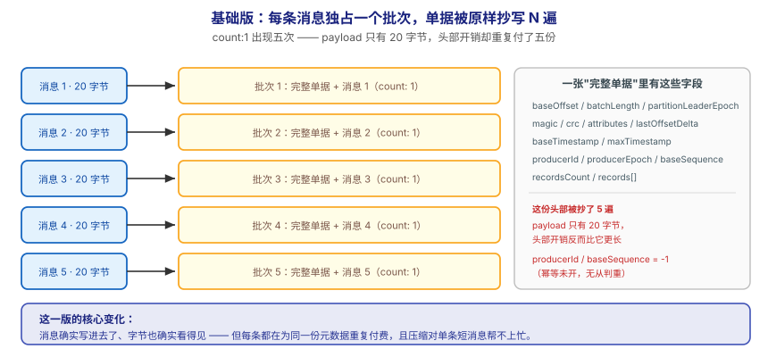
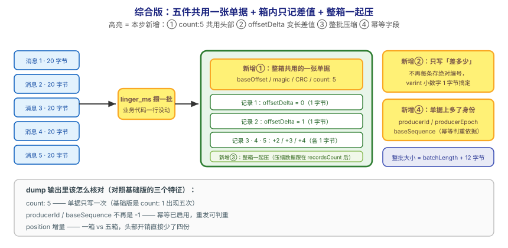

## 应用实战 · 协议与消息格式

> 对应课程：[第 13 课：协议与消息格式](../stages/5-生产落地延伸/lessons/lesson-13-协议与消息格式.md) ｜ 覆盖知识点：wire protocol 与消息格式
> 定位：**会用，不上生产**——课里学完，在这里动手（结构与边界见 SKILL.md「教学叙事骨架 · 应用实战」）。
> 环境前提：第 3 课起的本机 Kafka（`localhost:9092`）+ 本机 Python 与 `kafka-python`。
> 📖 结论已按官方文档核对（核对于 2026-09 ｜ 来源：Apache Kafka 4.x 文档 · Message Format / Messages）

## 场景：做容量规划时，一条 20 字节的消息到底占了多少

**场景**：你要给 `orders` 做容量规划——业务方说"一条订单消息大概 20 字节"，按日活估算后得出磁盘需求。可上线三个月，磁盘用得比估算快了一倍。你去问"为什么"，没人答得上来：**消息在磁盘上占多少，从来不是 payload 多大就多大**。本课的知识点，就是让你能自己把这条消息 dump 出来、逐字节数清楚。

**全貌一句话**：真实方案还需要**压缩算法选型的实测对比**（gzip / snappy / lz4 / zstd 在同一批数据上的压缩率与 CPU 代价）、**跨版本协议兼容性测试**（老客户端连新集群的矩阵验证）、**header 与 schema 演化的治理**——本课不展开，这里只让你先把"发一批消息 → dump 出真实字节 → 看懂每一格"这个闭环跑通。

---

## ① 基础实现：一条一条发，让每条都自带一份完整单据



> 看图：**左边**是五条消息，**每条都配了一张完整的单据**（起始编号、长度、版本、封条、谁发的、共几件——一个字段都不少）；**右边**是它们落盘后的样子：**五个批次、每个批次只装 1 条**，那张单据被**原样抄写了五遍**。**这一版的核心变化是——消息确实写进去了、也确实看得见字节**，但**每条都在为同一份元数据重复付费**。

建一个专用的探测 topic（三个分区，方便观察分布）：

```bash
docker exec -it kafka /opt/kafka/bin/kafka-topics.sh --create \
  --topic orders-probe --partitions 3 --replication-factor 1 \
  --bootstrap-server localhost:9092
```

用最朴素的方式发 5 条——每条发完立刻 `flush()`：

```python
from kafka import KafkaProducer
import json

producer = KafkaProducer(
    bootstrap_servers="localhost:9092",
    value_serializer=lambda v: json.dumps(v, ensure_ascii=False).encode("utf-8"),
)

for i in range(1, 6):
    producer.send("orders-probe", value={"order_id": i, "status": "CREATED"})
    producer.flush()          # 每条立刻催它送 —— 本版的关键特征

print("已发送 5 条")
producer.close()
```

把它们 dump 出来看真实字节（`orders-probe-0` 换成你实际有数据的分区目录）：

```bash
# 先看分区目录里有哪些段文件
docker exec -it kafka ls -l /tmp/kraft-combined-logs/orders-probe-0/

# dump 出批次结构
docker exec -it kafka /opt/kafka/bin/kafka-dump-log.sh --print-data-log \
  --files /tmp/kraft-combined-logs/orders-probe-0/00000000000000000000.log
```

你会看到**五个批次**（数值以你的实际输出为准）：

```
| baseOffset: 0 lastOffset: 0 count: 1 baseSequence: -1 lastSequence: -1
  producerId: -1 producerEpoch: -1 partitionLeaderEpoch: 0
  isTransactional: false isControl: false position: 0 ... payload: {"order_id": 1, ...}
| baseOffset: 1 lastOffset: 1 count: 1 ...
| baseOffset: 2 lastOffset: 2 count: 1 ...
```

> ⏳ 以上是**示例输出骨架**（字段名与你的一致，数值取决于你的写入），你要核对的是**三个特征**：`count: 1` 出现了几次、`producerId` 是不是 `-1`、以及相邻批次的 `position` 增量有多大。

> ⚠️ **它的问题**：**这一版能跑通，但三个坑同时在**——
> 1. **头部开销被重复付了 N 遍**：`count: 1` 说明每条消息独占一个批次，那一整张单据（起始编号、长度、版本、封条、生产者信息、条数……）被抄了五份。**payload 只有 20 字节，单据却比它长。**
> 2. **压缩帮不上忙**：压缩作用于**整批**。批里只有一条短 JSON，压完的字典开销可能让结果**反而更大**——这正是课首那个"短消息压缩后反而变大"的由来。
> 3. **没有任何去重能力**：`producerId: -1`、`baseSequence: -1` 表示幂等未启用；leader 切换引发重试时，broker 侧**无从判断这是重发还是新消息**。

---

## ② 综合实现：攒成一批，让整箱共用一张单据



> 看图：**比上一张多了四处变化**——① **五件货共用最上面那一张单据**（`count: 5`，单据只写一次）；② **箱里每件只写"差多少"**（`+0 / +1 / +2…`，varint 一个字节就够，不再每条存绝对编号）；③ **整箱一起压**（压缩作用在 recordsCount 之后的那一段，批里重复的字段名都被利用上了）；④ **单据上多了"谁发的、第几次发"**（`producerId` / `baseSequence` 不再是 -1）。**核心差别：从"每条自带一份完整单据"，变成"一箱共用一张单据 + 箱内只记差值"。**

只改生产者的配置，业务代码一行不动：

```python
from kafka import KafkaProducer
import json

producer = KafkaProducer(
    bootstrap_servers="localhost:9092",
    key_serializer=lambda k: k.encode("utf-8"),
    value_serializer=lambda v: json.dumps(v, ensure_ascii=False).encode("utf-8"),
    # ① 攒批：等一等、攒够了再一起发
    linger_ms=500,
    batch_size=64 * 1024,
    # ② 整批压缩
    compression_type="gzip",
    # ③ 开幂等：让批次头带上 producerId / baseSequence
    enable_idempotence=True,
    acks="all",
    retries=3,
)

for i in range(1, 6):
    producer.send("orders-probe", key=f"u{i}", value={"order_id": i, "status": "CREATED"})

producer.flush()      # 只催一次，让它们排进同一批
print("已发送 5 条")
producer.close()
```

再 dump 一次，对比**同一个分区**里新增的那一段：

```bash
docker exec -it kafka /opt/kafka/bin/kafka-dump-log.sh --print-data-log \
  --files /tmp/kraft-combined-logs/orders-probe-0/00000000000000000000.log | tail -20
```

关键差异（对照基础版那三个特征看）：

```
| baseOffset: 5 lastOffset: 9 count: 5 baseSequence: 0 lastSequence: 4
  producerId: 0 producerEpoch: 0 partitionLeaderEpoch: 0
  isTransactional: false isControl: false ...
```

- **`count: 5`**：五条消息进了**同一个批次**——单据只写一次，这是省下元数据的直接证据。
- **`producerId: 0` / `baseSequence: 0` / `lastSequence: 4`**：幂等已启用，批次头带上了生产者身份与序列号区间；重发时 broker 能据此判重（回扣课 8）。
- **`position` 的增量**：对比基础版五个批次的总增量与本版一个批次的增量，能直观看到"少抄了几份单据"。

> ✅ **本机可跑通**（2026-09-16）：`kafka-dump-log.sh` 是本课唯一必需的"显微镜"，单节点 KRaft 上可直接执行；幂等生产者需要 `acks="all"` + `retries>0`，缺失会直接报错（kafka-python 会校验）。
> ⏳ **压缩收益要看数据**：`gzip` 对本例这种小 JSON 未必更省——**短消息压缩后反而变大是正常现象**。想看到明显收益，把 payload 换成几百字节、重复字段多的结构再对比一次。
> ⚠️ **dump 输出里没有"绝对 offset"字段**：Record 里只存 `offsetDelta`，你看到的绝对 offset 是 `baseOffset + offsetDelta` 算出来的——这是本版能省空间的原因之一，别去找那个不存在的字段。

**这段代码把基础版的三个问题逐个解决掉了**：

| 基础版的问题 | 综合版怎么解决 | 对应本课知识点 |
|---|---|---|
| 头部开销重复 N 份 | `linger_ms` + `batch_size` 攒批 → `count: 5` 共用一个头部 | RecordBatch 是基本单位 |
| 压缩越压越大 | 压缩作用于**整批**（压缩数据直接跟在 recordsCount 后） | 批量是格式的基本假设 |
| 无从判重 | 开幂等 → 批次头带上 `producerId` / `baseSequence` | 幂等字段落在批次头 |

> 🔴 **三条必须记住的事实**：
> 1. **批量不是优化，是格式的假设**。官方原文：消息**永远按批写入**，一批可以只含一条——所以"每条一个批次"是合法但最浪费的写法。做容量规划时别只算 payload。
> 2. **整批大小 = `batchLength` + 12 字节**。`batchLength` 统计的是**该字段之后**到批次末尾的字节数，漏加前面 8 字节 baseOffset + 4 字节长度本身，估算就会系统性偏小。
> 3. **CRC 不覆盖 `partitionLeaderEpoch`**。它是 broker 收到后才赋值的，纳入校验就得为每个批次重算；CRC 用 **CRC-32C**，且位于 `magic` 之后——所以**必须先解析 magic 才能解释后面的字节**，这正是新旧客户端能共存的版本锚点。

> ⏳ **数字来源说明**：`linger_ms=500`、`batch_size=64KB`、`retries=3` 为**演示取值**（让攒批效果在 dump 里一眼可见），不是推荐值；批次头部固定开销在 magic=2 时**为几十字节量级**（常见引用值约 61 字节），**以你 `kafka-dump-log.sh` 实测的 `position` 增量为准**。真实容量请按你自己的消息结构压测后推算。

> 🎯 **会用标志**：给你一个"磁盘用得比估算快一倍"的现场，你能用 `kafka-dump-log.sh` 找出批次是不是太碎、能不能靠攒批与整批压缩省回来，并说清"整批大小怎么算""CRC 为什么不覆盖那个字段""老客户端凭什么还能连"。

## 🧭 导航

- ⬅️ 回到课程：[第 13 课：协议与消息格式](../stages/5-生产落地延伸/lessons/lesson-13-协议与消息格式.md)
- 📚 全部实战：[应用实战索引](INDEX.md)
- ⬅️ 上一课实战：[12 · 给每个团队装限速阀](12-多租户与配额.md)
- ➡️ 下一课实战：[14 · 冷热分层 + 凭据外置](14-分层存储与配置进阶.md)
