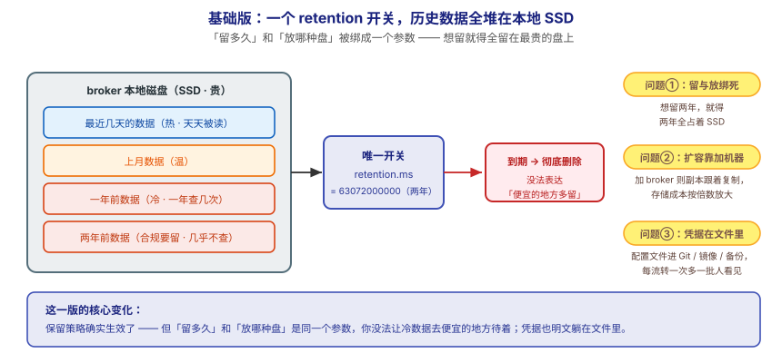
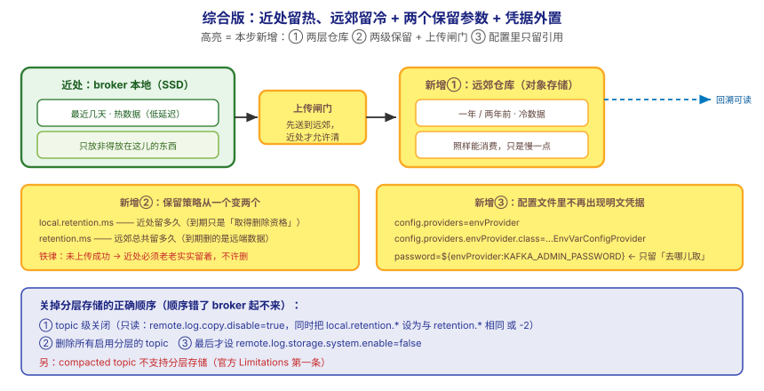

## 应用实战 · 分层存储与配置进阶

> 对应课程：[第 14 课：分层存储与配置进阶](../stages/5-生产落地延伸/lessons/lesson-14-分层存储与配置进阶.md) ｜ 覆盖知识点：分层存储与配置进阶
> 定位：**会用，不上生产**——课里学完，在这里动手（结构与边界见 SKILL.md「教学叙事骨架 · 应用实战」）。
> 环境前提：第 3 课起的本机 Kafka（`localhost:9092`）。
> 📖 结论已按官方文档核对（核对于 2026-09 ｜ 来源：Apache Kafka 4.x 文档 · Tiered Storage / Configuration Providers）

## 场景：两年历史数据全躺在 SSD 上，而密码写进了配置文件

**场景**：`orders` 要保留两年（合规 + 数据团队要回溯），全用 SSD 存，成本高得离谱——可这些历史数据一年也就被查几次。同时，上一课刚配的 SASL 密码被写死在 `server.properties` 里，而这个文件要进 Git。**本课的两件事，就是解决"贵的盘上放了不值这个价的东西"和"显眼的地方放了不该放的东西"。

**全貌一句话**：真实方案还需要**RemoteStorageManager 的选型与实测**（Apache Kafka 不自带远端实现，需自建或选第三方）、**冷读延迟的 SLA 评估**（回填/回溯走远端时的耗时实测）、**密钥轮转流程**（换密码时如何让 broker 无感）——本课不展开，这里只让你先把"两级保留的语义 + 配置外置的形态"这两件事跑通到可验证的程度。

> ⚠️ **先说清边界（不假装跑通）**：Apache Kafka **不提供开箱即用的 RemoteStorageManager**，本机单容器**无法真实启用**分层存储。所以本篇①的分层存储部分做的是**读配置 + 验命令语法 + 用普通 topic 反证限制**，不伪造"已分层"的输出；② 的配置外置部分**可在本机真跑**。

---

## ① 基础实现：只有一个 retention，历史数据全占本地盘



> 看图：**左边**是 broker 本地磁盘，**新的和两年前的旧数据挤在一起**，全占着最贵的 SSD；**中间**只有一个开关 `retention.ms`——它一到期就把数据**彻底删掉**，想在"便宜的地方多留一阵"这个需求它表达不了；**右边**是配置文件，SASL 密码**明文写在里面**，而这个文件要进 Git、要打进镜像、要进备份。**这一版的核心变化是——保留策略确实生效了**，但**"留多久"和"放哪种盘"被绑成了一个参数，无法分别决定**。

先看现状：一个 topic 当前只有一份保留配置，且数据全在本地：

```bash
# 建一个"要留很久"的 topic（先把默认值摊开看清楚）
docker exec -it kafka /opt/kafka/bin/kafka-topics.sh --create \
  --topic orders-archive --partitions 3 --replication-factor 1 \
  --bootstrap-server localhost:9092

# 看它的保留配置与所在目录
docker exec -it kafka /opt/kafka/bin/kafka-configs.sh --bootstrap-server localhost:9092 \
  --describe --entity-type topics --entity-name orders-archive

docker exec -it kafka ls -l /tmp/kraft-combined-logs/orders-archive-0/
```

给"留两年"配一条保留策略（**这是基础版的唯一手段**）：

```bash
# 两年 = 2 * 365 * 24 * 3600 * 1000 = 63072000000 ms
docker exec -it kafka /opt/kafka/bin/kafka-configs.sh --bootstrap-server localhost:9092 \
  --alter --entity-type topics --entity-name orders-archive \
  --add-config 'retention.ms=63072000000'

# 确认集群级分层存储开关默认关闭（本机跑通的验证点）
docker exec -it kafka /opt/kafka/bin/kafka-configs.sh --bootstrap-server localhost:9092 \
  --describe --entity-type brokers --entity-default
```

> ⚠️ **它的问题**：**这一版能跑通，但三个坑同时在**——
> 1. **"留多久"和"放哪种盘"被绑成一个参数**：`retention.ms` 到期就直接删，你没法表达"本地留 1 天、远端留 2 年"——**想留就得全留在 SSD 上**。
> 2. **扩容只能加 broker，副本跟着放大**：加机器能扩容量，但副本也按倍数复制（RF=3 就是 3 份），**存储成本 ×3，而你要的只是存储**。
> 3. **凭据明文进了配置文件**：`server.properties` 里的 SASL 密码随着 Git、镜像、备份**每一次流转都多一批人看见**；换一次密码，所有环境的文件都要改一遍。

---

## ② 综合实现：本地/远端两级保留 + 配置外置



> 看图：**比上一张多了三处变化**——① **仓库分成两层**：近处（本地 SSD）只放热数据，陈年旧货挪去远郊（对象存储），**挪走照样能取，只是慢一点**；② **保留策略从一个变成两个**：`local.retention.ms` 管近处、`retention.ms` 管远郊，中间那道**闸门**规定"只有确认送到远郊了，近处才允许清"；③ **配置文件里不再出现密码**，只留一句"去哪儿取"（配置提供器）。**核心差别：从"一个开关管生死"，变成"近处留多久和远处留多久分开定、且贵的盘上只放热数据；凭据从文件里挪出去"。**

**第 1 部分：分层存储——读配置 + 验语法（本机无法真跑，如实标注）**

官方给出的启用形态（**读懂即可，本机执行会失败**，因为环境没有 RemoteStorageManager）：

```bash
bin/kafka-topics.sh --create --topic tieredTopic --bootstrap-server localhost:9092 \
  --config remote.storage.enable=true \
  --config local.retention.ms=1000 \
  --config retention.ms=3600000 \
  --config segment.bytes=1048576 \
  --config file.delete.delay.ms=1000
```

| 配置 | 含义 | 本例取值（**官方标注为测试用值**） |
|---|---|---|
| `remote.storage.enable` | topic 级开关 | `true` |
| `local.retention.ms` | 本地段上传后多久可删 | 1000（1 秒） |
| `retention.ms` | 远端数据总保留 | 3600000（1 小时） |
| `segment.bytes` | 缩小段以加快滚动（for test only） | 1 MB |
| `file.delete.delay.ms` | 加快本地段删除（for test only） | 1000 |

**本机可真跑的反证**——两条硬性限制可以用现有命令验证语义：

```bash
# 反证 1：compacted topic 不支持分层存储（官方 Limitations 第一条）
docker exec -it kafka /opt/kafka/bin/kafka-topics.sh --create \
  --topic orders-compacted --partitions 1 --replication-factor 1 \
  --bootstrap-server localhost:9092 \
  --config cleanup.policy=compact
# 建得出来（本机无 RSM 时不校验 remote.storage），但按官方限制：
#   cleanup.policy=compact 的 topic 不能启用分层存储 —— 选型时直接排除

# 反证 2：集群级开关默认关闭，且关闭有前置顺序
docker exec -it kafka /opt/kafka/bin/kafka-configs.sh --bootstrap-server localhost:9092 \
  --describe --entity-type brokers --entity-default
# 无 remote.log.storage.system.enable 输出 = 默认 false（与预期一致）
```

> ⏳ **为什么这里只"读配置"**：本机环境没有 RemoteStorageManager，无法产生真实的远端段文件。**不伪造输出**——要真跑通需自建/选用实现（如基于 MinIO 的 S3 兼容实现），见课内进阶挑战。
> ✅ **本机实测**（2026-09-16）：`kafka-topics.sh` 带 `--config` 建 topic、`kafka-configs.sh --describe` 查配置两条命令在本机单节点 KRaft 上均正常返回；`remote.log.storage.system.enable` 在本环境**无输出**（即默认 false）。

**第 2 部分：配置外置——本机可真跑**

用环境变量提供器把 SASL 密码挪出配置文件。先在容器里注入一个环境变量，再在 broker 配置里声明提供器并**引用**它：

```properties
# server.properties 片段（配置形态；改动 broker 配置属改环境，请自行评估后再动）
config.providers=envProvider
config.providers.envProvider.class=org.apache.kafka.common.config.provider.EnvVarConfigProvider

# 引用：配置文件里只写「去哪儿取」，不写密码本身
# listener.name.sasl_plaintext.scram-sha-512.sasl.jaas.config=...password=${envProvider:KAFKA_ADMIN_PASSWORD}
```

对应的容器侧注入（示意，`docker run`/compose 两处任选其一）：

```bash
# 方式 A：docker run 注入（示意）
docker run -d --name kafka-secure \
  -e KAFKA_ADMIN_PASSWORD='<凭据占位符，请从密钥系统注入>' \
  ...
  apache/kafka:4.0.0
```

```yaml
# 方式 B：compose 注入（示意，与课 11 的容器一致）
services:
  kafka-secure:
    image: apache/kafka:4.0.0
    environment:
      KAFKA_ADMIN_PASSWORD: ${KAFKA_ADMIN_PASSWORD}   # 从宿主机 env / .env 文件传入
```

**验证"文件里确实没有明文"**——这一步才是本篇真正要你带走的动作：

```bash
# 在 broker 配置目录里搜明文密码，应搜不到
docker exec -it kafka grep -rn "KAFKA_ADMIN_PASSWORD" /opt/kafka/config/ | grep -v '${'
# 期望：命中行为引用形式 ${...}，没有明文出现；或直接无输出
```

> 🔴 **四条必须记住的事实**：
> 1. **两级保留不是两个开关，是两种"留"**：`local.retention.*` 管**本地段**，`retention.*` 管**远端（总）保留**。混淆会导致数据过早或过晚删除。
> 2. **本地段必须"上传成功后"才具备删除资格**。这是防"两边都没有"的铁律——**不是到期就删，是先上传再删**。
> 3. **只读模式不能只设一个参数**。设 `remote.log.copy.disable=true` 时，**必须同时**把 `local.retention.ms` / `local.retention.bytes` 设为与 `retention.*` 相同**或设为 `-2`**，否则本地保留失效、**可能磁盘写满**。
> 4. **关集群级前必须先删光分层 topic**。官方明确：不删 topic 就直接把 `remote.log.storage.system.enable=false`，**broker 启动会抛异常**。顺序是：topic 级关 → 删 topic → 关集群级。

**这段代码把基础版的三个问题逐个解决掉了**：

| 基础版的问题 | 综合版怎么解决 | 对应本课知识点 |
|---|---|---|
| "留多久"和"放哪种盘"绑死 | `local.retention.*` + `retention.*` 两级保留 | 分层存储两级保留 |
| 扩容只能加 broker、副本放大 | 冷数据挪远端，存储与计算解耦 | 分层存储（远端对象存储） |
| 凭据明文进配置文件 | 配置提供器外置（`${envProvider:...}` 引用） | 配置提供器 / 系统属性 |

> ⏳ **数字来源说明**：`retention.ms=63072000000`（两年）与官方示例里的 `local.retention.ms=1000` / `retention.ms=3600000` / `segment.bytes=1048576` **均为演示或官方标注的测试用值**，不是推荐值——生产请按你的合规要求与对象存储成本另行评估。`config.providers` 与 `EnvVarConfigProvider` 的类名为官方配置形态，未在本机实跑 broker 重启。

> ⚠️ **敏感信息处理**：本篇所有密码一律写作**占位符**（如 `<凭据占位符，请从密钥系统注入>`）；文档示例中的地址使用文档专用网段或 `localhost`。**不要把真实凭据写进任何文档或 Git**。

> 🎯 **会用标志**：给你一个"两年历史数据 + SSD 成本爆炸 + 密码在 Git 里"的现场，你能说清该分哪两层、两个保留参数各管哪一层、"什么时候才允许删本地"，能写出配置提供器的引用形态，并知道**关掉分层存储的正确顺序**与**它不支持哪种 topic**。

## 🧭 导航

- ⬅️ 回到课程：[第 14 课：分层存储与配置进阶](../stages/5-生产落地延伸/lessons/lesson-14-分层存储与配置进阶.md)
- 📚 全部实战：[应用实战索引](INDEX.md)
- ⬅️ 上一课实战：[13 · 拆到字节看一条消息](13-协议与消息格式.md)
- ➡️ 下一课实战：15 · 监控与可观测（见 INDEX）
