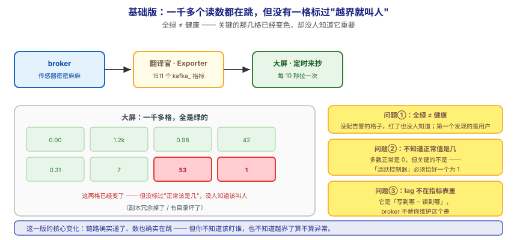
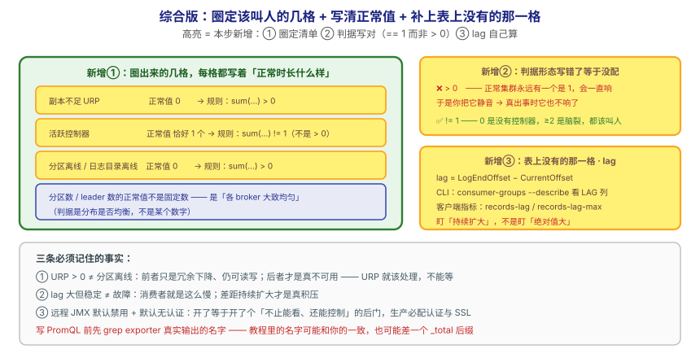

## 应用实战 · 监控与可观测

> 对应课程：[第 15 课：监控与可观测](../stages/6-运维与可观测/lessons/lesson-15-监控与可观测.md) ｜ 覆盖知识点：监控与可观测
> 定位：**会用，不上生产**——课里学完，在这里动手（结构与边界见 SKILL.md「教学叙事骨架 · 应用实战」）。
> 环境前提：第 3 课起的本机 Kafka（`localhost:9092`）；课 15 的 3 节点 + Prometheus 栈可选（`kafka/assets/stage6-observability/`）。
> 📖 结论已按官方文档核对（核对于 2026-09 ｜ 来源：Apache Kafka 4.x 文档 · operations/monitoring）

## 场景：监控大屏一片绿，故障却是用户先发现的

**场景**：集群跑得好好的，某天业务反馈"消息变慢了"——你打开监控大屏，一片绿。查了半天才发现：某个 broker 磁盘快满了、ISR 悄悄收缩过，**而这几项压根没配告警**。更麻烦的是消费积压（lag）——翻遍 broker 指标也找不到它，因为**它压根不在那里**。

**全貌一句话**：真实方案还需要**告警分级与值班路由**（P1 叫醒人 / P3 只发群）、**长期基线与容量趋势**（按周环比看分区数、磁盘增长）、**多集群统一视图**（Thanos / 远端存储）——本课不展开，这里只让你先把"看见一个真实故障 → 知道该盯哪几格 → 写出不会误报的规则"这个闭环跑通。

---

## ① 基础实现：采了一千多个指标，但一格都没标"正常该是什么"



> 看图：**左边**是采集链路已经接通——一千多个读数源源不断送到大屏；**中间**是大屏上密密麻麻的表，**全都是绿的**，因为**没有任何一格被标过"越界就叫人"**；**右边**是那几格真正重要的（副本冗余掉了、有目录坏掉了）**已经变了色，却没人知道它重要**。**这一版的核心变化是——你确实"有监控了"**，但**你不知道该盯谁，也不知道正常值是多少**。

先确认链路是通的——数一下一个 broker 到底吐出多少指标（有 Prometheus 栈时）：

```bash
# JMX Exporter 暴露的 kafka_ 开头指标有多少条
docker exec l15-kafka-1 wget -qO- http://localhost:17071/metrics | grep -c '^kafka_'
```

没有 Prometheus 栈也没关系，用 CLI 也能看到"哪些地方有数可看"：

```bash
# 集群与副本健康（人肉巡检视角）
docker exec -e KAFKA_JMX_OPTS= kafka /opt/kafka/bin/kafka-topics.sh \
  --bootstrap-server localhost:9092 --describe --topic orders
```

> ⏳ **数字来源说明**：课 15 实测一个 broker 暴露 **1511** 个 `kafka_` 指标（无 topic 时初创值 **834**，会随 topic 数增长）。**换个集群这些数字都会变**，请以你自己的 `grep -c` 结果为准。

> ⚠️ **它的问题**：**这一版能采到数，但三个坑同时在**——
> 1. **全绿不等于健康**：没配告警的指标，变红了也没人知道。故障的第一个发现者是**用户**。
> 2. **不知道正常值是几**：大部分指标正常是 0，但**有关键的不是 0**——比如"活跃控制器"必须**恰好一个 broker 为 1**。不知道这点，写出来的规则要么永远不响，要么一直响。
> 3. **lag 压根不在指标表里**：它是"写到哪了"减"读到哪了"，**broker 不替你维护这个差**。指望在指标列表里找到它，是找不到的。

---

## ② 综合实现：圈定该叫人的几格，并给每格写清正常值



> 看图：**比上一张多了三处变化**——① **从一千多格里圈出少数几格**，每一格都写着"正常时长什么样"（副本不足正常是 **0**、活跃控制器**恰好一个为 1**、离线目录 **0**）；② **判据写对**（活跃控制器用"总和是否等于 1"，不是"大于 0"——后者会一直触发）；③ **补上表上没有的那一格**：lag 要拿"写到哪了"减去"读到哪了"才算得出来。**核心差别：从"表都在跳、全绿"，变成"少数几格有判据、越界就叫人、缺的那格自己算"。**

**第 1 步：把故障造出来，看指标怎么动。** 这是唯一能确认"告警真的会响"的办法：

```bash
# 建一个 RF=3 的 topic（单节点环境用 RF=1，效果看 URP 变化即可）
docker exec -it kafka /opt/kafka/bin/kafka-topics.sh --create \
  --topic monitor-demo --partitions 3 --replication-factor 1 \
  --bootstrap-server localhost:9092

# 停掉一个 broker（3 节点环境；单节点可跳过这步直接看 CLI 巡检）
docker stop l15-kafka-3
sleep 40   # 等 controller 检测心跳超时
```

看"副本冗余"这一格的变化（3 节点 + Prometheus 时）：

```bash
curl -s --data-urlencode 'query=sum(kafka_server_replicamanager_underreplicatedpartitions)' \
  http://localhost:19990/api/v1/query
```

单节点环境用 CLI 做同样的事（**没有 Prometheus 也能验证语义**）：

```bash
docker exec -e KAFKA_JMX_OPTS= kafka /opt/kafka/bin/kafka-topics.sh \
  --bootstrap-server localhost:9092 --describe --topic monitor-demo \
  --under-replicated-partitions
```

> ⏳ **课 15 实测**（3 节点环境）：停掉一个 broker 后 `underreplicatedpartitions` 从 **0 → 53**，恢复后回到 **0**；`activecontrollercount` 始终为 **1**；`offlinepartitionscount` 始终为 **0**（副本还在别的节点，分区仍可读写）。
> ⚠️ **单节点环境看不到 URP 变化**——RF=1 时停掉唯一节点，整个 topic 就不可用了，演练不出"冗余下降但仍可用"这个关键状态。想看这个效果请起 3 节点栈。

**第 2 步：把"该叫人的那几格"写成规则（注意判据形态）：**

```yaml
# ① 副本冗余下降（最该叫醒你的）—— 正常值 0
sum(kafka_server_replicamanager_underreplicatedpartitions) > 0

# ② 活跃控制器 —— 正常是「恰好一个 broker 为 1」，判据是 != 1，不是 > 0
sum(kafka_controller_kafkacontroller_activecontrollercount) != 1

# ③ 有分区离线（真正不可用了）—— 正常值 0
sum(kafka_controller_kafkacontroller_offlinepartitionscount) > 0

# ④ 日志目录不可用（磁盘故障）—— 正常值 0
sum(kafka_log_logmanager_offlinelogdirectorycount) > 0
```

> 🔴 **第 ②条是最容易写错的一条**：正常集群**永远有一个 broker 是 1**，写成 `> 0` 会**每时每刻都在告警**，逼你把告警静音——静音之后，真出事时它也不响了。判据必须是"**总和是否等于 1**"。

**第 3 步：补上表上没有的那一格——lag 怎么算。**

```bash
# 先让消费者读几条就停（制造非零 lag）
docker exec -it kafka /opt/kafka/bin/kafka-console-consumer.sh \
  --bootstrap-server localhost:9092 --topic monitor-demo \
  --group monitor-cg --from-beginning --max-messages 3

# 再看这个组读到哪、写到哪、差多少
docker exec -e KAFKA_JMX_OPTS= kafka /opt/kafka/bin/kafka-consumer-groups.sh \
  --bootstrap-server localhost:9092 --describe --group monitor-cg
```

输出形如（数值以你的实际为准）：

```
GROUP        TOPIC         PARTITION  CURRENT-OFFSET  LOG-END-OFFSET  LAG
monitor-cg   monitor-demo  0          3               5               2
monitor-cg   monitor-demo  1          0               0               0
monitor-cg   monitor-demo  2          0               0               0
```

> ⏳ 以上是**示例骨架**（字段名与你的一致，数值取决于你的写入量与 `--max-messages`），你要核对的是：**LAG = LOG-END-OFFSET − CURRENT-OFFSET**，以及它在 broker 指标表里**找不到**。

> ✅ **本机可跑通**（2026-09-16）：`kafka-consumer-groups.sh --describe --group <组名>` 与 `kafka-topics.sh --describe --under-replicated-partitions` 在单节点 KRaft 上均可直接执行，这两条足够验证"lag 得另算"与"URP 的语义"。
> ⚠️ **写 PromQL 前先 grep 真实名字**：JMX Exporter 的规则决定了指标名怎么转，课 15 实测 `MessagesInPerSec` 转出来**没有** `_total` 后缀。**不要照抄教程里的名字**，先 `docker exec ... wget -qO- http://localhost:17071/metrics | grep -i <关键词>` 看它到底吐出什么。

**这段代码把基础版的三个问题逐个解决掉了**：

| 基础版的问题 | 综合版怎么解决 | 对应本课知识点 |
|---|---|---|
| 全绿不等于健康 | 圈定官方点名的少数几格，每格配规则 | 官方告警指标清单 |
| 不知道正常值是几 | 逐格写清：0 / 恰好 1 / 各 broker 大致均匀 | 指标的 Normal value |
| lag 不在指标表里 | `LogEndOffset − CurrentOffset` 另算（CLI 或客户端 `records-lag`） | 消费延迟的三种测法 |

> 🔴 **三条必须记住的事实**：
> 1. **"副本不足"和"分区离线"是两回事**。前者（URP > 0）只是冗余度下降、分区**仍可读写**；后者（OfflinePartitionsCount > 0）才是真不可用了。**URP > 0 就该处理，不能等到 offline**。
> 2. **"差距大"不等于"有故障"**。lag 大但**稳定**，只说明消费者就是这么慢；**差距持续扩大**才是真积压。告警要盯的是**趋势**，不是绝对值。
> 3. **远程 JMX 默认禁用、且默认无认证**。开了等于给人开了一个**不止能看、还能控制** broker 的后门——生产必须同时配认证与 SSL。本课栈为可复现用了无认证 JMX，**仅供本地学习**。

> ⏳ **数字来源说明**：`sleep 40`、`--max-messages 3` 为**演示取值**（让故障与 lag 可见）；0 / 53 / 1 等为**课 15 三节点环境实测值**，**换集群必变**。限流类指标（`produce-throttle-time`）是**客户端**指标，broker 侧不产生拒绝指标——课 12 的配额被限流了，要看客户端。

> 🎯 **会用标志**：给你一个"大屏全绿、用户先发现故障"的现场，你能说出该盯哪几格、每格的正常值是什么，能写出一条**不会误报**的控制器规则，并说清 lag 为什么不在指标表里、该怎么算出来。

## 🧭 导航

- ⬅️ 回到课程：[第 15 课：监控与可观测](../stages/6-运维与可观测/lessons/lesson-15-监控与可观测.md)
- 📚 全部实战：[应用实战索引](INDEX.md)
- ⬅️ 上一课实战：[14 · 冷热分层 + 凭据外置](14-分层存储与配置进阶.md)
- ➡️ 下一课实战：[16 · 有方案、有限速、有复查](16-集群运维操作.md)
