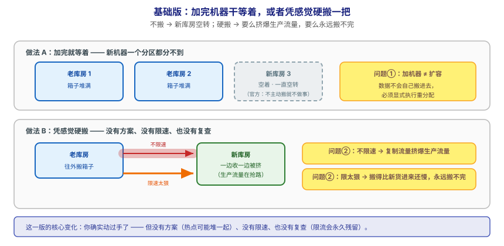
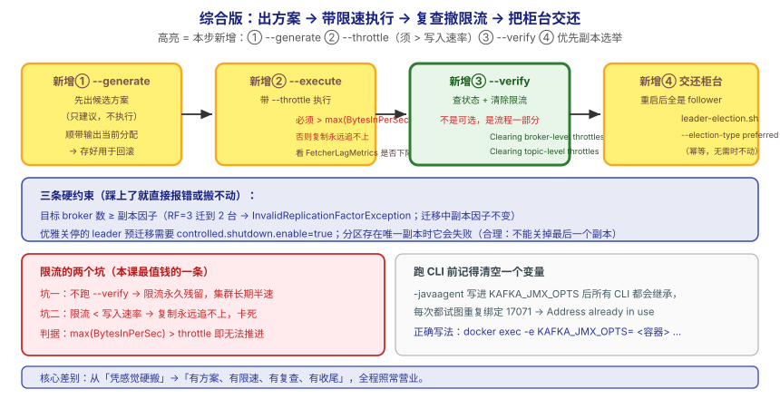

## 应用实战 · 集群运维操作

> 对应课程：[第 16 课：集群运维操作](../stages/6-运维与可观测/lessons/lesson-16-集群运维操作.md) ｜ 覆盖知识点：集群运维操作
> 定位：**会用，不上生产**——课里学完，在这里动手（结构与边界见 SKILL.md「教学叙事骨架 · 应用实战」）。
> 环境前提：课 15/16 的 3 节点 KRaft 集群（`kafka/assets/stage6-observability/`，`docker compose up -d`）；单节点也能跑通部分步骤（已标注）。
> 📖 结论已按官方文档核对（核对于 2026-09 ｜ 来源：Apache Kafka 4.x 文档 · basic-kafka-operations / hardware-and-os）

## 场景：三台新机器加进来了，可一个分区都没分给它们

**场景**：业务量涨了，领导批了新机器。你加进集群，兴冲冲去看——**新 broker 一个分区都没有**。官方说得很直白：新服务器**不会自动被分配到任何数据分区**，除非你主动搬迁，否则它们不会做任何工作。于是你执行了重分配，结果复制流量把生产流量挤爆；想限速又怕搬不完；好不容易搬完，重启一台机器后**它全是 follower，压力还在别人身上**。

**全貌一句话**：真实方案还需要**变更窗口与回滚预案**（搬迁前保存原分配用于回滚、分批执行）、**容量与耗时预估**（按数据量与网络算搬迁时长）、**自动化巡检**（定期跑 leader 均衡与机架分布检查）——本课不展开，这里只让你先把"出方案 → 限速搬 → 复查撤限流 → 把柜台交还"这个闭环跑通。

---

## ① 基础实现：加完机器就等着，或者硬搬一把



> 看图：**上面那排**是加完机器就干等——新库房**空着**，箱子还全在老库房，官方说得很清楚：**不主动搬，它就一直空转**；**下面那排**是硬搬——要么不限速，**复制流量把生产流量挤爆**（来办事的人全堵在门口），要么限速限太狠，**搬得比新货进来还慢，永远搬不完**。**这一版的核心变化是——你确实"动过手了"**，但**没有方案、没有限速、也没有复查**。

先看新机器是不是真的空着（这是最容易自欺的一步）：

```bash
# 看某个 topic 的副本都落在哪些 broker 上
docker exec -e KAFKA_JMX_OPTS= l15-kafka-1 /opt/kafka/bin/kafka-topics.sh \
  --bootstrap-server localhost:9092 --describe --topic reassign-demo
```

输出形如（`Replicas` 那一列就是当前分布）：

```
Topic: reassign-demo  Partition: 0  Leader: 1  Replicas: 1,2  Isr: 1,2
Topic: reassign-demo  Partition: 1  Leader: 2  Replicas: 2,3  Isr: 2,3
```

想"搬"却没有方案，只能凭感觉指定目标（**这就是硬搬**）：

```bash
# ❌ 基础版做法：直接指定目标就执行，没有先让工具出方案
docker exec -e KAFKA_JMX_OPTS= l15-kafka-1 /opt/kafka/bin/kafka-reassign-partitions.sh \
  --bootstrap-server localhost:9092 \
  --reassignment-json-file handmade.json --execute
```

> ⏳ 以上是**示例骨架**（`Replicas` 列取值取决于你自己的 topic），你要核对的是：**新加进来的 broker 编号有没有出现在 `Replicas` 里**——本版答案通常是否定的。

> ⚠️ **它的问题**：**这一版能执行，但三个坑同时在**——
> 1. **没有方案就动手**：重分配工具**不会**自动分析数据分布帮你均衡——官方明确：它只按你给的 topic 列表和目标 broker 列表均匀铺开，**该搬哪些得你自己判断**。凭感觉指定，可能把热点全堆到一台。
> 2. **不限速会挤爆生产流量**：复制流量与生产流量抢同一张网，业务先报警。
> 3. **搬完不复查，限流会永久残留**：这是最阴的一条——带 `--throttle` 执行后**如果不跑 `--verify`，限流配置会一直留在 broker 上**，此后所有正常副本同步都被限速，集群长期半速运行，且极难排查。

---

## ② 综合实现：三板斧出方案 → 带限速执行 → 复查撤限流 → 交还柜台



> 看图：**比上一张多了四处变化**——① **先出方案再动手**（`--generate` 给你一份候选分配，还把当前分配一并输出供回滚）；② **执行时限速**（`--throttle`，且这个值必须**大于实际写入速率**，否则永远搬不完）；③ **搬完必须回去复查**（`--verify` 不只查状态，它**顺手把限流撤掉**——这是唯一会清除限流的动作）；④ **重启后柜台不会自己回来**，得再跑一次优先副本选举把它交还。**核心差别：从"凭感觉硬搬"，变成"有方案、有限速、有复查、有收尾"。**

**第 1 步：准备 topic 列表，让工具出方案。**

```bash
# topics-to-move.json
cat > /tmp/topics-to-move.json <<'EOF'
{
  "topics": [{"topic": "reassign-demo"}],
  "version": 1
}
EOF

# ① --generate：只出方案，不执行（把输出里的 Current 段存好，用于回滚）
docker exec -e KAFKA_JMX_OPTS= l15-kafka-1 /opt/kafka/bin/kafka-reassign-partitions.sh \
  --bootstrap-server localhost:9092 \
  --topics-to-move-json-file /tmp/topics-to-move.json \
  --broker-list "1,2" --generate
```

把输出里 `Proposed partition reassignment configuration` 那段 JSON 存成 `plan.json`，然后执行：

```bash
# ② --execute：带限流执行（10485760 B/s = 10 MB/s，演示值）
docker exec -e KAFKA_JMX_OPTS= l15-kafka-1 /opt/kafka/bin/kafka-reassign-partitions.sh \
  --bootstrap-server localhost:9092 \
  --reassignment-json-file /tmp/plan.json --execute --throttle 10485760

# ③ --verify：验证状态 + 清除限流（这一步不是可选的）
docker exec -e KAFKA_JMX_OPTS= l15-kafka-1 /opt/kafka/bin/kafka-reassign-partitions.sh \
  --bootstrap-server localhost:9092 \
  --reassignment-json-file /tmp/plan.json --verify
```

你会看到工具自己在清理限流（课 16 实测原文形态）：

```
Clearing broker-level throttles on brokers 1,2,3
Clearing topic-level throttles on topic reassign-demo
```

**第 2 步：把柜台交还——优先副本选举。** 搬迁后常出现"leader 不是副本列表第一个"的情况：

```bash
# 看一眼谁不在优先副本上
docker exec -e KAFKA_JMX_OPTS= l15-kafka-1 /opt/kafka/bin/kafka-topics.sh \
  --bootstrap-server localhost:9092 --describe --topic reassign-demo

# 触发优先副本选举（幂等，无需选举时不会动）
docker exec -e KAFKA_JMX_OPTS= l15-kafka-1 /opt/kafka/bin/kafka-leader-election.sh \
  --bootstrap-server localhost:9092 --election-type preferred --all-topic-partitions
```

> ⏳ **课 16 实测**：搬迁后 `reassign-demo-3` 是 `Replicas: 2,1` 但 `Leader: 1`（优先副本是 2）；选举后 leader 变为 **2**。再跑一次输出为空（**幂等且收敛**）。
> ✅ **单节点也能跑的形态**：单节点只有 1 个 broker，`--broker-list "1,2"` 会报 `Replication factor: 2 larger than available brokers: 1`。**要复现这个报错反而更简单**——它是"目标 broker 数必须 ≥ 副本因子"这条约束的直接证据。

**第 3 步（可选）：优雅关停，看 leader 提前迁走。**

```bash
docker stop l15-kafka-3        # 发 SIGTERM，触发优雅关停
# 再看分区：leader 已从 3 迁走，ISR 收缩，但分区仍可读写
docker exec -e KAFKA_JMX_OPTS= l15-kafka-1 /opt/kafka/bin/kafka-topics.sh \
  --bootstrap-server localhost:9092 --describe --topic monitor-demo
docker start l15-kafka-3
```

**这段代码把基础版的三个问题逐个解决掉了**：

| 基础版的问题 | 综合版怎么解决 | 对应本课知识点 |
|---|---|---|
| 凭感觉硬搬、热点可能堆一起 | `--generate` 先出候选方案 + 保存当前分配供回滚 | 分区重分配三板斧 |
| 不限速挤爆生产流量 | `--execute --throttle <字节/秒>` | 限流复制 |
| 搬完限流永久残留 | `--verify`（唯一会清除限流的动作） | 限流必须及时移除 |
| 重启后全是 follower | 优先副本选举 / `auto.leader.rebalance.enable` | 优先副本与 leader 均衡 |

> 🔴 **四条必须记住的事实**：
> 1. **`--verify` 不是可选的最佳实践，是流程的一部分**。官方原文警告：必须周期性运行 `--verify` 直到重分配完成，**以确保限流被移除**。忘了这一步 = 集群长期半速。
> 2. **限流值必须 `> max(BytesInPerSec)`**。低于生产者写入速率时，复制**永远追不上**。怎么判断？看 `FetcherLagMetrics` 的 `ConsumerLag`——它应当**持续下降**，不下降就该提高限流值。
> 3. **目标 broker 数必须 ≥ 副本因子**。RF=3 迁到 2 个 broker 会直接报 `InvalidReplicationFactorException`；且**迁移过程中副本因子保持不变**。
> 4. **优雅关停的第二项优化需要开关**。`controlled.shutdown.enable=true` 才能在关停前把 leader 迁走（不可用时長从秒级降到毫秒级）；且**分区存在唯一副本时它会失败**——关掉最后一个副本会让分区不可用，这是官方的合理设计。

> ⏳ **数字来源说明**：`--throttle 10485760`（10 MB/s）与 `sleep 40` 为**课 16 演示/实测取值**，不是推荐值——真实限流值要看你自己的 `BytesInPerSec`。`160ms / 250ms+`（XFS vs EXT4）、`100000`（fd 建议下限）、`50000 分区 → 100000 map area` 均为**官方数据**，请以官方文档当前表述为准。

> ⚠️ **跑 CLI 记得清空 `KAFKA_JMX_OPTS`**：课 15 实测踩过的坑——`-javaagent` 写进 `KAFKA_JMX_OPTS` 后**所有 CLI 都会继承**，每次都试图重复绑定 17071 端口并报 `Address already in use`。正确写法是 `docker exec -e KAFKA_JMX_OPTS= <容器> ...`。

> 🎯 **会用标志**：给你一个"加了机器却不分担、搬迁打满网络、重启后不干活"的现场，你能跑完三板斧并解释**为什么 `--verify` 不能省**、限流值该怎么定、以及重启后该做什么才能把压力还回去。

## 🧭 导航

- ⬅️ 回到课程：[第 16 课：集群运维操作](../stages/6-运维与可观测/lessons/lesson-16-集群运维操作.md)
- 📚 全部实战：[应用实战索引](INDEX.md)
- ⬅️ 上一课实战：[15 · 从全绿到该叫人的几格](15-监控与可观测.md)
- ➡️ 下一课实战：17 · 网络层与请求处理模型（见 INDEX）
