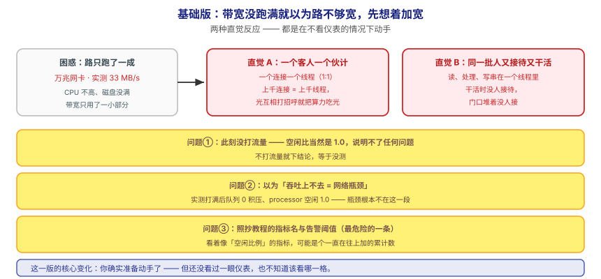
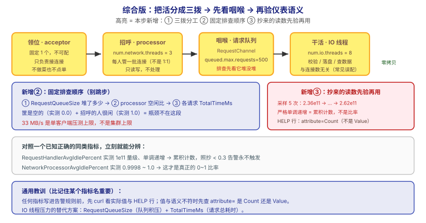

## 应用实战 · 网络层与请求处理模型

> 对应课程：[课 17：网络层与请求处理模型](../stages/7-实现原理/lessons/lesson-17-网络层与请求处理模型.md) ｜ 覆盖知识点：网络层与请求处理模型（Reactor NIO）
> 定位：**会用，不上生产**——课里学完，在这里动手（结构与边界见 SKILL.md「教学叙事骨架 · 应用实战」）。
> 环境前提：课 15 的 3 节点 + Prometheus 栈（`kafka/assets/stage6-observability/`）；单节点也能跑通第 ①步。
> 📖 结论已按官方文档核对（核对于 2026-09 ｜ 来源：Apache Kafka 4.x 文档 · implementation/network-layer）

## 场景：万兆网卡只跑出 33 MB/s，CPU 和磁盘都不高

**场景**：业务方给 broker 配了万兆网卡，实测吞吐却卡在 33 MB/s。CPU 不高、磁盘没满、带宽只用了一小部分。**第一反应通常是"加机器"或"加线程"**——但在动任何参数之前，你得先能回答：一个请求从网卡进来，中间经过哪几段，到底哪一段堵了。

**全貌一句话**：真实方案还需要**多客户端并发压测**（单客户端压出来的数字不是集群上限）、**线程数的对比实验**（改 `num.network.threads` / `num.io.threads` 前后各压一轮）、**磁盘 IO 与 page cache 的联动分析**——本课不展开，这里只让你先把"压测 → 看队列与空闲比 → 判断瓶颈在不在这段"这个闭环跑通，并亲手验证一个会骗人的指标。

---

## ① 基础实现：带宽没跑满就以为路不够宽，先想着加宽



> 看图：**左边**是那个困惑——路只跑了一成，东西却送不快；**中间上排**是第一种直觉反应：**每个客人配一个伙计**（一个连接一个线程），上千连接就上千线程，**光互相打招呼就把算力吃光**；**中间下排**是第二种：**让同一批人又接待又干活**，门口堆着没人接。**这一版的核心变化是——你确实准备动手了**，但**是在没看仪表的情况下动手**。

先按"凭感觉"的路子确认一下现状（**这一步在单节点也能做**）：

```bash
# 看一眼有多少 processor 线程在岗（默认 3）
curl -s http://localhost:17071/metrics | grep -E 'kafka_network_processor_idlepercent' | grep -v '^#'
```

输出形如（数值以你的实际为准）：

```
kafka_network_processor_idlepercent{networkprocessor="0"} 1.0
kafka_network_processor_idlepercent{networkprocessor="1"} 1.0
kafka_network_processor_idlepercent{networkprocessor="2"} 1.0
```

> ⚠️ **它的问题**：**这一版能拿到数，但三个坑同时在**——
> 1. **光看空闲比就下结论**：此刻没流量，空闲比当然是 1.0。**没打流量时的读数说明不了任何问题**——必须打上流量再看。
> 2. **以为"吞吐上不去 = 网络瓶颈"**：这是本课最想纠正的直觉。实测打满之后队列 **0 积压**、processor 空闲 **1.0**，直接证明**瓶颈不在这一段**。
> 3. **照抄教程的指标名与告警阈值**：最危险的一条——看似"空闲比例"的指标，可能是**累积计数**。

---

## ② 综合实现：打流量 → 看咽喉 → 顺手拆穿一个会骗人的指标



> 看图：**比上一张多了三处变化**——① **先把活分成三拨**：门口一人领位（固定 1 个）、几人管招呼（默认 3）、后面一批人干活（默认 8），**中间那个单子筐是咽喉**；② **排查有固定顺序**：先看筐里堆了多少，再看招呼的人有多闲，**筐是空的就说明瓶颈不在这段**；③ **多了最后一步"先验再用"**：抄来的仪表读数，先看清它是"比例"还是"累计数"再用。**核心差别：从"凭感觉加宽"，变成"先看仪表定位，再决定动哪里"。**

**第 1 步：建 topic 并打流量**（3 节点环境）：

```bash
docker exec l15-kafka-1 bash -c 'export PATH=/opt/kafka/bin:$PATH; unset KAFKA_JMX_OPTS
kafka-topics.sh --bootstrap-server kafka-1:9092 --create --if-not-exists \
  --topic net-demo --partitions 6 --replication-factor 3'

docker exec l15-kafka-1 bash -c 'export PATH=/opt/kafka/bin:$PATH; unset KAFKA_JMX_OPTS
kafka-producer-perf-test.sh --topic net-demo --num-records 20000 --record-size 1024 \
  --throughput -1 --producer-props bootstrap.servers=kafka-1:9092 acks=1'
```

**第 2 步：打完立刻看咽喉（顺序不能反）**：

```bash
echo "--- ① 先看法庭：请求队列积压了吗 ---"
curl -s http://localhost:17071/metrics | grep -i 'requestchannel_requestqueuesize' | grep -v '^#'

echo "--- ② 再看招呼的人有多闲 ---"
curl -s http://localhost:17071/metrics | grep -i 'networkprocessoravgidlepercent' | grep -v '^#'

echo "--- ③ 最后看各类请求的耗时 ---"
curl -s http://localhost:17071/metrics | grep -E 'totaltimems' | grep -iE 'produce|fetch' | grep -v '^#'
```

> ⏳ **课 17 实测**（3 节点 · `apache/kafka:4.0.0` · 单客户端压测）：吞吐 **33955.9 records/sec (33.16 MB/sec)**，平均延迟 **160.90 ms**；打完后 `requestqueuesize` = **0.0**、`networkprocessoravgidlepercent` = **1.0**。
> ✅ **这个结果本身就是答案**：队列零积压 + processor 100% 空闲 → **网络层完全不是瓶颈**。33 MB/s 是**单客户端压测的上限**，不是集群上限。换并发度、换 `acks` 都会变，请以你自己的实测为准。

**第 3 步：亲手拆穿那个会骗人的指标。**

很多教程让你监控 `RequestHandlerAvgIdlePercent`，说"低于 0.3 说明 IO 线程不够"。先别信，**连续采样 5 次看它到底是什么**：

```bash
for i in 1 2 3 4 5; do
  curl -s http://localhost:17071/metrics | grep -i 'kafkarequesthandlerpool' | grep -v '^#' | awk '{print "sample '$i': "$2}'
  sleep 3
done
```

同步看一下它的 HELP 行与网络线程那个指标做对照：

```bash
curl -s http://localhost:17071/metrics | grep -B2 -i 'kafkarequesthandlerpool'
curl -s http://localhost:17071/metrics | grep -i 'networkprocessoravgidlepercent'
```

> ⏳ **课 17 实测**：`RequestHandlerAvgIdlePercent` 五次采样为 **2.36e11 → 2.43e11 → 2.49e11 → 2.55e11 → 2.62e11**，**严格单调递增**（每 3 秒约 +6.3e9）。HELP 行暴露了真相：
> ```
> kafka.server:name=RequestHandlerAvgIdlePercent,type=KafkaRequestHandlerPool,attribute=Count
>                                                                                     ^^^^^
> ```
> 取的是 **Count（累积计数）** 而非 Value。对照组 `NetworkProcessorAvgIdlePercent` 同期稳定在 **0.9998 ~ 1.0**——这才是真正的 0~1 比率。
> ⚠️ **如果你看到的是 0.x 的小数**，说明你的 exporter 配置不同，**以你的实际输出为准**——本步要你带走的是那个动作，不是那个数字。

**这段代码把基础版的三个问题逐个解决掉了**：

| 基础版的问题 | 综合版怎么解决 | 对应本课知识点 |
|---|---|---|
| 没流量就下结论 | 先打流量，再看队列与空闲比 | 实测：线程数与空闲比 |
| 以为吞吐上不去就是网络瓶颈 | 队列 0 积压 + 空闲比 1.0 → 瓶颈在别处 | 队列是咽喉 |
| 照抄教程的告警阈值 | 采样 5 次 + 读 HELP 行 + 对照已知正确的同类指标 | 指标语义陷阱 |

> 🔴 **三条必须记住的事实**：
> 1. **连接数对应的是 `num.network.threads`（processor，默认 3），不是 `num.io.threads`**。后者管的是**请求处理**（默认 8），与连接数无关——这是最高频的误配。
> 2. **排查顺序固定：先看 `RequestQueueSize`，再看 processor 空闲比，最后才考虑调线程数**。默认 3 / 8 适用于绝大多数场景，别上来就调。
> 3. **任何指标写进告警规则前，先 curl 看实际值与 HELP 行**。值与语义不符（比率却很大、计数却会下降）时，先查 `attribute=` 是 Count 还是 Value。替代方案：IO 线程压力看 `RequestQueueSize` + `TotalTimeMs`。

> ⏳ **数字来源说明**：33.16 MB/s、160.90 ms、空闲比 1.0、队列 0.0、1e11 量级均为**课 17 三节点环境实测值**，`--num-records 20000` / `--record-size 1024` 为演示取值。**换机器、换 exporter 配置、换压测并发度都会变**——尤其不要把 33 MB/s 当成集群上限。

> 🎯 **会用标志**：给你一个"带宽没跑满但吞吐上不去"的现场，你能按"队列 → 空闲比 → 耗时"的顺序定位瓶颈在不在网络层，能说清两个线程参数各管什么，并且**在照抄任何告警阈值前会先采样验一次**。

## 🧭 导航

- ⬅️ 回到课程：[课 17：网络层与请求处理模型](../stages/7-实现原理/lessons/lesson-17-网络层与请求处理模型.md)
- 📚 全部实战：[应用实战索引](INDEX.md)
- ⬅️ 上一课实战：[16 · 有方案、有限速、有复查](16-集群运维操作.md)
- ➡️ 下一课实战：18 · 消费者位移与协调者（见 INDEX）
