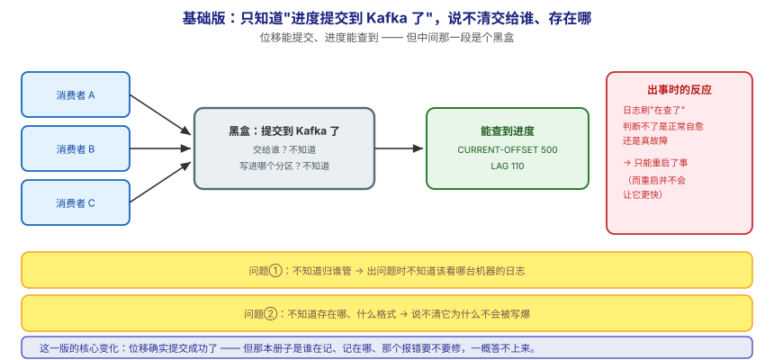
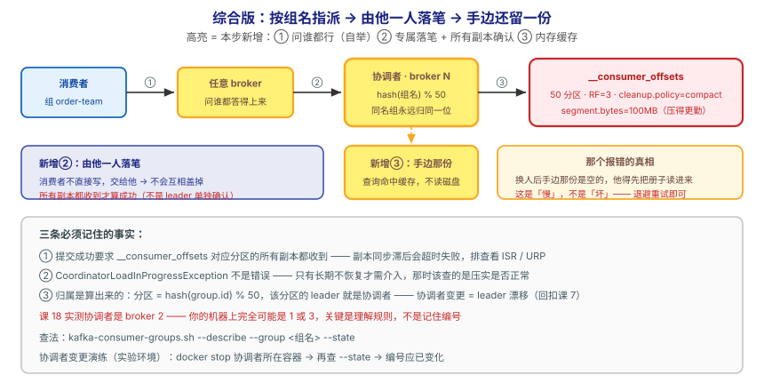

## 应用实战 · 消费者位移与协调者

> 对应课程：[课 18：消费者位移与协调者](../stages/7-实现原理/lessons/lesson-18-消费者位移与协调者.md) ｜ 覆盖知识点：消费者位移与协调者（Group Coordinator）
> 定位：**会用，不上生产**——课里学完，在这里动手（结构与边界见 SKILL.md「教学叙事骨架 · 应用实战」）。
> 环境前提：课 15 的 3 节点 KRaft 集群；单节点也能跑通第 ①步与"查协调者"。
> 📖 结论已按官方文档核对（核对于 2026-09 ｜ 来源：Apache Kafka 4.x 文档 · implementation/distribution · Consumer Offset Tracking）

## 场景：消费组不动了，日志刷着 CoordinatorLoadInProgressException

**场景**：运维群有人@你——消费组 `order-team` 不消费了，LAG 一直在涨，重启消费者也没用，日志里刷着 `CoordinatorLoadInProgressException`。你查集群：URP = 0，三个 broker 都在线。**看着像卡死了，其实只是换人了、新人正在翻册子。** 本课的知识点，就是让你能自己找到"记账的人"、看清他记在哪、并判断那个报错到底要不要修。

**全貌一句话**：真实方案还需要**压实的健康度监控**（`__consumer_offsets` 长期不压实时加载会变慢）、**消费组迁移预案**（跨集群搬迁时位移怎么跟过去）、**协调者热点的识别**（大集群上某些 broker 可能成为过多组的协调者）——本课不展开，这里只让你先把"找到协调者 → 验证位移真的写进去了 → 亲手触发一次协调者变更"这个闭环跑通。

---

## ① 基础实现：只知道"进度提交到 Kafka 了"，说不清交给谁、存在哪



> 看图：**左边**是三个消费者各自在消费；**中间**只知道"进度提交到 Kafka 了"，至于**交给谁、写进哪个分区**一概不知——像个黑盒；**右边**是出事时的反应：日志说"在查了"，你**判断不了这是正常自愈还是真故障**，只能重启了事（而重启**并不会让它更快**）。**这一版的核心变化是——位移确实提交成功了**，但**你不知道它存在哪、由谁保管、那个报错意味着什么**。

先按"黑盒"用法消费一批（**单节点也能跑**）：

```bash
# 建 topic、灌数据、消费 500 条就停（制造非零 lag）
docker exec -e KAFKA_JMX_OPTS= kafka bash -c 'export PATH=/opt/kafka/bin:$PATH
kafka-console-consumer.sh --bootstrap-server localhost:9092 \
  --topic orders --group order-team --from-beginning --max-messages 500'
```

再看这个组的进度（这一步大家都会）：

```bash
docker exec -e KAFKA_JMX_OPTS= kafka bash -c 'export PATH=/opt/kafka/bin:$PATH
kafka-consumer-groups.sh --bootstrap-server localhost:9092 --describe --group order-team'
```

输出形如：

```
GROUP       TOPIC   PARTITION  CURRENT-OFFSET  LOG-END-OFFSET  LAG
order-team  orders  0          500             610             110
```

> ⚠️ **它的问题**：**这一版能提交、也能查到进度，但三个关键问题答不上来**——
> 1. **不知道归谁管**：这个组的位移由哪个 broker 负责？不知道 → 出问题时不知道该看哪台机器的日志。
> 2. **不知道存在哪、什么格式**：`__consumer_offsets` 是什么？多少分区？为什么它不会被写爆？
> 3. **把"在查了"当成故障**：看到 `CoordinatorLoadInProgressException` 就重启、就"修"——**而重启恰恰是最没用的动作**。

---

## ② 综合实现：找到记账的人，验证他真记下了，再亲手换一次人



> 看图：**比上一张多了三处变化**——① **多了一步"问谁都行"**：向任意 broker 发一句"我归谁管"就能拿到答案（自举），**不用事先知道**——归属由 `hash(组名) % 50` 决定，**同名组永远归同一位**；② **由他一人落笔**：消费者不直接写册子，交给他写进 `__consumer_offsets` 的对应分区，**且要所有副本都收到才算成功**；③ **他手边还留一份**：查询直接命中缓存，不读磁盘。**右下那格是那个报错的真相**：换人后手边那份是空的，他得先把册子读进来，这期间谁来问都回"在查了"——**这是慢，不是坏**。

**第 1 步：查出这个组归谁管（关键在 `--state`）：**

```bash
docker exec -e KAFKA_JMX_OPTS= kafka bash -c 'export PATH=/opt/kafka/bin:$PATH
kafka-consumer-groups.sh --bootstrap-server localhost:9092 \
  --describe --group order-team --state'
```

输出形如：

```
GROUP       COORDINATOR (ID)   ASSIGNMENT-STRATEGY  STATE   #MEMBERS
order-team  kafka-2:9092 (2)   -                    Empty   0
```

**第 2 步：看清那本册子长什么样（50 分区 + 压实）：**

```bash
docker exec -e KAFKA_JMX_OPTS= kafka bash -c 'export PATH=/opt/kafka/bin:$PATH
kafka-topics.sh --bootstrap-server localhost:9092 --describe --topic __consumer_offsets
kafka-configs.sh --bootstrap-server localhost:9092 \
  --entity-type topics --entity-name __consumer_offsets --describe'
```

> ⏳ **课 18 实测**（3 节点 · `apache/kafka:4.0.0`）：`PartitionCount: 50`、`ReplicationFactor: 3`；配置为 `cleanup.policy=compact`（**动态覆盖**默认 `delete`）、`segment.bytes=104857600`（100MB，**动态覆盖**默认 1GB）、`compression.type=producer`。
> ✅ **单节点也能看到同样的配置**——`cleanup.policy=compact` 与 `segment.bytes=100MB` 是 broker 内置的内部主题配置，与集群规模无关。
> ⚠️ **协调者编号取决于 `hash("组名") % 50` 与分区 leader 分布**：课 18 实测是 broker 2，**你的机器上完全可能是 1 或 3**。关键是理解规则，不是记住编号。

**第 3 步（可选，3 节点）：亲手触发一次协调者变更，把那个报错造出来：**

```bash
# 停掉当前协调者所在的 broker（按你 --state 查到的编号调整，本例是 2）
docker stop l15-kafka-2
sleep 10

# 再查一次：协调者编号应该变了
docker exec -e KAFKA_JMX_OPTS= l15-kafka-1 bash -c 'export PATH=/opt/kafka/bin:$PATH
kafka-consumer-groups.sh --bootstrap-server kafka-1:9092 --describe --group coord-team --state'

# 恢复
docker start l15-kafka-2
```

> ⏳ **课 18 实测**：停掉协调者所在 broker 后，协调者编号**从 2 变成 1 或 3**——这正是 `CoordinatorLoadInProgressException` 的触发场景。
> ⚠️ **此操作会让 `__consumer_offsets` 部分分区短暂不可用，请在实验环境执行。**

**这段代码把基础版的三个问题逐个解决掉了**：

| 基础版的问题 | 综合版怎么解决 | 对应本课知识点 |
|---|---|---|
| 不知道归谁管 | `--describe --group <组名> --state` 直接查协调者 | 协调者的角色与发现方式 |
| 不知道存在哪、会不会写爆 | 查 `__consumer_offsets`：50 分区 + `cleanup.policy=compact` | 压实主题只留最新位移 |
| 把"在查了"当故障 | 理解它是缓存未加载完的自愈状态，退避重试即可 | 协调者变更与加载中状态 |

> 🔴 **三条必须记住的事实**：
> 1. **提交成功要求 `__consumer_offsets` 对应分区的**所有副本**都收到**，不是 leader 单独确认（不同于普通 topic 的 `acks`）。副本同步滞后会让提交**超时失败**，此时排查方向是查该分区的 ISR 是否完整、URP 是否为 0。
> 2. **`CoordinatorLoadInProgressException` 不是错误**。它是"新协调者缓存为空、正在加载分区"的正常状态，客户端自动退避重试。**只有长期不恢复**才需要介入——那时该查的是**压实是否正常工作**（分区太大时加载会很久）。
> 3. **归属是算出来的，不是随机的**：`分区 = hash(group.id) % 50`，**该分区的 leader 就是协调者**。所以"协调者变更"的本质，就是 `__consumer_offsets` 某个分区的 leader 漂移了（回扣课 7）。

> ⏳ **数字来源说明**：50 个分区、RF=3、100MB 段大小、协调者编号 2、`CURRENT-OFFSET=500` 均为**课 18 三节点环境实测值**；`--max-messages 500` 为演示取值（用于制造非零 lag）。**协调者编号换环境就会不同**，请以你自己 `--state` 的输出为准。

> 🎯 **会用标志**：给你一个"消费组卡住 + 刷 CoordinatorLoadInProgressException"的现场，你能查出它归谁管、说清位移写进了哪个分区的哪个主题、判断这个报错**该等还是该查**，并知道该去看压实是否正常。

## 🧭 导航

- ⬅️ 回到课程：[课 18：消费者位移与协调者](../stages/7-实现原理/lessons/lesson-18-消费者位移与协调者.md)
- 📚 全部实战：[应用实战索引](INDEX.md)
- ⬅️ 上一课实战：[17 · 先看咽喉再下结论](17-网络层与请求处理模型.md)
- ➡️ 下一课实战：[19 · 问一句，取交集，不停服](19-协议版本与兼容性.md)
