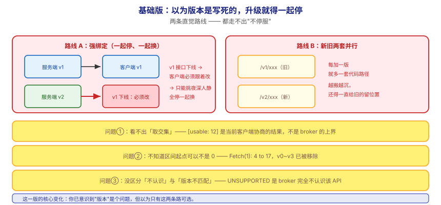
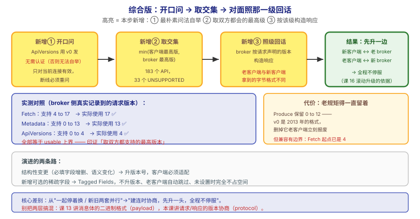

## 应用实战 · 协议版本与兼容性

> 对应课程：[课 19：协议版本与兼容性](../stages/7-实现原理/lessons/lesson-19-协议版本与兼容性.md) ｜ 覆盖知识点：协议版本与兼容性
> 定位：**会用，不上生产**——课里学完，在这里动手（结构与边界见 SKILL.md「教学叙事骨架 · 应用实战」）。
> 环境前提：第 3 课起的本机 Kafka（`localhost:9092`）即可跑通全部步骤；3 节点栈可选。
> 📖 结论已按官方文档核对（核对于 2026-09 ｜ 来源：Apache Kafka 4.x 文档 · design/protocol · Compatibility；KIP-35）

## 场景：老板问"升级要不要停业务"，你答不上来

**场景**：要把集群从 3.x 升到 4.0。老板问："**升级要不要停业务？先升 broker 还是先升客户端？**"——这是个价值百万的问题：如果必须全停一起升，就是一次全站停服；如果可以滚动升级，风险与成本天差地别。官方给了明确承诺（**双向兼容**），但**你得能自己证明它**，而不是照着背。

**全貌一句话**：真实方案还需要**客户端版本矩阵的实测**（你们在用的每个客户端库分别能协商到哪一级）、**滚动升级演练**（逐个 broker 重启期间的业务连续性验证）、**废弃版本的清理策略跟踪**（关注官方 deprecation 公告，避免老客户端某天突然连不上）——本课不展开，这里只让你先把"查能力表 → 找到 UNSUPPORTED → 验证实际使用的版本"这个闭环跑通。

---

## ① 基础实现：以为"版本是写死的"，升级就得一起停



> 看图：**上排**是直觉中的版本模型——服务端提供 v1，客户端用 v1；升到 v2 后 v1 下线，**客户端必须跟着改**，于是只能挑夜深人静**一起停、一起换**；**下排**是另一种直觉——服务端同时维护 `/v1`、`/v2` 两套接口，**每加一版就多一套代码路径**，越搬越沉。**这一版的核心变化是——你已经意识到"版本"是个问题**，但**以为只有这两条路可选**。

先看看能不能查到"对面支持什么"（**本机单节点即可**）：

```bash
docker exec -e KAFKA_JMX_OPTS= kafka bash -c 'export PATH=/opt/kafka/bin:$PATH
kafka-broker-api-versions.sh --bootstrap-server localhost:9092 | head -20'
```

输出形如（前几行）：

```
localhost:9092 (id: 1 rack: null isFenced: false) -> (
	Produce(0): 0 to 12 [usable: 12],
	Fetch(1): 4 to 17 [usable: 17],
	ListOffsets(2): 1 to 10 [usable: 10],
	Metadata(3): 0 to 13 [usable: 13],
	...
)
```

> ⚠️ **它的问题**：**这一版能看到能力表，但三个关键结论还没成形**——
> 1. **看不出"取交集"这回事**：`[usable: 12]` 到底是什么？它是**当前这个客户端**与 broker 协商的结果，**不是 broker 的上界**。换个老客户端来查，`usable` 会变小。
> 2. **不知道区间起点可以不是 0**：`Fetch(1): 4 to 17`——起点是 4，因为 **v0~v3 已被移除**。这说明"双向兼容"**有边界**。
> 3. **没区分"不认识"和"版本不匹配"**：`UNSUPPORTED` 是 broker 完全不认识这个 API，与"认识但版本对不上"是两回事。

---

## ② 综合实现：问一句拿清单 → 取交集 → 验证对面真的按那一级回话



> 看图：**比上一张多了三处变化**——① **先用最朴素的问法开口**（`ApiVersions` 用最低版本 v0 发送，**无需认证**即可拿到清单——否则还没开口就被拦住了）；② **两边各退一步取交集**，规则是 `min(客户端最高版, broker 最高版)`；③ **对面照你说好的那一级回话**——老客户端和新客户端连同一个 broker，**拿到的字节格式不同**，各自都能解析。**右下那格是代价**：能先升一头，是因为老版本的 schema 得一直留着。

**第 1 步：数一下有多少个 API，以及有多少个"还不会"：**

```bash
docker exec -e KAFKA_JMX_OPTS= kafka bash -c 'export PATH=/opt/kafka/bin:$PATH
echo "--- API 总数 ---"
kafka-broker-api-versions.sh --bootstrap-server localhost:9092 | grep -c "usable:"
echo "--- 不支持的 API ---"
kafka-broker-api-versions.sh --bootstrap-server localhost:9092 | grep UNSUPPORTED
echo "--- 不支持的数量 ---"
kafka-broker-api-versions.sh --bootstrap-server localhost:9092 | grep -c UNSUPPORTED'
```

> ⏳ **课 19 实测**（`apache/kafka:4.0.0`）：API 总数 **183**，其中 **33 个 UNSUPPORTED**（较新的 Share Group / Telemetry 等能力）。举例：`ShareGroupHeartbeat(76): UNSUPPORTED`、`GetTelemetrySubscriptions(71): UNSUPPORTED`。
> ⚠️ **这些数字随 Kafka 版本变化**——请以你自己 `grep -c` 的输出为准。注意 `ConsumerGroupHeartbeat(68): 0 to 1 [usable: 1]` 是**支持**的新协议，说明 UNSUPPORTED 反映的是"该 broker 版本尚未实现"，**不是"编号大就不支持"**。

**第 2 步：验证"取交集"——对比 broker 上界与客户端实际使用的版本。**

单节点环境用 CLI 直接看 `usable` 一列（它就是协商结果）：

```bash
docker exec -e KAFKA_JMX_OPTS= kafka bash -c 'export PATH=/opt/kafka/bin:$PATH
kafka-broker-api-versions.sh --bootstrap-server localhost:9092 \
  | grep -E "Produce\(0\)|Fetch\(1\)|Metadata\(3\)|ApiVersions\(18\)"'
```

3 节点 + Prometheus 时，可以直接看 broker 侧**实际收到**的请求版本（更有说服力）：

```bash
# 先制造一点流量
docker exec l15-kafka-1 bash -c 'export PATH=/opt/kafka/bin:$PATH; unset KAFKA_JMX_OPTS
kafka-producer-perf-test.sh --topic net-demo --num-records 8000 --record-size 512 \
  --throughput -1 --producer-props bootstrap.servers=kafka-1:9092 acks=1'

# 再看 broker 实际按哪个版本在处理
curl -s http://localhost:17071/metrics \
  | grep -E 'requestspersec_count_total\{request="(Fetch|Metadata|ApiVersions)"' | grep -v '^#'
```

> ⏳ **课 19 实测**：broker 侧记录到 `Fetch version=17`、`Metadata version=13`、`ApiVersions version=4`——**均等于 broker 的 usable 上界**。这直接印证官方规则：客户端用的正是**双方都支持的最高版本**。

**这段代码把基础版的三个问题逐个解决掉了**：

| 基础版的问题 | 综合版怎么解决 | 对应本课知识点 |
|---|---|---|
| 看不出"取交集" | `usable` = `min(客户端最高版, broker 最高版)`，换客户端会变 | 版本协商规则 |
| 不知道区间起点可不为 0 | `Fetch: 4 to 17` —— v0~v3 已被移除 | 兼容有边界 |
| 没区分"不认识"与"版本不匹配" | `UNSUPPORTED` = broker 完全不认识该 API | 能力表字段语义 |

> 🔴 **三条必须记住的事实**：
> 1. **双向兼容是官方承诺，也因此可以"先升一边、不停服"**：新客户端能连老 broker、老客户端也能连新 broker。课 16 的"不停服滚动升级"底层依据就是这个。
> 2. **`ApiVersions` 是刻意设计的自举口子**：用**最低版本 v0** 发送、**无需认证**（否则未认证客户端无法开口问）、且**结果只对当前连接有效**——断线重连必须重新问，因为 broker 可能已经升降级了。
> 3. **演进有两条路**：结构性变更（必填字段增删、语义变化）→ **升版本号**；新增**可选的稀疏字段** → **Tagged Fields**，不升版本、老客户端自动跳过、且**未设置时完全不占空间**。

> ⏳ **数字来源说明**：183 / 33 / `Produce(0): 0 to 12` / `Fetch(1): 4 to 17` / `Metadata(3): 0 to 13` / 实际使用 `Fetch=17 / Metadata=13 / ApiVersions=4` 均为**课 19 三节点环境实测值**（`apache/kafka:4.0.0`），**随 Kafka 版本变化**；`--num-records 8000` 为演示取值。请以你自己环境中 `kafka-broker-api-versions.sh` 的实际输出为准。

> ⚠️ **别把两层搞混**：课 13 讲的是**消息体的二进制格式**（货长什么样），本课讲的是**请求/响应的版本协商**（用哪套规矩解读）。前者是 payload，后者是 protocol。

> 🎯 **会用标志**：老板问"升级要不要停业务"，你能给出"先升一边、不停服"的答案并拿出证据：能查到能力表、说清 `usable` 是怎么算出来的、指出哪些 API 还不支持，并解释**这个承诺的代价是什么**（老版本 schema 得一直留着）。

## 🧭 导航

- ⬅️ 回到课程：[课 19：协议版本与兼容性](../stages/7-实现原理/lessons/lesson-19-协议版本与兼容性.md)
- 📚 全部实战：[应用实战索引](INDEX.md)
- ⬅️ 上一课实战：[18 · 找到记账的那个人](18-消费者位移与协调者.md)
- 🎓 阶段 7 收官 → [应用实战索引](INDEX.md) · [课程手册](../final-课程手册.md)
