# LangChain 系统学习 · 课程手册

> **本手册是什么**：把 4 个阶段、13 课、结课实战项目与配套产物汇总成一本「可通读、可复习、可定位」的手册——每课保留**课级入口要素（一句话本质 / 处境对照 / 一眼全局图 / 本课地图）**、**一图总结**、**文档核对留痕**与**官方文档链接**；正文细节以各课完整讲义为准（点击每课标题跳转）。
>
> **时效与可信度**：全部教学结论核对于 **2026-09**；每课保留其「📖 结论已按官方文档核对」留痕与「📚 官方文档」链接——判断内容时效时以它们为准。技术栈：langchain 1.4.0（Python 3.12）。
>
> **生成时间**：2026-09-16（课程全部产物交付后汇总）。

## 📖 怎么用这本手册

- **系统通读**：按阶段顺序读每课的「入口要素 + 一图总结」，几分钟重建全局；需要细节时点回讲义。
- **复习速览**：只看每课「一图总结」（两课为 mermaid，其余为 SVG），想不起的再回看「本课地图」。
- **定位查找**：用下方阶段小节直达某一课；查完课程后，配套的《排障速查手册》《场景解法库》承接「出错怎么办 / 新需求怎么设计」。

---

## 🎯 学习总览

### 学习目标

- **目标类型**：动手实操（理解机制 → 组件实操 → 组装完整应用）
- **目标说明**：从零系统掌握 LangChain（Python 版）核心组件体系，能独立把"只会聊天的模型"组装成可运行、可控、可观测的智能体应用
- **实操环境**：uv 管理的 `playground/` 项目（Python 3.12，依赖锁定）+ 已实测接入的双 API 链路（阿里云百炼【默认】/ DeepSeek 备用；凭据在 `.env`，不入库）

### 故事主线

- **主角**：一个"只会聊天"的语言模型（LLM）
- **冲突**：要让它真正干活（用工具、记上下文、跑多步任务），裸调 API 的代码会迅速失控——每家厂商一套格式、工具循环手写、历史自己维护、出错无从控制
- **收束**：用 LangChain 的组件体系把模型组装成"生产可用"的智能体——模型是大脑、工具是手脚、记忆是经验、中间件是纪律、多智能体是团队

### 学习路径图

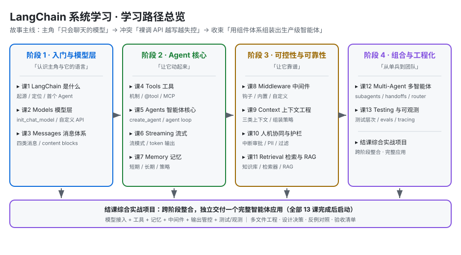

> SVG 展示：4 个阶段、各阶段主题、阶段间前置依赖箭头。

### 阶段总览

**阶段 1：入门与模型层（认识零件）**
- **目标**：搞懂 LangChain 的定位与演化逻辑，跑通第一个 agent，掌握"模型 + 消息"两个基础层
- **学习重点**：起源与 1.0 大重构、Agent = Model + Harness 心智模型、模型接入（含自定义 endpoint）、标准消息体系
- **必须掌握**：能说清"为什么 chains 被砍掉、只留 create_agent"；能接入自定义 API 并切换模型；能说出四类消息各自的角色
- **对应课**：课 1（LangChain 是什么）、课 2（Models 模型层）、课 3（Messages 消息体系）

**阶段 2：Agent 核心（让它动起来）**
- **目标**：掌握工具、智能体、流式、记忆四个核心组件，跑通"模型 → 工具 → 循环 → 记忆"完整链路
- **学习重点**：工具机制与创建、create_agent 与 agent loop、结构化输出、流式输出、短期/长期记忆
- **必须掌握**：能写出带自定义工具的 agent 完成多步任务；能输出结构化 JSON；能做流式输出；能让对话有记忆
- **对应课**：课 4（Tools 工具）、课 5（Agents 智能体核心）、课 6（Streaming 流式输出）、课 7（Memory 记忆）

**阶段 3：可控性与可靠性（让它靠谱）**
- **目标**：从"能跑"到"可控"——用中间件、上下文工程、人机协同、RAG 把 agent 的可靠性立起来
- **学习重点**：中间件机制与内置中间件、上下文工程三层次、中断审批与护栏、检索与 RAG
- **必须掌握**：能用中间件控制行为（摘要/审批/重试）；能设计上下文策略；能实现带审批的高风险动作流；能搭一个最小 RAG
- **对应课**：课 8（Middleware 中间件）、课 9（Context Engineering 上下文工程）、课 10（人机协同与护栏）、课 11（Retrieval 检索与 RAG）

**阶段 4：组合与工程化（从单兵到团队）**
- **目标**：学会把能力组合成系统——多智能体架构、测试与可观测性
- **学习重点**：多智能体四大模式（subagents/handoffs/router/skills）、单元与集成测试、Agent Evals、LangSmith tracing
- **必须掌握**：能判断何时该拆多智能体并选对模式；能给 agent 写测试；能接上 tracing 排查问题
- **对应课**：课 12（Multi-Agent 多智能体）、课 13（Testing 与 Observability）

**结课综合实战（Phase 3）**：跨阶段整合，独立交付一个完整的智能体应用——已完成（详见文末「综合实战项目」章节）。

> **课程进度**：全部 13 课、结课项目与配套产物均已交付（2026-09-15 ~ 09-16）；本手册为汇总收尾。

---

## 阶段 1：入门与模型层

> **故事章节**：「认识主角：模型与它的语言」
> **阶段目标**：说清 LangChain 的定位、演化逻辑与生态关系；建立 Agent = Model + Harness 的全局心智模型；在本机接入自定义 LLM API 并跑通第一个 create_agent。
> **学习重点**：起源与 1.0 大重构｜Agent = Model + Harness｜模型接入（含自定义 endpoint）｜标准消息体系
> 完整概览（含"必须掌握"清单）：[阶段 1 概览](stages/1-入门与模型层/overview.md)

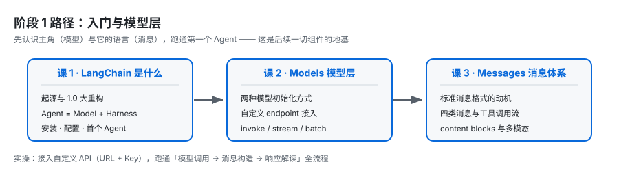

---

### [课 1：LangChain 是什么（起源与定位）](stages/1-入门与模型层/lessons/lesson-01-LangChain是什么.md)

> 📖 结论已按官方文档核对（核对于 2026-09 ｜ 来源：docs.langchain.com 的 overview / philosophy / install / component-architecture / quickstart；起源史已另行联网交叉核实）

**📌 一句话本质**：把"只会一问一答的模型"组装成"能自己动手完成任务的应用"——模型还是那个模型，区别在它外面加的那一圈配套。

**⚖️ 处境对照**：想让模型"干活"，裸调 API 意味着每件事都手写——解析它想调什么、替它执行、把结果拼回去、循环到结束，换一个模型供应商还得再适配一遍；用 LangChain 的组件组装，本课实测约 30 行代码跑通一个带工具调用的完整 agent，一次完整问答本机实测 8.4 秒（核对于 2026-09）。

**🧭 一眼全局图**

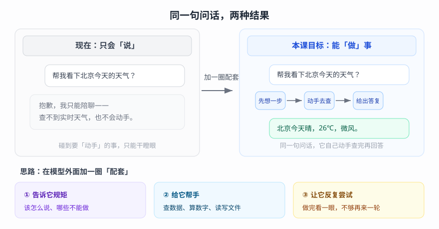

> 看图：左边是现在的模型——问它要动手的事，它只能干瞪眼；右边是本课的目标——同一句问话，它自己"先想一步、动手去查、给出答复"；中间的差别，就是在模型外面加的那一圈配套（规矩、帮手、反复尝试）。

**🗺️ 本课地图**

| 步 | 这一步要解决什么（人话） | 对应知识点 |
|:--:|------------------------|-----------|
| 1 | 先搞清"它为什么长成今天这样"——不然后面看什么都对不上号 | 知识点 1：LangChain 的起源与演进史 |
| 2 | 再建立它的"公式"——一个模型加上一圈什么，就成了能干活的系统 | 知识点 2：Agent = Model + Harness |
| 3 | 最后亲手把它跑起来——装好、配好、看到第一个回复 | 知识点 3：安装与第一个 Agent |

**🖼️ 一图总结**

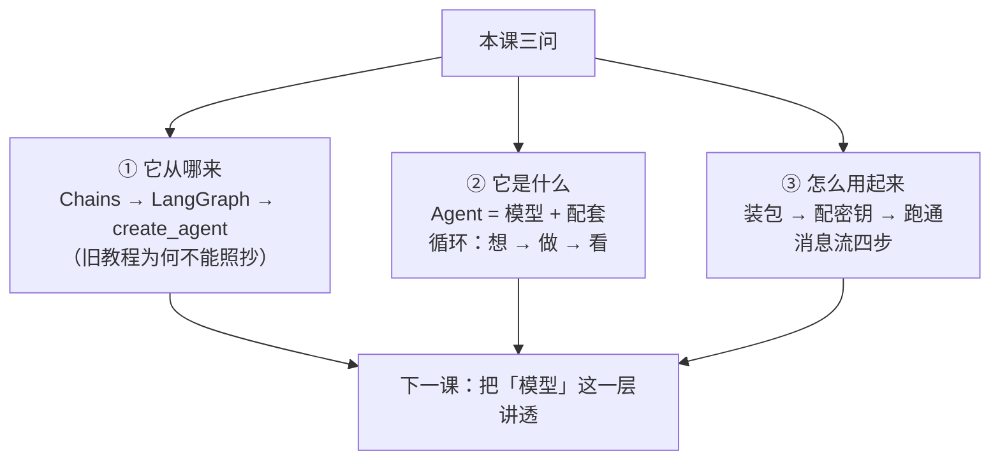
```mermaid
flowchart TD
    A["本课三问"] --> B["① 它从哪来<br>Chains → LangGraph → create_agent<br>（旧教程为何不能照抄）"]
    A --> C["② 它是什么<br>Agent = 模型 + 配套<br>循环：想 → 做 → 看"]
    A --> D["③ 怎么用起来<br>装包 → 配密钥 → 跑通<br>消息流四步"]
    B --> E["下一课：把「模型」这一层讲透"]
    C --> E
    D --> E
```

> 看图：左边三个节点是本课回答的三个问题（来历、是什么、怎么用），右边汇入同一个出口——下一课要深入的方向。

**📚 官方文档**

- [Philosophy（含完整演进时间线）](https://docs.langchain.com/oss/python/langchain/philosophy)
- [LangChain overview（Agent = Model + Harness 出处）](https://docs.langchain.com/oss/python/langchain/overview)
- [Component architecture（组件生态全景）](https://docs.langchain.com/oss/python/langchain/component-architecture)
- [Install LangChain](https://docs.langchain.com/oss/python/langchain/install)
- [Quickstart（首个 agent）](https://docs.langchain.com/oss/python/langchain/quickstart)

---

### [课 2：Models 模型层（接入任意大模型）](stages/1-入门与模型层/lessons/lesson-02-Models模型层.md)

> 📖 结论已按官方文档核对（核对于 2026-09 ｜ 来源：docs.langchain.com 的 models 页；报错类型、token 预算、profile 空值等结论为本机实测）

**📌 一句话本质**：把"每家平台各写一套接入代码"变成"一套统一接口 + 一份配置"——换平台、换模型、调参数、看账单，都在这一个入口里完成。

**⚖️ 处境对照**：裸用各家 SDK，接 N 个平台要写 N 套适配与错误处理；用统一的模型接口，接新平台只是加一段配置——本课实测同一份脚本接通两个平台（含并发与账单统计），每个平台仅一段配置（模型名 + 密钥 + 地址），两平台 3 条并发分别 2.99s / 2.20s（核对于 2026-09）。

**🧭 一眼全局图**

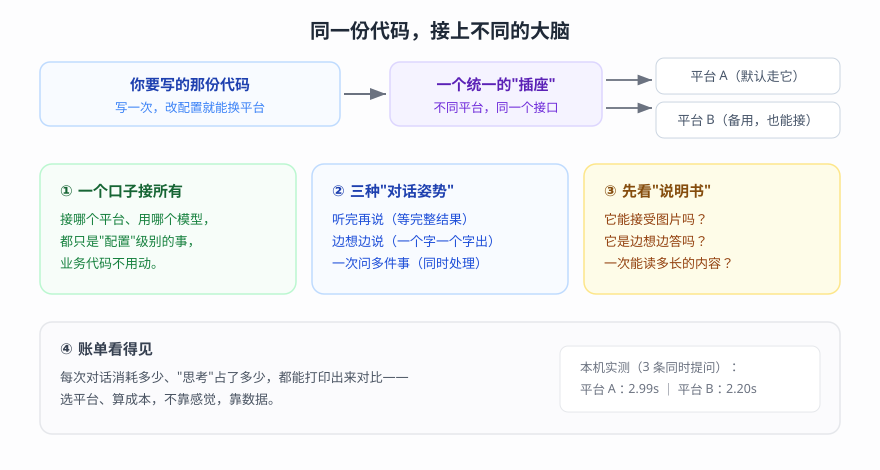

> 看图：上半部分是核心思想——同一份代码，换配置就能接上不同平台；下半部分是本课要交代清楚的四件事：一个口子接所有（接入）、三种对话姿势（调用）、先看说明书（能力）、账单看得见（用量）。

**🗺️ 本课地图**

| 步 | 这一步要解决什么（人话） | 对应知识点 |
|:--:|------------------------|-----------|
| 1 | 代码里"接上模型"这件事，有几种写法、该用哪种 | 知识点 1：模型初始化的两种方式 |
| 2 | 不接官方地址，接自建网关 / 第三方端点，怎么配、错了怎么查 | 知识点 2：自定义 endpoint 接入 |
| 3 | 和模型"对话"的三种姿势，以及参数怎么调（含空白输出之谜） | 知识点 3：模型参数与调用方式 |
| 4 | 开工前先问它"你会什么"——能力清单、图片、思考过程 | 知识点 4：模型能力探测与多模态 |

**🖼️ 一图总结**

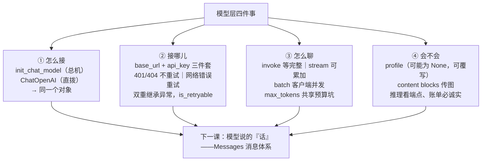
```mermaid
flowchart TD
    A["模型层四件事"] --> B["① 怎么接<br>init_chat_model（总机）<br>ChatOpenAI（直拨）<br>→ 同一个对象"]
    A --> C["② 接哪儿<br>base_url + api_key 三件套<br>401/404 不重试｜网络错误重试<br>双重继承异常，is_retryable"]
    A --> D["③ 怎么聊<br>invoke 等完整｜stream 可累加<br>batch 客户端并发<br>max_tokens 共享预算坑"]
    A --> E["④ 会不会<br>profile（可能为 None，可覆写）<br>content blocks 传图<br>推理看端点、账单必诚实"]
    B --> F["下一课：模型说的『话』——Messages 消息体系"]
    C --> F
    D --> F
    E --> F
```

> 看图：四个分支对应本课四个知识点，每个分支下是一句话结论（含各自的坑），最终汇聚到下一课的方向。

**📚 官方文档**

- [Models（初始化两种方式 / provider:model 约定）](https://docs.langchain.com/oss/python/langchain/models)
- [Models · Base URL and proxy settings](https://docs.langchain.com/oss/python/langchain/models)
- [Models · Model exceptions（九种标准异常）](https://docs.langchain.com/oss/python/langchain/models)
- [Models · Invocation（invoke/stream/batch）](https://docs.langchain.com/oss/python/langchain/models)
- [Models · Parameters](https://docs.langchain.com/oss/python/langchain/models)
- [Models · Advanced topics（profiles / multimodal / reasoning）](https://docs.langchain.com/oss/python/langchain/models)
- [Messages · 多模态内容块](https://docs.langchain.com/oss/python/langchain/messages)

---

### [课 3：Messages 消息体系（模型的标准语言）](stages/1-入门与模型层/lessons/lesson-03-Messages消息体系.md)

> 📖 结论已按官方文档核对（核对于 2026-09 ｜ 来源：docs.langchain.com 的 messages 页；角色名单、无状态对照、懒解析、序列化警告等结论为本机实测）

**📌 一句话本质**：把"每次给模型递一句话"变成"递一本记满『谁说了什么』的账本"——账本用同一套写法书写，递给任何平台都能读；账本递多长，它就"记得"多少。

**⚖️ 处境对照**：不这么写——换一个平台重写一套拼接与解析；想让助手"记得"，得自己发明历史管理逻辑，且每个组件（工具、记忆、流式）都要为每家平台各适配一遍。这么写——同一份消息列表通行所有平台（本课实测：三种构造写法拿到同一种返回、"记忆"只需把历史原样递回）；实测对照：带历史它答"您的幸运数字是 42"，不带历史它说"我没法真正知道你的幸运数字"（核对于 2026-09）。

**🧭 一眼全局图**

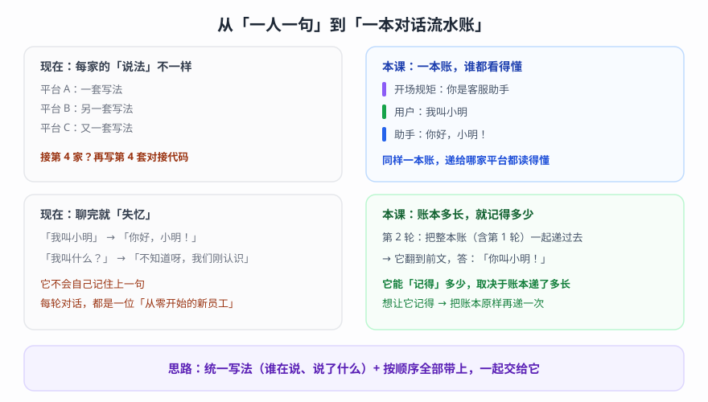

> 看图：左边是现状——"每家平台一套写法"、"聊完就失忆"；右边是本课的两条解法——"一本账谁都看得懂"（统一写法）与"账本多长就记得多少"（历史随请求携带）；底部是总思路。

**🗺️ 本课地图**

| 步 | 这一步要解决什么（人话） | 对应知识点 |
|:--:|------------------------|-----------|
| 1 | 先搞清"为什么要统一说法"——它解决的到底是什么问题 | 知识点 1：为什么需要标准消息格式 |
| 2 | 账本里都有谁在发言？一次真实链路怎么走、怎么对上号 | 知识点 2：四类消息与角色 |
| 3 | 一条发言里"装什么"——文字、图片，还是推理过程 | 知识点 3：消息内容与多模态 |
| 4 | 账本用什么"笔"写、写完了怎么"存档" | 知识点 4：构造、字典与序列化 |

**🖼️ 一图总结**

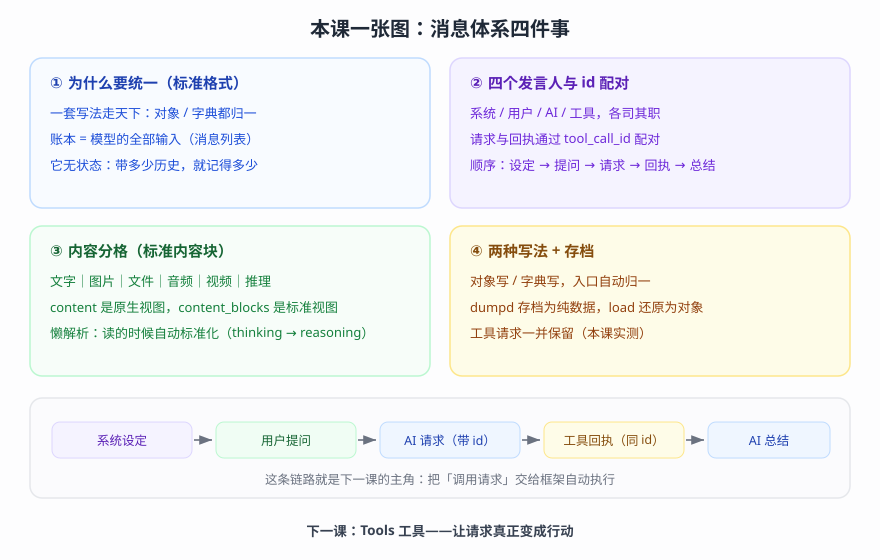

> 看图：四张卡片对应本课四件事（为什么统一 / 四类发言人与 id 配对 / 内容块与懒解析 / 两种写法与存档）；底部是那条贯穿全课的链路——下一课"Tools"就站在链路的第三、四环上。

**📚 官方文档**

- [Messages（基本用法 / 三种写法）](https://docs.langchain.com/oss/python/langchain/messages)
- [Messages · Message types（四类消息与属性）](https://docs.langchain.com/oss/python/langchain/messages)
- [Messages · Message content / Standard content blocks](https://docs.langchain.com/oss/python/langchain/messages)
- [Messages · Multimodal（图片/文件/音频/视频输入）](https://docs.langchain.com/oss/python/langchain/messages)
- [Messages · Dictionary format / Serialization](https://docs.langchain.com/oss/python/langchain/messages)

---

## 阶段 2：Agent 核心

> **故事章节**：「让它动起来：工具、循环与记忆」
> **阶段目标**：掌握工具、智能体、流式、记忆四个核心组件，跑通"模型 → 工具 → 循环 → 记忆"完整链路；能写出带自定义工具的 agent 完成多步任务；能做流式与结构化输出；让对话具备短期/长期记忆。
> **学习重点**：工具机制｜agent loop｜流式输出｜记忆（短期/长期）
> 完整概览（含"必须掌握"清单）：[阶段 2 概览](stages/2-Agent核心/overview.md)

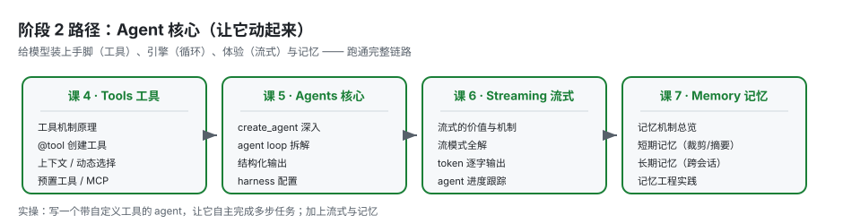

---

### [课 4：Tools 工具（让模型能干活）](stages/2-Agent核心/lessons/lesson-04-Tools工具.md)

> 📖 结论已按官方文档核对（核对于 2026-09 ｜ 来源：docs.langchain.com 的 tools / runtime / mcp 页；schema 自动生成、并行申请、错误兜底、自修正循环、动态工具集、MCP 直连与适配器接入等结论为本机实测）

**📌 一句话本质**：把函数翻译成"说明书"递给模型读；模型只会写"申请条"，真正干活的永远是你的代码——它申请、你执行、把回执递回来。

**⚖️ 处境对照**：不这么写——模型永远只能等你把数据喂到嘴边（人肉搬运）；或者冒险让它直接执行（不可控）。这么写——白名单化的受控动作 + 自动闭环；本课实测：模型在一次对话里自主完成了"申请调用分析工具 → 失败 → 阅读错误 → 换工具加载数据 → 重新分析 → 给出结论"的完整五步，全程不需要人介入（核对于 2026-09-15）。

**🧭 一眼全局图**

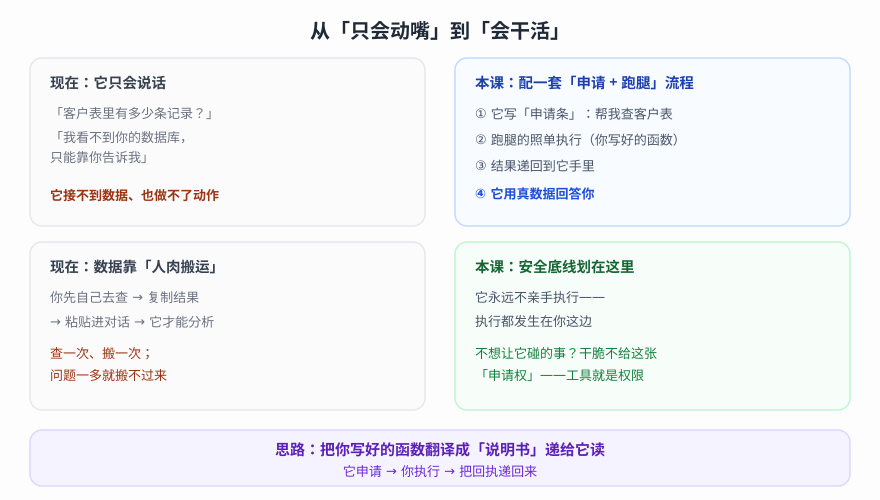

> 看图：左边是现状——"它只会说话"、"数据靠人肉搬运"；右边是本课的两条主线——"申请 + 跑腿"流程（它申请、你执行、回执递回）与安全底线（执行永远在你这边、工具集就是权限）；底部是总思路。

**🗺️ 本课地图**

| 步 | 这一步要解决什么（人话） | 对应知识点 |
|:--:|------------------------|-----------|
| 1 | 模型到底怎么"用"工具？一张申请条怎么变成结果 | 知识点 1：工具机制原理 |
| 2 | 怎么把函数写成"模型看得懂"的工具 | 知识点 2：用 @tool 创建工具 |
| 3 | 工具怎么拿到用户身份、带记忆、控权限、报错误 | 知识点 3：工具进阶（上下文/动态选择/错误处理） |
| 4 | 现成工具从哪来、MCP 是什么、还有哪些新形态 | 知识点 4：预置工具与 MCP |

**🖼️ 一图总结**

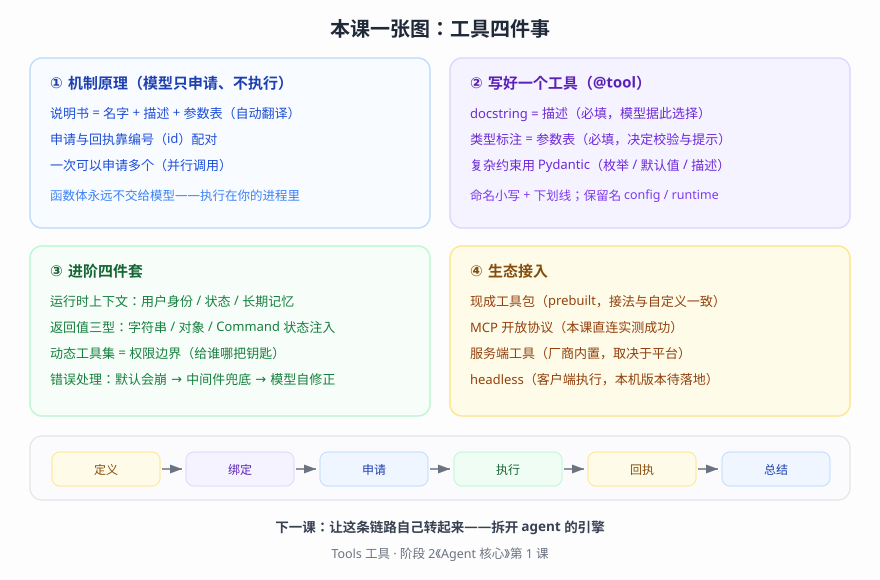

> 看图：四张卡片对应本课四件事（机制原理 / 写好工具 / 进阶四件套 / 生态接入）；底部是贯穿全课的链路——定义 → 绑定 → 申请 → 执行 → 回执 → 总结；下一课让这条链路自动转起来。

**📚 官方文档**

- [Tools（机制总览）](https://docs.langchain.com/oss/python/langchain/tools)
- [Models · Tool calling（绑定与调用流）](https://docs.langchain.com/oss/python/langchain/models)
- [Tools · Create tools（定义、属性定制、复杂 schema、保留名）](https://docs.langchain.com/oss/python/langchain/tools)
- [Tools · Access context / Tool execution / Dynamic tool selection](https://docs.langchain.com/oss/python/langchain/tools)
- [Runtime（上下文与依赖注入）](https://docs.langchain.com/oss/python/langchain/runtime)
- [Tools · Prebuilt tools / MCP servers / Server-side tool use](https://docs.langchain.com/oss/python/langchain/tools)
- [Model Context Protocol (MCP)](https://docs.langchain.com/oss/python/langchain/mcp)

---

### [课 5：Agents 智能体核心（让循环自己转起来）](stages/2-Agent核心/lessons/lesson-05-Agents智能体核心.md)

> 📖 结论已按官方文档核对（核对于 2026-09 ｜ 来源：docs.langchain.com 的 agents / structured-output / runtime / models / middleware 页；loop 内部结构、账本、终止与预算保护、结构化输出实况（含 thinking 适配与重试）、动态路由等结论为本机实测）

**📌 一句话本质**：agent = 模型在一个循环里调用工具，直到任务完成（官方原话：*An agent is a model calling tools in a loop until a given task is complete*）；而 harness = 循环之外的一切（提示词、工具、中间件）——`create_agent` 就是一个高度可配置的 harness（核对于 2026-09）。

**⚖️ 处境对照**：不这么写——每上一个新任务都重写一遍循环骨架，判断/兜错/预算全手工（累且易错）。这么写——循环交给引擎，边界交给配置；本课实测：同一个 agent 在三站任务里分别转出 0、2、3 条工具申请，全程零循环代码（核对于 2026-09-15）。

**🧭 一眼全局图**

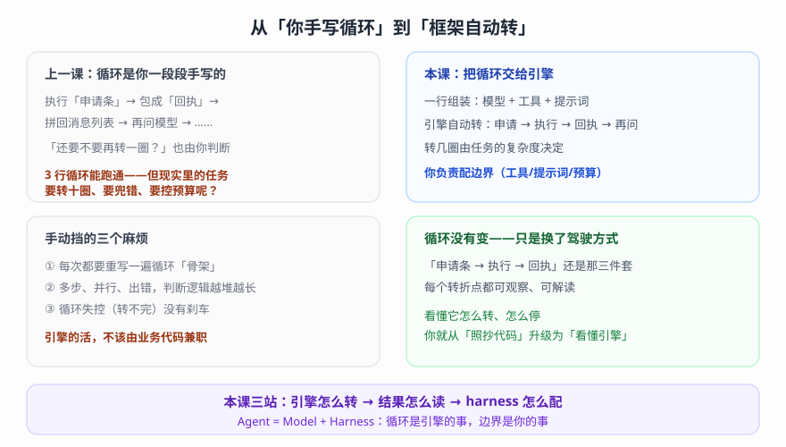

> 看图：左边是上一课的状态——循环是你手写的、判断是你人肉的、刹车根本没有；右边是本课——引擎自动转，你负责配边界；底部是总思路：本课三站（引擎怎么转 → 结果怎么读 → harness 怎么配）。

**🗺️ 本课地图**

| 步 | 这一步要解决什么（人话） | 对应知识点 |
|:--:|------------------------|-----------|
| 1 | 引擎内部的流水线长什么样、转几圈谁决定、怎么刹车 | 知识点 1：create_agent 深入 |
| 2 | invoke 该给什么、返回什么、怎么把结果变成程序能用的数据 | 知识点 2：调用与结果解读 |
| 3 | 提示词怎么配、模型怎么换、harness 还能扩展什么 | 知识点 3：harness 配置实践 |

**🖼️ 一图总结**

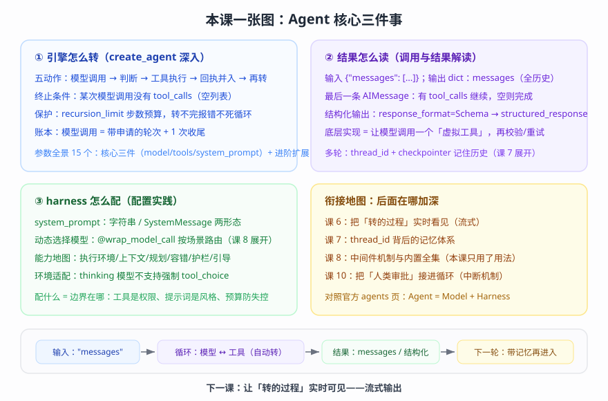

> 看图：三张卡片对应本课三站（引擎怎么转 / 结果怎么读 / harness 怎么配），第四张是"后面在哪加深"的衔接地图；底部是贯穿全课的链路——输入消息 → 循环（模型 ↔ 工具自动转）→ 结果（messages / 结构化）→ 带记忆进入下一轮。

**📚 官方文档**

- [Agents（核心页：定义、harness、create_agent 参数与扩展）](https://docs.langchain.com/oss/python/langchain/agents)
- [Component architecture（组件全景）](https://docs.langchain.com/oss/python/langchain/component-architecture)
- [Structured output（策略、schema 写法、重试）](https://docs.langchain.com/oss/python/langchain/structured-output)
- [Runtime（context / store 等运行时信息）](https://docs.langchain.com/oss/python/langchain/runtime)
- [Models · Dynamic model selection](https://docs.langchain.com/oss/python/langchain/models)
- [Agents · Configure the harness（能力六类）](https://docs.langchain.com/oss/python/langchain/agents)

---

### [课 6：Streaming 流式输出（让循环的过程实时可见）](stages/2-Agent核心/lessons/lesson-06-Streaming流式输出.md)

> 📖 结论已按官方文档核对（核对于 2026-09 ｜ 来源：docs.langchain.com 的 streaming / event-streaming 页；三种流模式、v2/v3 协议、custom 信号、reasoning tokens 等结论为本机实测）

**📌 一句话本质**：stream 不是"另一种调用"——是**同一次调用，边跑边报**。invoke 把中间过程藏起来、只给你最终结果；stream 把中间过程拆成一个个 chunk，实时递给你（核对于 2026-09）。

**⚖️ 处境对照**：不这么写——invoke 返回前用户盯空屏（本课实测：2.8 秒无任何反馈），调试靠事后翻 `messages` 列表。这么写——stream 首 chunk 在 1.4 秒即到达（实测），用户看到"正在查天气…"→"北京：晴天 22°C"→逐字输出终答；调试时每一步的节点名、消息类型、tool_calls 状态全部实时可见。

**🧭 一眼全局图**

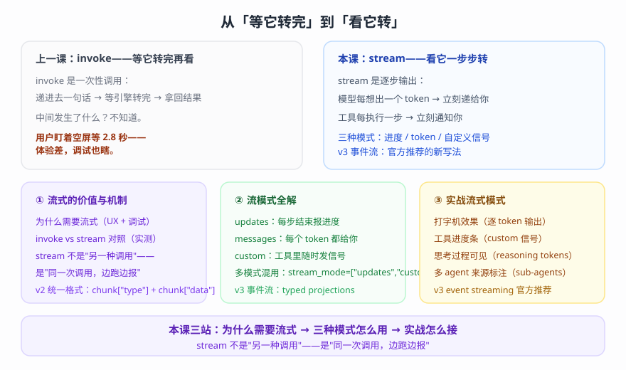

> 看图：左边是上一课的状态——invoke 一次性返回，用户盯空屏；右边是本课——stream 逐步输出，每步可见；底部是三站卡片（为什么需要流式 → 三种模式怎么用 → 实战怎么接）。

**🗺️ 本课地图**

| 步 | 这一步要解决什么（人话） | 对应知识点 |
|:--:|------------------------|-----------|
| 1 | 流式到底解决了什么问题、底层怎么传输 | 知识点 1：流式的价值与机制 |
| 2 | updates / messages / custom 三种模式各流什么、怎么选 | 知识点 2：流模式全解 |
| 3 | 打字机效果、工具进度条、v3 事件流新写法 | 知识点 3：实战流式模式 |

**🖼️ 一图总结**

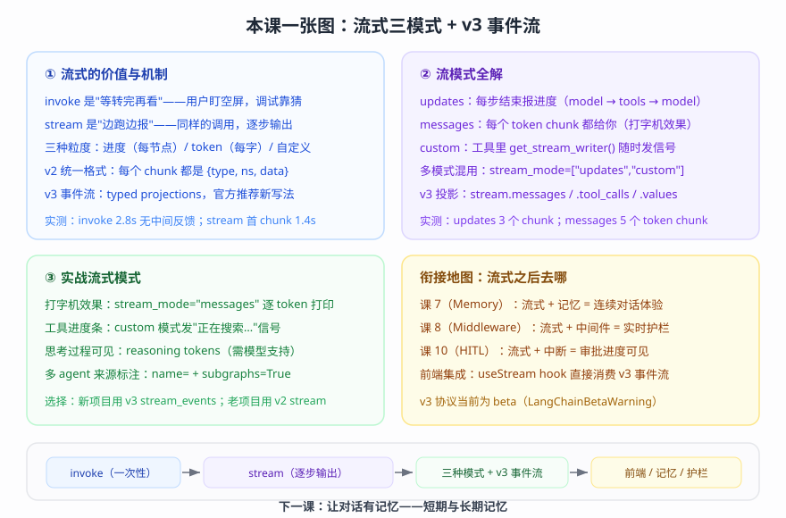

> 看图：三张卡片对应本课三站（流式的价值与机制 / 流模式全解 / 实战流式模式），第四张是"流式之后去哪"的衔接地图；底部是贯穿全课的链路——invoke（一次性）→ stream（逐步输出）→ 三种模式 + v3 事件流 → 前端 / 记忆 / 护栏。

**📚 官方文档**

- [Streaming（三种模式、v2 格式、常见模式）](https://docs.langchain.com/oss/python/langchain/streaming)
- [Event streaming（v3 协议、typed projections）](https://docs.langchain.com/oss/python/langchain/event-streaming)
- [Streaming · Supported stream modes](https://docs.langchain.com/oss/python/langchain/streaming#supported-stream-modes)
- [Streaming · Custom updates](https://docs.langchain.com/oss/python/langchain/streaming#custom-updates)
- [Streaming · Common patterns（打字机、reasoning、工具调用、HITL、子 agent）](https://docs.langchain.com/oss/python/langchain/streaming#common-patterns)
- [Event streaming（v3 协议、projections、sub-agents）](https://docs.langchain.com/oss/python/langchain/event-streaming)

---

### [课 7：Memory 记忆（从"转头就忘"到"记住你"）](stages/2-Agent核心/lessons/lesson-07-Memory记忆.md)

> 📖 结论已按官方文档核对（核对于 2026-09 ｜ 来源：docs.langchain.com 的 short-term-memory / long-term-memory / 概念篇 memory / middleware built-in 摘要段；关键行为均经本机实测——脚本 `playground/lesson-07-memory-lab.py`）

**📌 一句话本质**：记忆不是"把聊天记录都塞回去"——它是 harness 层的**"状态 + 持久化"工程**：短期记忆 = 线程内的状态（checkpointer 持久化），长期记忆 = 跨会话的 store（命名空间 + 键）。模型本身始终是无状态的（核对于 2026-09）。

**⚖️ 处境对照**：不这么写——用户每天重新自我介绍（本课实测：无 checkpointer 的 agent 面对老用户如实回答"我不知道你的名字哦"），历史无限增长拖慢且费钱。这么写——同线程自动接续（实测：第二轮直接答出"你叫小明，最喜欢蓝色"），跨会话召回用户信息（实测：新线程里照样答出"你叫小明"），且历史规模可控（实测：消息数封顶 6 条）。

**🧭 一眼全局图**

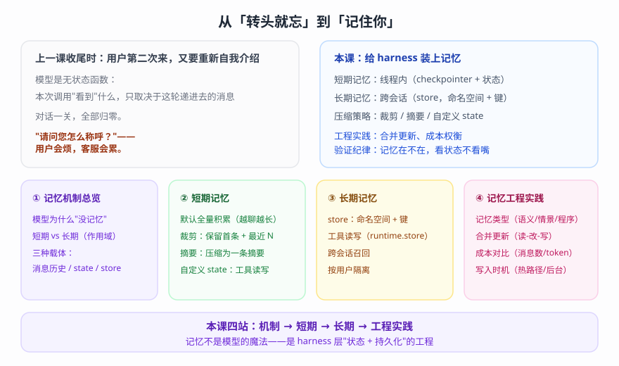

> 看图：左边是问题——用户第二次来又要重新自我介绍；右边是本课方案——短期（checkpointer）+ 长期（store）+ 压缩策略 + 工程实践；底部四张卡片对应本课四站。

**🗺️ 本课地图**

| 步 | 这一步要解决什么（人话） | 对应知识点 |
|:--:|------------------------|-----------|
| 1 | 模型为什么"没记忆"、记忆到底放在哪 | 知识点 1：记忆机制总览 |
| 2 | 聊得太长怎么办（全量 / 裁剪 / 摘要 / 自定义 state） | 知识点 2：短期记忆 |
| 3 | 换个会话为什么还认得你（store 与跨会话召回） | 知识点 3：长期记忆 |
| 4 | 记什么、怎么更新、花多少钱（工程取舍） | 知识点 4：记忆工程实践 |

**🖼️ 一图总结**

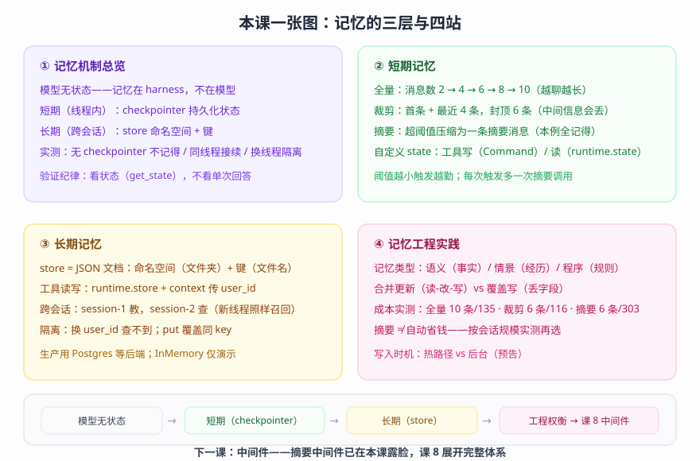

> 看图：四张卡片对应本课四站（机制总览 / 短期 / 长期 / 工程实践），底部链路——模型无状态 → 短期（checkpointer）→ 长期（store）→ 工程权衡，以及通往课 8 中间件的下一站。

**📚 官方文档**

- [Short-term memory（checkpointer、状态机制、管理策略）](https://docs.langchain.com/oss/python/langchain/short-term-memory)
- [Long-term memory（store、命名空间、工具读写）](https://docs.langchain.com/oss/python/langchain/long-term-memory)
- [Short-term memory · Common patterns（裁剪/删除/摘要）](https://docs.langchain.com/oss/python/langchain/short-term-memory#common-patterns)
- [Short-term memory · Access memory（工具/提示词/钩子读写）](https://docs.langchain.com/oss/python/langchain/short-term-memory#access-memory)
- [Built-in middleware · Summarization（参数全集）](https://docs.langchain.com/oss/python/langchain/middleware/built-in#summarization)
- [Memory 概念篇（记忆类型、写入策略、profile vs collection）](https://docs.langchain.com/oss/python/concepts/memory)

---

## 阶段 3：可控性与可靠性

> **故事章节**：「让它靠谱：控制、上下文与安全」
> **阶段目标**：用中间件精确控制 agent loop（摘要、审批、重试、PII 防护）；掌握上下文工程三层次，学会给模型"喂对"的信息；实现带人工审批的高风险动作流（HITL）与内容护栏；搭一个最小可用的 RAG 链路。
> **学习重点**：中间件机制（agent loop 的可插入点）｜上下文工程（三类上下文）｜人机协同与护栏（中断机制 + PII）｜检索与 RAG（文档 → 切分 → 向量化 → 检索）
> 完整概览（含"必须掌握"清单）：[阶段 3 概览](stages/3-可控性与可靠性/overview.md)

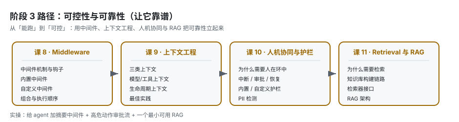

---

### [课 8：Middleware 中间件（掌控 agent loop）](stages/3-可控性与可靠性/lessons/lesson-08-Middleware中间件.md)

> 📖 结论已按官方文档核对（核对于 2026-09 ｜ 来源：docs.langchain.com 的 middleware/overview、middleware/custom、middleware/built-in 三页；关键行为均经本机实测——脚本 `playground/lesson-08-middleware-lab.py`）

**📌 一句话本质**：中间件 = **agent 循环上的可编程钩子**。六个钩子挂在循环的各个步骤上（4 个"时刻式" + 2 个"包裹式"），通过 `create_agent(middleware=[...])` 声明；不改引擎源码，就能插入重试、限流、脱敏、审批、动态提示词等控制逻辑（核对于 2026-09）。

**⚖️ 处境对照**：不这么写——工具报错直接崩（本课实测：`agent 中断：ValueError: 除数不能为 0`），敏感信息原样送达（无中间件时邮箱明文进模型），循环烧钱无上限。这么写——异常转成错误消息交给模型自愈（实测：模型收到"执行失败，请调整输入后重试"后给出得体答复），邮箱自动变 `[REDACTED_EMAIL]`，调用次数到达上限自动收尾（实测：`Model call limits exceeded: run limit (2/2)`）。

**🧭 一眼全局图**

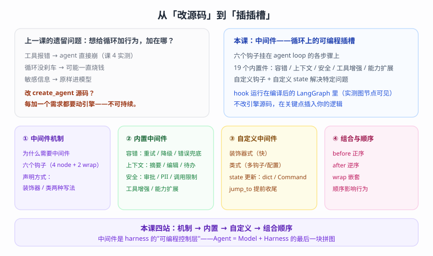

> 看图：左边是问题——加行为只能改源码？右边是本课方案——六个钩子的插槽体系 + 五组内置件 + 自定义 + 组合顺序；底部四张卡片对应本课四站。

**🗺️ 本课地图**

| 步 | 这一步要解决什么（人话） | 对应知识点 |
|:--:|------------------------|-----------|
| 1 | 循环上有哪些钩子、怎么声明中间件 | 知识点 1：中间件机制 |
| 2 | 19 个内置件各管什么（五组全景） | 知识点 2：内置中间件 |
| 3 | 特殊需求怎么自己写（装饰器/类/state/jump） | 知识点 3：自定义中间件 |
| 4 | 多个中间件怎么排队、顺序怎么影响行为 | 知识点 4：组合与执行顺序 |

**🖼️ 一图总结**

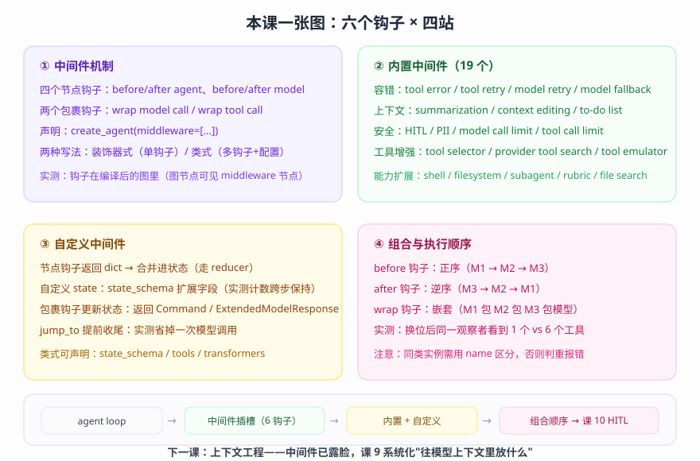

> 看图：四张卡片对应本课四站（机制 / 内置 / 自定义 / 组合顺序），底部链路——agent loop → 六个插槽 → 内置+自定义 → 组合规则，以及通往课 9（上下文工程）与课 10（HITL）的下一站。

**📚 官方文档**

- [Middleware overview（六钩子、图内运行、组合）](https://docs.langchain.com/oss/python/langchain/middleware/overview)
- [Custom middleware（写法、state、执行顺序、jump）](https://docs.langchain.com/oss/python/langchain/middleware/custom)
- [Built-in middleware（五组 19 个 + Provider 专属全集）](https://docs.langchain.com/oss/python/langchain/middleware/built-in)
- [Built-in · Summarization / HITL / Limits / PII 各段落](https://docs.langchain.com/oss/python/langchain/middleware/built-in#provider-agnostic-middleware)
- [Custom middleware · State updates（dict vs Command）](https://docs.langchain.com/oss/python/langchain/middleware/custom#state-updates)
- [Custom middleware · Agent jumps（jump_to 与 can_jump_to）](https://docs.langchain.com/oss/python/langchain/middleware/custom#agent-jumps)
- [Custom middleware · Execution order（三条规则）](https://docs.langchain.com/oss/python/langchain/middleware/custom#execution-order)
- [Custom middleware · Best practices](https://docs.langchain.com/oss/python/langchain/middleware/custom#best-practices)

---

### [课 9：Context Engineering 上下文工程](stages/3-可控性与可靠性/lessons/lesson-09-ContextEngineering上下文工程.md)

> 📖 结论已按官方文档核对（核对于 2026-09 ｜ 来源：docs.langchain.com 的 context-engineering 与 concepts/context 两页；关键行为均经本机实测——脚本 `playground/lesson-09-context-lab.py`；另含 3 组补充证据，见文内标注）

**📌 一句话本质**：上下文工程 = **在合适的时机，把合适的信息和工具、以合适的形式提供给模型**（官方定义：*providing the right information and tools in the right format so the LLM can accomplish a task*）。它的操作对象是"每次模型调用看到的全部信息"（五件套：提示词/消息/工具/模型/格式），信息来源有三个数据源（runtime context / state / store），改动方式分两条路：**瞬时（transient，改视图）与持久（persistent，改账本）**（核对于 2026-09）。

**⚖️ 处境对照**：不这么设计——资料塞满（实测：多 1746 字背景 = 每次多付 964 tokens）、瞬时的改动误当持久（下一轮失忆）、权限之外的工具"在场"（模型可能被诱导调用）、历史无限膨胀（摘要/清理缺位）。这么设计——动态提示词按身份与状态收敛回答边界，消息注入分清"看一眼"与"记下来"，工具按权限过滤（viewer 只见 `read_data`），历史超限时被摘要压缩成一页纸——每一处都有清晰语义。

**🧭 一眼全局图**

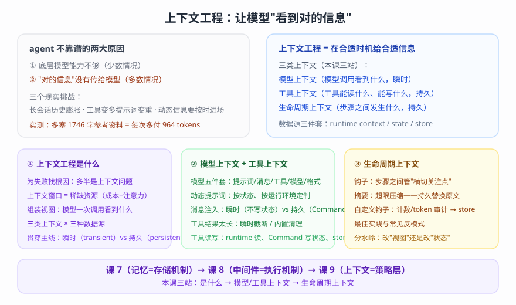

> 看图：左边是问题（agent 不靠谱多半是上下文问题 + 三个现实挑战）；右边是方案（三类上下文 + 三个数据源）；底部三张卡片对应本课三站，底栏交代本课与课 7/课 8 的关系。

**🗺️ 本课地图**

| 步 | 这一步要解决什么（人话） | 对应知识点 |
|:--:|------------------------|-----------|
| 1 | 上下文由什么组成、为什么稀缺、从哪取材 | 知识点 1：上下文工程是什么 |
| 2 | 五件套怎么动态化；工具怎么读写；瞬时 vs 持久 | 知识点 2：模型上下文与工具上下文 |
| 3 | 步骤之间怎么管上下文（摘要、审计）；最佳实践 | 知识点 3：生命周期上下文 |

**🖼️ 一图总结**

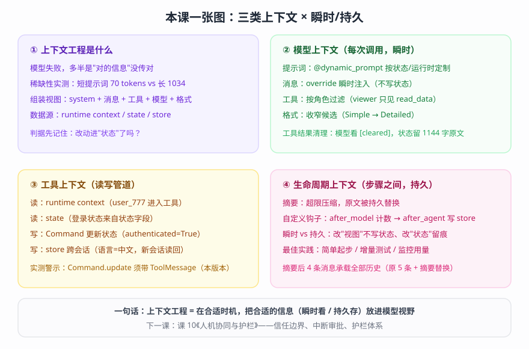

> 看图：四张卡片对应本课全部要点（是什么 / 模型上下文 / 工具上下文 / 生命周期），底部一句话收束与下一课预告。

**📚 官方文档**

- [Context engineering in agents（本课主参考页）](https://docs.langchain.com/oss/python/langchain/context-engineering)
- [Context overview（三类运行时上下文概念篇）](https://docs.langchain.com/oss/python/concepts/context)
- [Context engineering · Model context（五件套逐个展开）](https://docs.langchain.com/oss/python/langchain/context-engineering#model-context)
- [Context engineering · Tool context（读写两节）](https://docs.langchain.com/oss/python/langchain/context-engineering#tool-context)
- [Context engineering · Life-cycle context（摘要示例 + best practices）](https://docs.langchain.com/oss/python/langchain/context-engineering#life-cycle-context)
- [Middleware · Summarization（配置项全表）](https://docs.langchain.com/oss/python/langchain/middleware/built-in#summarization)

---

### [课 10：人机协同与护栏（HITL & Guardrails）](stages/3-可控性与可靠性/lessons/lesson-10-人机协同与护栏.md)

> 📖 结论已按官方文档核对（核对于 2026-09 ｜ 来源：docs.langchain.com 的 human-in-the-loop / guardrails / middleware/built-in 三页；关键行为均经本机实测——脚本 `playground/lesson-10-hitl-lab.py` 与 `playground/lesson-10-hitl-lab-fix.py`，另含回显验证；证据合并文件 `lc-l10-lab-output.txt`）

**📌 一句话本质**：人机协同 = **把高风险操作的执行权从模型的默认行为里收回来**——工具在执行前被冻结，等人给出决定（approve / edit / reject / respond）后才放行；护栏 = **在输入、输出、工具结果三个点位验证与过滤内容**（PII 脱敏、违规拦截、输出审查）——两者都通过中间件体系挂载（核对于 2026-09）。

**⚖️ 处境对照**：没有这一课——不可逆动作裸奔（发出去的邮件收不回）、PII 一路畅通（进模型、出回复、落日志）、违规请求照单全收。有了这一课——工具先冻结（实测：审批前执行账本为空）、敏感信息在进入模型视野之前已被脱敏（实测：模型回显的就是脱敏文本）、违规请求在模型被调用之前就被挡下（实测：固定话术 + 跳步收束）。

**🧭 一眼全局图**

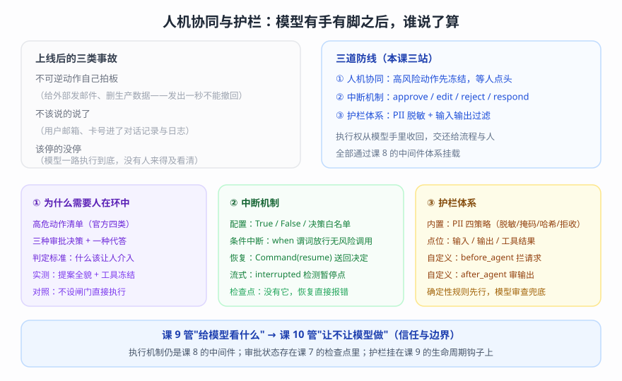

> 看图：左边是三类事故（不可逆动作裸奔 / 不该说的说了 / 该停的没停）；右边是三道防线（人机协同 / 中断机制 / 护栏体系）；底部三张卡片对应本课三站，底栏交代本课与课 8/课 9/课 7 的衔接关系。

**🗺️ 本课地图**

| 步 | 这一步要解决什么（人话） | 对应知识点 |
|:--:|------------------------|-----------|
| 1 | 哪些事必须让人点头；四种决定方式是什么 | 知识点 1：为什么需要人在环中 |
| 2 | 中断怎么配、怎么停、怎么恢复；流式怎么配合 | 知识点 2：中断机制 |
| 3 | 护栏怎么建：PII 怎么脱敏、请求/输出怎么过滤 | 知识点 3：护栏体系 |

**🖼️ 一图总结**

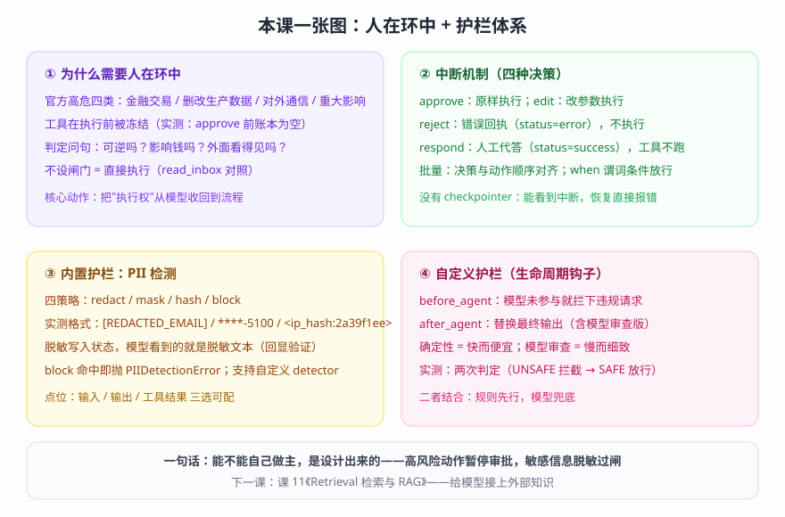

> 看图：四张卡片对应本课全部要点（人在环中 / 中断机制 / PII / 自定义护栏），底部一句话收束与下一课预告。

**📚 官方文档**

- [Human-in-the-loop（本课主参考页）](https://docs.langchain.com/oss/python/langchain/human-in-the-loop)
- [Guardrails · Human-in-the-loop（高危场景清单）](https://docs.langchain.com/oss/python/langchain/guardrails#human-in-the-loop)
- [Human-in-the-loop · Configuring / Conditional interrupts](https://docs.langchain.com/oss/python/langchain/human-in-the-loop#configuring-interrupts)
- [Human-in-the-loop · Responding / Streaming](https://docs.langchain.com/oss/python/langchain/human-in-the-loop#responding-to-interrupts)
- [Built-in middleware · Human-in-the-loop（配置示例）](https://docs.langchain.com/oss/python/langchain/middleware/built-in#human-in-the-loop)
- [Guardrails（本知识点主参考页）](https://docs.langchain.com/oss/python/langchain/guardrails)
- [Built-in middleware · PII detection（策略与配置全表）](https://docs.langchain.com/oss/python/langchain/middleware/built-in#pii-detection)

---

### [课 11：Retrieval 检索与 RAG（给模型接上「外部书架」）](stages/3-可控性与可靠性/lessons/lesson-11-Retrieval检索与RAG.md)

> 📖 结论已按官方文档核对（核对于 2026-09 ｜ 来源：docs.langchain.com 的 retrieval / knowledge-base 两页；关键行为均经本机实测——脚本 `playground/lesson-11-retrieval-lab.py` 与两个补跑脚本，证据合并文件 `lc-l11-lab-output.txt`；知识库语料为 `playground/kb/` 下 5 份虚构公司文档）

**📌 一句话本质**：检索与 RAG = **把外部知识做成「可检索的书架」，让模型先查资料、再回答**。技术上拆成一个流水线：**加载 → 切分 → 嵌入 → 入库**（把文档变成可被相似度搜索的索引），**检索 → 拼接 → 生成**（提问时取回最相关的几块，拼进提示词交给模型）。官方定义：检索缓解了「上下文有限」与「知识冻结」两大限制，是 RAG 的基础（核对于 2026-09）。

**⚖️ 处境对照**：没有这一课——私有问题只能靠模型编（本课实测：同一批问题，它一次老实说「不确定」、一次直接编造出「星云星空/Nebula」等细节）；有了这一课——**同一批问题，它引用着文档来源作答**（实测：VPN 客户端 NebulaConnect、年假按司龄 5/10/15 天，全部与知识库一致）。

**🧭 一眼全局图**

> 看图：左边是模型的三个知识困境（截止时间 / 私有数据 / 不可靠表现）；右边是解药——检索增强的思路与流水线；底部三张卡片对应本课三站，底栏交代本课与课 4/5/9/10 的衔接关系。

**🗺️ 本课地图**

| 步 | 这一步要解决什么（人话） | 对应知识点 |
|:--:|------------------------|-----------|
| 1 | 模型为什么答不了私有问题；检索增强是什么 | 知识点 1：为什么需要检索 |
| 2 | 文档怎么变成「机器找得到」的索引（四环节） | 知识点 2：知识库构建链路 |
| 3 | 怎么查、怎么用；两种 RAG 架构怎么选 | 知识点 3：检索器与 RAG 架构 |

**🖼️ 一图总结**

> 看图：四张卡片对应本课全部要点（为什么检索 / 构建链路 / 检索器 / RAG 架构），底部一句话收束与下一课预告。

**📚 官方文档**

- [Retrieval（本知识点主参考页）](https://docs.langchain.com/oss/python/langchain/retrieval)
- [Build a semantic search engine（语义搜索教程）](https://docs.langchain.com/oss/python/langchain/knowledge-base)
- [Build a semantic search engine（Create documents / Generate embeddings / Load and split / Index）](https://docs.langchain.com/oss/python/langchain/knowledge-base)
- [Document Loaders 集成索引](https://docs.langchain.com/oss/python/integrations/document_loaders)
- [Text Splitters 集成索引](https://docs.langchain.com/oss/python/integrations/splitters)
- [Embedding 集成索引](https://docs.langchain.com/oss/python/integrations/embeddings)
- [Vector Store 集成索引](https://docs.langchain.com/oss/python/integrations/vectorstores)
- [Retrieval · RAG architectures（2-step / Agentic / Hybrid 对比）](https://docs.langchain.com/oss/python/langchain/retrieval)
- [Build a semantic search engine · Query / Use retrievers（查询三法与检索器用法）](https://docs.langchain.com/oss/python/langchain/knowledge-base)

---

## 阶段 4：组合与工程化

> **故事章节**：「从单兵到团队：可测、可观测、可交付」
> **阶段目标**：掌握多智能体四大模式（subagents / handoffs / router / skills），能判断何时该拆分、选哪种模式；能给 agent 写测试（单元 / 集成 / evals），能接上 LangSmith tracing 排查问题；本阶段收束于结课综合实战项目。
> **学习重点**：为什么需要多智能体（单 agent 三重极限）｜四大模式对比与选择依据｜测试层次（单元/集成/Evals）｜可观测性（tracing 抓手）
> 完整概览（含"必须掌握"清单）：[阶段 4 概览](stages/4-组合与工程化/overview.md)

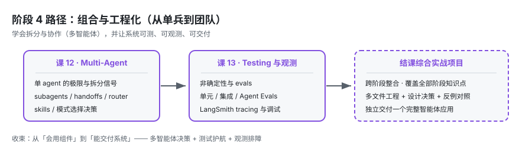

---

### [课 12：Multi-Agent 多智能体（从单兵到团队）](stages/4-组合与工程化/lessons/lesson-12-Multi-Agent多智能体.md)

> 📖 结论已按官方文档核对（核对于 2026-09 ｜ 来源：docs.langchain.com 的 multi-agent 系列页面（总览 + 五个模式页），链接见各知识点「官方文档」；关键行为均经本机实测——脚本 `playground/lesson-12-multi-agent-lab.py` 与两个补跑脚本，证据合并文件 `lc-l12-lab-output.txt`）

**📌 一句话本质**：多智能体 = **把任务拆给专门的 agent，并设计好它们之间的协作方式**。拆分的三个官方理由：**上下文管理**（让每个 agent 只带自己领域的信息）、**分布式开发**（不同团队独立维护各自的 agent）、**并行化**（多个专项任务同时执行）。而协作方式被官方归纳为五大模式：subagents / handoffs / skills / router / custom workflow（核对于 2026-09）。

**⚖️ 处境对照**：没有这一课——单 agent 的提示词与工具清单随业务线性膨胀，最终「谁都不敢改，越改越糊涂」；有了这一课——**主代理只持有各子代理的一行描述，领域知识按需加载，团队边界清晰可维护**（本课实测：单 agent 每次调用携带 ~1983 字符的全领域上下文 vs 拆分后主代理 ~275 字符，子代理按需 231~907 字符）。

**🧭 一眼全局图**

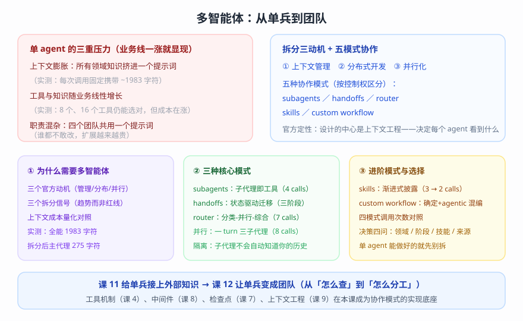

> 看图：左边是单 agent 的三重极限；中间是五模式全景（subagents / handoffs / skills / router / custom workflow）；底部三张卡片对应本课三站，底栏交代与课 5/8/11 的承接关系。

**🗺️ 本课地图**

| 步 | 这一步要解决什么（人话） | 对应知识点 |
|:--:|------------------------|-----------|
| 1 | 什么时候该拆？拆了能拿到什么？ | 知识点 1：为什么需要多智能体 |
| 2 | 三种核心协作模式长什么样、怎么跑 | 知识点 2：核心模式（subagents/handoffs/router） |
| 3 | 两种进阶模式 + 到底选哪个 | 知识点 3：进阶模式与选择 |

**🖼️ 一图总结**

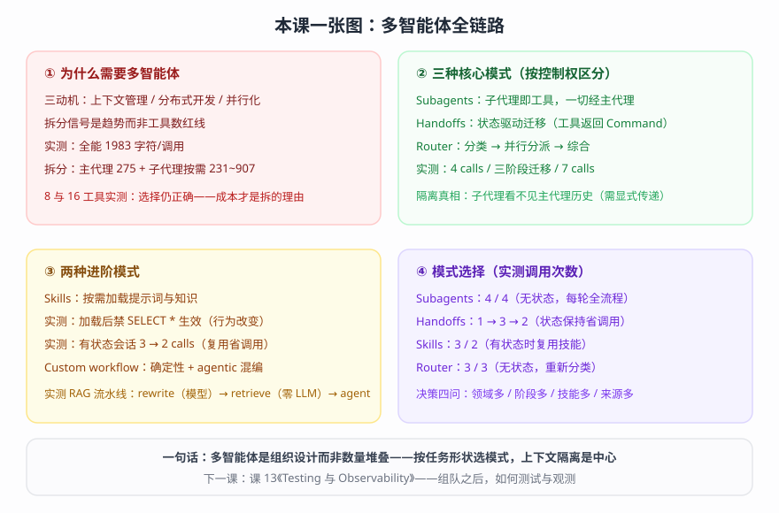

> 看图：四张卡片（拆分的三个动机 / 三种核心模式 / 两种进阶模式 / 四模式选择），底部一句话收束与下一课预告。

**📚 官方文档**

- [Multi-agent（三个动机 + 五模式总览，本知识点主参考页）](https://docs.langchain.com/oss/python/langchain/multi-agent/index)
- [Subagents（本知识点主参考页之一）](https://docs.langchain.com/oss/python/langchain/multi-agent/subagents)
- [Handoffs（本知识点主参考页之二）](https://docs.langchain.com/oss/python/langchain/multi-agent/handoffs)
- [Router（本知识点主参考页之三）](https://docs.langchain.com/oss/python/langchain/multi-agent/router)
- [教程：客服交接实战](https://docs.langchain.com/oss/python/langchain/multi-agent/handoffs-customer-support) ｜ [教程：多源知识库路由](https://docs.langchain.com/oss/python/langchain/multi-agent/router-knowledge-base)
- [Skills（本知识点主参考页之一）](https://docs.langchain.com/oss/python/langchain/multi-agent/skills)
- [Custom workflow（本知识点主参考页之二）](https://docs.langchain.com/oss/python/langchain/multi-agent/custom-workflow)
- [Multi-agent 总览 · 性能对比表（本知识点核心数据来源）](https://docs.langchain.com/oss/python/langchain/multi-agent/index)
- [教程：SQL 助手（技能模式实战）](https://docs.langchain.com/oss/python/langchain/multi-agent/skills-sql-assistant) ｜ [教程：个人助理（子代理模式实战）](https://docs.langchain.com/oss/python/langchain/multi-agent/subagents-personal-assistant)

---

### [课 13：Testing 与 Observability（让 agent 可测可观测）](stages/4-组合与工程化/lessons/lesson-13-Testing与Observability.md)

> 📖 结论已按官方文档核对（核对于 2026-09 ｜ 来源：docs.langchain.com 的 test 系列（总览 / 单元测试 / 集成测试 / Agent Evals）+ observability + studio + ui 页面，链接见各知识点「官方文档」；关键行为均经本机实测——实验脚本位于 `playground/lesson-13-*-lab.py`、测试套件位于 `playground/tests_l13/`；测试工具链：pytest 9.1.1 + agentevals 0.0.9 + vcrpy 8.3.0 + pytest-recording 0.13.4）

**📌 一句话本质**：这一课给 agent 工程加两道工序——**交付前「分层检查 + 整体评分」，运行中「全程留痕」**——把「我见过它能跑」升级成「我能证明它可靠、能看见它怎么跑」。

**⚖️ 处境对照**：没有这两道工序——验证靠人肉跑（每轮真调模型 + 人工逐条看结果），改了提示词不知道有没有变坏，线上出问题只能猜；有了这两道工序——**快层检查 0.4 秒跑完（每次改动都有回归网）、评分层给出「对照参考 + 分数」、每次运行留下完整的 trace**（本课实测：一个「帮我处理退货」的任务跑 5 次出现 4 种工具路径，其中 1 次压根没办成事——这种问题只有「看轨迹」才能发现）。

**🧭 一眼全局图**

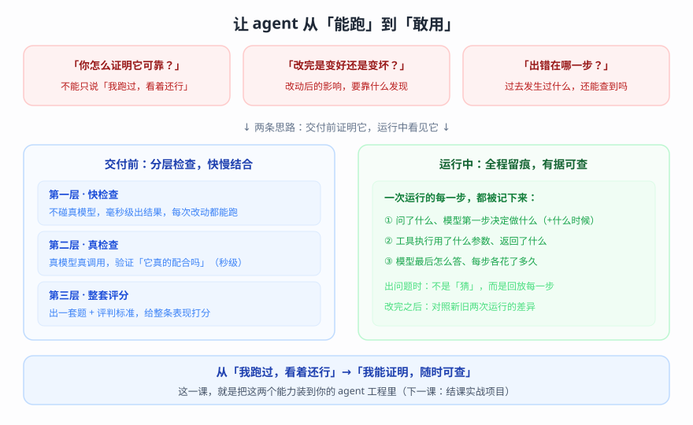

> 看图：上方是交付时会遇到的三个问题；左框「交付前：分层检查」把验证拆成快 / 真 / 全三层；右框「运行中：全程留痕」把每一步记录在案。底部一句话收束：从「我跑过，看着还行」到「我能证明，随时可查」。

**🗺️ 本课地图**

| 步 | 这一步要解决什么（人话） | 对应知识点 |
|:--:|------------------------|-----------|
| 1 | 「每次都一样」的习惯为什么必须换掉？该测什么？ | 知识点 1：为什么 agent 需要测试 |
| 2 | 三层测试各测什么、用什么工具、什么时候跑 | 知识点 2：测试层次 |
| 3 | 怎么让运行从「黑盒」变成「全记录」 | 知识点 3：可观测性 |

**🖼️ 一图总结**

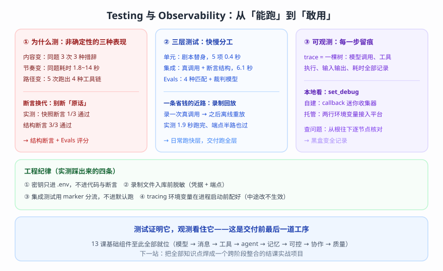

> 看图：三张卡片（非确定性的三种表现 / 三层测试 / 可观测性）+ 工程纪律四条 + 底栏收束与下一站。

**📚 官方文档**

- [Test · 总览（三层策略的官方定义，本知识点主参考页）](https://docs.langchain.com/oss/python/langchain/test/index)
- [Agent Evals（轨迹评估概念）](https://docs.langchain.com/oss/python/langchain/test/evals)
- [Unit testing（替身模型与内存持久化）](https://docs.langchain.com/oss/python/langchain/test/unit-testing)
- [Integration testing（分流、密钥、结构断言、VCR）](https://docs.langchain.com/oss/python/langchain/test/integration-testing)
- [Agent Evals（四种匹配模式与 LLM 裁判）](https://docs.langchain.com/oss/python/langchain/test/evals)
- [LangSmith Observability（tracing 接入、项目、metadata，本知识点主参考页）](https://docs.langchain.com/oss/python/langchain/observability)
- [LangSmith Studio（本地可视化调试）](https://docs.langchain.com/oss/python/langchain/studio)
- [Agent Chat UI（现成聊天界面）](https://docs.langchain.com/oss/python/langchain/ui)

---

## 🎓 综合实战项目：智能客服助手

> [📄 项目 README（需求 / 知识点地图 / 运行方式）](projects/智能客服助手/README.md) ｜ 交付日期：2026-09-16 ｜ 预计耗时：2-3 小时（含实测）

**一句话需求**：为电商业务交付一个可运行的智能客服 agent 工程——政策咨询走企业知识库检索（RAG）、订单物流走业务工具、退款走分级人工审批（小额直通 / 大额审核），全程有会话记忆、PII 脱敏、成本护栏与三层测试，支持流式对话与人工接管。

**覆盖知识点地图（跨 4 阶段整合）**：

- **阶段 1**：模型接入（`app/config.py` 自定义 endpoint）｜ 消息体系（审批流消息序列：AI 工具调用冻结 → Tool 结果回填）
- **阶段 2**：6 个工具（金额校验不通过返回说明而非抛异常）｜ create_agent 组装 ｜ 流式 CLI（`stream_mode="messages"`）｜ 短期记忆（InMemorySaver + thread_id）
- **阶段 3**：中间件（PII 脱敏 + 限额 + 自定义审计）｜ 动态提示词（按会员等级注入）｜ HITL 分级审批（`when` 谓词 + 金额一致性校验）｜ Agentic RAG（政策检索 k=3，回答注明来源）
- **阶段 4**：架构选型论证（单 agent vs router）｜ 三层测试（单元 / 集成 / Evals）+ 审计轨迹
- 完整逐条映射（含回指课时的链接）见 [README · 覆盖知识点地图](projects/智能客服助手/README.md)

**设计决策摘要（3 个真权衡点）**：

| 决策点 | 选择 | 核心理由 | 何时改选 |
|--------|------|----------|----------|
| 架构：单 agent + 中间件 vs Router 多专家 | 单 agent + 中间件 | 6 个工具未达拆分阈值；护栏"一处配置、全局生效" | 工具 >10 / 多团队独立维护 / 需并行多来源 |
| 退款审批：全量 vs 分级 vs 全自动 | 金额分级（50 元阈值 + 金额一致性校验 + 限额，三层护栏） | 小额无感、大额把关；闸门装在风险最高的动作上 | 接入风控模型 / 退款量激增 |
| 记忆：全量历史 vs 摘要 vs 长期档案 | 全量（checkpointer） | 会话短（≈7 条消息）；小对话摘要反而更贵（303 > 135 token） | 轮次 >30 上摘要；跨会话需求上 store |

**配套文档**：3 个决策的完整五段式论证见 [设计决策.md](projects/智能客服助手/设计决策.md)；「能跑但很糟」的反例对照（5 条）见 [反例对照.md](projects/智能客服助手/反例对照.md)；自测项见 [验收清单.md](projects/智能客服助手/验收清单.md)。源码不抄进手册——运行方式见 README。

## 🧩 应用实战

> **一句话说明**：跟着演进步走一遍「从幼稚到像样」，把知识点焊进真实用法——一键跳转见 [应用实战总索引](应用实战/INDEX.md)。
> **覆盖**：课 2–13 共 12 篇（课 1 为导论课不配，理由见总索引）。每篇 3 版演进 + 3 张分步设计图。

- [实战 2：主模型挂了怎么办](应用实战/02-Models模型层.md)（配套课 2）—— 主备切换 + 能力探测门禁
- [实战 3：多轮对话的历史，别再字符串拼接了](应用实战/03-Messages消息体系.md)（配套课 3）—— 标准消息对象 + 序列化落库回放
- [实战 4：把内部订单 API 变成 agent 能用的工具](应用实战/04-Tools工具.md)（配套课 4）—— 结构化 docstring + 错误重试 + 按态动态选择
- [实战 5：create_agent 的默认配置，够用吗](应用实战/05-Agents智能体核心.md)（配套课 5）—— 提示词约束 + 迭代上限 + 结构化结果解析
- [实战 6：CLI 客服的打字机体验](应用实战/06-Streaming流式输出.md)（配套课 6）—— 逐 token 流式 + 工具调用进度反馈
- [实战 7：让 agent 跨会话记住用户偏好](应用实战/07-Memory记忆.md)（配套课 7）—— 短期 checkpointer + 长期 store
- [实战 8：给 agent 加日志、限额、重试](应用实战/08-Middleware中间件.md)（配套课 8）—— 横切能力抽离为中间件
- [实战 9：把长对话的上下文瘦下来](应用实战/09-ContextEngineering上下文工程.md)（配套课 9）—— 裁剪 + 摘要 + 动态提示词
- [实战 10：高风险操作，先让人签个字](应用实战/10-人机协同与护栏.md)（配套课 10）—— 中断审批 + PII 脱敏 + 输出审查
- [实战 11：让 agent 回答公司内部政策，别让它编](应用实战/11-Retrieval检索与RAG.md)（配套课 11）—— 切分 + 向量库 + 检索增强 + 引用溯源
- [实战 12：一个 agent 挂 12 个工具之后](应用实战/12-MultiAgent多智能体.md)（配套课 12）—— 按域拆分 + 四种编排模式
- [实战 13：给客服 agent 建一道「交付门禁」](应用实战/13-Testing与Observability.md)（配套课 13）—— 人肉验证 → 单测工序 → 三层门禁 + 观测

## 📦 配套产物（收尾三件套）

> 课堂之外的三份互补材料，对应三种使用状态——**学习态（为什么）· 使用态（怎么办）· 设计态（怎么设计）**。

- [08-实战经验](08-实战经验.md)：适用边界与反模式 + 10 条高频故障模式（五段式：症状 → 根因 → 排查 → 修复 → 预防）+ 投产 Checklist + 3 个真实事故案例复盘
- [09-排障速查手册](09-排障速查手册.md)：机长 QRH 式——按症状倒查的条件-动作表（先止血后定位）+ 官方错误码
- [场景解法库](场景解法库/INDEX.md)：8 个高难度场景 × 每场景多解法权衡（先想后看；经典设计题 + 规模压力题两类）

## 🚀 接下来可以做什么

- **避坑**：收尾三件套已就绪（见上节）——直接翻阅，或让我"讲讲 LangChain 生产上的坑"。
- **复盘**：复制"考我一下 LangChain，针对 {薄弱点}"——进入知识点对齐（选择题 + 错题巩固 + 跨轮追踪）。
- **进阶**：告诉我下一步想深入的方向——**LangGraph 深入 / LangSmith 平台 / Deep Agents / 前端集成与部署**，我会基于当前档案调整大纲继续。

---

> **手册说明**：本手册由课程主线汇总生成（2026-09-16），与课程产物一同冻结；后续新增内容（知识点对齐、进阶课程）将在对应产物中链接回来。
