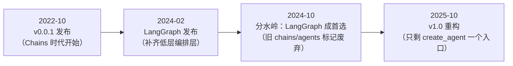
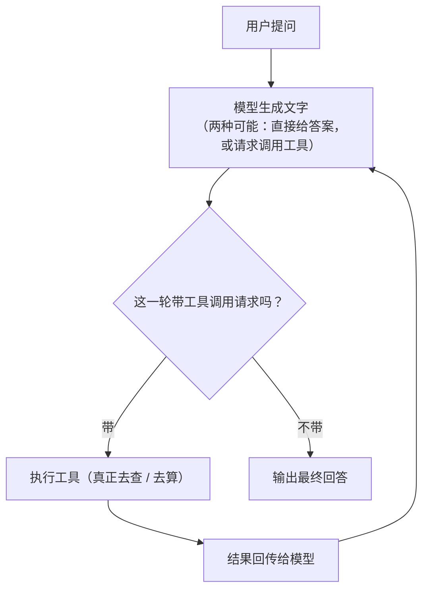
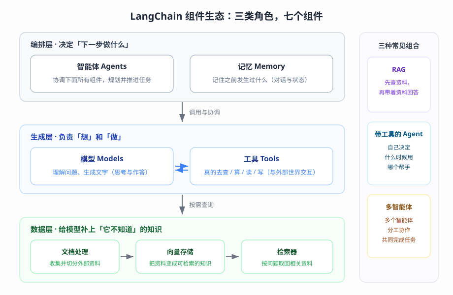
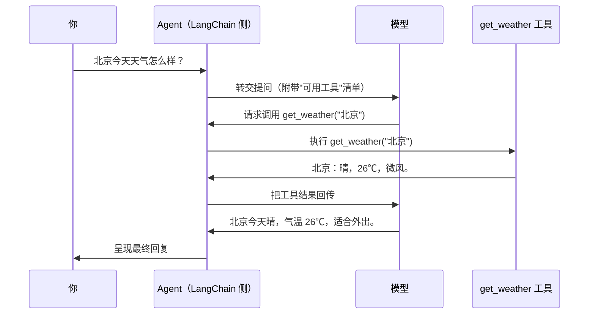
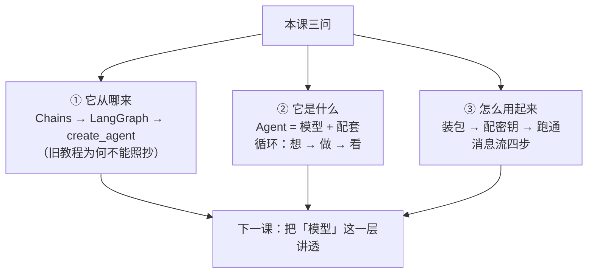

# 第 1 课：LangChain 是什么（起源与定位）

> 所属阶段：阶段 1《入门与模型层》｜ 水平：进阶（有扎实 Python 与后端工程基础，LangChain 从零）｜ 本课知识点：LangChain 的起源与演进史、Agent = Model + Harness、安装与第一个 Agent
> 故事情节：故事开篇——先认识主角（一个只会聊天的模型）与它的舞台（LangChain 生态），并跑通第一个 Agent
> 📖 结论已按官方文档核对（核对于 2026-09 ｜ 来源：docs.langchain.com 的 overview / philosophy / install / component-architecture / quickstart；起源史已另行联网交叉核实）

## 🎯 本课目标

- 说清 LangChain 的起源、演化与 1.0 大重构的逻辑（为什么 chains 被砍掉）
- 建立 "Agent = Model + Harness" 心智模型，理解生态四件套（LangChain / LangGraph / Deep Agents / LangSmith）的关系
- 完成环境安装、API key 配置，跑通第一个 create_agent

---

## 第一幕：起源与场景引入

> 🏛️ **起源**：2022 年，用语言模型做应用的人都在重复手写同一批"胶水代码"——拼提示词、接外部数据；Harrison Chase 把这批重复模式抽成了工具包。他在 2022-10-24 发布了约 800 行的 Python 包 `langchain`——比 ChatGPT 发布（2022-11-30）还早一个月。名字来自 "Language"（语言模型）+ "Chains"（链）。此后它随行业爆发持续演进，2025-10 完成至今最大的一次重构（核查于 2026-09）。

你的团队在客服系统里加了一个 AI 助手。第一版代码简单得让人放心：把用户的消息发给模型，把回复显示给用户。

上线第一天就出事。用户问"我的订单 12345 到哪了"，助手一本正经地报了一段物流进度——快递单号、中转城市、预计送达，样样齐全。可那个订单根本没发货。物流信息是模型"编"出来的。

你当然不怪模型：它从没看过订单库，它只是把"最像答案的话"说了出来。真正要解决的问题是——**让它先去查，再回答**。于是你和同事开始打补丁：提示词里写死订单查询规则；加解析代码判断"要不要查库"；把查到的结果拼回对话再问一遍模型……两周后，补丁代码越堆越厚，新的坑还在往外冒。

> 🎬 **场景**：一个"会说话但不会做事"的客服助手——模型能流畅回答任何问题，唯独在需要"动手查一下"的地方翻车。

> 📌 **一句话本质**：把"只会一问一答的模型"组装成"能自己动手完成任务的应用"——模型还是那个模型，区别在它外面加的那一圈配套。
>
> ⚖️ **处境对照**：想让模型"干活"，裸调 API 意味着每件事都手写——解析它想调什么、替它执行、把结果拼回去、循环到结束，换一个模型供应商还得再适配一遍；用 LangChain 的组件组装，本课实测约 30 行代码跑通一个带工具调用的完整 agent，一次完整问答本机实测 8.4 秒（核对于 2026-09）。

---

## 第二幕：认知冲突

既然直接调 API 就能用模型，为什么还要引入 LangChain？网上甚至有两种截然相反的评价同时存在：一边说"LangChain 是 LLM 应用开发的标准起点"，另一边说"LangChain 过度封装、越来越臃肿"。

> ❓ **问题**：直接调 API 更透明、更可控，为什么还要一个框架？那些"过度封装"的批评，说的是同一个 LangChain 吗？

这个问题值得认真对待，因为它直接决定你怎么看这个框架：

- 直接调 API 的透明与可控是真的——如果你的应用只有"发一句、收一句"，那几十行代码就够，框架确实是多余的。
- 但"让模型干活"的那一圈配套——工具调用的循环、多供应商的格式适配、状态与上下文的维护、出错时的重试与兜底——是几乎所有应用都会重复写的东西。
- 最有意思的是：**LangChain 自己也认为"封装太厚"是问题**——它的 1.0 版本就是一次大瘦身。要理解今天的 LangChain 为什么长这样，必须先看它走过的路。

---

## 第三幕：层层揭示

### 一眼全局图（进入细节前先看一眼）


> 看图：左边是现在的模型——问它要动手的事，它只能干瞪眼；右边是本课的目标——同一句问话，它自己"先想一步、动手去查、给出答复"；中间的差别，就是在模型外面加的那一圈配套（规矩、帮手、反复尝试）。

### 本课地图（分几步走）

| 步 | 这一步要解决什么（人话） | 对应知识点 |
|:--:|------------------------|-----------|
| 1 | 先搞清"它为什么长成今天这样"——不然后面看什么都对不上号 | 知识点 1：LangChain 的起源与演进史 |
| 2 | 再建立它的"公式"——一个模型加上一圈什么，就成了能干活的系统 | 知识点 2：Agent = Model + Harness |
| 3 | 最后亲手把它跑起来——装好、配好、看到第一个回复 | 知识点 3：安装与第一个 Agent |

### 知识点 1：LangChain 的起源与演进史

> 🧭 第 1/3 步｜承接：第二幕的问题"为什么需要它、它到底乱不乱" → 本步：用它的三次演进回答清楚，顺便练出"分辨新旧教程"的眼力

#### 一句话定义

LangChain 是 2022 年 10 月诞生、围绕"让语言模型干活"的开源框架；你今天用到的形态——一个 `create_agent` 入口 + 一组组件库——是它三年多演进和一次大重构之后的结果。

#### 直觉建立（类比）

把它想成一套房子的三次装修：第一次（2022），一个小开间，两件家具（模型抽象 + 固定流程链），能住但简朴；第二次（2023-2024），家里人多了，不断加隔断、添家具——功能全，但走廊越来越绕；第三次大改造（2025 的 1.0），设计师拆掉所有临时隔断——客厅只留一张多功能沙发（`create_agent`），储物去仓库（组件库），要专门房间另请施工队（LangGraph）。

> 💡 **类比的边界**：装修完就定型，LangChain 的重构是"边住边改"；而且旧布局的住户还有一条退路——继续用老房子（`langchain-classic` 包），只是官方明确推荐搬新家。

#### 核心原理

**先回答"为什么必须懂这段历史"**——因为网上（包括很多高赞中文教程）的内容大多写于 v0.1~v0.3 时代，它们教的 `Chains`、`AgentExecutor`、`ConversationBufferMemory` 等组件，在 1.0 已经被重构或移除。你照着抄，第一步 `import` 就会失败（本知识点末尾有实测）。看不懂历史，就看不懂现状，更分不清"LangChain 好乱"和"LangChain 很清爽"这两种评价其实说的是两个时代。

**三次演进的骨架**：



> 看图：一条从左到右的时间线，四个关键节点——发布、补低层、切换首选、彻底重构；注意"分水岭"在 2024-10，此后旧的 chains 世界就开始退场了。

三次演进的细节：

- **链时代（2022-10 起）**：v0.0.1 只有两大件——LLM 抽象层与 Chains（预定义的计算步骤，如 RAG = 先检索、再生成）。2022-12 加入第一批通用智能体（基于 ReAct 论文：让模型"边推理边行动"，用 JSON 表达工具调用）；2023 年 OpenAI 的 Chat Completion API 与 function calling 相继出现，生态爆发，到 2024-06 集成超过 700 个（拆分为独立包与 `langchain-community`）。
- **LangGraph 时代（2024-02 起）**：官方补齐了缺失的"低层编排层"——LangGraph 带来流式、持久执行、短期记忆、人工介入等能力。2024-10 成为分水岭：官方明确"超过单次模型调用的应用，首选 LangGraph"，LangChain 里大多数 chains / agents 被标记废弃。
- **create_agent 时代（2025-10-20 起）**：v1.0 完成最大一次重构——**所有 chains 和 agents 被替换为唯一一个高层抽象**：构建在 LangGraph 之上的 agent 抽象，也就是 `create_agent`；同时统一了跨供应商的消息内容格式。不想升级的用户可以继续用 `langchain-classic` 包（官方注明：推荐升级）。

**为什么只留一个入口？** 官方给的逻辑很直白：开发者要提高应用可靠性，"高层接口提供的控制力不够"（原文：needed more control than the high-level interfaces provided）。与其维护几十种各带假设的半灵活封装，不如收敛为：一个全可控的入口（`create_agent`）+ 一套低层能力（由 LangGraph 提供持久化、流式、人工介入等）。2026-03，生态又添了一员：Deep Agents 开箱即用的 agent 套装（本课知识点 2 展开定位）。

#### 示例演示

旧教程最经典的写法，在我们当前环境（langchain 1.4.0）里直接运行：

```bash
uv run python -c "from langchain.chains import LLMChain"
```

实测输出（真实报错，勿被吓到）：

```text
Traceback (most recent call last):
  File "<string>", line 1, in <module>
ModuleNotFoundError: No module named 'langchain.chains'
```

这不是装错了包——`langchain.chains` 这个模块在 1.x 主包里已经不存在了（旧实现在 `langchain-classic` 里保留）。这就是"为什么必须先懂历史"最直接的证据：**看到教程的第一步，是先判断它属于哪个时代**。

#### 常见误区

1. **把 LangChain 当成"LLM 调用 SDK"**：调模型只是入口，它的核心价值是围绕模型的组件组装（下一知识点展开）；单纯调模型用 `langchain-openai` 一个包就够。
2. **拿旧教程当现状**：看到 `langchain.chains`、`AgentExecutor`、`ConversationBufferMemory` 这些符号，先默认它是旧时代的写法，对照官方文档再动手。
3. **把"LangChain 很乱"当结论**：那是 2024 年前的印象——1.0 已经完成大瘦身，今天它反而是"一个入口 + 组件库"的极简形态。

#### 一句话记住

> LangChain 的今天 = 三年演进的沉淀：Chains 时代 → LangGraph 补低层 → v1.0 只留 create_agent 一个入口；看到旧教程，先问"它属于哪个时代"。

#### 🗣️ 行话对照

- **Chains（链）**：早期高层封装——预定义的计算步骤序列——就是本课说的"第一次装修的家具"；在哪遇到：旧教程、`langchain-classic` 包（1.x 主包已移除 `langchain.chains`）
- **ReAct（Reasoning + Acting）**：让模型"边推理边行动"的智能体范式，用文字表达工具调用请求；在哪遇到：论文与旧版 agent 文档——新代码里不再需要手动实现
- **deprecated（已废弃）**：官方"不再推荐、后续移除"的标记；在哪遇到：更新日志、迁移指南、运行时的 DeprecationWarning
- **langchain-classic**：保留旧版 chains / agents 的兼容包；在哪遇到：`pip install langchain-classic`、官方迁移文档

#### 官方文档

- [Philosophy（含完整演进时间线）](https://docs.langchain.com/oss/python/langchain/philosophy)

---

### 知识点 2：Agent = Model + Harness

> 🧭 第 2/3 步｜承接：知道了它"为什么长这样"，可它到底"是什么"——一个模型加一圈什么，就成了能干活的系统？ → 本步：建立全课程最重要的公式
> 本知识点关键点：agent loop、harness 的组成、生态四件套定位、组件生态全景

#### 一句话定义

**Agent = Model + Harness**——模型负责"想"（理解与生成），harness（模型循环之外的一切：提示词、工具、中间件）负责让它"做成事"；LangChain 提供的 `create_agent`，就是一个可配置的 harness。

#### 直觉建立（类比）

把模型想成一个聪明的新员工：语言能力极强，但刚上岗那天——不知道公司规矩（说什么、不说什么）、没有任何系统权限和工具箱（查订单、算价格都做不了）、也没人管他（做出格的事没人拦）。

harness 就是你给他的**工位配置**：一本员工手册（提示词）、一套工具与账号权限（工具）、主管的例行检查机制（中间件）。同一个"员工"，工位配置不同，产出天差地别。

> 💡 **类比的边界**：员工会自己积累经验、越来越熟练；模型不会——它每次都是"同一个它"，所谓"记忆"全靠外面把历史重新喂回去（课 7 展开）。

#### 核心原理

**① agent loop：一圈"想 → 做 → 看"的循环**



> 看图：模型每轮只做一件事——生成文字；如果这段文字里包含"工具调用请求"，就交给外部执行，把结果送回模型再来一轮；直到某一轮不再请求工具，循环结束。

这里有一个必须刻进脑子的事实：**模型没有任何执行能力**。它"调用工具"的本质，是生成一段结构化的请求文字（"请帮我调 `get_weather`，参数是北京"）；真正去执行、把结果送回来的，是 harness（在 LangChain 里就是 `create_agent` 背后的机制）。这既是能力边界，也是安全设计点——权限管控、人工审批都发生在 harness 一侧（课 8、课 10 展开）。

**② harness 的组成**：回指第一幕的"配套三件"——**提示词**（告诉它规矩：怎么说话、如何行事）、**工具**（给它帮手：查数据、算数字、读写文件）、**中间件**（让它按流程走：出错重试、敏感操作先审批、历史太长自动压缩）。

**③ 生态四件套：什么时候用哪个**（同一件事的多种选择，给对照表）：

| 本课说法（人话） | 行业标准叫法 | 什么时候用 | 代价 / 边界 |
|---|---|---|---|
| 全能定制 | LangChain（`create_agent`） | 想要按自己的场景逐件组装 harness | 需要自己选配每个零件 |
| 开箱套装 | Deep Agents | 复杂长任务（研究、编码），想要现成的规划、虚拟文件系统、子代理 | 开箱的代价是定制空间 |
| 底层引擎 | LangGraph | 确定性流程与 agent 混合、需要精确控制每个节点 | 学习曲线最陡，抽象层级最低 |
| 仪表盘 | LangSmith | 追踪、调试、评测 agent 的运行过程 | 独立的平台服务（可选接入） |

**④ 组件生态全景**：一个应用可以由七类组件拼出来，它们分演三个角色——



> 看图：从上到下三层——**编排层**（智能体 + 记忆：决定"下一步做什么"）、**生成层**（模型 ↔ 工具："想"与"做"）、**数据层**（文档处理 → 向量存储 → 检索器：给模型补"它不知道"的知识）；右侧是三种最常见的组合方式：RAG、带工具的 Agent、多智能体。这七个组件，就是本课程接下来十二课要逐个拆开的零件。

#### 示例演示

不写新代码——直接用一次真实运行的结果，给 loop 拍张"化石照"（下面这个输出来自本课知识点 3 的实测脚本，完整版见第四幕）：

```text
1. [HumanMessage] 北京今天天气怎么样？
2. [AIMessage]  [tool_calls: get_weather]
3. [ToolMessage] 北京：晴，26℃，微风。
4. [AIMessage] 北京今天晴，气温 26℃，微风，适合外出。
```

四行分别对应 loop 的四步：你说的话 → 模型的"行动申请" → 工具的真实结果 → 模型综合后的回答。请特别注意第 2 行：**它是空内容 + 一条工具调用请求**——模型这轮一个字都没说，它只是"提出申请"；执行发生在我们看不见的 harness 里。

#### 常见误区

1. **以为模型自己去执行工具**：不是。执行发生在 harness 一侧——这是后面理解"工具权限""人工审批"的地基。
2. **以为 harness 就是"提示词工程"**：提示词只是 harness 三件之一，工具与中间件同样是"配套"。
3. **把 Agent 神秘化**：Agent 不是什么新物种的 AI，它就是"同一个模型 + 循环 + 配套"。

#### 一句话记住

> Agent = 模型 + 配套；循环 = 想 → 做 → 看 → 结束（或再来一轮）。

#### 🗣️ 行话对照

- **harness（外围配套）**：模型循环之外的一切（提示词、工具、中间件）——就是本课说的"工位配置"；在哪遇到：官方 overview 开篇的 "Agent = Model + Harness"、Deep Agents 被官方称为 "agent harness"
- **agent loop（智能体循环）**：模型与工具之间往返、直到任务完成——就是本课说的"想 → 做 → 看"；在哪遇到：tracing 记录里的多步消息、agents 文档
- **tool calling（工具调用）**：模型生成结构化调用请求、由框架执行——在哪遇到：模型 API 的 `tools` 参数、`AIMessage.tool_calls`
- **middleware（中间件）**：循环上的可编程钩子——就是本课说的"主管的检查机制"；在哪遇到：`create_agent(..., middleware=[...])`、middleware 文档

#### 官方文档

- [LangChain overview（Agent = Model + Harness 出处）](https://docs.langchain.com/oss/python/langchain/overview)
- [Component architecture（组件生态全景）](https://docs.langchain.com/oss/python/langchain/component-architecture)

---

### 知识点 3：安装与第一个 Agent

> 🧭 第 3/3 步｜承接：公式有了，零件图也有了，可它还停在纸上——怎么落到我的机器上？ → 本步：装好、配好、跑通第一个 Agent
> 本知识点关键点：安装与环境、密钥配置、create_agent 最小示例逐行解读、第一次运行的消息流

#### 一句话定义

把上一幕的"模型 + harness"落到本机：装包（安装环境）→ 配密钥（让代码能访问模型）→ 用 `create_agent` 跑通第一个能调工具的 agent。

#### 直觉建立（类比）

像第一次开车上路：车（模型）已经能租到了，今天只做三件事——领钥匙（配密钥）、坐进驾驶位（准备环境）、点火起步（跑通第一个 agent）。不上高速（部署、生产、稳定性），先让车动起来。

> 💡 **类比的边界**：开车起步的成败取决于你；这里起步的成败还取决于两个外部条件——网络能到模型服务、密钥有效。所以本节附了第一个"排错位"（细节在课 2）。

#### 核心原理

**① 安装**：官方要求 Python 3.10+（本课程环境用 3.12），两条路径——`pip` 或 `uv`。本课程用 **uv**：依赖锁进 `uv.lock`、虚拟环境隔离、不污染全局 Python。

```bash
uv init                                  # 初始化项目（生成 pyproject.toml，声明项目依赖）
uv add langchain langchain-openai        # 主包 + OpenAI 兼容集成包
```

注意最后一行：模型接入是**独立集成包**（`langchain-openai` 等）——这是 2024 年集成拆分后的结构，主包保持精简。

**② 配置密钥**：密钥放 `.env` 文件，用 `python-dotenv` 加载；`.env` 加进 `.gitignore`，**永远不写进代码、不提交**。可分享的模板用占位符：

```text
# .env（本机文件，不入库）
BAILIAN_API_KEY=<YOUR_API_KEY>
BAILIAN_BASE_URL=<YOUR_OPENAI_COMPATIBLE_ENDPOINT>
```

**③ create_agent 最小示例**（本课程第一个可运行脚本，核心约 30 行）：

```python
import os

from dotenv import load_dotenv
from langchain.agents import create_agent
from langchain.chat_models import init_chat_model

load_dotenv()


def get_weather(city: str) -> str:
    """查询指定城市的天气。"""
    return f"{city}：晴，26℃，微风。"


model = init_chat_model(
    "qwen3.8-flash",
    model_provider="openai",
    api_key=os.environ["BAILIAN_API_KEY"],
    base_url=os.environ["BAILIAN_BASE_URL"],
)

agent = create_agent(
    model=model,
    tools=[get_weather],
    system_prompt="你是一个乐于助人的助手，回答简洁。",
)

result = agent.invoke(
    {"messages": [{"role": "user", "content": "北京今天天气怎么样？"}]}
)
print(result["messages"][-1].content)
```

逐段解读：

- `get_weather`：一个普通函数 + docstring + 类型标注，**自动变成工具**（模型据此理解"这个帮手是干什么的"；原理课 4 展开）。
- `init_chat_model`：统一的模型初始化入口；这里指向自备的 OpenAI 兼容端点（完整接法与排查课 2 展开）。
- `create_agent(model=, tools=, system_prompt=)`：把"模型 + 工具 + 提示词"三件组装成一个 agent——正是上一幕公式的落地。
- `invoke({"messages": [...]})`：输入是**消息列表**（课 3 展开消息体系）；返回的 `result["messages"]` 是完整消息流，取 `[-1]` 就是最终回复。

**④ 第一次运行会发生什么**（机制解剖）：



> 看图：注意中间竖着穿过的是消息（模型与 LangChain 之间的来回），而"执行 get_weather"这一动作只发生在 LangChain 一侧——模型全程只是"说话"。

#### 示例演示

```bash
uv run python lesson-01-first-agent.py
```

> 完整脚本已落盘在本课程 `playground/lesson-01-first-agent.py`（在 `playground/` 目录内运行）；下面是本机实测的核心输出，第四幕有完整版与解读。

```text
1. [HumanMessage] 北京今天天气怎么样？
2. [AIMessage]  [tool_calls: get_weather]
3. [ToolMessage] 北京：晴，26℃，微风。
4. [AIMessage] 北京今天晴，气温 26℃，微风，适合外出。
```

#### 常见误区

1. **用全局 `pip install` 装依赖**：污染系统 Python，换项目就冲突；用 uv 项目环境（或 venv）。
2. **把 API Key 硬编码进代码**：一旦分享或提交就泄露；一律 `.env` + `.gitignore`。
3. **第一次运行失败就怀疑框架**：九成是配置问题——密钥无效、endpoint 填错、模型名不对（课 2 有排查表）。

#### 一句话记住

> 三步走：`uv add` 装包 → `.env` 配密钥 → `create_agent` + `invoke` 跑通；看到最终回复就算过关。

#### 🗣️ 行话对照

- **init_chat_model**：统一的模型初始化入口（换模型只改一行）——在哪遇到：官方 models 文档、跨供应商切换
- **invoke**：单次调用入口（另有 stream 流式 / batch 批量，课 2 展开）——在哪遇到：所有 LangChain 对象
- **.env / 环境变量**：把密钥与代码分离的标准做法——在哪遇到：部署平台的环境变量配置界面

#### 官方文档

- [Install LangChain](https://docs.langchain.com/oss/python/langchain/install)
- [Quickstart（首个 agent）](https://docs.langchain.com/oss/python/langchain/quickstart)

---

## 第四幕：实操验证

完整跑一遍第一个 agent（脚本见知识点 3；本机实测，真实输出）：

```text
$ uv run python lesson-01-first-agent.py

========== 完整消息流 ==========
1. [HumanMessage] 北京今天天气怎么样？
2. [AIMessage]  [tool_calls: get_weather] 
3. [ToolMessage] 北京：晴，26℃，微风。
4. [AIMessage] 北京今天晴，气温 26℃，微风，适合外出。

========== 最终回复 ==========
北京今天晴，气温 26℃，微风，适合外出。
```

逐条解读（回扣第二幕、第三幕）：

| 消息 | 它是谁 | 照应前面的哪个概念 |
|---|---|---|
| 1. HumanMessage | 你的人话输入 | 消息列表的起点（课 3 展开） |
| 2. AIMessage（空内容 + tool_calls） | 模型的"行动申请" | agent loop 的"想"——模型只会提出请求 |
| 3. ToolMessage | 工具的真实执行结果 | loop 的"做"——执行发生在 harness 一侧 |
| 4. AIMessage | 模型综合结果后的回答 | loop 的"看"——结果回传后给出最终答复 |

> ✅ **回扣场景**：第一幕的客服翻车，从机制上被修复了——把 `get_weather` 换成"订单查询"函数，链路完全一样：模型不再编造物流信息，而是请求调用 `query_order("12345")`，由程序真的去查，拿到真实数据再组织回答。**模型负责说，程序负责做**——这就是"让它干活"的全部秘密。
>
> ⏱️ 实测耗时：本机 8.4 秒（含进程启动与两次模型调用）。

---

## 第五幕：体系收束

> 📍 **全局定位**：本课是全课程的"地图课"。你已经拿到贯穿始终的心智模型——**Agent = Model + Harness**，以及组件生态全景（七个组件、三种组合）。后面十二课，就是逐个拆开这张图上的零件：课 2-3 打基础（模型、消息）；课 4-7 装零件（工具、agent 核心、流式、记忆）；课 8-11 加控制（中间件、上下文工程、人机协同、检索与 RAG）；课 12-13 组系统（多智能体、测试与可观测）。
>
> 🔗 **下一步**：课 2《Models 模型层》——今天你用 `init_chat_model` 接上了模型，但为什么这么接、还能怎么接、报错了怎么办，我们全都跳过了；课 2 把这层讲透，它是你后面所有实操的"入场券"。

---

## 🐞 常见误区

1. **用旧教程学新版 LangChain**：看到 `langchain.chains`、`AgentExecutor` 先判断时代；本课实测在 1.x 上直接 `ModuleNotFoundError`。
2. **把 LangChain 当"调模型的 SDK"**：它的价值在 harness 组装；只调模型用一个集成包就够。
3. **以为模型自己执行工具**：模型只生成"调用请求"，执行在 harness 一侧——权限与审批也都在那里管。
4. **密钥硬编码进代码**：教程会被分享、代码会被提交；一律 `.env` + 占位符模板。

### ⏳ 与过时说法对照（写前核对发现的差异）

| 旧说法（网上过时教程 / 训练知识里的说法） | 官方文档现状 | 来源 |
|---|---|---|
| "用 Chains / AgentExecutor / ConversationBufferMemory 搭建应用" | v1.0 起所有 chains/agents 被唯一抽象 `create_agent` 替代；旧版需安装 `langchain-classic`（核对于 2026-09） | philosophy 页 |
| "LangChain 需要 Python 3.11+" | 官方 install 页要求 Python 3.10+（本课程环境用 3.12） | install 页 |
| "`from langchain.chains import LLMChain` 即可使用旧链" | 1.x 主包已无该模块，直接报 `ModuleNotFoundError`（本课实测） | 本课实测 + philosophy 页 |

## 一图总结



> 看图：左边三个节点是本课回答的三个问题（来历、是什么、怎么用），右边汇入同一个出口——下一课要深入的方向。

## 课后小测

**Q1**：LangChain 1.0 把几百种 chains / agents 收敛成唯一的 `create_agent`，最主要的原因是什么？
- A. 为了减少代码量、方便维护
- B. 高层封装的"控制力"在追求可靠性的场景下不够，不如留一个全可控入口（低层能力由 LangGraph 兜底）
- C. 因为旧的 chains 存在安全漏洞
- D. 为了推广 LangSmith 平台

<details><summary>答案与解析</summary>

**答案：B**。官方原话逻辑：开发者要提高可靠性，"needed more control than the high-level interfaces provided"——收敛为"一个全可控入口 + 低层能力"，而不是因为代码量或安全漏洞。

</details>

**Q2**：关于 agent loop，下列说法正确的是？
- A. 模型能直接执行工具，只需要在提示词里提醒它
- B. 模型"调用工具"的本质是生成一段结构化请求，真正执行的是框架（harness）
- C. 一次 agent 运行只调用模型一次
- D. 工具执行结果不需要回传给模型

<details><summary>答案与解析</summary>

**答案：B**。实测消息流第 2 条是"空内容 + tool_calls"——模型只"提出申请"；执行、结果回传都在 harness 一侧。C 错在循环可能多轮，D 错在结果必须回传模型才能组织最终回答。

</details>

**Q3**：第一次运行 agent 脚本报认证失败（401 / authentication error），最应该先检查什么？
- A. 换一个更强的模型
- B. 升级 LangChain 版本
- C. 密钥、endpoint、模型名这三项配置（`.env` 文件）
- D. 重装 Python 环境

<details><summary>答案与解析</summary>

**答案：C**。认证类报错九成是配置问题；课 2 会给一张完整的接入排查表。

</details>

## 🚀 下一批接力提示词

> 学完本课后，**复制下面这段文字发给 AI**，即可无缝进入下一课（无需重新描述上下文）：

```text
继续学 LangChain。我的学习档案在 langchain/langchain/00-学习档案.md，
刚学完阶段 1《入门与模型层》的课 1《LangChain 是什么》全部知识点
（LangChain 的起源与演进史、Agent = Model + Harness、安装与第一个 Agent），
请按大纲继续讲解课 2《Models 模型层》的知识点。
```

## 🧭 课程导航

➡️ **下一课**：[课 2：Models 模型层（接入任意大模型）](lesson-02-Models模型层.md)

📚 **返回目录**：[课程目录](../../../02-课程目录.md)
