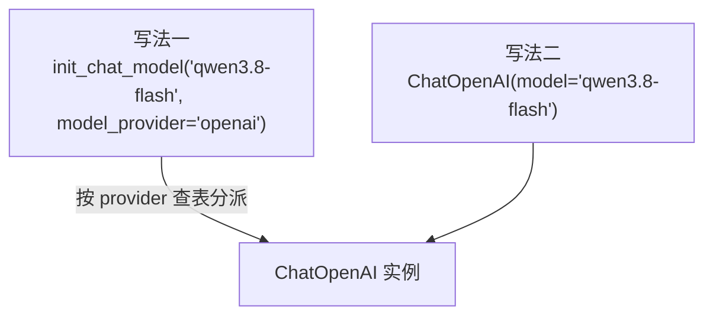
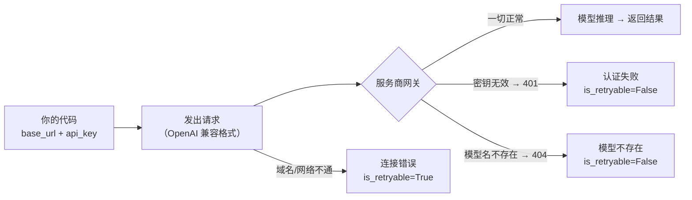
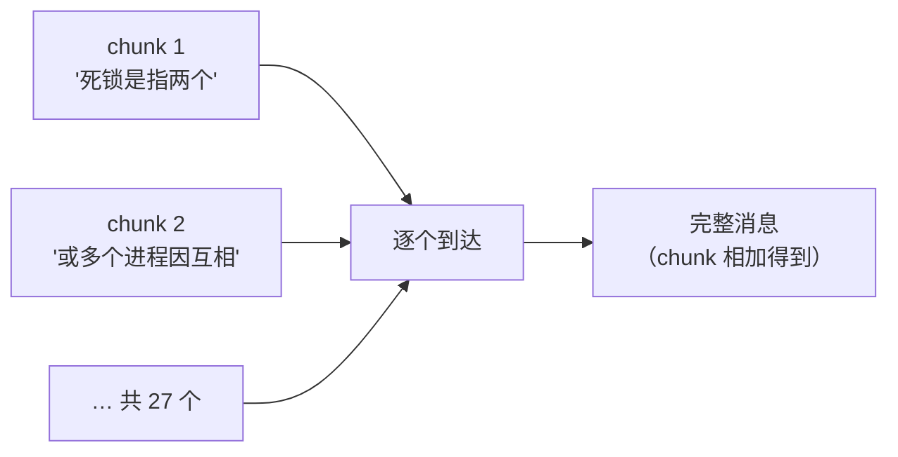
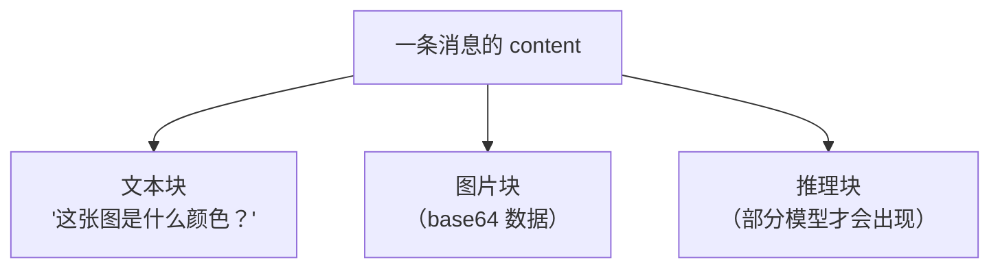
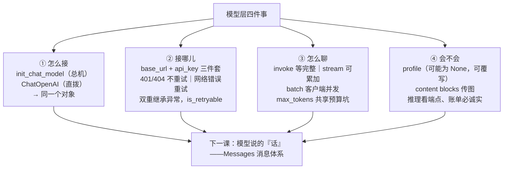

# 第 2 课：Models 模型层（接入任意大模型）

> 所属阶段：阶段 1《入门与模型层》｜ 水平：进阶（有扎实 Python 与后端工程基础，LangChain 从零）｜ 本课知识点：模型初始化的两种方式、自定义 endpoint 接入、模型参数与调用方式、模型能力探测与多模态
> 故事情节：故事的第一次转折——模型是主角的"大脑"，先学会如何接入它、配置它、与它对话
> 📖 结论已按官方文档核对（核对于 2026-09 ｜ 来源：docs.langchain.com 的 models 页；报错类型、token 预算、profile 空值等结论为本机实测）

## 🎯 本课目标

- 掌握模型初始化的两种方式（init_chat_model / Model Class），理解 "provider:model" 字符串约定
- 能接入自定义 API endpoint（base_url + api_key）并排查常见接入错误（本课程实操的入场券）
- 会用 invoke / stream / batch 三种调用方式与常用参数

---

## 第一幕：起源与场景引入

> 🏛️ **起源**：2023 年 1 月，OpenAI 发布 Chat Completion API——模型接口从"传一个字符串、回一个字符串"变成"传一串消息、回一条消息"，其他厂商陆续跟进；从此"各家接口大同小异但细节互不兼容"成了开发者的日常。LangChain 诞生时的两大核心目标之一，就是把这批输入输出标准化（官方原话：Standardizing these model inputs and outputs is a core focus），让你能随时换到最新的模型、不被任何一家锁死（核查于 2026-09）。

团队定下了"模型选型月"：下个季度之前，要在两三个模型平台之间做出选择。你负责搭一个对比环境——同一批测试问题，分别发给候选平台，记录回答质量、响应速度、token 账单。

你上手就撞上了第一堵墙：**两个平台的 SDK 写法不一样**。A 平台用 `AIClient(api_key=...)`，B 平台用 `BChat(key=..., endpoint=...)`；错误处理更是各写各的——A 抛 `AuthException`，B 抛 `BChatError`。光是"让同一份脚本跑通两个平台"，就写了两套适配代码。

第二堵墙更隐蔽：你把输出长度参数设成 100（想着"一句话回答够了"），结果模型返回**空白**。没有报错，没有警告，就是空的。

> 🎬 **场景**：模型选型月——你要用同一份代码接通多个平台、控制成本、还要能看懂"为什么输出是空的"。

> 📌 **一句话本质**：把"每家平台各写一套接入代码"变成"一套统一接口 + 一份配置"——换平台、换模型、调参数、看账单，都在这一个入口里完成。
>
> ⚖️ **处境对照**：裸用各家 SDK，接 N 个平台要写 N 套适配与错误处理；用统一的模型接口，接新平台只是加一段配置——本课实测同一份脚本接通两个平台（含并发与账单统计），每个平台仅一段配置（模型名 + 密钥 + 地址），两平台 3 条并发分别 2.99s / 2.20s（核对于 2026-09）。

---

## 第二幕：认知冲突

"调模型"看起来是最没有悬念的事——发一句话，收一句话。所以问题来了：

> ❓ **问题**：为什么连"调模型"都要分两种初始化方式、三种调用方法？`max_tokens` 这么直白的参数，凭什么能把输出变成一片空白？

冲突在于：**"调模型"不是一步动作，而是四层决策**——

- 怎么接：用统一入口还是具体类？这决定了你以后换模型的成本。
- 接哪儿：官方地址，还是自建网关 / 第三方兼容端点？这决定了你要会配什么、要防什么坑。
- 怎么聊：等完整结果、边出边看、还是批量并发？这决定了用户体验和你的账单。
- 它到底会不会：能不能看图、思考过程去哪了、一次能吃多长的输入？这决定了你能用它做什么。

把"发一句话收一句话"当成全部，上面每一层都会变成等你踩的坑——而第一个坑（空白输出）你已经踩到了。

---

## 第三幕：层层揭示

### 一眼全局图（进入细节前先看一眼）


> 看图：上半部分是核心思想——同一份代码，换配置就能接上不同平台；下半部分是本课要交代清楚的四件事：一个口子接所有（接入）、三种对话姿势（调用）、先看说明书（能力）、账单看得见（用量）。

### 本课地图（分几步走）

| 步 | 这一步要解决什么（人话） | 对应知识点 |
|:--:|------------------------|-----------|
| 1 | 代码里"接上模型"这件事，有几种写法、该用哪种 | 知识点 1：模型初始化的两种方式 |
| 2 | 不接官方地址，接自建网关 / 第三方端点，怎么配、错了怎么查 | 知识点 2：自定义 endpoint 接入 |
| 3 | 和模型"对话"的三种姿势，以及参数怎么调（含空白输出之谜） | 知识点 3：模型参数与调用方式 |
| 4 | 开工前先问它"你会什么"——能力清单、图片、思考过程 | 知识点 4：模型能力探测与多模态 |

### 知识点 1：模型初始化的两种方式

> 🧭 第 1/4 步｜承接：接上模型是后面一切的前提，可"接"这个动作本身就有两种写法 → 本步：搞清两种写法是什么关系、各自何时用
> 本知识点关键点：init_chat_model、Model Class、provider:model 字符串约定、适用场景

#### 一句话定义

初始化模型有两条路：统一的工厂函数 `init_chat_model`（报上模型名，它替你分派），或具体的集成类如 `ChatOpenAI`（直接实例化）。

#### 直觉建立（类比）

像打电话找人：`init_chat_model` 是**总机**——你说"转 OpenAI 部门"，它帮你接过去；`ChatOpenAI` 是**直拨分机号**——你直接拨到那个部门。两条路通向同一部电话（实测：两者返回的对象类型完全一致，都是 `ChatOpenAI` 实例）。

> 💡 **类比的边界**：总机不改变电话本身——它只是个"接线员"。哪天你想精细控制分机（用某个集成包独有的参数），直拨更直接；这也是"两种方式并存"而不是"优胜劣汰"的原因。

#### 核心原理



> 看图：两个入口（总机 / 直拨）汇聚到同一个终点——实测两者返回类型都打印为 `ChatOpenAI`。

- **init_chat_model 是什么**：一个工厂函数。你把模型名（必要时加 `model_provider="openai"`）交给它，它去查"这个 provider 对应哪个集成包"，然后替你实例化。支持 `"{provider}:{model}"` 合并写法（如 `"openai:gpt-5.5"`、`"azure_openai:gpt-5.5"`、`"google_genai:gemini-2.5-flash-lite"`）。
- **Model Class 是什么**：集成包里的具体类（`ChatOpenAI`、`ChatAnthropic`……）。直接实例化，参数同名同义（`model`、`api_key`、`base_url`……）。
- **新模型不用等更新**：官方明确——模型名由集成包**直接透传**给服务商 API，所以厂商出新模型，你**不需要**等 LangChain 发版，直接改名就能用。
- **怎么选**：需要"一个配置跑多个 provider / 动态切换"→ 用 `init_chat_model`；确定只用一家、要用某集成包独有参数、想要明确的类型提示 → 用 Model Class。

#### 示例演示

```python
from langchain.chat_models import init_chat_model
from langchain_openai import ChatOpenAI

model_a = init_chat_model(
    "qwen3.8-flash",
    model_provider="openai",
    api_key=API_KEY,
    base_url=BASE_URL,
)
model_b = ChatOpenAI(model="qwen3.8-flash", api_key=API_KEY, base_url=BASE_URL)
print(type(model_a).__name__, "/", type(model_b).__name__)
```

实测输出：

```text
init_chat_model 返回类型: ChatOpenAI
Model Class  返回类型: ChatOpenAI
```

两条路，同一个终点——记住这个事实，下一条"接入任意平台"就不会有心理负担。

#### 常见误区

1. **以为 `init_chat_model` 是"另一种模型"**：它只是工厂，产物就是某个具体集成类的实例。
2. **以为换模型要重写代码结构**：只要走统一接口，换模型改的只是一行模型名（下一知识点展开）。

#### 一句话记住

> 两条路通向同一个对象：`init_chat_model` 是总机（适合切换），`ChatOpenAI` 是直拨（适合精细控制）。

#### 🗣️ 行话对照

- **init_chat_model（统一初始化入口）**：按 provider 分派到具体集成类的工厂函数——就是本课说的"总机"；在哪遇到：官方 models 文档、跨供应商切换示例
- **Model Class（集成类）**：具体 provider 的模型类（`ChatOpenAI` 等）——就是本课说的"直拨分机"；在哪遇到：`langchain_openai` 等集成包、API reference
- **provider:model 字符串约定**：`"openai:gpt-5.5"` 形式的合并写法；在哪遇到：官方示例、多 provider 配置

#### 官方文档

- [Models（初始化两种方式 / provider:model 约定）](https://docs.langchain.com/oss/python/langchain/models)

---

### 知识点 2：自定义 endpoint 接入

> 🧭 第 2/4 步｜承接：写法学会了，但"接哪儿"还没交代——很多平台并不在官方 provider 列表里 → 本步：用 base_url + api_key 接通任意 OpenAI 兼容端点，并掌握报错排查
> 本知识点关键点：OpenAI 兼容协议、base_url 与 api_key 的配置、安全实践、常见接入报错与排查

#### 一句话定义

只要一个平台实现了 "OpenAI 兼容"的 HTTP 接口，就能用 `model_provider="openai"` + `base_url` + `api_key` 三件套接进来——这是如今绝大多数网关、云平台和自建服务的通用姿势。

#### 直觉建立（类比）

OpenAI 兼容协议像 **USB-C 接口**：本来只是某一家设备的充电口，因为用的人太多，变成了行业事实标准——各家都做"能插进同一个口"的实现。你的代码是那根充电线：不管插到谁家的插座（`base_url`），只要形态是 USB-C（兼容协议），就能通电（正常对话）。

> 💡 **类比的边界**：USB-C 是严格的标准文档；"OpenAI 兼容"是各家照着 OpenAI 接口**仿制**的，字段支持程度参差不齐——官方特别提醒：网关/路由器的私有字段可能不会被识别和保留（后文"排错"部分详述）。

#### 核心原理



> 看图：请求从你的代码出发（带 base_url 与 api_key），经过服务商网关的三种典型结果：成功；401/404（就地失败，不重试）；网络层不通（会按重试策略重试）。

- **配置三件套**：`model`、`base_url`、`api_key`。传参位置有两种——代码参数（灵活，适合演示）；`.env` 环境变量（安全，适合工程）——本课程用后者：`load_dotenv()` 加载，脚本里读 `os.environ[...]`。
- **安全实践**：密钥只存在于 `.env`（已被 `.gitignore`），代码与讲义一律用 `<YOUR_API_KEY>` 占位；可分享的模板是 `.env.example`。
- **连接韧性（官方默认行为）**：网络错误、限流（429）、服务端错误（5xx）会**自动重试**，默认最多 6 次、指数退避加随机抖动；客户端错误（401 未授权、404 不存在）**不重试**。两个参数可调：`timeout`（秒）与 `max_retries`。
- **官方边界提醒**：`model_provider="openai"` 走的是"官方 OpenAI 规范"；路由器/网关的私有字段可能不被识别。OpenRouter / LiteLLM 有各自的专用集成包（`langchain-openrouter` / `langchain-litellm`），能用专用包就别手搓。
- **代理场景**：部分集成支持代理参数（如 `ChatOpenAI(openai_proxy=...)`），按需查阅对应集成文档。

#### 示例演示（报错三连 · 本课实测）

接入失败的报错长什么样？三种最常见的错误，本机实测（脚本见第四幕，已用假 key 与假域名演示，输出可安全分享）：

| 故障场景 | 实测异常类型 | `is_retryable` | 关键信息 | 处理方向 |
|---|---|---|---|---|
| 无效 API key | `OpenAIAuthenticationError` | `False` | `401`、`invalid_api_key` | 检查 `.env` 里的 key 是否正确、是否过期 |
| 模型名不存在 | `OpenAIModelNotFoundError` | `False` | `404`、`Model not exist.` | 核对模型名拼写与平台支持的模型清单 |
| 端点不可达 | `OpenAIConnectionError` | `True` | `Connection error.` | 检查 base_url / 网络 / 代理；它会自动重试 |

再看一层：这些异常和你从文档里看到的 LangChain 标准异常类是什么关系？实测打印异常的继承链：

```text
实际异常类型: OpenAIAuthenticationError
MRO: OpenAIAuthenticationError -> AuthenticationError -> APIStatusError -> APIError
     -> OpenAIError -> ModelAuthenticationError -> ModelError -> LangChainException -> Exception

isinstance(e, ModelAuthenticationError): True
```

**双重继承**：它既是 OpenAI SDK 的异常（`OpenAIAuthenticationError`），又是 LangChain 的标准异常（`ModelAuthenticationError`）——所以你 `except` 哪一个都能接住。LangChain 定义了九种标准异常（认证 / 权限 / 请求无效 / 模型不存在 / 限流 / API 错误 / 连接 / 超时 / 上下文超限），每种都带 `is_retryable` 属性，与官方的自动重试策略一致。

#### 常见误区

1. **把密钥写进代码**：分享、提交、贴日志都会泄露；一律 `.env` + 占位符模板。
2. **见到报错先怀疑框架**：401 / 404 都是"配置没对上"，按上表对号入座，一分钟能定位。
3. **自己手写重试逻辑**：官方默认已经"该重试的自动重试、不该重试的不逞强"，你要做的是理解 `is_retryable` 而不是重复造轮子。

#### 一句话记住

> 兼容端点 = 三件套（model / base_url / api_key）；报错先看三件事：密钥对不对、模型名对不对、网络通不通。

#### 🗣️ 行话对照

形态 A · 术语少量：

- **OpenAI 兼容（OpenAI-compatible）**：照 OpenAI 接口形态实现的一套 HTTP 协议，被大量网关/平台采用——就是本课说的"USB-C 插座"；在哪遇到：各平台接入文档首页、`base_url` 提示语
- **base_url（基础地址）**：请求发往的服务地址——在哪遇到：`.env` 配置、平台控制台的"接入信息"
- **max_retries / timeout**：自动重试次数（默认 6）与超时秒数——在哪遇到：模型初始化参数、连接不稳定场景的调优
- **is_retryable**：异常自带的"是否可重试"标记——在哪遇到：异常对象属性、重试中间件的判断依据

#### 官方文档

- [Models · Base URL and proxy settings](https://docs.langchain.com/oss/python/langchain/models)
- [Models · Model exceptions（九种标准异常）](https://docs.langchain.com/oss/python/langchain/models)

---

### 知识点 3：模型参数与调用方式

> 🧭 第 3/4 步｜承接：接上之后，怎么"聊"、怎么调才对——以及第二幕留下的空白之谜 → 本步：三种调用方式 + 参数的两个传法 + 推理模型的 token 预算真相
> 本知识点关键点：常用参数、invoke / stream / batch、返回结构解读、参数传入位置

#### 一句话定义

和模型对话有三种调用方式——`invoke`（等完整回答）、`stream`（逐字返回）、`batch`（批量并发）；参数（temperature、max_tokens……）可以写在初始化时，也可以传在调用时。

#### 直觉建立（类比）

- `invoke`：打电话，**等对方把话说完**再挂断。
- `stream`：对方**边想边说**，你一个字一个字地听到。
- `batch`：**一次下三份订单**，后厨并发处理——谁先做好谁先出（配合 `batch_as_completed`）。

> 💡 **类比的边界**：后厨并发是店家自己调度（服务端）；LangChain 的 `batch` 是**客户端并发**——它把多个请求同时发出去（官方文档特意标注：这与服务商提供的"批处理 API"是两回事）。

#### 核心原理

**三种调用的语义与返回值**：

| 方式 | 语义 | 返回 | 本课实测 |
|---|---|---|---|
| `invoke` | 等完整响应 | `AIMessage`（单条） | 1.69s，111 tokens（其中推理 16） |
| `stream` | 逐块产出 | `AIMessageChunk` 迭代器，**可相加** | 27 个 chunk，2.08s |
| `batch` | 并发多条 | 结果列表（顺序同输入） | 3 条并行 1.40s（单条 1.69s） |

**stream 的关键机制——chunk 可以累加**：



> 看图：流式的每个片段都能和前后片段"相加"——`full = chunk if full is None else full + chunk`，加完就是一条完整消息（实测累加结果与一次性 invoke 的语义一致）。

**batch 为什么快**：实测 3 条并发总耗时 1.40s，反而**低于**单条 invoke 的 1.69s——因为三条请求同时在路上，总时间由最慢的一条决定（而非三条相加）。批量输入多时可用 `config={"max_concurrency": N}` 限制并发数。

**参数：写在哪儿，两处都行**

- 初始化时：`init_chat_model(..., temperature=0.7, timeout=30, max_tokens=1000)`
- 调用时：`model.invoke("...", temperature=0)`（覆盖本次调用）
- 常用参数：`model`、`api_key`、`temperature`（随机性：低=更稳定、高=更发散）、`max_tokens`（输出上限）、`timeout`、`max_retries`。

**max_tokens 的坑（推理模型专属，本课实测重头戏）**：

同一个长文请求（"请用尽可能长的篇幅介绍杭州"），只改 `max_tokens`，输出居然**全是空白**：

| max_tokens 设置 | 输出 | finish_reason | 输出 token 构成 |
|---|---|---|---|
| 24 | 空 | `length` | 24 个全部消耗在推理 |
| 100 | 空 | `length` | 推理 100 / 正文 0 |
| 500 | 空 | `length` | 推理 500 / 正文 0 |
| 不设（默认） | 完整长文 | `stop` | 总计 13951，其中推理 1452 |

谜底：**这是推理模型**（回答前先"想"）。`max_tokens` 限制的是"推理 + 正文"的**总预算**——推理先花，正文后花。预算不够时，模型全花在思考上，正文一个字都轮不到（`finish_reason=length` 就是凭证）。同一请求在默认设置下，推理用掉 1452 个 token、正文约 12000+。**结论：对推理模型做长文任务，`max_tokens` 要么别设，要么留足"推理 + 正文"两份预算。**

#### 示例演示

```python
resp = model.invoke("用一句话解释什么是内存泄漏。")
print(resp.content)
print(resp.usage_metadata)
```

实测输出：

```text
内容: 内存泄漏是指程序不再使用的内存没有被释放，导致可用内存逐渐被占用，最终可能变慢或崩溃。
usage_metadata: {'input_tokens': 68, 'output_tokens': 43, 'total_tokens': 111,
                  'output_token_details': {'reasoning': 16}}
```

`usage_metadata` 就是"账单明细"：输入 68 + 输出 43 = 总计 111，其中输出里 16 个是推理消耗——后面算成本、做对比全靠它。

#### 常见误区

1. **把 `max_tokens` 当"正文长度"**：对推理模型不成立（推理与正文共享预算）——设小了输出为空，不是"截断"。
2. **把 `batch` 当服务商批处理**：它是客户端并发，只是"同时发出多条请求"。
3. **stream 后忘了累加**：每个 chunk 是片段；要完整消息记得相加（或直接用 `invoke`）。

#### 一句话记住

> 等完整用 invoke、逐字看用 stream、批量享用 batch；推理模型的 max_tokens 是"推理+正文"共享预算，别设太小。

#### 🗣️ 行话对照

形态 A · 术语少量：

- **invoke / stream / batch（三种调用方式）**：等完整 / 逐块 / 批量并发——就是本课说的"打电话 / 边想边说 / 一次多单"；在哪遇到：所有 LangChain 模型对象、官方 Invocation 章节
- **AIMessageChunk（流式消息块）**：流式返回的每个片段，可相加合成完整消息——在哪遇到：stream 循环、累加模式
- **usage_metadata（用量元数据）**：token 用量明细（含推理 token）——在哪遇到：每次响应对象、成本统计
- **finish_reason（结束原因）**：`stop`=正常结束、`length`=撞到长度上限——在哪遇到：`response_metadata`、排查"输出被截断/空白"

#### 官方文档

- [Models · Invocation（invoke/stream/batch）](https://docs.langchain.com/oss/python/langchain/models)
- [Models · Parameters](https://docs.langchain.com/oss/python/langchain/models)

---

### 知识点 4：模型能力探测与多模态

> 🧭 第 4/4 步｜承接：会聊、会调参了，但每个模型"会什么"并不相同——开工前先摸清底细 → 本步：用能力档案（profile）探测、用 content blocks 传图片、看懂推理内容
> 本知识点关键点：profile 能力查询、多模态输入、reasoning 内容特性、进阶主题地图

#### 一句话定义

模型通过 `profile`（能力档案）声明自己支持什么（图片输入？工具调用？上下文多长？）；非文本内容（图片等）通过消息的 **content blocks** 传入——两者共同回答"这个模型到底能不能干这件事"。

#### 直觉建立（类比）

`profile` 像一台设备的**说明书**：功率多大、支不支持这个配件、一次能处理多少，出厂就写在里面。而 content blocks 像**快递包裹里的分格箱**——一条消息里可以并排放"一段文字""一张图片"，各占一格，分别投递。

> 💡 **类比的边界**：说明书是出厂必配的；`profile` 并非每个模型都有——**本课实测：自建/网关类模型的 profile 直接是 `None`**（见下），这时你得像给设备补一张手写说明那样，手动覆写。

#### 核心原理

**① profile：能力档案**

- 读取：`model.profile` → 一个字典，如 `{"max_input_tokens": 400000, "image_inputs": True, "reasoning_output": True, "tool_calling": True, ...}`（需要 `langchain>=1.1`；本环境 1.4.0 满足）。
- 数据来源：主要来自开源项目 **models.dev**（模型能力数据库），LangChain 集成包在其上做补充与覆盖。
- 官方列出的典型用途：摘要中间件按上下文窗口大小决定何时压缩；`create_agent` 自动选择合适的结构化输出策略；按模型支持的模态对输入做门禁；模型切换器只列出支持工具调用的模型。
- 本课实测结果（重要）：

| 模型 | `model.profile` |
|---|---|
| qwen3.8-flash（第三方网关） | `None`（无档案数据） |
| deepseek-flash（官方 API） | `None`（无档案数据） |

两个模型都没有 profile——因为它们不在 models.dev 的收录范围内。官方给了**手动覆写**的口子，实测生效：

```python
custom = init_chat_model(..., profile={"max_input_tokens": 100_000, "tool_calling": True})
print(custom.profile)   # {'max_input_tokens': 100000, 'tool_calling': True}
```

profile 是 beta 特性（官方注明格式可能变化），但"查不到就自己写一份"的用法是稳的。

**② 多模态：一条消息 = 多个内容块**



> 看图：一条消息由多个"块"组成——本课实测发送了"文本 + 图片"两块，模型据此看图回答。块还有多种风味：跨供应商标准格式、OpenAI 的 `image_url` 格式、以及各 provider 原生格式（官方注明兼容三种）。

实测（发送一张程序生成的纯红色 32×32 图片）：

```text
图片识别回答: 红色
```

一句话总结这一步：**只要能构成 content blocks，模型就能"看"**——图片、音频、视频同理（具体支持哪种模态查 profile 或服务商文档）。

**③ reasoning：推理内容去哪了**

官方说：如果底层模型支持，你可以把推理过程"翻出来"看（`stream` 的 chunk 或 `invoke` 响应里筛 `type == "reasoning"` 的内容块）；还能用 `reasoning_effort` 参数要它"多想一点 / 少想一点"（标准参数，本环境版本满足要求）。

实测的边界（诚实呈现）：本课两个模型**能"记账"但不"露脸"**——

- `reasoning_effort="high"` 传参**被接受、未报错**（模型照常回答）；
- 但 `content_blocks` 里只有 `['text']`，**没有** reasoning 内容块；
- 推理的存在感只在账单里：`output_token_details: {'reasoning': 16}` / `42` / `447`……

结论：**推理是否可见，取决于模型与端点是否暴露**——账单里始终能看到它（别忘了为它买单），能看到过程与否以端点实际行为为准。

**④ 进阶主题地图**（本课不展开，知道"有这些"即可）

- **本地模型**：跑在自有硬件上（隐私 / 成本场景）；
- **提示词缓存**：部分 provider 支持缓存前缀，降本提速；
- **限流器**：`rate_limiter` 参数（如 `InMemoryRateLimiter`）控制请求速率，避免撞限流；
- **token 统计**：`get_usage_metadata_callback()`（本课第四幕实操用到）；
- **日志概率 / 调用配置**（`logprobs` / `config` 的 run_name、tags 等）：按需查阅进阶主题章节。

#### 示例演示

```python
print(model.profile)                      # None（本课实测）
print([b["type"] for b in resp.content_blocks])  # ['text']
print(resp.usage_metadata["output_token_details"])  # {'reasoning': 126}
```

三行输出，三个事实：档案未必有、推理未必露脸、但账单一定如实。

#### 常见误区

1. **以为"官方文档说能查 profile"= 每个模型都有**：不在 models.dev 收录范围的模型返回 `None`，需要手动覆写。
2. **以为推理过程一定能看到**：可见性取决于端点实现；先查 `content_blocks` 实际类型，别对着空列表猜。
3. **忽视推理 token 的成本**：推理 token 计入输出计费——本课对比实测中，deepseek-flash 的推理消耗占输出 token 的 83%（447/538），比百炼的 59%（135/227）高一截。

#### 一句话记住

> 开工三连问：profile 告诉我能不能（没有就手写一份）、content blocks 让我传图、推理过程看端点脸色但账单永远诚实。

#### 🗣️ 行话对照

形态 A · 术语少量：

- **profile（模型能力档案/dict）**：模型能力的结构化声明——就是本课说的"说明书"；在哪遇到：`model.profile`、摘要中间件与结构化输出的自动决策
- **content blocks（内容块）**：消息内容的多模态组成部分——就是本课说的"分格箱"；在哪遇到：`message.content_blocks`、多模态输入
- **reasoning / reasoning_effort（推理内容 / 推理力度）**：模型的思考过程与"想多少"的参数——在哪遇到：`output_token_details.reasoning`、Responses 类模型的调用参数
- **rate_limiter（限流器）**：控制请求速率的内置组件——在哪遇到：`init_chat_model(rate_limiter=...)`、限流治理

#### 官方文档

- [Models · Advanced topics（profiles / multimodal / reasoning）](https://docs.langchain.com/oss/python/langchain/models)
- [Messages · 多模态内容块](https://docs.langchain.com/oss/python/langchain/messages)

---

## 第四幕：实操验证

回到第一幕的场景：模型选型月，你要出**"同一份代码、两个平台"的对比报告**。整合本课四个知识点——统一初始化（K1）、双平台接入（K2）、batch 并发 + 账单统计（K3）、token 用量洞察（K4）：

```python
PLATFORMS = {
    "阿里云百炼 / qwen3.8-flash": dict(model="qwen3.8-flash", api_key=..., base_url=...),
    "DeepSeek / deepseek-flash": dict(model="deepseek-flash", api_key=..., base_url=...),
}

for name, cfg in PLATFORMS.items():          # 同一份循环，接两个平台
    model = init_chat_model(model_provider="openai", **cfg)
    with get_usage_metadata_callback() as cb:  # 账单统计
        results = model.batch(QUESTIONS)       # 并发三条
    ...
```

实测输出（完整脚本见 `playground/compare-models.py`）：

```text
===== 阿里云百炼 / qwen3.8-flash =====
3 条并发耗时: 2.99s
  token 账单: {'total_tokens': 427, 'output_tokens': 227, 'reasoning': 135, 'input_tokens': 200}

===== DeepSeek / deepseek-flash =====
3 条并发耗时: 2.20s
  token 账单: {'total_tokens': 645, 'output_tokens': 538, 'reasoning': 447, 'input_tokens': 107}
```

> ✅ **回扣场景**：第一幕的"两套 SDK、两套错误处理"消失了——接入两家平台只差一段配置；第一幕的空白输出也真相大白（推理吃掉了 token 预算）。选型报告需要的"速度 + 账单"两项数据，一个脚本全出。真实选型还会看回答质量与更多样本——但骨架已经立住：**改配置换平台、batch 并发、callback 记账**。

> ⚠️ 数值说明：单次运行数据（2026-09-15 本机），耗时与 token 随网络和内容而浮动；横向比较时建议同一批次运行取数。

**应用实战（4.2）**：把本课知识点组装成一条「模型接入主备保险」的演进路线——独立成册：

> 🔌 **应用实战 2：给模型接入加一道「主备保险」** → [打开实战篇](../../../应用实战/02-Models模型层.md)
>
> 从「单模型硬编码」到「主备降级」再到「配置化 + 能力门禁」的三个版本演进：每一步解决了什么问题、还剩什么问题、下一步怎么被逼出来——配 3 张分步设计图（每张标注本步新增了什么）。

---

## 第五幕：体系收束

> 📍 **全局定位**：模型层是整座体系的地基——上一课"Agent = Model + Harness"里的 Model 部分，本课全部交代完毕：怎么接（K1）、接哪儿与出错怎么办（K2）、怎么聊与参数怎么调（K3）、它会不会（K4）。此后所有组件（工具、记忆、中间件、多智能体）都构建在这个统一模型接口之上。
>
> 🔗 **下一步**：课 3《Messages 消息体系》——你已经反复看到"消息列表"进出（`invoke([{"role": "user", ...}])`、`content_blocks`），但还没正式认识它们。消息是模型的"输入输出语言"：四类角色的分工、多模态内容块的结构、序列化——下一课把这层"语言"讲透，它是后面记忆、流式、工具调用全部机制的数据基元。

---

## 🐞 常见误区

1. **把 `max_tokens` 当"正文长度"**：对推理模型是"推理 + 正文"共享预算——实测 500 都可能全耗在推理上，输出为空。
2. **密钥硬编码**：`.env` + `.gitignore` + `.env.example` 占位符，三件套缺一不可。
3. **见到报错就慌**：401 / 404 / 连接错误的处理方向完全不同——先看异常类型与 `is_retryable`。
4. **以为 profile 人人都有**：不在 models.dev 收录范围的模型返回 `None`，手动覆写即可。
5. **以为推理过程一定可见**：可见性看端点实现；账单里一定有。

### ⏳ 与过时说法对照（写前核对 + 实测发现的差异）

| 旧说法（网上教程 / 直觉） | 现状（官方文档 + 本课实测） | 依据 |
|---|---|---|
| "max_tokens 控制回答长度" | 对推理模型是"推理 + 正文"共享预算：实测 24/100/500 全部输出为空，默认设置下推理占 1452 tokens | 本课实测 |
| "查 `model.profile` 就能知道模型能力" | 需要 `langchain>=1.1`，且数据来自 models.dev——自建/网关模型可能为 `None`，需手动覆写 | 本课实测 + models 页 |
| "报错只需 catch 各家 SDK 的异常" | 异常双重继承：`OpenAIAuthenticationError` 同时也是 LangChain 的 `ModelAuthenticationError`，带 `is_retryable` | 本课实测（MRO）+ models 页 |

## 一图总结



> 看图：四个分支对应本课四个知识点，每个分支下是一句话结论（含各自的坑），最终汇聚到下一课的方向。

## 课后小测

**Q1**：你写了一份脚本，用 `init_chat_model("qwen3.8-flash", model_provider="openai", ...)` 初始化模型。它返回的对象是什么类型？
- A. `InitChatModel` 包装类
- B. `ChatOpenAI` 实例（工厂按 provider 分派到具体集成类）
- C. `dict` 配置对象
- D. 取决于平台，每次不同

<details><summary>答案与解析</summary>

**答案：B**。`init_chat_model` 是工厂函数——实测它与直接 `ChatOpenAI(...)` 返回的类型一致。理解这一点，才不会把它当成"另一种模型"。

</details>

**Q2**：你用推理模型生成一篇长文，设置了 `max_tokens=500`，结果输出是**空字符串**，`finish_reason` 为 `length`。最可能的原因是什么？
- A. 模型坏了，需要重试
- B. 500 个 token 全部被推理过程消耗，正文没有预算
- C. `max_tokens` 不能和推理模型一起用
- D. 网络问题导致响应被截断

<details><summary>答案与解析</summary>

**答案：B**。实测证据：`output_token_details: {'reasoning': 500}`、正文 0——推理与正文共享 `max_tokens` 预算，推理先花。对长文任务要么不设、要么留足，而不是设小。

</details>

**Q3**：接入自定义端点后调用报 `OpenAIAuthenticationError`，`is_retryable` 为 `False`。正确的第一反应是什么？
- A. 增加重试次数
- B. 换一个模型
- C. 检查 `.env` 里的 api_key 是否正确、过期、与 base_url 是否配套
- D. 减少超时时间

<details><summary>答案与解析</summary>

**答案：C**。401 类错误是"配置没对上"，不重试也不换模型——按报错消息里的关键字（如 `invalid_api_key`）定位到密钥配置即可。

</details>

## 🚀 下一批接力提示词

> 学完本课后，**复制下面这段文字发给 AI**，即可无缝进入下一课（无需重新描述上下文）：

```text
继续学 LangChain。我的学习档案在 langchain/langchain/00-学习档案.md，
刚学完阶段 1《入门与模型层》的课 2《Models 模型层》全部知识点
（模型初始化的两种方式、自定义 endpoint 接入、模型参数与调用方式、模型能力探测与多模态），
请按大纲继续讲解课 3《Messages 消息体系》的知识点。
```

## 🧭 课程导航

⬅️ **上一课**：[课 1：LangChain 是什么（起源与定位）](lesson-01-LangChain是什么.md)

➡️ **下一课**：[课 3：Messages 消息体系](lesson-03-Messages消息体系.md)

📚 **返回目录**：[课程目录](../../../02-课程目录.md)
