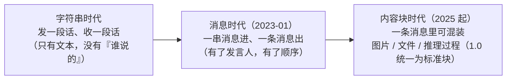
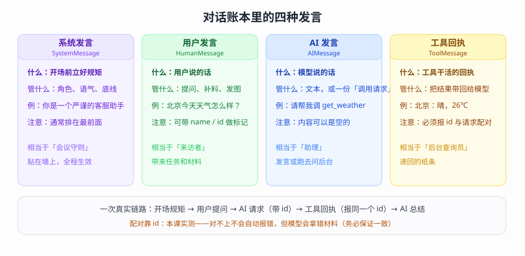
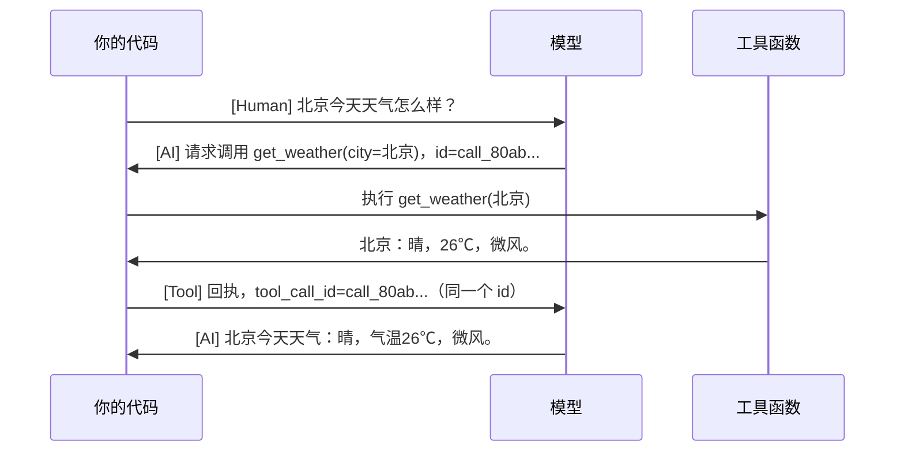
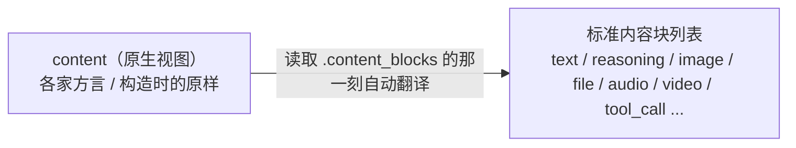

# 第 3 课：Messages 消息体系（模型的标准语言）

> 所属阶段：阶段 1《入门与模型层》｜ 水平：进阶（有扎实 Python 与后端工程基础，LangChain 从零）｜ 本课知识点：为什么需要标准消息格式、四类消息与角色、消息内容与多模态、构造、字典与序列化
> 故事情节：故事的第二次转折——给主角立"语言规范"；消息是后续工具调用、记忆、流式全都要复用的数据基元
> 📖 结论已按官方文档核对（核对于 2026-09 ｜ 来源：docs.langchain.com 的 messages 页；角色名单、无状态对照、懒解析、序列化警告等结论为本机实测）

## 🎯 本课目标

- 理解消息标准化的动机（厂商格式差异 → 一套标准）
- 掌握四类消息（System / Human / AI / Tool）的角色与工具调用消息流
- 能用对象与字典两种格式构造消息，理解 content blocks 与多模态内容

---

## 第一幕：起源与场景引入

> 🏛️ **起源**：2023 年 1 月，OpenAI 把模型接口从"传一个字符串、回一个字符串"改成"传一串消息、回一条消息"（Chat Completion API），消息从此成为模型交互的通用单位；2025 年起图片、文件、视频等多模态内容普及，LangChain 在 1.0（2025-10）进一步把各家的内容格式统一为"内容块"标准（核查于 2026-09）。

客服系统上线第三周，两个需求一起砸下来。

运营说：用户会追问。同一个用户先问"我上月买的那单"，再问"那这个退款到哪了"——但助手每次都在装失忆，用户只能把订单号重复粘贴第三遍。

主管转来一张客诉截图："用户开始直接发照片了，说'这是我收到的货，破成这样'。你们能不能看懂图片？"

你去看当初写的代码，发现了更根本的问题：代码里到处是 `"user: " + text` 这样的字符串拼接。这种写法连"这句话是谁说的"都表达不了——更别提"一条消息里同时装着一段文字和一张图"。而且上一个平台换成本平台时，你把拼接格式、解析逻辑、报错处理重写了一遍；如果再加一个平台，还得再来一遍。

> 🎬 **场景**：客服助手要晋级了——要能"接着聊"、要能"看图"，而你发现这一切的前提，是先给"对话"这件事立一套规范。

> 📌 **一句话本质**：把"每次给模型递一句话"变成"递一本记满『谁说了什么』的账本"——账本用同一套写法书写，递给任何平台都能读；账本递多长，它就"记得"多少。
>
> ⚖️ **处境对照**：不这么写——换一个平台重写一套拼接与解析；想让助手"记得"，得自己发明历史管理逻辑，且每个组件（工具、记忆、流式）都要为每家平台各适配一遍。这么写——同一份消息列表通行所有平台（本课实测：三种构造写法拿到同一种返回、"记忆"只需把历史原样递回）；实测对照：带历史它答"您的幸运数字是 42"，不带历史它说"我没法真正知道你的幸运数字"（核对于 2026-09）。

---

## 第二幕：认知冲突

"多轮对话"听起来天经地义——毕竟你手机里的每个聊天软件都这样。但真相是：**模型自己没有任何记忆**。

> ❓ **问题**：模型不记事，那"多轮对话"到底是靠什么实现的？既然每家平台的输入格式都不一样，为什么还要先学一套"标准格式"？

两个追问把冲突顶到死角：

- 追问一：直接拼字符串不行吗？——字符串能表达"一段话"，但表达不了"这是谁说的"、表达不了"这是工具查回来的结果"，更表达不了"文字 + 图片"混排的一条内容。
- 追问二：各家平台的差异，在代码里写 `if-else` 适配不行吗？——行，但那是乘法：N 个平台 × M 个组件，要写 N×M 套适配代码；每加一个组件（工具、记忆、流式），每个平台都要再适配一遍。

标准格式的意义，就是把"乘法"收敛成"加法"：每家平台向同一套标准适配一次（N+M），你的业务代码只写一套——**这就是"消息"这套语言存在的全部理由**。

---

## 第三幕：层层揭示

### 一眼全局图（进入细节前先看一眼）


> 看图：左边是现状——"每家平台一套写法"、"聊完就失忆"；右边是本课的两条解法——"一本账谁都看得懂"（统一写法）与"账本多长就记得多少"（历史随请求携带）；底部是总思路。

### 本课地图（分几步走）

| 步 | 这一步要解决什么（人话） | 对应知识点 |
|:--:|------------------------|-----------|
| 1 | 先搞清"为什么要统一说法"——它解决的到底是什么问题 | 知识点 1：为什么需要标准消息格式 |
| 2 | 账本里都有谁在发言？一次真实链路怎么走、怎么对上号 | 知识点 2：四类消息与角色 |
| 3 | 一条发言里"装什么"——文字、图片，还是推理过程 | 知识点 3：消息内容与多模态 |
| 4 | 账本用什么"笔"写、写完了怎么"存档" | 知识点 4：构造、字典与序列化 |

### 知识点 1：为什么需要标准消息格式

> 🧭 第 1/4 步｜承接：第二幕的追问"各家格式不同，为什么要有标准、多轮对话靠什么" → 本步：用演进史说清标准化的价值，并落定最重要的认知——消息列表就是模型的全部输入

#### 一句话定义

消息（Message）是模型交互的标准数据单元；模型一次请求看到的**全部输入**就是一串消息——所谓"多轮对话"，就是把之前的消息和新提问一起递回去。

#### 直觉建立（类比）

通信方式的进化：最早是"发电报"——一段文字进、一段文字出，没有署名、没有附件；后来大家改用"标准信件"——信封上必须写清"发件人是谁"（系统/用户/助手/工具），信封里还能夹照片、装附件。收信的人看一眼信封，就知道"这封信是谁、在什么背景下说的"。

> 💡 **类比的边界**：邮政格式是强制的硬标准；这里的"标准"是社区约定加框架适配层——各家平台的实现细节仍有差异（比如支不支持视频输入），能力边界以实测为准。

#### 核心原理

**① 它解决的是"乘法问题"**：各平台的差异是全方位的——字段名不同、角色命名不同、工具调用的表达不同、媒体数据（图片等）的编码方式不同（URL / base64 / 文件 ID 各一套）。如果每个组件都要为每家平台做适配，成本是 N×M；标准格式把各家"翻译"到一套通用单元上，成本收敛为 N+M。

**② 演进路径：从"一句话"到"集装箱"**：



> 看图：三个时代从左到右——从"只有话"，到"有身份的对话"，再到"像集装箱一样能混装内容"；越往后，能表达的对话越接近真实世界。

**③ 消息即上下文（本课最重要的认知）**：模型是**无状态**的——它不记得上一轮发生了什么。它每次能看到的，就是你这次递给它的那个消息列表。由此推出两条铁律：

- "它记得" = 你把该记得的历史**一起递回去了**；
- "它不记得" = 你只递了新问题（哪怕上一轮它刚自我介绍过）。

官方原话印证："Interactions are often stateless, so that a simple conversational loop involves invoking a model with a growing list of messages."（交互通常是无状态的——多轮对话 = 拿着一个不断变长的消息列表反复调用模型。）

#### 示例演示

三种构造写法，实测（同一模型、同一环境）：

```python
model.invoke("用一句话向我问好。")                                   # 字符串快捷
model.invoke([SystemMessage("..."), HumanMessage("...")])            # 消息对象列表
model.invoke([{"role": "system", "content": "..."}, {"role": "user", ...}])  # 字典（OpenAI 风格）
```

实测输出：

```text
1a. 返回类型: AIMessage | 内容: 你好，很高兴见到你，祝你今天一切顺利！
1b. 返回类型: AIMessage | 内容: 好雨知时节，当春乃发生。
1c. 返回类型: AIMessage | 内容: 荷风送香气，竹露滴清响。
```

三种写法都拿到 `AIMessage`——入口处自动归一（细节在知识点 4）。官方建议：单次、独立的请求用字符串快捷；多轮、多模态、要带系统设定时用消息列表。

#### 常见误区

1. **以为模型"天生记得上下文"**：它不记得；"多轮"是你携带历史造出来的效果（第四幕有对照实验）。
2. **以为三种构造写法是三套体系**：它们在入口被归一成同一套消息对象，选哪种是写法偏好，不是架构选择。
3. **以为"标准"等于"各家彻底一样"**：标准统一的是**表达格式**，不是**能力**——平台支持什么（视频？工具？）仍要看模型档案与实测。

#### 一句话记住

> 模型无状态，"记忆"是账本的别名——递多长、记多少；标准消息让这本账跨平台通用。

#### 🗣️ 行话对照

- **messages（消息列表）**：模型一次请求的全部输入——就是本课说的"账本"；在哪遇到：`invoke({"messages": [...]})`、tracing 界面、官方 quickstart
- **stateless（无状态）**：模型不保存对话历史，每次请求独立——在哪遇到：官方 messages 页 "Interactions are often stateless"、上下文窗口相关讨论
- **Chat Completion API（聊天补全接口）**：2023-01 起"消息进、消息出"的接口形态——在哪遇到：各平台接入文档、模型接入协议讨论

#### 官方文档

- [Messages（基本用法 / 三种写法）](https://docs.langchain.com/oss/python/langchain/messages)

---

### 知识点 2：四类消息与角色

> 🧭 第 2/4 步｜承接：为什么要统一已经清楚——可标准长什么样？账本里都有谁在发言、怎么对上号？ → 本步：四类消息的分工 + 一条真实的工具调用链路
> 本知识点关键点：System / Human / AI / Tool 分工、tool_calls 结构、id 配对、消息属性速查

#### 一句话定义

消息有四种角色：**System**（立规矩）、**Human**（用户发言）、**AI**（模型发言，文本或工具调用请求）、**Tool**（工具执行结果的回执）；一次带工具的对话，就是这四者按顺序排成的一串消息。

#### 直觉建立（类比）

一场"带助理的会面"：开场前，墙上贴着《会议守则》（System）；来访者说明来意（Human）；助理说"这个问题我需要去后台查一下"（AI 的调用请求）→ 查询员把纸条递回来（Tool）→ 助理据此给出答复（AI 的总结）。四类发言分工明确，缺一环链路就不完整。

> 💡 **类比的边界**：真人助理可以临场发挥、跳过流程；模型不行——它每一轮只能做一件事：说文本，**或**提出调用请求；真正的"去后台查"永远发生在框架（harness）一侧。

#### 核心原理

**① 四张"角色卡"**：



> 看图：四张卡片分别是系统、用户、AI、工具发言——"是什么、管什么、例子、注意事项"；底部是真实链路与 id 配对规则。

**② 一次工具调用的完整链路**（真实收发顺序）：



> 看图：模型与框架之间来回的每一段，都对应账本里的一行；`id` 是请求与回执之间的"对号"——回执必须报同一个号，否则接错线。

**③ AI 消息上的"调用请求"长什么样**（实测）：

```python
AIMessage(
    content="",
    tool_calls=[{"name": "get_weather", "args": {"city": "北京"}, "id": "call_demo_1"}],
)
# 实际存储时自动补全了类型标记：
# [{'name': 'get_weather', 'args': {'city': '北京'}, 'id': 'call_demo_1', 'type': 'tool_call'}]
```

注意三个字段：`name`（调哪个工具）、`args`（参数）、`id`（对号）。还有第四个事实：**content 是空的**——这一轮模型什么都没"说"，它只提出了请求。

**④ Tool 消息的配对要求**：官方明确 `tool_call_id` "Must match"（必须与请求的 id 一致）。实测补充：本环境**对不上号也不报错**——模型会把错配的回执当成结果使用（这是危险信号而非便捷，详见第四幕"慎学"实验）。

**⑤ 消息属性速查**（全部实测自第 2 轮 AI 消息）：

| 属性 | 是什么 | 实测值（节选） |
|---|---|---|
| `content` | 原始内容（字符串或内容块列表） | `'北京今天天气：晴，气温26℃，微风。'` |
| `text` | 纯文本快捷读取 | 同上 |
| `content_blocks` | 标准化内容视图（下一站展开） | `[{'type': 'text', 'text': '北京今天天气：...'}]` |
| `tool_calls` | 本消息携带的调用请求 | 第 1 轮为 1 条；本消息为空 |
| `id` | 消息标识（供应商提供或框架生成） | `'lc_run--01a0a3e4-...-0'` |
| `usage_metadata` | token 用量（课 2 的"账单"） | `{'input_tokens': 372, 'output_tokens': 41, 'total_tokens': 413, ...}` |
| `response_metadata` | 供应商原始元数据 | 键含 `finish_reason='stop'`、`model_name='qwen3.8-flash'` 等 |

#### 示例演示

真实链路捕获（本机实测，脚本见第四幕）：

```text
第 1 轮 AI 消息: content=''
  tool_calls: name='get_weather' | args={'city': '北京'} | id='call_80ab0a311a5d4041953a4dcb'
该消息的 content_blocks: [{'type': 'tool_call', 'name': 'get_weather', 'args': {'city': '北京'}, 'id': 'call_80ab0a311a5d4041953a4dcb'}]
Tool 消息: content='北京：晴，26℃，微风。' | tool_call_id='call_80ab0a311a5d4041953a4dcb'
第 2 轮 AI 消息: 北京今天天气：晴，气温26℃，微风。
```

四个观察点：① 请求 id 是模型生成的真实编号；② 请求在 `content_blocks` 里同样有标准化表达（`tool_call` 块）；③ Tool 回执报的是同一个 id；④ 第 2 轮 AI 消息才是给用户的答复。

#### 常见误区

1. **以为 AI 消息"就是一段文本"**：它可以只有调用请求（content 为空），也可以是内容块列表（下一站）。
2. **以为 Tool 消息是给用户看的**：它是递给模型的"材料"；界面上通常不直接展示（官方另设 `artifact` 字段放"不发给模型、只给程序用"的数据）。
3. **以为 id 对不上会自动报错**：本环境实测不报错——对号是你的责任，错了不会有人提醒你。
4. **以为 ToolMessage 必须带 `name`**：官方参考标注 required；实测可不传（`name=None`）——但建议带上，便于排障。

#### 一句话记住

> 系统立规、用户提问、AI 请求（带 id）、工具回执（同 id）、AI 总结——五步一条链路，缺一环链路就断。

#### 🗣️ 行话对照

- **SystemMessage / HumanMessage / AIMessage / ToolMessage**：四类消息的类名，对应字典里的 `role` 为 `system / user / assistant / tool`——在哪遇到：类名导入、tracing 界面、字典消息
- **tool_calls（工具调用请求）**：AI 消息携带的结构化请求列表（name/args/id）——在哪遇到：`message.tool_calls`、课 4 工具机制
- **tool_call_id（回执对号）**：Tool 消息与请求配对用的 id——在哪遇到：`ToolMessage.tool_call_id`、报错排查
- **artifact（附加工件）**：Tool 消息上"不发给模型、只供程序读取"的数据——在哪遇到：检索类工具携带文档元数据（课 11 会用到）

#### 官方文档

- [Messages · Message types（四类消息与属性）](https://docs.langchain.com/oss/python/langchain/messages)

---

### 知识点 3：消息内容与多模态

> 🧭 第 3/4 步｜承接：发言人都认清了——但一条"发言"里到底能装什么？ → 本步：content 的三种写法、content_blocks 标准视图与"懒解析"机制
> 本知识点关键点：content blocks 标准结构、文本/图片/文件等类型、reasoning 内容块、懒解析

#### 一句话定义

一条消息的内容（`content`）可以是纯字符串，也可以是一串**内容块**（content blocks）——文本、图片、文件、音频、视频、推理过程各占一块；`content_blocks` 属性提供跨供应商的标准化视图。

#### 直觉建立（类比）

消息像"快递分格箱"：这一格里放说明文字、那一格放照片、另一格放文件……一块一块码好。`content` 像"随箱运单"——不同平台的方言写法都往这里放；`content_blocks` 像"标准运单"——统一的品类与字段，**读的那一刻自动翻译**。

> 💡 **类比的边界**：不是所有快递公司都收所有品类——有的模型不收视频、有的不收某种格式；能力边界以模型档案（课 2 的 profile）与实测为准。

#### 核心原理

**① 三种写法都合法**（官方）：① 纯字符串；② 供应商原生格式的块列表（如 OpenAI 的 `{"type": "image_url", ...}`）；③ LangChain 标准内容块列表（`content_blocks=` 构造时）。入口会自动归一。

**② content 与 content_blocks 的关系——"懒解析"**：



> 看图：你不必手工转换——写 `message.content_blocks` 时，框架把原生内容即时翻译成标准块；这就是"同一套读取代码读所有平台"的底气。

**③ 标准块家族**（官方 reference 摘要，按用途分组）：

| 分组 | 块类型 | 用途 |
|---|---|---|
| 核心 | `text`、`reasoning` | 正文文字、模型推理过程 |
| 多模态 | `image`、`audio`、`video`、`file`、`text-plain` | 图片、音频、视频、通用文件（PDF 等）、纯文本文档 |
| 工具 | `tool_call`、`tool_call_chunk`、`invalid_tool_call` | 工具调用请求、流式片段、解析失败的调用 |
| 服务端 | `server_tool_call`、`server_tool_result` | 供应商服务端执行的工具（如内置搜索） |
| 兜底 | `non_standard` | 供应商私有扩展的"逃生舱" |

多模态块的三种数据来源：**URL**（在线地址）、**base64**（内嵌数据）、**file_id**（平台托管文件）。官方提示：base64 数据**必须**带 `mime_type`。

**④ 懒解析实测**：用 Anthropic 风格的原生格式构造消息（`thinking` 块），读取时被标准化为 `reasoning` 块——详见示例。

#### 示例演示

**发一张图片**（标准格式构造，本机实测）：

```python
msg = HumanMessage(content_blocks=[
    {"type": "text", "text": "这张图是什么颜色？只回答颜色名。"},
    {"type": "image", "base64": "<132 个字符的 base64>", "mime_type": "image/png"},
])
resp = model.invoke([msg])
```

实测输出：

```text
构造后的 .content 与 .content_blocks 均包含 text + image 两块（当前版本构造侧直接保留标准格式）
模型回答: '红色'
响应的 content_blocks: [{'type': 'text', 'text': '红色'}]
```

**懒解析演示**（离线，无需 API）：

```python
message = AIMessage(
    content=[{"type": "thinking", "thinking": "先想一下……", "signature": "sig_demo"},
             {"type": "text", "text": "最终回答"}],
    response_metadata={"model_provider": "anthropic"},
)
```

实测输出：

```text
content 原样类型: ['thinking', 'text']
content_blocks 标准化: [{'type': 'reasoning', 'reasoning': '先想一下……', 'extras': {'signature': 'sig_demo'}}, {'type': 'text', 'text': '最终回答'}]
```

一个 `thinking` 方言块，被翻译成了标准的 `reasoning` 块，附加签名也原样收进 `extras`。

#### 常见误区

1. **以为 content_blocks 是"另一份数据"**：它是 content 的标准化视图（官方明确："不是 content 的替代品，而是新的读取属性"）——不要两边分别维护。
2. **以为图片必须传公网 URL**：url / base64 / file_id 三种来源都行；本课实测 base64 直传可用。
3. **以为所有模型支持所有类型**：以模型能力为准（课 2 的 profile：`image_inputs` 等字段）。

#### 一句话记住

> 一条消息 = 一个可混装的箱子；content 是方言运单，content_blocks 是标准运单，读的时候自动翻译。

#### 🗣️ 行话对照

- **content blocks（内容块）**：标准化的消息内容单元——在哪遇到：`message.content_blocks`、多模态接入文档、官方 content block reference
- **provider-native（供应商原生格式）**：各家自己的原始格式——在哪遇到：接入新平台排错；官方说明多模态数据支持「跨厂商标准 / OpenAI / 供应商原生」三种写法
- **base64 / file_id / url（数据三来源）**：媒体数据的三种给法——在哪遇到：图片/文件接入的参数选择
- **lazy parse（懒解析）**：读取时把原生格式翻译为标准格式——在哪遇到：跨供应商统一处理代码；`thinking` → `reasoning` 即一例

#### 官方文档

- [Messages · Message content / Standard content blocks](https://docs.langchain.com/oss/python/langchain/messages)
- [Messages · Multimodal（图片/文件/音频/视频输入）](https://docs.langchain.com/oss/python/langchain/messages)

---

### 知识点 4：构造、字典与序列化

> 🧭 第 4/4 步｜承接：内容会装、块会读——账本用什么"笔"写、写完了怎么"存档"？ → 本步：对象/字典两种写法 + 序列化往返与安全边界
> 本知识点关键点：消息对象构造、OpenAI 字典兼容写法、序列化与持久化

#### 一句话定义

消息可以用**对象**构造（类型安全），也可以用**字典**构造（OpenAI 风格）；要长期保存（存库、断点续聊、跨进程传递）时用**序列化**把消息转成纯数据，需要时再还原成消息对象。

#### 直觉建立（类比）

两种下单方式：**APP 点单**（对象——表单校验、字段明确、写错立刻提示）与**电话报单**（字典——口述惯例、格式宽松）；后厨统一出成一张厨单（入口归一）。**序列化**像给厨单拍一张"存档照"：存进相册（数据库）随时可以照着再做一遍（还原）。

> 💡 **类比的边界**：存档照"重放"时会真的实例化 Python 对象、可能触发副作用——来路不明的存档不能随便重放（官方的安全警告，见下）。

#### 核心原理

**① 字典角色名对照表**（实测自本环境转换器，含其报错原文里给出的完整名单）：

| 字典 `role` | 归一为 | 说明 |
|---|---|---|
| `system` | SystemMessage | 官方文档写法 |
| `user` | HumanMessage | 官方文档写法 |
| `assistant` | AIMessage | 官方文档写法 |
| `human` / `ai` | HumanMessage / AIMessage | 旧教程常见别名，**仍兼容**（实测不报错） |
| `tool` | ToolMessage | 需带 `tool_call_id`（实测缺了会报 `KeyError`） |
| `function` / `developer` | 兼容角色 | 转换器名单包含（非重点，了解即可） |

拼错角色名会得到一条很有用的报错（实测原文）：

```text
ValueError: Unexpected message type: 'foo'. Use one of 'human', 'user', 'ai', 'assistant', 'function', 'tool', 'system', or 'developer'.
```

**② 序列化往返**：


> 看图：左边对象、中间纯数据、右边对象——"存档→还原"一来一回；还原出的消息与原来一样可用（实测见示例）。

**③ 安全边界**（官方警告原文意译）：`load()` 会实例化 Python 对象、可能触发副作用——**绝不要对不可信或未认证来源的数据调用 `load()`**。

**④ 实测提醒**：`load` 当前为 beta（运行时会提示 `LangChainBetaWarning`），且未来版本要求显式传 `allowed_objects`（实测警告：默认值将变化，可用 `'messages'` 表示"只含聊天消息的不可信输入"）。

#### 示例演示

**字典写法实测**（旧别名仍兼容）：

```text
role='human'  -> 未报错 | 回答: 你好！很高兴见到你 😊 有什么我可以帮你的吗？
```

**序列化往返实测**：

```text
dumpd(HumanMessage) 前 200 字符: {'lc': 1, 'type': 'constructor', 'id': ['langchain', 'schema', 'messages', 'HumanMessage'], 'kwargs': {'content': '北京今天天气怎么样？', 'type': 'human'}}
load 恢复: HumanMessage | content='北京今天天气怎么样？'
AI 消息恢复后 tool_calls 保留: [{'name': 'get_weather', 'args': {'city': '北京'}, 'id': 'call_80ab0a311a5d4041953a4dcb', 'type': 'tool_call'}]
```

含工具调用的 AI 消息也完整往返——这就是"对话历史持久化"的地基（课 7 记忆会直接用到）。

#### 常见误区

1. **以为字典只能用 user/assistant、用 human/ai 会报错**：实测仍兼容；但**新代码建议对齐官方名单**，真正会报错的是名单外的名字。
2. **对象与字典随意混用**：都能用，但建议主链路统一对象写法（类型安全、IDE 提示好），只在对接外部系统（已存成 OpenAI 格式的数据）时用字典。
3. **对不可信数据调 `load()`**：安全红线，见官方警告。
4. **把 `dumpd` 结果当"永久格式"跨版本乱用**：`load` 正处于 beta 演进期（实测警告），跨版本/跨环境使用时先校验。

#### 一句话记住

> 两种写法入口归一；存档 `dumpd`、还原 `load`，含工具请求也原样保留——但别 `load` 陌生数据。

#### 🗣️ 行话对照

- **serialization（序列化）/ `dumpd` / `load`**：消息对象 ⇄ 纯数据的往返——在哪遇到：会话持久化、跨进程传递、官方 messages 页 Serialization 节
- **`allowed_objects`**：`load` 的安全白名单参数（未来版本需显式传）——在哪遇到：运行时警告信息、API reference
- **role（角色字段）**：字典消息里的角色名——在哪遇到：OpenAI 风格消息、报错 "Unexpected message type"

#### 官方文档

- [Messages · Dictionary format / Serialization](https://docs.langchain.com/oss/python/langchain/messages)

---

## 第四幕：实操验证

回到第一幕：给客服助手加"记忆"与"看图"。整合本课四站——三种写法（K1）、四类消息拼链路（K2）、图片消息（K3）、序列化存档（K4）。

**验证一：无状态对照实验（"记忆"的真相）**

```text
第 1 轮（告知幸运数字）: '好的'
第 2 轮（不携带历史）: '我没法真正知道你的幸运数字，不过我可以给你一个今天的小幸运数字：**7**...'
第 2 轮（携带历史）: '您的幸运数字是 **42**。'
```

同一个问题、同一个模型，唯一的差别是第二个请求里**带没带上第 1 轮的消息**。这就是"多轮对话"的全部秘密。

**验证二：图文消息**：发一张纯红图片 → 模型回答 `'红色'`。

**验证三（慎学）：配对实验**——故意把回执的 id 写错、故意缺失回执：

```text
[B 错配 id] 未报错 | 回答: '北京今天天气为 **晴**。☀️ ...'（模型把错配回执当成了结果）
[C 缺回执] 未报错 | 回答为空（另一次实测为"我正在为您查询北京今天的天气情况，请稍候。"）
```

两次都**不报错**——但结果没有一次可信（"晴"来自一条接错线的回执；缺回执时模型只能空转或憋话）。结论：**消息链路的正确性靠你保证，运行时报错不会替你兜底。**

> ✅ **回扣场景**：第一幕的两个需求都有了着落——"接着聊"= 把历史消息一起递回（而不是指望模型记住）；"发图看图"= 一条带 `image` 块的消息；换平台重写的事也不再发生——三种写法归一、内容块标准视图让读取代码与平台解耦。
>
> ⚠️ 数值说明：以上均为 2026-09-15 本机单次实测；模型措辞会随运行浮动，id 每次不同属正常。

**应用实战（4.2）**：把本课知识点组装成一条「会话历史落库与回放」的演进路线——独立成册：

> 💬 **应用实战 3：把多轮对话历史存下来并能回放** → [打开实战篇](../../../应用实战/03-Messages消息体系.md)
>
> 从「字符串拼接历史」到「标准消息对象」再到「序列化落库 + 安全回放」的三个版本演进：每一步解决了什么问题、还剩什么问题、下一步怎么被逼出来——配 3 张分步设计图（每张标注本步新增了什么）。

---

## 第五幕：体系收束

> 📍 **全局定位**：消息是全课程的数据基元——工具（课 4）要读 `tool_calls` 并回填 Tool 消息；流式（课 6）产出 `AIMessageChunk`；记忆（课 7）本质就是"消息列表的存储与裁剪"；多智能体（课 12）之间互传的也是消息。今天立下的"语言规范"，后面每一课都在复用。
>
> 🔗 **下一步**：课 4《Tools 工具》——本课你已经见过 `tool_calls` 的全貌，但执行是"人肉"完成的（你手写 `get_weather(**args)` 再拼 ToolMessage）。下一课回答：工具怎么注册、模型怎么知道有哪些工具可用、框架怎么自动完成"执行 + 配对回填"，以及工具报错时怎么办。

---

## 🐞 常见误区

1. **以为模型记得住上下文**："记忆"= 你把历史消息随请求一起递回；不带就是全新对话（实测对照）。
2. **以为 AI 消息只能是文本**：可以是空内容 + `tool_calls`，也可以是内容块列表。
3. **以为 id 配对错了会报错**：本环境实测不报错——错配只会让模型拿到错材料。
4. **以为所有块所有模型都支持**：类型支持度以模型能力为准；base64 一定要带 `mime_type`。
5. **对不可信数据调 `load()`**：序列化反序列化的安全红线（官方警告）。

### ⏳ 与过时说法对照（写前核对 + 实测发现的差异）

| 旧说法（网上教程 / 直觉） | 现状（官方文档 + 本课实测） | 依据 |
|---|---|---|
| "多轮对话是模型自己记住的" | 模型无状态：能看到的只是本次请求的消息列表；官方 "Interactions are often stateless" | messages 页 + 本课实测 |
| "字典消息必须用 role='user'/'assistant'（用 human/ai 会报错）" | 旧别名 `human`/`ai` 仍兼容（实测不报错）；官方文档以 `user`/`assistant` 为准——新代码建议对齐 | 本课实测 |
| "消息的 content 只能是字符串" | 现在是"字符串 / 原生块列表 / 标准块列表"三选一，且可用 `content_blocks` 读标准化视图（v1 起） | messages 页 + 本课实测 |

## 一图总结


> 看图：四张卡片对应本课四件事（为什么统一 / 四类发言人与 id 配对 / 内容块与懒解析 / 两种写法与存档）；底部是那条贯穿全课的链路——下一课"Tools"就站在链路的第三、四环上。

## 课后小测

**Q1**：用户先告诉助手"我叫小明"，下一轮问"我叫什么"。助手答不出来，最可能的原因是什么？
- A. 模型的记忆模块坏了
- B. 模型无状态——第二个请求没把第一轮的消息一起递回去
- C. 需要给模型开"长期记忆"付费功能
- D. 应该改用更大的模型

<details><summary>答案与解析</summary>

**答案：B**。实测对照：携带历史答"您的幸运数字是 42"，不携带则答"我没法真正知道"。模型不会自己记住任何东西——"记忆"是把历史随请求递回。

</details>

**Q2**：一次工具调用的消息链路中，ToolMessage 的 `tool_call_id` 有什么要求？
- A. 随便填，服务端会自动修正
- B. 必须与 AI 消息中对应工具调用请求的 `id` 一致（官方要求 "Must match"）
- C. 可以省略，不填就是"默认工具"
- D. 必须等于工具名

<details><summary>答案与解析</summary>

**答案：B**。官方要求必须一致；且本课实测警示：本环境不对号**也不报错**，但模型会把错配回执当结果用——正确性靠你保证。

</details>

**Q3**：关于 `content` 与 `content_blocks` 的关系，正确的是？
- A. 两者是两份独立的数据，要分别维护
- B. `content_blocks` 是 `content` 的标准化视图，读取时对原生格式做懒解析
- C. `content_blocks` 只能读取，不能用于构造消息
- D. 只有 OpenAI 模型才有 `content_blocks`

<details><summary>答案与解析</summary>

**答案：B**。官方定位：`content_blocks` 不是 `content` 的替代品而是标准化读取视图（懒解析：`thinking` → `reasoning` 即一例）；构造时也可以用 `content_blocks=` 传入（实测发图片成功）。

</details>

## 🚀 下一批接力提示词

> 学完本课后，**复制下面这段文字发给 AI**，即可无缝进入下一课（无需重新描述上下文）：

```text
继续学 LangChain。我的学习档案在 langchain/langchain/00-学习档案.md，
刚学完阶段 1《入门与模型层》的课 3《Messages 消息体系》全部知识点
（为什么需要标准消息格式、四类消息与角色、消息内容与多模态、构造、字典与序列化），
请按大纲继续讲解阶段 2 的课 4《Tools 工具》的知识点。
```

## 🧭 课程导航

⬅️ **上一课**：[课 2：Models 模型层（接入任意大模型）](lesson-02-Models模型层.md)

➡️ **下一课**：[课 4：Tools 工具](../../2-Agent核心/lessons/lesson-04-Tools工具.md)

📚 **返回目录**：[课程目录](../../../02-课程目录.md)
