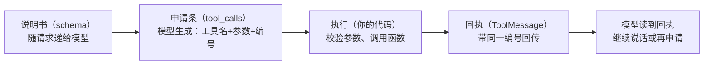
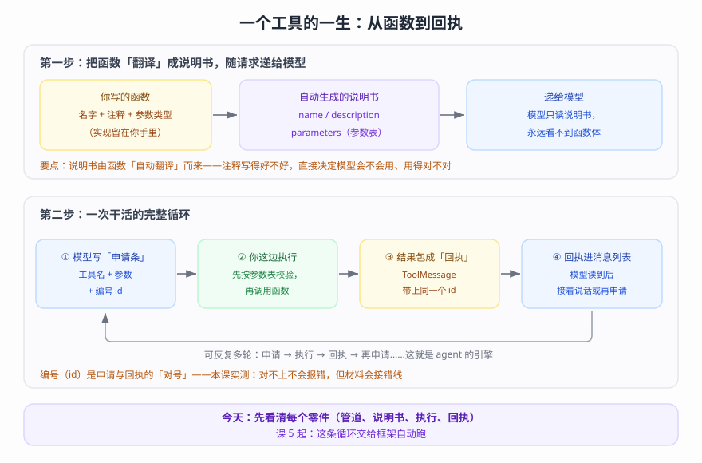

# 第 4 课：Tools 工具（让模型能干活）

> 所属阶段：阶段 2《Agent 核心》｜ 水平：进阶（有扎实 Python 与后端工程基础，LangChain 从零）｜ 本课知识点：工具机制原理、用 @tool 创建工具、工具进阶（上下文/动态选择/错误处理）、预置工具与 MCP
> 故事情节：故事进入动力层——给只会说话的主角装上"手脚"，这是 agent 能力的地基
> 📖 结论已按官方文档核对（核对于 2026-09 ｜ 来源：docs.langchain.com 的 tools / runtime / mcp 页；schema 自动生成、并行申请、错误兜底、自修正循环、动态工具集、MCP 直连与适配器接入等结论为本机实测）

## 🎯 本课目标

- 说清工具机制原理（模型不能执行任何东西——它只会"请求"，LangChain 负责执行与回传）
- 能用 @tool 创建带参数校验的自定义工具
- 掌握工具进阶能力（运行时上下文、动态选择、错误处理）与 MCP 工具接入

---

## 第一幕：起源与场景引入

> 🏛️ **起源**：2023 年 6 月，OpenAI 在 Chat API 中引入 function calling——模型第一次可以"结构化地提出请求"（而不是只会说一段话）；2024 年 11 月，Anthropic 提出并开源 MCP（Model Context Protocol），把"给模型接工具"从各家私有的适配工作变成开放标准。到今天，function calling 已是所有主流模型的标配能力，而 LangChain 用 `@tool` + `bind_tools` 把这一切统一到一套写法里（核对于 2026-09）。

客服助手第三次进化——这次要真干活了。

用户的问题变得具体："帮我查下订单 A1024 到哪了""这个月运费一共多少""提醒我明天上午给客户回电话"。助手一概答不上来——它能说会道（消息体系让它记台词、接话茬），但它**接不到你的订单系统、算不了账、也发不了提醒**。

你试过最原始的办法：每次用户问订单，你先自己去后台查好，再把结果粘贴给助手，让它"装作知道"。查一次、搬一次。问题一多，你自己成了人肉 ETL。

也想过一个激进方案：把数据库连接直接给它，让它自己想办法——赶紧打住。一个概率模型直接碰生产库？没人敢批这个方案。

> 🎬 **场景**：客服助手需要一个"手脚层"——把"你写好的、白名单内的函数"交到它手里，让它能自己查、自己算、自己提醒，但每一步都控制在你的程序里。

> 📌 **一句话本质**：把函数翻译成"说明书"递给模型读；模型只会写"申请条"，真正干活的永远是你的代码——它申请、你执行、把回执递回来。
>
> ⚖️ **处境对照**：不这么写——模型永远只能等你把数据喂到嘴边（人肉搬运）；或者冒险让它直接执行（不可控）。这么写——白名单化的受控动作 + 自动闭环；本课实测：模型在一次对话里自主完成了"申请调用分析工具 → 失败 → 阅读错误 → 换工具加载数据 → 重新分析 → 给出结论"的完整五步，全程不需要人介入（核对于 2026-09-15）。

---

## 第二幕：认知冲突

当你第一次看到文档里写"模型调用工具"，很容易脑补出一幅画面：模型伸出一只手，点了一下你的数据库。

这幅画面是错的。

> ❓ **问题**：模型到底怎么"调用"工具？既然它什么都执行不了，这套机制凭什么能跑通？

三个追问把真相逐层剥出来：

- 追问一：**模型"调用"工具时，到底发生了什么？**——它只是生成了一段结构化文本（工具名 + 参数 + 编号），叫"调用请求"。这段文本和它平时生成的话没有任何本质区别，都是 token。真正去执行函数的，是外层框架（LangChain）或你的代码。
- 追问二：**模型怎么知道有哪些工具可以用？**——你不告诉它，它就不知道。每个工具都要被"翻译"成说明书（schema：名字、用途、参数表），跟着每次请求一起递给它。工具不是"注册给模型"，而是"随请求出示"。
- 追问三：**为什么不干脆把数据库权限给它，让它直接干？**——两个原因叠在一起：① 模型只会生成 token，没有"手"——执行权从来不在它那里；② 这恰恰是安全边界：执行权留在你的进程里，才能做校验（参数是否合法）、审计（谁在什么时候调了什么）、限制（不想让它碰的事，干脆不给工具）。**给什么工具 = 给什么权限。**

由此得到一个贯穿全课的架构认知：**请求与执行分离**。模型负责"想和申请"（概率、灵活、不可控），你的代码负责"做"（确定性、可控、可审计）——两者之间用"说明书 + 申请条 + 回执"这三种结构化数据来接力。这不是缺陷，这是刻意的设计。

---

## 第三幕：层层揭示

### 一眼全局图（进入细节前先看一眼）


> 看图：左边是现状——"它只会说话"、"数据靠人肉搬运"；右边是本课的两条主线——"申请 + 跑腿"流程（它申请、你执行、回执递回）与安全底线（执行永远在你这边、工具集就是权限）；底部是总思路。

### 本课地图（分几步走）

| 步 | 这一步要解决什么（人话） | 对应知识点 |
|:--:|------------------------|-----------|
| 1 | 模型到底怎么"用"工具？一张申请条怎么变成结果 | 知识点 1：工具机制原理 |
| 2 | 怎么把函数写成"模型看得懂"的工具 | 知识点 2：用 @tool 创建工具 |
| 3 | 工具怎么拿到用户身份、带记忆、控权限、报错误 | 知识点 3：工具进阶（上下文/动态选择/错误处理） |
| 4 | 现成工具从哪来、MCP 是什么、还有哪些新形态 | 知识点 4：预置工具与 MCP |

### 知识点 1：工具机制原理

> 🧭 第 1/4 步｜承接：第二幕的追问"模型怎么'调用'、怎么知道有工具" → 本步：把"说明书 → 申请条 → 回执"三段式讲全，并跑一遍完整循环

#### 一句话定义

工具（Tool）= 给模型看的**说明书**（schema：名字、用途、参数表）+ 留给系统执行的**实现**（你的函数）；模型通过生成结构化的**调用请求**（`tool_calls`）来使用工具，执行与回传由 LangChain（你的代码）完成。

#### 直觉建立（类比）

餐厅点菜：**菜单**（说明书）递到客人手里，客人说"宫保鸡丁，不要辣，单号 07"（申请条：菜名 + 要求 + 编号）；**后厨**（你的代码）照单做菜；**服务员把菜端回**（回执）。客人从头到尾没进过厨房，也没碰过灶台——但他确实"点到了"一桌菜。

> 💡 **类比的边界**：客人可能点出错菜名（模型参数错误），后厨会拒单或退回（校验失败）；菜单上没有的菜，客人点不了（工具集 = 能力边界）。这些细节都在后文实测里。

#### 核心原理

**① 三段式接力**：



> 看图：给模型的那一份是"说明书"（名字、用途、参数表）；从模型出来的那一份是"申请条"；真正干活的箭头（执行）从来不穿过模型——它只在你的进程里发生。



> 看图（全景版）：上半部分——函数被"翻译"成说明书（名字/用途/参数表）递给模型，**函数体永远不交给它**；下半部分——四步循环（① 写申请条 → ② 你这边执行 → ③ 回执带编号 → ④ 回执进消息列表）与"编号配对"要点，后文逐段展开。

**② 说明书长什么样（给模型的最终形态）**：实测把工具转换成模型收到的格式（`convert_to_openai_tool`）：

```json
{
 "type": "function",
 "function": {
  "name": "get_user_preference",
  "description": "Get a user preference value.",
  "parameters": {"properties": {"pref_name": {"type": "string"}}, "required": ["pref_name"], "type": "object"}
 }
}
```

三个字段就是"说明书三件套"：`name`（叫什么）、`description`（干什么用、何时用）、`parameters`（要什么参数）。注意：**函数体不在里面**——模型永远看不到你的实现。

**③ 申请条长什么样（先有个印象，下一站细讲）**——本课实测（脚本 3 段）：

```text
问题: 帮我算 23*17 是多少
tool_calls: [{'name': 'calculator', 'args': {'expression': '23 * 17'}, 'id': 'call_9183199ed5964d08a0e5b730', 'type': 'tool_call'}]
```

模型读了 calculator 的说明书，生成了一条申请：调用 `calculator`，参数 `{'expression': '23 * 17'}`，编号 `call_9183...`。

**④ 一次可以申请多个**（parallel tool calls）——实测（脚本 4a 段）：问"北京和上海的天气分别怎么样？"，模型一次返回两条申请：

```text
tool_calls 数量: 2
  - get_weather args={"location": "北京", "units": "celsius", "include_forecast": false} id=call_b1661205bc8241d...
  - get_weather args={"location": "上海", "units": "celsius", "include_forecast": false} id=call_9b03a2dab8f14d3...
```

注意措辞：这是"一次申请两条"，不代表两条在并行执行——**执行节奏由你这边的代码决定**（你可以串行、也可以并发跑，官方甚至为并发写状态冲突准备了 reducer 机制，进阶话题）。

**⑤ 回执闭环——三家实验补全最后一块**：手动执行循环（实测 4b 段）：

```python
for tc in r1.tool_calls:
    tm = get_weather.invoke(tc)   # 把"申请条"整个交给工具：自动执行 + 自动包成 ToolMessage
```

```text
执行 北京 -> 返回类型: ToolMessage, tool_call_id 匹配: True
执行 上海 -> 返回类型: ToolMessage, tool_call_id 匹配: True
最终答复: 查询结果如下（摄氏温度）：- 北京：22°C - 上海：22°C 两地当前气温相同……
```

三行循环完成了"申请 → 执行 → 回执"，再把回执拼进消息列表递回去，模型就给出了终答。这就是一个最小 agent 的全部秘密——课 5 会看到，这整段循环框架会替你跑。

**⑥ 一个战略级提醒**（官方原意）：工具不是越多越好——工具过多会淹模型的上下文、增加选错概率；工具过少则能力受限。本课知识点 3 的"动态工具选择"就是为这件事准备的。

#### 示例演示

本节合计实测：模型选择工具（3 段）、一次两条申请（4a 段）、手动闭环出终答（4b 段）——三段输出均在上文引用，来源脚本 `playground/lesson-04-tools-lab.py`。

#### 常见误区

1. **以为"模型调用工具"= 模型执行了工具**：它只生成了申请条；执行发生在你的进程里（这是安全与审计的地基）。
2. **以为工具"注册一次就全局生效"**：说明书必须随请求递送——模型看不到说明书，就不知道工具有没有、怎么用。
3. **以为并行申请 = 并发执行**：申请可以一次多条；串行/并发是你代码的事。
4. **以为工具越多越强**：官方明确警告工具过多会淹上下文、增加出错——按场景给工具（知识点 3 展开）。

#### 一句话记住

> 模型只写申请条，代码才是手脚；说明书随请求递，回执带编号回。

#### 🗣️ 行话对照

- **tool calling / function calling（工具调用）**：模型生成结构化调用请求的能力——注意它不是"执行"，在哪遇到：官方文档、模型能力表
- **tool_calls（调用请求）**：AI 消息里携带的结构化申请（name/args/id）——在哪遇到：`message.tool_calls`、课 3 已见过雏形
- **bind_tools（绑定工具）**：把工具说明书接入模型请求——在哪遇到：`model.bind_tools([...])`、课 2/本课
- **parallel tool calls（并行调用请求）**：一次返回多条申请——在哪遇到：含"多城市/多条件"的提问实测

#### 官方文档

- [Tools（机制总览）](https://docs.langchain.com/oss/python/langchain/tools)
- [Models · Tool calling（绑定与调用流）](https://docs.langchain.com/oss/python/langchain/models)

---

### 知识点 2：用 @tool 创建工具

> 🧭 第 2/4 步｜承接：说明书是接力第一棒——它从哪来？怎么写得让模型看得懂？ → 本步：@tool 的自动翻译机制与写法规范
> 本知识点关键点：@tool 基本用法、docstring 与类型标注、参数校验与 schema（Pydantic / 简单类型）、保留参数名

#### 一句话定义

`@tool` 把普通 Python 函数变成"带说明书的工具"：**docstring → description**（模型选择工具的依据）；**类型标注 → 参数表**（模型生成参数、框架校验的依据）。

#### 直觉建立（类比）

给函数办一张"出国签证"：它要跨过"语言边界"去见模型，证件上必须有名字、用途、要什么材料——一项不全，签证官（这里是模型）就不知道该不该让它入境、该带什么行李。

> 💡 **类比的边界**：模型的"审核"完全基于说明书，不做背景调查——**说明书错了，模型就跟着错**（写了"查天气"的工具名却返回股票数据，模型会当真）。说明书质量 = 工具可用性。

#### 核心原理

**① docstring 是必填项**（实测）：不写 docstring 且未给 `description` 时，装饰器直接报错——

```text
无 docstring: ValueError | Function must have a docstring if description not provided.
```

**② 类型标注 → 参数表**（实测 1a 段）：`@tool def search_database(query: str, limit: int = 10)` 自动生成：

```json
"properties": {
  "query": {"title": "Query", "type": "string"},
  "limit": {"default": 10, "title": "Limit", "type": "integer"}
},
"required": ["query"]
```

有默认值的参数不进 `required`（可选）、参数名进参数表、类型进 `type`——**这就是模型看到的"要什么材料"**。反例（实测 1d 段）：不写类型标注不报错，但参数表里 `a`、`b` 没有任何类型信息——模型只能瞎猜格式，框架也无从校验。

**③ Args 段进不进参数表，取决于一个开关**（实测对比）：
- 默认（`parse_docstring=False`）：整个 docstring 作为工具描述，`Args:` 段的逐参数描述**不**进入参数表（1a 段实测：`query` 只有 `title` 和 `type`）；
- `@tool(parse_docstring=True)`：`Args:` 段的描述被解析进每个参数的 `description`（1b 段实测：`"query": {"description": "Search terms to look for", ...}`）——模型能看到每个参数的用途说明。

**④ 名字与描述都可以定制**（实测 1c 段）：`@tool("web_search")` 换名字（实测生效）、`@tool("calculator", description=...)` 覆写描述（**会替换掉 docstring 的角色**，实测生效）。

**⑤ 复杂参数表用 Pydantic**（实测 1e 段）：`args_schema=WeatherInput` 时：

```json
"units": {"default": "celsius", "description": "Temperature unit preference", "enum": ["celsius", "fahrenheit"], ...},
"required": ["location"]
```

`Field(description=...)` → 参数描述、`Literal[...]` → `enum` 取值清单（模型知道只能从这两个里选）、默认值 → `default`、非默认 → `required`。**约束越清楚，模型传错参数的概率越低**（校验失败详情见下节实测）。

**⑥ `runtime` 参数对模型隐藏**（实测 1f 段）：

```text
args_schema 字段（工具内部全貌，含注入参数）: ['runtime']
tool_call_schema 字段（模型看到的）: []
混合参数工具 get_user_preference，模型实际收到：
  "parameters": {"properties": {"pref_name": {"type": "string"}}, "required": ["pref_name"], "type": "object"}
```

同一个工具：函数签名里的 `runtime`（框架注入用）留在内部；发给模型的参数表里**只有** `pref_name`。这套"注入参数不进说明书"的机制，是知识点 3 上下文能力的基础。

**⑦ 保留参数名（踩坑实测）**：`config` 与 `runtime` 是保留名（官方）。实测把参数命名成 `config`：

```text
定义成功，调用报错: TypeError | needs_config() missing 1 required positional argument: 'config'
```

定义时不报错、运行时才炸——因为 `config` 参数会被框架当作"运行配置"截走，永远不会传给你的业务逻辑。**这是最容易在深夜调出来的那类 bug，起名时避开即可。**

**⑧ 命名规范**（官方警告）：工具名用小写 + 下划线（`web_search` 而不是 `Web Search`）——部分模型平台对含空格/特殊字符的名字会直接报错。

#### 示例演示

本节全部输出（1a-1g 段）来自脚本 `playground/lesson-04-tools-lab.py`，上文已引用关键段落。

#### 常见误区

1. **不写 docstring**：直接报错（实测），且说明书不能只有名字。
2. **忘记类型标注**：能跑，但参数表没有类型信息（实测）——模型传递格式全靠猜。
3. **写好了 `Args:` 段却没开 `parse_docstring`**：参数级描述静默不生效（实测对比）——写了等于没写。
4. **把描述写成实现笔记**："先用 pandas 读 csv 然后 groupby"——这是写给你自己看的；description 要写**用途与何时用**（给模型决策用）。
5. **踩保留名**：`config` / `runtime` 当业务参数名（实测：能定义、调用必炸）。

#### 一句话记住

> 写工具 = 写给模型的说明书；docstring 是"何时用我"，类型标注是"要什么参数"。

#### 🗣️ 行话对照

- **@tool / args_schema**：装饰器与参数结构（Pydantic 模型或 dict）——在哪遇到：`langchain.tools.tool`、工具定义
- **parse_docstring**：是否把 `Args:` 段解析进参数描述——在哪遇到：`@tool(parse_docstring=True)`、参数级描述不生效时排查
- **reserved names（保留名）**：`config`、`runtime` 不能当业务参数——在哪遇到：运行时报 `missing positional argument` 时排查
- **schema（说明书）**：name + description + parameters 三件套——在哪遇到：`tool.args_schema`、`tool.tool_call_schema`

#### 官方文档

- [Tools · Create tools（定义、属性定制、复杂 schema、保留名）](https://docs.langchain.com/oss/python/langchain/tools)

### 知识点 3：工具进阶

> 🧭 第 3/4 步｜承接：说明书会写了——但真实业务里工具不止"能查"：它要知道"为谁查"、能带记忆、要控权限、出错要能开口 → 本步：四项生产级能力
> 本知识点关键点：ToolRuntime（context 依赖注入 / state / store / 流写入器 / 执行与服务器信息）、返回值类型（字符串 / 对象 / Command）、动态工具选择、错误处理

#### 一句话定义

生产级工具的四项进阶能力：用 **ToolRuntime** 拿到"为谁执行"的上下文（身份/状态/长期记忆）、按场景选择**返回值类型**（字符串 / 对象 / Command）、用**动态工具集**控制权限边界、用**错误处理**让失败变成模型能读的消息。

#### 直觉建立（类比）

一位成熟的客服要过四关：看**工牌**知道正在服务谁（上下文注入）；翻**老档案**记得这位客人的偏好（长期记忆）；按职级拿**不同钥匙串**（权限边界）；说错话时有**补救话术**（错误处理）。四件都不难，但少一件都不能上岗。

> 💡 **类比的边界**：工牌是"系统发的"（每次调用时注入，不是工具自己去查）；钥匙串是"提前配好的"（工具集在创建 agent 时就定了）——不存在"临时申请权限"的机制。

#### 核心原理

**① ToolRuntime：工具的"信息面板"**

在函数签名里加 `runtime: ToolRuntime`（对模型隐藏，框架自动注入，知识点 2 已实测），即可访问：

| 组件 | 是什么 | 典型用途 |
|---|---|---|
| `state` | 本次对话的短期状态（消息列表、自定义字段） | 读对话历史、统计工具调用次数 |
| `context` | 每次调用传入的**不可变配置**（用户 ID、会话信息） | 按用户身份个性化——即"依赖注入" |
| `store` | 跨会话的**长期记忆**（需在 agent 侧配好 store） | 存用户偏好、知识库 |
| `stream_writer` | 工具执行中向前端发实时更新 | 长任务的进度条 |
| `execution_info` / `server_info` | 执行标识（线程/运行/重试次数）与服务器信息 | 可观测性、权限门禁 |
| `tool_call_id` | 本次调用的编号 | 日志关联、自建回执（见 ③） |

两个关键认知：

- **为什么是"注入"而不是"全局变量"**：官方定位是依赖注入（dependency injection）——同一份工具代码，谁在调用就拿到谁的身份（`runtime.context` 由每次 `agent.invoke(..., context=...)` 传入）；换成全局变量，多用户并发就串号，测试也没法造数据。
- **`context` 与 `thread_id` 的分工**（官方说明）：`thread_id` 圈定"这条对话线"的历史与存档；`context` 承载"这一次调用"的即时数据。生产用法是两者一起传。

**实测（脚本 6 段）**——同一位用户"小明"：

```text
6a. 问『我是谁』→ 你是 **小明**（用户 ID：user123）。……（工具内读 runtime.context + state + tool_call_id）
6b. 保存颜色 → 好的，已记住：你喜欢的颜色是**蓝色**（工具内 runtime.store.put 写入长期记忆）
6c. 新会话读取 → 你喜欢的颜色是：**蓝色**。（全新会话、无对话历史——靠 store 读回）
6d. 从外部直查存储桶: ('prefs',) user123 {'favorite_color': '蓝色'}
```

6c 是最能说明问题的一条：这次对话**没有任何历史消息**，模型能答"蓝色"的唯一通路就是 store——长期记忆（课 7 的主角）在工具层的雏形。

**② 返回值三型：字符串 / 对象 / Command**（实测）

- **字符串**：给人话结果（示例工具都是这一型）。
- **对象（dict）**：结构化结果，序列化后进回执——实测 7b 段，`delete_data` 返回 `{"deleted": True, "table": "orders", "rows": 128}`，模型收到的 ToolMessage 原文正是：

```text
[Tool 回执] {"deleted": true, "table": "orders", "rows": 128}
```

- **Command**：想**直接写 agent 状态**时用它——返回值里带状态变更，并自建一条 ToolMessage 作为回执（官方姿势）。实测 8 段：

```text
最终状态里的 user_name: 小明
   [AI 请求] set_user_name({"new_name": "小明"})
   [Tool 回执] 用户名已设置为 小明。   ← Command 里自带的 ToolMessage
   [ai] 好的，小明！您的用户名已经成功设置为「小明」了。
```

一个值得养成的习惯（官方提示）：状态字段被多个工具可能并发更新时，给它配一个 reducer（课 5/进阶再展开）。

**③ 动态工具选择：工具集就是权限边界**

官方给的两条路线：**过滤预注册工具**（工具都注册好，用中间件按权限/状态/特性开关在每次模型调用前筛掉一部分）或**运行时注册**（工具来自 MCP/远程仓库，边加边处理执行）。本课先用**简化版**把"边界"这件事跑通——直接给不同角色装配不同工具集。

**实测（脚本 7 段）**——同一个问题"请删除 orders 数据表里的全部数据"：

```text
7a. viewer（工具集只有 read_data）→ 我这边没法执行这个操作……我目前只有一个工具 read_data（只读），
    不具备 DELETE / TRUNCATE / DROP 等任何写入或删除能力。……（如实拒绝）
7b. admin（工具集含 delete_data）→ [AI 请求] delete_data({"table": "orders"}) → 执行成功：
    「已成功删除 orders 数据表中的全部数据，共清除 128 行记录。⚠️ 提醒：此操作不可恢复……」
7c. 用户确认后 → 模型先核实再答复：「无需重复执行——orders 表的删除操作已经在上一轮完成，
    当前核实结果为 0 行，数据已清空。」
```

注意 7a 的价值：**模型不会"硬闯"**——没有的工具它调不了，只能如实说不能。想让一个操作"从物理上不可能发生"，最硬的边界不是提示词，而是**不给工具**。（提示词可以被绕过，工具集不能。）

**④ 错误处理：让失败变成模型能读的消息**

先看**默认行为**（实测 5b-1 段）：让模型调用一个必然失败的工具——

```text
5b-1 默认行为：agent 直接崩溃 → ValueError | 分析失败：尚未加载数据集。先调用 load_dataset（可试用 name='demo'）再重试。
```

崩溃的原因是：**工具抛出的业务异常默认直接向上冒泡**（官方注释："Exceptions propagate unless handle_tool_errors is configured"）——异常没有变成消息递回给模型，整条运行被迫中断。**"模型会自己重试"是个误解**；它重试的前提，是错误以回执的形式回到它手里。

**标准做法**（官方工具页给出的姿势）：用 `wrap_tool_call` 中间件把异常转成 ToolMessage——

```python
@wrap_tool_call
def handle_tool_errors(request, handler):
    try:
        return handler(request)
    except Exception as e:
        return ToolMessage(
            content=f"Tool error: Please check your input and try again. ({e})",
            tool_call_id=request.tool_call["id"],
        )
```

**实测（5b-2 段）**，同一个问题"帮我看看数据集的整体情况"，加上中间件之后——完整链路：

```text
[human] 帮我看看数据集的整体情况
[AI 请求] analyze({})
[Tool 回执] Tool error: Please check your input and try again. (分析失败：尚未加载数据集。先调用 load_dataset（可试用 name='demo'）再重试。)
[AI 请求] load_dataset({"name": "demo"})
[Tool 回执] 数据集 demo 已加载，共 1000 行。
[AI 请求] analyze({})
[Tool 回执] 数据集 demo：共 1000 行，平均分 87.5，无缺失值。
[ai] 数据集 demo 的整体情况如下：……（终答）
```

四步"出错 → 读错误 → 换路 → 成功"全自动完成。这条链路上有两个设计要点：

- **错误消息要写给"下一步"**：我们的消息包含"先调用 load_dataset（可试用 name='demo'）"——模型照着做了。只说"失败了"的错误消息，会让模型卡在原地。
- **不要把内部细节写进错误**（密钥、堆栈、表结构）——消息会进入对话与日志。

工程惯例（经验补充）：**预期内**的错误（参数不合法、资源不存在）可以在工具内 `try/except` 处理后返回说明性字符串；**意外异常**（代码 bug、依赖故障）建议交给中间件统一兜底（转换、重试策略等）——中间件是课 8 的主角，今天只认识它这一副面孔。

#### 示例演示

本节实测覆盖：runtime 三件套（6 段）、返回值三型（7b/8 段）、权限边界（7a/b/c 段）、错误兜底与自修正（5b 段）。脚本：`playground/lesson-04-tools-lab.py`。

#### 常见误区

1. **用全局变量传用户身份**：多用户并发必串号；`runtime.context` 是官方答案（依赖注入，还可测试）。
2. **以为"模型会重试失败的工具"**：默认它压根收不到错误（异常冒泡打断运行）；错误转成消息递回它，它才会修正（5b 实测对照）。
3. **用提示词管权限**："不要删数据"挡不住任何事（prompt 可被绕过）；**工具集才是硬边界**（7a 实测）。
4. **把内部信息塞进返回值/错误消息**：返回值和错误消息都会作为文本进入对话（可能被用户看到、被日志留存）。
5. **忽略并发写状态**：多个工具并发改同一状态字段时，用 reducer 定义合并规则（官方提示）。

#### 一句话记住

> 上下文走 runtime（注入不全局）、权限靠工具集（不给就没有）、错误变消息（模型才能修正）。

#### 🗣️ 行话对照

- **ToolRuntime / runtime.context**：工具内的运行时信息面板与注入配置——在哪遇到：`runtime: ToolRuntime`、依赖注入
- **store（长期记忆）**：跨会话持久化，namespace/key 组织——在哪遇到：`runtime.store.put/get`、课 7
- **wrap_tool_call（中间件）**：包裹工具执行的钩子（错误转换、重试、审计）——在哪遇到：本课错误兜底、课 8 系统展开
- **Command**：工具的"状态写入"返回值——在哪遇到：`from langgraph.types import Command`
- **reducer**：并发状态更新的合并规则——在哪遇到：官方 state 文档、进阶话题

#### 官方文档

- [Tools · Access context / Tool execution / Dynamic tool selection](https://docs.langchain.com/oss/python/langchain/tools)
- [Runtime（上下文与依赖注入）](https://docs.langchain.com/oss/python/langchain/runtime)

---

### 知识点 4：预置工具与 MCP

> 🧭 第 4/4 步｜承接：自己写工具会了——但世界上已有大量造好的工具，还有一个不绑定任何框架的标准 → 本步：生态接入的四种形态
> 本知识点关键点：prebuilt tools、MCP 服务器接入、server-side tool use、headless tools

#### 一句话定义

工具的四个来源/形态：**自己写**（@tool）、**现成的**（prebuilt 工具包）、**标准协议接入的**（MCP 服务器）、**厂商内置的**（server-side tools）；再加一种前沿形态——**定义在服务端、执行在客户端**（headless tools）。

#### 直觉建立（类比）

布置一间厨房：自制家具（@tool）、买现成的（prebuilt）、用**标准插座**接任何电器（MCP 协议）；还有两种"特殊装置"——燃气公司直接替你烧好的菜（服务端工具），和"遥控机器人"（headless：指令从这头发，动作在别处做）。

> 💡 **类比的边界**：这些形态**接入后没有区别**——转成 LangChain 工具后，agent 一视同仁地"读说明书、写申请条"；差异只在于"谁提供、在哪里执行"。

#### 核心原理

**① prebuilt（现成工具包）**：官方 Integrations 页收录了大量开箱工具（网页搜索、代码解释器、数据库、办公套件等，按分类整理）。它们本身就是 LangChain 工具，接入方式与自定义工具**完全一致**（放进 `tools=[...]` 即可）。本课不逐一安装实测（装包成本），但"接入方式相同"是由其设计（统一 BaseTool 接口）保证的。

**② MCP：工具生态的"标准插座"**。MCP（Model Context Protocol）是一个开放协议，规定"工具服务器"如何把能力暴露给"客户端"（任何 AI 应用）。链路是：服务器暴露工具清单 → 客户端连接、发现、转换 → 当作普通工具使用。

本课**直连实测**（不装任何 MCP 依赖，用普通 HTTP 手写 JSON-RPC，脚本 `lesson-04-mcp-lab.py` A 段）——直连官方文档服务器 `https://docs.langchain.com/mcp`：

```text
1) initialize -> 200 | session: （无）
   服务器: {"name": "Docs by LangChain", "version": "1.0.0"}
   协议版本: 2025-06-18

2) tools/list -> 3 个工具:
   - search_docs_by_lang_chain: Search across the Docs by LangChain knowledge base…
   - query_docs_filesystem_docs_by_lang_chain: Run a read-only shell-like query…
   - submit_feedback: Report a problem with this documentation site…

3) tools/call(search_docs_by_lang_chain) -> 返回 1368 字符，节选:
   Title: Create a tool / Link: https://docs.langchain.com/langsmith/smith-api/tools/create-a-tool / …
```

这段"裸链"输出值得记住：MCP 的底层就是**握手（initialize）→ 列清单（tools/list）→ 调用（tools/call）**的 JSON-RPC 对话——LangChain 的 `MCPAdapter` 就是把这三步封装成一行代码。

**③ LangChain 侧接入（MCPAdapter）**——官方写法：

```python
from langchain.mcp import MCPAdapter

async with MCPAdapter("https://example.com/mcp") as adapter:
    tools = await adapter.list_tools()
    agent = create_agent(model, tools)
```

两个工程注意点（官方原文）：依赖 `langchain[mcp]`（底层是 FastMCP），命名空间目前是 **beta**（导入即收到 beta 警告、API 可能变化）；连接目标可以是 http 地址、本地脚本（stdio 子进程）、内存内 FastMCP 实例等，适配器自动识别传输方式。

> ✅ **实测（2026-09-15 补测）**：安装 `langchain[mcp]`（fastmcp 4.0.3）后运行脚本 B 段——适配器把服务器的 3 个工具原样转成 LangChain 工具，agent 经 MCP 工具完成检索并给出带文档引用的回答：

```text
适配器把服务器工具转成了 3 个 LangChain 工具:
   - search_docs_by_lang_chain
   - query_docs_filesystem_docs_by_lang_chain
   - submit_feedback
agent（经 MCP 工具）回答: 最佳实践是把工具描述当作提示词来做：提供清晰（snake_case）的名称、在描述中说明工具做什么以及何时使用，
并为每个参数写明确的名称和描述，以此引导模型正确决定何时、如何调用该工具（详见工具定义与 Tool prompts 文档）……
```

beta 状态同步实测：导入 `langchain.mcp` 时进程收到一次 `LangChainBetaWarning`——"beta 可能变化"不只是文档声明，连警告都是真的（原样收录）。

**④ server-side tool use（服务端工具）**：部分厂商在模型服务端内置了工具（网页搜索、代码解释器等），启用后由**厂商侧执行**、不占你的进程。写法取决于具体平台（官方建议查对应 provider 页）。本课环境（百炼兼容接口）未提供此类内置工具——**本课未实测**，按平台文档使用。

**⑤ headless tools（无头工具）**：工具的**定义**（名字/描述/参数表）注册在服务端，**实现**只存在于客户端（典型是浏览器），执行前通过"中断 → 客户端执行 → 恢复"握手完成；适用于依赖设备环境的能力（定位、剪贴板、本地文件）与隐私敏感场景（数据不出设备）。**本机实测**（脚本 C 段）：当前安装的 langchain 1.4.0 **尚未包含**该 API——

```text
tool('name', description=...) 返回: function        ← 返回的是装饰器工厂，不是 HeadlessTool
tool(name=...) 报错: TypeError | tool() got an unexpected keyword argument 'name'
```

官方文档已收录该特性（文档先行于发行版）。这是个健康的习惯示范：**文档写了 ≠ 你的版本有**——动手前先 `实测 API 是否存在`。

#### 示例演示

见上文实测（裸链、适配器接入、headless 状态），来源脚本 `playground/lesson-04-mcp-lab.py`。

#### 常见误区

1. **以为 MCP 是某家私有协议**：它是开放标准——任何客户端可连任何服务器（本课用一个"非 LangChain 阵营"的普通 HTTP 直连就验证了这点）。
2. **以为接 MCP 要手写适配**：裸链的三步（握手/列表/调用）正是 `MCPAdapter` 替你做的；你只需要 `list_tools()`。
3. **以为服务端工具人人有**：取决于平台与模型（有的没有）；用之前先查 provider 页与实测。
4. **忽略 beta/版本现实**：`langchain.mcp` 是 beta；headless 在本机版本还不存在——**以实测为准，不以文档为想当然**。

#### 一句话记住

> 工具生态三条路：自己写、买现成、插标准插座（MCP）；接进来之后，一视同仁。

#### 🗣️ 行话对照

- **MCP / MCP server**：开放协议与其上的工具服务器——在哪遇到：`docs.langchain.com/mcp`、各类 MCP 市场
- **MCPAdapter / list_tools()**：LangChain 侧适配器与发现接口——在哪遇到：`langchain.mcp`（beta）
- **server-side tools**：厂商在服务端执行的工具——在哪遇到：各家 provider 文档的 "built-in tools"
- **headless tools**：schema 在服务端、实现在客户端——在哪遇到：官方 frontend/headless-tools 页（新特性）

#### 官方文档

- [Tools · Prebuilt tools / MCP servers / Server-side tool use](https://docs.langchain.com/oss/python/langchain/tools)
- [Model Context Protocol (MCP)](https://docs.langchain.com/oss/python/langchain/mcp)

---

## 第四幕：实操验证

回到第一幕：给客服助手装上"手脚"。整合本课四站——从定义工具（K2）到请求闭环（K1），再到上下文与权限（K3），最后看一眼生态（K4）。以下六项验证全部本机跑通（脚本：`playground/lesson-04-tools-lab.py`、`playground/lesson-04-mcp-lab.py`）：

1. **说明书生效**：模型读 description 后选对工具——问"23*17"，它选中 `calculator` 而非 `search_database`，参数 `{'expression': '23 * 17'}`。
2. **闭环跑通**：一次问出两条申请（北京/上海），手动循环执行、拼回回执，模型给出双城终答。
3. **出错能救回来**：默认配置下工具异常让 agent 崩溃；一行中间件转换后，同一问题自动完成"出错 → 读错误 → 加载数据 → 重试成功"四步。
4. **知道"为谁服务"**：`runtime.context` 注入用户身份（小明/user123）；`runtime.store` 写入偏好后，**全新会话**仍能读回"蓝色"。
5. **权限边界真实存在**：viewer 工具集下模型如实拒绝删除请求；admin 工具集下真的执行成功（含 dict 回执与后续核实）。
6. **生态直连**：手写 JSON-RPC 完成 MCP 三连（握手 → 工具清单 → 真实调用返回 1368 字符）；安装 `langchain[mcp]` 后，`MCPAdapter` 把 3 个工具接入 agent 并实测调用成功（agent 引用官方文档作答）。

> ✅ **回扣场景**：第一幕的三个需求都有了着落——"查订单/算账/提醒"= 三个白名单工具（它们拿到 `runtime.context` 里的用户身份）；"不敢让它碰生产库"= 工具集就是权限（viewer 连删的选项都没有）；第一幕担心的"人肉搬运"= 申请→执行→回执的自动闭环。
>
> ⚠️ 数值说明：以上为 2026-09-15 本机实测；模型措辞与参数写法会有浮动（同一问题两次运行分别出现过 `23 * 17` 与 `23*17` 两种参数写法，属正常）。

---

## 第五幕：体系收束

> 📍 **全局定位**：工具是 agent 的"手脚"，本课的四件事会在后面每一站复现——
> - **课 5（Agents）**：今天手写的三段循环（申请 → 执行 → 回执）将交给 `create_agent` 自动跑；重点变成"引擎内部怎么转、怎么停"。
> - **课 6（Streaming）**：申请条是**逐字**生成的（`tool_call_chunks`），流式里能实时看到"它在写申请"。
> - **课 8（Middleware）**：错误处理的系统化归宿——重试策略、动态工具过滤都在那里展开（今天只用到了它的一副面孔）。
> - **课 10（人机协同）**：高危工具（如 delete_data）的"人类确认"将从"模型自觉询问"升级为系统级中断审批。
> - **课 11（RAG）**：检索器就是一种特殊工具——"查资料"的申请与回执。
>
> 🔗 **下一步**：课 5《Agents 智能体核心》——"申请→执行→回执"的循环为什么是一切 agent 的引擎；把今天手动拼装的每个零件交给框架，并拆开 `create_agent` 看它如何自动转起来。

---

## 🐞 常见误区

1. **以为"模型调用工具"是模型执行了工具**：它只生成申请条；执行永远在你的进程里（安全与审计的地基）。
2. **以为模型会自动重试失败的工具调用**：默认异常直接冒泡打断运行（实测崩溃）；要它自我修正，必须先让错误"变成消息"递回（中间件转换实测）。
3. **以为提示词能管权限**：能拦住它的不是措辞而是工具集——没给的工具，它调不了（viewer 实测）。
4. **以为"文档有 = 我能用"**：headless 工具文档已收录、本机版本尚无该 API（实测）；MCP 适配器依赖 `langchain[mcp]`——动手前先验证环境。
5. **把内部信息（密钥/堆栈/表结构）写进返回值或错误消息**：这些文本会进入对话与日志。

### ⏳ 与过时说法对照（写前核对 + 实测发现的差异）

| 旧说法（网上教程 / 直觉） | 现状（官方文档 + 本课实测） | 依据 |
|---|---|---|
| "function calling 是 OpenAI 的独有功能" | 已是跨厂商标准；LangChain 用 `bind_tools` / `@tool` 统一，本课在百炼链路上全部实测通过 | tools / models 页 + 实测 |
| "工具报错时 agent 会自动重试" | 默认**不兜底**：业务异常直接冒泡、打断运行（实测崩溃）；转成消息递回后模型才会修正——这是你（用中间件）配置的行为 | 实测 5b + 源码注释 |
| "工具的返回值只能是字符串" | 字符串 / dict / Command 三型均可；dict 会序列化进回执、Command 可写状态（均实测） | tools 页 + 实测 7b/8 |
| "MCP 是某家厂商的私有协议" | 开放标准：普通 HTTP 手写 JSON-RPC 即可直连服务器（实测 3 连），与 LangChain 无强绑定 | mcp 页 + 裸链实测 |
| "模型记住有哪些工具" | 说明书随每次请求递送；没递就没有（"消息列表 = 全部输入"的延伸） | tools 页 + 实测 1f |

## 一图总结


> 看图：四张卡片对应本课四件事（机制原理 / 写好工具 / 进阶四件套 / 生态接入）；底部是贯穿全课的链路——定义 → 绑定 → 申请 → 执行 → 回执 → 总结；下一课让这条链路自动转起来。

## 课后小测

**Q1**："模型调用工具"的本质是什么？
- A. 模型通过网络直接访问工具服务
- B. 模型生成结构化的调用请求（工具名 + 参数 + 编号），由外层代码真正执行
- C. 工具被"注册"进模型参数里，模型内部保存一份副本
- D. 模型直接执行工具函数，但需要用户授权

<details><summary>答案与解析</summary>

**答案：B**。模型只会生成 token（申请条）；执行发生在你的进程里。这也是"给什么工具 = 给什么权限"的由来——执行权从来不在模型手里。

</details>

**Q2**：工具在执行中抛出业务异常（如"数据未加载"），默认会发生什么？想让模型据此自我修正要做什么？
- A. 默认自动重试三次；什么都不用做
- B. 默认把异常塞进回执；模型天然可见
- C. 默认异常冒泡、打断运行；用 `wrap_tool_call` 中间件把异常转成 ToolMessage 递回，模型才会修正
- D. 默认静默忽略；修不修正看运气

<details><summary>答案与解析</summary>

**答案：C**。本课实测：默认直接崩溃；加官方姿势的中间件后，模型完成"出错 → 读错误 → 换路 → 成功"全自动修正。要点：错误必须"变成消息"，模型才能看到。

</details>

**Q3**：关于动态工具选择（权限边界），哪种说法正确？
- A. 只要提示词写得足够严厉，模型就不会调用危险工具
- B. 没给模型的工具它无法调用——工具集就是硬边界（viewer 实测只能如实拒绝）
- C. 工具必须一次性全注册，无权按角色裁剪
- D. 模型会自动拒绝高危操作，无需工程手段

<details><summary>答案与解析</summary>

**答案：B**。实测：viewer 工具集（只有 read_data）下模型无法删除任何数据，只能如实说明能力边界；admin 工具集（含 delete_data）下才真正执行。提示词是软约束、可被绕过；工具集是硬边界。

</details>

## 🚀 下一批接力提示词

> 学完本课后，**复制下面这段文字发给 AI**，即可无缝进入下一课（无需重新描述上下文）：

```text
继续学 LangChain。我的学习档案在 langchain/langchain/00-学习档案.md，
刚学完阶段 2《Agent 核心》的课 4《Tools 工具》全部知识点
（工具机制原理、用 @tool 创建工具、工具进阶（上下文/动态选择/错误处理）、预置工具与 MCP），
请按大纲继续讲解课 5《Agents 智能体核心》的知识点。
```

## 🧭 课程导航

⬅️ **上一课**：[课 3：Messages 消息体系（模型的标准语言）](../../1-入门与模型层/lessons/lesson-03-Messages消息体系.md)

➡️ **下一课**：[课 5：Agents 智能体核心](lesson-05-Agents智能体核心.md)

📚 **返回目录**：[课程目录](../../../02-课程目录.md)
