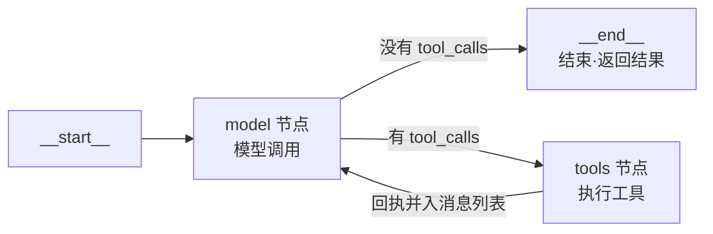
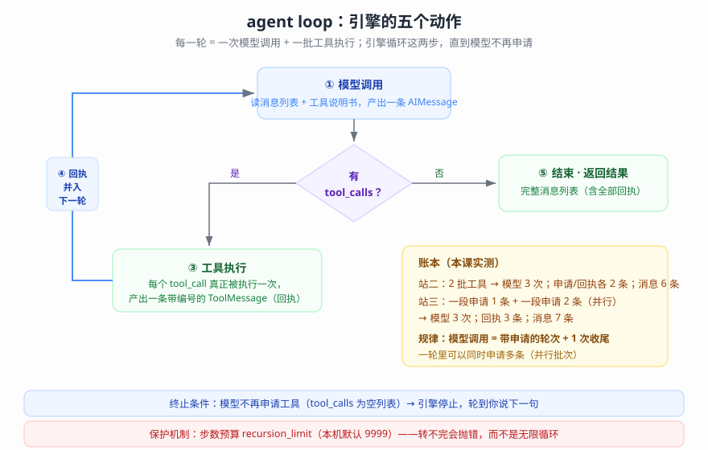

# 第 5 课：Agents 智能体核心（让循环自己转起来）

> 所属阶段：阶段 2《Agent 核心》｜ 水平：进阶（有扎实 Python 与后端工程基础，LangChain 从零）｜ 本课知识点：create_agent 深入、调用与结果解读、harness 配置实践
> 故事情节：故事进入引擎室——上一课装好的「手脚」交给引擎自动运转：循环自己转、结果可解读、配置出边界
> 📖 结论已按官方文档核对（核对于 2026-09 ｜ 来源：docs.langchain.com 的 agents / structured-output / runtime / models / middleware 页；loop 内部结构、账本、终止与预算保护、结构化输出实况（含 thinking 适配与重试）、动态路由等结论为本机实测）

## 🎯 本课目标

- 说清 agent loop 内部流程与 create_agent 参数全景（「引擎怎么转」）
- 读懂 invoke 的输入输出与消息流转；能输出结构化 JSON（「结果怎么读」）
- 能配置 system_prompt、动态选择模型（「harness 怎么配」）

---

## 第一幕：起源与场景引入

> 🏛️ **起源**：2022 年 10 月，论文 ReAct（Reasoning + Acting）提出「推理—行动」交替循环——模型先写出一步推理，执行一个动作，观察结果，再推理下一步。这是 agent loop 在学术层面的起点。2023 年 6 月 function calling 让「行动」标准化（课 4 讲过）；到 2025 年 LangChain v1.0，这套循环被收敛成唯一入口 `create_agent`——「循环」从你要写的代码，变成了框架内置的引擎（核对于 2026-09）。

客服助手第四次进化。上一课你给它装好了「手脚」——三个白名单工具，申请 → 执行 → 回执的闭环也跑通了。但跑通之后你开始加班。

因为那段**循环控制代码越长越吓人**：用户问一句要转几圈，你说了不算（得盯着模型想不想继续）；它一次申请两条工具你得按顺序执行；工具出错要兜、转太多圈要刹车、下次对话还得接上上次的记忆……三行 demo 出去，回来的是三百行"胶水"。

你甚至开始怀疑：这些活，是不是**不该由业务代码来干**？

> 🎬 **场景**：把手写的循环「骨架」整个删掉——换成一行组装（模型 + 工具 + 提示词），让引擎去负责转圈、判断、刹车。你要做的是三件事：看懂它怎么转、读懂它给你什么、配好它周围的边界。

> 📌 **一句话本质**：agent = 模型在一个循环里调用工具，直到任务完成（官方原话：*An agent is a model calling tools in a loop until a given task is complete*）；而 harness = 循环之外的一切（提示词、工具、中间件）——`create_agent` 就是一个高度可配置的 harness（核对于 2026-09）。
>
> ⚖️ **处境对照**：不这么写——每上一个新任务都重写一遍循环骨架，判断/兜错/预算全手工（累且易错）。这么写——循环交给引擎，边界交给配置；本课实测：同一个 agent 在三站任务里分别转出 0、2、3 条工具申请，全程零循环代码（核对于 2026-09-15）。

---

## 第二幕：认知冲突

第一次听到"框架会自动跑循环"，很容易把它想象成一个**黑盒魔法**：你在外面递一句话，里面"嗡"地转一阵，吐出一个答案。

这个想象有一半是错的。

它不是魔法——**它就是把你上一课手写的那段循环，搬进了框架内部自动化**。搬进去的东西一点也不神秘：连"什么时候停"都是同一个判断（模型有没有申请工具）。

> ❓ **问题**：引擎里到底发生了什么？它凭什么能自己转、自己停——如果停不下来呢？

三个追问把这件事拆开：

- 追问一：**"自动转"自动的到底是什么？**——把课 4 的「申请条 → 执行 → 回执」三段式变成引擎内部的流水线：模型调用 → 判断 → 工具执行 → 回执并入 → 再转（本课实测：这一流程在引擎里就是两个节点 `model` / `tools` 加几条条件边（按条件决定走哪条）连成的环——拆开引擎的图，一眼看穿）。
- 追问二：**它转几圈、什么时候停，谁说了算？**——不是你说的，也不是引擎"猜"的：每一轮转完，引擎只看一件事——模型这条回复里有没有 `tool_calls`。有，继续转；没有（空列表），结束。任务需要几圈就转几圈。
- 追问三：**万一转不完呢（模型永远在申请）？**——引擎带**步数预算**（`recursion_limit`）。预算耗尽直接抛错停机——宁可报错，绝不死循环。这是一个你几乎注意不到、但不能没有的安全带。

由此得到本课的第一个关键认知：**循环不是黑盒魔法，而是可拆开、可记账、可设预算的流水线**。可拆开——图结构只有两个节点；可记账——"模型调用次数 = 申请消息条数 + 1 次收尾"；可设预算——超预算抛错（本课实测：把预算压到 4，两圈任务立刻报 `GraphRecursionError`）。

---

## 第三幕：层层揭示

### 一眼全局图（进入细节前先看一眼）


> 看图：左边是上一课的状态——循环是你手写的、判断是你人肉的、刹车根本没有；右边是本课——引擎自动转，你负责配边界；底部是总思路：本课三站（引擎怎么转 → 结果怎么读 → harness 怎么配）。

### 本课地图（分几步走）

| 步 | 这一步要解决什么（人话） | 对应知识点 |
|:--:|------------------------|-----------|
| 1 | 引擎内部的流水线长什么样、转几圈谁决定、怎么刹车 | 知识点 1：create_agent 深入 |
| 2 | invoke 该给什么、返回什么、怎么把结果变成程序能用的数据 | 知识点 2：调用与结果解读 |
| 3 | 提示词怎么配、模型怎么换、harness 还能扩展什么 | 知识点 3：harness 配置实践 |

### 知识点 1：create_agent 深入

> 🧭 第 1/3 步｜承接：第二幕的追问「自动的到底是什么、怎么停、怎么刹车」 → 本步：拆开引擎看流水线，跑三站任务记一次账

#### 一句话定义

`create_agent(model=, tools=, system_prompt=, ...)` 组装出一个**自带循环的 agent**：它反复执行「模型调用 → 判断 → 工具执行 → 回执并入」，直到某次模型调用不再申请工具为止；循环之外的一切（提示词、工具、中间件）合称 harness。

#### 直觉建立（类比）

洗衣机：你负责装衣、放水、按开始（组装 harness：模型 + 工具 + 提示词）；它负责一遍遍"洗涤 → 排水 → 进水 → 再洗"（循环），直到传感器说"洗干净了"（模型不再申请工具）才停。你不需要在洗衣机里站着搅水——正如你不需要亲手写那三段循环。

> 💡 **类比的边界**：洗衣机的程序是固定的，agent 的"几圈"是当场的——任务复杂就多转，简单就少转（本课实测：简单问题 0 条申请、查账任务 2 条申请、多步任务 3 条申请含并行）；这属于 agent 的特长（自适应），也意味着**你无法 100% 预编排它的步数**——所以需要预算保护。

#### 核心原理

**① 引擎内部的流水线（拆开看）**——实测把 agent 编译后的图打印出来（脚本 1b 段，`agent.get_graph()`）：

```text
节点清单: __start__ / model / tools / __end__

边清单:
  __start__ -> model          （进入引擎）
  model -> __end__ （条件边）  （没有工具申请 → 结束）
  model -> tools （条件边）    （有工具申请 → 去执行）
  tools -> model （条件边）    （回执并入 → 回到模型）
```



> 看图：整个引擎只有两个干活的节点——`model`（模型调用）和 `tools`（工具执行），外加进入和结束两个哨兵节点。**四个箭头里有三个是条件边**：走哪条，由"模型这条回复里有没有 tool_calls"决定。你看——课 4 你手写的那段循环，在引擎里就是 `model → tools → model` 这个环。



> 看图（全景版）：五动作流转（模型调用 → 判断 → 工具执行 → 回执并入 → 再转）；右下是账本（本课实测数据）；底部两条横幅——终止条件与预算保护，后文各有一段。

**② 三站任务，跑一遍记一次账**——同一个模式（模型 + 工具）配三种任务难度，实测的完整消息链（脚本 2 段）：

```text
站一（无工具·干脆直接答）：问"什么是 agent loop"
  [0] human: 请用一句话说明什么是 agent loop。
  [1] ai: Agent loop 是智能体不断执行“感知环境、推理决策、调用工具/采取行动、观察结果”的循环过程，直到完成目标。
  [账本] 模型被调用 1 次；工具申请 0 条；工具回执 0 条；消息共 2 条

站二（两条申请·查账）：问"订单 A1024 一共要付多少钱（含运费）"
  [0] human: 帮我算下订单 A1024 一共要付多少钱（含运费）
  [1] AI 请求: get_order({"order_id": "A1024"})
  [2] tool: 订单 A1024：机械键盘 x2，单价 349 元；运费 12 元
  [3] AI 请求: calculator({"expression": "349 * 2 + 12"})
  [4] tool: 710
  [5] ai: 订单 A1024 应付 **710 元**。……
  [账本] 模型被调用 3 次；工具申请 2 条；工具回执 2 条；消息共 6 条

站三（多步任务·查账 + 设提醒）：
  [0] human: 帮我算下订单 A1024 总共多少钱，算完再设一个明天上午 10 点的提醒：给客户回电话
  [1] AI 请求: get_order({"order_id": "A1024"})
  [1] AI 请求: set_reminder({"content": "给客户回电话", "when": "明天上午10点"})
  [2] tool: 订单 A1024：机械键盘 x2，单价 349 元；运费 12 元
  [3] tool: 已设置提醒 [明天上午10点]：给客户回电话
  [4] AI 请求: calculator({"expression": "349 * 2 + 12"})
  [5] tool: 710
  [6] ai: 订单 A1024 明细如下：……另外，提醒已设好：明天上午 10 点「给客户回电话」。
  [账本] 模型被调用 3 次；工具申请 3 条；工具回执 3 条；消息共 7 条
```

三站连起来看，账本规律就出来了（注意"申请消息"与"申请条数"是两回事——一条 AI 消息里可以装多个申请）：

- **模型调用次数 = 申请消息条数 + 1 次收尾**（站二：2 条申请消息 + 1 收尾 = 3 次；站三：消息 [1] 装 2 个申请、消息 [4] 装 1 个申请 = 2 条申请消息 + 1 收尾 = 3 次）。
- **一轮里可以同时申请多条**（站三消息 [1] 同时申请了 `get_order` 与 `set_reminder` 两个工具——模型自己判断"查单"与"设提醒"没有依赖，一起申请；而"算账"依赖查单的结果，它自觉放到了下一轮）。
- **消息条数 = 1（人的话）+ 申请消息条数 + 回执条数 + 1（终答）**（站二：1+2+2+1=6；站三：1+2+3+1=7）。

> ⚠️ 数值说明：以上为 2026-09-15 本机实测。同一任务三次运行出现过三种节奏——"查账 → 算账 → 设提醒"三批串行（模型调用 4 次）、"查账 → （算账 + 设提醒）并行"、"（查账 + 设提醒）并行 → 算账"（后两次模型调用均 3 次）。**模型措辞、参数写法、申请节奏都会有浮动，属正常**——这也解释了为什么"预编排步数"不可行。（课 4 也见过类似现象：`23 * 17` 与 `23*17` 两种参数写法。）

**③ 怎么停（终止条件）**——实测站三返回后的最后一条消息（脚本 2d 段）：

```text
最后一条消息类型: AIMessage
最后一条消息 tool_calls: []
```

引擎的"停"就是这么朴素：它每次转完检查一遍——模型这条回复的 `tool_calls` 是不是空列表。**空 → 停**（这条 AIMessage 就是交给你的终答）；**非空 → 继续转**。所以"任务完成"的定义，实际上是"模型自己认为不用再申请了"。

**④ 刹车（步数预算）**——如果模型判断错了、或者任务本身就是无底洞呢？实测把同一条任务的预算压到 4（脚本 5 段）：

```text
触发 → GraphRecursionError | Recursion limit of 4 reached without hitting a stop condition.
You can increase the limit by setting the `recursion_limit` config key.
```

报错信息说得很直白：**在没碰到停止条件的情况下，预算（4 步）用完了**。每一步都消耗预算——模型调用、工具执行各算一步。本机版本的默认预算是 `create_agent` 源码里写的 9999（源码注释：*Set recursion limit to 9_999*）——日常任务根本用不到，但"预算耗尽就报错"这条纪律一直在。

**⑤ 参数全景（15 个）**——实测 `inspect.signature(create_agent)` 拿到的本机版本全貌：

| 分组 | 参数 | 干什么 | 本课/后续在哪展开 |
|------|------|--------|------------------|
| 核心三件 | `model` | 模型（字符串 `"provider:model"` 或实例） | 课 2（两种初始化） |
| 核心三件 | `tools` | 工具列表（可调用对象 / @tool / 字典） | 课 4 |
| 核心三件 | `system_prompt` | 系统提示词（字符串或 SystemMessage） | 本课知识点 3 |
| 结果塑形 | `response_format` | 结构化输出 schema | 本课知识点 2 |
| 结果塑形 | `state_schema` / `context_schema` | 自定义状态 / 运行上下文的数据形状 | 课 7 / 课 9 |
| 循环扩展 | `middleware` | 中间件（钩子进循环） | 本课知识点 3 露脸、课 8 展开 |
| 持久化 | `checkpointer` / `store` | 对话历史持久化 / 长期记忆存储 | 课 7 |
| 调试运维 | `name` / `debug` / `cache` / `interrupt_before` / `interrupt_after` / `transformers` | 命名、调试、缓存、中断点等 | 课 10（中断）/ 使用时查参考 |

不要求背下来——记住**三分法**就够了：核心三件（模型/工具/提示词）天天用；`response_format`/`middleware`/`checkpointer` 是进阶主力（各有专课）；其余是运维动作，用到再查。

#### 示例演示

见上文实测：引擎图结构（①）、三站账本（②）、终止条件（③）、预算刹车（④）、参数全景（⑤），来源脚本 `playground/lesson-05-agent-lab.py`。

#### 常见误区

1. **以为"框架自动跑"是黑盒魔法**：它就是把你手写的循环搬进引擎自动化——图拆开只有 `model` / `tools` 两个节点加条件边（实测）。
2. **以为循环步数可以精确预编排**：同一任务两次运行节奏都不同（三批串行 vs 两批含并行，实测）——**你不能预编排，只能预算是**（recursion_limit 兜底）。
3. **以为"任务完成"是某种外部判定**：完成 = 模型自己不再申请工具（tool_calls 为空）——模型判断力就是循环的出口。
4. **以为预算用不完就不用管**：预算的意义不是"够大"，而是"兜底存在"——真失控时它是唯一能拦住死循环的东西。

#### 一句话记住

> 引擎的秘方：`model → tools → model` 转圈圈，一圈记账一次；**没申请就停，转不完有预算**。

#### 🗣️ 行话对照

- **agent loop / agent 引擎**：模型与工具往返、直到任务完成的循环——在哪遇到：官方 agents 页、tracing 记录的多步消息
- **harness**：循环之外的一切（提示词 + 工具 + 中间件）——在哪遇到：`create_agent` 的每个参数都是它的零件
- **model / tools 节点**：引擎内部两个干活的节点——在哪遇到：`agent.get_graph()` 的节点清单、LangGraph 文档
- **recursion_limit**：步数预算——在哪遇到：`config={"recursion_limit": N}`、`GraphRecursionError`

#### 官方文档

- [Agents（核心页：定义、harness、create_agent 参数与扩展）](https://docs.langchain.com/oss/python/langchain/agents)
- [Component architecture（组件全景）](https://docs.langchain.com/oss/python/langchain/component-architecture)

---

### 知识点 2：调用与结果解读

> 🧭 第 2/3 步｜承接：引擎会转了，但它吃进去什么、吐出来什么、吐出来的东西怎么用？ → 本步：把 invoke 的输入输出摸清，把「一坨自然语言」变成程序能用的数据

#### 一句话定义

调用 agent 用 `agent.invoke({"messages": [...]})`——你传的是一条**状态更新**（新消息），拿回的是**完整状态**（含全部历史消息；若配置了 `response_format`，还多一个 `structured_response` 字段）。

#### 直觉建立（类比）

点外卖的下单与出单：你只递进去一句话（"来一份 A1024 套餐"——新消息），系统返回给你的却是**整张订单流水**（你这句、商家的每一步操作、配送进度——全部消息历史），外加一份**格式化小票**（structured_response：金额、单号、时间——程序能直接入账的字段）。你要的"答案"在流水最后一条里，但流水本身也有用——它就是这一单的完整审计记录。

> 💡 **类比的边界**：外卖流水是系统内部记的；agent 的流水（messages）**直接返回给你**，不需要额外调接口——这就是"结果可解读"的意思。

#### 核心原理

**① 输入：你传的是"状态更新"**——官方原文：*Behind the scenes that passes an update to the agent's State*。翻译成人话：你不需要构造完整对话，只递给它**新的一句话**；引擎把它追加进内部状态（消息列表），然后开始转：

```python
result = agent.invoke({"messages": [{"role": "user", "content": "帮我算下订单 A1024 一共要付多少钱（含运费）"}]})
```

可选的两个伴随参数（本课只露脸，课 7/课 9 展开）：

- `config={"configurable": {"thread_id": "..."}}`——**对话线程号**：同一 thread_id 的多次 invoke 共享历史（配 `checkpointer` 时生效）。
- `context=...`——**本次运行的数据**（用户 ID、开关等），供工具与中间件读取（课 4 已用过 `runtime.context`）。一句话区分：**thread_id 管"哪段对话"，context 管"这次运行"**（核对于 2026-09）。

**② 输出：一个字典，两个看点**——实测（脚本 2d / 3b 段）：

```text
无结构化输出时:  keys: ['messages']
配置结构化输出后: keys: ['messages', 'structured_response']
```

- **`messages`**——完整消息链（人话 + 每条申请 + 每条回执 + 终答），课 3 学的消息体系在这儿聚齐（HumanMessage 开场、AIMessage 负责申请与终答、ToolMessage 是回执）。三个常用读法：拿终答（最后一条 `AIMessage` 的 `content`）、审计（逐条看它转了几圈、申请了什么）、账本（数数模型调用与工具执行次数）。
- **`structured_response`**——程序要的"格式化小票"（见下）。

**③ 结构化输出：把"一坨话"变成程序能用的数据**。`response_format=Schema` 就是开关；官方支持四种 schema 写法（Pydantic 模型 / dataclass / TypedDict / JSON Schema 字典——前三种实测覆盖，JSON Schema 字典**必须显式包一层策略**，是官方明确的坑）。策略自动选择：模型支持原生结构化输出就用 `ProviderStrategy`（服务端强制 schema），否则用 `ToolStrategy`——用"工具调用"来收数据。本课实测走了 `ToolStrategy`，它的真面目在消息链里一眼可见（脚本 3b 段）：

```text
  [0] human: 从这段信息中提取联系人：John Doe, john@example.com, (555) 123-4567
  [1] AI 请求: ContactInfo({"name": "John Doe", "email": "john@example.com", "phone": "(555) 123-4567"})
  [2] tool: Returning structured response: name='John Doe' email='john@example.com' phone='(555) 123-4567'
```

**看明白了吗——结构化输出就是让模型调用一个"虚拟工具"**：schema 被包装成工具，模型"申请调用"它填数据，引擎收下、校验、放进 `structured_response`。课 4 学的工具机制，在这里复用了一次（你不需要自己写这个工具）。

**④ 结构化输出也要过"环境适配"这一关**（重要实测，脚本 3a/3b 段）——直接上默认模型，第一条路就撞了墙：

```text
失败 → OpenAIInvalidRequestError | Error code: 400 - {…'message': 'The tool_choice parameter does not
support being set to required or object in thinking mode'…}
```

原因：`ToolStrategy` 需要**强制**模型调用虚拟工具（设置 `tool_choice=required`），而百炼的 thinking 模式（推理模型默认开启思考）**服务端不允许强制工具选择**。修复只需一个参数——关掉思考模式：

```python
model_nothink = init_chat_model(
    "qwen3.8-flash",
    model_provider="openai",
    api_key=API_KEY,
    base_url=BASE_URL,
    extra_body={"enable_thinking": False},   # ← 关键一行
)
```

关掉后立刻成功（脚本 3b 段）：

```text
structured_response: ContactInfo(name='John Doe', email='john@example.com', phone='(555) 123-4567')
类型: ContactInfo
```

> ⚠️ **记两条通用教训**：① 官方文档说 ToolStrategy"适用于所有支持工具调用的模型"——但隐含前提是**服务端接受强制工具选择**；thinking 模式模型（百炼 qwen 默认、DeepSeek 官方链路实测同样受限）不满足，这不是代码问题，是环境限制。② 遇到 `tool_choice` 类报错，先查模型的"思考模式"开关（或换一个默认非思考的模型——实测百炼 `deepseek-v4.1-flash` 默认即可跑通），不要怀疑自己的代码。

**⑤ 结构化输出还会"自我兜错"**——两个实测场景（都是真实发生的）：

场景一（模型自我校准，脚本 3c 段）：故意喂"10/10"分（schema 限制 1–5），想看它出错——结果模型**直接在生成时就校准了**：

```text
structured_response: ProductRating(rating=5, comment='Amazing product, 10/10!')
```

一次成功，重试机制根本没轮到上场。（模型读了 schema 里的"1 到 5"描述，自己把 10 压成了 5。）

场景二（重试机制真实开火，脚本 3d 段）：给两个候选 schema（Union），信息里同时提到联系人和活动——模型**一口气把两个都申请了**，于是：

```text
  [1] AI 请求: ContactInfo({"name": "John Doe", "email": "john@email.com", "phone": ""})
  [1] AI 请求: EventDetails({"event_name": "Tech Conference", "date": "March 15th"})
  [2] tool: Error: Model incorrectly returned multiple structured responses (ContactInfo, EventDetails)
 when only one is expected. Please fix your mistakes.
  [3] tool: Error: …（同样的错误回执，对应第二个申请）
  [4] AI 请求: ContactInfo({"name": "John Doe", "email": "john@email.com", "phone": ""})
  [5] tool: Returning structured response: name='John Doe' email='john@email.com' phone=''
```

**错误没有让程序崩溃**——引擎把"你多调了，只能要一个"变成**错误回执**递回去，模型读完重试，第二次只申请了一个，成功。这个"失败 → 把失败变成消息 → 模型修正"的循环，正是课 4 里你自己用中间件搭的那套——结构化输出把它内置了（重试策略可配：`ToolStrategy(handle_errors=...)`，默认开启"捕捉并提示重试"，也可精确到异常类型或自定义错误文案——用到再查官方页）。

**⑥ 多轮对话：thread_id + checkpointer（本课埋伏笔）**——实测（脚本 4d 段）：

```text
第一轮: 用户"我叫小明，最喜欢蓝色。请记住。"
        → 回复："好的，小明！我记住了——你最喜欢蓝色。……"
第二轮（同一 thread_id）: 用户"我叫什么？最喜欢什么颜色？"
        → 回复："你叫**小明**，最喜欢**蓝色**。😊"
第二轮返回的消息总数（含本轮与历史）: 4

对照（无 checkpointer 的新 agent）: "我不知道你叫什么，也不知道你最喜欢的颜色呀。……"
```

给 `create_agent` 配一个 `checkpointer=InMemorySaver()`，invoke 时带上同一个 `thread_id`——历史自动接续；不配就是每次从零开始。注意返回的 `messages` 是**这段线程的全部历史**（4 条 = 上轮 2 条 + 本轮 2 条），不是只有本轮。存储选型、裁剪、摘要这些"记忆工程"是课 7 的正题，这里先记住两件事：**它是参数，不是框架魔法；历史默认全量保留，越聊越长**。

#### 示例演示

见上文六段实测：输入形态（①）、输出两个看点（②）、虚拟工具真相（③）、thinking 适配（④）、自我校准与重试（⑤）、多轮记忆（⑥），来源脚本 `playground/lesson-05-agent-lab.py`。

#### 常见误区

1. **以为要自己拼完整对话再传进去**：只传新消息即可（状态更新）；拼接是引擎的活（配了 checkpointer 时历史自动接续）。
2. **以为结构化输出是"让模型输出 JSON"**：它是"让模型调用一个虚拟工具填表 + 引擎校验"——比"请求它给 JSON"可靠得多（且有内置重试）。
3. **以为结构化输出任何模型即开即用**：thinking 模式可能被服务端拒绝强制工具选择（实测）；开用前先小脚本验证一遍。
4. **以为重试机制永远兜得住**：它兜的是"格式/校验类"错误；业务逻辑错误还是你的中间件/工具的事（课 4 的知识点）。
5. **以为 messages 只有终答**：它是全量流水（申请、回执都在）——调试与审计全靠它。

#### 一句话记住

> 传进去一条新消息，拿回来整段流水；要程序可用的数据，加一行 `response_format`——底层就是让模型调了个"虚拟工具"。

#### 🗣️ 行话对照

- **State update / invoke 输入**：一次调用传给 agent 的状态更新——在哪遇到：`invoke({"messages": [...]})`
- **structured_response**：结构化输出结果字段——在哪遇到：返回值 keys、官方 structured-output 页
- **ToolStrategy / ProviderStrategy**：结构化输出的两条实现路线（工具调用 / 服务端原生）——在哪遇到：`langchain.agents.structured_output`
- **thread_id / checkpointer**：对话线程号与历史持久化——在哪遇到：`config` 参数、课 7 记忆
- **handle_errors**：结构化输出的重试策略——在哪遇到：`ToolStrategy(handle_errors=...)`

#### 官方文档

- [Structured output（策略、schema 写法、重试）](https://docs.langchain.com/oss/python/langchain/structured-output)
- [Runtime（context / store 等运行时信息）](https://docs.langchain.com/oss/python/langchain/runtime)

---

### 知识点 3：harness 配置实践

> 🧭 第 3/3 步｜承接：循环看得懂了、结果会读了——最后把"循环之外的一切"（harness）握在手里 → 本步：两大基础配置（提示词、模型）+ 一张能力地图

#### 一句话定义

Harness = 循环之外的一切（官方原话：*everything around that loop: the prompt, the tools, and any middleware*）；配置实践 = 通过 `create_agent` 的参数**塑形模型行为**：最常用的是 `system_prompt`（塑形风格与规则）和"动态选择模型"（按场景换引擎）；再往上加能力，走中间件体系（本课露脸，课 8 展开）。

#### 直觉建立（类比）

给新员工立规矩：**员工手册**（system_prompt）告诉他"怎么说话、先做什么后做什么"；**部门调配**（动态选择模型）是按任务难度派不同级别的人——问个常识题用初级，做复杂分析调专家。手册和调配都不改变"公司流程"（循环），只影响"人怎么想事"。

> 💡 **类比的边界**：手册是"软约束"——它能塑形风格，但管不住硬边界（那是工具集与权限的事，课 4 的结论）；调配是"运行时决策"——每次调用的模型由你写的规则现场决定（实测见下）。

#### 核心原理

**① system_prompt：两种形态，一个去处**。形态一：字符串；形态二：`SystemMessage` 对象（需要带附加信息时用）。实测对照（脚本 4a/4b 段）——同一个问题"请介绍一下你自己"，三种配置的行为：

```text
[无提示词]     你好！我是**通义千问**（Qwen），由阿里巴巴集团通义实验室自主研发的大语言模型。……
[海盗提示词]   俺是纵横七海的海盗船长，宝藏和故事都塞满船舱！有什么风声要报，快快说来，别耽误顺风！
[SystemMessage] 【学术模式】
                您好。感谢提问，我将以学术规范的方式对自身进行简要介绍。……
```

同一模型、同一问题——提示词换一段，人格换一个。这就是"提示词 → 行为塑形"的直接证据（海盗那条还意外演示了"人设会带口吻、但要它别说太长也会听话"）。注意它的另一个属性：**每次请求系统提示词都会被带上**（课 4"说明书随请求出示"的同一机制）——所以它是"长期人设与规则"，不是一次性指令。需要**按运行时信息动态拼提示词**（比如按用户语言/身份定制）？那属于中间件（`@dynamic_prompt`），课 8 展开。

**② 动态选择模型：让"用哪个模型"变成一道运行时判断题**。场景很实在：简单问题用便宜快的，复杂问题调强的；长对话升配、敏感请求降配——官方把这个能力放在 `models` 页的"Dynamic model selection"，形态是一个 `@wrap_model_call` 装饰器包住"换模型"逻辑（本课实测 4c 段，完整可运行）：

```python
from langchain.agents.middleware import ModelRequest, ModelResponse, wrap_model_call

@wrap_model_call
def dynamic_model_selection(request: ModelRequest, handler) -> ModelResponse:
    """对话超过 2 条消息时，切到更强的模型。"""
    n = len(request.state["messages"])
    if n > 2:
        chosen, m = "deepseek-v4.1-flash（高级）", model_advanced
    else:
        chosen, m = "qwen3.8-flash（基础）", model
    print(f"    [路由] 当前 {n} 条消息 → 选用 {chosen}")
    return handler(request.override(model=m))

agent = create_agent(model=model, tools=[], middleware=[dynamic_model_selection])
```

实测输出（同一段对话的两次调用，路由真实发生）：

```text
第一轮（1 条消息）:
    [路由] 当前 1 条消息 → 选用 qwen3.8-flash（基础）
  → 函数是一种将每个输入唯一对应到一个输出的规则或关系。
第二轮（携带历史，消息数变多）:
    [路由] 当前 3 条消息 → 选用 deepseek-v4.1-flash（高级）
  → 举个例子：设函数 \(f(x)=x^2\)。输入 \(2\)，输出 \(4\)：\(f(2)=4\)……
```

两个要点：`request.state["messages"]` 是**运行时读到的真实状态**（消息数、内容都可以当路由依据）；`request.override(model=...)` 是**官方提供的换模型接口**。至于 `@wrap_model_call` 背后的钩子机制、与其它中间件的组合顺序——那是课 8 的正题，本课只把"用法"跑通：**知道有这道菜、会点，即可**。（预告标注与课 8 分工：课 8 知识点 1 会接住这条线展开。）

**③ harness 能力地图**（官方 agents 页把"中间件生态"分成六类能力，本课只画地图，课 8 逐类展开）：

| 能力类 | 解决什么 | 代表零件（课 8 见） |
|--------|----------|--------------------|
| 执行环境 Execution environment | 让 agent 有工作台：文件、沙箱、代码执行 | FilesystemMiddleware 等 |
| 上下文管理 Context management | 历史太长要压缩、跨会话要记忆 | 摘要 / 记忆类中间件 |
| 规划与委派 Planning & delegation | 复杂任务拆解、分给子 agent | 待办清单 / SubAgent |
| 容错 Fault tolerance | 限流、超时、瞬时错误自愈 | ModelRetry / ToolRetry |
| 护栏 Guardrails | 脱敏、内容合规（不依赖模型自觉） | PII 检测等 |
| 引导 Steering | 高危动作先请人类点头 | HumanInTheLoop |

读法：**你现在不用记住每个零件**——只需要知道"循环上预留了六类扩展位，几乎每个生产需求都能对号入座"。下次遇到"历史太长/要脱敏/要审批"这类需求，回来查这张表。（注：部分零件来自 LangChain 核心，部分来自附加包 deepagents——课 8 会区分。）

#### 示例演示

见上文实测：提示词三配置对照（①）、动态模型路由两次调用（②），来源脚本 `playground/lesson-05-agent-lab.py`；能力地图为官方 agents 页归纳（未实测，属预告性内容）。

#### 常见误区

1. **以为 system_prompt 是"说一次就撤"**：它随每次请求递送（每次模型调用都在场）——写规则要"经得起反复读"，别写一次性指令。
2. **以为提示词能管住一切**：它塑形"怎么说"，管不住"能做什么"——权限仍由工具集决定（课 4 结论）。
3. **以为动态换模型 = 建两个 agent**：一个 `@wrap_model_call` 即可按运行时状态现场路由（实测）；不必为每个模型各建一套。
4. **以为 harness=提示词**：提示词只是最小一档——六类能力（执行环境/上下文/规划/容错/护栏/引导）都是 harness 的组件，课 8 起逐个见。

#### 一句话记住

> Harness = 循环之外的一切；先配好两件基础（提示词塑形、动态换模型），再用一张六类能力地图按需扩展。

#### 🗣️ 行话对照

- **system_prompt**：系统提示词（str 或 SystemMessage）——在哪遇到：create_agent 参数、每次请求的消息列表头部
- **Dynamic model selection**：运行时按规则换模型——在哪遇到：models 官方页、`@wrap_model_call`
- **wrap_model_call / request.override**：包装模型调用的钩子与换模型接口——在哪遇到：`langchain.agents.middleware`
- **harness 能力六类**：执行环境 / 上下文管理 / 规划委派 / 容错 / 护栏 / 引导——在哪遇到：agents 页 "Configure the harness"

#### 官方文档

- [Models · Dynamic model selection](https://docs.langchain.com/oss/python/langchain/models)
- [Agents · Configure the harness（能力六类）](https://docs.langchain.com/oss/python/langchain/agents)

---

## 第四幕：实操验证

回到第一幕：客服助手要"删掉手写循环、交给引擎"。以下六项验证全部本机跑通（脚本：`playground/lesson-05-agent-lab.py`）：

1. **引擎拆解**：`agent.get_graph()` 打出两个工作节点（`model` / `tools`）+ 三条条件边——"自动转"的骨架一目了然，没有魔法。
2. **三站账本**：无工具任务直接答（0 条申请）；查账任务 2 条申请（模型调用 3 次）；多步任务 3 条申请、含并行（一条申请消息里同时装了查单与设提醒）——**转几圈、哪几条并行，由任务与模型现场决定，你无法预编排**。
3. **终止与刹车**：返回的最后一条 `AIMessage` 的 `tool_calls` 为空列表（终止条件即此）；把预算压到 4，同一任务立刻抛 `GraphRecursionError`（保护真实存在）。
4. **结构化输出四场景**：thinking 模式被拒（复现报错）→ 关思考后成功拿到 `structured_response` → 模型自我校准（10 → 5）→ 多输出错误被引擎兜住并重试成功。
5. **harness 配置**：无 / 海盗 / 学术三组提示词对照，同一模型呈现三种人格；动态路由实测两次调用分别命中基础/高级模型。
6. **多轮记忆**：同一 `thread_id` 第二轮记得"小明/蓝色"（返回历史 4 条）；无 checkpointer 对照如实回答"不知道"。

> ✅ **回扣场景**：第一幕的诉求全部有了着落——"删掉手写循环" = `create_agent(model, tools, system_prompt)` 一行组装；"别让它转飞" = 终止条件 + 预算兜底（实测）；"拿回去给程序用" = `messages` 流水 + `structured_response` 小票。
>
> ⚠️ 数值说明：以上为 2026-09-15 本机实测；模型措辞、参数写法、申请节奏均有浮动（站三已观察到三种节奏，属正常）。

---

## 第五幕：体系收束

> 📍 **全局定位**：本课是阶段 2 的"引擎室"——此后所有课都在这个循环上做加法：
> - **课 6（Streaming）**：现在你只能等循环转完再看结果；流式让"转的过程"实时可见（逐字输出、工具进度）。
> - **课 7（Memory）**：本课露脸的 `thread_id` / `checkpointer` 将展开为完整的记忆体系（短期裁剪、长期存储）。
> - **课 8（Middleware）**：本课"用法级"露面的中间件（动态模型路由）将展开为机制级专题：钩子、内置全集、组合顺序。
> - **课 9（Context Engineering）**：`context` 参数与运行时信息的系统化运用。
> - **课 10（人机协同）**：高危工具从"模型自觉询问"升级为系统级中断审批（循环上的一等公民）。
> - **课 11（RAG）**：检索器作为一种特殊工具，进入的就是本课的循环。
>
> 🔗 **下一步**：课 6《Streaming 流式输出》——循环转得再顺，用户盯着空屏等待也是煎熬；下一课把"逐字生成、工具进度、多模式订阅"全部打开。

---

## 🐞 常见误区

1. **以为"框架自动跑"是黑盒**：拆开只有 `model` / `tools` 两个节点 + 三条条件边（实测）；它就是课 4 手写循环的自动化。
2. **以为"转几圈"可以精确预设**：同一任务三次运行三种节奏（实测）——**接受浮动，信预算**。
3. **以为结构化输出就是"求它给 JSON"**：那是靠运气的做法；正解是虚拟工具 + 引擎校验 + 内置重试（本课实测了重试真实开火的完整链路）。
4. **以为"文档支持 = 我的环境能用"**：thinking 模式拒绝强制工具选择（实测复现）；动手前先小脚本验证——这是课 4 headless 教训在同一课主题上的再次出现。
5. **以为记忆是框架自带的**：不配 `checkpointer` + `thread_id`，第二轮照样"不知道"（实测对照）——记忆是配置出来的。

### ⏳ 与过时说法对照（写前核对 + 实测发现的差异）

| 旧说法（网上教程 / 直觉） | 现状（官方文档 + 本课实测） | 依据 |
|---|---|---|
| "agent 要把循环自己编排出来（AgentExecutor 时代）" | v1.0 起 `create_agent` 内置循环；旧组件归 `langchain-classic`——旧教程别照抄 | 课 1 演进史 + agents 页 |
| "框架会检查任务是否完成" | 完成 = 模型这次不再申请工具（`tool_calls` 为空）；判断者是模型，不是引擎 | 实测 2d + agents 页 |
| "结构化输出 = 让模型输出 JSON 再解析" | 是"虚拟工具调用 + 校验 + 失败重试"；失败会变成错误回执让模型修正（实测） | structured-output 页 + 实测 3d |
| "只要模型支持工具调用，结构化输出就能用" | 还要服务端接受强制工具选择；thinking 模式（百炼 qwen 默认 / DeepSeek 官方链路）实测被拒 | 实测 3a |
| "多轮记忆开箱即有" | 需要 `checkpointer` + 同一 `thread_id`；不配就是无记忆（实测对照） | runtime 页 + 实测 4d |

## 一图总结


> 看图：三张卡片对应本课三站（引擎怎么转 / 结果怎么读 / harness 怎么配），第四张是"后面在哪加深"的衔接地图；底部是贯穿全课的链路——输入消息 → 循环（模型 ↔ 工具自动转）→ 结果（messages / 结构化）→ 带记忆进入下一轮。

## 课后小测

**Q1**：agent loop 的终止条件是什么？
- A. 用户说"停"
- B. 某次模型调用没有工具申请（`tool_calls` 为空列表）
- C. 引擎转满固定圈数后自动停
- D. 模型输出"任务完成"四个字

<details><summary>答案与解析</summary>

**答案：B**。引擎每轮转完只检查这一件事：模型这条回复有没有 `tool_calls`。为空 → 结束并返回（本课实测：最后一条 `AIMessage` 的 `tool_calls` 为 `[]`）。"任务完成"由模型自己的申请行为表达——不是外部判定。

</details>

**Q2**：关于结构化输出（ToolStrategy），说法正确的是？
- A. 就是提示词里写"请输出 JSON"，然后自己 `json.loads`
- B. schema 被包装成"虚拟工具"，模型调用它填数据；校验失败时引擎把错误变成回执，模型自动重试
- C. 每次都需要手写解析与重试代码
- D. 任何模型、任何模式开箱即用，无环境限制

<details><summary>答案与解析</summary>

**答案：B**。本课实测：消息链里能看到 `AI 请求: ContactInfo({...})` 这条"虚拟工具调用"；Union 场景下模型一次调了两个，引擎用两条错误回执引导它重试、第二次成功（全程零手工代码）。D 错在环境限制（thinking 模式实测被拒）。

</details>

**Q3**：想让 agent 记住上一轮对话，最小配置是什么？
- A. 什么都不用配，框架自动记住
- B. `create_agent(..., checkpointer=InMemorySaver())` + 每次 invoke 带同一个 `thread_id`
- C. 换一个上下文窗口更大的模型
- D. 把历史消息手动拼进 messages 数组（且不配任何东西）

<details><summary>答案与解析</summary>

**答案：B**。实测：同一 `thread_id` 第二次 invoke 直接答出"小明/蓝色"（返回历史 4 条）；对照不配 checkpointer 的新 agent，如实回答"不知道"。C 是常见误解（窗口大小 ≠ 记忆机制）；D 虽然"能凑合"但在每个工程维度（分叉、持久化、成本）都难扩展——课 7 会把它正式化。

</details>

## 🚀 下一批接力提示词

> 学完本课后，**复制下面这段文字发给 AI**，即可无缝进入下一课（无需重新描述上下文）：

```text
继续学 LangChain。我的学习档案在 langchain/langchain/00-学习档案.md，
刚学完阶段 2《Agent 核心》的课 5《Agents 智能体核心》全部知识点
（create_agent 深入、调用与结果解读、harness 配置实践），
请按大纲继续讲解课 6《Streaming 流式输出》的知识点。
```

## 🧭 课程导航

⬅️ **上一课**：[课 4：Tools 工具（让模型能干活）](lesson-04-Tools工具.md)

➡️ **下一课**：[课 6：Streaming 流式输出](lesson-06-Streaming流式输出.md)

📚 **返回目录**：[课程目录](../../../02-课程目录.md)
