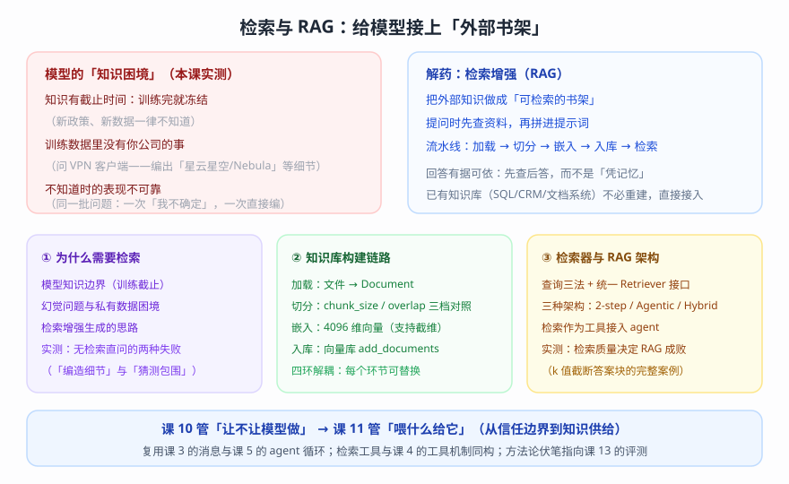
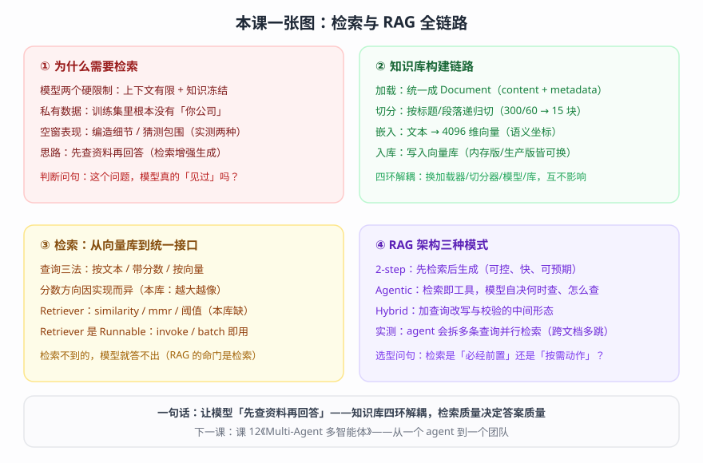

# 第 11 课：Retrieval 检索与 RAG（给模型接上「外部书架」）

> 所属阶段：阶段 3《可控性与可靠性》｜ 水平：进阶（有扎实 Python 与后端工程基础，LangChain 从零）｜ 本课知识点：为什么需要检索、知识库构建链路、检索器与 RAG 架构
> 故事情节：故事的控制层收尾——前四课解决了「让它靠谱」（中间件、上下文、审批、护栏），但还有一个更底层的问题：它压根不知道你公司的事。这一课给它接上「外部书架」
> 📖 结论已按官方文档核对（核对于 2026-09 ｜ 来源：docs.langchain.com 的 retrieval / knowledge-base 两页；关键行为均经本机实测——脚本 `playground/lesson-11-retrieval-lab.py` 与两个补跑脚本，证据合并文件 `lc-l11-lab-output.txt`；知识库语料为 `playground/kb/` 下 5 份虚构公司文档）

## 🎯 本课目标

- 说清模型的两个知识硬限制（上下文有限 + 知识冻结），能判断一个问题是否「超出模型知识」
- 走通知识库构建链路四环节：加载 → 切分 → 嵌入 → 入库；理解 chunk_size / overlap / 维度等关键参数的取舍
- 掌握检索器接口与 RAG 三种架构（2-step / Agentic / Hybrid），能把检索接入 agent 完成知识问答
- 建立一条工程直觉：RAG 的命门是检索质量——检索不到的，模型就答不出

---

## 第一幕：起源与场景引入

> 🏛️ **起源**：检索增强生成（Retrieval-Augmented Generation，RAG）由 Facebook AI Research（现 Meta AI）在 2020 年的论文《Retrieval-Augmented Generation for Knowledge-Intensive NLP Tasks》中正式提出——给生成模型外挂一个「可检索的知识库」，让它在回答前先查资料（核对于 2026-09，属论文公开事实）。这不是全新发明：搜索引擎做了几十年的事，被搬进了 LLM 的回答流程。官方文档把它的位置讲得很清楚：LLM 有两个关键限制——**上下文有限**（无法一次吞下整个语料库）与**知识冻结**（训练数据停在某个时间点）；检索在**查询时**取回相关外部知识，这就是 RAG 的基础。

客服助手第十次进化。上一阶段解决了「靠谱」问题：它有中间件把关、有护栏兜底、有审批流程。上线第一周，客户问：「你们公司退款政策是什么？」助手答得彬彬有礼——**但内容是编的**；同事问：「VPN 客户端怎么连？」助手热情地推荐了「星云星空」——**这家公司压根不存在**。你终于意识到：前面所有课都在教它「怎么说话、怎么做人」，没人教过它「你公司到底是怎么回事」——**它不知道。**

> 🎬 **场景**：用户的真实问题，一半以上是关于「我们自己的事」：内部制度、产品细节、客服话术、技术文档——这些内容全都**不在**任何模型的训练数据里。模型不是「不乖」，是「没见过」。

> 📌 **一句话本质**：检索与 RAG = **把外部知识做成「可检索的书架」，让模型先查资料、再回答**。技术上拆成一个流水线：**加载 → 切分 → 嵌入 → 入库**（把文档变成可被相似度搜索的索引），**检索 → 拼接 → 生成**（提问时取回最相关的几块，拼进提示词交给模型）。官方定义：检索缓解了「上下文有限」与「知识冻结」两大限制，是 RAG 的基础（核对于 2026-09）。
>
> ⚖️ **处境对照**：没有这一课——私有问题只能靠模型编（本课实测：同一批问题，它一次老实说「不确定」、一次直接编造出「星云星空/Nebula」等细节）；有了这一课——**同一批问题，它引用着文档来源作答**（实测：VPN 客户端 NebulaConnect、年假按司龄 5/10/15 天，全部与知识库一致）。

---

## 第二幕：认知冲突

到这里你可能有一个非常自然的想法：**「检索什么检索，我直接把公司文档全塞进提示词不就完了？」**

两个现实会立刻打脸。

**问题一：塞不下，而且塞多了更差。** 上下文窗口是有限的（即使某些模型声称百万级，成本也随之爆炸）；更关键的是，课 9 已经学过：**给模型的信息不是越多越好**——无关内容会稀释注意力，真正有用的那几段反而被淹没。你需要的不是「全给」,而是「给对」——**先找到最相关的几小块，再喂给模型**。

**问题二：「找到」这件事本身，机器不会天然就会。** 你说「把和问题相关的资料找出来」——怎么找？靠关键词匹配？用户问「住宿能报多少」，文档写「每晚上限 600 元」——**一个字都不重叠，关键词匹配直接歇菜**。这正是本课知识点 2 要解决的：如何把「语义相近」变成「机器可计算」——**嵌入（embedding）与向量检索**。

> ❓ **问题**：怎么把文档变成「机器找得到」的形态？找到之后，怎么喂给模型？什么时候查、查几次，谁说了算？

三个追问把这件事拆开：

- 追问一：**模型缺的到底是什么知识？**——两个硬限制（上下文有限 / 知识冻结）；不知道时的两种失败形态（拒答式猜测 / 编造式幻觉）。
- 追问二：**「机器找得到」靠什么机制？**——加载（统一成 Document）、切分（切成可检索的小块）、嵌入（语义 → 向量坐标）、入库（向量库索引）。
- 追问三：**检索结果怎么变成答案？**——Retriever 统一接口；2-step RAG（先查后答的固定流程）与 Agentic RAG（检索作为工具、模型自决）两种架构，以及它们的选择标准。

由此得到本课的关键认知：**RAG 不是一个组件，而是一条链路**——链路上的每一环（切多大、选什么模型、k 取几）都会影响最终答案；**而失败往往发生在「检索」这一半，不是在「生成」那一半**（本课会实测一个完整案例：检索截断，模型如实说「资料未涵盖」——它没错，是检索没送到）。

---

## 第三幕：层层揭示

### 一眼全局图（进入细节前先看一眼）



> 看图：左边是模型的三个知识困境（截止时间 / 私有数据 / 不可靠表现）；右边是解药——检索增强的思路与流水线；底部三张卡片对应本课三站，底栏交代本课与课 4/5/9/10 的衔接关系。

### 本课地图（分几步走）

| 步 | 这一步要解决什么（人话） | 对应知识点 |
|:--:|------------------------|-----------|
| 1 | 模型为什么答不了私有问题；检索增强是什么 | 知识点 1：为什么需要检索 |
| 2 | 文档怎么变成「机器找得到」的索引（四环节） | 知识点 2：知识库构建链路 |
| 3 | 怎么查、怎么用；两种 RAG 架构怎么选 | 知识点 3：检索器与 RAG 架构 |

### 知识点 1：为什么需要检索

> 🧭 第 1/3 步｜承接：课 1 的「Agent = Model + Harness」——模型是大脑，但大脑的知识有边界 → 本步：看清边界在哪、越界时会发生什么、解药是什么

#### 一句话定义

检索（Retrieval）= **在查询时取回相关的外部知识**，缓解模型的两大硬限制（上下文有限、知识冻结）；把它与生成结合，就是检索增强生成（RAG）——**先查资料，再回答**。

#### 直觉建立（类比）

一位博学但「两耳不闻窗外事」的专家。他读过海量公开资料（模型训练数据），但：① 你公司的内部制度，他从没看过；② 上个月刚出的政策，他不可能知道；③ 最要命的是——**当你问到他不知道的事，他不会沉默**，而是会基于「最像的记忆」给你一个听起来很专业的回答（幻觉）。给这位专家配一间「你们公司的资料室」（知识库），让他回答前先翻资料（检索）——这就是 RAG 干的事。

> 💡 **类比的边界**：专家翻资料是「懂了再用」，模型是「读了几段就照着说」——它并不真正理解文档，只是在**你给的几段材料**与问题的牵引下生成最可能的回答。所以「给对材料」比「给多材料」重要得多（这正是知识点 2、3 的主题）。

#### 核心原理

**① 两个硬限制（官方定义）**：

| 限制 | 含义 | 后果 |
|------|------|------|
| 上下文有限（Finite context） | 无法一次把整个语料库塞进窗口 | 「全塞进去」不可行（成本 + 效果双输） |
| 知识冻结（Static knowledge） | 训练数据停在某个时间点 | 新数据、私有数据一律不知道 |

**② 不知道的时候，模型会怎样？**——关键认知：**模型没有「不知道」这个原生信号**。它的机制是「生成最可能的续写」，所以面对知识空窗，它的输出在两种形态间摆动：

- **拒答式猜测**：先声明「没有确切信息」，然后给一堆通用推测（听起来严谨，但内容不能用于决策）；
- **编造式幻觉**：直接编出具体细节（公司名、产品名、版本号），语气越自信越危险。

这两种形态本课都实测到了（见下文 1a）。**同一个模型、同一批问题，它「表现成哪种」带有随机性**——这才是最需要防守的：你无法靠「它这次说不知道」来信任它。

**③ 解药：检索增强生成（RAG）**。官方文档给的路径很朴素：**查询时取回相关外部知识**。落到工程上分两半：
- 准备半场（离线）：把外部知识做成「可检索的书架」——加载、切分、嵌入、入库（知识点 2）；
- 回答半场（在线）：问题来了，检索最相关的几块 → 拼进提示词 → 模型基于材料作答（知识点 3）。

**④ 实测：无检索直问的两种失败模式（1a）**。同一批「私有知识」问题，直接问模型（不挂任何检索），两个问题暴露了两种失败：

```text
[问题 1] 星云科技（Nebula Tech）的员工年假有多少天？
[回答 1] 关于“星云科技（Nebula Tech）”的员工年假天数，目前公开渠道并没有统一的确切信息。
  * **中国大陆法定标准**：累计工作满1年不满10年享5天；满10年不满20年享10天；满20年以上享15天。
  * **科技公司常见福利**：很多科技/互联网公司会在法定基础上增加“福利年假”。例如，入职第一年通常享有 7～15 天不等
  ……
```

看点在「猜测的包围」：模型嘴上说「没有确切信息」，手上却没闲着——把法定标准、行业常见值、各种可能性全铺了一遍。这些内容**没有一个字来星云科技**，且真实政策（按司龄 1-3 年 5 天 / 3-5 年 10 天 / 5 年以上 15 天）与它推测的分档逻辑并不相同——**看起来「差不多」，用起来全不对**。

```text
[问题 2] 星云科技的 VPN 客户端叫什么？
[回答 2] 关于“星云科技”的 VPN 客户端名称，通常取决于您指的是其面向**企业用户**还是**个人用户**的产品线：
  1. **企业级产品（星云星空）**： 如果您指的是提供企业内网穿透、SD-WAN 组网以及远程办公服务的**北京星云星空科技有限公司**，
  他们的核心客户端软件名称就叫作 **“星云星空”**（英文名称：**Nebula**）。
  2. **个人网络加速/代理工具**： 如果是指市面上以“星云”命名的个人网络代理工具或加速器，其客户端通常被直接命名为 **“星云VPN”**
  ……
```

这一条是标准的**编造式幻觉**：真实答案（知识库里的）是 **NebulaConnect**——模型给出的「星云星空」「Nebula」「星云VPN」全部是它「拼」出来的近似物。注意它甚至编出了「北京星云星空科技有限公司」这样一个具体的公司实体，并配上产品线说明——**细节越多，越像真的，越危险**。

> 🎯 **两个问题合起来证明**：模型对「知识空窗」没有稳定行为——有时拒答式猜测，有时编造式幻觉；**唯一的可靠解法不是提醒它「不知道就说不知道」，而是让它「知道」**——把资料检索出来喂给它。

#### 示例演示

见上文实测 1a（两种失败模式全文见证据文件）。快速对照：同一批问题在知识点 3 有检索加持后的表现（3f/3e）——完全换了一个助手。

#### 常见误区

- **以为「模型很聪明，哄一哄就能不编」**：提示词工程（课 9）能降低幻觉概率，但改变不了「它没有这段知识」的事实——**知识问题要用知识解决**。
- **以为「联网搜索 = RAG」**：搜索是获取网页，RAG 的核心是把**你自己的知识源**变成可检索索引；两者是不同层次（当然可以组合）。
- **以为「已有知识库就没必要学这个」**：官方文档专门澄清——已有的 SQL / 文档库 / CRM **不需要重建**，直接作为工具或检索源接入即可（Agentic RAG 的现实形态，知识点 3 展开）。

#### 一句话记住

> 模型「不知道」是不可控的——它可能老实承认，也可能编得头头是道；唯一的可靠解法是让它「知道」：先查资料，再回答。

#### 🗣️ 行话对照

- **RAG（Retrieval-Augmented Generation）**：检索增强生成——先查后答的总体思路/架构——在哪遇到：官方 retrieval 页
- **知识库（Knowledge Base）**：可检索的文档/结构化数据仓库——在哪遇到：官方 retrieval 页
- **幻觉（Hallucination）**：模型生成听起来合理但无依据/错误的内容——在哪遇到：全课程背景概念
- **检索（Retrieval）**：查询时取回相关外部知识——在哪遇到：本课核心

#### 官方文档

- [Retrieval（本知识点主参考页）](https://docs.langchain.com/oss/python/langchain/retrieval)
- [Build a semantic search engine（语义搜索教程）](https://docs.langchain.com/oss/python/langchain/knowledge-base)

---

### 知识点 2：知识库构建链路

> 🧭 第 2/3 步｜承接：知识点 1 立了「要查资料」的目标——本步解决「机器凭什么找得到」→ 把文档变成可搜索的向量索引（四环节流水线）

#### 一句话定义

知识库构建链路 = **把原始文档加工成「可被相似度搜索的索引」的四环节流水线**：加载（Document 统一格式）→ 切分（切成小块）→ 嵌入（文本转向量）→ 入库（写入向量库）。官方定性：检索是 RAG 的基础（foundation），且四类构件完全模块化——loader / splitter / embedding / vector store 每一环都可替换。

#### 直觉建立（类比）

图书馆的开馆流程：**编目上架**。① 收书（加载：各种来源、各种格式，先统一成「书本」这个标准形态）；② 拆册（切分：一整套书拆成可独立借阅的分册——你不想为了看某一章而借走整本）；③ 编目（嵌入：给每册书设计「语义坐标」——内容相近的书在书架上放一起）；④ 上架（入库：写入书架系统，支持按坐标快速取书）。读者（查询）来了，按「语义坐标」直接走向最相关的那一册——而不是从头翻到尾。

> 💡 **类比的边界**：图书馆的编目是确定性规则（书名/作者/分类号），向量的「语义坐标」是**高维空间里的稠密数字**——两段文字「意思相近」靠的是向量夹角的余弦相似度，不是关键词命中。这是「语义检索」与「关键词检索」的本质差异（也正是知识点 1 里「住宿 vs 每晚上限 600 元」能匹配上的原因）。

#### 核心原理

**① 加载（Document Loaders）**：把各种来源（Markdown、PDF、网页、数据库……）统一成 `Document` 对象——这是全链路的「通用货币」：

| 字段 | 含义 | 本课实例 |
|------|------|---------|
| `page_content` | 文本内容（str） | 文档正文 |
| `metadata` | 附加信息（dict） | `{'source': '01-考勤与休假制度.md', 'start_index': 220}` |
| `id` | 可选标识 | 默认 None（入库时向量库可自动生成） |

官方生态里有大量 loader（Google Drive、Slack、Notion 等，见 integrations 索引）；官方教程演示 PDF 加载时用的是**最小 helper**（`pypdf` 逐页读 + 手动构造 Document，本课以同样的「原生」思路加载 Markdown 文件）——**loader 的价值是「来源 → Document」的适配，不是魔法**。

**② 切分（Text Splitters）**：为什么必须切？

- **检索粒度**：整篇文档作为一个单元太粗——你的问题只关于其中一段，检索命中「整篇」等于稀释了有效信息；
- **上下文窗口**：块最终要进 prompt，块太大几个就撑爆；
- **切法是门手艺**：切在句子中间会切碎语义；官方推荐的通用方案是 `RecursiveCharacterTextSplitter`——**按分隔符优先级递归切**（`['\n\n', '\n', ' ', '']`：先按段落，切不动降级按行、按空格），在「块尽量完整」与「不超过 chunk_size」之间取平衡（该类来自 `langchain-text-splitters` 包，本课环境已安装：`uv add langchain-text-splitters`）。

两个核心参数：

| 参数 | 作用 | 本课实测（5 份文档） |
|------|------|---------------------|
| `chunk_size` | 每块的目标最大字符数 | 200 → 26 块；300 → 15 块；400 → 12 块 |
| `chunk_overlap` | 相邻块的重叠字符数（防止关键句被切断在边界） | 40 / 60 / 80 对应配置 |

**③ 嵌入（Embedding Models）**：把文本映射成「语义坐标」——一个高维向量，**意思相近的文本，向量距离也近**。这是整条链路里唯一「需要模型」的环节：

- 接口是两个方法：`embed_documents`（一批文档 → 一批向量，入库用）与 `embed_query`（一个问题 → 一个向量，查询用）；
- 维度由模型决定（本课用的 Qwen3-Embedding-8B 为 **4096 维**）；
- 部分模型支持**维度截断**（MRL，Matryoshka 表示学习）：以更低的维度存储向量以节省空间/加速检索，代价是精度微降（本课实测 `dimensions=1024` 正常返回 1024 维）；
- 选型要点：**中文语义质量**（本课实测：相关对 0.69~0.78 vs 无关对 0.43~0.51，区分度清晰）、**维度与成本**、**是否区分 query/document 前缀**（部分模型需要）。

**④ 向量库（Vector Stores）**：存储向量并提供「相似度搜索」的数据库。选型光谱：**内存版**（`InMemoryVectorStore`，教学/轻量用，重启即失）→ **本地嵌入式**（Chroma、FAISS 等）→ **生产级服务**（PGVector / Milvus / Qdrant / Pinecone……）。核心 API 大一统：`add_documents` 写入、`similarity_search` 查询、`as_retriever` 转检索器（知识点 3）。注意：内存版做相似度计算依赖 `numpy`（本课环境已装；缺失时查询直接报 `ImportError: cosine_similarity requires numpy to be installed`，本课预检实测）。

**⑤ 实测（2a-2e）**：

```text
-- 2a 加载：文件 → Document --
  文件数: 5
    01-考勤与休假制度.md: 701 字符
    ……
  Document 字段: page_content=str / metadata=dict / id=None

-- 2b 切分：三档 chunk_size 对照 --
  chunk_size= 200 overlap= 40 ->  26 块 | 长度 min=32 max=198 avg=135
  chunk_size= 300 overlap= 60 ->  15 块 | 长度 min=127 max=290 avg=230
  chunk_size= 400 overlap= 80 ->  12 块 | 长度 min=94 max=371 avg=295
  默认分隔符: ['\n\n', '\n', ' ', '']
```

看点在「块数与粒度的权衡」：200 字符档被切出 26 块——块多了检索更精准，但最小块只有 32 字符（可能语义不完整）；400 字符档 12 块——上下文更完整，但单块包含的无关内容也更多。**没有万能参数，只有「用评估来调」的工程循环**（埋个伏笔：课 13 的评测就是干这个的）。

```text
-- 2c 切分：块结构与 metadata --
  共 15 块；取第 2 块展示：
  metadata: {'source': '01-考勤与休假制度.md', 'start_index': 220}
  内容（290 字符）：
    | ## 二、年假
    | 年假天数按员工在公司的连续服务年限阶梯计算：
    | - 入职满 1 年不满 3 年：每年 5 天
    | - 入职满 3 年不满 5 年：每年 10 天
    | - 入职满 5 年及以上：每年 15 天
```

两个细节：① 块从 `## 二、年假` 标题开始——递归切分天然尊重 Markdown 的章节结构（**切分质量好，检索命中率就高**）；② `metadata` 自动继承了来源文件名，并带上 `start_index=220`（启用 `add_start_index=True` 后的字符偏移，用于定位原文）——**metadata 是引用溯源的基础**（知识点 3 的答案里「来源：xx 文件」就靠它）。

```text
-- 2d 嵌入：维度 / 批量 / 截维 --
  embed_documents 批量 3 条: 每条 4096 维
  embed_query: 4096 维
  dimensions=1024 截维（MRL）: 实际返回 1024 维

-- 2e 入库：add_documents --
  add_documents: 15 块入库 | 耗时 33.4s（平均 2.23s/块）
  返回 id 前 2 个: 534a2a42-cb87-4743... / 87121935-7233-44a7...
  store 内块数: 15
```

入库返回自动生成的 uuid 列表（可用于后续更新/删除）；嵌入调用是本链路唯一的「网络开销大头」——**生产上要关心批量与缓存**（同一文档反复嵌入是常见浪费，本课补跑中实测到嵌入接口存在微弱的浮点非确定性，见第四幕数值说明）。

**⑥ 与后续环节的接口**：链路跑完，你得到的是一个「向量库对象」——它已经支持相似度查询；而把它变成「标准检索器」、再接进 RAG 流程，是知识点 3 的内容。

#### 示例演示

见上文实测 2a-2e。完整脚本 `playground/lesson-11-retrieval-lab.py`（站二部分）。

#### 常见误区

- **以为要「重建」现有知识库**：官方明确——已有的数据库/文档系统优先直接接入，不要为了 RAG 重复造库。
- **以为 chunk_size 越大越好**：块越大，检索命中的「杂质」越多；本课实测的失败案例（3f）就是「答案在一块的边缘，被 k 值截断」——参数要配着评估调。
- **以为「切分只是切字符串」**：切分位置直接决定检索质量——切在句子中间 = 语义碎片，检索命中率下降。
- **以为向量「越大越好」**：维度高表达力强，但存储/计算成本也高——MRL 截维是常用的性价比手段。

#### 一句话记住

> 知识库 = 把文档加工成「可检索索引」的四环节流水线（加载 → 切分 → 嵌入 → 入库）；每一环都可替换，每一环都影响最终命中率。

#### 🗣️ 行话对照

- **Document**：链路通用货币（page_content + metadata）——在哪遇到：`langchain_core.documents`
- **RecursiveCharacterTextSplitter**：官方推荐的通用切分器——在哪遇到：`langchain_text_splitters`
- **chunk_size / chunk_overlap**：块大小 / 重叠——在哪遇到：切分器参数
- **add_start_index**：记录块在原文的字符偏移——在哪遇到：切分器参数
- **Embeddings / embed_documents / embed_query**：嵌入接口两方法——在哪遇到：`langchain_core.embeddings` / 各家集成
- **MRL（Matryoshka 截维）**：高维向量裁剪为低维——在哪遇到：本课截维实测 / 部分模型支持
- **Vector Store / InMemoryVectorStore**：向量库 / 内存实现——在哪遇到：`langchain_core.vectorstores`

#### 官方文档

- [Build a semantic search engine（本知识点主参考页：Create documents / Generate embeddings / Load and split / Index）](https://docs.langchain.com/oss/python/langchain/knowledge-base)
- [Document Loaders 集成索引](https://docs.langchain.com/oss/python/integrations/document_loaders)
- [Text Splitters 集成索引](https://docs.langchain.com/oss/python/integrations/splitters)
- [Embedding 集成索引](https://docs.langchain.com/oss/python/integrations/embeddings)
- [Vector Store 集成索引](https://docs.langchain.com/oss/python/integrations/vectorstores)

---

### 知识点 3：检索器与 RAG 架构

> 🧭 第 3/3 步｜承接：知识点 2 把「书架」建好了——本步解决「怎么查、怎么用、什么时候查」→ 三种 RAG 架构与完整实现

#### 一句话定义

检索器（Retriever）= **「给一个非结构化查询，返回一组 Document」的统一接口**（官方定义）——向量库、搜索引擎、外部 API 都可以包成检索器；RAG 架构 = **检索与生成两个环节的编排方式**——官方给出三种：2-step（固定先查后答）、Agentic（模型自决何时查、怎么查）、Hybrid（加入改写与校验的混合形态）。

#### 直觉建立（类比）

三种「问资料室」的工作方式：**2-step RAG** 像「先取书后答题」的标准流程——前台接到问题，固定先去资料室取回 N 份材料，再交给专家作答（流程可预期、次数固定）；**Agentic RAG** 像「专家本人有资料室门禁」——他答题途中觉得需要查，自己去查，觉得一次不够再查一次，甚至把问题拆开来查（灵活，但次数和耗时不固定）；**Hybrid RAG** 像「带质检的流程」——取书前先把问题改写得更清楚、取完检查材料够不够、答完再校验答案质量（多轮迭代，精而重）。

> 💡 **类比的边界**：三种架构不是「先进程度」的排序，而是**控制权与灵活性的取舍**（官方对比表就四个维度：控制力 / 灵活性 / 延迟 / 典型场景）——FAQ 机器人不需要 agentic 的复杂度，研究助手也不能用固定单轮的流程。

#### 核心原理

**① 查询向量库的三法 + 分数方向**（官方教程 Query the vector store）。向量库提供了不同粒度的查询接口：

| 方法 | 输入 | 返回 | 用途 |
|------|------|------|------|
| `similarity_search` | 文本 | `list[Document]` | 日常检索 |
| `similarity_search_with_score` | 文本 | `[(Document, score)]` | 需要看「有多像」（阈值过滤、调试） |
| `similarity_search_by_vector` | 向量 | `list[Document]` | 已有向量（如复用查询嵌入/多模态） |

**分数方向是第一个坑**：官方教程里的示例（某向量库）score 是**距离**——「越小越相似」；而本课实测的 `InMemoryVectorStore` 是**余弦相似度**——「越大越相似」。实测证据：

```text
[similarity_search_with_score] 分数方向验证:
  score=0.5416 | [01-考勤与休假制度.md] ## 二、年假
  对照: 原文查询 score=0.6800 vs 无关查询 score=0.3329
  -> 结论: score 为余弦相似度（越大越相似）
```

实践建议：**不要凭直觉解读 score**——先像上面一样做两个对照（相关 vs 无关），确认方向再写阈值逻辑。

**② Retriever：统一接口**（官方教程 Use retrievers）。向量库**不是** Runnable，检索器**是**——意味着它天然支持 `invoke` / `batch` 等标准调用方式。创建方式：

- `vector_store.as_retriever(search_type=..., search_kwargs=...)`——`VectorStoreRetriever` 包装，最常用；
- `@chain` 装饰器自定义——把任意函数（哪怕内部是三次检索后手工合并）包装成 Runnable（官方教程的演示写法）；
- 任意第三方检索器（外部 API / 搜索引擎）。

`search_type` 官方支持三种（教程原文）：`"similarity"`（默认）、`"mmr"`（最大边际相关性——在相似与多样之间平衡，避免返回一堆几乎相同的块）、`"similarity_score_threshold"`（按分数阈值过滤）。**实测差异（重要）**：本版本的 `InMemoryVectorStore` 对第三种**未实现**——

```text
[similarity_score_threshold] NotImplementedError（InMemoryVectorStore 未实现 relevance scores 方法）
替代方案（手动阈值过滤）: 15 条中保留 2 条 ->
  score=0.5547 | [01-考勤与休假制度.md] ## 四、远程办公
  score=0.4970 | [03-IT-服务指南.md] # 星云科技 · IT 服务指南
```

这不是文档写错了——`VectorStoreRetriever` 的三种 search_type 是**接口层的承诺**，具体向量库实现到什么程度各家不同（生产库如 Chroma/PGVector 通常完整支持）。工程习惯：**用之前先试一下**；不可用时用「拿分数手动过滤」兜底（见上面替代方案）。

mmr 的多样性效果实测（同一查询「远程办公」）：

```text
[as_retriever · similarity] 返回 3 条:
  [01-考勤与休假制度.md] ## 四、远程办公
  [03-IT-服务指南.md] # 星云科技 · IT 服务指南
  [03-IT-服务指南.md] ## 四、办公设备
[as_retriever · mmr] 返回 3 条:
  [01-考勤与休假制度.md] ## 四、远程办公
  [03-IT-服务指南.md] # 星云科技 · IT 服务指南
  [05-信息安全规范.md] ## 二、数据外发规则
```

**③ RAG 架构三种模式**（官方 retrieval 页对比表）：

| 架构 | 检索时机 | 控制力 | 灵活性 | 延迟 | 典型场景 |
|------|---------|--------|--------|------|---------|
| **2-step** | 生成前固定执行一次 | 高 | 低 | 快且可预期 | FAQ、文档机器人 |
| **Agentic** | 模型推理中自决（可多轮） | 低 | 高 | 可变 | 多工具研究助手 |
| **Hybrid** | 加入查询改写/检索校验/答案校验 | 中 | 中 | 可变 | 有质检要求的领域问答 |

官方提示：**2-step 的延迟更可预期**（LLM 调用次数有上限），而 agentic 的次数不固定（本课实测：单问 1 次检索；复合双问 2 次并行检索）。

**④ 2-step RAG 完整实现**（官方教程的极简形态）：检索 → 拼 prompt → 生成。本课实测（3d）：

```text
-- 3d 2-step RAG 全链路 --
  检索到 3 块: ['03-IT-服务指南.md', '04-产品与售后政策.md', '03-IT-服务指南.md']
  拼接后 prompt 总长: 970 字符（资料 846）
  回答: - **VPN 客户端名称**：「NebulaConnect」 来源：`03-IT-服务指南.md`
        - **重置密码方式（资料中的“忘记密码”说明为域账号密码重置）**： 可访问 `it.nebula-tech.example`，点击「忘记密码」，通过企业邮箱接收验证链接进行自助重置；若企业邮箱不可用，需携带工牌到 IT 服务台现场重置。 来源：`03-IT-服务指南.md`
        补充：VPN 账号为员工工号，初始密码在入职时由 IT 服务台发放；若因连续输错被锁定，会锁定 30 分钟后自动解锁。若特指“VPN 密码”的专门重置流程，资料未单独涵盖。
```

三个看点：① 回答**准确且带来源**（metadata 溯源在这里兑现）；② 模型对「资料没覆盖的细分问题」如实标注（**「只依据资料」的约束在起作用**，对比知识点 1 的放任状态）；③ 提示词里显式放入结构化资料（`[来源: 文件名]` + 正文），这个拼接模板就是 2-step RAG 的核心代码。

**⑤ Agentic RAG 完整实现**：把检索包成**工具**（课 4 的技能直接复用），交给 agent：

```python
@tool
def search_knowledge_base(query: str) -> str:
    """搜索星云科技公司内部知识库。当用户询问公司制度、流程、IT 服务、
    报销、产品政策等公司相关问题时必须使用此工具。"""
    hits = store.similarity_search(query, k=3)
    return "\n\n---\n\n".join(
        f"[来源: {h.metadata['source']}]\n{h.page_content}" for h in hits)

agent = create_agent(model, tools=[search_knowledge_base], system_prompt="……必须先检索……")
```

官方 Tip（意译）：**agent 想要 RAG 行为，唯一需要的就是「能取外部知识的工具」。**实测（3e）中 agent 拿到复合问题「VPN 客户端叫什么？怎么重置密码？」后，**自主拆成两条查询并行检索**：

```text
[1] ai -> 调用工具 search_knowledge_base({'query': 'VPN 客户端名称'})
[1] ai -> 调用工具 search_knowledge_base({'query': 'VPN 密码重置 忘记'})
[4] ai 最终回答: **VPN 客户端名称：NebulaConnect**（支持 Windows、macOS 与移动端）
```

**⑥ 命门实测：检索质量决定 RAG 成败**（本课最有价值的一组数据）。同一个问题「星云科技员工每年有多少天年假？」，三种方式对照（3f）：

- **(a) 无检索**：模型搬出「国家法定标准 + 行业常见福利」——看起来专业，但没有一条来自星云科技；
- **(b) 2-step RAG（k=3）**：检索到了相关文档，但**答案块没被检索到**——模型如实回答「**资料只说明：年假天数按员工在公司的连续服务年限阶梯计算。但具体每年有多少天年假，资料未涵盖。**」（它没编，也没答对）；
- **(c) Agentic RAG**：agent 自主生成查询「员工年假天数 政策」，**精准命中答案块**，给出完整表格（1-3 年 5 天 / 3-5 年 10 天 / 5 年以上 15 天 + 折算规则）。

为什么 (b) 会漏？补跑精确定位（「答案块」= 含「每年 5 天」的那一块；分数从大到小取前 k 名）：

```text
查询: 星云科技员工每年有多少天年假？（k=3）
  score=0.7030 start=   0 答案块=否 | # 星云科技 · 考勤与休假制度
  score=0.5692 start=   0 答案块=否 | # 星云科技 · 产品与售后政策
  score=0.5627 start= 512 答案块=否 | ## 四、远程办公
查询: 星云科技员工每年有多少天年假？（k=5）
  score=0.7035 start=   0 答案块=否 | # 星云科技 · 考勤与休假制度
  score=0.5691 start=   0 答案块=否 | # 星云科技 · 产品与售后政策
  score=0.5630 start= 512 答案块=否 | ## 四、远程办公
  score=0.5615 start= 220 答案块=★是 | ## 二、年假
  score=0.5405 start=   0 答案块=否 | # 星云科技 · IT 服务指南
```

根因浮出水面：用户原话（含「星云科技」的公司名）把**文档头部块**（start=0）推上第一（0.70），真正的答案块（start=220）只排第 4（0.56）——`k=3` 一刀切在第 3 名，答案块被截断在门外。而 agent 改写的查询（「员工年假天数 政策」）去掉了公司名等「高相似度噪声词」，答案块直接排第一（0.6444，补跑 A）。

> 🎯 **这组实测给出三条工程结论**：① RAG 失败**多数发生在检索侧**，且是**静默失败**（不报错、模型还答得很像样——「资料未涵盖」）；② **k 值、查询措辞、chunk 切法**都会左右命中（k=4 起答案块进入；查询改写立竿见影）；③ **这些参数不该拍脑袋**——用一批问题+标准答案做评估集来调（伏笔：课 13）。

**⑦ 跨文档复合问题**（3g）：agent 面对「年假申请提前几天 + 北京出差住宿报销多少」的双问题，**并行发起两条查询**（分别命中考勤制度与报销标准两个文档），给出跨文档的完整答案并各自标注来源——这是 agentic 模式在多跳问题上的天然优势（2-step 单轮检索对复合问题的覆盖不稳定）。

#### 示例演示

见上文 3a-3g 与补跑。完整脚本 `playground/lesson-11-retrieval-lab.py`（站三部分）与 `lesson-11-retrieval-lab-fix.py` / `-fix2.py`。

#### 常见误区

- **以为「接上知识库 = 问答准确」**：本课实测的反例（3f-b）——检索没送到，模型只能诚实地说「资料未涵盖」；RAG 的质量上限由检索质量决定。
- **以为 score 越大（或越小）越像「放之四海而皆准」**：方向因实现而异——用对照实验先确认（本课 3a）。
- **以为 `similarity_score_threshold` 一定可用**：官方教程列了三种 search_type，但本版本内存库未实现第三种（NotImplementedError）——接口承诺 ≠ 每库都实现。
- **以为 agentic 一定比 2-step 好**：官方对比表说得很直白——控制力 vs 灵活性的取舍；简单固定的场景用 2-step 更稳更省。
- **以为 k 越大越好**：k 大召回全但杂质多（还挤占 prompt），k 小则可能截断答案（本课 3f-b 就是 k=3 截断的活案例）——k 是调出来的。

#### 一句话记住

> 检索是命门——「检索不到，模型就答不出」；2-step 要可控、Agentic 要灵活，k 值与查询措辞要用评估来调。

#### 🗣️ 行话对照

- **Retriever / VectorStoreRetriever**：检索器接口 / 向量库包装——在哪遇到：`langchain_core.retrievers` / `as_retriever()`
- **similarity_search / with_score / by_vector**：查询三法——在哪遇到：`VectorStore` 方法
- **search_type（similarity / mmr / threshold）**：检索器三形态——在哪遇到：`as_retriever` 参数
- **2-step / Agentic / Hybrid RAG**：三种架构模式——在哪遇到：官方 retrieval 页
- **@chain**：把函数包装成 Runnable——在哪遇到：`langchain_core.runnables`

#### 官方文档

- [Retrieval · RAG architectures（本知识点主参考页：2-step / Agentic / Hybrid 对比）](https://docs.langchain.com/oss/python/langchain/retrieval)
- [Build a semantic search engine · Query / Use retrievers（查询三法与检索器用法）](https://docs.langchain.com/oss/python/langchain/knowledge-base)

---

## 第四幕：实操验证

回到第一幕：助手答不了「我们自己的事」，还编造了「星云星空」。以下覆盖 **13 个主实验 + 3 项补充核查**，全部本机跑通（脚本：`playground/lesson-11-retrieval-lab.py` 与 `-fix.py` / `-fix2.py` 两个补跑脚本；运行方式：在 `playground/` 内执行 `uv run python lesson-11-retrieval-lab.py`；证据合并文件 `lc-l11-lab-output.txt`）：

1. **无检索直问（1a）**：两种失败模式实录——「拒答式猜测」（年假：铺满法定标准与行业常见值）与「编造式幻觉」（VPN：编出「星云星空/Nebula/北京星云星空科技有限公司」）。
2. **加载（2a）**：5 份 Markdown → 5 个 Document（588-818 字符）；字段确认 page_content / metadata / id=None。
3. **切分三档对照（2b）**：200/40 → 26 块（avg 135）；300/60 → 15 块（avg 230）；400/80 → 12 块（avg 295）；默认分隔符 `['\n\n', '\n', ' ', '']`。
4. **块结构与 metadata（2c）**：块从「## 二、年假」标题开头；metadata 继承 source + `start_index=220`（溯源基础）。
5. **嵌入（2d）**：4096 维；批量 3 条 / 单条查询均正常；`dimensions=1024` 截维返回 1024 维。
6. **入库（2e）**：15 块 add_documents（返回 uuid 列表；store 内计数 15）。
7. **查询三法（3a）**：similarity_search / with_score / by_vector 全部返回预期块；分数方向对照（原文 0.6800 vs 无关 0.3329 → 越大越相似）。
8. **Retriever 三形态（3b）**：similarity 与 mmr 对照（mmr 第 3 条换为不同主题块）；`similarity_score_threshold` → NotImplementedError；替代方案手动过滤（15 条 → 2 条）。
9. **@chain 自定义 retriever（3c）**：batch 双查询返回 2 组结果。
10. **2-step RAG 全链路（3d）**：检索 3 块 → prompt 970 字符 → 答案带来源 + 对未覆盖内容如实标注。
11. **Agentic RAG（3e）**：agent 自主拆两条查询并行检索 → 结构化完整回答（含来源与排查提示）。
12. **三方对照（3f）**：无检索（通用猜测）vs 2-step（检索截断 → 「资料未涵盖」）vs agentic（查询改写 → 命中答案块 → 完整表格）。
13. **跨文档复合问题（3g）**：双问题 → 两条并行查询（考勤 + 报销两个文档）→ 跨文档答案各自带来源。

> **补充核查（fix / fix2 脚本）**：① 3f-b 截断根因定位——答案块在 k=3 时排第 4（0.5615），k=4 起进入；② k 值扫描（k=1~5）确认「命中窗口」边界；③ 嵌入接口非确定性核查——同一文本多次重跑差值 0.458~0.479（4096 维求和），embed_query 与 embed_documents 输出差异同量级（每维约 1e-4）。

> ✅ **回扣场景**：「助手不知道公司的事」→ 知识库四环节把 5 份文档变成 15 块可检索索引（2a-2e）；「问 VPN 编出星云星空」→ 有检索后准确答出 **NebulaConnect** 并注明来源（3d/3e）；「检索没送到怎么办」→ 3f-b 的静默失败与 k 值/查询改写的修复路径。**四环节决定「找不找得到」，三种架构决定「怎么用」——RAG 的命门在检索侧。**
>
> ⚠️ 数值说明：以上为 2026-09-16 本机实测；模型回答措辞受采样影响（机制性结论——检索命中块、分数、异常类型、k 值截断、状态值——不受措辞影响）；嵌入调用耗时受网络波动影响较大（本课证据内：入库 15 块 33.4s；另一轮批量 3 条耗时 73.9s，单条耗时差约一个数量级）；嵌入接口存在约 0.46/4096 量级的浮点非确定性（对检索排序无实际影响，三次重跑排序稳定）；本课知识库为虚构公司文档（星云科技），生产环境请用真实语料 + 生产级向量库（持久化）。

**应用实战（4.2）**：把本课知识点组装成一条「私有知识接入」的演进路线——独立成册：

> 🔍 **应用实战 11：让 agent 回答公司内部政策，别让它编** → [打开实战篇](../../../应用实战/11-Retrieval检索与RAG.md)
>
> 从「直接问模型、没有依据」到「切分 + 向量库 + 检索」再到「检索增强生成 + 引用溯源」的三个版本演进：每一步解决了什么问题、还剩什么问题、下一步怎么被逼出来——配 3 张分步设计图（每张标注本步新增了什么）。

---

---

## 第五幕：体系收束

> 📍 **全局定位**：本课是阶段 3 的收尾之作，与前四课拼出「可信赖 agent」的完整底盘：
> - **课 8（Middleware）**给了挂载点、**课 9（Context Engineering）**给了供给策略、**课 10（HITL & Guardrails）**给了信任边界——三者回答「怎么控制」；
> - **本课（Retrieval & RAG）**回答更底层的一问：**「控制得再好，它不知道的事就是不知道」**——给它接上外部知识，回答才有据可依。
> - **回看主线**：课 1 的「Agent = Model + Harness」——本课是 harness 的「知识供给层」；课 4 的工具机制在这里复用（检索工具就是一个普通 tool）；课 5 的 agent 循环在这里变成 Agentic RAG 的引擎；课 3 的 metadata 思路在 Document 上延续。
> - **下一步（课 12）**：Multi-Agent 多智能体——从一个 agent 的「知识供给」，走向多个 agent 的「分工协作」。
>
> 🔗 **一句话带走**：RAG 不是「接个库」——是**四环节流水线（加载/切分/嵌入/入库）+ 三种编排（2-step/agentic/hybrid）**；而它的命门在检索侧：**检索不到的，模型就答不出**——把评估做进链路（课 13 见）。

---

## 🐞 常见误区

1. **以为「模型不知道会老实说不知道」**：实测两种形态随机出现——拒答式猜测（铺满推测）与编造式幻觉（编出公司/产品名）；**知识问题要用知识解决**，不是靠嘱咐。
2. **以为「把所有文档塞进提示词」是替代方案**：上下文有限 + 注意力稀释（课 9），「给对」永远优于「给全」。
3. **以为「切分是小事」**：切分位置决定检索命中——本课 3f-b 的失败链里，块从章节标题开始是**幸运**（切分质量好）；切碎语义则会直接拉低命中率。
4. **以为「score 越大越像」或「越小越像」有标准答案**：方向因实现而异——先用「相关 vs 无关」对照确认（3a），再写逻辑。
5. **以为「接上检索就万事大吉」**：k 值截断、查询措辞、切分粒度都会造成**静默失败**（不报错，只是答不上或答偏）；3f-b 是完整案例。
6. **以为「agentic RAG 是升级版 2-step」**：官方定性是取舍——控制力 vs 灵活性；FAQ 场景用 2-step 更稳，多跳/多工具场景 agentic 更合适。

### ⏳ 与过时说法对照（写前核对 + 实测发现的差异）

| 旧说法（网上教程 / 直觉） | 现状（官方文档 + 本课实测） | 依据 |
|---|---|---|
| 「RAG = 向量库 + 大模型，两个组件拼起来就行」（简化论） | 官方拆成五类构建块（loaders/splitters/embeddings/vector stores/retrievers）+ 三种架构模式 | 官方 retrieval 页 |
| 「score 越小越相似」（从某教程学来的） | 方向因实现而异：本课内存库**越大越相似**（0.68 相关 vs 0.33 无关）；官方教程示例库恰是相反（距离） | 3a |
| 「as_retriever 三种 search_type 都能用」 | 接口层支持，实现层因库而异——本课内存库 `similarity_score_threshold` 直接 NotImplementedError | 3b |
| 「检索一定成功，失败就是模型不行」 | 检索有**静默失败**：k 截断/措辞不佳时，模型会「诚实地基于残缺资料作答」（3f-b：「资料未涵盖」） | 3f + 补跑 |
| 「embed_query 和 embed_documents 有严格区别（必须用对）」 | 本服务实测二者走同一向量空间、无前缀差异；差异仅为服务端浮点噪声量级（~0.46/4096） | 2d + fix2 |
| 「文档先切 1000 字符再说」（拍脑袋参数） | 切分/ k / 措辞都要用评估集调——本课实测同一问题 k=3 漏、k=4 中、查询改写直达第一 | 3f + 补跑 |

## 一图总结



> 看图：四张卡片对应本课全部要点（为什么检索 / 构建链路 / 检索器 / RAG 架构），底部一句话收束与下一课预告。

## 课后小测

**Q1**：关于知识库构建链路，说法正确的是？
- A. `chunk_size` 越大越好，可以让每块上下文更完整
- B. 嵌入环节的 `embed_documents` 用于查询、`embed_query` 用于入库
- C. Document 的 `metadata` 是引用溯源的基础（如来源文件名、块偏移）
- D. 切分只是字符串操作，切在哪里对检索效果没有影响

<details><summary>答案与解析</summary>

**答案：C**。A 错——块越大检索命中的杂质越多，参数要配评估调（2b/3f）；B 错——反了：`embed_documents` 批量文档、`embed_query` 单条查询（2d）；D 错——切在句子中间会造成语义碎片，直接拉低检索质量（2c）。

</details>

**Q2**：关于检索器与 RAG 架构，说法正确的是？
- A. 本课的 `InMemoryVectorStore` 的 score 是距离，越小越相似
- B. `similarity_score_threshold` 在 `InMemoryVectorStore` 上实测抛 NotImplementedError，可用手动阈值过滤替代
- C. Agentic RAG 的延迟比 2-step RAG 更可预期
- D. VectorStore 是 Runnable，可以直接 `invoke`

<details><summary>答案与解析</summary>

**答案：B**。A 错——实测是余弦相似度，越大越相似（3a）；C 错——官方定性：2-step 延迟更可预期（LLM 调用次数有上限），agentic 次数不固定（官方对比表）；D 错——VectorStore 不是 Runnable，Retriever 才是（官方教程 Use retrievers）。

</details>

**Q3**：本课 3f 的「检索截断」案例教会我们什么？
- A. 2-step RAG 架构本身有缺陷，应该总是用 agentic
- B. 只要 k 调到 100，就永远不会漏检索
- C. RAG 失败可能发生在检索侧且是静默的——k 值、查询措辞等参数需要用评估来调
- D. 模型回答「资料未涵盖」说明模型能力不足

<details><summary>答案与解析</summary>

**答案：C**。A 错——架构是取舍，本课案例是参数与措辞问题（补跑证明 k=4 起命中、查询改写直接排第一）；B 错——k 过大引入杂质且挤占上下文，参数平衡靠评估；D 错——模型行为（如实标注未涵盖）恰恰是正确执行「只依据资料」的约束，问题在检索没把答案块送进来。

</details>

## 🚀 下一批接力提示词

> 学完本课后，**复制下面这段文字发给 AI**，即可无缝进入下一课（无需重新描述上下文）：

```text
继续学 LangChain。我的学习档案在 langchain/langchain/00-学习档案.md，
刚学完阶段 3《可控性与可靠性》的课 11《Retrieval 检索与 RAG》全部知识点
（为什么需要检索、知识库构建链路、检索器与 RAG 架构），
请按大纲继续讲解课 12《Multi-Agent 多智能体》的知识点。
```

## 🧭 课程导航

⬅️ **上一课**：[课 10：人机协同与护栏](lesson-10-人机协同与护栏.md)

➡️ **下一课**：[课 12：Multi-Agent 多智能体](../../4-组合与工程化/lessons/lesson-12-Multi-Agent多智能体.md)

📚 **返回目录**：[课程目录](../../../02-课程目录.md)

