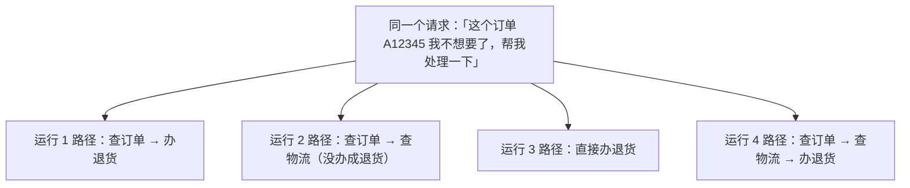
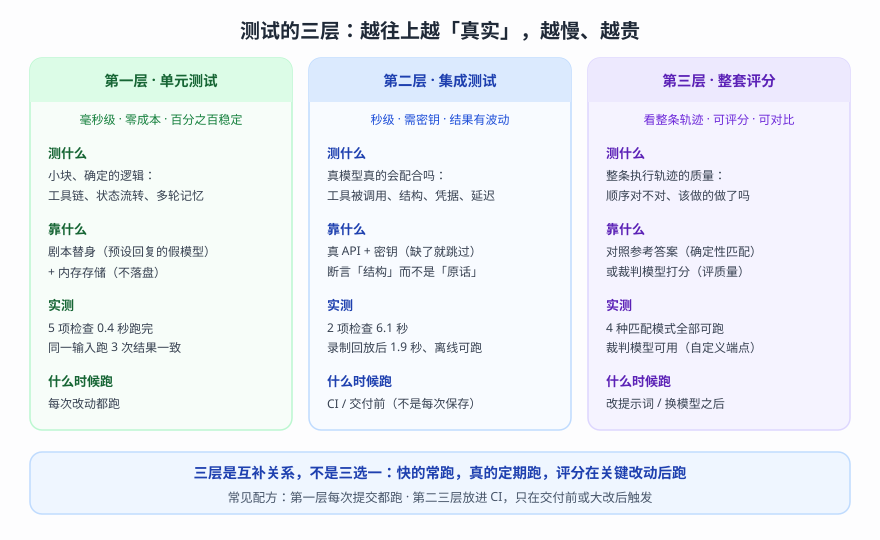
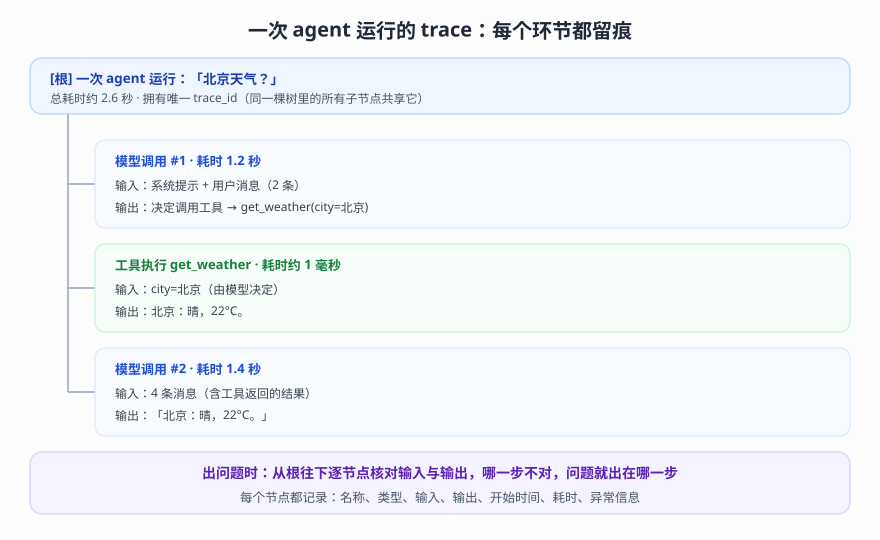

# 第 13 课：Testing 与 Observability（让 agent 可测可观测）

> 所属阶段：阶段 4《组合与工程化》｜ 水平：进阶（有扎实 Python 与后端工程基础，LangChain 从零）｜ 本课知识点：为什么 agent 需要测试、测试层次、可观测性
> 故事情节：故事收束章——交付之前，先让 agent「可证明」（测试）与「可观察」（tracing）；这是从「能跑」到「敢用」的最后一步
> 📖 结论已按官方文档核对（核对于 2026-09 ｜ 来源：docs.langchain.com 的 test 系列（总览 / 单元测试 / 集成测试 / Agent Evals）+ observability + studio + ui 页面，链接见各知识点「官方文档」；关键行为均经本机实测——实验脚本位于 `playground/lesson-13-*-lab.py`、测试套件位于 `playground/tests_l13/`；测试工具链：pytest 9.1.1 + agentevals 0.0.9 + vcrpy 8.3.0 + pytest-recording 0.13.4）

## 🎯 本课目标

- 理解非确定性给测试带来的三个挑战（内容变 / 节奏变 / 路径变），建立「断言结构 + 轨迹对照 + 质量评分」的新测试观
- 掌握三层测试（单元 / 集成 / Evals）各自的分工、工具与运行时机，能搭出「快层日常跑、全层交付跑」的测试套件
- 学会两种「看见 agent」的路径——本地替代（set_debug / 自建收集器）与托管平台（tracing 接入），并用 trace 定位问题

---

## 第一幕：起源与场景引入

测试与观测，是老工程领域的两个「老话题」——几十年的软件工程实践沉淀出「单元 / 集成 / 端到端」的分层测试方法论，云原生时代又让「可观测性」成为系统的标配能力。它们被搬进 LLM 应用时保留了分层思想，但有一个前提被打破了：**被测系统不再「输入一样，输出就一样」**。本课讲的就是在这个新前提下，旧工具箱怎么换新用法。

客服助手进入第十三次进化。前十二课它已经「一个人顶一个团队」：会查资料（课 11）、能守规矩（课 10）、记住上下文（课 9）、流程可控（课 8）、还能多智能体协作（课 12）。现在，团队决定把它作为「正式版」交付给业务方使用——评审会上，业务方问了三个问题：

1. **「你怎么证明它可靠？」**——上次试运行，它把一个不该退的订单办了退货。
2. **「提示词我们改了一版，新的比旧的更好还是更坏？」**——你说不清，因为上次的回复、这次的回复，长得都不一样。
3. **「上周线上那次答非所问，到底哪一步出了问题？」**——你打开日志，只有一条最终回复；中间它做了什么，一片空白。

而你的手上，只有一句「我跑过几次，看着还行」。

> 📌 **一句话本质**：这一课给 agent 工程加两道工序——**交付前「分层检查 + 整体评分」，运行中「全程留痕」**——把「我见过它能跑」升级成「我能证明它可靠、能看见它怎么跑」。
>
> ⚖️ **处境对照**：没有这两道工序——验证靠人肉跑（每轮真调模型 + 人工逐条看结果），改了提示词不知道有没有变坏，线上出问题只能猜；有了这两道工序——**快层检查 0.4 秒跑完（每次改动都有回归网）、评分层给出「对照参考 + 分数」、每次运行留下完整的 trace**（本课实测：一个「帮我处理退货」的任务跑 5 次出现 4 种工具路径，其中 1 次压根没办成事——这种问题只有「看轨迹」才能发现）。

---

## 第二幕：认知冲突

你可能会想：「测试？写了这么多年测试，这题我会——断言一把梭。」

然后你会被现实连打三次脸（以下全部为本课实测）。

**打脸一：断言「原话」必挂。** 写一行 `assert reply == '北京今天晴，22°C。'` 试跑 3 次：**只过 1 次**。三次的回复分别是 15 字、17 字、17 字——同一天、同一个代码、同一个问题，模型就是每次都换一种说法。

**打脸二：不止内容飘，路径也飘。** 同一句「这个订单 A12345 我不想要了，帮我处理一下」跑 5 次，出现 4 种工具路径：

```text
#1 query_order → apply_return                     （查完直接办退货）
#2 query_order → query_logistics                  （只查了物流，没办退货！）
#3 query_order → query_logistics → apply_return   （查完物流再办退货）
#4 apply_return                                   （跳过查询直接办）
```

其中 #2 是真正危险的：**用户要的是退货，它只回了一句「正在派送中，给您两个选择」——事没办成，但回复看着礼貌得体**。如果你只跑一次、恰好是 #2，你会以为一切正常；如果跑的是其他几次，你会以为它「总是会办退货」——**「跑一次」到底证明了什么？**

**打脸三：出了问题看不见。** 线上那次答非所问，你打开日志——只有最终回复。模型中间调了什么工具、工具返回了什么、在哪一步偏的：统统没有。「排查」变成了「猜」。

> ❓ **问题**：传统测试三板斧（断言、覆盖率、CI）在 agent 上哑火，不是工具不行，而是**被测对象的性质变了**。那么：面对一个「每次都不太一样」的系统——测试到底该断言什么（知识点 1）？三层测试各自怎么搭、怎么跑（知识点 2）？跑起来之后，怎么让它「看得见」（知识点 3）？

---

## 第三幕：层层揭示

### 一眼全局图（进入细节前先看一眼）


> 看图：上方是交付时会遇到的三个问题；左框「交付前：分层检查」把验证拆成快 / 真 / 全三层；右框「运行中：全程留痕」把每一步记录在案。底部一句话收束：从「我跑过，看着还行」到「我能证明，随时可查」。

### 本课地图（分几步走）

| 步 | 这一步要解决什么（人话） | 对应知识点 |
|:--:|------------------------|-----------|
| 1 | 「每次都一样」的习惯为什么必须换掉？该测什么？ | 知识点 1：为什么 agent 需要测试 |
| 2 | 三层测试各测什么、用什么工具、什么时候跑 | 知识点 2：测试层次 |
| 3 | 怎么让运行从「黑盒」变成「全记录」 | 知识点 3：可观测性 |

### 知识点 1：为什么 agent 需要测试

> 🧭 第 1/3 步｜承接：第一幕的三个问题 + 第二幕的「三种打脸」→ 本步：看清非确定性的三种表现，建立「断言换对象、质量靠评分」的新测试观

#### 一句话定义

Agent 测试的核心难题是 **非确定性（non-determinism）**：同一个输入，模型可能给出不同的措辞、消耗不同的时间、甚至走完全不同的工具路径——第二幕的三种打脸，根源都是它。它让「断言具体输出」失效，必须把测试对象换成「**结构、行为轨迹与整体质量**」。

#### 直觉建立（类比）

**判卷方式的代际差异。** 考数学：答案唯一，对答案就行——这就是传统测试。考作文：没有「标准答案原文」，但阅卷有「评分标准」——结构完整吗？论点有支撑吗？跑题了吗？——**这就是 agent 测试：不对答案原文，对「结构」和「质量」**。再进一步：作文还能升格成「对照范文」——这次模考的作文和满分范文比，差在哪里？这就是 Evals 的「轨迹对照」。

> 💡 **类比的边界**：阅卷的评分标准是人写的、相对稳定；机器评分里「裁判模型」自己也会飘。所以 agent 测试的正确策略是「**能确定就确定**（结构断言 / 确定性匹配），实在要模糊才上裁判」——而不是一上来就把所有评判都交给裁判（知识点 2 展开）。

#### 核心原理

**① 非确定性的三种表现（本课实测）**。

| 表现 | 实测证据（同一问题多次运行） | 对测试的影响 |
|------|---------------------------|-------------|
| 内容变 | 天气问题 3 次：15 字 / 17 字 / 17 字，措辞不同；另一组 4 次回复 4 种全不同 | 断言原话必挂 → 改断言结构 |
| 节奏变 | 同题耗时 1.8 ~ 6.5 秒浮动（同机同代码）；退货场景 3.6 ~ 14.0 秒 | 性能断言给区间，不卡死线 |
| 路径变 | 「帮我处理退货」5 次跑出 4 种工具链，其中 1 次没完成任务 | 只看最终回复会放过行为问题 → 看轨迹 |

一个值得精确理解的细节：**路径的稳定性与任务形态相关**——本课实测里，较直白的问题（如「帮我看看 A12345 这个订单」）连续 5 次路径完全一致；任务越模糊，路径分岔越明显（「我不想要了，帮我处理一下」——办不办退货、查不查物流，全看模型临场判断）。这不是「模型不稳定」的八卦，而是「**风险与歧义成正比**」的工程规律。



> 看图：同一个请求出发，5 次运行落入 4 条不同路径——其中运行 2 全程没有调用「办退货」这个动作（回复还很礼貌）。这就是「路径变」的真实形态：**代码没改一行，行为却不一样**。

**② 传统测试的三个失效点**。

- **断言失效**：内容随机，快照断言不可靠（实测 3 次过 1 次）。
- **覆盖率失效**：代码分支能覆盖，但「模型会在多少种路径里选」覆盖不了——同一段代码可能走出 N 种轨迹。
- **回归失效**：没有基线（参考轨迹 / 分数），「改了之后变好还是变坏」无从判断。

**③ 新测试观：把测试对象从「输出」换成「三层」**。

| 层 | 测的对象 | 为什么可靠 |
|----|---------|-----------|
| 结构 | 消息类型、工具名、参数形态 | 「行为骨架」——措辞会变，骨架稳定（实测：结构断言 3/3 通过） |
| 轨迹 | 工具调用的序列与完整性 | 对照参考轨迹：顺序对不对、该做的动作做了吗（知识点 2 的 Evals） |
| 质量 | 答案好不好、有没有胡编 | 用「评分标准」替代「标准答案」（裁判模型 / 参考对照） |

**④ Evals 概念：数据集 + 评判标准**。

官方定义（核对于 2026-09）：Evals 用 evaluator 评估 agent 的**执行轨迹（trajectory）**——「消息与工具调用的序列」；评估方式两类：**确定性匹配**（对照参考轨迹）或 **LLM 裁判**（LLM-as-judge，按评分标准打分）。相比集成测试验证「基本正确性」，evals 对照参考或评分标准给行为**打分**——专门用于在改提示词 / 改工具 / 换模型时抓住回归。

这里有一个关键洞察：**Evals 的评估对象是轨迹，而不是最终回答**——因为「怎么做的」和「做成了什么」都重要。回到第二幕的 #2：回复礼貌得体、但事没办成——**只看答案会放过它，看轨迹立刻抓出**。

#### 示例演示

先看三层里最「反直觉」的一层——确定性匹配怎么工作（完整操作在知识点 2）：把第二幕的退货场景写成参考轨迹，然后用 superset 模式核对「该做的动作有没有做」——

```python
from agentevals.trajectory.match import create_trajectory_match_evaluator

# 参考轨迹（期望行为）：查订单 → 发起退货 → 告知结果
REFERENCE = [
    HumanMessage('这个订单 A12345 我不想要了，帮我处理一下'),
    AIMessage(tool_calls=[query_order(order_id='A12345')]),
    ToolMessage('订单 A12345：已发货，承运商=顺丰……'),
    AIMessage(tool_calls=[apply_return(order_id='A12345')]),
    ToolMessage('已为订单 A12345 发起退货申请，退货单号=R20240916……'),
    AIMessage('已为您发起退货申请……'),
]

evaluator = create_trajectory_match_evaluator(trajectory_match_mode='superset')

# 实测中「没办成事」的那次运行（只查了订单和物流，没有发起退货）
missed = [ ... ]
print(evaluator(outputs=missed, reference_outputs=REFERENCE)['score'])
# → False：缺「必须调用的工具」apply_return，当场判失败
```

看点在最后一行：**它不比对回复文本，只核对「该做的动作有没有做」**——这正是「跑一次看看」永远给不出的保证。参考轨迹的具体写法、四种匹配模式的差异，在知识点 2 展开。

#### 常见误区

- **以为「非确定性 = 每次都乱来」**：错。实测中简单任务路径 5/5 稳定，而回复措辞 100% 变化——**波动是分层的**（措辞最飘、耗时居中、简单路径较稳）。正确姿势不是「放弃断言」，而是「断言该稳的、给会飘的留容差」。
- **以为「温度调 0 就变确定了」**：服务端实现、批处理、浮点计算等因素仍可能带来差异；更重要的是——**工程策略不能依赖「模型会变乖」这个假设**，要按最坏情况设计。
- **以为「多跑几次全过就稳了」**：跑 5 次全过 ≠ 第 6 次不会挂（路径分岔是概率事件，样本越多越可能露头）；正确姿势是把关键行为锁进确定性检查（结构 / 轨迹），把统计意义上的质量交给 Evals 批测。
- **以为「evals 是更高级的测试，可以取代测试」**：两者是**互补**——测试管「有没有坏」（确定性、快、进 CI），evals 管「有多好」（打分、可对比、追踪趋势）；官方把它们并列为不同层次（核对于 2026-09）。

#### 一句话记住

> 会变的东西不能拿来断言，能断言的是「结构」和「轨迹」；「做得对不对、好不好」靠评分。看不出来的问题，先让它「留痕」（知识点 3）。

#### 🗣️ 行话对照

- **Non-determinism（非确定性）**：同输入不保证同输出——在哪遇到：LLM 应用测试文档、evals 教程
- **Flaky test（不稳定测试）**：时过时挂的测试——在哪遇到：CI 报错、测试框架文档
- **Trajectory（轨迹）**：一次运行的消息与工具调用序列——在哪遇到：evals 文档（trajectory match / LLM-as-judge）
- **Eval（评估）**：用数据集 + 评判标准衡量质量——在哪遇到：官方 test/evals 页、LangSmith 平台
- **Assertion（断言）**：测试里的「核对语句」——在哪遇到：pytest 基础

#### 官方文档

- [Test · 总览（三层策略的官方定义，本知识点主参考页）](https://docs.langchain.com/oss/python/langchain/test/index)
- [Agent Evals（轨迹评估概念）](https://docs.langchain.com/oss/python/langchain/test/evals)

### 知识点 2：测试层次

> 🧭 第 2/3 步｜承接：知道了「该断言结构、看轨迹、评质量」→ 本步：三层各自怎么搭、用什么工具、什么时候跑

#### 一句话定义

三层测试 = **单元测试**（把不确定的部分换掉，测确定的内部逻辑）＋ **集成测试**（真模型真调用，验「配合」）＋ **Agent Evals**（对照参考 / 裁判打分，验「轨迹质量」）——越往上越真实、越慢、越贵，适用时机和断言方式都不同。

#### 直觉建立（类比）

**医院体检的三类检查。** 血常规：快、便宜、可以常查——发现基础异常（单元测试）。专科检查：要预约、上设备——真刀真枪验证关键部件「配合正不正常」（集成测试）。年度全面体检 / 专家会诊：不只看「有没有病」，而是评估「整体状态好不好、比去年好还是差」（Evals）。

> 💡 **类比的边界**：体检项目是固定的；测试套件是**随代码演进生长**的——每修一个 bug，就补一个「防止它复发」的检查。测试套件因此是一部「项目踩坑史」，而不只是一份检查表。

#### 核心原理

**① 三层分工总览**。



> 看图：三张卡片分别是三层测试的「测什么 / 靠什么 / 实测数字 / 什么时候跑」。底栏一句话：三层是互补关系不是三选一——快的常跑，真的定期跑，评分在关键改动后跑。

| 维度 | 单元测试 | 集成测试 | Evals |
|------|---------|---------|-------|
| 测什么 | 确定的内部逻辑（工具链、状态、多轮） | 真模型「真的配合」 | 整条轨迹的质量 |
| 依赖 | 无网络（替身模型 + 内存存储） | 真 API + 密钥 | 评判标准（参考轨迹 / 裁判） |
| 速度（实测） | 5 项 0.4 秒 | 2 项 6.1 秒 | 匹配毫秒级 / 裁判秒级 |
| 稳定性 | 100% 确定 | 有波动（断言结构） | 匹配确定 / 裁判有波动 |
| 什么时候跑 | 每次改动 | CI / 交付前 | 改提示词 / 换模型后 |

**② 第一层：单元测试——「把不确定的换掉，剩下的就能测」。**

核心手法：**测试替身**——用「剧本模型」替换真模型：预设好「这次回复什么、调什么工具」。剩下的一切（工具执行、消息组装、状态流转、多轮记忆）就是确定的，可以精确断言。

官方工具：`GenericFakeChatModel`（接受响应迭代器，每次调用按顺序吐一个）+ `InMemorySaver`（内存中的多轮记忆）。

```python
from langchain_core.language_models.fake_chat_models import GenericFakeChatModel
from langgraph.checkpoint.memory import InMemorySaver

# 剧本：第一条消息发起工具调用，第二条给出最终回答
model = GenericFakeChatModel(messages=iter([
    AIMessage(content='', tool_calls=[ToolCall(name='get_weather', args={'city': '北京'}, id='call_1')]),
    '北京今天晴，22 度。',
]))
agent = create_agent(model, tools=[get_weather])

result = agent.invoke({'messages': [HumanMessage('北京天气？')]})
# 断言消息序列：用户 → AI(含 tool_calls) → 工具结果 → AI(终答)
assert len(result['messages']) == 4
assert result['messages'][2].type == 'tool'
assert result['messages'][2].content == '北京：晴，22°C。'
```

> ⚠️ **本课实测发现（官方文档未覆盖的组合）**：agent 挂了工具时，把 `GenericFakeChatModel` 直接传给 `create_agent` 会抛 `NotImplementedError`——**所有内置 fake 模型的 `bind_tools` 都未实现**（官方 unit-testing 页的两个示例恰好都绕开了这个组合：一个直接 `model.invoke()`，一个 `create_agent(model, tools=[])`）。补法只要三行测试替身子类：
>
> ```python
> class ScriptedToolModel(GenericFakeChatModel):
>     """剧本模型 + 工具支持：剧本里已预设 tool_calls，绑定时原样返回自身。"""
>     def bind_tools(self, tools, *, tool_choice=None, **kwargs):
>         return self
> ```

**③ 第二层：集成测试——「真的调用一次，验它真的配合」。**

两个原则（均为官方主张，核对于 2026-09）：

- **断言结构，不断内容**：验证「工具被调用了 / 消息类型正确 / 回复非空」，而不是「回复等于某句话」。
- **与单测分流**：用 pytest marker 打标签，默认跑快的、显式跑慢的：

```ini
[pytest]
markers =
    integration: tests that call real LLM APIs
addopts = -m "not integration"
```

```bash
uv run pytest tests_l13/                 # 默认：只跑非集成（快）
uv run pytest tests_l13/ -m integration  # 显式：真调 API（慢）
```

> 本课程的实现有一个小变体：官方示例把密钥检查做成 `autouse`（对所有测试生效），我们改为**显式 fixture**——纯离线测试（单元 / 轨迹匹配）不依赖密钥、也不应该被跳过；只有真调 API 的测试才要求 `require_api_key`，缺密钥时 `pytest.skip`（跳过而不是报错）。

**密钥纪律**：密钥从环境变量 / `.env` 读取，绝不写进代码；`.env` 必须进 `.gitignore`。

**省钱的近路：录制回放（VCR）**——首次运行真实调用并录下 HTTP 请求 / 响应（cassette 文件），之后运行直接回放，零成本零波动：

```python
@pytest.mark.vcr()
def test_agent_trajectory_record_and_replay():
    agent = create_agent(_build_model(), tools=[get_weather])
    result = agent.invoke({'messages': [HumanMessage(content='北京天气怎么样？')]})
    assert any(tc['name'] == 'get_weather'
               for m in result['messages'] for tc in (getattr(m, 'tool_calls', None) or []))
```

```ini
markers = vcr: record/replay HTTP via VCR
addopts = --record-mode=once    # 首次录制、之后回放
```

**④ 第三层：Evals——「对照参考 + 打分」，抓行为回归。**

官方 AgentEvals 包提供两类评估器：

**轨迹匹配（确定性，无需模型）**——四种模式（官方定义，核对于 2026-09）：

| 模式 | 语义 | 适用场景 |
|------|------|---------|
| `strict` | 结构一致、顺序一致（内容可不同） | 强制特定序列（如先查政策再授权） |
| `unordered` | 结构一致、顺序任意 | 验证「信息都查了」但不关心顺序 |
| `subset` | 实际调用 ⊆ 参考（不超范围） | 防越权 / 防多余动作 |
| `superset` | 实际调用 ⊇ 参考（可多不能少） | 验证「必要动作都做了」 |

**LLM 裁判（模糊质量）**——`create_trajectory_llm_as_judge`：按评分标准对轨迹打分；可不给参考（评「整条轨迹是否合理」）或给参考（评「与参考的语义等价度」）。

> ⚠️ **本课实测适配（接自定义端点）**：官方示例写 `model="openai:o3-mini"`（字符串，走 OpenAI）。实测发现 `judge=` 参数可直接传**任意 LangChain 模型实例**——包括本课程的自定义端点模型，裁判链路完整跑通：
>
> ```python
> judge_model = init_chat_model('qwen3.8-flash', model_provider='openai',
>                               base_url=..., api_key=...)
> evaluator = create_trajectory_llm_as_judge(judge=judge_model,
>                                            prompt=TRAJECTORY_ACCURACY_PROMPT)
> result = evaluator(outputs=trajectory)
> # {'key': 'trajectory_accuracy', 'score': True, 'comment': '...英文点评...'}
> ```

**⑤ 三层的运行节奏（本课实测的完整流水）**：

```text
uv run pytest tests_l13/                → 9 passed（单元 5 + 轨迹匹配 3 + 回放 1），2.07 秒
uv run pytest tests_l13/ -m integration → 3 passed（真调用 2 + 裁判 1），24.39 秒
```

**日常跑 2 秒的快层，交付前跑 24 秒的全层**——这就是分层的目的：**反馈速度**与**真实性**各取所需。

#### 示例演示

完整的三层套件（本课实测，位于 `playground/tests_l13/`）：

```text
tests_l13/
├── conftest.py          # 密钥加载 + 缺密钥跳过 + VCR 脱敏配置
├── pytest.ini           # marker 定义 + 默认排除集成测试
├── test_unit.py         # 第一层：5 项（剧本文本 / 工具链 / 多轮记忆 / 确定性）
├── test_integration.py  # 第二层：2 项（结构断言，需真 API）
├── test_evals.py        # 第三层：4 项（三种匹配 + LLM 裁判）
└── test_vcr.py          # 录制回放：1 项 → cassettes/*.yaml
```

三个可复用的细节（全部实测）：

**细节一：录制回放的「离线证明」**。录一次真调用后，把端点改成不可达地址（`https://127.0.0.1:9/...`）再跑——**测试照样通过，耗时从 6.66 秒降到 1.85 秒**。这证明回放**完全不发网络请求**，可以在断网 / CI 无密钥环境稳定复跑。

**细节二：改输入会导致回放失败（这是好事）**。官方文档警告「改了提示词 / 工具 / 预期轨迹后，cassette 会过期、测试将失败，需要删掉重录」——本课实测复现了它，并发现一个**排查陷阱**：

```text
CannotOverwriteExistingCassetteException: Can't overwrite existing cassette
in your current record mode (once).
...（被 openai SDK 包装后，表层看到的是）...
OpenAIConnectionError: Connection error.
```

**表层报的是「连接错误」，真凶却是「cassette 失配」**——不了解这层包装，就会往网络方向排查半天。遇到「回放环境突然连不上」，先看异常的完整链条。

**细节三：cassette 入库前必须脱敏**。录制文件会随项目进版本库（它是团队共享的测试资产），默认带着**请求头里的凭据与端点**。本课在官方 `filter_headers` 基础上补了两处（入库纪律）：

```python
def vcr_config():
    return {
        "filter_headers": [
            ("authorization", "Bearer <REDACTED>"),  # 凭据脱敏
            ("x-api-key", "<REDACTED>"),
            ("host", "api.example.com"),             # 端点替换为占位符
        ],
        "filter_query_parameters": [("api_key", "<REDACTED>"), ("key", "<REDACTED>")],
        "before_record_request": _scrub_uri,         # 请求 URI 里的真实端点 → api.example.com
        "match_on": ["method", "scheme", "path", "query", "body"],
    }
```

实测验证：替换后 cassette 中 `uri` / `host` 均为 `api.example.com`，无任何真实端点与凭据字样；`match_on` 带上 `body` 后，**请求内容变化会「失配报错」而不是「静默复用旧响应」**——失败得响亮，比悄悄用错数据安全。

#### 常见误区

- **以为「mock 太多就是造假」**：单元层的「假」是为了把「真」留给该真的地方——假模型测「我们的代码逻辑对不对」，真模型测「它跟模型配合对不对」，两层各管一摊，不互相替代。
- **以为「集成测试可以抄单测的断言」**：单测里能精确断言「工具结果等于晴 22°C」；集成测试里同样断言会因为措辞浮动而脆断——**集成层只断言结构**（工具名、类型、非空），别断原话。
- **以为「录过的 cassette 可以一直用」**：改输入 / 改工具 / 改模型，cassette 就过期（表现为伪装的「连接错误」）；**主动重录**（`--record-mode=all`）或删文件重跑，是日常维护动作。
- **以为「Evals 要等接入平台才能做」**：本课全程用 pytest + agentevals 在本地跑通轨迹匹配与裁判（不依赖 LangSmith 平台）；平台的价值在「规模化 + 趋势追踪」（核对于 2026-09），不接入也能先把 evals 跑起来。
- **以为「三层都要做到 100% 覆盖」**：三层是投资组合不是 KPI——单测覆盖关键逻辑、集成覆盖关键链路、evals 覆盖关键场景；**覆盖「关键」比覆盖「全部」值钱**。

#### 一句话记住

> 单元测试靠「换掉不确定的」换来确定性，集成测试靠「断言结构」换来真实性，Evals 靠「对照与打分」换来方向感——**快层天天跑、真层交付跑、评分大改跑**。

#### 🗣️ 行话对照

- **Unit / Integration test（单元 / 集成测试）**：隔离子系统 / 跨子系统联调——在哪遇到：pytest 文档、CI 配置
- **Fixture（夹具）**：测试的共用准备与清理——在哪遇到：conftest.py、pytest fixture
- **Marker（标记）**：给测试打标签以分流运行——在哪遇到：`@pytest.mark.integration`
- **Mock / Fake（替身）**：替换真依赖的测试对象——在哪遇到：fake model 文档
- **Cassette（录音带）**：VCR 录制的请求 / 响应文件——在哪遇到：vcrpy / pytest-recording
- **Trajectory match / LLM-as-judge**：轨迹对照 / 裁判打分——在哪遇到：agentevals 包、官方 evals 页

#### 官方文档

- [Unit testing（替身模型与内存持久化）](https://docs.langchain.com/oss/python/langchain/test/unit-testing)
- [Integration testing（分流、密钥、结构断言、VCR）](https://docs.langchain.com/oss/python/langchain/test/integration-testing)
- [Agent Evals（四种匹配模式与 LLM 裁判）](https://docs.langchain.com/oss/python/langchain/test/evals)

### 知识点 3：可观测性

> 🧭 第 3/3 步｜承接：测试管「交付前」，但上线后出问题怎么办？→ 本步：让运行从「黑盒」变「全记录」

#### 一句话定义

可观测性（Observability）= **让 agent 的每一次运行都留下可回查的记录**——问了什么、模型每一步决定了什么、工具执行了什么、返回了什么、各花了多久——由一棵「run 树」（即 trace）承载；接平台（LangSmith）只要两行环境变量，不接平台也有本地替代。

#### 直觉建立（类比）

**行车记录仪。** 出事故（线上答非所问）时，不用「回想 + 争论」，直接调出录像一秒一秒看：哪一步错了。更进一步：每次出车都自动记录（tracing 默认支持），事故率统计、驾驶行为分析也随之而来（平台的分析能力）。

> 💡 **类比的边界**：行车记录仪只「记录」；trace 还能和运行上下文绑定（tags / metadata 标注用户、环境、版本），让「谁触发的、在哪个环境、哪个版本」都可过滤——这是排查**偶发问题**的关键（同一问题在不同用户 / 环境下的复现条件不同）。

#### 核心原理

**① trace 的数据模型：一棵 run 树**。

一次 agent 运行 = 一棵树：

- **根 run**：一次「agent 调用」（chain 类型），拥有唯一 `trace_id`；
- **子 run**：每次模型调用（llm）、每次工具执行（tool）各是一个子节点；
- 每个节点记录：名称、类型、输入、输出、开始时间、耗时、异常（如有）。

所有子节点共享根的 `trace_id`——「一次运行」在平台里因此是一棵可折叠的树，而不是一堆散落的日志。



> 看图：根节点是一次 agent 调用（唯一 trace_id）；三个子节点依次是「模型调用 → 工具执行 → 模型调用」，每个节点都记录输入 / 输出 / 耗时。底栏给排查方法：从根往下逐节点核对，哪一步不对问题就在哪一步。
>
> 上图结构与数值取自本课 RunTree 实验（`playground/lesson-13-runtree-lab.py`）——一个**完全离线**的脚本：不联网也能把 trace 的数据模型看明白。

**② 两条接入路径。**

**路径一：托管平台（LangSmith）。** 官方描述（核对于 2026-09）：所有用 `create_agent` 构建的 agent **自动支持 tracing**，启用只需两行环境变量：

```bash
export LANGSMITH_TRACING=true
export LANGSMITH_API_KEY=<YOUR_API_KEY>
```

跑起来后默认记到名为 `default` 的项目；可指定项目名，也可给单次调用打 tags / metadata：

```python
response = agent.invoke(
    {"messages": [{"role": "user", "content": "..."}]},
    config={
        "tags": ["production", "email-assistant", "v1.0"],
        "metadata": {"user_id": "user_123", "session_id": "session_456",
                     "environment": "production"},
    },
)
```

按调用粒度开关追踪：

```python
import langsmith as ls

with ls.tracing_context(enabled=True):                     # 只追踪这一段
    agent.invoke(...)

with ls.tracing_context(project_name="email-agent-test", enabled=True):  # 指定项目
    agent.invoke(...)
```

> ⚠️ **本课实测补充（官方未述的两个行为）**：
>
> - **无 key 时的表现**：`LANGSMITH_TRACING=true` 但没配 key——agent **功能完全正常**（照常回答），首次运行收到 `LangSmithMissingAPIKeyWarning` 警告；后台尝试上报 trace 被 401 拒绝（日志打在 stderr：`Authentication failed ... 401`）。**功能与追踪解耦，追踪失败不拖垮业务**——但同时意味着「以为在追踪、实际没追踪」的静默风险，配完后建议验证一次。
> - **tracing 状态的「固化」行为**：tracing 的启用状态在**进程内首次调用时确定**；之后再修改 `LANGSMITH_TRACING` 不会生效（需重启进程）。实测对照：首次即开启的进程 stderr 有上报日志；首次未开启、中途才设置的进程 stderr **零上报**（连尝试都没有）。**结论：`LANGSMITH_*` 环境变量在程序启动前配好。**

**路径二：本地替代（不接平台也能看）**——两层手段，从轻到重：

```python
# 手段 1：set_debug——把每个环节的执行细节打到控制台（含 token 用量、耗时）
from langchain_core.globals import set_debug
set_debug(True)
agent.invoke(...)
set_debug(False)
```

```python
# 手段 2：自建 callback 收集器——把一次运行的关键步骤收集成时间线
class MiniTraceHandler(BaseCallbackHandler):
    def on_chat_model_start(self, serialized, messages, **kwargs):  # 模型开始
        self.events.append(f'▶ LLM 调用（输入 {len(messages[0])} 条消息）')
    def on_llm_end(self, response, **kwargs):                       # 模型结束
        ...  # 记录 tool_calls 或文本
    def on_tool_start(self, serialized, input_str, **kwargs):       # 工具开始
        ...
    def on_tool_end(self, output, **kwargs):                        # 工具结束
        ...

agent.invoke(..., config={'callbacks': [MiniTraceHandler()]})
```

实测输出（一次真实运行的时间线）：

```text
+  0.00s  ▶ LLM 调用（输入 2 条消息）
+  1.19s  ◀ LLM 返回：请求调用工具 → get_weather({'city': '北京'})
+  1.19s  ▶ 工具执行 get_weather（入参 {'city': '北京'}）
+  1.19s  ◀ 工具返回：content='北京：晴，22°C。' ...
+  1.19s  ▶ LLM 调用（输入 4 条消息）
+  2.65s  ◀ LLM 返回文本：北京：晴，22°C。...
```

看到没——**这就是 trace 的「原料」**：平台存的也无非是「这套事件 + 更多细节（token、模型参数、异常栈）」。

**③ 可视化调试工具链（官方指向的两个现成工具）**（核对于 2026-09）：

- **LangSmith Studio**：本地可视化调试界面——连接本机运行的 agent，实时看每一步（提示词、工具调用与结果、中间状态）；支持热重载、从任意步骤重跑。接入：安装 `langgraph-cli` → 写 `langgraph.json` → `langgraph dev` 起本地 server（`http://127.0.0.1:2024`）→ Studio UI 连接。
- **Agent Chat UI**：开源的现成聊天界面（Next.js）——给 agent 配一个「能聊天」的前端，支持实时对话、工具可视化等；最快速方式是用托管版（填入你的 server 地址）。

> ⏳ **本机实测状态声明**：以上两个工具依赖 LangSmith 账号 / 额外 CLI 安装（本课程环境未配 key、可选依赖未安装），**未做端到端实测**——流程按官方文档描述（核对于 2026-09），请以你的环境实测为准。本课已实测的是：trace 数据结构（RunTree，离线）、本地替代两手段（set_debug / callback 收集器）、tracing 环境变量行为（无 key 场景）。

#### 示例演示

把「排查」走一遍：线上用户投诉「我明明说的是退货，它只回了个物流状态」。用 trace 视角核对（本课场景的真实翻版）：

```text
[根] agent 运行：「这个订单 A12345 我不想要了，帮我处理一下」
  ├─ [llm] 模型调用 #1     → 决定：query_order(A12345)        （查订单）
  ├─ [tool] query_order    → 返回：已发货，顺丰，运单号 SF10086
  ├─ [llm] 模型调用 #2     → 决定：query_logistics(A12345)    （查物流）
  ├─ [tool] query_logistics → 返回：正在派送中
  └─ [llm] 模型调用 #3     → 输出：「订单已发货，正派送中，给您两个选择……」
```

一眼看出：**用户要的是「办退货」，而工具序列里从头到尾没有 `apply_return`**——问题不在「最后那句话说得不好」，而在「中间该做的动作没做」。定位到这一步，改进方向就清楚了：要么把提示词里的退货流程写明确（修模型行为），要么把 `apply_return` 列为「必要动作」写进评测（`superset` 模式，加回归网）。**没有 trace 时，你连「它做没做」都不知道。**

#### 常见误区

- **以为「tracing 是上线后的事」**：本地开发就该开——看 trace 定位「为什么它调了错的工具」，比到处打印调试高效得多（本地替代两手段随时可用）。
- **以为「配了环境变量就万事大吉」**：无 key / key 失效时追踪静默降级（业务照跑、trace 没了）；且环境变量要在进程启动前配好（「固化」行为）。**配完后跑一次、确认真的收到了**，再宣布接入完成。
- **以为「trace 只是给运维看的」**：trace 是开发、测试、运营三方共用——开发拿它调试、测试拿它的数据构造 evals 用例、运营拿它分析真实使用模式。
- **以为「日志能代替 trace」**：普通日志是「散点」，trace 是「一次运行的完整树（含父子关系、时序、输入输出）」——差的是「把散点组织成因果链」这一层结构。

#### 一句话记住

> 黑盒的恐惧来自「不知道它刚才做了什么」——trace 把每一次运行变成一棵可回放的树：**接入两行环境变量，排查从「猜」变成「逐节点核对」**。

#### 🗣️ 行话对照

- **Tracing（追踪）**：记录一次请求穿过系统各环节的完整过程——在哪遇到：可观测性文档、LangSmith
- **Trace / Span（追踪 / 跨度）**：一次完整运行 / 其中的一个环节——在哪遇到：平台 UI、OTel 等可观测性标准
- **Run Tree（运行树）**：LangSmith 对 trace 的组织方式——在哪遇到：langsmith SDK、RunTree 类
- **Metadata / Tags（元数据 / 标签）**：给运行附加的可过滤信息——在哪遇到：`config` 参数、平台过滤器
- **Studio / Agent Chat UI**：官方可视化调试界面 / 现成聊天界面——在哪遇到：官方 studio 页、ui 页

#### 官方文档

- [LangSmith Observability（tracing 接入、项目、metadata，本知识点主参考页）](https://docs.langchain.com/oss/python/langchain/observability)
- [LangSmith Studio（本地可视化调试）](https://docs.langchain.com/oss/python/langchain/studio)
- [Agent Chat UI（现成聊天界面）](https://docs.langchain.com/oss/python/langchain/ui)

---

## 第四幕：实操验证

回到第一幕：交付前的三个问题。以下覆盖 **12 组实验**，全部本机跑通（脚本：`playground/lesson-13-*-lab.py` 系列与测试套件 `playground/tests_l13/`；运行方式：在 `playground/` 内执行 `uv run python <脚本名>` 或 `uv run pytest tests_l13/`）：

**非确定性实证（第 1–3 组）**：

1. **内容与耗时波动**：天气问题 4 次运行得 4 种回复（98 / 107 / 76 / 93 字，耗时 3.0 ~ 4.9 秒）；另一组 3 次运行 15 / 17 / 17 字。同机同代码同问题。
2. **路径波动**：直白问题（「帮我看看 A12345 这个订单」）连续 5 次工具链完全一致；模糊问题（「这个订单我不想要了，帮我处理一下」）5 次跑出 **4 种工具链**，其中 1 次**没完成任务**（只查了物流、没发起退货）——「风险与歧义成正比」的直接证据。
3. **断言对照**：同一问题 3 次运行，「快照断言」（回复 == 第一次的原话）1/3 通过；「结构断言」（工具被调用 + 回复非空）3/3 通过。

**三层测试（第 4–8 组）**：

4. **单元层**：5 项测试 **0.40 秒**跑完（剧本文本 / 剧本工具调用 / 工具链执行 / InMemorySaver 多轮 / 确定性复核）；过程中发现并记录「所有内置 fake 模型均未实现 `bind_tools`」的官方文档盲区（补 3 行 `ScriptedToolModel` 解决）。
5. **集成层**：2 项测试 6.11 秒（真模型结构断言 + 无工具最小路径）；`-m "not integration"` 默认分流、`-m integration` 显式运行均验证。
6. **Evals**：4 项测试——strict 内容无关性、superset 抓「缺关键动作」（用第 2 组那次「没办成」的真实轨迹）、strict vs unordered 顺序语义、LLM 裁判（自定义端点模型担任裁判，返回 score + 英文点评）。
7. **录制回放**：首次真实录制 6.66 秒 → 回放 1.85 秒；**端点改为不可达地址（127.0.0.1:9）后回放照常通过**（离线证明）；故意改输入复现「cassette 失配」——异常被包装成 `Connection error`（排查陷阱，已在知识点 2 记录）；cassette 完成凭据与端点双重脱敏。
8. **全量流水**：`uv run pytest tests_l13/` → 9 passed，2.07 秒；`-m integration` → 3 passed，24.39 秒。

**可观测性（第 9–12 组）**：

9. **set_debug**：打印出两次 LLM 调用（3.08s / 1.26s）、工具执行（1ms）、token 用量、完整消息流。
10. **迷你 trace 收集器**：自定义 callback 把一次运行收集成时间线（模型调用 → 工具调用 → 模型调用，含每步耗时），输出与平台 trace 同构。
11. **RunTree（离线）**：不联网构造出「根 run + 3 个子 run」的树，验证 `trace_id` 全树共享、每个节点带输入 / 输出 / 时间戳。
12. **tracing 环境变量行为**：无 key 时 `LangSmithMissingAPIKeyWarning`（首次）+ 后台 401 上报日志 + 业务照常；**「固化」对照实验**——首次未开启、中途设置的进程 stderr 零上报（环境变量需启动前配好）。

**应用实战（4.2）**：把本课知识点组装成一条「客服 agent 交付门禁」的演进路线——独立成册：

> 🧪 **应用实战 13：给客服 agent 建一道「交付门禁」** → [打开实战篇](../../../应用实战/13-Testing与Observability.md)
>
> 从「人肉验证」到「三层门禁 + 观测」的三个版本演进：每一步解决了什么问题、还剩什么问题、下一步怎么被逼出来——配 3 张分步设计图（每张标注本步新增了什么）。

---

## 第五幕：体系收束

**① 全景定位：13 课的拼图完成了。** 基础组件旅程从「一个 Agent 的三行代码」（课 1）走到这里：模型（课 2）、消息（课 3）、工具（课 4）、智能体循环（课 5）、流式（课 6）、记忆（课 7）、中间件（课 8）、上下文工程（课 9）、人机协同与护栏（课 10）、检索（课 11）、多智能体（课 12）——而本课是其中**唯一一门「横向课」**：它不新增能力，而是给所有能力加「质量保险」。前十二课决定「它能做什么」，这一课决定「它敢不敢交付」。

**② 从「能跑」到「敢用」的验收清单**（把本课的可操作结论浓缩）：

- 有一个能**每次改动都跑**的快层（单元测试，秒级、零成本）
- 有一个**交付前跑**的全层（集成 + Evals，覆盖「配合」与「质量」）
- 关键行为有**回归网**：该做的动作（必备工具）、不该做的动作（越权范围）都被评测盯住
- 密钥进 `.env`、录制文件脱敏、集成测试有分流
- 运行有 trace：**出事能回放、改版能对比**
- `LANGSMITH_*` 或本地替代（set_debug / 收集器）至少有一个在跑

**③ 一图总结**：


> 看图：三张卡片（非确定性的三种表现 / 三层测试 / 可观测性）+ 工程纪律四条 + 底栏收束与下一站。

**④ 课后小测**：

**Q1**：关于「非确定性」，说法正确的是？
- A. 同一输入结果必须完全一致，不一致说明模型有问题
- B. 波动是分层的：措辞最飘、耗时居中、简单路径较稳——应断言该稳的、给会飘的留容差
- C. 把温度调到 0 就能完全消除非确定性，测试可以依赖这一点
- D. 同一场景跑 5 次都通过，就可以确认第 6 次也一定通过

<details><summary>答案与解析</summary>

**答案：B**。A 错——非确定性是 LLM 应用的固有属性，不是「坏」；C 错——服务端实现等因素仍可能带来差异，且工程策略不应依赖「模型会变乖」的假设；D 错——路径分岔是概率事件（本课实测 5 次里混进 1 次「没办成」的路径），样本越多越可能露头。

</details>

**Q2**：关于三层测试，说法正确的是？
- A. 集成测试也应该断言回复文本，确保回答正确
- B. mock 太多属于造假，测试应该尽量全部真调用
- C. 单元测试靠「换掉不确定的部分」获得确定性；集成测试断言结构；Evals 对照参考轨迹或按评分标准打分
- D. Evals 必须接入 LangSmith 平台才能运行

<details>
<summary>答案与解析</summary>

**答案：C**。A 错——集成层要断言结构（措辞每次不同，断文本必挂）；B 错——两层各管一摊：假模型测「代码逻辑」、真模型测「配合」，不互相替代；D 错——本课全程用 pytest + agentevals 在本地跑通（平台的价值在规模化与趋势追踪，不是前置条件）。

</details>

**Q3**：关于可观测性，说法正确的是？
- A. 无 key 时设置 `LANGSMITH_TRACING=true` 会让 agent 报错中断
- B. 运行中途设置 `LANGSMITH_TRACING` 会立即生效
- C. trace 只是更花哨的日志，排查时和普通日志一样用
- D. tracing 状态在进程首次调用时固化，环境变量应启动前配好；无 key 时追踪静默降级但不影响业务

<details><summary>答案与解析</summary>

**答案：D**。A 错——功能与追踪解耦，业务照常（首次有警告 + 后台 401）；B 错——固化行为实测：中途设置的进程连上报尝试都没有；C 错——trace 是「一次运行的完整树」（父子关系 + 时序 + 输入输出），差的是把散点组织成因果链的结构。

</details>

## 🚀 下一批接力提示词

> 学完本课后，**复制下面这段文字发给 AI**，即可无缝进入下一环节（无需重新描述上下文）：

```text
继续学 LangChain。我的学习档案在 langchain/langchain/00-学习档案.md，
13 课基础组件已全部学完（最后一课是《Testing 与 Observability》），
请启动结课综合实战项目（跨阶段整合 + 设计决策 + 反例对照 + 验收清单）。
```

> 🎉 **本课程知识已讲完**——但「学完」的最后一步还没做：把 13 课的散装知识点焊成一个完整项目（结课综合实战项目），然后是实战经验 / 排障手册 / 场景解法库三件套。

## 🧭 课程导航

⬅️ **上一课**：[课 12：Multi-Agent 多智能体](lesson-12-Multi-Agent多智能体.md)

➡️ **下一站**：🎉 课程知识已讲完——接下来做「结课综合实战项目」（见[课程目录](../../../02-课程目录.md)收尾产物区）

📚 **返回目录**：[课程目录](../../../02-课程目录.md)
