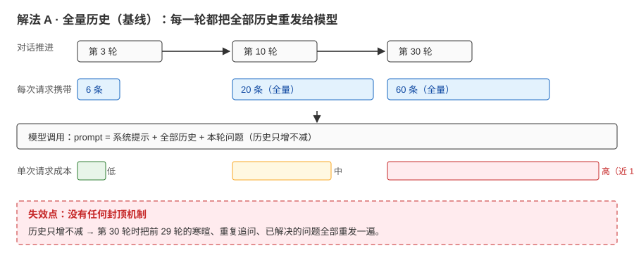
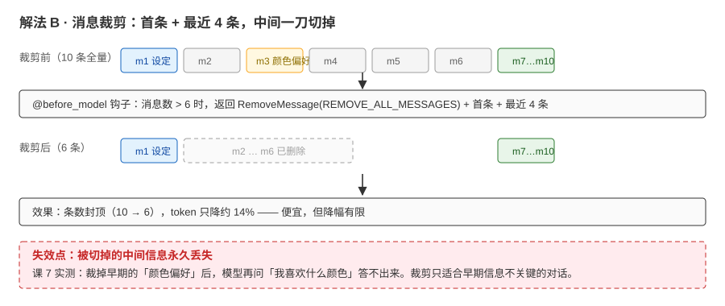
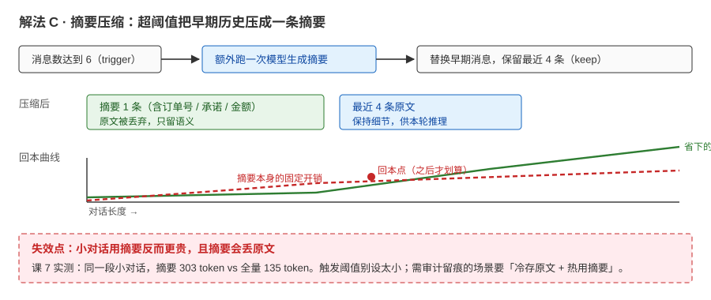
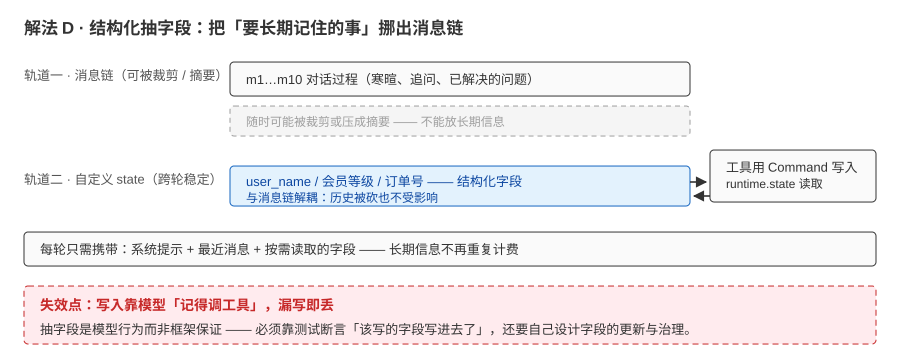

# 场景 1：对话越聊越贵——长会话成本失控（规模压力题）

**场景描述**：客服 agent 上线后，平均会话从 3 轮涨到 30 轮（用户习惯"聊到底"）；单会话 token 成本涨了近 10 倍。财务给了"成本砍半"的硬要求，但客服团队担心"砍了记忆会答错"。

**🔒 先自己想 30 秒**：砍轮数？换小模型？还是动"记忆"本身？

<details><summary>💡 提示（分层 / 分维度想）</summary>

把历史分三层想：哪些**必须留原文**（订单号、承诺、金额）、哪些**可摘要**（寒暄与过程）、哪些**该移出上下文**（用户偏好等长期信息）。成本、准确性、体验三者怎么平衡？先量化再动手——你统计过 token 都花在哪一段吗？

</details>

<details><summary>📖 展开解法</summary>

### 解法一览（效果按"成本压降 / 信息保真"对比）

| 解法 | 效果（成本压降 / 信息保真） | 代价 | 适用边界 |
|------|--------------------------|------|---------|
| A · 全量历史（现状） | 0% / 100% | 成本随轮次近线性上涨 | 短会话（<10 轮） |
| B · 消息裁剪（保留首条 + 最近 N 条） | 条数封顶（10→6，token 仅降约 14%） | 丢中间信息（课 7 实测：早期"颜色偏好"答不出） | 早期信息不关键 |
| C · 摘要压缩 | 条数封顶 + 关键信息保留进摘要 | 触发一次额外模型调用 + 摘要有体量（课 7 实测小对话：303 vs 全量 135 token，反而更贵） | 长对话（回本点之后） |
| D · 长期记忆外置（结构化抽字段） | 跨轮稳定信息不再进"每轮全量历史" | 写入 / 读取 / 治理都要设计 | 有稳定"用户档案"需求 |

### 各解法详解（含关键代码）

#### 解法 A：全量历史（现状）——先量清楚钱花在哪



读图：每往前聊一轮，这次请求就要多带上之前的所有消息；到第 30 轮时，前 29 轮的寒暄、重复追问、已解决的问题全部重发一遍。红框标的是它的要害——**没有任何封顶机制**，成本只增不减。

```python
# 现状：什么都没做 —— 每次调用都把完整历史交给模型
result = agent.invoke({"messages": messages}, cfg)

# 量化起点：token 花在哪一段？（usage_metadata 口径见课 5）
# 看不到分布就别动手：先统计「系统提示 / 历史 / 本轮问题」各占多少
```

> 为什么先给这段：它是**对照组与测量起点**——不知道 token 花在哪一段，后面三种解法都是盲改（课 9 的成本对照就是这么做的）。短会话（<10 轮）维持现状完全合理，贵的从来不是"有历史"，而是"历史无限长"。

#### 解法 B：消息裁剪——保留"首条 + 最近 4 条"



读图：上面一排是裁剪前的 10 条消息，下面一排是裁剪后——首条与最近 4 条留下，中间 m2…m6 被整段删除（灰色虚线框）。红框标的是代价：**m3 里的「颜色偏好」一旦被删，后面问到就答不出来**。

用 `@before_model` 钩子在每次模型调用前改写历史：首条（往往是最初的设定/身份）留着，中间旧消息删掉。

```python
from langchain.messages import RemoveMessage
from langgraph.graph.message import REMOVE_ALL_MESSAGES
from langchain.agents.middleware import before_model

@before_model
def trim_messages(state, runtime):
    """保留第一条消息与最近 4 条，控制上下文规模。"""
    messages = state["messages"]
    if len(messages) <= 6:
        return None
    first = messages[0]
    recent = messages[-4:]
    return {"messages": [RemoveMessage(id=REMOVE_ALL_MESSAGES), first, *recent]}
```

> 为什么这么写：`REMOVE_ALL_MESSAGES` 表示"清空后重放保留项"——先删干净再放回首条与最近消息，避免逐条删除的边界错误。**裁剪的本质是选择**：保留哪些、丢弃哪些，就是你在决定"哪些信息可以丢"（课 7 实测代价：被裁掉的"颜色"信息，模型答不出来）。

#### 解法 C：摘要压缩——超阈值时把早期历史压缩成一条摘要



读图：消息数达到 trigger 阈值 → 多跑一次模型把早期历史压成一条摘要 → 只留「摘要 + 最近 4 条原文」。下半部分是回本曲线：红线（摘要的固定开销）与绿线（省下的 token）在中间相交，**交点之前用摘要是亏的**。

触发式压缩：消息数（或 token 数 / 占比）达到阈值时，把早期历史交给一个模型压成一条摘要，只保留最近几条原文。

```python
from langchain.agents.middleware import SummarizationMiddleware

SummarizationMiddleware(
    model=model,                  # 用来生成摘要的模型（可与主模型不同）
    trigger=("messages", 6),      # 触发条件：消息数达到 6；也支持 ("tokens", N) / ("fraction", 0.8)
    keep=("messages", 4),         # 压缩后保留：最近 4 条
)
```

> 为什么这么写：`trigger` 别设太小——每次触发都多跑一次模型调用，**小对话用摘要反而亏**（课 7 实测：同一段对话摘要 303 token > 全量 135 token；长对话才回本）。`fraction` 形式依赖模型的 profile 数据（课 2 讲过）。

#### 解法 D：结构化抽字段——把"要记的事"从聊天记录里挪出来



读图：两条轨道——上面是消息链（随时可能被裁剪或摘要，红字提示不能放长期信息），下面是自定义 state（跨轮稳定）。工具通过 Command 写入、通过 runtime.state 读取。红框标的是代价：**写入靠模型「记得调工具」，漏写即丢**。

与其让模型每轮背上全部历史，不如把稳定信息存成结构化字段（自定义 state），需要时直接读。

```python
# 节选核心逻辑；完整可运行版本见 playground/lesson-07-memory-lab.py（2d 段）
class CustomState(AgentState):
    user_name: str

@tool
def save_name(name: str, runtime: ToolRuntime) -> Command:
    """记录用户的名字到状态。"""
    return Command(update={"user_name": name})   # 写：Command 更新 state
    # 读：在工具里用 runtime.state["user_name"] 取回
```

> 为什么这么写：抽字段后，"用户是谁"不再依赖历史里的某一句话——哪怕历史被裁剪/摘要，"档案"始终在（课 7 实测：跨轮直接读状态照样答对）。

### 替代路线（非本课程技术栈）

| 替代方案 | 思路 | 与本课程解法的差异 |
|---------|------|------------------|
| 托管平台内建记忆（如 OpenAI Assistants / 云厂商 agent 平台的会话管理） | 历史托管给平台，平台侧自动截断 / 摘要 | 省去自己写策略；但策略是黑盒、行为不可控、迁移受限 |
| API 网关层计量与限流 | 在网关按 token 计量，对超量会话告警 / 限流 | 管"总额"不管"上下文策略"——与解法 A-D 是互补关系（网关兜底 + 应用内优化） |

### 推荐路径（递进，不是一次全上）

1. 先**量化**：统计 token 分布（哪段占大头），别拍脑袋砍
2. 会话 <10 轮维持 A；到 30 轮 → 上 C（阈值调高，先验证"关键信息仍在摘要里"）
3. 需要跨会话偏好 → 上 D；成本仍超 → 再考虑模型分层（轻任务用小模型）

### 知识点挂钩

- 裁剪 / 摘要 / 自定义 state 三种管法 → 阶段 2 [课 7《Memory 记忆》](../stages/2-Agent核心/lessons/lesson-07-Memory记忆.md)
- 上下文组装与成本对照 → 阶段 3 [课 9《Context Engineering》](../stages/3-可控性与可靠性/lessons/lesson-09-ContextEngineering上下文工程.md)
- 成本测算（usage_metadata 与调用次数口径） → 阶段 2 [课 5《Agents 智能体核心》](../stages/2-Agent核心/lessons/lesson-05-Agents智能体核心.md)

### 什么情况下此方案不适用

- 需要完整审计留痕的会话（金融合规）：摘要会丢原始记录——应"冷存原文 + 热用摘要"分离，不能只留摘要
- 对话轮次少、上下文本来就不长：上摘要反而亏（课 7 实测数据）

### 做错会踩的坑

→ 关联 [08-实战经验.md](../08-实战经验.md) 故障模式 3（把摘要当免费，小对话反而变贵）

</details>
