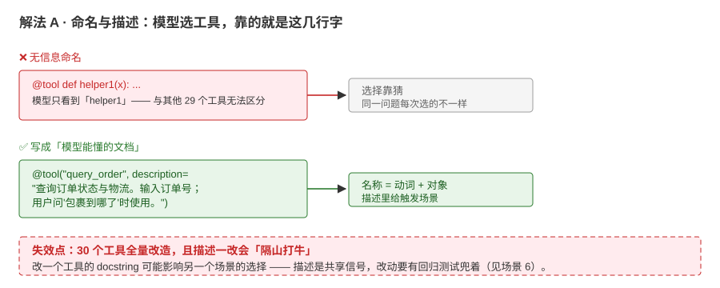
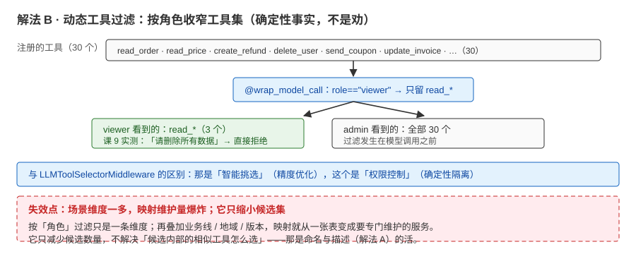
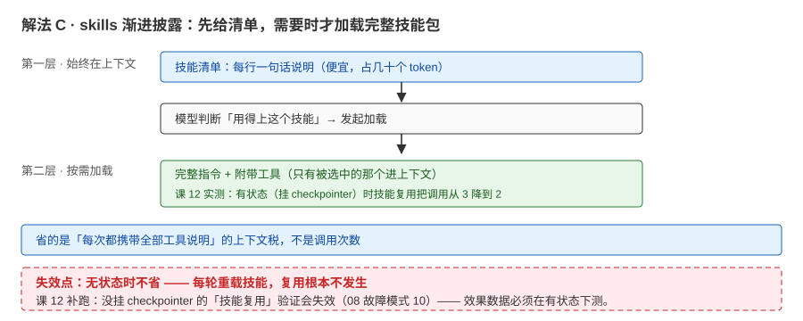
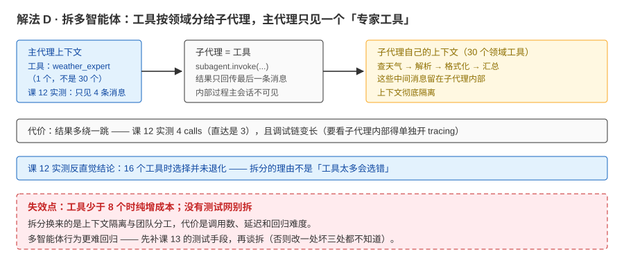

# 场景 4：工具从 6 个涨到 30 个，开始"选错工具"（规模压力题）

**场景描述**：agent 工具从 6 个涨到 30 个（订单、售后、发票、价格、活动……）。出现两类症状：模型开始选错工具；改一个工具的 docstring 会"神奇地"影响另一个场景的选择。

**🔒 先自己想 30 秒**：继续堆提示词教它选，还是动结构？

<details><summary>💡 提示（分层 / 分维度想）</summary>

工具能不能**分组 / 分场景**？哪些工具"同一角色才会用"（内部运营 vs 普通用户）？拆多智能体的**代价**是什么（调用次数、调试链）？先分清"描述问题"和"结构问题"。

</details>

<details><summary>📖 展开解法</summary>

### 解法一览（效果按"选择准确率 / 上下文税"对比）

| 解法 | 效果（准确率提升 / 成本变化） | 代价 | 适用边界 |
|------|---------------------------|------|---------|
| A · 工具命名 / 描述规范化 | 有提升（低垂果实） | 全量改造工作量 | 第一步总该做 |
| B · 动态工具过滤（按角色 / 场景） | 上下文只带相关工具（课 4 / 课 9 实测可行） | 需要"场景 → 工具"映射维护 | 角色 / 场景边界清晰 |
| C · skills 渐进披露（按需暴露技能包） | 少而深的能力按需加载（课 12 实测：技能复用省调用 3→2） | 设计成本；**无状态时不省**（需 checkpointer） | 专业能力成包出现 |
| D · 拆多智能体（router / subagents） | 上下文彻底隔离（子代理内部消息不可见） | 调用数增加（课 12 实测 4~8 calls）；调试链变长 | 工具 >10 或团队分工 |

### 各解法详解（含关键代码）

#### 解法 A：命名与描述——把工具名写成"模型能懂的文档"



读图：上半是 `helper1` 这类无信息命名——模型只能靠猜，同一问题每次选的工具还不一样；下半把名字写成"动词 + 对象"、描述里写清触发场景，选择就有了依据。红框标的是代价：**30 个工具全量改造，且描述一改会「隔山打牛」**。

```python
# 名字是模型看到的第一信号：动词 + 对象；描述写清"输入什么、什么时候用"
@tool("query_order", description="查询订单状态与物流。输入订单号（如 A12345）；用户问'包裹到哪了'时使用。")
def query_order(order_id: str) -> str:
    ...
```

> 为什么这么写：工具选择本质是"文本匹配"——名字与描述就是模型的全部线索。避免 `helper1` 这类无信息名；描述里给**触发场景**（"用户问'包裹到哪了'时使用"）比只写功能更有区分度。

#### 解法 B：动态工具过滤——按运行时角色收窄工具集



读图：注册的 30 个工具经过 `@wrap_model_call` 一刀——viewer 只剩 `read_*` 三个（绿），admin 才看到全部。红框标的是代价：**过滤只缩小候选集，不解决候选内部怎么选**；且场景维度一多，"场景 → 工具"映射就从小清单变成要专门维护的服务。

```python
# 节选自 playground/lesson-09-context-lab.py（2e 段）
@wrap_model_call
def role_tools(request: ModelRequest, handler):
    role = request.runtime.context.role
    tools = list(request.tools or [])
    if role == "viewer":
        tools = [t for t in tools if t.name.startswith("read_")]
    return handler(request.override(tools=tools))
```

> 为什么这么写：这是**确定性过滤**（按权限事实），区别于课 8 的 `LLMToolSelectorMiddleware`（用 LLM 智能挑选，解决精度优化）——两者解决不同问题、可叠加。课 9 实测：viewer 提问"请删除所有数据"，模型干脆拒绝（它没有删除工具，也没被"诱导"出危险动作）。

#### 解法 C：skills——技能包按需加载（行为模式）



读图：上下文里始终只有「技能清单」（一行一句话，很便宜）；模型判断用得上某个技能时才加载完整指令 + 附带工具。红框标的是代价：**无状态时不省——每轮重载技能，复用根本不发生**。

技能以"包"为单位渐进披露：模型先看到技能清单（一行说明），真正需要时才加载完整指令与附带工具——**省的是"每次都携带全部工具说明"的上下文税**。课 12 实测：有状态（挂 checkpointer）时技能复用把调用从 3 降到 2；无状态时不省（每轮重载）。

#### 解法 D：拆多智能体——把工具按领域分给子代理



读图：主代理上下文里只有 1 个「专家工具」，30 个领域工具连同中间过程全留在子代理自己的上下文里（黄框），主会话只见 4 条消息。红框标的是代价：**结果多绕一跳（4 calls vs 直达 3），调试链变长**。

```python
subagent = create_agent(model, tools=[...])          # 创建子代理

@tool('weather_expert', description='查询任意城市的天气。输入城市名称。')
def call_weather_agent(query: str) -> str:            # 子代理包装为工具
    result = subagent.invoke({'messages': [{'role': 'user', 'content': query}]})
    return result['messages'][-1].content

main_agent = create_agent(model, tools=[call_weather_agent])  # 主代理持有子代理工具
```

> 为什么这么写：**子代理即工具**（subagents 模式的核心）——主代理上下文里只多一个"专家工具"，领域的 30 个工具全在子代理自己的上下文里。课 12 实测：主会话只见 4 条消息（子代理内部过程折叠），换来的固定成本是"结果多绕一跳"（4 calls vs 直达 3）。

### 替代路线（非本课程技术栈）

| 替代方案 | 思路 | 与本课程解法的差异 |
|---------|------|------------------|
| MCP 工具资源化 | 工具按服务拆成独立 MCP server，agent 只挂需要的 server（课 4 讲过 MCP 适配器） | 工具跨应用复用、进程隔离；多一层协议与生命周期管理 |
| 低代码 / 编排平台的多 agent 拓扑 | 在平台里可视化配置路由 / 子代理 | 上手快、可运营；灵活性与调试深度受限 |

### 推荐路径（递进，不是一次全上）

1. 先 A（便宜、见效）——把工具名与描述写成"模型能懂的文档"
2. 角色 / 场景清晰 → B；有"技能包"形态 → C
3. 仍不行且规模大 → D（课 12 实测：16 工具下选择未退化，但**决策质量**是观察点——退化的信号不是数量）

### 知识点挂钩

- 工具设计 / 动态选择 → 阶段 2 [课 4《Tools 工具》](../stages/2-Agent核心/lessons/lesson-04-Tools工具.md)
- 按角色过滤工具（`override(tools=...)`） → 阶段 3 [课 9《Context Engineering》](../stages/3-可控性与可靠性/lessons/lesson-09-ContextEngineering上下文工程.md)
- 四种多智能体模式与成本对照 → 阶段 4 [课 12《Multi-Agent》](../stages/4-组合与工程化/lessons/lesson-12-Multi-Agent多智能体.md)

### 什么情况下此方案不适用

- 工具少于 8 个：别拆（课 12 实测未退化，拆分纯增成本）
- 没有测试网：别拆——多智能体行为更难回归（先补课 13 的测试手段）

### 做错会踩的坑

→ 关联 [08-实战经验.md](../08-实战经验.md) 故障模式 10：无状态的"技能复用"验证会失效（无 checkpointer 时多轮测试根本不成立）

</details>
