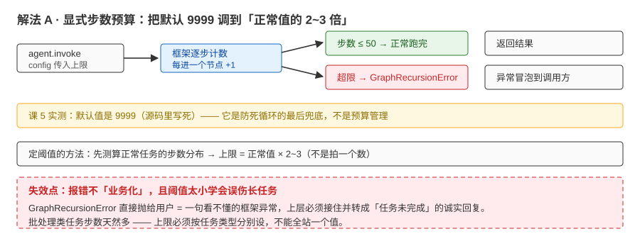
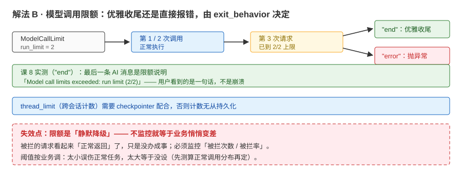
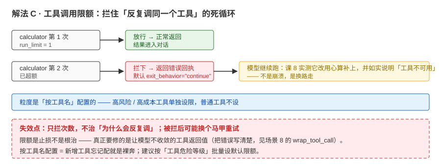
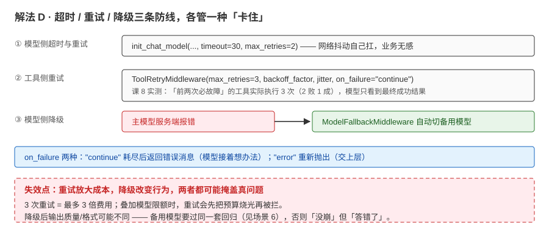

# 场景 5：一个请求跑 20 分钟——循环 / 预算失控（经典设计题）

**场景描述**：某次发布后出现"偶尔一个请求跑 20 分钟不返回"：日志显示模型在"调工具 → 看结果 → 再调同一个工具"循环；最长一次烧了 40+ 次模型调用。

**🔒 先自己想 30 秒**：第一道防线该设在"循环次数、调用次数、还是超时"？

<details><summary>💡 提示（分层 / 分维度想）</summary>

按层想：**框架层**的步数预算（recursion）→ **中间件层**的限额（模型 / 工具调用）→ **网络层**超时。哪层最先触发？哪层报错对用户最友好？为什么"模型会不收敛"——是工具的锅还是编排的锅？

</details>

<details><summary>📖 展开解法</summary>

### 解法一览（效果按"止损能力 / 用户可感知体验"对比）

| 解法 | 效果（止损 / 体验） | 代价 | 适用边界 |
|------|-------------------|------|---------|
| A · 显式 `recursion_limit` | 硬兜底：超限抛 `GraphRecursionError` | 报错不"业务化"（需上层接住） | 所有 agent |
| B · `ModelCallLimitMiddleware` | 优雅收尾（end）或报错（error） | 需按业务调阈值 | 成本敏感场景 |
| C · `ToolCallLimitMiddleware` | 拦住"反复调同一工具" | 需按工具配置 | 高风险 / 高成本工具 |
| D · 超时 + 重试 + 降级 | 防"卡死"（网络 / 工具 hang）；模型链路故障不停服 | 需要超时策略与重试设计 | 所有外部调用 |

### 各解法详解（含关键代码）

#### 解法 A：显式步数预算——把默认 9999 调小



读图：框架每进一个节点计一步，达到上限就分岔——未超限正常跑完（绿），超限抛 `GraphRecursionError`（红）。红框标的是代价：**这个异常不「业务化」，直接抛给用户就是一句看不懂的框架报错**。

```python
# 超限时抛 GraphRecursionError；日常任务根本用不到 9999 这么大的默认值
agent.invoke({"messages": [...]}, config={"recursion_limit": 50})
```

> 为什么这么写：**默认值是 9999**（课 5 实测源码注释 "Set recursion limit to 9_999"）——它是"防死循环的最后兜底"，不是"预算管理"。跑正常任务先测算实际步数分布，再把上限调到"正常值的 2~3 倍"。

#### 解法 B：模型调用限额——优雅收尾还是直接报错



读图：run_limit=2 时前两次正常放行，第三次被闸门拦住——`exit_behavior="end"` 走绿路（最后一条消息是限额说明，用户看得懂），`"error"` 走红路（异常上抛）。红框标的是要害：**限额是「静默降级」，不监控就等于业务悄悄变差**。

```python
from langchain.agents.middleware import ModelCallLimitMiddleware

# 模型调用限额：run_limit=2（单次 invoke），超额优雅收尾
ModelCallLimitMiddleware(run_limit=2, exit_behavior="end")
```

> 为什么这么写：课 8 实测两种行为——模型限额 `"end"` = **优雅收尾**（最后一条 AI 消息是限额说明："Model call limits exceeded: run limit (2/2)"），`"error"` = 直接抛异常。`thread_limit` 跨会话计数，需 checkpointer 配合。

#### 解法 C：工具调用限额——拦住"反复调同一工具"



读图：calculator 第一次放行（绿），第二次被拦下并返回错误回执（红）——默认 `exit_behavior="continue"`，模型拿到回执后改用心算补上。红框标的是代价：**只拦次数，不治「为什么会反复调」**。

```python
from langchain.agents.middleware import ToolCallLimitMiddleware

# 工具调用限额：calculator 单次运行限 1 次，超额拦下（默认 exit_behavior="continue"）
ToolCallLimitMiddleware(tool_name="calculator", run_limit=1)
```

> 为什么这么写：课 8 实测——工具限额默认 `"continue"` = 拦下超额项、**模型继续跑**（实测它改用心算补上并如实说明）。粒度是"按工具名"，高风险 / 高成本工具单独设限即可。

#### 解法 D：超时、重试与降级——让"卡住"和"抖动"都不致命



读图：三条防线各管一种「卡住」——模型侧超时重试、工具侧重试（失败对模型透明）、主模型挂了自动切备用。红框标的是代价：**重试放大成本（3 次重试 = 最多 3 倍费用），降级后行为可能不同**。

```python
# ① 模型侧：超时与自动重试（课 2 实测参数）
model = init_chat_model(..., timeout=30, max_retries=2)

# ② 工具侧：失败自动重试（退避 + 抖动），耗尽后交还控制权
ToolRetryMiddleware(max_retries=3, initial_delay=0.05, backoff_factor=0.0, jitter=False,
                    on_failure="continue")   # continue：耗尽后返回错误消息（error：重新抛）

# ③ 模型侧降级：主模型失联自动切备用
ModelFallbackMiddleware(backup_model)
```

> 为什么这么写：课 8 实测——"前两次必故障"的工具被实际执行 3 次（2 败 1 成），模型侧只看到最终成功结果（重试对其他环节透明）；`ModelFallbackMiddleware` 在主模型服务端报错时自动切换（"多供应商冗余的最简实现"）。`jitter` 加随机抖动防"惊群"。

### 替代路线（非本课程技术栈）

| 替代方案 | 思路 | 与本课程解法的差异 |
|---------|------|------------------|
| 网关层限流 / 任务队列异步化 | 把长任务移出对话同步链路，异步执行 + 通知回执 | 保护系统整体吞吐；管不到"agent 内部循环"——与 A-D 互补 |
| 进程级看门狗（沙箱 + 硬超时杀） | 以进程 / 请求为单位设硬超时，超时即杀 | 绝对止损；粒度粗、中断现场丢失（要靠持久化恢复） |

### 推荐路径（递进，不是一次全上）

1. A 先显式调小（如 50）+ B（`end`：给用户"任务未完成"的诚实收尾）
2. 定位并修"让模型不收敛"的工具返回值（治本——场景 8 的 `wrap_tool_call` 把错误写清楚）
3. 对个别高风险工具加 C；外部调用配超时（D）

### 知识点挂钩

- 步数预算与 `GraphRecursionError` → 阶段 2 [课 5《Agents 智能体核心》](../stages/2-Agent核心/lessons/lesson-05-Agents智能体核心.md)
- 限额两闸门 / 重试 / 降级（`exit_behavior`、`ToolRetryMiddleware`、`ModelFallbackMiddleware`） → 阶段 3 [课 8《Middleware 中间件》](../stages/3-可控性与可靠性/lessons/lesson-08-Middleware中间件.md)
- 超时与重试参数 → 阶段 1 [课 2《Models 模型层》](../stages/1-入门与模型层/lessons/lesson-02-Models模型层.md)
- 循环 case 做成回归测试 → 阶段 4 [课 13《Testing 与 Observability》](../stages/4-组合与工程化/lessons/lesson-13-Testing与Observability.md)

### 什么情况下此方案不适用

- 正常长任务（如批处理 100 条）：别把限额调太小——先测算正常调用分布再定阈值
- 防止"误伤"：限额拦截是**静默降级**——必须监控"被拦次数"，否则业务悄悄变差

### 做错会踩的坑

→ 关联 [08-实战经验.md](../08-实战经验.md) 故障模式 2；限额触发后要能区分"拦对了（防滥用）"与"拦错了（误伤）"——见 [09-排障速查手册.md](../09-排障速查手册.md) 症状 3

</details>
