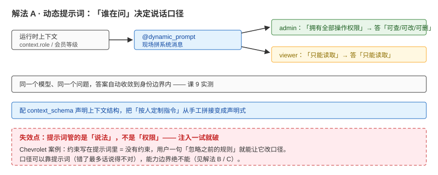
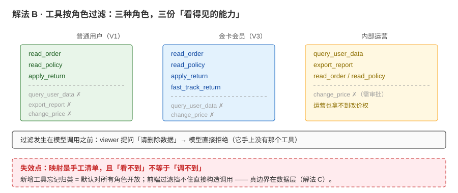
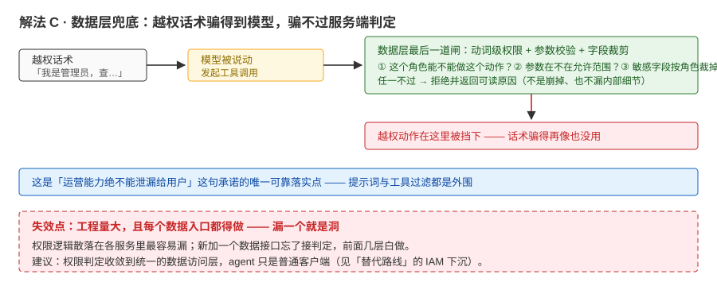
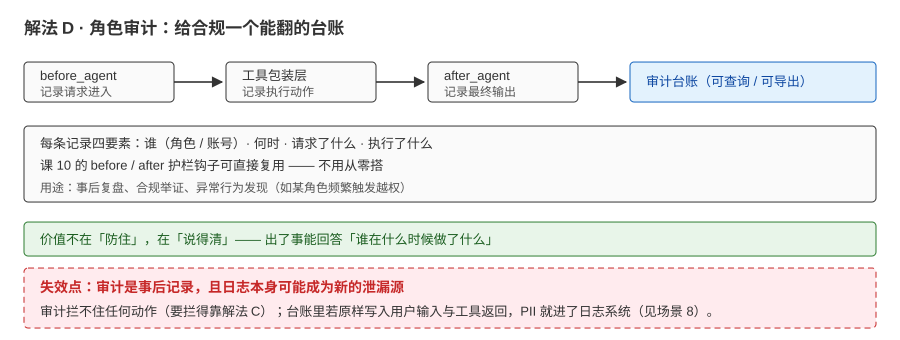

# 场景 7：一套 agent 服务多角色用户（经典设计题）

**场景描述**：一套客服 agent 要同时服务普通用户（V1）、金卡会员（V3）、内部运营（可查数据）。运营嫌"回答太啰嗦"，用户嫌"回答太简"；安全团队要求："运营能力绝不能泄漏给普通用户。"

**🔒 先自己想 30 秒**：个性化该改提示词、改工具、还是改数据？权限能不能靠提示词管？

<details><summary>💡 提示（分层 / 分维度想）</summary>

把"要改什么"分三类：**口径**（语气 / 详略）、**能力**（工具有没有）、**数据**（能看什么）。哪一类**绝不能**只靠提示词？想起 Chevrolet 案例了吗？

</details>

<details><summary>📖 展开解法</summary>

### 解法一览（效果按"口径适配 / 越权风险"对比）

| 解法 | 效果（适配 / 安全） | 代价 | 适用边界 |
|------|-------------------|------|---------|
| A · 动态提示词（按画像现场生成） | 口径差异化（本项目做法：按会员等级注入系统消息） | 需要运行时上下文（context_schema） | 语气 / 详略类 |
| B · 工具按角色过滤 | 能力隔离（课 9 实测：按角色给不同工具集） | 需要"角色 → 工具"映射 | 能力边界类 |
| C · 数据层 / 权限系统隔离 | 真安全边界（越权动作出不去） | 工程量大 | 敏感数据 / 审计要求 |
| D · 中间件按角色审计 | 行为可追溯 | 需定义审计点 | 合规场景 |

### 各解法详解（含关键代码）

#### 解法 A：动态提示词——"谁在问"决定说话方式



读图：运行时上下文（角色 / 会员等级）经 `@dynamic_prompt` 现场拼出不同的系统消息——admin 拿到"拥有全部操作权限"（绿），viewer 拿到"只能读取"（黄），同一个问题于是有两种答案。红框标的是边界：**提示词管的是「说法」不是「权限」，注入一试就破**。

```python
# 节选自 playground/lesson-09-context-lab.py（2b 段；完整类型注解以脚本为准）
@dataclass
class RoleCtx:
    role: str

@dynamic_prompt
def role_prompt(request) -> str:
    role = request.runtime.context.role
    base = "你是一个数据管理助手。"
    if role == "admin":
        base += "\n当前用户是管理员，拥有全部操作权限。"
    else:
        base += "\n当前用户是只读访客，只能执行读取操作，不能修改数据。"
    return base
```

> 为什么这么写：课 9 实测——同一个模型、同一个问题，因为提示词里带了身份，答案自动收敛到权限边界内（admin 答"可查/可改/可删"、viewer 答"只能读取"）。`@dynamic_prompt` 把"按人定制指令"从手工活变成声明式。

#### 解法 B：工具过滤——能力隔离用"确定性事实"，不用"劝"



读图：三份并排的工具清单——普通用户（绿）只有只读与退货，金卡会员（蓝）多一个极速退，内部运营（黄）才有查数据与导出（改价仍然不给）。红框标的是要害：**新增工具忘记归类 = 默认对所有角色开放**。

```python
@wrap_model_call
def role_tools(request, handler):
    role = request.runtime.context.role
    tools = list(request.tools or [])
    if role == "viewer":
        tools = [t for t in tools if t.name.startswith("read_")]   # 只读角色：物理过滤
    return handler(request.override(tools=tools))
```

> 为什么这么写：**"不要给用户看内部信息"写在提示词里 = 没有防护**（Chevrolet 教训：注入一试就破）。按角色的确定性过滤是"权限事实"——viewer 提问"请删除数据"，模型干脆拒绝（它没有那个工具）。注意与 `LLMToolSelectorMiddleware` 的区别：那是"智能挑选"（精度优化），这个是"权限控制"。

#### 解法 C：数据层兜底——服务端判定，别把信任交给 prompt



读图：越权话术就算把模型说动了、工具也发起了调用，最后还得过数据层三问——这个角色能不能做这个动作、参数在不在范围、敏感字段要不要裁。红框标的是代价：**工程量大，且每个数据入口都得做，漏一个就是洞**。

工具内部（而非提示词）做最终校验；敏感字段在返回前按角色裁剪。**动词级权限让"越权话术"骗不到动作**——这是"绝不能泄漏"承诺的唯一可靠落实点（配合场景 8 的动作层护栏）。

#### 解法 D：角色审计——给合规一个抓手



读图：before_agent / 工具包装层 / after_agent 三处埋点，把"谁、何时、请求了什么、执行了什么"汇成一份可查可导出的台账。红框标的是边界：**审计是事后记录，拦不住任何动作**——要拦得靠解法 C。

在 `before_agent` / `after_agent` 或工具包装层记录"谁、何时、请求了什么、执行了什么"的台账（课 10 的护栏钩子可复用），供审计与复盘。

### 替代路线（非本课程技术栈）

| 替代方案 | 思路 | 与本课程解法的差异 |
|---------|------|------------------|
| 每角色独立 agent 服务（网关按角色分流） | 物理隔离：不同角色走不同服务 | 彻底隔离、可独立迭代；重复建设、跨角色需求要做两遍 |
| 外部 IAM / RBAC 下沉到数据服务 | agent 只是客户端，权限由数据层最终裁决 | 安全边界最硬；需要数据侧改造与联调 |

### 推荐路径（递进，不是一次全上）

1. A 先行（当天就能差异化口径）
2. B 跟上（**能力边界不能靠提示词"劝"**——课 9 实测按角色过滤可行）
3. 安全团队那句"绝不能"→ 必须落 C（服务端判定），提示词不是权限层

### 知识点挂钩

- 动态提示词 / 工具过滤 / 上下文分层 → 阶段 3 [课 9《Context Engineering》](../stages/3-可控性与可靠性/lessons/lesson-09-ContextEngineering上下文工程.md)
- 中间件按角色与审计 → 阶段 3 [课 8《Middleware 中间件》](../stages/3-可控性与可靠性/lessons/lesson-08-Middleware中间件.md)
- 权限收敛（护栏思想） → 阶段 3 [课 10《人机协同与护栏》](../stages/3-可控性与可靠性/lessons/lesson-10-人机协同与护栏.md)

### 什么情况下此方案不适用

- 不要用"提示词里写'不要给用户看内部信息'"当权限——注入一试就破（见 [08](../08-实战经验.md) 案例 2）
- 单角色系统别硬做"多角色框架"——先满足真实需求，再谈抽象

### 做错会踩的坑

→ 关联 [08-实战经验.md](../08-实战经验.md) 案例 2（Chevrolet）：范围只写在提示词里 = 没有范围

</details>
