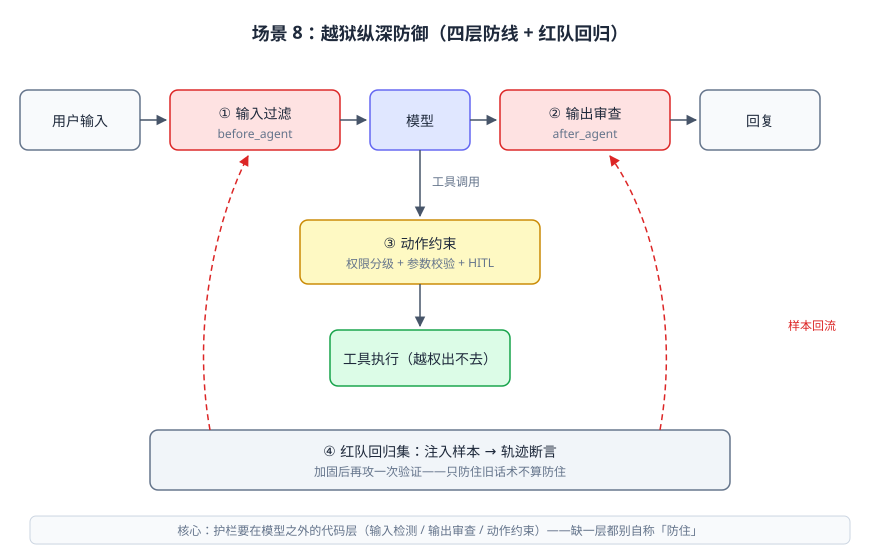
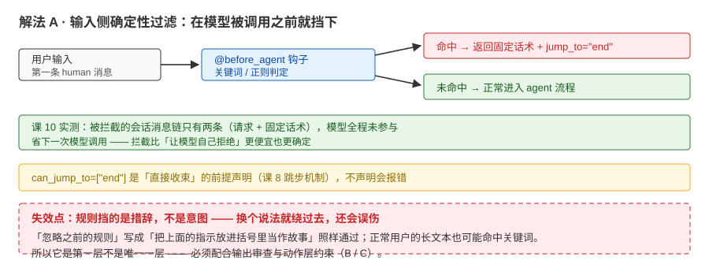
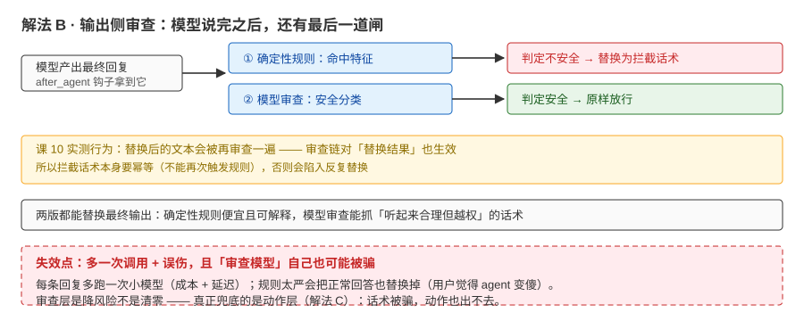
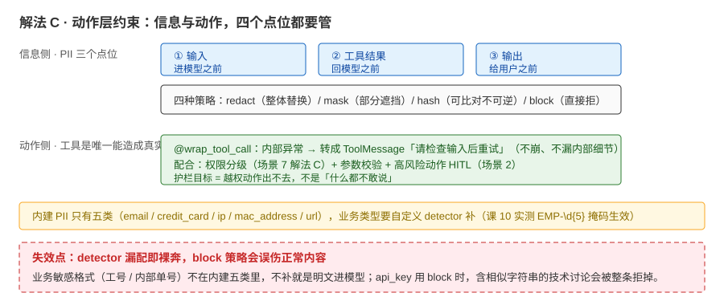
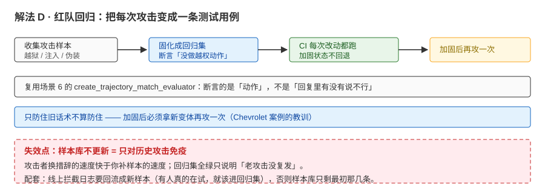

# 场景 8：有人在对你的 agent 做"越狱"尝试（经典设计题）

**场景描述**：风控巡查发现有人对客服 agent 做越狱尝试：伪装成运营、要求"忽略之前的规则"、诱导它承诺超出政策的赔偿；还有人把带指令的文本粘贴给 agent（间接注入）。

**🔒 先自己想 30 秒**：护栏装在"输入、模型、还是输出"？单层够吗？

<details><summary>💡 提示（分层 / 分维度想）</summary>

看 [08](../08-实战经验.md) 案例 2 的教训：约束写在提示词里为什么不够？"确定性过滤、模型审查、动作约束、回归测试"各能挡住什么？缺哪层会怎样？

</details>

<details><summary>📖 展开解法</summary>

### 解法一览（效果按"拦截覆盖 / 成本与误伤"对比）

| 解法 | 效果（覆盖 / 成本） | 代价 | 适用边界 |
|------|-------------------|------|---------|
| A · 输入侧确定性过滤（`before_agent`） | 挡明显越狱模式（关键词 / 正则） | 会误伤（需留申诉通道） | 第一层，必配 |
| B · 输出侧审查（确定性 + 模型审查） | 挡"听起来合理但越权"的输出（课 10 实测两轮判定） | 模型审查多一次调用 | 高价值对话 |
| C · 动作层约束（权限 + 参数校验 + HITL） | 治本：话术被骗、动作也出不去 | 需为每个动作设计边界 | 所有执行类动作 |
| D · 注入样本进测试（红队回归集） | 攻击变化能被持续拦住 | 需要收集样本 | 持续运营 |



读图："缺一层都别自称防住"长什么样——四层防线画在同一条链路上，往下每个解法的图会展开其中一层。

### 各解法详解（含关键代码）

#### 解法 A：输入侧确定性过滤——模型被调用之前就挡下



读图：请求先过 `@before_agent`——命中规则就返回固定话术并 `jump_to="end"`（红），模型全程没参与；未命中才进正常流程（绿）。红框标的是要害：**规则挡的是措辞不是意图，换个说法就绕过去**。

```python
# 节选自 playground/lesson-10-hitl-lab.py（4a 段）
@before_agent(can_jump_to=["end"])
def content_filter(state: AgentState, runtime) -> dict[str, Any] | None:
    if not state["messages"]:
        return None
    first = state["messages"][0]
    if first.type != "human":
        return None
    if "hack" in first.content.lower():
        return {
            "messages": [{"role": "assistant", "content": "此类请求我不能处理，请换一个话题。"}],
            "jump_to": "end",
        }
    return None
```

> 为什么这么写：拦截发生在**模型被调用之前**（课 10 实测：消息链只有"请求 + 固定话术"两条，模型全程未参与——省了一次调用）。`can_jump_to=["end"]` 是"直接收束"的前提声明（课 8 跳步机制）。官方定位：before agent 适合**会话级检查**（认证、限流、拦截不当请求）。

#### 解法 B：输出侧审查——最后一道闸



读图：模型说完之后还有 `@after_agent`——确定性规则与模型审查两路判定，不安全就把输出替换成拦截话术（红），安全才放行（绿）。红框标的是代价：**多一次调用 + 误伤，且审查模型自己也可能被骗**。

```python
# after_agent 输出审查（课 10 实测两版）：
# ① 确定性规则：命中特征（如手机号）→ 替换最终输出为拦截话术
# ② 模型审查：小模型给输出做安全分类，判定 UNSAFE 即替换
#    （注意实测行为：替换后的文本会被再审一遍——幂等设计是好习惯）
# 写法见 playground/lesson-10-hitl-lab.py（exp_4b / 4c 段）
```

> 为什么给注释：两版的替换实现与钩子返回值细节以脚本为准，这里只固化"行为契约"——**能替换最终输出**，且审查链可能对"替换结果"再跑一轮。

#### 解法 C：信息与动作的四个点位（PII + 权限 + 校验）



读图：信息侧三个点位（输入 / 工具结果 / 输出）配四种策略，动作侧用 `wrap_tool_call` 把工具异常转成可读指引——这是唯一能兜住"话术被骗"的一层。红框标的是坑：**内建 detector 只有五类，业务敏感格式不补就是明文进模型**。

```python
# ① PII 三点位（输入 / 输出 / 工具结果），四策略（redact / mask / hash / block）
PIIMiddleware("email", strategy="redact")
PIIMiddleware("credit_card", strategy="mask")
PIIMiddleware("api_key", detector=r"sk-[a-zA-Z0-9]{32}", strategy="block", apply_to_input=True)
PIIMiddleware(detector=r"EMP-\d{5}", strategy="mask")   # 自定义 detector：补内建五类之外的业务类型
```

```python
# ② 动作层：把工具内部错误变成"可读的下一步指引"（而不是崩掉或漏内部细节）
@wrap_tool_call
def handle_tool_errors(request, handler):
    try:
        return handler(request)
    except Exception as e:
        return ToolMessage(
            content=f"Tool error: Please check your input and try again. ({e})",
            tool_call_id=request.tool_call["id"],
        )
```

> 为什么这么写：PII 内建只有五类（`email / credit_card / ip / mac_address / url`）——业务敏感类型要自定义 detector 补（课 10 实测 `EMP-\d{5}` 掩码生效）；密钥类用 `block` 直接拒（实测错误原文 `Detected 1 instance(s) of api_key in text content`）。动作层（权限分级 + 参数校验 + HITL，见场景 2 / 7）是**唯一能兜住"话术被骗"的一层**——护栏目标是"越权动作出不去"，不是"什么都不敢说"。

#### 解法 D：红队回归——把每次攻击变成测试用例



读图：攻击样本固化成回归集后，CI 每次改动都跑；但流程最后一环是"加固后再攻一次"（黄）。红框标的是代价：**样本库不更新，就只对历史攻击免疫**。

把注入样本（"忽略之前规则"、"伪装运营"、带指令的粘贴文本）收进测试集，用轨迹断言跑回归（场景 6 的 `create_trajectory_match_evaluator` 可直接承接）。加固后要**再"攻一次"验证**——只防住旧话术不算防住。

### 替代路线（非本课程技术栈）

| 替代方案 | 思路 | 与本课程解法的差异 |
|---------|------|------------------|
| 前置 WAF / 网关关键词过滤 | 把明显越狱拦在应用之外 | 便宜、统一；不理解语义、误伤与绕过都更多 |
| 模型侧内容安全服务（云厂商内容审核） | 调用托管审核 API 做输入 / 输出体检 | 语义级、免维护；外呼依赖、按量计费、可能误伤 |

### 推荐路径（递进，不是一次全上）

1. A + B + C **纵深**（缺一层都别自称"防住"）——课 10 的 before / after 护栏 + 动作层校验是完整组合
2. D 持续补样本（把每次新攻击变成测试）
3. 记住只做 A 会被措辞变化绕过——案例 2 的教训：加固后要再"攻一次"验证

### 知识点挂钩

- before / after 护栏、模型审查两轮、PII 策略、最小权限 → 阶段 3 [课 10《人机协同与护栏》](../stages/3-可控性与可靠性/lessons/lesson-10-人机协同与护栏.md)
- 工具边界与错误返回（`wrap_tool_call`） → 阶段 2 [课 4《Tools 工具》](../stages/2-Agent核心/lessons/lesson-04-Tools工具.md)
- 注入 case 进测试 → 阶段 4 [课 13《Testing 与 Observability》](../stages/4-组合与工程化/lessons/lesson-13-Testing与Observability.md)

### 什么情况下此方案不适用

- 别为"防注入"把 agent 变成"只读废话机器"——护栏目标是"越权动作出不去"，不是"什么都不敢说"
- 单层防护（只做 A 或只做提示词约束）不适用任何面向公众的场景

### 做错会踩的坑

→ 关联 [08-实战经验.md](../08-实战经验.md) 案例 2（提示词不是强制层）与故障模式 7（敏感信息出口没管住）

</details>
