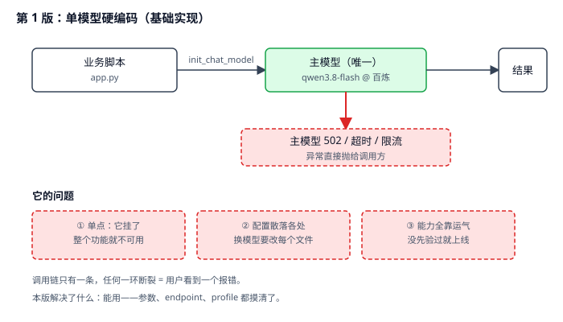
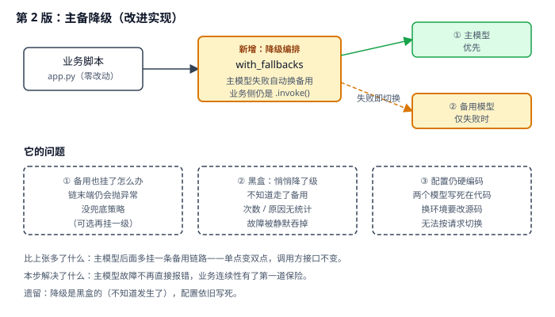
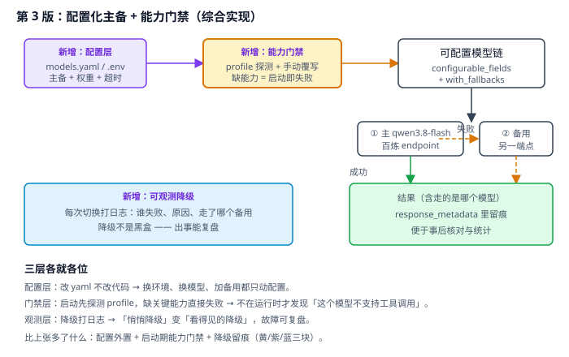

# 实战 2：给模型接入加一道「主备保险」

> 配套课程：[第 2 课：Models 模型层](../stages/1-入门与模型层/lessons/lesson-02-Models模型层.md) ｜ 把知识点组装成可落地工作流：每步配设计图与代码（示例级，保证正确、可直接改用）

## 场景

你用 `init_chat_model` 接上了百炼的 `qwen3.8-flash`，客服 agent 跑得好好的。某天下午模型端点 502，用户端直接白屏报错；运维问你「有没有备用」，你说「代码里就写了一个模型」。——演进目标就是把这个「单点」变成「主备 + 可配置 + 有能力门禁」的接入层。

## 全貌一句话

生产级接入还包括负载均衡、按成本路由、多租户配额、A/B 实验平台——属平台工程话题（非本课范围，点到为止）。本篇聚焦**一个人也能搭起来的最小可用集**：主备降级 + 配置外置 + 能力门禁。

## 第 1 版：单模型硬编码（基础实现）



> 读图：业务脚本直接 `init_chat_model` 出一个模型，调用链只有一条；下方红框是它挂掉时的情形——异常一路抛给调用方。

```python
# app.py：第 1 版，单模型硬编码
import os

from dotenv import load_dotenv
from langchain.chat_models import init_chat_model

load_dotenv()

model = init_chat_model(
    "qwen3.8-flash",
    model_provider="openai",
    base_url=os.environ["BAILIAN_BASE_URL"],
    api_key=os.environ["BAILIAN_API_KEY"],
)

print(model.invoke("你好").content)
```

**它的问题**：模型是**单点**——它 502 / 超时 / 被限流，整个功能就不可用，用户看到的是一串异常；模型配置散落在每个脚本里，换模型要改 N 个文件；「这个模型到底支不支持工具调用」从来没先验过，上线靠运气。

## 第 2 版：主备降级（改进实现）

第 1 版有一条马上能治：**业务不该只依赖一个模型**。LangChain 的 `with_fallbacks` 把「主模型失败就换下一个」变成一行——业务侧 `.invoke()` 完全不变：



> 读图：比上张多了右侧的「降级编排」框——主模型失败时自动切到备用模型；业务脚本零改动。下方三个红框是本版遗留问题。

```python
# model_chain.py：第 2 版，主备降级
import os

from dotenv import load_dotenv
from langchain.chat_models import init_chat_model

load_dotenv()

primary = init_chat_model(
    "qwen3.8-flash",
    model_provider="openai",
    base_url=os.environ["BAILIAN_BASE_URL"],
    api_key=os.environ["BAILIAN_API_KEY"],
    timeout=30,
    max_retries=2,
)

backup = init_chat_model(
    "qwen3.8-flash",
    model_provider="openai",
    base_url=os.environ["BACKUP_BASE_URL"],
    api_key=os.environ["BACKUP_API_KEY"],
    timeout=30,
    max_retries=2,
)

# 主模型抛任何异常 → 自动改用备用；调用方仍是 model.invoke(...)
model = primary.with_fallbacks([backup])

print(model.invoke("你好").content)
```

> 实测确认（本机 langchain 1.4.0）：`with_fallbacks(fallbacks, *, exceptions_to_handle=(Exception,), exception_key=None)`；用假模型模拟主模型抛 `RuntimeError`，结果确实返回了备用模型的内容。

**它的问题**：**降级是黑盒的**——你不知道刚才那次是不是走了备用、为什么走，故障被静默吞掉，事后无从复盘；备用也挂了仍然会抛异常（链末端没有兜底）；两个模型依旧写死在代码里，换环境要改源码。

## 第 3 版：配置化 + 能力门禁（综合实现）

黑盒和配置散落这两条，靠**配置外置**和**启动期门禁**一起治：模型清单写进配置，启动时先验能力、再装配降级链，每次降级打日志。



> 读图：比上张多了三块——紫色的配置层（yaml/env）、黄色的能力门禁（启动期 profile 探测）、蓝色的可观测降级（每次切换留痕）。三层各就各位，互不替代。

**① 配置外置**（改配置不改代码）：

```yaml
# models.yaml
default:
  model: qwen3.8-flash
  model_provider: openai
  base_url_env: BAILIAN_BASE_URL
  api_key_env: BAILIAN_API_KEY
  timeout: 30
  max_retries: 2
  profile:            # 手动覆写：自建/网关模型查不到 profile（本课实测返回 None）
    max_input_tokens: 100000
    tool_calling: true
fallbacks:
  - model: qwen3.8-flash
    model_provider: openai
    base_url_env: BACKUP_BASE_URL
    api_key_env: BACKUP_API_KEY
    timeout: 30
    max_retries: 2
    profile:
      max_input_tokens: 100000
      tool_calling: true
required_capabilities: [tool_calling]   # 缺这项能力 = 启动即失败
```

**② 装配 + 能力门禁 + 降级留痕**：

```python
# model_chain.py：第 3 版，配置化 + 能力门禁 + 可观测降级
import logging
import os
from functools import partial

import yaml
from dotenv import load_dotenv
from langchain.chat_models import init_chat_model
from langchain_core.runnables import RunnableLambda

load_dotenv()
log = logging.getLogger("model")


def build_model(cfg: dict):
    """按一份配置造一个模型；密钥从环境变量取，不落配置文件。"""
    return init_chat_model(
        cfg["model"],
        model_provider=cfg["model_provider"],
        base_url=os.environ[cfg["base_url_env"]],
        api_key=os.environ[cfg["api_key_env"]],
        timeout=cfg.get("timeout", 30),
        max_retries=cfg.get("max_retries", 2),
        profile=cfg.get("profile"),          # None 表示沿用模型自带档案
    )


def check_capabilities(model, required: list[str], label: str) -> None:
    """能力门禁：缺关键能力就在装配期失败，别等运行时才发现。"""
    profile = model.profile or {}
    missing = [cap for cap in required if not profile.get(cap)]
    if missing:
        raise RuntimeError(
            f"{label} 缺少必需能力 {missing}；"
            f"profile={profile}（自建/网关模型通常返回 None，请在配置里手动覆写 profile）"
        )


def logged_fallback(label: str, model):
    """给备用模型包一层：切换时打日志，让降级不再是黑盒。"""
    def _run(messages, **kwargs):
        log.warning("[model] 主模型失败，降级到 %s", label)
        result = model.invoke(messages, **kwargs)
        log.info("[model] 已由 %s 返回结果", label)
        return result
    return RunnableLambda(_run)


def build_chain(config_path: str = "models.yaml"):
    cfg = yaml.safe_load(open(config_path, encoding="utf-8"))
    required = cfg.get("required_capabilities", [])

    primary = build_model(cfg["default"])
    check_capabilities(primary, required, "主模型")

    fallbacks = []
    for i, fb_cfg in enumerate(cfg.get("fallbacks", []), start=1):
        fb = build_model(fb_cfg)
        check_capabilities(fb, required, f"备用模型 #{i}")
        fallbacks.append(logged_fallback(fb_cfg["model"], fb))

    return primary.with_fallbacks(fallbacks)


model = build_chain()
print(model.invoke("你好").content)
```

> 实测确认：`init_chat_model(..., profile={...})` 手动覆写生效（传入后 `model.profile` 返回该字典，不传时为 `None`）；`logged_fallback` 包装在假模型降级实验中正常打印日志并返回备用结果。

**③ 为什么门禁要放在装配期**：模型能力（能不能调工具、能不能看图）是**出厂属性**，不会因为你调用得好就变有。第 1 版把它留到运行时才发现，代价是用户先撞上错误；放到装配期，代价只是服务启动失败——**失败越早越便宜**。

## 🎯 会用标志

做到这三条，就算把本课「用起来了」：

1. 给你一个只接了单个模型的脚本，能改出「主 + 备」的降级链，且调用方代码不变；
2. 能把模型配置从代码里抽到配置文件，换环境只改配置、不改源码；
3. 能在装配期用 `profile` 做能力门禁，并说清「自建/网关模型 profile 为 None 时该怎么处理」。

---

⬅️ **上一课**：课 1 未配实战篇（导论课，无两跳演进可走）
➡️ **下一课**：[实战 3：把多轮对话历史存下来并能回放](03-Messages消息体系.md)
