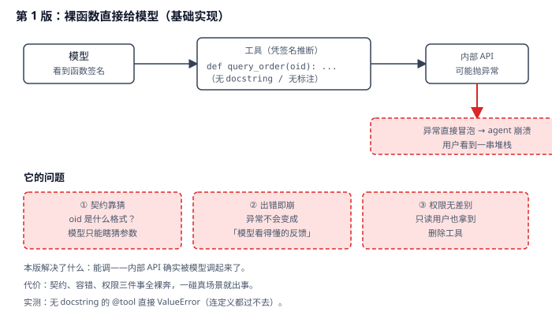
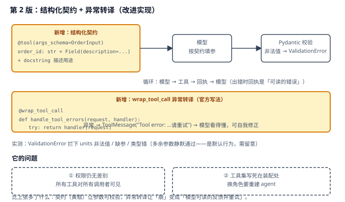
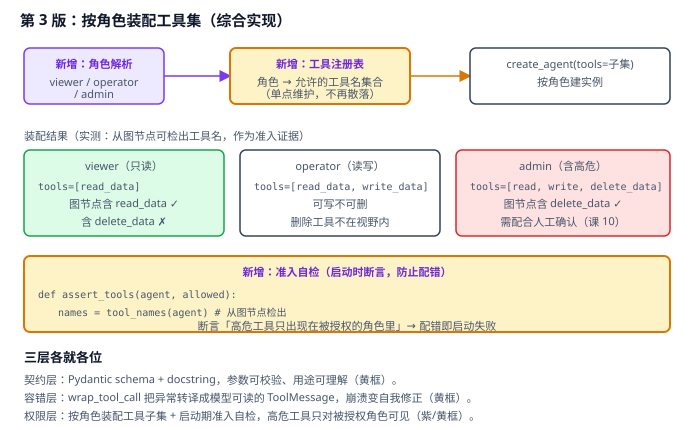

# 实战 4：把内部订单 API 变成 agent 敢用的工具

> 配套课程：[第 4 课：Tools 工具](../stages/2-Agent核心/lessons/lesson-04-Tools工具.md) ｜ 把知识点组装成可落地工作流：每步配设计图与代码（示例级，保证正确、可直接改用）

## 场景

你把一个内部订单查询 API 包成函数丢给模型，它能调起来——但很快出事：模型传了个 `oid="A1024 号订单"` 这种脏参数；下游 500 时异常直接冒泡，整个 agent 崩溃、用户看到一串堆栈；更糟的是只读运营的同学也能触发删除接口。——演进目标就是把「裸函数」变成「契约清晰、出错能自愈、按角色可见」的生产级工具。

## 全貌一句话

生产级工具治理还包括工具市场与权限中台、调用审计与配额、工具版本灰度、跨服务鉴权透传——属平台工程话题（非本课范围，点到为止）。本篇聚焦**一个人也能搭起来的最小可用集**：结构化契约 + 异常转译 + 按角色准入。

## 第 1 版：裸函数直接给模型（基础实现）



> 读图：模型凭函数签名推断怎么调，下游一抛异常就直接冒泡到 agent；下方三个红框是它的短板——契约靠猜、出错即崩、权限无差别。

```python
# tools_v1.py：第 1 版，裸函数当工具
import os

from dotenv import load_dotenv
from langchain.agents import create_agent
from langchain.chat_models import init_chat_model
from langchain.tools import tool

load_dotenv()


@tool
def query_order(oid):
    """查询订单。"""
    return internal_api.get(oid)          # 下游可能抛异常


model = init_chat_model(
    "qwen3.8-flash",
    model_provider="openai",
    base_url=os.environ["BAILIAN_BASE_URL"],
    api_key=os.environ["BAILIAN_API_KEY"],
)
agent = create_agent(model, tools=[query_order])

result = agent.invoke({"messages": [{"role": "user", "content": "查一下订单 A1024"}]})
print(result["messages"][-1].content)
```

**它的问题**：**契约靠猜**——`oid` 该传 `"A1024"` 还是 `1024`？没有描述，模型只能瞎猜（实测：不带 docstring 的 `@tool` 连定义都过不去，直接 `ValueError: Function must have a docstring`）；**出错即崩**——异常不会自动变成「模型看得懂的反馈」，一路冒泡打断 agent；**权限无差别**——所有工具对所有调用者一视同仁，只读角色也拿得到删除工具。

## 第 2 版：结构化契约 + 异常转译（改进实现）

前两条病根同源——**工具对模型而言是「不透明的黑盒调用」**。用 Pydantic schema 把契约写清楚，再用 `wrap_tool_call` 把异常翻译成模型能读懂的回执：



> 读图：比上张多了黄色两块——结构化契约（参数可校验）与异常转译（异常 → ToolMessage → 模型自我修正）。红框是本版遗留：权限仍无差别。

```python
# tools_v2.py：第 2 版，结构化契约 + 异常转译
import os
from collections.abc import Callable
from typing import Literal

from dotenv import load_dotenv
from langchain.agents import create_agent
from langchain.agents.middleware import wrap_tool_call
from langchain.chat_models import init_chat_model
from langchain.messages import ToolMessage
from langchain.tools import tool
from langchain.tools.tool_node import ToolCallRequest
from pydantic import BaseModel, Field

load_dotenv()


class OrderInput(BaseModel):
    """订单查询入参。"""

    order_id: str = Field(
        description="订单号，格式为大写字母 + 4 位数字，例如 A1024、B2048"
    )
    include_shipping: bool = Field(default=False, description="是否含运费明细")


@tool(args_schema=OrderInput)
def query_order(order_id: str, include_shipping: bool = False) -> str:
    """查询订单明细，返回商品、单价、数量、运费（不含总价）。"""
    orders = {
        "A1024": "订单 A1024：机械键盘 x2，单价 349 元；运费 12 元",
        "B2048": "订单 B2048：显示器支架 x1，单价 199 元；运费 0 元",
    }
    if order_id not in orders:
        raise ValueError(f"未找到订单 {order_id}")      # 业务异常
    return orders[order_id]


@wrap_tool_call
def handle_tool_errors(request: ToolCallRequest, handler: Callable) -> ToolMessage:
    """把工具异常转成模型能读懂的 ToolMessage（官方工具页写法）。"""
    try:
        return handler(request)
    except Exception as e:
        return ToolMessage(
            content=f"Tool error: 请检查输入后重试。（{e}）",
            tool_call_id=request.tool_call["id"],
        )


model = init_chat_model(
    "qwen3.8-flash",
    model_provider="openai",
    base_url=os.environ["BAILIAN_BASE_URL"],
    api_key=os.environ["BAILIAN_API_KEY"],
)
agent = create_agent(model, tools=[query_order], middleware=[handle_tool_errors])
```

> 实测确认：`args_schema` 生效（`properties` 含 `order_id` / `include_shipping`，`required` 为 `['order_id']`）；非法枚举值、缺参、类型错三种情况均被 `ValidationError` 拦下；`wrap_tool_call` 修饰的 `handle_tool_errors` 可正常装配进 `create_agent(middleware=[...])`。
>
> ⚠️ **实测发现的一个默认行为**：**多余参数不会被拦**——传 `{"order_id": "A1024", "extra": 1}` 时能正常通过（Pydantic 默认忽略额外字段）。需要严格模式请在 schema 上加 `model_config = ConfigDict(extra="forbid")`。

**它的问题**：**权限仍无差别**——所有工具对所有调用者可见，只读角色照样能看到删除工具；工具集写死在装配处，换角色要重建 agent。

## 第 3 版：按角色装配工具集（综合实现）

权限这条靠**按角色装配子集**治：注册表里声明「哪个角色能用哪些工具」，启动时断言高危工具没有泄漏到不该有的角色。



> 读图：比上张多了紫色的角色解析与工具注册表、黄色的准入自检。三个角色各自拿到不同工具子集，配错即启动失败。

```python
# tools_v3.py：第 3 版，按角色装配 + 准入自检
from langchain.agents import create_agent
from langchain.tools import tool


@tool
def read_data(table: str) -> str:
    """读取数据表内容。"""
    return f"（{table} 表数据：128 行）"


@tool
def write_data(table: str, value: str) -> str:
    """写入数据表。"""
    return f"（已写入 {table}）"


@tool
def delete_data(table: str) -> dict:
    """删除数据表的全部数据（高危操作）。"""
    return {"deleted": True, "table": table, "rows": 128}


# ① 工具注册表：角色 → 允许的工具（单点维护）
REGISTRY: dict[str, list] = {
    "viewer": [read_data],                              # 只读
    "operator": [read_data, write_data],                # 读写
    "admin": [read_data, write_data, delete_data],      # 含高危
}
DANGEROUS = {"delete_data"}


def tool_names(agent) -> set[str]:
    """从编译后的图节点检出实际装配的工具名（可实测的准入证据）。"""
    node_repr = repr(agent.get_graph().nodes["tools"].data)
    return {t.name for t in (read_data, write_data, delete_data) if t.name in node_repr}


def build_agent(role: str, model, **kwargs):
    """按角色建 agent；装配完立刻自检，配错即启动失败。"""
    if role not in REGISTRY:
        raise ValueError(f"未知角色 {role}，可选：{list(REGISTRY)}")

    agent = create_agent(model, tools=REGISTRY[role], **kwargs)

    if role != "admin":
        leaked = tool_names(agent) & DANGEROUS
        if leaked:
            raise RuntimeError(f"角色 {role} 不应持有高危工具 {leaked}（注册表配错了）")
    return agent


# 用法
# agent = build_agent(current_user.role, model)
```

> 实测确认（三个角色各建一次）：`viewer → ['read_data']`、`operator → ['read_data', 'write_data']`、`admin → ['delete_data', 'read_data', 'write_data']`；**故意给 viewer 塞 `delete_data` 时，自检抛 `RuntimeError: 角色 viewer 不应持有高危工具 {'delete_data'}`** —— 准入证据真实可得。
>
> 📌 关于「按角色动态选择」：本课脚本演示的是**建两个 agent 实例**（`viewer_agent` / `admin_agent`）分别装配不同工具集——这是最直观、最不容易出错的做法。若要在**运行时**按角色切换，走 `@wrap_model_call` 拦截请求、`request.override(...)` 换模型/工具（课 5 有同款写法），但复杂度更高；**先从多实例起步**。

**为什么准入要放在启动期**：高危工具泄漏属于**配置错误**，不是运行时偶发故障。放到启动期断言，代价是服务起不来；放到运行时才发现，代价是数据已经被删了——**失败越早越便宜**（与课 2 的能力门禁同理）。

## 🎯 会用标志

做到这三条，就算把本课「用起来了」：

1. 给你一个裸函数工具，能用 `args_schema` + docstring 写出模型看得懂的契约，并说清不带 docstring 会怎样；
2. 能用 `wrap_tool_call` 把工具异常转成模型可读的 `ToolMessage`，让 agent 从「崩溃」变成「自我修正」；
3. 能按角色装配不同工具子集，并写出启动期准入自检、说清为什么高危工具泄漏要在启动期拦。

---

⬅️ **上一课**：[实战 3：把多轮对话历史存下来并能回放](03-Messages消息体系.md)
➡️ **下一课**：实战 5（Agents 智能体核心）待编写
