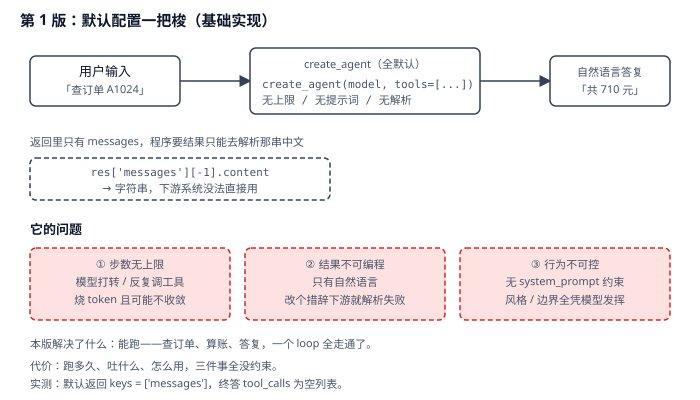
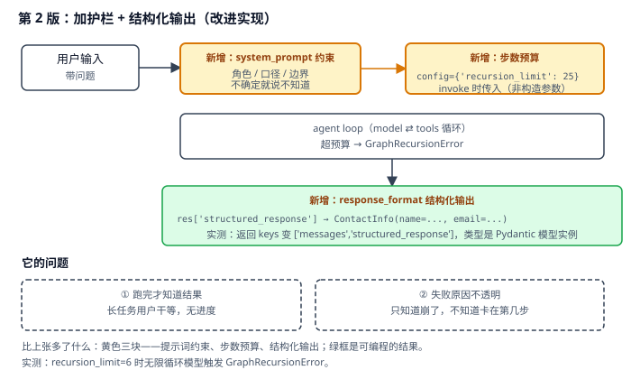
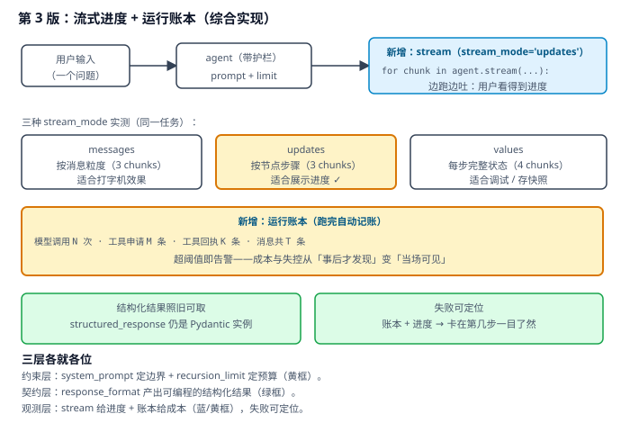

# 实战 5：让客服 agent 跑得可控、结果可接、过程可见

> 配套课程：[第 5 课：Agents 智能体核心](../stages/2-Agent核心/lessons/lesson-05-Agents智能体核心.md) ｜ 把知识点组装成可落地工作流：每步配设计图与代码（示例级，保证正确、可直接改用）

## 场景

你用 `create_agent` 三行搭出客服 agent，查订单、算总价、答复用户，本地跑得漂亮。上线后翻车：一个模糊问题让它在两个工具间反复横跳，烧掉几十次模型调用才收敛；下游系统要拿金额，只能去正则解析「共 710 元」这句中文，措辞一改就崩；用户盯着空白页面等二十秒，以为服务挂了。——演进目标就是把「能跑」变成「跑得可控、结果可接、过程可见」。

## 全貌一句话

生产级 agent 工程还包括评估与回归测试集、成本归因与配额、灰度与回滚、多租户隔离——属平台工程话题（非本课范围，点到为止）。本篇聚焦**一个人也能搭起来的最小可用集**：护栏约束 + 结构化输出 + 流式与账本。

## 第 1 版：默认配置一把梭（基础实现）



> 读图：全默认装配，输入直接进 agent、输出一句自然语言；下方三个红框是它的短板——步数无上限、结果不可编程、行为不可控。

```python
# agent_v1.py：第 1 版，默认配置一把梭
import os

from dotenv import load_dotenv
from langchain.agents import create_agent
from langchain.chat_models import init_chat_model
from langchain.tools import tool

load_dotenv()


@tool
def get_order(order_id: str) -> str:
    """查询订单明细，返回商品、单价、数量、运费（不含总价）。"""
    orders = {
        "A1024": "订单 A1024：机械键盘 x2，单价 349 元；运费 12 元",
        "B2048": "订单 B2048：显示器支架 x1，单价 199 元；运费 0 元",
    }
    return orders.get(order_id, f"未找到订单 {order_id}")


@tool("calculator", description="执行四则运算。任何数学计算都必须用它。")
def calc(expression: str) -> str:
    """Evaluate mathematical expressions."""
    allowed = set("0123456789+-*/(). ")
    if set(expression) - allowed:
        return "仅支持数字与 +-*/() 运算"
    return str(eval(expression, {"__builtins__": {}}, {}))


model = init_chat_model(
    "qwen3.8-flash",
    model_provider="openai",
    base_url=os.environ["BAILIAN_BASE_URL"],
    api_key=os.environ["BAILIAN_API_KEY"],
)

agent = create_agent(model, tools=[get_order, calc])
result = agent.invoke(
    {"messages": [{"role": "user", "content": "帮我算下订单 A1024 一共要付多少钱（含运费）"}]}
)
print(result["messages"][-1].content)
```

**它的问题**：**步数无上限**——模型在工具间打转时没有任何东西拦它，烧完 token 还不一定收敛；**结果不可编程**——返回只有 `['messages']`，下游要金额只能解析中文字符串（实测：默认 `result.keys() == ['messages']`）；**行为不可控**——没有 `system_prompt`，风格与边界全凭模型发挥。

## 第 2 版：加护栏 + 结构化输出（改进实现）

三条病根分别对应三个装配参数：用 `system_prompt` 定行为边界，用 `config` 传步数预算，用 `response_format` 要结构化结果：



> 读图：比上张多了黄色三块——提示词约束、步数预算、结构化输出；绿框是可编程的结果。红框是本版遗留：跑完才知道结果。

```python
# agent_v2.py：第 2 版，护栏 + 结构化输出
from pydantic import BaseModel, Field


class OrderTotal(BaseModel):
    """订单总价结果。"""

    order_id: str = Field(description="订单号")
    total: float = Field(description="含运费的总金额（元）")
    currency: str = Field(default="CNY", description="币种")


SYSTEM_PROMPT = """你是电商客服的订单助手。
- 只回答与订单查询、金额计算相关的问题，其他一律回复「这超出我的处理范围」。
- 金额必须由 calculator 工具计算，不要心算。
- 信息不足时直接说缺什么，不要猜测。"""

agent = create_agent(
    model,
    tools=[get_order, calc],
    system_prompt=SYSTEM_PROMPT,
    response_format=OrderTotal,
)

result = agent.invoke(
    {"messages": [{"role": "user", "content": "帮我算下订单 A1024 一共要付多少钱（含运费）"}]},
    config={"recursion_limit": 25},        # 步数预算：invoke 时传，非构造参数
)

print(result["structured_response"])       # OrderTotal(order_id=..., total=..., currency=...)
print(result.keys())                       # ['messages', 'structured_response']
```

> 实测确认：`recursion_limit` **不是** `create_agent` 的构造参数（签名里没有），必须走 invoke 的 `config`；预算耗尽时抛 `GraphRecursionError`（用会一直调工具的模型 + `recursion_limit=6` 实测触发）。结构化输出生效时返回 `keys` 变为 `['messages', 'structured_response']`，`structured_response` 是 Pydantic 模型实例（实测 `ContactInfo(name='John Doe', ...)`，可直接取字段）。
>
> ⚠️ **本课实测的一个坑**：结构化输出在**模型开启 thinking 模式时会被服务端拒绝**（课 5 脚本 3a 段复现）——如遇报错，换用关闭 thinking 的模型实例（`extra_body={"enable_thinking": False}`）。

**它的问题**：**跑完才知道结果**——长任务期间用户盯着空白页面，没有任何进度反馈；**失败原因不透明**——只知道崩了，不知道卡在第几步、烧了多少次调用。

## 第 3 版：流式进度 + 运行账本（综合实现）

这两条靠**流式**和**记账**一起治：`stream` 边跑边吐进度，跑完用消息链做一次账本统计，成本与失控当场可见。



> 读图：比上张多了蓝色的流式块（边跑边吐）与黄色的运行账本（模型调用 / 工具申请 / 回执计数）。三层各就各位。

```python
# agent_v3.py：第 3 版，流式进度 + 运行账本
def ledger(result: dict) -> dict:
    """给这次运行记账：模型调用与工具执行各多少次。"""
    ai_msgs = [m for m in result["messages"] if getattr(m, "type", "") == "ai"]
    tool_msgs = [m for m in result["messages"] if getattr(m, "type", "") == "tool"]
    n_calls = sum(len(getattr(m, "tool_calls", None) or []) for m in ai_msgs)
    return {
        "model_calls": len(ai_msgs),
        "tool_requests": n_calls,
        "tool_receipts": len(tool_msgs),
        "messages": len(result["messages"]),
    }


def run_with_progress(question: str, budget: int = 25, warn_calls: int = 8):
    """流式展示进度，跑完记账，超阈值告警。"""
    payload = {"messages": [{"role": "user", "content": question}]}

    step = 0
    last = None
    for chunk in agent.stream(payload, config={"recursion_limit": budget}, stream_mode="updates"):
        step += 1
        node = next(iter(chunk)) if isinstance(chunk, dict) else "?"
        print(f"  [{step}] 执行节点：{node}")
        last = chunk

    result = agent.invoke(payload, config={"recursion_limit": budget})
    stat = ledger(result)
    print("账本：", stat)
    if stat["model_calls"] > warn_calls:
        print(f"⚠️ 模型调用 {stat['model_calls']} 次，超过阈值 {warn_calls} —— 检查是否陷入循环")
    return result
```

> 实测确认（离线脚本化模型，一个「查订单 → 算账 → 答复」任务）：`ledger` 输出 `{'model_calls': 2, 'tool_requests': 1, 'tool_receipts': 1, 'messages': 4}`；`stream_mode='updates'` 产出 3 步，依次为 `model → tools → model`；三种模式在同一任务上的 chunk 数为 `messages=3 / updates=3 / values=4`。
>
> 选哪个模式：**要打字机效果用 `messages`**（按消息粒度）；**要进度条用 `updates`**（按节点步骤，最直观）；**要调试或存快照用 `values`**（每步完整状态，量最大）。

**为什么账本要自己算**：`invoke` 的返回里没有成本字段，但消息链本身就是完整账目——AI 消息数 = 模型调用次数，`tool_calls` 总数 = 工具申请数，tool 消息数 = 回执数。**不额外埋点就能算出成本**，超阈值即告警：失控从「事后看账单才发现」变成「当场看见」。

## 🎯 会用标志

做到这三条，就算把本课「用起来了」：

1. 能说清 `recursion_limit` 该在哪传（invoke 的 config，不是构造参数），并解释预算耗尽时会抛什么；
2. 能用 `response_format` 拿到可编程的结构化结果，并知道 thinking 模式可能导致结构化输出失败；
3. 能用 `stream` 给出执行进度，并从返回的消息链算出「模型调用 / 工具申请 / 回执」账本。

---

⬅️ **上一课**：[实战 4：把内部订单 API 变成 agent 敢用的工具](04-Tools工具.md)
➡️ **下一课**：实战 6（Streaming 流式输出）待编写
