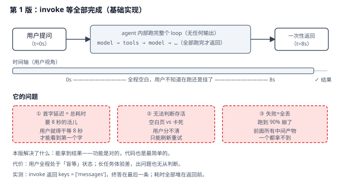
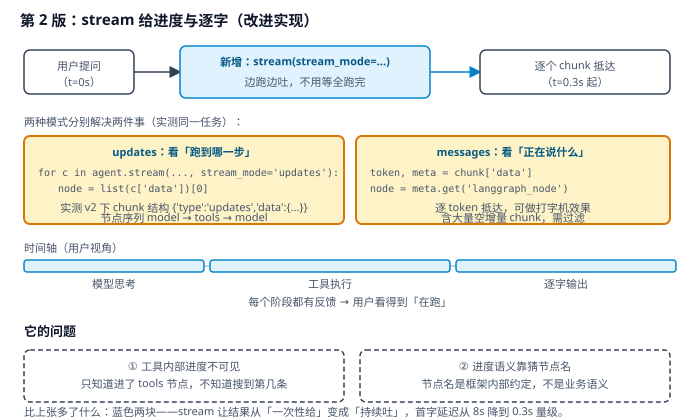
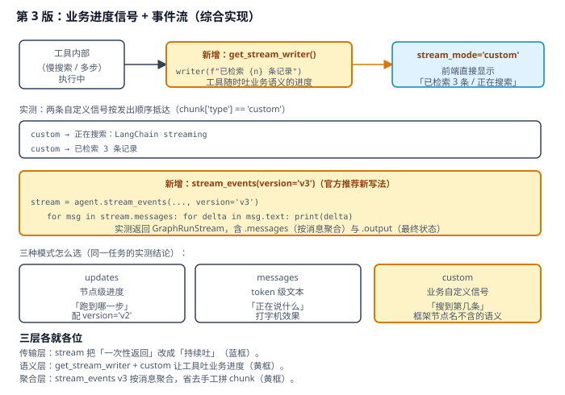

# 实战 6：让用户看见它在跑，而不是干等八秒

> 配套课程：[第 6 课：Streaming 流式输出](../stages/2-Agent核心/lessons/lesson-06-Streaming流式输出.md) ｜ 把知识点组装成可落地工作流：每步配设计图与代码（示例级，保证正确、可直接改用）

## 场景

客服 agent 回答一个问题要八秒：查订单、调接口、再生成答复。用 `invoke` 时用户面对的是八秒空白页——不知道是在跑还是挂了，很多人直接刷新，请求重发一遍。更难受的是跑到 90% 崩了，前面所有中间产物一个都拿不到。——演进目标就是把「盲等」变成「看得见在跑、说得清进度」。

## 全貌一句话

生产级流式还包括断线重连与续传、背压与限流、多端一致渲染、SSE/WebSocket 网关选型——属前端与网关工程话题（非本课范围，点到为止）。本篇聚焦**一个人也能搭起来的最小可用集**：stream 传输 + 业务进度信号 + 事件流聚合。

## 第 1 版：invoke 等全部完成（基础实现）



> 读图：提问后进入一段无输出的灰区，跑完才一次性返回；下方三个红框是它的短板——首字延迟等于总耗时、无法判断存活、失败即全丢。

```python
# stream_v1.py：第 1 版，非流式
import os
import time

from dotenv import load_dotenv
from langchain.agents import create_agent
from langchain.chat_models import init_chat_model
from langchain.tools import tool

load_dotenv()


@tool
def get_weather(city: str) -> str:
    """查询城市天气。"""
    return f"{city}：晴天，22°C，湿度 45%"


model = init_chat_model(
    "qwen3.8-flash",
    model_provider="openai",
    base_url=os.environ["BAILIAN_BASE_URL"],
    api_key=os.environ["BAILIAN_API_KEY"],
)
agent = create_agent(model, tools=[get_weather])

t0 = time.time()
result = agent.invoke(
    {"messages": [{"role": "user", "content": "北京天气怎么样？一句话回答。"}]}
)
print(f"耗时 {time.time() - t0:.1f}s")
print(result["messages"][-1].content)
```

**它的问题**：**首字延迟 = 总耗时**——要 8 秒的活儿，用户就得干等 8 秒才见到第一个字；**无法判断存活**——空白页和卡死在用户看来没区别，只能刷新重试（于是请求被重发）；**失败即全丢**——跑到 90% 崩了，中间产物一个都拿不到。

## 第 2 版：stream 给进度与逐字（改进实现）

把 `invoke` 换成 `stream`，同一个 loop 就开始边跑边吐。两种模式解决两件事：



> 读图：比上张多了蓝色两块——`updates` 给节点级进度、`messages` 给 token 级文本；时间轴从「一段灰」切成「三段有色」。红框是本版遗留：工具内部进度仍不可见。

```python
# stream_v2.py：第 2 版，stream 给进度与逐字

# ① updates：看「跑到哪一步」——适合做进度条
for chunk in agent.stream(
    {"messages": [{"role": "user", "content": "上海天气怎么样？"}]},
    stream_mode="updates",
    version="v2",
):
    for node_name, node_output in chunk["data"].items():
        msg = node_output["messages"][-1]
        print(f"  [{node_name}] {getattr(msg, 'content', '')[:60]}")

# ② messages：看「正在说什么」——适合打字机效果
for chunk in agent.stream(
    {"messages": [{"role": "user", "content": "用一句话介绍北京。"}]},
    stream_mode="messages",
    version="v2",
):
    if chunk["type"] != "messages":
        continue
    token, metadata = chunk["data"]
    node = metadata.get("langgraph_node", "?")
    for block in getattr(token, "content_blocks", None) or []:
        if block.get("type") == "text":
            print(block["text"], end="", flush=True)
```

> 实测确认：`stream_mode='updates'` + `version='v2'` 时 chunk 形如 `{'type': 'updates', 'data': {'model': {...}}}`，节点序列为 `model → tools → model`（3 个 chunk）；不加 `version` 时 chunk 直接是 `{节点名: {...}}` 的字典——**两种结构不同，别混用写法**。
>
> ⚠️ **实测发现的一个坑**：`messages` 模式里有**大量空增量 chunk**（本例 3 个内容块之外还有空块），直接 `print` 会刷屏——必须按 `content_blocks` 过滤后再输出。

**它的问题**：**工具内部进度不可见**——只知道进了 `tools` 节点，不知道慢搜索搜到第几条、跑了百分之多少；**进度语义靠猜节点名**——`model` / `tools` 是框架内部约定，用户看不懂「tools 节点执行中」是什么意思。

## 第 3 版：业务进度信号 + 事件流（综合实现）

前一条靠 `get_stream_writer()` 治：工具内部随时吐业务语义的进度，前端用 `stream_mode='custom'` 接。后一条靠 v3 事件流 API 收口。



> 读图：比上张多了黄色的 `get_stream_writer`（工具内部吐业务信号）与 `stream_events` v3（按消息聚合）；三种模式的分工在底部一目了然。

```python
# stream_v3.py：第 3 版，业务进度信号 + 事件流
import time

from langgraph.config import get_stream_writer


@tool
def slow_search(query: str) -> str:
    """模拟慢速搜索（用于演示流式进度信号）。"""
    writer = get_stream_writer()
    writer(f"🔍 正在搜索：{query}")
    time.sleep(0.5)
    writer("📊 已检索 3 条数据库记录")
    time.sleep(0.3)
    writer("✅ 搜索完成")
    return f"关于「{query}」找到 3 条结果：……"


agent_custom = create_agent(model, tools=[slow_search])

# ① 业务进度：工具内部随便吐，前端直接显示
for chunk in agent_custom.stream(
    {"messages": [{"role": "user", "content": "搜索一下 LangChain streaming 的最新文档。"}]},
    stream_mode="custom",
    version="v2",
):
    if chunk["type"] == "custom":
        print(f"  📡 {chunk['data']}")

# ② 事件流 v3：按消息聚合，省去手工拼 chunk
stream = agent_custom.stream_events(
    {"messages": [{"role": "user", "content": "广州天气怎么样？"}]},
    version="v3",
)
for message in stream.messages:
    print(f"  [{message.node}] ", end="", flush=True)
    for delta in message.text:
        print(delta, end="", flush=True)
    print()

final_state = stream.output
print(list(final_state.keys()))          # ['messages']
```

> 实测确认：`get_stream_writer()` 发出的两条信号按发出顺序抵达，`chunk['type'] == 'custom'`；`stream_events(version='v3')` 返回 `GraphRunStream`，含 `.messages`（按消息聚合，可直接遍历 `message.text`）与 `.output`（最终状态，keys 为 `['messages']`）。
>
> ⚠️ **实测注意**：v3 协议目前**会打印 `LangChainBetaWarning`（实验特性）**，生产环境请用 v2；另外离线脚本化模型下 `.messages` 可能为空（真实模型才有 token 流），`.output` 始终可用。

**为什么业务进度要自己发**：框架只告诉你「进了 tools 节点」，而用户关心的是「搜到第几条」——这是**业务语义，只有工具自己知道**。`get_stream_writer()` 就是把这个信息从工具内部透出来的官方通道，成本是三行代码，收益是用户不再对着空白页猜。

## 🎯 会用标志

做到这三条，就算把本课「用起来了」：

1. 能说清 `updates` 与 `messages` 两种模式分别解决什么问题，并知道 `version='v2'` 会改变 chunk 结构；
2. 能用 `get_stream_writer()` 在工具内部发出业务进度，并用 `stream_mode='custom'` 接住；
3. 能用 `stream_events(version='v3')` 按消息聚合输出，并知道它目前是实验特性。

---

⬅️ **上一课**：[实战 5：让客服 agent 跑得可控、结果可接、过程可见](05-Agents智能体核心.md)
➡️ **下一课**：[实战 7：让 agent 记住上一轮聊了什么](07-Memory记忆.md)
