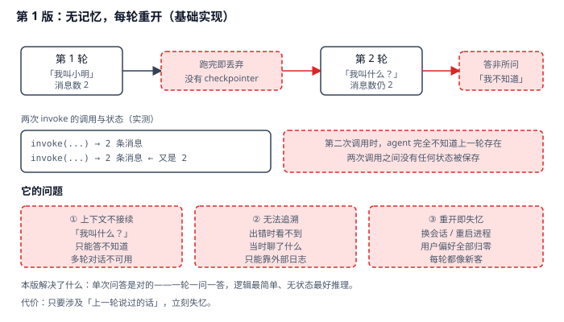
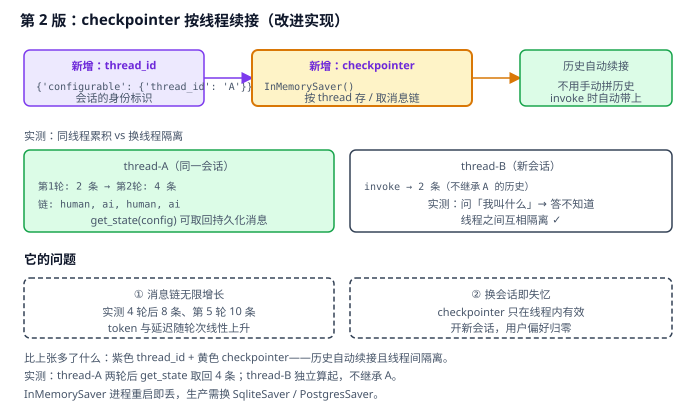
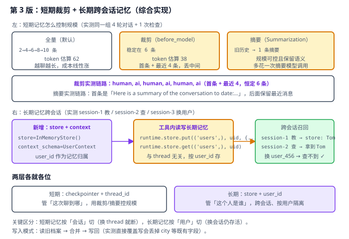

# 实战 7：让 agent 记住上一轮聊了什么

> 配套课程：[第 7 课：Memory 记忆](../stages/2-Agent核心/lessons/lesson-07-Memory记忆.md) ｜ 把知识点组装成可落地工作流：每步配设计图与代码（示例级，保证正确、可直接改用）

## 场景

你搭的客服 agent 第 1 轮刚听完「我叫小明，最喜欢蓝色」，第 2 轮问「我叫什么？」它答「不知道」。用户每开一个新会话，就得把偏好重新说一遍——上周明明说过「发票寄北京」，这周又问一遍。——演进目标就是把「每轮重开」变成「短期能续接、长期能记住」。

## 全貌一句话

生产级记忆还包括向量检索式长期记忆、记忆冲突消解与时效衰减、隐私脱敏与遗忘删除（合规）、跨设备同步——属存储与合规话题（非本课范围，点到为止）。本篇聚焦**一个人也能搭起来的最小可用集**：checkpointer 短期续接 + 裁剪/摘要控规模 + store 长期记忆。

## 第 1 版：无记忆，每轮重开（基础实现）



> 读图：第 1 轮跑完即丢弃（红框），第 2 轮拿不到任何历史；下方三个红框是它的短板——上下文不接续、出错无法追溯、重开即失忆。

```python
# memory_v1.py：第 1 版，无记忆
import os

from dotenv import load_dotenv
from langchain.agents import create_agent
from langchain.chat_models import init_chat_model

load_dotenv()

model = init_chat_model(
    "qwen3.8-flash",
    model_provider="openai",
    base_url=os.environ["BAILIAN_BASE_URL"],
    api_key=os.environ["BAILIAN_API_KEY"],
)

agent = create_agent(model, tools=[])          # 没有 checkpointer

r = agent.invoke({"messages": [{"role": "user", "content": "你好，我叫小明。"}]})
print(r["messages"][-1].content)               # 消息数 2

r = agent.invoke({"messages": [{"role": "user", "content": "我叫什么名字？"}]})
print(r["messages"][-1].content)               # 消息数仍是 2 → 答不上来
```

**它的问题**：**上下文不接续**——第二次调用时 agent 完全不知道上一轮存在（实测：两次 invoke 都是 2 条消息）；**无法追溯**——出错时看不到当时聊了什么；**重开即失忆**——换会话或重启进程，用户偏好全部归零。

## 第 2 版：checkpointer 按线程续接（改进实现）

病根是**没有地方存状态**。加 `checkpointer` 并用 `thread_id` 标识会话：



> 读图：比上张多了紫色的 thread_id 与黄色的 checkpointer——历史自动续接；右框显示换线程仍然隔离（这正是我们要的）。红框是本版遗留：消息链会无限增长。

```python
# memory_v2.py：第 2 版，checkpointer 按线程续接
from langgraph.checkpoint.memory import InMemorySaver

agent = create_agent(model, tools=[], checkpointer=InMemorySaver())

cfg_a = {"configurable": {"thread_id": "thread-A"}}
agent.invoke({"messages": [{"role": "user", "content": "我叫小明，最喜欢蓝色。请记住。"}]}, config=cfg_a)
agent.invoke({"messages": [{"role": "user", "content": "我叫什么？最喜欢什么颜色？"}]}, config=cfg_a)

# 追溯：取回已持久化的消息链
state = agent.get_state(cfg_a)
print(len(state.values["messages"]))           # 4

# 换线程：记忆隔离
cfg_b = {"configurable": {"thread_id": "thread-B"}}
agent.invoke({"messages": [{"role": "user", "content": "我叫什么？"}]}, config=cfg_b)   # 答不知道
```

> 实测确认：同线程第 1 轮 2 条、第 2 轮 4 条，链路为 `human, ai, human, ai`；`get_state(cfg)` 的 `values` 含 `messages`，可取回已持久化的 4 条；**换 `thread_id` 后消息数回到 2、答不出名字**——线程间隔离有效。
>
> ⚠️ **选型提醒**：`InMemorySaver` 存在内存里，**进程重启即丢失**。生产环境换 `SqliteSaver`（单机）或 `PostgresSaver`（多实例），接口一致、只改构造。

**它的问题**：**消息链无限增长**——实测 4 轮后 8 条、第 5 轮 10 条，token 与延迟随轮次线性上升；**换会话即失忆**——`checkpointer` 只在线程内有效，开新会话用户偏好归零。

## 第 3 版：短期裁剪 + 长期跨会话记忆（综合实现）

前一条靠裁剪/摘要治规模，后一条靠 `store` 把记忆归属从「会话」换成「用户」：



> 读图：上半是短期的三种策略实测对比（全量 10 条 / 裁剪 6 条 / 摘要 1 条摘要 + 最近消息），下半是长期的 store + user_id 链路（紫色新增）。

```python
# memory_v3.py：第 3 版
import os
from dataclasses import dataclass

from langchain.agents import create_agent
from langchain.agents.middleware import SummarizationMiddleware, before_model
from langchain.chat_models import init_chat_model
from langchain.messages import RemoveMessage
from langchain.tools import ToolRuntime, tool
from langgraph.checkpoint.memory import InMemorySaver
from langgraph.graph.message import REMOVE_ALL_MESSAGES
from langgraph.store.memory import InMemoryStore

load_dotenv()
model = init_chat_model(
    "qwen3.8-flash",
    model_provider="openai",
    base_url=os.environ["BAILIAN_BASE_URL"],
    api_key=os.environ["BAILIAN_API_KEY"],
)


# ---------- 短期：裁剪（保留首条 + 最近 4 条）----------
@before_model
def trim_messages(state, runtime):
    messages = state["messages"]
    if len(messages) <= 6:
        return None
    first, recent = messages[0], messages[-4:]
    return {"messages": [RemoveMessage(id=REMOVE_ALL_MESSAGES), first, *recent]}


# ---------- 短期：摘要（超阈值压缩早期历史）----------
sum_agent = create_agent(
    model,
    tools=[],
    middleware=[SummarizationMiddleware(model=model, trigger=("messages", 6), keep=("messages", 4))],
    checkpointer=InMemorySaver(),
)


# ---------- 长期：store 按 user_id 存 ----------
@dataclass
class UserContext:
    user_id: str


@tool
def save_user_name(name: str, runtime: ToolRuntime[UserContext]) -> str:
    """保存用户名字到长期记忆（跨会话）。"""
    runtime.store.put(("users",), runtime.context.user_id, {"name": name})
    return f"已保存：{name}"


@tool
def get_user_name(runtime: ToolRuntime[UserContext]) -> str:
    """从长期记忆读取用户名字（跨会话）。"""
    item = runtime.store.get(("users",), runtime.context.user_id)
    return item.value["name"] if item else "没有找到该用户的记录"


agent = create_agent(
    model,
    tools=[save_user_name, get_user_name],
    store=InMemoryStore(),
    context_schema=UserContext,
    checkpointer=InMemorySaver(),
)
# session-1 教 → session-2 查（同一 user_id）→ 拿得到
# 换成 user_456 → 查不到（用户隔离）
```

> 实测确认（同一组 4 轮对话 + 1 次检查）：**全量** 2→4→6→8→10 条，token 估算 62；**裁剪** 稳定 6 条、token 估算 38，链路为 `human, ai, human, ai, human, ai`；**摘要** 稳定 6 条，首条变成 `Here is a summary of the conversation to date:…`。
>
> 长期记忆实测：`session-1` 教完 store 里是 `{'name': 'Tom'}`；`session-2`（新线程）仍取到 `Tom`；换 `user_456` 查不到——**跨会话有效、按用户隔离**。

**写入必须「读 → 合并 → 写回」**：实测直接 `put` 覆盖写会把既有字段弄丢——

```python
@tool
def remember_preference(preference: str, runtime: ToolRuntime[UserContext]) -> str:
    """记住偏好：读取现有档案 → 合并 → 写回。"""
    ns, key = ("users",), runtime.context.user_id
    item = runtime.store.get(ns, key)
    profile = dict(item.value) if item else {}
    prefs = list(profile.get("preferences", []))
    prefs.append(preference)
    profile["preferences"] = prefs
    runtime.store.put(ns, key, profile)
    return f"已记住。当前档案: {profile}"
```

> 实测对照：档案原为 `{'name': '小明', 'city': '北京'}`，**合并写**后是 `{'name': '小明', 'city': '北京', 'preferences': ['喜欢喝咖啡']}`；**直接覆盖写**后只剩 `{'preferences': ['喜欢喝咖啡']}`——`name` 和 `city` 全丢了。

**为什么两层要分开**：短期按「会话」切，管的是「这次聊到哪」，换 thread 就该断；长期按「用户」切，管的是「这个人是谁」，换会话必须还在。**混在一起的典型后果**是要么用户换会话就被当成陌生人，要么旧会话的垃圾信息永久污染用户档案。

## 🎯 会用标志

做到这三条，就算把本课「用起来了」：

1. 能说清短期（checkpointer + thread_id）与长期（store + user_id）各自的归属维度，并知道 `InMemorySaver` 重启即丢；
2. 能用裁剪或摘要把消息链规模控制住，并说出二者的取舍（省 token 但丢细节 / 保语义但多花一次调用）；
3. 写长期记忆时能用「读 → 合并 → 写回」，并解释直接覆盖写会丢什么。

---

⬅️ **上一课**：[实战 6：让用户看见它在跑，而不是干等八秒](06-Streaming流式输出.md)
➡️ **下一课**：实战 8（Middleware 中间件）待编写
