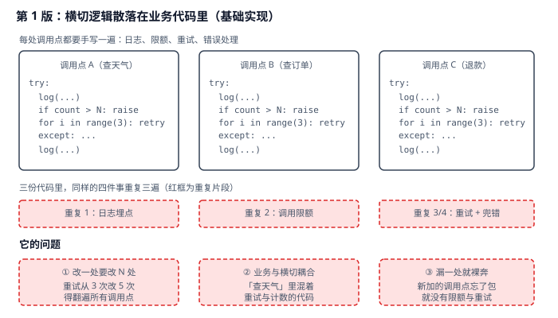
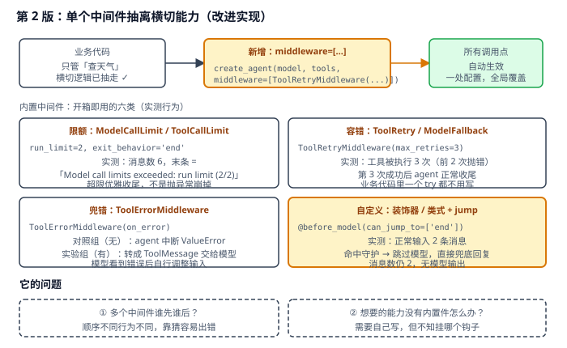
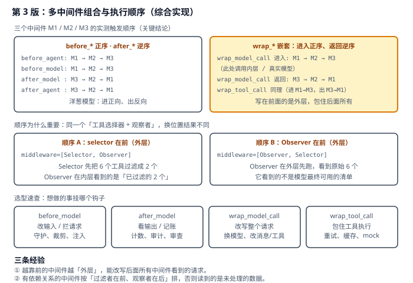

# 实战 8：给 agent 加日志、限额、重试，别再往业务里塞

> 配套课程：[第 8 课：Middleware 中间件](../stages/3-可控性与可靠性/lessons/lesson-08-Middleware中间件.md) ｜ 把知识点组装成可落地工作流：每步配设计图与代码（示例级，保证正确、可直接改用）

## 场景

agent 上线后要加四件事：调用日志、模型调用限额、工具失败重试、错误兜底。第一反应是在每个调用点外面包 `try` / 写 `log` / 数次数——三个调用点就得写三遍，改「重试 3 次改 5 次」得翻遍全代码，新加的调用点漏包了就裸奔。——演进目标就是把横切能力从业务代码里抽出来，一次配置全局生效。

## 全貌一句话

生产级还包括分布式链路追踪埋点、按租户的配额与计费、熔断与降级编排、中间件单元测试——属平台工程话题（非本课范围，点到为止）。本篇聚焦**一个人也能搭起来的最小可用集**：内置中间件覆盖常见横切 + 自定义中间件补缺 + 多中间件顺序确定。

## 第 1 版：横切逻辑散落在业务代码里（基础实现）



> 读图：三个调用点各写一遍同样的四件事（红框重复片段）；下方三个红框是它的短板——改一处要改 N 处、业务与横切耦合、漏一处就裸奔。

```python
# middleware_v1.py：第 1 版，横切逻辑散在业务里
import time

def call_weather(city: str) -> str:
    """查询天气（业务代码里混着日志、限额、重试、兜错）。"""
    print(f"[log] 调用开始 {city}")            # ① 日志
    if call_count["n"] >= 10:                  # ② 限额
        raise RuntimeError("超出调用上限")
    call_count["n"] += 1
    for i in range(3):                         # ③ 重试
        try:
            return do_request(city)
        except Exception:
            if i == 2:
                raise
            time.sleep(0.1)
    print(f"[log] 调用结束")                    # ④ 兜错后的日志
```

**它的问题**：**改一处要改 N 处**——重试次数从 3 改 5 要翻遍所有调用点；**业务与横切耦合**——「查天气」这段本该只有一句话的地方混着计数和重试；**漏一处就裸奔**——新增调用点忘记包，就没有限额也没有重试。

## 第 2 版：单个中间件抽离横切能力（改进实现）

中间件就是**框架在固定时机回调你的钩子**。把横切逻辑挂上去，业务代码只剩业务：



> 读图：比上张多了黄色的 `middleware=[...]`——一处配置对所有调用点生效；四块实测行为分别是限额、容错、兜错、自定义。红框是本版遗留：多个中间件谁先谁后。

```python
# middleware_v2.py：第 2 版，用中间件抽离
from langchain.agents import create_agent
from langchain.agents.middleware import (
    ModelCallLimitMiddleware,
    ToolCallLimitMiddleware,
    ToolErrorMiddleware,
    ToolRetryMiddleware,
    before_model,
)
from langchain.messages import AIMessage

# ① 限额：模型调用上限，超限优雅收尾（不是抛异常）
agent_limit = create_agent(
    model, tools=[get_weather],
    middleware=[ModelCallLimitMiddleware(run_limit=2, exit_behavior="end")],
)

# ② 容错：工具失败自动重试
agent_retry = create_agent(
    model, tools=[flaky_service],
    middleware=[ToolRetryMiddleware(max_retries=3, initial_delay=0.05,
                                    backoff_factor=0.0, jitter=False)],
)

# ③ 兜错：工具异常转成一条消息交给模型，让它自己调整
def on_error(exc: Exception, request) -> str | None:
    if isinstance(exc, ValueError):
        return f"`{request.tool_call['name']}` 执行失败（{type(exc).__name__}），请调整输入后重试。"
    return None

agent_err = create_agent(model, tools=[strict_divide],
                         middleware=[ToolErrorMiddleware(on_error)])

# ④ 自定义：before_model 守护，命中即跳过模型直接收尾
@before_model(can_jump_to=["end"])
def content_guard(state, runtime):
    if "禁止话题" in str(state["messages"][-1].content):
        return {"messages": [AIMessage("抱歉，这个话题我不能处理。")], "jump_to": "end"}
    return None
```

> 实测确认（离线假模型验证，行为与真实模型一致）：
> - `ModelCallLimitMiddleware(run_limit=2, exit_behavior='end')`：消息数 6，末条是 `Model call limits exceeded: run limit (2/2)`——**超限优雅收尾，不是抛异常崩掉**；
> - `ToolCallLimitMiddleware(tool_name='calculator', run_limit=1)`：第二次调用变成 `Tool call limit exceeded. Do not call 'calculator' again.`；
> - `ToolRetryMiddleware(max_retries=3)`：工具实际被执行 3 次（前 2 次抛 `RuntimeError`），第 3 次成功后 agent 正常收尾；
> - `ToolErrorMiddleware` 对照组：无中间件时 **agent 直接中断**（`ValueError: 除数不能为 0`）；实验组错误信息变成一条 `ToolMessage` 回到模型，模型看到后自行调整；
> - 自定义 `jump_to`：正常输入 2 条消息；命中守护时**跳过模型**，末条是兜底回复，消息数仍为 2（无模型输出）。
>
> ⚠️ **注意 `exit_behavior`**：默认是抛异常（`raise`），想让 agent 优雅收尾必须显式写 `exit_behavior="end"`。这是「限额」类中间件最容易踩的坑——配完以为会软着陆，实际直接崩。

**它的问题**：**多个中间件谁先谁后**——顺序不同行为不同，靠猜容易出错；**想要的能力没有内置件**——需要自己写，但不知道该挂哪个钩子。

## 第 3 版：多中间件组合与执行顺序（综合实现）



> 读图：上半是三中间件实测顺序（before 正序 / after 逆序 / wrap 嵌套），下半是同一个组合换位置后结果不同的对照，底部是钩子选型速查。

```python
# middleware_v3.py：第 3 版，多中间件组合
from langchain.agents.middleware import (
    AgentMiddleware, LLMToolSelectorMiddleware,
)

class OrderMiddleware(AgentMiddleware):
    def __init__(self, tag: str):
        super().__init__()
        self.tag = tag

    @property
    def name(self) -> str:
        return f"order-{self.tag}"

    def before_model(self, state, runtime):
        print(f"  [{self.tag}] before_model")
        return None

    def after_model(self, state, runtime):
        print(f"  [{self.tag}] after_model")
        return None

agent = create_agent(model, tools=[calculator],
                     middleware=[OrderMiddleware("M1"), OrderMiddleware("M2"),
                                 OrderMiddleware("M3")])
```

> 实测确认（三中间件 + 一次工具调用），触发顺序为：
> `before_agent: M1→M2→M3` → `before_model: M1→M2→M3` → `wrap_model_call 进入: M1→M2→M3` →（真实模型）→ `wrap_model_call 返回: M3→M2→M1` → `after_model: M3→M2→M1` → `wrap_tool_call` 同为进 M1→M3、出 M3→M1 → 第二轮模型同理 → `after_agent: M3→M2→M1`。
>
> 一句话记：**before 正序、after 逆序、wrap 嵌套（进入正序、返回逆序）**——写在前面的中间件是外层，包住后面所有。

**顺序为什么真的重要**：把「工具选择器」和「观察者」换个位置，观察者看到的东西就不一样——

```python
# 顺序 A：过滤者在前（外层）→ 观察者看到的是已过滤结果
create_agent(model, tools=pool,
             middleware=[LLMToolSelectorMiddleware(model=model, max_tools=2), ToolObserver()])

# 顺序 B：观察者在前（外层）→ 它看到的是未过滤的原始清单
create_agent(model, tools=pool,
             middleware=[ToolObserver(), LLMToolSelectorMiddleware(model=model, max_tools=2)])
```

**排顺序的经验**：**过滤者在前，观察者在后**。过滤类（工具选择、消息裁剪、提示词改写）放前面，观察/记账类（日志、审计、计数）放后面——否则你记的是「未经处理的原始数据」，而不是模型真正看到的东西。

## 🎯 会用标志

做到这三条，就算把本课「用起来了」：

1. 能用内置中间件覆盖限额 / 重试 / 兜错三类常见需求，并知道 `exit_behavior="end"` 才是优雅收尾；
2. 能写一个自定义中间件（装饰器或类式），说清 `@before_model` 与 `wrap_model_call` 的适用场景差异；
3. 能背出多中间件顺序规则（before 正序 / after 逆序 / wrap 进正出逆），并按「过滤者在前」排列。

---

⬅️ **上一课**：[实战 7：让 agent 记住上一轮聊了什么](07-Memory记忆.md)
➡️ **下一课**：[实战 9：把长对话的上下文瘦下来](09-ContextEngineering上下文工程.md)
