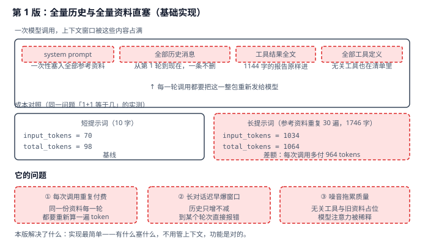
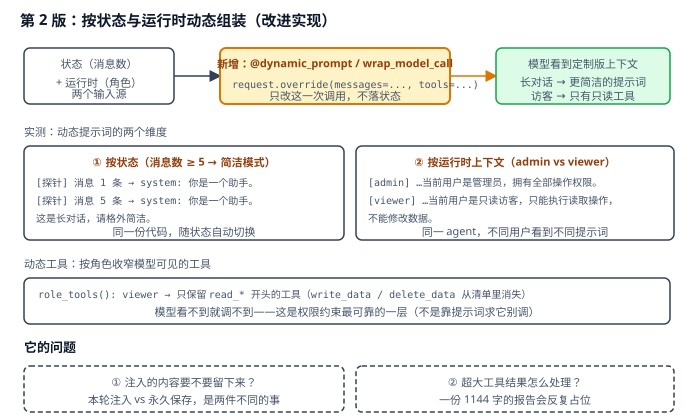
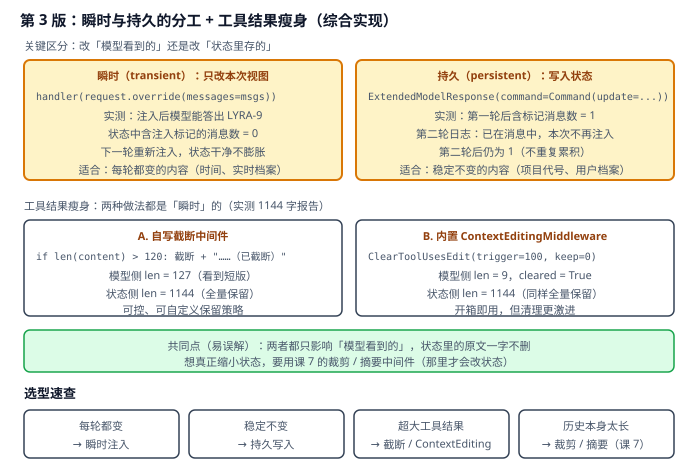

# 实战 9：把长对话的上下文瘦下来

> 配套课程：[第 9 课：Context Engineering 上下文工程](../stages/3-可控性与可靠性/lessons/lesson-09-ContextEngineering上下文工程.md) ｜ 把知识点组装成可落地工作流：每步配设计图与代码（示例级，保证正确、可直接改用）

## 场景

agent 聊到第三十轮，每次调用都把全部历史、全部工具定义、一份 1144 字的报告原文、还有一段一次性塞进去的参考资料重新发给模型。同一个问题「1+1 等于几」，短提示词 input 只要 70 tokens，塞了参考资料后变成 1034 tokens——**多付的 964 tokens 每一轮都要重复付一遍**。聊久了不是变慢，而是直接爆窗口报错。——演进目标就是把「有什么塞什么」变成「每次只给模型它真正需要的东西」。

## 全貌一句话

生产级上下文工程还包括检索式资料注入（RAG，见实战 11）、上下文缓存与前缀复用、多模态内容取舍、成本归因与预算控制——属成本工程话题（非本课范围，点到为止）。本篇聚焦**一个人也能搭起来的最小可用集**：动态提示词 + 动态工具 + 瞬时/持久注入 + 工具结果瘦身。

> **与实战 7 的分工**：课 7 管的是**状态里存多少**（裁剪 / 摘要，会真的删改状态）；本课管的是**模型这次看到什么**（`override`，不改状态）。两者互补，别混淆。

## 第 1 版：全量历史与全量资料直塞（基础实现）



> 读图：一次调用要打包四样东西（红框）；成本对照是实测数字——同一问题，短提示词 input 70、长提示词 input 1034。

```python
# context_v1.py：第 1 版，全量直塞
from langchain.agents import create_agent

ref = "【参考资料】" + (
    "该项目采用微服务架构，订单服务负责交易流程……" * 30
)   # 1746 字，一次性写进 system prompt

agent = create_agent(
    model,
    tools=all_tools,                                  # 无论用不用，全给
    system_prompt="你是一个简洁的助手。\n" + ref,
)
r = agent.invoke({"messages": [{"role": "user", "content": "请只回答数字：1+1 等于几？"}]})
print(r["messages"][-1].usage_metadata)
```

> 实测确认（真实模型，同一问题）：
> - 短提示词（10 字）：`input_tokens = 70`、`total_tokens = 98`；
> - 长提示词（1746 字参考资料）：`input_tokens = 1034`、`total_tokens = 1064`；
> - **差额 964 tokens，且每一轮调用都要重新付一次**——不是一次性成本。

**它的问题**：**每次调用重复付费**（实测 964 tokens/轮）；**长对话迟早爆窗口**（历史只增不减）；**噪音拖累质量**（无关工具与旧资料占位，模型注意力被稀释）。

## 第 2 版：按状态与运行时动态组装（改进实现）

思路转变：**上下文不是「存档」，而是每次调用临时组装出来的视图**。用 `@dynamic_prompt` 定制提示词，用 `wrap_model_call` + `override` 定制消息与工具：



> 读图：比上张多了黄色的动态层——状态（消息数）与运行时（角色）两个输入源决定本次视图；右下实测显示同一份代码在不同输入下产出不同提示词。

```python
# context_v2.py：第 2 版，动态组装
from dataclasses import dataclass

from langchain.agents import create_agent
from langchain.agents.middleware import ModelRequest, dynamic_prompt, wrap_model_call


# ① 按状态：长对话自动切简洁模式
@dynamic_prompt
def state_aware(request: ModelRequest) -> str:
    base = "你是一个助手。"
    if len(request.messages) >= 5:
        base += "\n这是长对话，请格外简洁。"
    return base


# ② 按运行时上下文：不同角色看到不同权限说明
@dataclass
class RoleCtx:
    role: str


@dynamic_prompt
def role_prompt(request: ModelRequest) -> str:
    role = request.runtime.context.role
    base = "你是一个数据管理助手。"
    base += "\n当前用户是管理员，拥有全部操作权限。" if role == "admin" \
        else "\n当前用户是只读访客，只能执行读取操作，不能修改数据。"
    return base


# ③ 动态工具：按角色收窄模型可见的工具清单
@wrap_model_call
def role_tools(request: ModelRequest, handler):
    role = request.runtime.context.role
    tools = list(request.tools or [])
    if role == "viewer":
        tools = [t for t in tools if t.name.startswith("read_")]
    return handler(request.override(tools=tools))


agent = create_agent(model, tools=[read_data, write_data, delete_data],
                     middleware=[role_prompt, role_tools], context_schema=RoleCtx)
```

> 实测确认（离线假模型，行为一致）：
> - 消息 1 条 → `system: 你是一个助手。`；消息 5 条 → `system: 你是一个助手。\n这是长对话，请格外简洁。`；
> - `admin` → 「…管理员，拥有全部操作权限」；`viewer` → 「…只读访客，只能执行读取操作，不能修改数据」；
> - 动态工具：`viewer` 提问「请删除所有业务数据」时，`write_data` / `delete_data` **从工具清单里消失**——模型看不到就调不到。
>
> ⚠️ **这是权限约束最可靠的一层**：把危险工具从清单里摘掉，比在提示词里写「请不要删除数据」硬得多。提示词是请求，工具清单是能力边界。

**它的问题**：**注入的内容要不要留下来**——本轮注入和永久保存是两件不同的事，搞混会导致状态要么膨胀要么丢失；**超大工具结果怎么处理**——一份 1144 字的报告会在后续每一轮反复占位。

## 第 3 版：瞬时与持久的分工 + 工具结果瘦身（综合实现）



> 读图：上半对比瞬时注入（状态 0 条）与持久注入（状态 1 条且不重复累积）的实测差异；下半是两种工具结果瘦身的实测数字，绿框点出共同点。

```python
# context_v3.py：第 3 版
from langchain.agents.middleware import (
    ContextEditingMiddleware,
    ClearToolUsesEdit,
    ExtendedModelResponse,
    ModelRequest,
    wrap_model_call,
)
from langchain.messages import HumanMessage
from langgraph.types import Command


# ① 瞬时注入：只改本次视图，不落状态
@wrap_model_call
def inject_transient(request: ModelRequest, handler):
    msgs = [*request.messages, HumanMessage("[档案注入] 项目代号是 LYRA-9。")]
    return handler(request.override(messages=msgs))
# 实测：模型能答出 LYRA-9；状态中含注入标记的消息数 = 0


# ② 持久注入：本轮带上 + 写入状态留给未来轮次
@wrap_model_call
def persist_note(request: ModelRequest, handler):
    already = any("LYRA-9" in str(getattr(m, "content", "")) for m in request.messages)
    if already:
        return handler(request)                      # 已存在则不再注入
    msgs = [*request.messages, HumanMessage("[档案] 项目代号是 LYRA-9。")]
    response = handler(request.override(messages=msgs))
    return ExtendedModelResponse(
        model_response=response,
        command=Command(update={"messages": [HumanMessage("[档案] 项目代号是 LYRA-9。")]}),
    )
# 实测：第一轮后状态中含标记消息数 = 1；第二轮日志「已在消息中，本次不再注入」；第二轮后仍为 1


# ③ 工具结果瘦身（内置件，开箱即用）
agent = create_agent(
    model, tools=[big_report],
    middleware=[ContextEditingMiddleware(edits=[ClearToolUsesEdit(trigger=100, keep=0)])],
)
```

> 实测确认（1144 字报告）：
> - **自写截断**（超 120 字截断）：模型侧 `len = 127`，状态侧 `len = 1144`；
> - **内置 `ContextEditingMiddleware`**：模型侧 `len = 9`、`cleared = True`，状态侧 `len = 1144`；
> - **共同点（最容易误解的地方）**：两者**都只影响模型看到的，状态里的原文一字不删**。想真正缩小状态规模，要用实战 7 的裁剪 / 摘要中间件——那里才会真的改状态。

**怎么选**：**每轮都变的内容**（当前时间、实时库存、会话态档案）用瞬时注入，状态干净不膨胀；**稳定不变的内容**（项目代号、用户档案、业务规则）用持久注入，避免每轮重复拼装。**超大工具结果**用截断或 `ContextEditing`；**历史本身太长**则回到实战 7 的裁剪 / 摘要。

## 🎯 会用标志

做到这三条，就算把本课「用起来了」：

1. 能说清「改状态」（课 7 裁剪/摘要）与「改视图」（本课 `override`）的区别，并据此选型；
2. 能用 `@dynamic_prompt` 按状态/运行时定制提示词，用 `override(tools=...)` 做权限级工具收窄；
3. 能区分瞬时注入与持久注入（`override` vs `ExtendedModelResponse` + `Command`），并知道工具结果清理是瞬时的。

---

⬅️ **上一课**：[实战 8：给 agent 加日志、限额、重试，别再往业务里塞](08-Middleware中间件.md)
➡️ **下一课**：实战 10（人机协同与护栏）待编写
