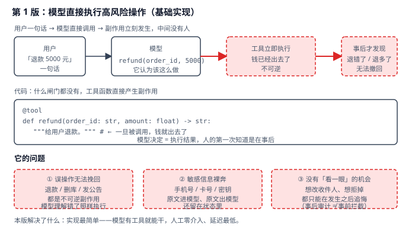
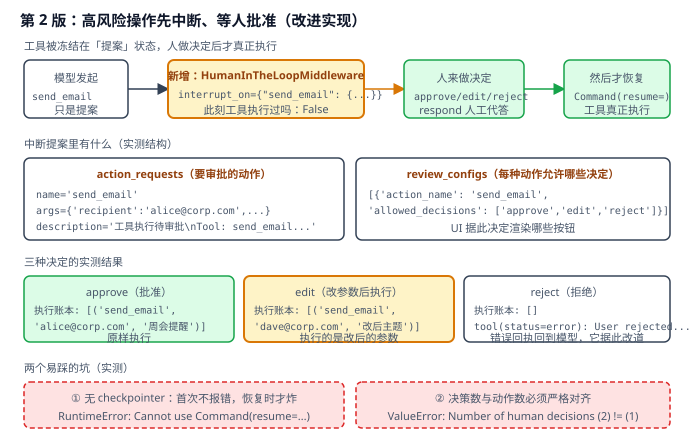
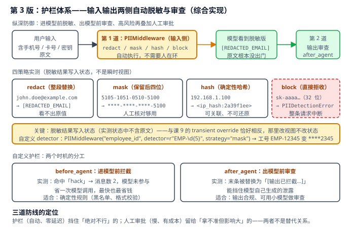

# 实战 10：高风险操作，先让人签个字

> 配套课程：[第 10 课：人机协同与护栏](../stages/3-可控性与可靠性/lessons/lesson-10-人机协同与护栏.md) ｜ 把知识点组装成可落地工作流：每步配设计图与代码（示例级，保证正确、可直接改用）

## 场景

agent 有了工具就能干活：用户说「退款 5000 元」，模型调用 `refund`，钱立刻出去了。问题在于模型的理解和用户意图可能不一致——退错订单、退多金额、发给错误收件人——而这些都是**不可逆副作用**，事后才发现就晚了。用户的手机号、卡号、密钥也以原文进模型、原文出模型，还留在状态里。——演进目标就是把「模型决定 = 立刻执行」改成「高风险动作先冻结、等人签字」，并让敏感信息根本不出门。

## 全貌一句话

生产级还包括审批工单系统与审计留痕、按角色的多级审批流、内容安全合规模型、护栏自身的对抗测试——属安全工程话题（非本课范围，点到为止）。本篇聚焦**一个人也能搭起来的最小可用集**：中断审批（HITL）+ 内置 PII 护栏 + 自定义输入输出审查。

## 第 1 版：模型直接执行高风险操作（基础实现）



> 读图：一条直线走完「用户 → 模型 → 工具执行 → 事后发现」，中间没有人；下方三个红框是它的短板。

```python
# hitl_v1.py：第 1 版，什么闸门都没有
from langchain.agents import create_agent
from langchain.tools import tool


@tool
def refund(order_id: str, amount: float) -> str:
    """给用户退款。"""
    return f"已向订单 {order_id} 退款 {amount} 元"   # ← 一旦被调用，钱就出去了


agent = create_agent(model, tools=[refund])
agent.invoke({"messages": [{"role": "user", "content": "给订单 A-1001 退款 5000 元"}]})
```

**它的问题**：**误操作无法挽回**——退款、删库、发公告都是不可逆副作用，模型理解错了照样执行；**敏感信息裸奔**——手机号、卡号、密钥原文进模型、原文出模型，还留在状态里；**没有「看一眼」的机会**——想改收件人、想拒掉，都只能在发生之后追悔（事后审计 ≠ 事前拦截）。

## 第 2 版：高风险操作先中断、等人批准（改进实现）

`HumanInTheLoopMiddleware` 把指定工具冻在「提案」状态：模型照常发起调用，但工具不执行，agent 返回一个中断，人做完决定再用 `Command(resume=...)` 恢复：



> 读图：比上张多了黄色的中断层——提案被冻结等人决定；下方三种决定的实测账本，底部两个红框是易踩的坑。

```python
# hitl_v2.py：第 2 版，中断审批
from langchain.agents import create_agent
from langchain.agents.middleware import HumanInTheLoopMiddleware
from langchain.tools import tool
from langgraph.checkpoint.memory import InMemorySaver
from langgraph.types import Command


@tool
def send_email(recipient: str, subject: str) -> str:
    """给指定收件人发送邮件。"""
    return f"邮件已发送至 {recipient}，主题：{subject}"


agent = create_agent(
    model,
    tools=[send_email],
    middleware=[HumanInTheLoopMiddleware(
        interrupt_on={"send_email": {"allowed_decisions": ["approve", "edit", "reject"]}},
        description_prefix="工具执行待审批",
    )],
    checkpointer=InMemorySaver(),          # ← 必须，否则恢复不了
)

cfg = {"configurable": {"thread_id": "order-1"}}
r = agent.invoke({"messages": [{"role": "user", "content": "给 alice@corp.com 发周会提醒"}]}, cfg)
# 此刻工具执行过吗：False

# 中断提案里有什么
v = r["__interrupt__"][0].value
print(v["action_requests"][0])   # {'name': 'send_email', 'args': {...}, 'description': '工具执行待审批\nTool: send_email...'}
print(v["review_configs"])       # [{'action_name': 'send_email', 'allowed_decisions': ['approve','edit','reject']}]

# 三种决定
agent.invoke(Command(resume={"decisions": [{"type": "approve"}]}), cfg)
agent.invoke(Command(resume={"decisions": [{"type": "edit", "edited_action": {
    "name": "send_email",
    "args": {"recipient": "dave@corp.com", "subject": "修改后的主题"},
}}]}), cfg)
agent.invoke(Command(resume={"decisions": [{"type": "reject", "message": "不允许群发"}]}), cfg)
```

> 实测确认（离线假模型验证，行为与真实模型一致）：
> - 中断提案 `value` 有两个键：`action_requests`（动作名、参数、给审批人看的 description）与 `review_configs`（每种动作允许哪些决定，UI 据此渲染按钮）；
> - **中断时工具执行过吗：False**——提案只是冻结的参数；
> - `approve` → 执行账本 `[('send_email', 'alice@corp.com', '周会提醒')]`；
> - `edit` → 执行账本 `[('send_email', 'dave@corp.com', '改后主题')]`——**执行的是改后的参数**；
> - `reject` → 执行账本为空，且产生一条 `tool(status=error): User rejected the tool call for ... with reason: ...`——**错误回执回到模型，它据此改道**，而不是整个 agent 崩掉。
>
> 还有两个变体：`respond` 让人工代答（`ask_user` 模式的工具真实实现不执行，用人的回答合成回执）；`when` 谓词做条件中断——实测 `recipient.endswith("@internal.com")` 返回 False 时**直接直通不打断**，内部域名不打扰审批人。

> ⚠️ **两个易踩的坑（都是实测复现）**：
> 1. **无 checkpointer 不会当场报错**：首次 `invoke` 照常返回中断，看起来一切正常；直到你调用 `Command(resume=...)` 才抛 `RuntimeError: Cannot use Command(resume=...) without checkpointer`。**错误延后到恢复时才炸**，比当场报错更隐蔽——务必在 `create_agent` 里就配上 checkpointer。
> 2. **决策数量必须与动作数量严格对齐**：多给一个决策就抛 `ValueError: Number of human decisions (2) does not match number of hanging tool calls (1)`。批量审批时要按 `action_requests` 的顺序逐个生成决定。

**它的问题**：**敏感信息仍然裸奔**——审批能挡住「做不做」，挡不住手机号和卡号原样进模型；**不可能所有操作都让人审**——低风险的读取也弹审批，人会被打扰到麻木，反而忽略真正危险的。

## 第 3 版：护栏体系——输入输出两侧自动脱敏与审查（综合实现）

思路是**纵深防御**：护栏自动挡住「绝对不行」的（零延迟、零人力），人工审批留给「拿不准但影响大」的。两者不是替代关系：



> 读图：两道自动关卡夹着模型（输入侧脱敏、输出侧审查）；四策略实测结果一字排开，黄框点出「写入状态」这个关键性质。

```python
# hitl_v3.py：第 3 版，护栏体系
import re

from langchain.agents import create_agent
from langchain.agents.middleware import AgentState, PIIMiddleware, after_agent, before_agent


# ① 输入侧脱敏：敏感信息根本不出门
agent = create_agent(
    model, tools=[],
    middleware=[
        PIIMiddleware("email", strategy="redact", apply_to_input=True),
        PIIMiddleware("credit_card", strategy="mask", apply_to_input=True),
        PIIMiddleware("ip", strategy="hash", apply_to_input=True),
        PIIMiddleware("api_key", detector=r"sk-[a-zA-Z0-9]{32}",
                      strategy="block", apply_to_input=True),
        PIIMiddleware("employee_id", detector=r"EMP-\d{5}",
                      strategy="mask", apply_to_input=True),   # 自定义 detector
    ],
)


# ② 输出侧审查：挡住模型自己生成的泄露
@after_agent(can_jump_to=["end"])
def output_guard(state: AgentState, runtime) -> dict | None:
    last = state["messages"][-1]
    if getattr(last, "type", "") != "ai":
        return None
    if "INTERNAL-8888" in str(last.content) or re.search(r"1\d{2}-\d{4}-\d{4}", str(last.content)):
        return {
            "messages": [{"role": "assistant", "content": "[输出已拦截：含内部凭据或手机号。]"}],
            "jump_to": "end",
        }
    return None


# ③ 输入侧拦截：确定性规则，连模型都不用调
@before_agent(can_jump_to=["end"])
def content_filter(state: AgentState, runtime) -> dict | None:
    first = state["messages"][0]
    if getattr(first, "type", "") == "human" and "hack" in str(first.content).lower():
        return {"messages": [{"role": "assistant", "content": "此类请求我不能处理。"}], "jump_to": "end"}
    return None
```

> 实测确认：
> - `redact` → `john.doe@example.com` 变 `[REDACTED_EMAIL]`；`mask` → `5105-1051-0510-5100` 变 `****-****-****-5100`；`hash` → `192.168.1.100` 变 `<ip_hash:2a39f1ee>`；`block` → 抛 `PIIDetectionError: Detected 1 instance(s) of api_key in text content`；
> - 自定义 detector → 工号 `EMP-12345` 变 `****2345`；
> - `apply_to_output=True` → 末条 AI 消息被改写为 `[REDACTED_EMAIL]`，**状态中已不含原文**；
> - `before_agent` 命中 → 消息数 2（请求 + 固定话术），**模型未参与**，省一次调用；
> - `after_agent` 命中 → 末条被替换为拦截文本。
>
> ⚠️ **最容易混淆的一点**：PII 脱敏的结果**是写入状态的**（实测状态中检索不到原文），这和课 9 的 transient `override` 恰好相反——那里改的是模型视图、状态不动，这里改的是状态本身。**想让原文彻底不落盘，就用 PII 中间件；只想让模型本轮看不到，才用 `override`。**

**两个时机的分工**：`before_agent` 拦确定性规则（黑名单、格式校验），**模型没被调、最快最省钱**；`after_agent` 审输出（合规、隐私泄露），**能挡住模型自己生成的泄露**，必要时可用小模型做判定（成本远低于主模型）。

## 🎯 会用标志

做到这三条，就算把本课「用起来了」：

1. 能用 `HumanInTheLoopMiddleware` 让高风险工具先中断，并说清 `approve` / `edit` / `reject` / `respond` 四种决定的适用场景；
2. 能避开两个坑：无 checkpointer 导致恢复时才报错、决策数与动作数必须对齐；
3. 能区分 PII 四策略的输出形态，并说清「写入状态的脱敏」与「瞬时 override」的区别。

---

⬅️ **上一课**：[实战 9：把长对话的上下文瘦下来](09-ContextEngineering上下文工程.md)
➡️ **下一课**：[实战 11：让 agent 回答公司内部政策，别让它编](11-Retrieval检索与RAG.md)
