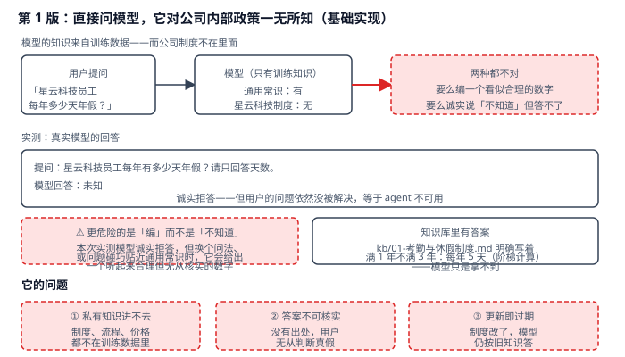
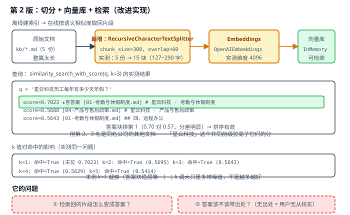
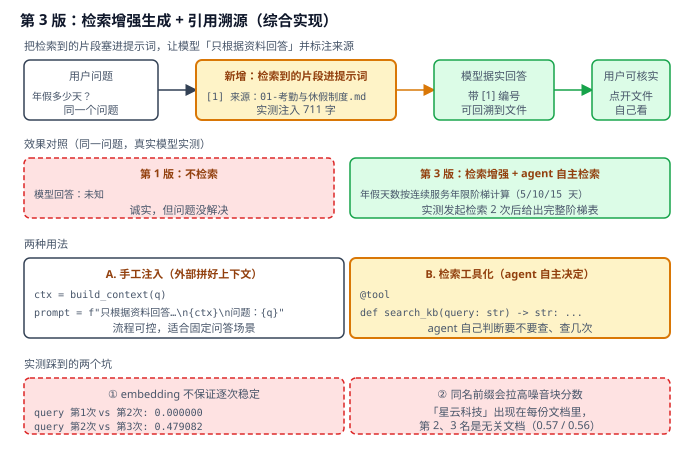

# 实战 11：让 agent 回答公司内部政策，别让它编

> 配套课程：[第 11 课：Retrieval 检索与 RAG](../stages/3-可控性与可靠性/lessons/lesson-11-Retrieval检索与RAG.md) ｜ 把知识点组装成可落地工作流：每步配设计图与代码（示例级，保证正确、可直接改用）

## 场景

做一个「公司制度问答」agent。用户问「星云科技员工每年有多少天年假？」，答案明明写在 `kb/01-考勤与休假制度.md` 里——但模型没见过这份文件。实测直接问真实模型，它回答「未知」：诚实，但问题没解决。**更危险的不是「不知道」而是「编」**：换个问法、或问题碰巧贴近通用常识时，它会给出一个听起来合理、但无从核实的数字。——演进目标就是把私有知识送进模型的上下文，并让每个答案都能回溯到出处。

## 全貌一句话

生产级还包括混合检索（向量 + BM25）、重排序 rerank、查询改写与多跳检索、文档增量更新与失效处理、检索效果评测集——属检索工程话题（非本课范围，点到为止）。本篇聚焦**一个人也能搭起来的最小可用集**：切分 + 向量库 + 检索 + 增强生成 + 引用溯源。

## 第 1 版：直接问模型，它对公司内部政策一无所知（基础实现）



> 读图：模型只有训练知识，私有制度进不去；下方实测显示模型诚实答「未知」，红框点出更危险的情况其实是「编」。

```python
# retrieval_v1.py：第 1 版，直接问模型
from langchain.chat_models import init_chat_model

model = init_chat_model("qwen3.8-flash", model_provider="openai",
                        api_key=..., base_url=...)
r = model.invoke([{"role": "user", "content": "星云科技员工每年有多少天年假？请只回答天数。"}])
print(r.content)
```

> 实测确认（真实模型）：回答「未知」。知识库里明明写着「入职满 1 年不满 3 年：每年 5 天」，模型只是拿不到。

**它的问题**：**私有知识进不去**——制度、流程、价格都不在训练数据里；**答案不可核实**——没有出处，用户无从判断真假；**更新即过期**——制度改了，模型仍按旧知识答。

## 第 2 版：切分 + 向量库 + 检索（改进实现）

思路：**离线把文档切碎、转成向量存起来；在线把问题也转成向量，按语义相似度取回最相关的几块**。



> 读图：上方是「文档 → 切分 → 向量化 → 入库」的离线链路（黄色为新增）；中间是实测的 top-3 明细，下方是 k 值对照。

```python
# retrieval_v2.py：第 2 版，切分 + 向量库 + 检索
import os
from pathlib import Path

from dotenv import load_dotenv
from langchain_core.documents import Document
from langchain_core.vectorstores import InMemoryVectorStore
from langchain_openai import OpenAIEmbeddings
from langchain_text_splitters import RecursiveCharacterTextSplitter

load_dotenv()

emb = OpenAIEmbeddings(
    model=os.environ["SILICONFLOW_EMBEDDING_MODEL"],
    api_key=os.environ["SILICONFLOW_API_KEY"],
    base_url=os.environ["SILICONFLOW_BASE_URL"],
    check_embedding_ctx_length=False,
)

# ① 载入 → ② 切分
docs = [Document(page_content=p.read_text(encoding="utf-8"), metadata={"source": p.name})
        for p in sorted(Path("kb").glob("*.md"))]
sp = RecursiveCharacterTextSplitter(chunk_size=300, chunk_overlap=60, add_start_index=True)
chunks = sp.split_documents(docs)

# ③ 入库 → ④ 检索
store = InMemoryVectorStore(emb)
store.add_documents(chunks)
for d, s in store.similarity_search_with_score("星云科技员工每年有多少天年假？", k=3):
    print(f"  score={s:.4f} [{d.metadata['source']}] {d.page_content.splitlines()[0][:40]}")
```

> 实测确认（真实 embedding，5 份知识库文档）：
> - 切分：5 份 → **15 块**，长度 127~290 字，`start_index` 可用于回溯原文位置（`[0, 220, 512, 0, 245, 459]`）；
> - embedding 维度 4096；
> - top-3：`0.7023 ★含答案 [01-考勤与休假制度.md]` / `0.5688 [04-产品与售后政策.md]` / `0.5643 [01-考勤与休假制度.md ## 四、远程办公]`；
> - **答案块稳居第一**（0.70 对 0.57，分差明显），本例 `k=1` 就够（k=1~5 全部命中）。
>
> ⚠️ **两个实测发现**：一是**同名前缀会拉高噪音**——「星云科技」出现在每份文档标题里，导致第 2、3 名是无关文档；二是 **embedding 不保证逐次稳定**——同一 query 三次调用，第 1 次 vs 第 2 次差 `0.000000`，第 2 次 vs 第 3 次却差 `0.479082`。**不要依赖 score 的绝对数值做阈值判断**，要靠相对排序；需要稳定复现的实验请固定并缓存向量。
>
> ⚠️ `k` 不是越大越好：本例 k 从 1 调到 5，末位 score 从 0.7023 一路降到 0.5414，多带的只是噪音——**k 要按「答案块能否稳定进 top-k」来定，拍脑袋调大会稀释上下文**（也别忘实战 9 讲的：塞得多就得多付 token）。

**它的问题**：**检索回的片段怎么变成答案**——光有片段还不够，得让模型基于它作答；**答案该不该带出处**——无出处的答案用户依然无从核实。

## 第 3 版：检索增强生成 + 引用溯源（综合实现）



> 读图：比上张多了「片段进提示词 → 模型据实回答 → 用户可核实」这一段；中部是第 1 版与第 3 版的效果对照，底部两个红框是实测踩到的坑。

```python
# retrieval_v3.py：第 3 版
def retrieve(q, k=3):
    return [d for d, _ in store.similarity_search_with_score(q, k=k)]


def build_context(q):
    return "\n\n".join(
        f"[{i}] 来源：{d.metadata['source']}\n{d.page_content}"
        for i, d in enumerate(retrieve(q), 1)
    )


# 用法 A：手工注入（流程可控）
q = "星云科技员工每年有多少天年假？"
prompt = f"请只根据下面的资料回答问题，并在句末用 [编号] 标注来源。\n\n{build_context(q)}\n\n问题：{q}"
r = model.invoke([{"role": "user", "content": prompt}])


# 用法 B：检索工具化（agent 自主决定要不要查、查几次）
from langchain.agents import create_agent
from langchain.tools import tool


@tool
def search_kb(query: str) -> str:
    """检索企业内部知识库，返回最相关的资料片段。"""
    return "\n\n".join(
        f"[{i}] 来源：{d.metadata['source']}\n{d.page_content}"
        for i, d in enumerate(retrieve(query), 1)
    )


agent = create_agent(
    model,
    tools=[search_kb],
    system_prompt="回答公司政策问题时，必须先调用 search_kb 检索知识库，"
                  "再依据检索到的内容回答，并在句末标注来源编号。",
)
r = agent.invoke({"messages": [{"role": "user", "content": q}]})
```

> 实测确认（真实模型）：
> - **手工注入**：上下文 711 字，模型回答「年假天数按员工在公司的连续服务年限阶梯计算 [1]」，并复述出阶梯规则；
> - **agent 自主检索**：发起 **2 次** `search_kb` 调用后，给出完整的 5/10/15 天阶梯表 + 折算规则；
> - **引用溯源**：`[1] 01-考勤与休假制度.md (start_index=0)`——每个编号都能回溯到具体文件与位置。

**两种用法怎么选**：**手工注入**流程可控、成本可预测（固定 k 次检索），适合固定问答场景；**检索工具化**让 agent 自己判断要不要查、查几次（实测 2 次），适合开放式问答——代价是检索次数不可控，建议配合实战 8 的 `ToolCallLimitMiddleware` 设上限。

**引用溯源为什么重要**：它把「信不信由你」变成「你可以自己看」。编号 → 文件 → `start_index`，用户点开就能核对。这也是 RAG 相对「模型直接答」最实际的收益——**不是答得更聪明，而是答得可核实**。

## 🎯 会用标志

做到这三条，就算把本课「用起来了」：

1. 能搭起「切分 → 向量化 → 入库 → 检索 → 增强生成」完整链路，并说清 `chunk_size` / `overlap` / `k` 各自的影响；
2. 知道 embedding 不保证逐次稳定，因此用相对排序而非 score 绝对阈值做判断；
3. 能让答案带可回溯的出处（文件名 + `start_index`），并说清引用溯源的实际价值。

---

⬅️ **上一课**：[实战 10：高风险操作，先让人签个字](10-人机协同与护栏.md)
➡️ **下一课**：实战 12（多智能体协作）待编写
