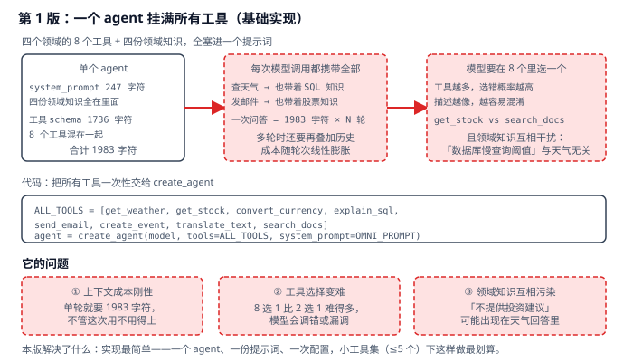
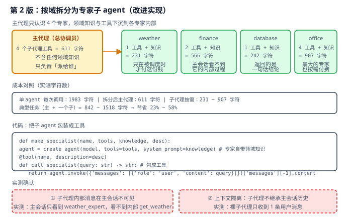
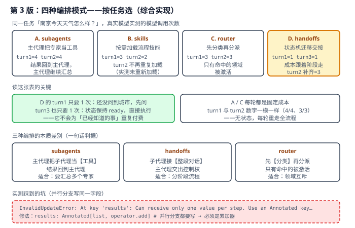

# 实战 12：一个 agent 挂 12 个工具之后

> 配套课程：[第 12 课：Multi-Agent 多智能体](../stages/4-组合与工程化/lessons/lesson-12-Multi-Agent多智能体.md) ｜ 把知识点组装成可落地工作流：每步配设计图与代码（示例级，保证正确、可直接改用）

## 场景

客服 agent 从 3 个工具长到 8 个：查天气、查股价、换汇、解释 SQL、发邮件、建日程、翻译、搜文档。四个领域的知识全写在一份 system_prompt 里——实测这份提示词 **1983 字符，每次模型调用都要完整携带**，哪怕用户只是问天气。工具越多，模型还越容易选错：8 选 1 比 2 选 1 难得多。领域知识也会互相污染，「本系统不提供投资建议」可能出现在天气回答里。——演进目标就是把「一个全能 agent」拆成「主代理 + 领域专家」，并**按任务形状选对编排方式**。

## 全貌一句话

生产级还包括跨进程/跨服务的 A2A 协议、专家之间的共享记忆与冲突仲裁、多智能体的成本归因与预算控制、编排图的可视化调试——属分布式智能体工程话题（非本课范围，点到为止）。本篇聚焦**一个人也能搭起来的最小可用集**：按域拆分 + 四种编排模式（subagents / handoffs / router / skills）+ 自定义工作流。

## 第 1 版：一个 agent 挂满所有工具（基础实现）



> 读图：一份提示词塞进四领域知识与 8 个工具（1983 字符）→ 每次调用全量携带 → 模型在 8 个里挑一个；下方三个红框是它的短板。

```python
# multi_v1.py：第 1 版，一个 agent 挂满所有工具
from langchain.agents import create_agent
from langchain.tools import tool


@tool
def get_weather(city: str) -> str:
    """查询指定城市的当前天气。"""
    return f"{city}：晴，22°C"


# ... 其余 7 个工具（get_stock / convert_currency / explain_sql /
#     send_email / create_event / translate_text / search_docs）

ALL_TOOLS = [get_weather, get_stock, convert_currency, explain_sql,
             send_email, create_event, translate_text, search_docs]

OMNI_PROMPT = "你是全能助手，覆盖四个领域：\n" + "\n".join(DOMAIN_KNOWLEDGE.values()) \
              + "\n根据用户问题选择合适的工具完成任务。"

agent = create_agent(model, tools=ALL_TOOLS, system_prompt=OMNI_PROMPT)
```

> 实测确认（8 个工具、四份领域知识）：`system_prompt` 247 字符 + 工具 schema 1736 字符 = **合计 1983 字符**，每次模型调用都携带。

**它的问题**：**上下文成本刚性**——单轮就要 1983 字符，不管这次用不用得上（多轮还要再叠加历史）；**工具选择变难**——8 选 1 比 2 选 1 难得多，模型会调错或漏调；**领域知识互相污染**——「不提供投资建议」可能出现在天气回答里。

> ⚠️ 别误读：工具少的时候（≤5 个）**单 agent 反而更划算**——拆分会引入额外的模型调用。这个版本的真正问题不是「错」，而是「不随规模伸缩」。

## 第 2 版：按域拆分为专家子 agent（改进实现）

思路：**主代理只认识「有哪几位专家」，领域知识与工具下沉到各专家内部；专家被包成工具，主代理按需调度**。



> 读图：主代理只剩 611 字符（4 个专家工具、零领域知识），四个专家各自带自己的知识与工具；中部是成本对照，底部两个红框是实测确认的性质。

```python
# multi_v2.py：第 2 版，按域拆分
from langchain.agents import create_agent
from langchain.tools import tool


def make_specialist(name: str, tools, knowledge: str, desc: str):
    agent = create_agent(model, tools=tools, system_prompt=knowledge)   # 专家自带领域知识

    @tool(name, description=desc)
    def call_specialist(query: str) -> str:
        r = agent.invoke({"messages": [{"role": "user", "content": query}]})
        return r["messages"][-1].content

    return call_specialist


weather_expert = make_specialist("weather_expert", [get_weather],
                                 DOMAIN_KNOWLEDGE["weather"], "查询天气。输入城市名称。")
finance_expert = make_specialist("finance_expert", [get_stock, convert_currency],
                                 DOMAIN_KNOWLEDGE["finance"], "查询股票价格或做货币换算。")

main_agent = create_agent(
    model, tools=[weather_expert, finance_expert],
    system_prompt="你是总协调员。把子任务交给对应专家，最后汇总答复。",
)
```

> 实测确认：
> - **成本**：单 agent 每次 1983 字符；拆分后主代理 **611 字符**，子代理按需 231~907 字符（weather 231 / finance 566 / database 242 / office 907）；典型一次任务（主 + 一个子）842~1518 字符，**节省 23%~58%**；
> - **子代理内部消息在主会话不可见**：实测主会话消息链只有 `weather_expert`，检索不到子代理内部的 `get_weather` 调用——**你拿到的是一句话结论，不是过程**；
> - **上下文隔离**：实测裸子代理只收到 1 条用户消息。主会话里说过的「我在上海」**不会自动传给子代理**，要传必须显式写进 `query`（这正是主代理 system_prompt 里「调度天气专家时把城市传给它」这句话的由来）。
>
> ⚠️ 这两个性质是**收益也是代价**：上下文隔离让主会话不被子代理的中间过程污染（省钱），但也意味着**子代理是个「失忆的专家」**——它不知道前面聊过什么。需要它知道，就得由主代理显式传递。

**它的问题**：**调度权仍在模型手里**——主代理要自己判断「该派给谁」，领域一多照样可能派错；**成本还是每轮重付**——实测 turn1 与 turn2 都是 4 次模型调用，没有任何省下来；**流程性任务不适合**——客服分诊这种「先问型号、再问故障、最后给方案」的固定步骤，用「派给专家」来表达很别扭。

## 第 3 版：四种编排模式——按任务选（综合实现）

真实模型实测（同一任务「南京今天天气怎么样？」）：

| 模式 | turn1 | turn2 | turn3 | 特点 |
|---|---|---|---|---|
| A. subagents | 4 | 4 | — | 无状态，每轮重走全流程 |
| B. skills | 3 | 2 | — | turn2 不再重复加载技能 |
| C. router | 3 | 3 | — | 只有命中的领域被激活 |
| D. handoffs | **1** | 3 | **1** | 成本跟着对话阶段走 |



> 读图：四个模式各自的实测次数；中部点出 D 为何 turn1/turn3 只要 1 次，底部三个方框是本质差别的一句话判据与实测踩到的坑。

### A. subagents：主代理把专家当工具

见第 2 版代码。**结果回到主代理，主代理继续汇总**——适合「要汇总多个专家结论」的场景（实测并行调度三个专家时，主代理一次发起多个子代理调用）。

### B. skills：按需加载流程技能

把「怎么做」写成一段可加载的技能，避免一上来就全塞进提示词：

```python
SKILLS = {"sql_expert": "你是 SQL 专家。写查询时必须遵守：1) 禁止 SELECT *…"}


@tool
def load_skill(skill_name: str) -> str:
    """加载专业技能包。可用技能：sql_expert / legal_reviewer"""
    return f"[技能已加载: {skill_name}]\n{SKILLS[skill_name]}"


agent = create_agent(
    model, tools=[load_skill],
    system_prompt="任务涉及 SQL 或合同审查时，必须先调用 load_skill 加载对应技能，再按技能要求完成。",
)
```

> 实测：turn1 = 3 次（加载技能 + 查询 + 回复），turn2 = **2 次**且轨迹里**没有再次加载技能**——技能内容已在对话历史里，模型直接执行。**注意这依赖 checkpointer**：没有它，第二轮会话不累积，技能会重复加载（这是本课最容易踩的坑之一，与课 7 memory、课 10 HITL 同源）。

### C. router：先分类再分派

```python
import operator
from typing_extensions import Annotated, TypedDict
from langgraph.graph import END, START, StateGraph


class RouterState(TypedDict):
    query: str
    domains: list
    results: Annotated[list, operator.add]   # ← 并行分支都要写，必须累加器
    final: str


def classify(state):
    r = model.invoke("判断问题涉及哪些领域，只输出 JSON 数组…\n问题：" + state["query"])
    return {"domains": json.loads(r.content)}


g = StateGraph(RouterState)
g.add_node("classify", classify)
for n in ("tech", "finance", "hr"):
    g.add_node(n, make_domain_node(n))
g.add_edge(START, "classify")
g.add_conditional_edges("classify", lambda s: s["domains"], ["tech", "finance", "hr"])
for n in ("tech", "finance", "hr"):
    g.add_edge(n, END)
```

> 实测：`classify` 命中 `["tech", "hr"]` 后，**只有 tech 与 hr 节点被激活，finance 节点全程未执行**——这就是 router 相对 subagents 的价值：不靠模型「选对工具」，而靠图结构保证「没命中的根本不会跑」。
>
> ⚠️ **实测踩到的坑**：并行分支都往 `results` 写时抛 `InvalidUpdateError: At key 'results': Can receive only one value per step. Use an Annotated key to handle multiple values`。**修法是把字段声明为 `Annotated[list, operator.add]`**——并行写入必须配累加器，这不是可选优化，是硬性要求。

### D. handoffs：状态机迁移交接

用 `wrap_model_call` 按状态切换提示词与工具集，**一个 agent 在不同阶段扮演不同角色**：

```python
class SupportState(AgentState):
    current_step: str = "triage"


STEP_CONFIGS = {
    "triage": {"prompt": "你是客服分诊员，询问设备型号与保修状态。", "tools": [record_warranty]},
    "diagnose": {"prompt": "你是故障诊断员，询问故障现象。", "tools": [diagnose_issue]},
    "resolution": {"prompt": "你是维修专家，给出解决方案。", "tools": [provide_solution]},
}


@wrap_model_call
def apply_step_config(request, handler):
    cfg = STEP_CONFIGS[request.state.get("current_step", "triage")]
    request = request.override(system_prompt=cfg["prompt"], tools=cfg["tools"])
    return handler(request)


agent = create_agent(model, tools=[...], state_schema=SupportState,
                     middleware=[apply_step_config], checkpointer=InMemorySaver())
```

> 实测：中间件轨迹显示**同一模型、同一 agent，工具集随 `current_step` 切换**（`triage` 阶段只给 `record_warranty`）。真实模型三轮对话的调用次数是 **1 → 3 → 1**：turn1 还没问到城市，先问（1 次）；turn2 补齐城市后迁移到 `ready`（3 次）；turn3 状态保持 `ready`，直接执行（1 次）。
>
> **这是四种模式里唯一「不为已经知道的事重复付费」的**——A 和 C 的 turn1/turn2 数字完全一样（4/4、3/3），因为它们是**无状态**的，每轮重走全流程。

### 四种模式怎么选

| 模式 | 本质 | 适合 |
|---|---|---|
| subagents | 主代理把子代理当【工具】，结果回到主代理 | 要汇总多个专家结论 |
| handoffs | 子代理接【整段对话】，主代理交出控制权 | 分阶段流程（分诊→诊断→方案） |
| router | 先【分类】再分派，没命中的不跑 | 领域互斥、可预先分类 |
| skills | 按需【加载】流程知识 | 领域多但每次只用一个 |

> 还有第五种：**自定义工作流**——把确定性步骤与 agentic 步骤混编（如 `rewrite → retrieve → agent` 的 RAG 流水线：改写用模型、检索是确定性代码、作答用 agent）。实测节点轨迹 `rewrite(模型) -> retrieve(确定性) -> agent(agentic)`——**不是每个节点都该是 agent**，能确定性地做就别让模型猜。

## 🎯 会用标志

做到这三条，就算把本课「用起来了」：

1. 能说清单 agent 工具膨胀的三个代价（上下文成本刚性 / 工具选择变难 / 领域知识污染），并知道「工具少时单 agent 反而更划算」；
2. 能把子 agent 包成工具实现按域拆分，并说清上下文隔离的收益（省钱）与代价（子代理是失忆专家，需显式传参）；
3. 能对着任务形状从四种编排里选对一种，并说清 handoffs 是唯一「不为已知信息重复付费」的模式。

---

⬅️ **上一课**：[实战 11：让 agent 回答公司内部政策，别让它编](11-Retrieval检索与RAG.md)
➡️ **下一课**：[实战 13：客服 agent 交付门禁](13-Testing与Observability.md)
