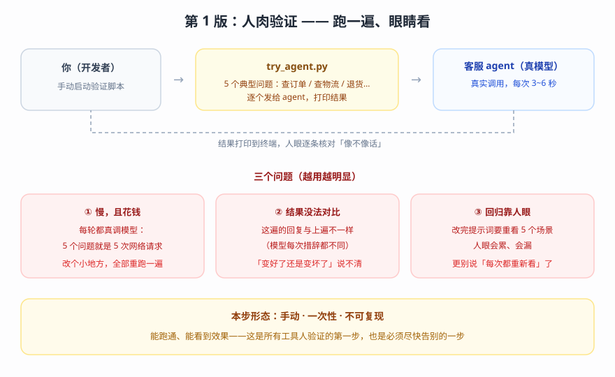
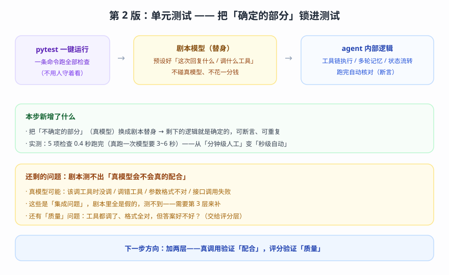
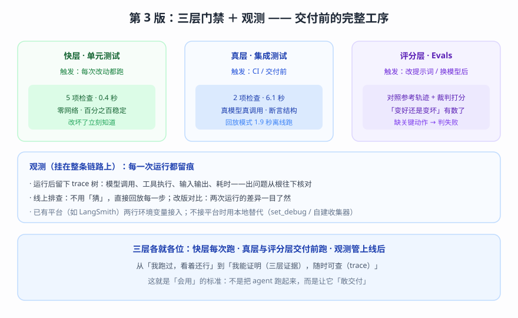

# 实战 13：给客服 agent 建一道「交付门禁」

> 配套课程：[第 13 课：Testing 与 Observability](../stages/4-组合与工程化/lessons/lesson-13-Testing与Observability.md) ｜ 把知识点组装成可落地工作流：每步配设计图与代码（示例级，保证正确、可直接改用）

## 场景

你要把练习用的客服 agent（查订单、查物流、办退货）交给团队使用。老板问：你怎么证明它可靠？改了提示词后变好还是变坏？出错了怎么查？——演进目标就是把这三个问题从「只能靠感觉」变成「有门禁、有记录」。

## 全貌一句话

完整交付体系还包括 CI 流水线集成、测试数据版本管理、线上监控告警——属工程平台话题（非本课范围，点到为止）。本篇聚焦**一个人也能搭起来的最小可用集**：三层门禁 + 观测。

## 第 1 版：人肉验证（基础实现）



> 读图：手动启动脚本，几个典型问题逐个发给真模型；结果打印到终端、人眼核对。下方三个问题框是它的短板。

```python
# try_agent.py：第 1 版，手动验证
import os
from dotenv import load_dotenv
from langchain.agents import create_agent
from langchain.chat_models import init_chat_model
from langchain.tools import tool

load_dotenv()

@tool
def query_order(order_id: str) -> str:
    """根据订单号查询订单状态。"""
    return f'订单 {order_id}：已发货，承运商=顺丰。'

@tool
def apply_return(order_id: str) -> str:
    """为指定订单发起退货申请。"""
    return f'已为订单 {order_id} 发起退货申请。'

model = init_chat_model('qwen3.8-flash', model_provider='openai',
                        base_url=os.environ['BAILIAN_BASE_URL'],
                        api_key=os.environ['BAILIAN_API_KEY'])
agent = create_agent(model, tools=[query_order, apply_return],
                     system_prompt='你是电商客服小助手。')

for q in ['帮我查订单 A12345 的物流',
          '这个订单 A12345 我不想要了，帮我处理一下',   # 最容易出问题的一句
          '你们几点下班？']:                            # 改一行代码，这仨就要手动重跑
    result = agent.invoke({'messages': [{'role': 'user', 'content': q}]})
    print('Q:', q, '| A:', result['messages'][-1].content[:60])
```

**它的问题**：每轮都真调模型（每次 2~6 秒），改一行就要全部重跑；同一句「帮我处理一下」的回复每轮都不一样，好坏说不清；最危险的那类问题（回复礼貌、但事没办成）恰好最容易被眼睛放过。

## 第 2 版：单测工序（改进实现）

第 1 版有一条马上能治：**agent 里「确定的部分」不该让真模型来测**——把模型换成「剧本替身」，工具链、状态、多轮记忆就能被 100% 确定地测：



> 读图：pytest 一键运行 → 剧本模型（预设回复与工具调用）→ agent 内部逻辑 → 自动断言。新增「剧本替身 ＋ 自动断言」，换来秒级、稳定、免费；但剧本是假的，验证不了「真模型会不会配合」。

```python
# tests/test_unit.py：第 2 版，用剧本模型测「确定的部分」
from langchain.agents import create_agent
from langchain.messages import AIMessage, HumanMessage, ToolCall
from langchain.tools import tool
from langchain_core.language_models.fake_chat_models import GenericFakeChatModel


class ScriptedToolModel(GenericFakeChatModel):
    """剧本模型 + 工具支持（内置 fake 模型未实现 bind_tools）。"""

    def bind_tools(self, tools, *, tool_choice=None, **kwargs):
        return self


@tool
def apply_return(order_id: str) -> str:
    """为指定订单发起退货申请。"""
    return f'已为订单 {order_id} 发起退货申请。'


def test_return_task_executes_apply_return():
    """行为骨架：模型决定调工具 → agent 必须真的执行它。"""
    model = ScriptedToolModel(messages=iter([
        AIMessage(content='', tool_calls=[ToolCall(name='apply_return',
                                                   args={'order_id': 'A12345'},
                                                   id='call_1')]),
        '已为您发起退货申请。',
    ]))
    agent = create_agent(model, tools=[apply_return])
    result = agent.invoke({'messages': [HumanMessage(content='订单 A12345 我要退货')]})

    # 断言依据是「消息序列」，不是回复文本——工具被真的执行了吗
    tool_messages = [m for m in result['messages'] if m.type == 'tool']
    assert tool_messages[0].content == '已为订单 A12345 发起退货申请。'
```

**它的问题**：剧本测得再全，也证明不了「真模型会不会配合」（该调工具时没调、调错、参数错）；「质量」维度仍是空的（工具都调对了，但答案好不好、有没有胡说）。

## 第 3 版：完整门禁（综合实现）

把三层装进同一条流水线，再加一盏「长明灯」（观测）：



> 读图：快层每次改动跑；真层 + 评分层在交付前跑；观测挂在整条链路上，上线后每次运行留痕。三层各就各位、互不替代。

工程结构（最小可用版）：

```text
quality_gate/
├── app/agent.py              # agent 本体（业务零改动接观测）
├── tests/conftest.py         # 密钥 + 缺密钥跳过 + VCR 脱敏
├── tests/test_unit.py        # 快层（每次改动跑）
├── tests/test_integration.py # 真层（交付前跑）
├── tests/test_evals.py       # 评分层（大改后跑）
└── pytest.ini                # 分流与录制
```

**① agent 本体**（观测「零改动」——由环境变量控制）：

```python
# app/agent.py
import os
from langchain.agents import create_agent
from langchain.chat_models import init_chat_model
from langchain.tools import tool

@tool
def query_order(order_id: str) -> str:
    """根据订单号查询订单状态。"""
    return f'订单 {order_id}：已发货，承运商=顺丰。'

@tool
def apply_return(order_id: str) -> str:
    """为指定订单发起退货申请。"""
    return f'已为订单 {order_id} 发起退货申请。'

def build_agent():
    model = init_chat_model('qwen3.8-flash', model_provider='openai',
                            base_url=os.environ['BAILIAN_BASE_URL'],
                            api_key=os.environ['BAILIAN_API_KEY'])
    return create_agent(
        model,
        tools=[query_order, apply_return],
        system_prompt='你是电商客服小助手。用户要退货时，先查订单，再调用 apply_return。',
    )
```

**② 评分层的「回归网」**——把「该做的动作」写成参考轨迹，用 `superset` 模式盯住（缺一个必需动作就判失败）：

```python
# tests/test_evals.py
import pytest
from langchain.messages import AIMessage, HumanMessage, ToolMessage
from agentevals.trajectory.match import create_trajectory_match_evaluator

REFERENCE = [   # 退货的正确轨迹：查订单 → 发起退货 → 告知结果
    HumanMessage(content='订单 A12345 我要退货'),
    AIMessage(content='', tool_calls=[{'id': 'r1', 'name': 'query_order',
                                       'args': {'order_id': 'A12345'}}]),
    ToolMessage(content='订单 A12345：已发货，承运商=顺丰。', tool_call_id='r1'),
    AIMessage(content='', tool_calls=[{'id': 'r2', 'name': 'apply_return',
                                       'args': {'order_id': 'A12345'}}]),
    ToolMessage(content='已为订单 A12345 发起退货申请。', tool_call_id='r2'),
    AIMessage(content='已为您发起退货申请。'),
]

evaluator = create_trajectory_match_evaluator(trajectory_match_mode='superset')

@pytest.mark.integration
def test_return_flow_keeps_required_actions(require_api_key):
    """真跑一次退货流程：必要的 apply_return 不能缺席。

    require_api_key 定义在 tests/conftest.py（缺密钥时 skip 而非报错）。
    """
    from app.agent import build_agent       # 按项目结构调整导入路径
    agent = build_agent()
    result = agent.invoke({'messages': [HumanMessage(content='订单 A12345 我要退货')]})
    evaluation = evaluator(outputs=result['messages'], reference_outputs=REFERENCE)
    assert evaluation['score'] is True, evaluation.get('comment')
```

**③ 分流与录制（pytest.ini）**：

```ini
[pytest]
markers =
    integration: 真调模型的测试（默认不跑）
    vcr: 录制 / 回放 HTTP
addopts = -m "not integration" --record-mode=once
```

**④ 观测两条路（选一）**：

```bash
# 路线 A：接平台——环境变量在进程启动前配好
export LANGSMITH_TRACING=true
export LANGSMITH_API_KEY=<YOUR_API_KEY>
```

```python
# 路线 B：本地替代——先跑起来的最小观测
from langchain_core.globals import set_debug
set_debug(True)     # 看每一步执行细节；也可用自建 callback 收集器
```

**这一版各层的日常节奏**：每次改动跑快层（秒级、零成本）→ 交付前 / CI 跑全层（约半分钟）→ 上线后用观测（出问题时回放 / 对比）。

## 🎯 会用标志

做到这三条，就算把本课「用起来了」：

1. 给你一个 agent 工程，能搭出「快层 + 真层 + 评分层」最小门禁，并说清每层该在什么时机跑；
2. 改一次提示词后，能指出「哪些检查会告诉你变好还是变坏」；
3. 接入或本地替代至少一种观测手段，并用 trace 完成过一次真实排查（指出「哪一步不对」）。

---

⬅️ **上一课**：[实战 12：一个 agent 挂 12 个工具之后](12-MultiAgent多智能体.md)
➡️ **下一课**：[结课综合实战项目：智能客服助手](../projects/智能客服助手/README.md)
