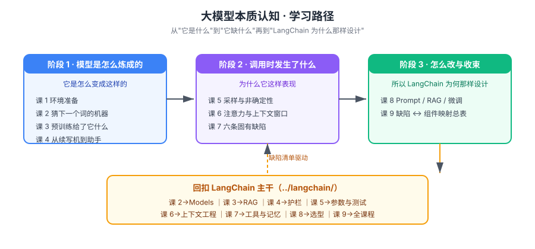

# 大模型本质认知 · 学习路径总览

> 本文件是活文档，随学习进度动态调整。阶段依赖图统一用 SVG。

## 🎯 学习目标

- **目标类型**：理解概念（搞懂"是什么 / 为什么 / 怎么工作"）
- **目标说明**：建立对大模型"是怎么被造出来的、调用时到底发生了什么、它天生缺什么"的系统认知；**不学训练工程**（不反向传播推导、不手写 Transformer、不调分布式训练）
- **为什么需要它**：学 LangChain 时，每个组件其实都在补模型的某个缺陷——不知道缺陷是什么，组件就只是 API 列表
- **实操环境**：复用 `../langchain/playground/` 已验证的 Python 3.12 + uv 环境（不新建项目）；轻量依赖 `tiktoken`（分词与计费实测），**不装 torch / transformers**（重依赖，需要时先征得同意）；模型调用沿用已有 API 链路（凭据在 `playground/.env`，不入库）

> 学习目标是全局基准。目标变更时更新此处，并同步调整相关课。

## 故事主线

- **主角**：一个只会"猜下一个词"的统计机器
- **冲突**：它读完了整个互联网，却不知道你公司的政策、不会算数、还会自信地编造——而你要拿它做生产级应用
- **收束**：看清它"能做什么、不能做什么、怎么补"，于是 LangChain 的每个组件都不再是 API，而是针对某个具体缺陷的解药

📖 故事主线方向（主角：猜词机器 / 冲突：博学却不可靠 / 收束：缺陷 ↔ 组件一一对应）是否合适？不合适可调整，其余结构已落盘。

## 学习路径图

> SVG 展示：3 个阶段、各阶段主题、阶段间前置依赖箭头，以及终点回扣到 LangChain 主干。

## 阶段总览

### 阶段 1：模型是怎么炼成的（"它是怎么变成这样的"）

- **目标**：回答"大模型到底是什么、它是怎么被造出来的"——从 token 到预训练到对齐，走完一条完整的"炼成"链路
- **学习重点**：token 与分词、自回归生成、参数是什么、预训练目标、涌现与上下文学习、知识截止、SFT、RLHF、推理模型
- **必须掌握**：能说清"为什么模型算不清 strawberry 有几个 r"；能解释预训练一个目标为何逼出多种能力；能区分"预训练给了它什么、后训练又改了什么"
- **对应课**：课 1（环境准备）、课 2（语言模型是什么）、课 3（预训练）、课 4（后训练与对齐）

### 阶段 2：调用时发生了什么（"为什么它这样表现"）

- **目标**：回答"我发一句 prompt 进去，里面到底发生了什么"——采样、注意力、上下文窗口，以及由此产生的固有缺陷
- **学习重点**：概率分布与采样、temperature / top_p、非确定性、注意力直觉、KV cache 与上下文代价、lost in the middle、六条固有缺陷
- **必须掌握**：能解释"同一个问题为什么两次答案不同"；能说清长上下文为什么会退化；能列出模型六条固有缺陷及其后果
- **对应课**：课 5（推理与采样）、课 6（上下文窗口与注意力）、课 7（模型的固有缺陷）

### 阶段 3：怎么改与全局收束（"所以 LangChain 为什么要那样设计"）

- **目标**：回答"模型不行的时候怎么办"，并把模型缺陷与 LangChain 组件一一焊上
- **学习重点**：Prompt / RAG / 微调三条路的原理与代价、选型决策、缺陷 ↔ 组件映射总表
- **必须掌握**：能判断"这个需求该 Prompt 还是 RAG 还是微调"；能说清"为什么不该用微调注入知识"；看到 LangChain 任一组件能说出它在补哪个缺陷
- **对应课**：课 8（改模型的三条路）、课 9（收束：从模型缺陷到 LangChain 组件）

### 结课综合实战（Phase 3）

- **目标**：跨阶段整合——用模型原理解释并改进一个真实 agent 的行为
- **覆盖**：token 预算 + 采样调参 + 长上下文 + 缺陷识别 + 三条路选型
- **形式**：待 Phase 3 启动（方案：给 `../langchain/projects/智能客服助手/` 做一次"原理解剖与改进"）

## 当前进度

- [ ] 阶段 1：模型是怎么炼成的（课 1-4）
- [ ] 阶段 2：调用时发生了什么（课 5-7）
- [ ] 阶段 3：怎么改与全局收束（课 8-9）
- [ ] 结课综合实战项目
- [ ] 收尾产物：08-实战经验 / 09-排障速查手册 / 场景解法库 / final-课程手册

## 范围说明（明确不进课）

> 用户已明确：不做训练工程师方向。以下内容**不是"次角色知识"，是范围外**，不进主线也不开子教程。

- **反向传播与梯度推导**：知道"训练 = 调参数使预测更准"即可，不推导
- **Transformer 手写实现**：注意力只讲直觉（QKV 在做什么），不推公式、不写代码
- **分布式训练 / 混合精度 / 显存优化**：训练工程范畴
- **模型架构选型（MoE / Mamba 等）**：不影响应用开发决策
- **从零预训练**：成本量级提到即止

## 与 LangChain 主干的关系

| 本教程 | 回扣到 `../langchain/` |
|--------|----------------------|
| 课 2 token / 自回归 | 课 2 Models 模型层（为什么计费按 token、为什么有流式） |
| 课 3 预训练 / 知识截止 | 课 11 Retrieval 与 RAG（检索的根源） |
| 课 4 SFT / RLHF / 推理模型 | 课 2 推理模型参数、课 10 护栏（对齐的由来） |
| 课 5 采样与 temperature | 课 2 模型参数、课 13 非确定性测试 |
| 课 6 上下文窗口 / lost in the middle | 课 9 上下文工程 |
| 课 7 六条固有缺陷 | 阶段 2-3 全部组件（工具 / 记忆 / 中间件 / 护栏） |
| 课 8 三条路选型 | 课 11 RAG、课 4 工具 |
| 课 9 缺陷 ↔ 组件映射 | 全课程 |

> 每课正文会在「体系收束」幕显式挂上这些回扣锚点。
