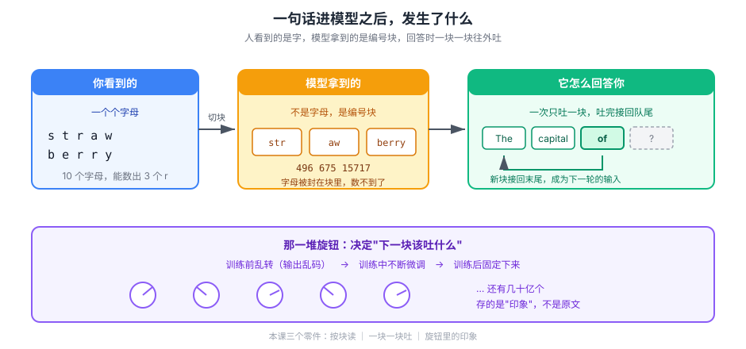

# 课 2：语言模型是什么——一个巨大的"下一个词预测器"

> 📖 **结论已按官方文档核对**（核对于 2026-09-21 ｜ 来源：[OpenAI Cookbook · How to count tokens with tiktoken](https://developers.openai.com/cookbook/examples/how_to_count_tokens_with_tiktoken)、[tiktoken 编码族说明](https://aiwiki.ai/wiki/tiktoken)）
> ✅ 本课全部数值均为 2026-09-21 本机实测（uv 0.11.11 / Python 3.12.13 / tiktoken 0.14.0，编码 `cl100k_base`）

## 🎯 本课目标

把"大模型"这个黑盒拆成三个能理解的零件：**token**（它认什么）、**自回归**（它怎么产出）、**参数**（它学到了什么）。学完你能解释：为什么一个能写代码、能过司法考试的模型，会数不清 `strawberry` 里有几个 r。

### 💡 一句话本质

**这一课把"大模型"从"一个会说人话的黑盒"，变成"一个按块读、一块一块往外吐的机器"。**

### ⚖️ 处境对照

| | 不懂这一课 | 懂了这一课 |
|---|---|---|
| 估成本 | 按字符数估——同样语义的中文，实测 **10 字→11 块 vs 英文 24 字符→5 块**，token 是英文的 **2 倍以上**，账单永远算不准 | 发请求前先分词，成本可精确预估 |
| 用上下文窗口 | 按"字数"判断塞不塞得下，中文应用常在窗口没满时就被截断 | 按 token 计数，窗口占用心里有数 |
| 看到它犯低级错误 | 只会说"它太笨了"，不知道能不能救 | 知道哪些错是输入格式决定的，能靠改输入绕开 |

### 🗺️ 本课地图

| 步 | 这一站 | 你会拿到什么 |
|---|---|---|
| 1 | 第一幕：一道 viral 测试题 | 发现"难度不成比例"的矛盾 |
| 2 | 第二幕：真跑一次分词 | 亲眼看到模型手上没有字母 |
| 3 | 第三幕：拆三个零件 | 它认什么 / 怎么产出 / 学到了什么 |
| 4 | 第四幕：串起来跑一遍 | 可复现的实测输出 |
| 5 | 第五幕：回到那道测试题 | 完整解释 + 在全局中的位置 |

### 🖼️ 一眼全局图



> 看图：左边是你写的字；中间是模型实际收到的东西——**不是字母，是三个编号块**；右边是它回答你的方式：**一次吐一块，吐出来的立刻接回队尾，再吐下一块**；最下面那排旋钮决定"下一块吐什么"，而旋钮里存的是**印象**，不是原文。

---

## 第一幕：场景引入

2024 年夏天，一个测试题在社交网络上疯传。

> 问 GPT-4：`strawberry` 里有几个字母 r？
> 它回答：**2**。
>
> 正确答案是 3。

这不只是一个段子。同一时期，人们发现这些模型会算错两位数乘法、会把单词倒着拼写得一塌糊涂、会坚持认为 `9.11 > 9.9`。

奇怪的地方在于**难度不成比例**：一个能翻译古文、能写可运行代码、能通过律师资格考试的系统，栽在了一个六岁小孩都不会错的问题上。

如果你的直觉是"它太笨了"，那我们换个说法看同一个现象——

**它从来就没有见过字母。**

这不是比喻。接下来我们直接用代码验证。

---

## 第二幕：认知冲突

先建立预期。你可能会说：模型见过海量文本，`strawberry` 这么常见的词，它怎么会不认识？

那我们来实测一下，它**看到**的到底是什么。这段命令你在课 1 的环境里就能跑：

```bash
cd langchain/playground
$env:PYTHONIOENCODING='utf-8'
uv run python -c "
import tiktoken
enc = tiktoken.get_encoding('cl100k_base')
ids = enc.encode('strawberry')
print(ids)
print([enc.decode([i]) for i in ids])
"
```

实测输出：

```
[496, 675, 15717]
['str', 'aw', 'berry']
```

停在这里看清楚三件事：

1. **`strawberry` 被切成了 3 块**，不是 10 个字母，也不是 1 个词
2. **没有任何一块是字母 `r`**
3. 模型真正收到的，是三个整数：`496`、`675`、`15717`

> ⚠️ **顺手辟一个谣**：网上到处流传"strawberry 被切成 straw + berry"，**这是错的**。实测是 `str`+`aw`+`berry`。三块里没有 `straw`。这个错误说法流传之广，恰恰说明大多数人从没真的跑过分词器。

现在矛盾变得具体了：**你问它"有几个 r"，而它手上根本没有任何一个 r 可以数。**

它要回答这个问题，得先在记忆里"回忆"出 `496` 号 token 拼作 s-t-r（含 1 个 r）、`15717` 号拼作 b-e-r-r-y（含 2 个 r），再做 1+0+2 的加法。每一步都是**记忆检索**，不是查看。任何一步回忆偏了，答案就错。

再补一刀，看 `rr` 本身：

```python
enc.encode('rr')   # [637]      -> ['rr']     两个字母，1 个 token
enc.encode('r')    # [81]       -> ['r']      一个字母，1 个 token
```

`rr` 在英语里太常见了（`error`、`correct`、`arrange`），BPE 直接把它合并成了**一个**不可分割的 token。字母在进模型之前就被熔掉了。

**所以第一幕那个"笨"的判断是错的。它不笨，是它的输入格式里没有字母。**

---

## 第三幕：层层揭示

现在把三个零件逐一拆开。

### 知识点 1：token 与分词

#### 一句话定义

**token** 是模型处理文本的最小单位；它通常是一个常见词、词根或标点，**不等于字，也不等于词**。

#### 直觉建立：为什么不用"字"或"词"？

两种极端都不行：

- **按字符切**：词汇表小（几百个），但序列爆炸。一句 10 个字的话变成 10 个 token，长文本直接算不动，而注意力的开销随长度增长极快（课 6 会展开）。
- **按词切**：英语 17 万+ 单词，加上其他语言词汇表爆炸；遇到 `chatgpt` 这种新词直接不认识；`run`/`running`/`ran` 被当成三个毫无关系的符号。

token 是中间的平衡点：**常见组合粘成一块，罕见组合拆成碎块**。

它背后的算法叫 **BPE（Byte Pair Encoding，字节对编码）**——一个 1990 年代的数据压缩算法，2016 年被 Sennrich 等人改造用于神经网络。流程极简，没有任何语言学知识：

```
从单个字符出发
→ 找出语料里最常相邻的一对，合并成新符号
→ 重新统计，再合并下一对
→ 重复几万次，直到词汇表达到目标大小（约 10 万）
```

纯统计驱动。所以 `ing`、`tion`、`un-` 这些高频片段自然会变成 token，因为它们出现得太多了。

#### 核心原理：一张 10 万条目的对照表

`cl100k_base` 这个编码（GPT-3.5 / GPT-4 系列所用）就是一张约 **10 万条**的"片段 → 整数 ID"对照表。文本进模型前先过这张表，出来一串整数。

#### 示例演示

实测几个例子，注意每块的构成：

| 输入 | token 数 | 切分结果 |
|------|---------|---------|
| `hello world` | 2 | `hello` / ` world` |
| `tokenization` | 2 | `token` / `ization` |
| `unbelievable` | 3 | `un` / `belie` / `vable` |
| `strawberry` | 3 | `str` / `aw` / `berry` |
| ` berry`（前有空格）| **1** | ` berry` |

注意最后一行：**加了前导空格，`berry` 反而变成 1 个 token**。因为 ` berry` 这个"空格+词"的组合在真实语料里比裸 `berry` 更常见。

再看两个容易被忽略的细节：

- **空格属于后一个 token**：` world` 带着前面的空格，不是独立的
- **token 即计费单位**：API 按 token 数收费，不是按字符、也不是按请求次数

#### 常见误区

> **误区：token ≈ 单词，英文大概 1 词 1 token，中文大概 1 字 1 token。**

英文那半句勉强成立，**中文这半句差得很远**。实测：

| 文本 | 字符数 | token 数 |
|------|-------|---------|
| `人工智能正在改变世界` | 10 | **11** |
| `AI is changing the world` | 24 | **5** |
| `你好，你怎么样？` | 8 | **9** |
| `Hello, how are you?` | 19 | **6** |

看第一行和第二行：**10 个汉字要 11 个 token，而 24 个字符的英文只要 5 个**。同样的语义，中文的 token 成本可以是英文的 2 倍以上。

原因是 BPE 的词汇表主要在英文语料上训练，中文字符常被按 UTF-8 字节切碎。实测 `人工智能` 的切分：

```
['人', '工', '\ufffd', '\ufffd', '能']     5 个 token，中间两个是字节碎片
```

> 这是**中文 AI 应用一个真实的成本项**，不是理论问题：同样的功能，中文 prompt 的账单更厚、上下文窗口消耗更快。

#### 一句话记住

> **模型读的不是字，是 token；而 token 的切法由统计决定，不由语义决定。**

---

### 知识点 2：自回归生成

#### 一句话定义

**自回归（autoregressive）**：每次只生成**一个** token，把它**接回**输入末尾，再生成下一个，如此循环。

#### 直觉建立

不是"想好了整句话再说"，是"一个字一个字往外蹦，且每蹦一个都要把之前所有的内容重新看一遍"。

#### 示例演示

用实测展示这个"接回去"的动作。提示词 `The capital of France is` 编码为 `[791, 6864, 315, 9822, 374]`。假设模型下一步在不同候选间犹豫：

| 追加 token | 解码结果 |
|-----------|---------|
| `+ 5907` | `The capital of France is Project` |
| `+ 1029` | `The capital of France isml` |
| `+ 11` | `The capital of France is,` |

看到关键了吗：**每加一个 token，整句话就变长一点，然后这个更长的句子成为下一轮的输入**。

#### 核心原理推论

这个机制直接解释了两件事：

**① 为什么生成是串行的、慢的**
第 100 个 token 必须等前 99 个都生成完。不能并行——这就是它和"人一眼扫完一段话"的本质差别。

**② 为什么流式输出（streaming）能逐字吐出来**
不是模型故意一个字一个字发给你，而是**它本来就是一个一个生成的**。流式只是不再憋着，生成一个就发一个。

> 回扣锚点：这正好解释了主干 [课 2 Models 模型层](../../../../langchain/stages/1-入门与模型层/lessons/lesson-02-Models模型层.md) 里为什么"流式"是模型层的一等公民——它不是附加功能，是自回归机制的自然暴露。

#### 常见误区

> **误区：模型先在脑子里打好了整篇草稿，再一次性输出。**

没有草稿。是边写边续写，而且**写出来就不能改**（已经输出的 token 固定了）。这解释了一个常见现象：模型写到一半发现方向错了，只能硬着头皮圆下去——这也是幻觉的成因之一，课 7 会展开。

#### 一句话记住

> **一个 token 一个 token 地生成，输出立刻变成下一轮的输入——所以慢，所以能流式。**

---

### 知识点 3：参数是什么

#### 一句话定义

**参数（parameters）** 是模型在训练中学到的那堆数字；它决定"给定上文，下一个 token 该是什么"。

#### 直觉建立

把它想成**一个巨大配方上的旋钮**：

- 训练前：旋钮全部随机，模型输出乱码
- 训练中：不断微调旋钮，让预测越来越准
- 训练后：旋钮固定，形成这个模型的"性格与能力"

常说的"7B""70B""千亿参数"，就是旋钮的数量。

#### 核心原理：参数量 ≈ 容量，不是数据库

这是最关键、也最容易被搞混的一点。

| 说法 | 对不对 | 说明 |
|------|-------|------|
| 参数量越大，能装的知识越多 | ✅ 大致成立 | 容量更大 |
| 参数是训练数据的压缩表示 | ✅ 这是主流理解 | 有损压缩 |
| 模型里存着一份训练文本的副本，可以检索 | ❌ **错误** | 参数不是数据库 |

**参数不是数据库**。训练文本并没有被"存"进去等待查询，而是被压缩成了权重之间的统计关系。压缩是有损的——这直接导致了课 3 要讲的"知识截止"与"记错细节"。

一个好用的类比：**参数像 JPEG，训练数据像原图**。你能看清画面，但放大到像素级就糊了。问模型"《红楼梦》第 37 回写了什么"，它可能给你一个流畅但细节错误的概述——因为它存的是"印象"，不是原文。

#### 示例演示

同架构、不同参数量的模型，差别体现在哪：

| 维度 | 小参数量 | 大参数量 |
|------|---------|---------|
| 记忆细节 | 弱，容易泛化错误 | 强 |
| 复杂推理 | 多步推理容易断 | 更能维持长链 |
| 成本与速度 | 快、便宜 | 慢、贵 |

> 但注意：**参数量不是唯一变量**。训练数据质量、后训练（课 4）同样决定表现。一个训练得当的小模型，在特定任务上完全可以打赢训练粗糙的大模型。

#### 常见误区

> **误区：模型"背下了"互联网，所以什么都知道。**

它没有背书，它学的是**语言的统计结构**。这解释了两件事：
1. 为什么它对高频知识（常识、流行概念）很准，对长尾细节（你家公司的报销政策）一问三不知
2. 为什么它答错时依然流畅自信——它输出的是"统计上最像答案的东西"，不是"查到的结果"

#### 一句话记住

> **参数是有损压缩后的"印象"，不是可检索的数据库；它决定模型怎么接话，不决定它记得什么原文。**

---

## 第四幕：实操验证

把三个零件用一段代码串起来跑通。存为 `playground/l2-token-lab.py`：

```bash
cd langchain/playground
$env:PYTHONIOENCODING='utf-8'
uv run python l2-token-lab.py
```

```python
"""课 2 实操：token / 自回归 / 中英文成本对比。全部数值为本机实测。"""
import tiktoken

enc = tiktoken.get_encoding("cl100k_base")

print("=== 1. 分词：模型看到的不是字母 ===")
for text in ["strawberry", " berry", "rr", "r"]:
    ids = enc.encode(text)
    pieces = [enc.decode([i]) for i in ids]
    print(f"  {text!r:14} -> {len(ids)} token  {pieces}")

print("\n=== 2. 自回归：一个一个接上去 ===")
prompt = "The capital of France is"
ids = enc.encode(prompt)
print(f"  prompt: {ids}")
for nxt in [5907, 1029, 11]:
    print(f"  + {nxt:5} -> {enc.decode(ids + [nxt])!r}")

print("\n=== 3. 中英文 token 成本对比 ===")
pairs = [
    ("人工智能正在改变世界", "AI is changing the world"),
    ("请总结这份文档的核心观点", "Summarize the key points of this document"),
]
for zh, en in pairs:
    z, e = len(enc.encode(zh)), len(enc.encode(en))
    print(f"  中: {len(zh):2d} 字 -> {z:2d} token ｜ 英: {len(en):2d} 字符 -> {e:2d} token")

print("\n=== 4. 数一数你的 prompt 要花多少 token ===")
my_prompt = "你是一个资深的 Java 工程师，请帮我 review 这段代码，指出潜在的并发问题。"
n = len(enc.encode(my_prompt))
print(f"  {len(my_prompt)} 个字符 -> {n} token")
print(f"  按 $0.15/1M 输入 token 估算：${n / 1_000_000 * 0.15:.8f}")
```

**预期输出**（2026-09-21 实测）：

```
=== 1. 分词：模型看到的不是字母 ===
  'strawberry'   -> 3 token  ['str', 'aw', 'berry']
  ' berry'       -> 1 token  [' berry']
  'rr'           -> 1 token  ['rr']
  'r'            -> 1 token  ['r']

=== 2. 自回归：一个一个接上去 ===
  prompt: [791, 6864, 315, 9822, 374]
  +  5907 -> 'The capital of France is Project'
  +  1029 -> 'The capital of France isml'
  +    11 -> 'The capital of France is,'

=== 3. 中英文 token 成本对比 ===
  中: 10 字 -> 11 token ｜ 英: 24 字符 ->  5 token
  中: 12 字 -> 14 token ｜ 英: 41 字符 ->  9 token

=== 4. 数一数你的 prompt 要花多少 token ===
  43 个字符 -> 34 token
  按 $0.15/1M 输入 token 估算：$0.00000510
```

> **第 4 段建议你自己换成实际在用的 prompt 跑一遍**。多数人第一次看到自己系统提示词的 token 数都会意外——那段看起来只有两三百字的 system prompt，可能比你想象的贵得多。

---

## 第五幕：体系收束

### 本课的三个零件

| 零件 | 它回答什么 | 一句话 |
|------|-----------|--------|
| **token 与分词** | 模型认什么 | 认统计片段，不认字母；中文比英文费 token |
| **自回归生成** | 模型怎么产出 | 一次一个 token，接回去再来；所以慢、所以能流式 |
| **参数是什么** | 模型学到了什么 | 有损压缩的印象，不是可检索的数据库 |

### 回到第一幕的 strawberry

现在你能解释整个链条了：

```
你输入 "strawberry"
  → 分词器切成 [496, 675, 15717]（str / aw / berry）
  → 字母被熔进 token，模型手上没有一个孤立的 r
  → 它只能靠"回忆"每个 token 怎么拼，再做加法
  → 回忆偏一步，答案就少一个 r
```

**不是推理失败，是输入格式里就没有字母。**

顺带一提：把词写成 `s t r a w b e r r y`（字母间加空格），同一个模型往往就答对了。因为加空格后 BPE 没法合并，每个字母成了独立 token——**不是模型变聪明了，是你把字母还给了它**。

这个"改输入格式就能改结果"的思路，后面会反复出现：它是 prompt 工程的一部分，也是"为什么有些任务该交给工具而不该交给模型"的起点（课 7、课 8 展开）。

### 在全局中的位置

本课是阶段 1 的第一块砖：**先看清它是什么，后面才谈得清它缺什么**。

- **课 3** 会回答：这些东西是怎么被训练出来的（一个"猜下一个词"的目标）
- **课 5** 会回答：下一个 token 具体是怎么被选出来的（概率分布与采样）
- **课 6** 会回答：它凭什么能"看到"整段上文（注意力）
- **课 7** 会把本课埋下的伏笔（有损记忆、不能改已输出的内容）收进六条固有缺陷

### 回扣 LangChain 主干

| 本课知识 | 主干对应课 | 它解释了主干里的什么 |
|---------|-----------|-------------------|
| token 即计费单位 | [课 2 Models 模型层](../../../../langchain/stages/1-入门与模型层/lessons/lesson-02-Models模型层.md) | 为什么 API 按 token 计费而不是按字符；为什么成本估算必须先分词 |
| 自回归逐 token 生成 | [课 2 Models 模型层](../../../../langchain/stages/1-入门与模型层/lessons/lesson-02-Models模型层.md)、[课 6 流式](../../../../langchain/stages/2-Agent核心/lessons/lesson-06-Streaming流式输出.md) | 为什么"流式"是模型层的一等公民而不是附加功能 |
| 参数是有损压缩 | [课 11 Retrieval 与 RAG](../../../../langchain/stages/3-可控性与可靠性/lessons/lesson-11-Retrieval检索与RAG.md) | 为什么私域知识必须外挂检索——模型"脑子里"的印象不可靠 |
| 中文 token 更贵 | [课 9 上下文工程](../../../../langchain/stages/3-可控性与可靠性/lessons/lesson-09-ContextEngineering上下文工程.md) | 为什么中文应用的上下文窗口消耗更快、压缩更紧迫 |

### 一句话带走

> **大模型是一个"猜下一个 token"的机器：它读的是统计片段，产的是逐 token 续写，存的是有损压缩的印象。三个零件看清了，它的优点和毛病就都能推出来。**

---

## 🧭 本课导航

**⬅️ 上一课**：[课 1：环境准备](../lessons/lesson-01-环境准备.md)

**➡️ 下一课**：[课 3：预训练——读了什么、学会什么、没学会什么](../lessons/lesson-03-预训练.md)

**↩️ 返回**：[阶段 1 概览](../overview.md) ｜ [课程目录](../../../02-课程目录.md)

**🚀 应用实战**：[实战 2：把 token 账单算明白](../../../应用实战/实战2-把token账单算明白.md)（待编写）

**🗺️ 全局位置**：阶段 1「模型是怎么炼成的」第 2 课 / 共 9 课。三个零件（token / 自回归 / 参数）是后续全部内容的地基。

---

## 📚 参考资料

- [OpenAI Cookbook · How to count tokens with tiktoken](https://developers.openai.com/cookbook/examples/how_to_count_tokens_with_tiktoken) — 官方分词计数方法，`encode`/`decode`/`decode_single_token_bytes` 的权威说明
- [tiktoken 编码族说明](https://aiwiki.ai/wiki/tiktoken) — `r50k_base`/`p50k_base`/`cl100k_base`/`o200k_base` 各编码的词汇量与适用模型
- [How Large Language Models Tokenize Text](https://tomarcher.io/posts/how-large-language-models-tokenize-text/) — BPE 分词的可视化示例与中英文差异
- [BPE 原论文（Sennrich et al., 2016）](https://arxiv.org/abs/1508.07909) — Neural Machine Translation of Rare Words with Subword Units
