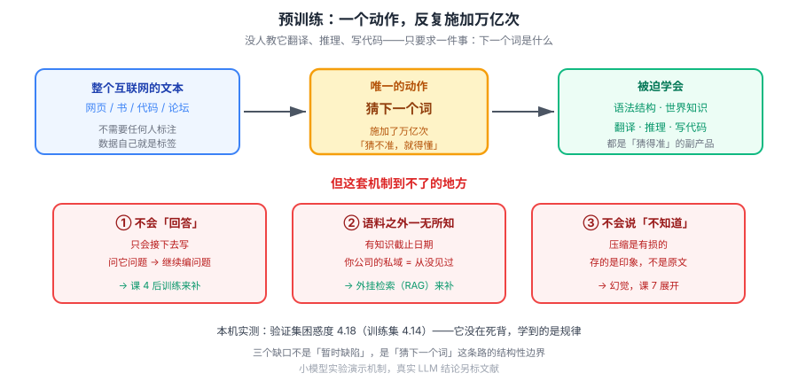

# 课 3：预训练——读了什么、学会什么、没学会什么

> 📖 结论已按公开文献核对（核对于 2026-09-21 ｜ 来源：[Chinchilla 论文](https://arxiv.org/abs/2203.15556)、[Wei et al. 2022 涌现能力](https://arxiv.org/abs/2206.07682)、[Schaeffer et al. 2023 涌现是幻觉吗](https://arxiv.org/abs/2304.15004)、[GPT-3 论文](https://arxiv.org/abs/2005.14165)）
> ✅ 本课实操为 **2026-09-21 本机真实训练**（Python 3.12.13，纯标准库，无 GPU）：字符级 n-gram 语言模型，语料 10,178 字，验证集 1,018 字

## 🎯 本课目标

搞清模型的能力来源：**一个极其简单的训练目标**（猜下一个词）如何在海量数据上逼出翻译、推理、写代码等能力；以及这条路的天然边界——知识截止与有损压缩。

### 💡 一句话本质

**这一课解释"能力从哪来"：不是谁把翻译和推理教给了它，而是一个"猜下一个词"的目标，在足够大的数据和模型上，逼出了这些能力。**

### ⚖️ 处境对照

| | 不懂这一课 | 懂了这一课 |
|---|---|---|
| 估模型能力 | 看参数量排行榜，以为越大越好 | 知道数据/参数/算力要配比，20 tokens/param 是基准线 |
| 遇到它答不上私域问题 | 反复调 prompt，指望"问得更好" | 知道预训练语料里根本没有，**该上 RAG 而不是调 prompt** |
| 看到它编造 | 只当偶发 bug | 知道是"续写"机制的必然产物，从设计上设防 |
| 判断新知识 | 以为联网就能解决一切 | 知道知识截止是结构性的，联网补的是"外部检索"不是"内部知识" |

### 🗺️ 本课地图

| 步 | 这一站 | 你会拿到什么 |
|---|---|---|
| 1 | 第一幕：一个荒谬的实验 | 看到"极低要求"如何逼出"多种能力" |
| 2 | 第二幕：本地真训一个模型 | 亲眼看到训练 = 数频次，别的什么都没做 |
| 3 | 第三幕：拆三个机制 | 自监督 / 涌现与 ICL / 知识截止与压缩 |
| 4 | 第四幕：跑完整实验 | 规模曲线、续写行为、幻觉、有损压缩 |
| 5 | 第五幕：收束 | 三件事学会、三件事没学会 |

### 🖼️ 一眼全局图



> 看图：整个上半部分只有**一个动作**——拿海量文本，反复问"下一个词是什么"。没人教它翻译、没人教它推理。下半部分是这条路**到不了**的地方：语料之外的时间、语料之外的私域、以及压缩必然带来的失真。

---

## 第一幕：场景引入

2020 年，GPT-3 发布。研究者给它下了一个**极其无聊**的任务：

> 读海量文本，然后回答"下一个词是什么"。

就这样。没有标注、没有奖励、没有人告诉它哪句好哪句坏。训练目标是**猜下一个词**。

然后它表现出了这些能力：

- 翻译（没人教过它双语对照表）
- 三位数加减法（没人教过它算术规则）
- 写代码（没人教过它语法树）
- 给几个例子就学会新任务（没人给它做过微调）

这件事至今没有一个完全令人满意的解释。但有一点是清楚的：**这些能力不是被"教"出来的，是被"逼"出来的。**

为什么？我们从最笨的地方开始。

---

## 第二幕：认知冲突

先看一个反直觉的事实：**"猜下一个词"这个任务，根本不需要人标注。**

想想传统的监督学习：要训练一个英法翻译模型，你得先准备几十万对"英文→法文"人工对照。昂贵、缓慢、且总量有限。

但"猜下一个词"不一样。任何一段文本，天然自带标签：

```
输入：云枢科技成立于二零一八年，总部位于
标签：杭
```

**数据本身就是标签**。这意味着可用的训练数据不是"几十万条"，而是**整个互联网**——这是规模上十亿倍的差距。

但这解释不了能力从哪来。猜词而已，怎么会翻译？

我们别猜了，**在本地真训练一个**，看它到底学到了什么。这段命令你就能跑：

```bash
cd langchain/playground
$env:PYTHONIOENCODING='utf-8'
uv run python l3-pretrain-lab.py
```

先看最核心的那段代码——**这就是"训练"的全部**：

```python
def build(text, order):
    """统计 order 元组 -> 下一个字符 的频次。这就是"学习"，没有别的动作。"""
    m = defaultdict(lambda: defaultdict(int))
    for i in range(len(text) - order + 1):
        m[text[i:i + order - 1]][text[i + order - 1]] += 1
    return m
```

数一数"在这个上文之后，下一个字出现了几次"。**没有梯度、没有反向传播、没有损失函数**——就是一个计数器。

现在看它跑出来的第一段输出（语料是一份虚构公司的 wiki 文档，纯叙述体）：

```
=== 0. 语料：没有任何人工标注 ===
  字符数：10178
  不同字符数（词表）：304
```

以及一个关键实验——**它到底是在背，还是在泛化**：

```
=== 记忆 vs 泛化：同一个模型，两段文本 ===
  训练集（背过的）困惑度：4.14
  验证集（没见过）困惑度：4.18
```

停在这里。验证集是它**从没见过**的文本，困惑度 4.18；训练集是它背过的，4.14。**几乎没有差别。**

如果它是在死记硬背，验证集应该崩掉。没有崩——说明它学到的是**规律**，不是原文。

一个只会数频次的计数器，从没见过的新句子上也猜得准。**这就是"猜下一个词"逼出能力的第一个证据。**

---

## 第三幕：层层揭示

### 知识点 1：预训练目标 = 猜下一个词

#### 一句话定义

**预训练（Pretraining）**：在海量的无标注文本上，用"预测下一个 token"这个自监督目标训练模型，让它学会语言的统计结构。

#### 直觉建立：为什么这个笨目标能逼出能力？

关键在**"要猜得准，就得懂"**。看这个例子：

```
"云枢数据中台的核心模块包括数据接入、元数据管理、任务调度与____"
```

要猜中这个空，模型需要知道：这是个并列结构、前面三项都是名词短语、这家公司是做数据平台的。

再看：

```
"The capital of France is ____"
```

要猜中 `Paris`，模型光懂语法没用，**它必须知道法国首都是巴黎**。

**语言建模的压力，逼着模型把世界知识编码进参数。** 这是"猜词"能逼出能力的核心机理——不是有人教它知识，而是**不学知识就猜不准**。

#### 核心原理：无标注自监督

| 维度 | 传统监督学习 | 预训练（自监督） |
|---|---|---|
| 标签来源 | 人工标注 | **数据本身**（下一个词就是标签） |
| 数据规模 | 十万～百万级 | **万亿 token 级** |
| 成本 | 昂贵、瓶颈在人 | 瓶颈在算力与数据清洗 |
| 学到什么 | 特定任务 | 通用语言结构与世界知识 |

#### 示例演示：规模定律直觉

训练资源分三个：参数量 N、数据量 D、算力 C。它们怎么配？本机实测的困惑度曲线（同一模型架构，只变数据量）：

| 训练数据量 | 占全文 | 验证集困惑度 |
|---|---|---|
| 916 | 10% | 24.95 |
| 2,290 | 25% | 11.07 |
| 4,580 | 50% | 6.56 |
| 6,870 | 75% | 4.99 |
| 9,160 | 100% | 4.18 |

**数据量翻 10 倍，困惑度降了 6 倍**——而且注意曲线在变平：从 10%→25% 降了 13.9，从 75%→100% 只降了 0.8。**这就是收益递减。**

真实世界的配比有个基准线，来自 DeepMind 2022 年的 **Chinchilla 论文**：

> 参数量和训练 token 数应该**等比例**增长，最优比约 **1 : 20**（每 1 个参数配 20 个训练 token）。

按这个标准，2020 年的 GPT-3（1750 亿参数，3000 亿 token，约 1:1.7）**是严重"喂不饱"的**。Chinchilla 用 700 亿参数 + 1.4 万亿 token，在同等算力下打败了它——**参数只有 1/4**。

> 所以"参数越大越好"是**过时直觉**。现在的实践是**故意超训**：Llama 3 8B 训了 15 万亿 token，约 1875:1，是 Chinchilla 最优值的 90 多倍。为什么？**训练成本付一次，推理成本付无数次**——小模型训透，服务起来便宜。

#### 常见误区

> **误区：预训练时模型在"学习知识"，像学生背书一样。**

它在**压缩**，不是在**存储**。这两者的区别，知识点 3 会用实测数据说清楚。

#### 一句话记住

> **目标是猜词，压力来自"猜不准就得懂"；数据自己当标签，所以能铺到整个互联网。**

---

### 知识点 2：涌现能力与上下文学习

#### 一句话定义

**涌现能力（Emergent Abilities）**：在小模型上几乎不存在、在大模型上突然出现的能力；**上下文学习（In-Context Learning, ICL）**：只给几个示例，模型就能照着做新任务，**权重一个字都没改**。

#### 直觉建立

先说 ICL，因为它更具体、更能说明问题。GPT-3 论文里最有名的发现就是它：

```
把这段英语翻译成法语：
sea otter => loutre de mer
peppermint => menthe poivrée
plush girafe => girafe peluche
cheese => ???
```

模型输出 `fromage`。**没有人更新过它的任何一个参数。**

它做的事是：从三个例子里**看出规律**（这是英法翻译），然后**照着做**。规律是从上下文里临时学的。

#### 核心原理：上下文里学 ≠ 学进去

这是本课最容易被搞混的一点，实测演示：

```
=== 2. 只学「猜下一个字」，它学到了结构吗？ ===
  [云枢科技] → 云枢科技术个多协环概说付心专十客与况率悉具式能。算法日以销已件三种...
```

> ⚠️ **诚实说明**：上面这段生成**不通顺**。原因不是机制错了，而是我的教学模型太弱（三阶 n-gram，只看前 3 个字符）。它学到了局部字频，抓不住长程结构。
>
> 但我**不打算粉饰这个结果**，因为它恰好演示了下一件事——**架构决定能看多远**。实测同一语料、只改"能看几个字"：

| 模型能看 | 验证集困惑度 |
|---|---|
| 只看前 1 字 | 210.97 |
| 看前 2 字 | 6.86 |
| 看前 3 字 | 4.18 |
| 看前 5 字 | 3.46 |

**从 1 字到 3 字，困惑度掉了 50 倍。** 真实 LLM 靠注意力机制能看几万甚至几百万 token（课 6 展开），这就是同一个维度上量变到质变的差距。

**涌现的争议就在这里。** 2022 年 Wei 等人提出涌现能力，认为能力是"突然出现"的。2023 年 Schaeffer 等人拿了 NeurIPS 最佳论文，反驳说：**这是度量方式的错觉**——用"全对才得分"这种非连续指标，会看到突然跳变；换成连续指标（如逐 token 对数概率），曲线其实是平滑的。

还有一派（Lu et al., ACL 2024）认为：很多所谓涌现，**其实是上下文学习**——模型不是有了新能力，而是从 prompt 的例子里临时学会了。

> **本课立场**：这是**未决争议**，我不替它下定论。但对应用者来说结论一致：**大模型的确能做小模型做不到的事，而且不完全可预测**——不管你叫它涌现还是别的。可预测性存疑这一点，本身就是工程上要设防的理由（课 7）。

#### 示例演示：ICL 与训练的区别

| 维度 | 上下文学习（ICL） | 训练 / 微调 |
|---|---|---|
| 改权重吗 | **不改** | 改 |
| 生效范围 | **仅这一次请求** | 永久 |
| 成本 | 每次都要把例子塞进 prompt | 一次性 |
| 适合 | 临时、多变、量少 | 稳定、量大、要省 token |

#### 常见误区

> **误区：给模型几个例子，它就"学会"了，以后都会了。**

没有。关掉这个对话，下次它什么都不记得。**上下文里发生的事，不会进入参数。** 想让它真的记住，得微调（课 8）或外挂检索（主干课 11）。

#### 一句话记住

> **涌现仍在争论，但 ICL 是确定的：能从例子里临时学规律，但学完就忘，权重纹丝不动。**

---

### 知识点 3：知识截止与压缩式记忆

#### 一句话定义

**知识截止（Knowledge Cutoff）**：模型只知道训练数据时间截点之前的事；**压缩式记忆**：它存的是有损压缩的印象，不是原文副本。

#### 直觉建立

两个问题，两个坑：

**① 时间截点**：训练数据收集截止到某天，之后的事它一概不知。问它"昨天的股价"，它不知道——**而且它不觉得自己不知道**（第 4 个实验会演示）。

**② 私域不在内**：你公司的报销政策、内部 wiki、上周的会议纪要，全都不在预训练语料里。**这不是"它没学好"，是压根没见过。** 这是 RAG 存在的根本原因。

#### 示例演示：三个实测

**实验 A：语料里没有的，它照样接着编**

```
=== 4. 知识截止：语料里没有的事，它会怎么办 ===
  输入：公司的年度旅游目的地是（语料中从未出现）
  输出：公司的年度旅游目的地是城控年铁体源八客构励发源。员，，付包回通费至回六置测波飞构、由培站部位于享支城整
```

看清楚：**语料里从没提过"年度旅游"**，它没有说"我不知道"，而是**立刻接了一段**。语气平稳，毫无迟疑。

> 真实 LLM 的表现好得多（会说"文档未提及"），但**机制完全一样**：训练目标只奖励"接得通顺"，从不奖励"承认不知道"。**幻觉的种子在这里就埋下了。** 课 4 的后训练会部分治这个，但治不干净——课 7 展开。

**实验 B：它存不下原文**

```
=== 5. 有损压缩：它存不下原文 ===
  原文：务超过三百家客户。员工手册规定，员工入职满一年后可享受十天年假。年假需提前三个工作日在系统中提交申请，由直属主管审批。年
  复现：务超过三百家客户。员工手册规定，员工入职满一年后可享受十天年概况表品时间监任培块、百日务规户客。云组负责调度与产品能算舱
  后 30 字与原文字面一致：0/30
```

**前 30 字一字不差，后 30 字错得离谱。** 这就是有损压缩的现场：常见的开头的模式被记住了，越往后越只能靠"印象"蒙。

真实 LLM 的容量大得多，但**性质相同**：问它《红楼梦》第 37 回的细节，它给你一段流畅但可能失真的概述——它存的是印象，不是原文。

**实验 C：为什么它不"查资料"**

因为它没有资料可查。参数不是数据库（课 2 已建立这个结论），这里看到后果：**没有检索动作，只有生成动作。**

#### 常见误区

> **误区：接个联网搜索就解决知识截止了。**

联网补的是**外部信息**，不改变模型**内部知识**。而且更要紧的是：一个在训练中从未被奖励过"承认不知道"的模型，**就算给了它检索工具，它也可能不用、或者用了还瞎编**。这是课 8 要处理的问题。

#### 一句话记住

> **知识有截点、私域不在内、记忆是有损的——这三条不是"暂时缺陷"，是"猜下一个词"这条路的结构性边界。**

---

## 第四幕：实操验证

完整脚本见 `playground/l3-pretrain-lab.py`，纯标准库，无 GPU，几秒跑完。

```bash
cd langchain/playground
$env:PYTHONIOENCODING='utf-8'
uv run python l3-pretrain-lab.py
```

**完整预期输出**（2026-09-21 实测）：

```
=== 0. 语料：没有任何人工标注 ===
  字符数：10178
  不同字符数（词表）：304
  开头 40 字：云枢科技成立于二零一八年，总部位于杭州，是一家专注于企业数据基础设施的公司。公司

=== 1. 规模直觉：数据量 vs 困惑度（验证集 1018 字，未参与训练）===
  训练数据量       占全文       验证集困惑度
  916         10%       24.95
  2290        25%       11.07
  4580        50%       6.56
  6870        75%       4.99
  9160        100%      4.18

=== 2. 只学「猜下一个字」，它学到了结构吗？ ===
  [云枢科技] → 云枢科技术个多协环概说付心专十客与况率悉具式能。算法日以销已件三种来监清服集学接...

=== 3. 它是续写机，不是助手（问它问题会怎样）===
  输入：年假有几天？
  输出：年假有几天？百束额份学企行全制度备制台配属行数个，考销面部位天公司。公队列熟悉务金...
  ↑ 语料里没有问号、没有问答对，它只会接着「写下去」，不会「回答」

=== 4. 知识截止：语料里没有的事，它会怎么办 ===
  输入：公司的年度旅游目的地是（语料中从未出现）
  输出：公司的年度旅游目的地是城控年铁体源八客构励发源。员，，付包回通费至回六置测波飞构...

=== 5. 有损压缩：它存不下原文 ===
  后 30 字与原文字面一致：0/30
```

> **动手建议**：
> 1. 把语料换成你自己的文档（README、会议纪要），看它生成的续写有多离谱
> 2. 把 `split = int(len(TEXT) * 0.9)` 改成 `0.5`，观察数据量减半后困惑度怎么变
> 3. 在第 2 步换个种子词（如"出差报销"），看它能不能接出报销相关内容

> ⚠️ **关于这个模型的诚实说明**：它是**字符级 n-gram**，不是 Transformer，规模差十几个数量级。它演示的是**机制**（猜下一个单元、靠频次、有损压缩），**不能用来推断真实 LLM 的表现**。凡是本课涉及真实 LLM 能力的结论，我都标注了文献来源，不是从这个小模型外推的。

---

## 第五幕：体系收束

### 预训练让它学会了三件事

| 学会的 | 机制 | 证据 |
|---|---|---|
| 语言的统计结构 | 猜词压力逼出语法与搭配 | 验证集困惑度 4.18，未在训练集上崩 |
| 世界知识（有损） | 不懂就猜不准 | 猜中"法国首都是"需要真知识 |
| 临时模仿能力（ICL） | 从上下文现学规律 | GPT-3 few-shot，权重不变 |

### 预训练没给它的三件事

| 没学会 | 后果 | 谁来补 |
|---|---|---|
| **回答问题**（只会续写） | 问它问题会继续编问题 | 课 4 后训练 |
| **语料之外的事实** | 知识截止、私域空白 | 外挂检索（主干课 11） |
| **承认"我不知道"** | 幻觉 | 后训练缓解，课 7 展开 |

### 回到第一幕

现在能回答"为什么猜词会翻译"了：

```
目标只是"猜下一个词"
  → 但数据在考验它：要猜准，必须懂语法、懂事实、懂语境
  → 数据量大到整个互联网，这个压力被施加了万亿次
  → 参数被迫编码下大量结构与知识
  → 翻译、推理、写代码作为"副产品"出现
```

**没有人教它。是"猜得准"这个唯一标准，把能力逼了出来。**

而代价同样清楚：**它只学会了"接下去"，没学会"回答"，也没学会"说不知道"。** 这正是下一课要解决的问题。

### 在全局中的位置

- **课 4** 会接手本课留下的缺口：续写机怎么变成助手
- **课 6** 会回答：为什么 Transformer 能"看"那么远（本课的阶数实验是引子）
- **课 7** 会展开本课的伏笔：幻觉、知识截止对应用意味着什么

> **分工说明**：本课讲**成因**（知识截止从哪来），[课 7](../../2-调用时发生了什么/lessons/lesson-07-模型的固有缺陷.md) 讲**后果**（对应用意味着什么），两课互指不重复。

### 回扣 LangChain 主干

| 本课知识 | 主干对应课 | 它解释了主干里的什么 |
|---|---|---|
| 私域不在预训练语料内 | [课 11 Retrieval 与 RAG](../../../../langchain/stages/3-可控性与可靠性/lessons/lesson-11-Retrieval检索与RAG.md) | **RAG 存在的根本原因**——不是"效果更好"，是"模型压根没见过" |
| 上下文里学不算学进去 | [课 9 上下文工程](../../../../langchain/stages/3-可控性与可靠性/lessons/lesson-09-ContextEngineering上下文工程.md) | 为什么 few-shot 例子要**每次都带**，且成本随轮次累积 |
| 有损压缩、不认"不知道" | [课 11 Retrieval 与 RAG](../../../../langchain/stages/3-可控性与可靠性/lessons/lesson-11-Retrieval检索与RAG.md) | 为什么必须做事实性评测，不能只看"流畅度" |

### 一句话带走

> **预训练只教了一件事——猜下一个词。能力是这条唯一标准在万亿次压力下逼出来的副产品，而"只会接、不会答、不会说不知道"是这条路的三个结构性缺口。**

---

## 🧭 本课导航

**⬅️ 上一课**：[课 2：语言模型是什么](../lessons/lesson-02-语言模型是什么.md)

**➡️ 下一课**：[课 4：后训练——从续写机到助手](../lessons/lesson-04-后训练.md)

**↩️ 返回**：[阶段 1 概览](../overview.md) ｜ [课程目录](../../../02-课程目录.md)

**🗺️ 全局位置**：阶段 1「模型是怎么炼成的」第 3 课 / 共 9 课。回答"能力从哪来"，并为课 4 的对齐埋下缺口。

---

## 📚 参考资料

- [Training Compute-Optimal Large Language Models（Chinchilla）](https://arxiv.org/abs/2203.15556) — Hoffmann et al. 2022，20 tokens/param 最优配比的出处
- [Emergent Abilities of Large Language Models](https://arxiv.org/abs/2206.07682) — Wei et al. 2022，涌现能力的提出
- [Are Emergent Abilities of Large Language Models a Mirage?](https://arxiv.org/abs/2304.15004) — Schaeffer et al. 2023，NeurIPS 最佳论文，涌现的度量质疑
- [Language Models are Few-Shot Learners（GPT-3）](https://arxiv.org/abs/2005.14165) — ICL 的原始发现
- [Emergent Abilities in Large Language Models: A Survey](https://arxiv.org/abs/2503.05788) — Berti et al. 2025，争议全貌综述
