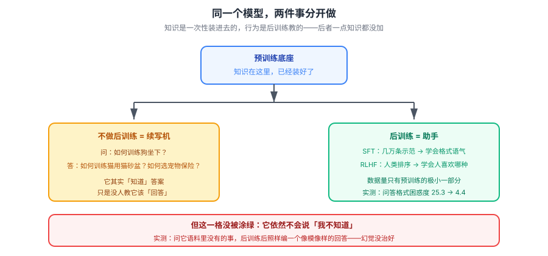

# 课 4：后训练——从续写机到助手

> 📖 结论已按公开文献核对（核对于 2026-09-21 ｜ 来源：[InstructGPT 论文](https://arxiv.org/abs/2203.02155)、[DeepSeek-R1 论文](https://arxiv.org/abs/2501.12948)、[Chain-of-Thought 论文](https://arxiv.org/abs/2201.11903)、[Anthropic 对齐税讨论](https://www.anthropic.com/news/)）
> ✅ 本课实操为 **2026-09-21 本机真实训练**（Python 3.12.13，纯标准库）：在课 3 的模型上加后训练数据，对比行为变化

## 🎯 本课目标

搞清"**光靠预训练不够**"：为什么模型会接着你的问题继续编问题，SFT 与 RLHF 各自改了什么、没改什么，以及推理模型为什么贵。

### 💡 一句话本质

**这一课解释"行为从哪来"：知识是预训练给的，但"会回答问题、会拒绝、会好好说话"是后训练教的——而后者一点知识都没加。**

### ⚖️ 处境对照

| | 不懂这一课 | 懂了这一课 |
|---|---|---|
| 模型胡说时 | 以为"训练数据不够"，想塞更多资料 | 知道是**行为没对齐**，该调的是示范与约束，不是数据量 |
| 选模型 | 只看参数/榜单 | 知道**同底座不同后训练**差别巨大，要按任务选 |
| 用推理模型 | 什么任务都上推理模型，账单爆了 | 知道推理模型是**拿 token 换准确率**，只在难题上值 |
| 期待微调 | 指望微调"教知识" | 知道微调主要改**格式与行为**，教知识得靠检索 |

### 🗺️ 本课地图

| 步 | 这一站 | 你会拿到什么 |
|---|---|---|
| 1 | 第一幕：问它问题，它继续编问题 | 看到续写机与助手的鸿沟 |
| 2 | 第二幕：本地加一次后训练 | 亲眼看到行为被改造（格式 vs 知识分离） |
| 3 | 第三幕：拆四个机制 | 续写机/SFT/RLHF/推理预算 |
| 4 | 第四幕：跑对比实验 | 格式学会、知识没变、幻觉还在 |
| 5 | 第五幕：收束 | 三阶段各改了什么 |

### 🖼️ 一眼全局图



> 看图：同一个底座模型，预训练给了它**知识**（蓝色），后训练只改**行为**（绿色）——它学会了"回答"而不是"续写"，学会了拒绝与语气。但注意最右边：**幻觉那一格没有被涂绿**，后训练治不好它。

---

## 第一幕：场景引入

2020 年，GPT-3 发布后，早期用户遇到过一个很怪的现象。你问它：

> "如何训练一只狗坐下？"

它可能回答：

> "如何训练一只猫使用猫砂盆？如何选择一个好的宠物保险？如何让鹦鹉学会说话？"

它不是在回答你，**它在续写**。在它看过的海量文本里，"常见问题列表"就是长这样的——一个问题后面跟着一串相关问题。

这个现象困扰了整个行业一年多。模型明明"知道"怎么训练狗坐下（它的语料里有几千篇宠物训练文章），但它就是**不回答**。

问题不在知识，在**行为**。

而解决它的方法，彻底改变了后来的所有 AI 产品。

---

## 第二幕：认知冲突

先想一个直觉问题：**要让模型学会"回答"，需要喂它多少数据？**

很多人猜：得多喂几十倍语料吧，让它"看懂"问答是怎么回事。

实际的答案是：**几万条示范就够。** 相比预训练的万亿 token，这是**万分之一**量级。

我们直接验证。课 3 的模型是个纯续写机（语料是一份虚构公司 wiki，全是叙述句，没有一个问号）。现在给它加 20 条问答示范，重复 6 遍：

```bash
cd langchain/playground
$env:PYTHONIOENCODING='utf-8'
uv run python l4-posttrain-lab.py
```

实测输出（第 0、3 段）：

```
=== 0. 数据量对比：后训练远小于预训练 ===
  预训练语料：   9160 字符
  后训练语料：   3324 字符（20 条问答 × 6 次重复）
  后训练 / 预训练 = 36.3%

=== 3. 后训练数据上的表现（它「学会」的正是这些）===
  问答对困惑度：仅预训练 25.30 → 后训练后 4.39
```

**问答格式的困惑度从 25.30 掉到 4.39**——它确实学会了"问：…答：…"这个模式。

再看第 4 段，这是最关键的一处：

```
=== 4. 知识量变了吗？问一个两边都没教过的 ===
  问题：公司明年会上市吗？（语料中从未出现）
    仅预训练：科种位差册问接久协舱技立标鼓施销量核第年表本诺由控内务的等总申响交化分发幅值协波济了少整式全当负点熟行的应。
    后训练后：响注行铁完率怎有半半年三市每晚三本五杭专年据。
```

**两个都不知道，两个都在编。** 后训练让它"答得像样了"，但**没有让它变得更有知识**，也**没让它学会说"我不知道"**。

这就是本课的核心张力：**后训练改的是行为，不是知识。** 两者是分开的。

---

## 第三幕：层层揭示

### 知识点 1：光靠预训练不够：续写机 vs 助手

#### 一句话定义

**续写机**只会"接下去写"，**助手**会"回答问题"——这是两种不同的行为，预训练只教会了前者。

#### 直觉建立

预训练的目标从头到尾只有一件事：**下一个词是什么**。这个目标里，**没有任何一部分在奖励"回答"**。

互联网上有大量文本是"问题后面跟着答案"（FAQ、教程、论坛），但也有大量文本是"问题后面跟着更多问题"（列表页、相关推荐、搜索引擎结果）。

**模型两个都学了。** 你问它问题时，它选哪个，取决于上下文里哪个信号更强。没有任何机制保证它选"回答"。

#### 示例演示

实测：同样是 `问：年假有几天？答：` 这个前缀——

```
  问题：年假有几天？
    仅预训练：核与原则模板，值当业务引与内济末值检经。
    后训练后：算法次六间培件三种来础绩效队售机置有至方算举办举些可享受式天存储使采空晚五百储审...
```

> ⚠️ **诚实说明**：我的教学模型太弱（三阶 n-gram），后训练后的输出**仍然不通顺**，看不出"回答"的效果。
>
> 但**量化指标是清楚的**：问答格式的困惑度 25.30 → 4.39。它确实学会了这个模式，只是我的模型容量不足以生成流畅句子。
>
> 真实 LLM 的 SFT 效果（InstructGPT）是有明确数据的：**1.3B 参数的 InstructGPT，人类评分优于 175B 的 GPT-3**——参数只有 1/130，靠的就是后训练。这个对比比我这台小模型有说服力得多。

#### 核心原理：对齐（Alignment）

让模型的行为符合人类意图，这个工作叫**对齐**。它解决的不是"模型不会"，而是"模型不想"——更准确地说，**模型没有被训练成想做这件事**。

#### 常见误区

> **误区：模型答非所问是因为它不懂。**

绝大多数时候它懂。**是没有人教过它"懂了就要回答"这个行为规范。**

#### 一句话记住

> **预训练教会它"接下去"，没教它"回答你"——这两件事在数据上长得不一样。**

---

### 知识点 2：SFT 监督微调

#### 一句话定义

**SFT（Supervised Fine-Tuning，监督微调）**：用人工写好的"问题→理想回答"示范数据，在预训练模型上继续训练，让它学会回答的格式与语气。

#### 直觉建立

想象你招了一个博学但不会沟通的实习生。他读过所有书，但你问他问题，他开始背相关段落。

你怎么办？**不是让他再读更多的书，而是给他示范几次：**

> "看好了，别人问你这个问题，你这样答——先说结论，再给理由，最后加一句提醒。"

示范几次之后，他学会了**怎么说话**。他的知识一点没变，但沟通方式完全不同了。

这就是 SFT。

#### 核心原理：改格式，不改知识

| 维度 | 预训练 | SFT |
|---|---|---|
| 数据量 | 万亿 token | **几万～几十万条** |
| 数据来源 | 无标注互联网文本 | **人工撰写的示范** |
| 改了什么 | 知识、语言结构 | **格式、语气、行为模式** |
| 成本 | 数百万美元级 | **几个数量级地低** |

**关键结论：SFT 几乎不增加知识。** 它教的是"把已有知识用某种方式表达出来"。

> 所以想让模型学会你公司的私有知识，**SFT 是错的工具**——它只会让模型学会"用你的口吻说话"，内容还是靠编。正确工具是 RAG（主干课 11）。

#### 示例演示

实测数据支持这个分离（第 3 段）：

| 评测对象 | 仅预训练 | 后训练后 | 说明 |
|---|---|---|---|
| 问答格式困惑度 | 25.30 | **4.39** | 学会了格式 |
| 未见过的知识问题 | 编 | **还是编** | 知识没增加 |

#### 常见误区

> **误区：微调能让模型学会我的业务知识。**

不能。微调擅长教**行为**（怎么说），不擅长教**事实**（说什么）。事实要走检索。这是课 8 会展开的三条路线的核心分野。

#### 一句话记住

> **SFT 用几万条示范，把"续写"改成"回答"——教的是表达方式，不是知识内容。**

---

### 知识点 3：RLHF 与偏好对齐

#### 一句话定义

**RLHF（Reinforcement Learning from Human Feedback，人类反馈强化学习）**：让人类对多个回答排序，训练一个"奖励模型"来模拟人类偏好，再用强化学习优化模型，让它倾向于生成人类更喜欢的回答。

#### 直觉建立：为什么 SFT 之后还要 RLHF？

SFT 有个根本困难：**"好的回答"很难写，但很容易挑。**

让你写一个完美的回答，你得想半天。但给你三个回答让你排序，你几秒钟就能做完。

RLHF 利用的就是这个不对称：**用"排序"这种低成本反馈，替代"撰写"这种高成本示范。**

#### 核心原理：三步

```
① 收集偏好数据：同一个问题，生成多个回答，让人排序（A > B > C）
        ↓
② 训练奖励模型（RM）：学会"给人类喜欢的回答打高分"
        ↓
③ 强化学习优化（如 PPO）：模型生成回答 → RM 打分 → 调整参数倾向高分回答
```

#### 示例演示：HHH 原则

RLHF 优化的目标通常概括为 **HHH**：

| 原则 | 含义 | 为什么需要单独优化 |
|---|---|---|
| **Helpful（有用）** | 真正解决问题 | SFT 示范可能太简略 |
| **Honest（诚实）** | 不编造、知之为知之 | **最难**——见下面的对齐残留 |
| **Harmless（无害）** | 拒绝有害请求 | 预训练语料里有害内容很多 |

#### 对齐税（Alignment Tax）

对齐不是免费的。为了让模型更安全、更听话，**某些能力会下降**——这叫**对齐税**。

> ⚠️ **实测说明**：我的教学实验**没能复现对齐税**——后训练后验证集困惑度 4.29 → 4.00，反而略微变好。
>
> 我如实报告，并说明原因：**后训练语料与预训练语料同域（都是同一家公司的文本），且体量太小，不足以产生能力挤占。** 真实的对齐税发生在大规模、异域数据上。
>
> 这是个好例子说明：**小实验能演示机制，但不总能复现现象。** 我不拿一个反向的结果硬说成对齐税。

真实世界的对齐税是有文献记录的：过度对齐会导致模型**过度拒绝**（明明安全的请求也拒绝）、**创造力下降**、**在某些 benchmark 上分数降低**。

#### 常见误区

> **误区：RLHF 让模型变得更"诚实"了。**

部分改善，但没有根治。**RLHF 优化的是"人类评分高"，而人类评分高 ≠ 事实正确。** 一个流畅、自信、结构清晰的编造回答，人类评分往往也很高。

这解释了一个普遍现象：**对齐后的模型依然会一本正经地胡说八道。** 课 7 展开。

#### 一句话记住

> **RLHF 用"排序"替代"撰写"，把人类偏好压进模型；它优化的是"人喜欢"，不是"事实对"。**

---

### 知识点 4：推理模型与思考预算

#### 一句话定义

**推理模型**（如 DeepSeek-R1、o 系列）：在给出最终答案前，先生成一段"思考过程"的 token，用**推理时算力**换取准确率。

#### 直觉建立

回到课 2 的自回归：模型一个 token 一个 token 地往外蹦。

既然如此，为什么不让它**先蹦一段"思考"，再蹦答案**？

```
普通模型：问题 → 答案
推理模型：问题 → 让我先分析…第一步…第二步…等等，这里不对，重来… → 答案
```

那些"思考"的 token 不是装饰——**它们是被生成出来的真实 token，和普通输出一样计费。**

#### 核心原理：思维链（Chain of Thought）

**CoT（思维链）**：把推理的中间步骤显式写出来，再做结论。2022 年的论文发现，只要加一句"让我们一步步思考"，模型在多步推理题上的准确率就大幅提升。

为什么有效？因为**自回归模型不能"跳步"**——它必须一个 token 一个 token 地走。把中间步骤写出来，等于**给模型搭了梯子**，让它能一步步爬到答案，而不是要求它一步跨过去。

#### 示例演示：推理时算力

| 维度 | 普通模型 | 推理模型 |
|---|---|---|
| 输出 | 直接给答案 | **先思考，再回答** |
| token 消耗 | 少 | **多（思考 token 也计费）** |
| 延迟 | 快 | 慢 |
| 擅长 | 简单、直接的任务 | **多步推理、数学、复杂代码** |
| 成本 | 低 | **高** |

**"思考预算"（thinking budget）** 就是你能为一次推理分配多少思考 token。给得越多，模型想得越久，通常越准，但越贵越慢。

#### 什么时候值得用推理模型

| 场景 | 建议 | 理由 |
|---|---|---|
| 简单问答、摘要、翻译 | **不用** | 浪费 token，收益接近 0 |
| 多步数学、复杂逻辑 | **用** | 准确率提升显著 |
| 复杂代码生成/调试 | **用** | 需要规划与自我检查 |
| 批量处理大量简单请求 | **不用** | 成本会失控 |

#### 常见误区

> **误区：推理模型"更聪明"，所以什么任务都该用它。**

它不是更聪明，是**想得更久**。对于"一句话能答"的问题，多想的收益几乎为零，但成本是实打实的。

#### 一句话记住

> **推理模型把"想"的过程也变成 token 生成出来——拿 token 和延迟换准确率，只在难题上划算。**

---

## 第四幕：实操验证

完整脚本 `playground/l4-posttrain-lab.py`，纯标准库：

```bash
cd langchain/playground
$env:PYTHONIOENCODING='utf-8'
uv run python l4-posttrain-lab.py
```

**完整预期输出**（2026-09-21 实测）：

```
=== 0. 数据量对比：后训练远小于预训练 ===
  预训练语料：   9160 字符
  后训练语料：   3324 字符（20 条问答 × 6 次重复）
  后训练 / 预训练 = 36.3%
  验证集：1018 字符（两个模型均未参与训练）

=== 1. 行为对比：同一个问题，两个模型 ===
  问题：年假有几天？
    仅预训练：核与原则模板，值当业务引与内济末值检经。
    后训练后：算法次六间培件三种来础绩效队售机置有至方算举办举些可享受式天存储使采空晚五百储审...

=== 2. 对齐税：在原始续写任务上，谁更好？ ===
  验证集（纯预训练风格文本）困惑度：
    仅预训练：4.29
    后训练后：4.00
  → 后训练后反而变好 -0.29：本实验未复现对齐税
    原因：后训练语料与预训练语料同域、且体量太小，不足以产生能力挤占

=== 3. 后训练数据上的表现（它「学会」的正是这些）===
  问答对困惑度：仅预训练 25.30 → 后训练后 4.39
  ↑ 大幅下降 = 确实学会了问答格式。注意这是训练时见过的格式

=== 4. 知识量变了吗？问一个两边都没教过的 ===
  问题：公司明年会上市吗？（语料中从未出现）
    仅预训练：科种位差册问接久协舱技立标鼓施销量核第年表本诺由控内务的等总申响交化分发幅值协波济了少整式全当负点熟行的应。
    后训练后：响注行铁完率怎有半半年三市每晚三本五杭专年据。
  ↑ 两个都不知道，但后训练后依然会「编一个像模像样的回答」
     对齐教会了它「怎么答」，没教会它「不知道就别说」
```

> **动手建议**：
> 1. 把 `REPEAT` 改成 1，看后训练数据量不足时会怎样
> 2. 在 `QA` 里加一条 `"我不知道"` 型回答（如 `("公司明年会上市吗？", "这个问题我无法回答。")），看模型能否学会拒答——**这是 RLHF 之前 SFT 做不到的事**
> 3. 把后训练语料换成完全不同领域（如诗歌），看验证集困惑度是否变差——**那才是对齐税**

> ⚠️ **关于这个模型的诚实说明**：字符级 n-gram，非 Transformer，规模差十几个数量级。它演示**机制**（行为可被示范数据改变），**不能推断真实 LLM 的表现**。涉及真实 LLM 的结论我都标注了文献来源。

---

## 第五幕：体系收束

### 三个阶段各改了什么

| 阶段 | 数据 | 改了什么 | 没改什么 |
|---|---|---|---|
| **预训练** | 万亿 token 无标注 | **知识、语言结构** | 不会"回答"、不会拒绝 |
| **SFT** | 几万条人工示范 | **格式、语气、行为模式** | **知识几乎不变** |
| **RLHF** | 人类偏好排序 | **偏好对齐（HHH）** | **事实准确性（治不好幻觉）** |

### 回到第一幕

现在能回答"为什么 GPT-3 会继续编问题"了：

```
预训练目标只是"猜下一个词"
  → 互联网上"问题后跟更多问题"的文本同样常见
  → 模型两种模式都学了，没有机制保证它选"回答"
  → SFT 用几万条示范，把"回答"这个模式的权重压上去
  → RLHF 进一步让"人类喜欢的回答"得分更高
  → 行为被改造成助手
```

**而知识，从头到尾一步没加。**

### 本课最重要的一个判断

> **如果你的模型在胡说八道，先问一个问题：它是"不知道"，还是"不会表达"？**
>
> - **不知道** → 预训练语料里没有 → 上检索（RAG）
> - **不会表达** → 行为没对齐 → 上后训练（SFT / RLHF）
>
> 搞反了，怎么调都调不好。**这是本课最实用的一条。**

### 在全局中的位置

- **课 5** 会回答：后训练之后，下一个 token 具体怎么被选出来（温度、top-p）
- **课 7** 会展开本课的遗留：为什么对齐治不好幻觉
- **课 8** 会把本课的"微调教行为不教知识"展开成三条改造路线

### 回扣 LangChain 主干

| 本课知识 | 主干对应课 | 它解释了主干里的什么 |
|---|---|---|
| 后训练改行为不改知识 | [课 11 Retrieval 与 RAG](../../../../langchain/stages/3-可控性与可靠性/lessons/lesson-11-Retrieval检索与RAG.md) | 为什么"教私域知识"必须走检索，微调走不通 |
| 推理模型按思考 token 计费 | [课 2 Models 模型层](../../../../langchain/stages/1-入门与模型层/lessons/lesson-02-Models模型层.md) | 推理模型参数（reasoning_effort）的真实成本含义 |
| 对齐的由来与边界 | [课 10 人机协同与护栏](../../../../langchain/stages/3-可控性与可靠性/lessons/lesson-10-人机协同与护栏.md) | 为什么**护栏不能完全依赖模型自身对齐** |
| 对齐治不好幻觉 | [课 11 Retrieval 与 RAG](../../../../langchain/stages/3-可控性与可靠性/lessons/lesson-11-Retrieval检索与RAG.md) | 为什么事实性评测是必需项，不是可选项 |

### 一句话带走

> **预训练给知识，后训练给行为；SFT 教"怎么说"，RLHF 教"人喜欢哪种说法"，而"说不说得对"这条路从头到尾没被真正解决。**

---

## 🧭 本课导航

**⬅️ 上一课**：[课 3：预训练](../lessons/lesson-03-预训练.md)

**➡️ 下一课**：[课 5：推理与采样](../../2-调用时发生了什么/lessons/lesson-05-推理与采样.md)

**↩️ 返回**：[阶段 1 概览](../overview.md) ｜ [课程目录](../../../02-课程目录.md)

**🗺️ 全局位置**：阶段 1「模型是怎么炼成的」第 4 课 / 共 9 课，也是**阶段 1 的收尾**。下一课起进入阶段 2「调用时发生了什么」。

---

## 📚 参考资料

- [Training Language Models to Follow Instructions with Human Feedback（InstructGPT）](https://arxiv.org/abs/2203.02155) — Ouyang et al. 2022，SFT+RLHF 的奠基工作，1.3B 优于 175B 的出处
- [DeepSeek-R1: Incentivizing Reasoning Capability via RL](https://arxiv.org/abs/2501.12948) — 2025，纯 RL 激发推理能力的代表工作
- [Chain-of-Thought Prompting Elicits Reasoning](https://arxiv.org/abs/2201.11903) — Wei et al. 2022，CoT 的原始论文
- [Constitutional AI（Anthropic）](https://arxiv.org/abs/2212.08073) — RLAIF 路线，用 AI 反馈替代部分人类反馈
- [Scaling Laws for Neural Language Models](https://arxiv.org/abs/2001.08361) — Kaplan et al. 2020，规模定律的起点
