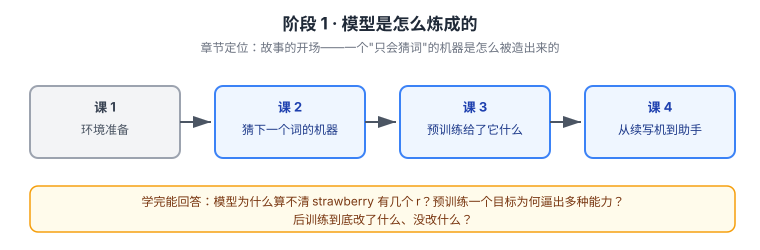

# 阶段 1 · 模型是怎么炼成的

> 章节定位：故事的开场——**它是怎么变成这样的**。
> 主角登场：一个只会猜下一个词的统计机器。这一阶段不评价它好不好用，只回答"它到底是什么、怎么被造出来的"。

> 看图：从左到右走完"造模型"的完整链路——先备好能跑分词的环境，再认识它的最小工作单位（token），然后看预训练喂给它什么，最后看后训练怎么把它从"续写机"改成"助手"。

## 🎯 阶段目标

回答三件事：大模型**是什么**（课 2）、它是**怎么学到东西的**（课 3）、又是**怎么变得像助手的**（课 4）。学完你应该能向一个外行讲清楚"大模型为什么能聊天"。

## 学习重点

- token 与分词——模型不认字符，认的是 token
- 自回归生成——一次一个 token，输出接回输入
- 参数——训练学到的那堆数，容量而非数据库
- 预训练目标——猜下一个词，一个目标逼出多种能力
- 涌现与上下文学习——为什么 few-shot 有效
- 知识截止——训练数据的时间截点，私域数据不在内
- SFT / RLHF——后训练改格式与偏好，不改知识
- 推理模型——把算力花在"想"上，所以贵

## 必须掌握的知识点

| 课 | 必须掌握 |
|----|---------|
| 课 2 | 能说清"为什么模型算不清 strawberry 有几个 r"；能解释为什么生成是串行、为什么能流式逐字出 |
| 课 3 | 能解释预训练只有一个目标为何逼出翻译、推理等能力；能说清知识截止是什么意思 |
| 课 4 | 能区分"预训练给了它什么、后训练又改了什么"；能解释推理模型为什么贵 |

## 对应课

- 课 1：环境准备（轻量结构 · 直述模式，已有环境可跳过）
- 课 2：语言模型是什么——一个巨大的"下一个词预测器"
- 课 3：预训练——读了什么、学会什么、没学会什么
- 课 4：后训练——从续写机到助手

## 回扣 LangChain

| 本课知识 | 回扣到 |
|---------|--------|
| token / 自回归 | [课 2 Models 模型层](../../../langchain/stages/1-入门与模型层/lessons/lesson-02-Models模型层.md)（为什么按 token 计费、为什么有流式） |
| 知识截止 | [课 11 Retrieval 与 RAG](../../../langchain/stages/3-可控性与可靠性/lessons/lesson-11-Retrieval检索与RAG.md)（检索的根源） |
| SFT / RLHF / 推理模型 | [课 2 模型参数](../../../langchain/stages/1-入门与模型层/lessons/lesson-02-Models模型层.md)、[课 10 护栏](../../../langchain/stages/3-可控性与可靠性/lessons/lesson-10-人机协同与护栏.md)（对齐的由来） |

## 阶段状态

- [x] 课 1 环境准备（2026-09-21 完成）
- [x] 课 2 语言模型是什么（2026-09-21 完成）
- [x] 课 3 预训练（2026-09-21 完成）
- [x] 课 4 后训练与对齐（2026-09-21 完成，阶段 1 收尾）
