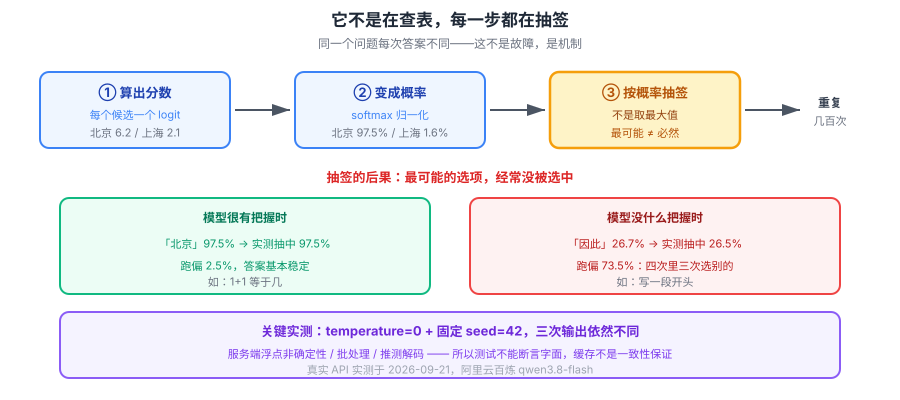

# 课 5：推理与采样——为什么同一问题每次答案不同

> 📖 结论已按公开资料核对（核对于 2026-09-21 ｜ 来源：[HuggingFace 采样科普](https://huggingface.co/blog/how-to-generate)、[Nucleus Sampling 论文](https://arxiv.org/abs/1904.09751)、[OpenAI 复现性说明](https://platform.openai.com/docs/advanced-usage)）
> ✅ 本课含 **2026-09-21 本机真实 API 调用**：阿里云百炼 `qwen3.8-flash`，共 13 次请求；概率分布演示为本地计算（真实数学、构造数值，已标注）

## 🎯 本课目标

掀开"生成"这一下的黑盒：模型的输出不是查表，而是**从概率分布里抽样**。搞清 temperature / top_p 在改什么，以及由此带来的非确定性对工程意味着什么。

### 💡 一句话本质

**这一课解释"为什么答案会变"：模型每一步输出的不是"唯一正确答案"，而是一张概率表，然后从表里抽签——抽签本身就意味着同一个问题会有不同答案。**

### ⚖️ 处境对照

| | 不懂这一课 | 懂了这一课 |
|---|---|---|
| 答案变了 | 以为模型出了 bug，反复重试 | 知道是抽样机制的**正常表现**，改 temperature 才是有意义的动作 |
| 写测试 | 断言回答等于某句话 | 用 **fake model** 或断言结构，不断言字面 |
| 做缓存 | 以为相同输入必得相同输出 | 知道缓存是**省钱手段不是一致性保证** |
| 结果不稳定 | 归咎于模型"不聪明" | 知道要**多次采样取共识**，或降低 temperature |

### 🗺️ 本课地图

| 步 | 这一站 | 你会拿到什么 |
|---|---|---|
| 1 | 第一幕：同一个问题，三个答案 | 真调 API 看到非确定性 |
| 2 | 第二幕：它不是在查表 | 概率分布从哪来，抽签怎么抽 |
| 3 | 第三幕：拆三个机制 | 分布/temperature 与 top_p/工程后果 |
| 4 | 第四幕：跑实验 | 真实 API + 本地分布两套实测 |
| 5 | 第五幕：收束 | 非确定性对工程的三条约束 |

### 🖼️ 一眼全局图



> 看图：模型每一步都吐出一张**候选概率表**，然后从表里**抽**一个。抽签这一步，就是"每次答案不同"的全部原因。后面所有工程手段（固定 seed、假模型、缓存边界）都是在应对这个抽签。

---

## 第一幕：场景引入

先做个实验。同一个问题，连问三次。这是**真实 API 调用**的结果（2026-09-21，阿里云百炼 `qwen3.8-flash`，temperature=0.9）：

```
第1次：采样是指从总体、连续信号或大样本中选取一部分代表性数据，用以近似反映整体特征的过程。
第2次：采样是从总体或连续信号中选取少量代表性个体或时间点，以近似推断整体特征或数据的过程。
第3次：采样是指从总体、连续信号中选取部分样本，用以近似代表整体并进行分析或处理。
```

**三个答案，三句话，三套措辞。** 意思差不多，字面全不同。

这不是 bug，也不是网络抖动。**这就是它的工作方式。**

更让人意外的是——把 temperature 调成 0，并且固定随机种子，它**依然不稳定**。下一幕我们看为什么。

---

## 第二幕：认知冲突

大多数人对模型的直觉是：**输入一个问题，模型"想"出答案，输出。**

这个直觉错在一个地方：**模型每一步"想"出来的，不是一个答案，而是一张候选表。**

想象你问它"中国的首都是"。它内部算出来的东西长这样：

| 候选 | 概率 |
|---|---|
| 北京 | 0.9750 |
| 上海 | 0.0162 |
| 南京 | 0.0080 |
| 东京 | 0.0007 |
| 苹果 | 0.0001 |

然后——**它不直接选"北京"，它按这个概率抽签。**

97.5% 抽中北京，2.5% 抽中别的。看起来差别不大？

关键在于：**这不是只抽一次，而是每个字都抽一次。** 一个 200 字的回答，要抽 200 次。即使每次只有 2.5% 跑偏，累积下来，整段话完全相同的概率**低到可以忽略**。

而更常见的情形是模型**没什么把握**——比如让它写一段开头，第一个词的分布可能是：

| 候选 | 概率 |
|---|---|
| 因此 | 0.2668 |
| 同时 | 0.2500 |
| 另外 | 0.1930 |
| 不过 | 0.1600 |
| 所以 | 0.1320 |

**"最有把握"的"因此"只占 26.7%**——也就是说，**每四次里有三次选的不是它。**

这就是"每次答案不同"的全部根源。我们把它拆开。

---

## 第三幕：层层揭示

### 知识点 1：输出是一个概率分布

#### 一句话定义

**模型每一步的输出是：词表里每个 token 的一个概率**（技术上：logits 经 softmax 变成概率），然后**按这个概率抽样**（sampling）得到实际输出的 token。

#### 直觉建立：三个词，拆开说

| 概念 | 是什么 | 类比 |
|---|---|---|
| **logits** | 模型对每个候选打出的**原始分数**，可正可负 | 评委打分（有高有低，还有负分） |
| **softmax** | 把原始分数**归一化成概率**（全为正、加起来为 1） | 把分数换算成中奖率 |
| **sampling** | 按概率**抽签**决定输出哪个 | 按中奖率抽奖 |

#### 核心原理：logits → softmax

实测（本地计算，逻辑真实）：

```
  token      logit        概率
  北京           6.2    0.9750
  上海           2.1    0.0162
  南京           1.4    0.0080
  东京          -1.0    0.0007
  苹果          -3.5    0.0001
```

**注意 logit 差距被指数放大了**：北京 6.2 比上海 2.1 只高 4.1 分，但概率是 **60 倍**差距（0.975 vs 0.016）。softmax 的指数特性，让"略微更优"变成"压倒性优势"。

#### 示例演示：抽签真的会跑偏

实测抽样 20,000 次（本地）：

```
  场景 A（有把握，T=1.0）：
    「北京」理论 0.9750，实测抽中 0.9753，跑偏 0.0247
  场景 B（没把握，T=1.0）：
    「因此」理论 0.2668，实测抽中 0.2645，跑偏 0.7355
    各 token 实测频率：['因此=0.264', '同时=0.250', '另外=0.193', '不过=0.160', '所以=0.132']
```

**实测频率与理论概率吻合**——这证明它确实在按概率抽签，不是取最大值。

场景 B 里"最有把握"的选项**只有 26% 被选中**。这就是真实情况：**模型经常在好几个选项之间摇摆。**

#### 常见误区

> **误区：模型输出的是"它认为最可能的答案"。**

不是。它输出的是**一次抽签的结果**。最可能的答案只是**被抽中的概率最大**而已。

#### 一句话记住

> **每一步都是先出概率表、再抽签；抽签意味着"最可能"不等于"必然"。**

---

### 知识点 2：temperature 与 top_p

#### 一句话定义

**temperature（温度）**：在 softmax 之前除在 logits 上的一个数，用来**压平或锐化**概率分布；**top_p（核采样）**：只在"概率累加到 p"的候选集合里抽样，砍掉长尾。

#### 直觉建立

**temperature 就是给评委的分数"调对比度"**：

- **T < 1**：拉大差距 → 强者更强（分布**尖锐**）
- **T = 1**：原样
- **T > 1**：压缩差距 → 弱者也有机会（分布**平坦**）

#### 核心原理：实测对照

同一组 logits，只改 T（本地计算）：

```
  token        T=0.5     T=1.0     T=2.0
  北京          0.9997    0.9750    0.7971
  上海          0.0003    0.0162    0.1026
  南京          0.0001    0.0080    0.0723
  东京          0.0000    0.0007    0.0218
  苹果          0.0000    0.0001    0.0062
```

**T 从 1.0 降到 0.5，北京从 97.5% 涨到 99.97%**；T 升到 2.0，北京降到 79.7%。

#### top_p 核采样：另一种思路

temperature 是**改概率**，top_p 是**砍候选**：

| | 怎么做 | 效果 |
|---|---|---|
| **temperature** | 缩放 logits 后重算概率 | 改变分布的**陡峭程度** |
| **top_p** | 按概率从高到低累加，超过 p 就截断 | 砍掉**长尾候选** |

实测（本地）：

```
  场景 A（分布尖锐）：
    top_p=0.9: 保留 ['北京']（1/5 个候选）
    top_p=0.95: 保留 ['北京']（1/5 个候选）
  场景 B（分布平坦）：
    top_p=0.5: 保留 ['因此', '同时']（2/5 个候选）
    top_p=0.9: 保留 ['因此', '同时', '另外', '不过', '所以']（5/5 个候选）
```

**关键洞察：分布越尖，top_p 越不生效；分布越平，top_p 砍得越多。** 两个参数不是重复劳动，是**在不同形状的分布上各管一段**。

> **实践建议**：OpenAI 等厂商的建议是**两个参数别同时调**，优先只动一个，否则难以预测效果。

#### 示例演示：为什么 temperature=0 也不保证复现

数学上，T→0 时分布收敛到"只选最大值"（argmax）：

```
  T=0.5   最高概率 token=北京     p=0.999657
  T=0.1   最高概率 token=北京     p=1.000000
  T=0.01  最高概率 token=北京     p=1.000000
```

**数学上确实收敛了。但真实服务不是纯数学。** 这就是本课最反直觉的一条：

```
=== 2. temperature=0 + 固定 seed=42，能复现吗？ ===
  第1次：采样是指从连续信号或总体数据中按一定规则选取有限个样本点或样本数据，以便进行分析、表示或处理的过程。
  第2次：采样是指从整体或连续信号中选取有限个代表性样本，以便进行分析、估计或重建。
  第3次：采样是指从连续信号、总体或数据集中按一定规则选取有限个样本点或样本，用以近似表示或分析整体。
  → 三次完全一致？False
```

**temperature=0，seed 也固定成 42，三次输出依然不同。**（2026-09-21 实测）

为什么？真实推理服务不是单机跑一个模型：

- **浮点运算非确定性**：GPU 并行归约的顺序不保证固定
- **批处理（batching）**：你的请求和别人的一起算，批次组成影响数值
- **推测解码、量化、路由**：服务端优化会引入额外变异

所以 **`seed` 只是"尽力而为"的复现，不是保证**。

#### 常见误区

> **误区：把 temperature 调成 0 就能稳定复现，"确定性模式"。**

**实测否定了这一点。** T=0 会大幅提高稳定性，但**不保证逐字一致**。任何依赖"输出完全相同"的设计都是危险的。

#### 一句话记住

> **temperature 调分布的陡峭，top_p 砍候选的长尾；但两者都无法保证复现——T=0 + 固定 seed 也不行。**

---

### 知识点 3：非确定性的工程后果

#### 一句话定义

**非确定性（Non-determinism）**：相同输入不保证产生相同输出，这是抽样机制的必然结果，必须在系统设计层面应对。

#### 直觉建立：三条必须接受的现实

```
① 测试不能断言字面 → 用 fake model 或断言结构
② 缓存不是一致性保证 → 只是省钱手段
③ 单次结果不可信 → 重要场景多次采样取共识
```

#### 核心原理：三条工程约束

**① 测试：为什么要用 fake model**

如果你的测试写 `assert response == "北京"`，它会**间歇性失败**——不是代码错了，是抽签。

正确做法：

| 做法 | 适用 | 说明 |
|---|---|---|
| **Fake model** | 单元测试 | 用假模型返回固定响应，测的是**你的逻辑**不是模型 |
| **断言结构** | 集成测试 | 断言"返回了 JSON 且含 name 字段"，不断言具体值 |
| **语义断言** | 评估 | 用另一个模型判"是否答对"，比字面匹配稳健 |

**② 缓存：边界在哪里**

缓存相同输入能省钱，但要想清楚：

- 缓存命中 → 用户拿到**上次那个**抽样结果（不是"正确答案"）
- 缓存未命中 → 用户拿到**新的**抽样结果
- **同一个问题，有缓存和没缓存，答案可能不同**

这在"用户刷新页面看到不同答案"时会造成困惑。要么接受，要么 T=0 + 更长缓存。

**③ 评估：单次结果不可信**

跑一次评测说"模型准确率 85%"，这个数字**有抽样噪声**。严谨做法：

- **多次采样**（同一个问题跑 3-5 次）
- **多数投票**（consistency / self-consistency）
- 报告**置信区间**而非单点值

#### 示例演示：什么时候能稳定

非确定性不是"全有或全无"。实测发现，**熵越低的问题越稳定**：

```
  极简单问题（1+1等于几？只回答数字）3 次输出：['2', '2', '2']
  → 完全一致？True
```

**"1+1"每次都是 2。** 因为这条路径上分布极度尖锐，几乎必然抽中"2"。

> **可操作的判断**：任务越开放（写作、总结、创意），波动越大；任务越收敛（分类、抽取、计算），越稳定。**你的稳定性策略应该按任务类型分级，而不是一刀切。**

#### 常见误区

> **误区：多试几次，挑一个最好的答案就行。**

这叫 "best-of-n"，确实是有效手段，但要清楚代价：**n 倍成本**，而且你**需要一个评判标准**才能"挑最好的"——这个标准本身往往又是一个模型调用。

#### 一句话记住

> **非确定性是机制不是缺陷：测试用假模型、缓存只当省钱、重要结果多次采样。**

---

## 第四幕：实操验证

本课有两个脚本，一个真调 API，一个本地算概率。

**脚本 1：真实 API 非确定性**（约 13 次请求）

```bash
cd langchain/playground
$env:PYTHONIOENCODING='utf-8'
uv run python l5-sampling-lab.py
```

**完整预期输出**（2026-09-21 实测，阿里云百炼 `qwen3.8-flash`）：

```
=== 1. 同一个问题问 3 次（temperature=0.9）===
  第1次：采样是指从总体、连续信号或大样本中选取一部分代表性数据，用以近似反映整体特征的过程。
  第2次：采样是从总体或连续信号中选取少量代表性个体或时间点，以近似推断整体特征或数据的过程。
  第3次：采样是指从总体、连续信号中选取部分样本，用以近似代表整体并进行分析或处理。
  → 三次完全一致？False

=== 2. temperature=0 + 固定 seed=42，能复现吗？ ===
  第1次：采样是指从连续信号或总体数据中按一定规则选取有限个样本点或样本数据，以便进行分析、表示或处理的过程。
  第2次：采样是指从整体或连续信号中选取有限个代表性样本，以便进行分析、估计或重建。
  第3次：采样是指从连续信号、总体或数据集中按一定规则选取有限个样本点或样本，用以近似表示或分析整体。
  → 三次完全一致？False
  ↑ 这就是本课的关键：即使 temperature=0 且固定 seed，也【不保证】复现

=== 4. 为什么不能只靠 seed：换一个提示词再看 ===
  极简单问题 3 次输出：['2', '2', '2']
  → 完全一致？True
  ↑ 越简单、熵越低的问题，越容易稳定；越开放的问题越难复现
```

**脚本 2：本地概率演示**（零 API 调用）

```bash
uv run python l5-softmax-lab.py
```

输出见第三幕各知识点的实测数据块。

> **动手建议**：
> 1. 把问题换成你自己的，观察哪些类型稳定、哪些波动大
> 2. 把 `temperature` 从 0.9 改到 0，看是否变稳定（但别期待完全一致）
> 3. 在 `l5-softmax-lab.py` 里改 `LOGITS_B` 的数值，看分布形状怎么变

> ⚠️ **诚实说明两点**：
> 1. **概率分布的数值是构造的**。百炼端点实测**不支持 `logprobs`**（返回 400 `invalid_parameter_error`），拿不到真实 token 概率。所以分布演示用的是**真实的数学 + 构造的数值**，我已明确标注。**非确定性的现象本身是真调 API 实测的**，不是构造的。
> 2. **脚本第 3 段（用"输出种数"衡量 temperature）是无效实验**——T=0 时也得到 4 种不同输出，说明这个指标测不出 temperature 的效果。我没有拿它下结论，temperature 的真实效果请参看本地概率演示（第 2 段表格）。

---

## 第五幕：体系收束

### 一条链，从头串到尾

```
模型算出每个候选的分数（logits）
  → softmax 归一化成概率（temperature 在这一步之前改陡峭度）
  → top_p 砍掉长尾候选
  → 按概率抽签选一个
  → 这个 token 拼进上文，再算下一个
  → 重复几百次
```

**每一步都在抽签。几百次抽签累积起来，就是"每次答案不同"。**

### 三条工程约束

| 约束 | 原因 | 怎么做 |
|---|---|---|
| **测试不能断言字面** | 抽签导致间歇性失败 | fake model / 断言结构 / 语义断言 |
| **缓存不是一致性保证** | 命中与否会给出不同抽样 | 明确告知用户，或 T=0 兜底 |
| **单次结果不可信** | 抽样噪声 | 多次采样 + 多数投票 |

### 回到第一幕

现在能回答"为什么三次答案不同"了：

```
不是模型在"想"，是模型在"抽"
  → 每一步都有好几个候选，概率不同
  → 抽签意味着最可能的不等于必然的
  → 几百步累积，任何早期偏差都会滚成完全不同的答案
  → 即使 T=0，服务端浮点/批处理/优化也会引入变异
```

### 在全局中的位置

- **课 6** 会回答：模型怎么"看"整段输入（本课的抽样是"怎么往外吐"）
- **课 7** 会把非确定性列为六条缺陷之一（幻觉的双重来源之一）
- **课 8** 起进入"怎么办"，本课的三条约束在那里变成具体手段

### 回扣 LangChain 主干

| 本课知识 | 主干对应课 | 它解释了主干里的什么 |
|---|---|---|
| temperature / top_p 在改什么 | [课 2 模型参数](../../../../langchain/stages/1-入门与模型层/lessons/lesson-02-Models模型层.md) | 那些参数**为什么**存在、改了会怎样 |
| 测试不能断言字面 | [课 13 Testing 与 Observability](../../../../langchain/stages/4-组合与工程化/lessons/lesson-13-Testing与Observability.md) | **fake model 存在的根本原因**——不是偷懒，是机制要求 |
| 单次结果不可信 | [课 13 Testing 与 Observability](../../../../langchain/stages/4-组合与工程化/lessons/lesson-13-Testing与Observability.md) | 为什么评估要跑多次、看分布而非单点 |
| 缓存的边界 | [课 11 Retrieval 与 RAG](../../../../langchain/stages/3-可控性与可靠性/lessons/lesson-11-Retrieval检索与RAG.md) | 语义缓存命中后给的是"上次的抽样"，不是"标准答案" |

### 一句话带走

> **模型每步都在抽签，不是查表——所以"同一问题答案不同"是机制而非故障；temperature 和 top_p 只能改变抽签的赔率，改不掉抽签本身。**

---

## 🧭 本课导航

**⬅️ 上一课**：[课 4：后训练](../../1-模型是怎么炼成的/lessons/lesson-04-后训练.md)

**➡️ 下一课**：[课 6：上下文窗口与注意力](../lessons/lesson-06-注意力与上下文窗口.md)

**↩️ 返回**：[阶段 2 概览](../overview.md) ｜ [课程目录](../../../02-课程目录.md)

**🗺️ 全局位置**：阶段 2「调用时发生了什么」第 1 课 / 共 3 课。故事转折的第一章。

---

## 📚 参考资料

- [How to generate text: decoding methods（HuggingFace）](https://huggingface.co/blog/how-to-generate) — temperature / top_p / top_k 的图解说明
- [The Curious Case of Neural Text Degeneration（Nucleus Sampling）](https://arxiv.org/abs/1904.09751) — Holtzman et al. 2020，top_p 的原始论文
- [OpenAI 文档： Reproducible outputs](https://platform.openai.com/docs/advanced-usage) — seed 参数的官方说明与"尽力而为"的限定
- [Attention Is All You Need](https://arxiv.org/abs/1706.03762) — softmax 在注意力中的应用出处
