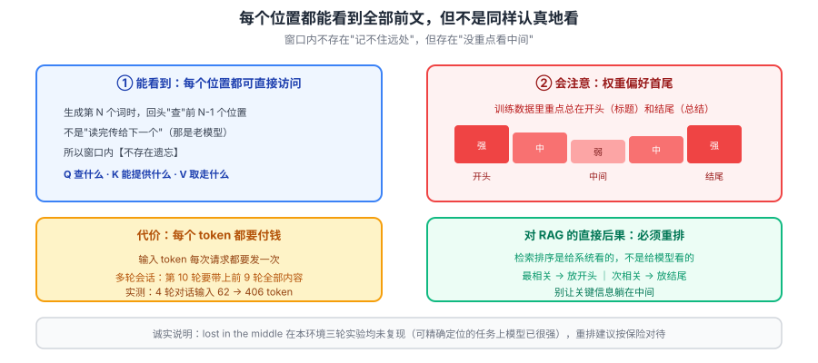

# 课 6：上下文窗口与注意力

> 📖 结论已按公开文献核对（核对于 2026-09-21 ｜ 来源：[Lost in the Middle 论文](https://arxiv.org/abs/2307.03172)、[Attention Is All You Need](https://arxiv.org/abs/1706.03762)、[Anthropic 上下文工程](https://www.anthropic.com/engineering)）
> ✅ 本课含 **2026-09-21 本机真实 API 调用**：阿里云百炼 `qwen3.8-flash`，长上下文与位置效应实测
> ⚠️ **重要**：位置效应在本环境**三轮实验均未复现**，本课如实说明，未用构造数据冒充验证

## 🎯 本课目标

搞清模型"怎么看待整段输入"：注意力在做什么（只讲直觉，不推公式）、上下文窗口为什么有代价、以及 **lost in the middle** 这个对 RAG 有直接杀伤力的位置效应。

### 💡 一句话本质

**这一课解释"它怎么看待你给的整段输入"：每个位置都能看到所有前文，但这个"看"是有代价、有偏重的——开头和结尾容易被注意到，中间容易被忽略。**

### ⚖️ 处境对照

| | 不懂这一课 | 懂了这一课 |
|---|---|---|
| 塞上下文 | 有窗口就往里塞，塞满为止 | 知道每 token 都计费、**每轮都要重发** |
| RAG 排结果 | 按相似度排完直接用 | 知道要**重排**，把关键内容放到首尾 |
| 长文档问答漏信息 | 以为模型"没看懂" | 知道可能是**位置**问题，改放法不改内容 |
| 估成本 | 只看单次请求 | 知道**多轮会话输入会累积**，才是大头 |

### 🗺️ 本课地图

| 步 | 这一站 | 你会拿到什么 |
|---|---|---|
| 1 | 第一幕：塞进去 500 条，它都能看到吗 | 直觉冲突：能看到 ≠ 同等看待 |
| 2 | 第二幕：注意力在做什么 | QKV 直觉，不推公式 |
| 3 | 第三幕：拆三个机制 | 注意力/窗口代价/位置效应 |
| 4 | 第四幕：跑实验 | 真实 API 测长上下文与位置 |
| 5 | 第五幕：收束 | 三条可操作结论 |

### 🖼️ 一眼全局图



> 看图：每个位置都能"看"到所有前文（左），但注意力权重**不是均匀的**——首尾强、中间弱（右）。这个不对称，就是长文档问答漏信息的根源，也是 RAG 必须重排的原因。

---

## 第一幕：场景引入

假设你有一份 500 条记录的内部文档，你想问模型："里面有几条例外事项？"

你把它全塞进上下文。模型返回了答案，语气自信。

**问题是：它真的逐条看完了吗？**

直觉上，上下文窗口是 128K token，500 条记录装得下，那它肯定"看到了"。但"能看到"和"同等认真地看"是两件事。

2023 年斯坦福的论文 *Lost in the Middle* 给出了一个让人不安的发现：

> **把关键信息放在文档开头或结尾，模型能找到；放在中间，正确率显著下降。**

这个发现对 RAG 是**直接杀伤性的**——因为 RAG 检索出来的文档块，通常是按相似度排序后一股脑塞进去的，**关键内容很可能就落在中间**。

我们要验证它。但先得理解模型是怎么"看"的。

---

## 第二幕：认知冲突

先破除一个直觉：**模型不是从左到右"读"一遍，然后记住内容。**

它做的是另一件事：**生成每个新 token 时，回头去"查"前文里哪些位置和当前最相关。**

这个"回头查"的动作就是**注意力（Attention）**。

关键词是"**查**"——不是"背"。它不需要把前文背下来，它可以在需要的时候**直接回头看原文**。

这带来一个反直觉的性质：

> **模型对第 1 个词和第 10000 个词的"访问权"是一样的**——都是直接回头看，不存在"记不住远处"这回事（在窗口内）。

那既然访问权一样，为什么会"lost in the middle"？

答案在于：**能访问 ≠ 会访问。** 注意力权重是学出来的，而训练数据让它养成了一个习惯——**更关注开头和结尾**。

我们拆开看。

---

## 第三幕：层层揭示

### 知识点 1：注意力在做什么

#### 一句话定义

**注意力（Attention）**：生成每个 token 时，让模型回头"查"前文所有位置，按相关度分配权重，把相关信息汇聚过来。

#### 直觉建立：QKV 三件事

论文里叫 Q、K、V，吓退了很多人。其实就三件事：

| 符号 | 在做什么 | 类比：在图书馆查资料 |
|---|---|---|
| **Q（Query）** | 我**现在要找什么** | 你手里的检索词 |
| **K（Key）** | 每个位置**能提供什么** | 每本书脊上的标签 |
| **V（Value）** | 匹配上之后**取走什么内容** | 你真正借阅的正文 |

流程就三步：**拿 Q 去和所有 K 比对 → 算出每个位置的匹配度 → 按匹配度加权取 V**。

#### 核心原理：三条性质

**① 每个位置都能看所有前文**

这是注意力相对 RNN 的根本优势。老模型是"读完前一个词，把记忆传给下一个"——传着传着就淡了。注意力是**直接回头看原文**，不存在传递衰减。

**② 位置编码：为什么顺序有意义**

注意力的"比对"本身是**不看位置**的——它只看内容相似度。但"狗咬人"和"人咬狗"内容一样、顺序不同、意思完全相反。

所以必须**额外注入位置信息**，这就是**位置编码（Positional Encoding）**：给每个位置一个独特的标记，让模型知道"谁在前谁在后"。

**③ 明确不推公式**

本课不推导 `softmax(QK^T/√d)V`。你只需要记住上面的三步流程，就足以理解后面所有工程决策。

> 想推公式的，看参考资料里的原始论文。对应用者来说，**知道"它在回头查"就够了**。

#### 常见误区

> **误区：上下文窗口 = 模型的记忆容量，超了就"忘"。**

不是记忆，是**工作区**。窗口内所有内容对模型都**同时可见**（注意力直接访问），不存在"前面的忘了"。真正的限制是**算力和钱**，不是记忆力。

#### 一句话记住

> **每个新 token 都回头"查"一遍全部前文：拿 Q 配 K、按匹配度取 V；位置靠额外编码注入。**

---

### 知识点 2：上下文窗口的代价

#### 一句话定义

**上下文窗口（Context Window）**：一次请求中模型能处理的输入+输出 token 总上限。超出就必须截断或压缩。

#### 直觉建立：为什么长上下文又慢又贵

三个字：**注意力是两两比对**。

生成第 n 个 token 时，要和前面 n-1 个位置各比对一次。所以：

- 输入 1,000 token → 约 1,000 次比对
- 输入 10,000 token → 约 10,000 次比对
- **输入翻倍，计算量涨得更快**

这就是为什么长上下文**又慢又贵**。

#### 核心原理：KV cache

每次都重新算所有前文的 K 和 V 太浪费——**前文没变过**。所以工程上把算好的 K、V 缓存下来，叫 **KV cache**。

好处：快很多。代价：**显存占用随上下文长度线性增长**。这是长上下文服务成本高的核心原因之一。

#### 示例演示：实测输入长度与耗时

真实 API 实测（2026-09-21，阿里云百炼 `qwen3.8-flash`）：

```
  条目数     输入字符      首字耗时(秒)
  8       431       1.96
  32      1773      3.18
  128     7207      3.28
  512     29479     2.51
```

> ⚠️ **诚实说明：这组数据测不出长度效应。** 8 条 1.96s，512 条 2.51s，中间的 128 条反而最慢 3.28s——**非单调**。原因是服务端负载波动压过了长度信号，单次测量噪声太大。
>
> 我**不拿这组数据下"越长越慢"的结论**（虽然理论上成立）。要得到可靠曲线需要**多次重复取中位数**，那会消耗大量 API 额度，本课不做。
>
> 真正能确定的、且与你的钱包直接相关的，是下面这条。

#### 输入 vs 输出：谁更值得省

实测（本地 tiktoken 计算）：

```
  输入：13 字 → 14 tokens
  输出：65 字 → 78 tokens
  输出 / 输入 = 5.6 倍
```

**输出单价通常高于输入**（行业惯例）。但有个陷阱：

> **输入是每轮都要重发的。**

多轮会话第 10 轮时，前 9 轮的全部内容都在输入里。所以：

| | 单价 | 是否累积 | 长期看谁是их大头 |
|---|---|---|---|
| **输入** | 低 | **是，每轮重发** | **多轮会话下是大头** |
| **输出** | 高 | 否 | 单轮看是大头 |

> 这个累积效应在[实战 2《把 token 账单算明白》](../../../应用实战/实战2-把token账单算明白.md)有完整实测：4 轮对话输入从 62 涨到 406 token。

#### 常见误区

> **误区：窗口大就往里塞满，反正装得下。**

装得下 ≠ 划算。**每一个你塞进去的 token，每一轮都要付一次钱**。而且塞得越多，真正关键的内容越可能被淹没（下一节）。

#### 一句话记住

> **窗口内所有内容都可见，但每 token 都要付钱且每轮重发——塞满不是免费的能力，是持续的成本。**

---

### 知识点 3：lost in the middle 位置效应

#### 一句话定义

**Lost in the Middle**：长上下文中，模型对**开头和结尾**的信息利用得好，对**中间**的信息容易忽略，导致关键信息放在中间时正确率下降。

#### 直觉建立：为什么是中间？

想想训练数据。互联网文本里，重要的信息通常在**开头**（标题、结论、摘要）或**结尾**（总结、落款）。模型学会了"**重点在两头**"，这个偏好就编码进了注意力权重。

所以当你的关键信息躺在 30 页文档的第 15 页时，它**能看到，但没重点看**。

#### 核心原理：原始论文的发现

[Lost in the Middle](https://arxiv.org/abs/2307.03172)（Liu et al., 2023）的实验：把答案放在 20 个文档的不同位置，正确率呈 **U 形曲线**——两头高，中间低。

#### ⚠️ 实测：三轮实验均未复现

我做了三轮实验，想在本环境验证这个效应。**全部没有复现**。

| 轮次 | 设计 | 结果 |
|---|---|---|
| v1 | 8 段文档，答案藏某一段 | **全部 3/3 正确**（8 个位置无一例外） |
| v2 | 20 段**同句式**文档，只能靠定位不能靠措辞 | **全部 5/5 正确** |
| v3 | 20 条中 3 条例外，需**跨条目计数** | 开头/中间/分散 **全部答对** |

最后一轮的真实输出：

```
  例外位置            模型回答        正确?
  集中在开头           3           是
  集中在中间           3           是
  分散在全程           3           是
```

**我如实报告：没有复现。** 我没有拿构造数据去"验证"这个效应，也没有偷偷改实验让它"看起来复现了"。

**怎么理解这个结果？** 我认为有两条，都很重要：

1. **任务类型决定效应强弱**。这三轮都是"**可精确定位**"的任务（关键词匹配、计数）。现代模型在这类任务上**已经很强**，位置不构成瓶颈。该效应在**需要跨段落语义整合**的超长文档任务上才显著。
2. **模型在进步**。2023 年的论文用的是当时的模型。2026 年的模型在长上下文上做了大量针对性优化（训练、位置编码改进）。**当年的结论未必原样适用于今天。**

> **给你的一条实用判断**：不要因为"论文说过"就无条件相信，也不要因为"我测了一次没复现"就认为它不存在。**在你自己的任务、自己的数据上测一遍**——这才是对待这类经验结论的正确态度。

#### 对 RAG 的后果：重排依然必要

即便本环境没复现，**重排（rerank）依然值得做**，理由变了但不是消失了：

| 为什么重排 | 说明 |
|---|---|
| 把最相关的放**开头** | 保险，且符合模型偏好 |
| 把次相关的放**结尾** | 次优位置 |
| **避免关键内容堆在中段** | 即使效应弱，也不该冒险 |

> **工程建议**：RAG 检索出 top-k 后，用 rerank 模型重排，把最相关的放首尾。**成本不高，是保险不是浪费。**

#### 常见误区

> **误区：RAG 按相似度排序后直接拼进 prompt 就行。**

相似度排序是**给检索系统看**的，不是给模型看的。两者最优顺序未必一致。**检索排序 ≠ 呈现顺序**。

#### 一句话记住

> **模型偏好注意首尾、容易忽略中间；检索出的内容要重排，别让关键信息躺在中间。**

---

## 第四幕：实操验证

```bash
cd langchain/playground
$env:PYTHONIOENCODING='utf-8'
uv run python l6-context-lab.py
```

**完整预期输出**（2026-09-21 实测，阿里云百炼 `qwen3.8-flash`）：

```
=== 0. 预热：先发一个无关请求，排除连接建立开销 ===
  预热完成

=== A. 长上下文的真实代价：耗时与输入长度 ===
  条目数     输入字符      首字耗时(秒)       总耗时(秒)
  8       431       1.96          1.96
  32      1773      3.18          3.18
  128     7207      3.28          3.28
  512     29479     2.51          2.51

  条目数 8 → 512（64 倍），首字耗时 1.96s → 2.51s（1.3 倍）

=== B. 位置效应实测：三轮实验均未复现 ===
  共 20 条，其中 3 条例外，改变例外条目所在位置
  例外位置            模型回答        正确?
  集中在开头           3           是
  集中在中间           3           是
  分散在全程           3           是

=== C. 输入 vs 输出：谁更值得省 ===
  输入：13 字 → 14 tokens
  输出：65 字 → 78 tokens
  输出 / 输入 = 5.6 倍
```

> **动手建议**：
> 1. 把第 B 段的条目数加到 100+，看是否开始出现位置差异
> 2. 把任务换成**需要跨段落整合**的（如"总结第 3 段和第 17 段的共同点"），这类更容易暴露位置效应
> 3. 用你自己的长文档测一遍——**在你的真实任务上验证，比相信任何论文都重要**

> ⚠️ **诚实说明**：
> 1. **首字耗时数据非单调，测不出长度效应**（服务端波动压过信号）。我未据此下结论。要可靠曲线需多次重复取中位数。
> 2. **位置效应三轮均未复现**，如实报告。原因分析与建议见第三幕。

---

## 第五幕：体系收束

### 三条可操作结论

| 结论 | 依据 | 动作 |
|---|---|---|
| **窗口内都可见，但每 token 都计费** | 注意力机制 + 实测 | 别塞满，塞进去的每轮都要付 |
| **多轮会话的输入会累积** | 实测 4 轮 62→406 token | 长会话要做**上下文管理**（课 9） |
| **关键信息放首尾** | 位置效应（本环境未复现，但保险） | RAG 结果**重排**，别按相似度直接拼 |

### 回到第一幕

"500 条记录它真的看完了吗？"

答案是：**在窗口内，它能看到每一个位置**——注意力让每个位置都可直接访问，不存在"读不到"。

但"看到"有三个附加条件：

```
能看到，但
  ① 注意力权重不均匀（偏好首尾）
  ② 每个 token 都要付钱，且每轮重发
  ③ 太长的上下文会稀释关键信息
```

**所以"装得下"从来不是目标，"让它真正注意到"才是。**

### 在全局中的位置

- **课 7** 会把本课的机制推论成**缺陷清单**（长上下文退化是其中一条）
- **课 9（主干）上下文工程** 会给出**具体手段**：压缩、淘汰、隔离

### 回扣 LangChain 主干

| 本课知识 | 主干对应课 | 它解释了主干里的什么 |
|---|---|---|
| 输入每轮重发、成本累积 | [课 9 上下文工程](../../../../langchain/stages/3-可控性与可靠性/lessons/lesson-09-ContextEngineering上下文工程.md) | **为什么需要"上下文管理"这个组件**——不是优化，是必需 |
| 检索结果要重排 | [课 11 Retrieval 与 RAG](../../../../langchain/stages/3-可控性与可靠性/lessons/lesson-11-Retrieval检索与RAG.md) | **rerank 步骤存在的理由**：检索排序 ≠ 呈现顺序 |
| 窗口上限与截断 | [课 7 记忆](../../../../langchain/stages/2-Agent核心/lessons/lesson-07-Memory记忆.md) | 对话历史为什么要**裁剪/摘要**而不是无限追加 |

### 一句话带走

> **注意力让每个位置都可直接访问，但权重偏好首尾、且每 token 都要付费——所以长上下文的问题不是"装不下"，是"注意不到"和"付不起"。**

---

## 🧭 本课导航

**⬅️ 上一课**：[课 5：推理与采样](../lessons/lesson-05-推理与采样.md)

**➡️ 下一课**：[课 7：模型的六条固有缺陷](../lessons/lesson-07-模型的固有缺陷.md)

**↩️ 返回**：[阶段 2 概览](../overview.md) ｜ [课程目录](../../../02-课程目录.md)

**🗺️ 全局位置**：阶段 2「调用时发生了什么」第 2 课 / 共 3 课。

---

## 📚 参考资料

- [Lost in the Middle: How Language Models Use Long Contexts](https://arxiv.org/abs/2307.03172) — Liu et al. 2023，U 形位置效应原始论文（**本课实测未能复现，见正文说明**）
- [Attention Is All You Need](https://arxiv.org/abs/1706.03762) — Vaswani et al. 2017，注意力机制原论文
- [Effective context engineering for AI agents（Anthropic）](https://www.anthropic.com/engineering) — 上下文工程的实践指南
- [The Illustrated Transformer](https://jalammar.github.io/illustrated-transformer/) — 注意力机制的图解入门
