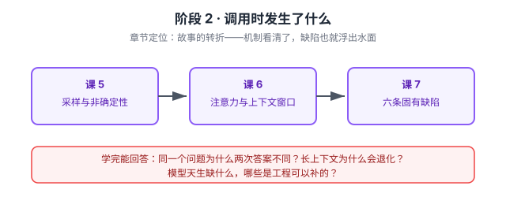

# 阶段 2 · 调用时发生了什么

> 章节定位：故事的转折——**为什么它这样表现**。
> 上一阶段知道了它是怎么造的，这一阶段掀开"你发一句 prompt 进去"的黑盒：采样、注意力、上下文窗口，以及由此浮现的六条固有缺陷。

> 看图：从"它怎么生成一个字"（课 5）到"它怎么看待整段输入"（课 6），两条机制看清后，模型的六条缺陷（课 7）就成了必然结论而不是玄学。

## 🎯 阶段目标

把"模型很玄"变成"模型可预测"：知道采样参数改的是什么、长上下文为什么会退化、以及模型天生缺哪六样东西。这一阶段是后面所有工程手段的**问题清单**。

## 学习重点

- 输出是概率分布——抽样而不是查表
- temperature / top_p ——压平与锐化分布
- 非确定性——为什么 temperature=0 也不能保证复现
- 注意力在做什么——QKV 直觉，不做公式推导
- 上下文窗口的代价——KV cache、输入与输出定价差异
- lost in the middle ——中间信息被忽略
- 六条固有缺陷——幻觉 / 无状态 / 无工具 / 知识截止 / 无 grounding / 不可靠

## 必须掌握的知识点

| 课 | 必须掌握 |
|----|---------|
| 课 5 | 能解释"同一个问题为什么两次答案不同"；知道 temperature 与 top_p 分别在改什么 |
| 课 6 | 能说清长上下文为什么会退化，以及"全塞进去"的真实代价 |
| 课 7 | 能列出六条固有缺陷，并说出每条的后果由谁承担（模型 / 应用 / 人） |

## 对应课

- 课 5：推理与采样——为什么同一问题每次答案不同
- 课 6：上下文窗口与注意力
- 课 7：模型的六条固有缺陷

## 回扣 LangChain

| 本课知识 | 回扣到 |
|---------|--------|
| 采样与 temperature | [课 2 模型参数](../../../langchain/stages/1-入门与模型层/lessons/lesson-02-Models模型层.md)、[课 13 非确定性测试](../../../langchain/stages/4-组合与工程化/lessons/lesson-13-Testing与Observability.md) |
| 上下文窗口 / lost in the middle | [课 9 上下文工程](../../../langchain/stages/3-可控性与可靠性/lessons/lesson-09-ContextEngineering上下文工程.md) |
| 六条固有缺陷 | [课 4 工具](../../../langchain/stages/2-Agent核心/lessons/lesson-04-Tools工具.md)、[课 7 记忆](../../../langchain/stages/2-Agent核心/lessons/lesson-07-Memory记忆.md)、[课 10 护栏](../../../langchain/stages/3-可控性与可靠性/lessons/lesson-10-人机协同与护栏.md) |

## 阶段状态

- [x] 课 5 推理与采样（2026-09-21 完成）
- [x] 课 6 上下文窗口与注意力（2026-09-21 完成）
- [x] 课 7 模型的固有缺陷（2026-09-21 完成，阶段 2 收尾）
