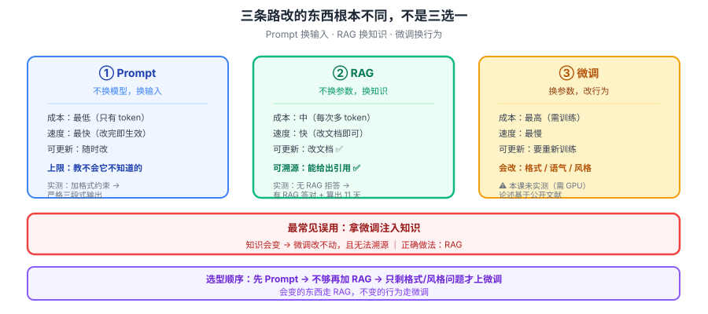

# 课 8：改模型的三条路

> 📖 结论已按公开文献核对（核对于 2026-09-21 ｜ 来源：[RAG 原始论文](https://arxiv.org/abs/2005.11401)、[LoRA](https://arxiv.org/abs/2106.09685)、[Prompt Engineering Guide](https://www.promptingguide.ai/)）
> ✅ 本课含 **2026-09-21 本机真实 API 调用**：阿里云百炼 `qwen3.8-flash`，RAG 与 Prompt 两条路真测
> ⚠️ **诚实声明**：微调**未能真做**（需 GPU 与训练数据，成本过高）。本课对微调的论述基于公开文献，**未实测**，已明确标注

## 🎯 本课目标

拿到课 7 的缺陷清单后，回答"**那怎么办**"：Prompt / RAG / 微调三条路各改什么、各有什么代价，以及最常见的误用——**拿微调注入知识**。

### 💡 一句话本质

**这一课回答"那怎么办"：三条路不是并列的三个选项，而是改的东西根本不同——Prompt 换输入、RAG 换知识、微调换行为。选错了就白花钱。**

### ⚖️ 处境对照

| | 不懂这一课 | 懂了这一课 |
|---|---|---|
| 效果不达标 | 第一反应"是不是该微调" | 先问：**是缺知识还是缺格式** |
| 想注入公司知识 | 收集 QA 对去微调 | 知道这是**最常见的误用**，该用 RAG |
| 评估三条路 | 只看"哪个效果好" | 按**改什么 / 代价 / 可更新性**三维选 |
| 拿到需求 | 直接开干 | 先看**选型信号**，再动手 |

### 🗺️ 本课地图

| 步 | 这一站 | 你会拿到什么 |
|---|---|---|
| 1 | 第一幕：同一个模型，塞进文档就答对了 | RAG 的直观冲击 |
| 2 | 第二幕：三条路改的东西不一样 | 破除"三选一"的误解 |
| 3 | 第三幕：拆三条路 | Prompt / RAG / 微调 / 选型表 |
| 4 | 第四幕：跑实验 | 真测 RAG 与 Prompt |
| 5 | 第五幕：收束 | 选型决策表 + 常见误用 |

### 🖼️ 一眼全局图



> 看图：三条路**改的东西不同**——Prompt 改输入（左）、RAG 改知识（中）、微调改行为（右）。关键在中间那句：**微调改的是"怎么说话"，不是"知道什么"**。拿微调注入知识，是这条路上最贵的错误。

---

## 第一幕：场景引入

先看一次**真实 API 调用**的对比（2026-09-21，阿里云百炼 `qwen3.8-flash`）。

**同一个模型，同一个问题。第一次什么都不给：**

```
问题：云枢科技的生产环境发布窗口是什么时间？

回答：抱歉，我没有"云枢科技"生产环境发布窗口的具体信息。
      这属于该公司内部的运维流程/发布规范，我无法访问其内部文档……
```

**第二次，只是在上下文里多塞了一份内部文档：**

```
回答：根据《云枢科技内部研发规范 v3.2》第 13 条，
      生产环境发布窗口为每周二、周四 14:00-16:00，
      且节假日前后三天禁止发布。
```

**模型一个字都没变。** 变的只是你给它的输入。

这就是 RAG 的全部魔力——**不换模型，只换上下文**。

更狠的是下一题。文档里写的是"年假 = 司龄 + 5，上限 15 天"，问"司龄 6 年的员工有几天年假"：

```
根据《云枢科技内部研发规范 v3.2》第 15 条：
年假天数 = 司龄年数 + 5，上限 15 天
计算过程：
1. 该员工司龄为 6 年。
2. 年假天数 = 6 + 5 = 11 天。
3. 11 天未超过上限 15 天，因此有效。
```

**它不仅答对了，还给出了引用（第 15 条）和计算过程。** 这两样东西，是纯 Prompt 和微调都给不了你的。

---

## 第二幕：认知冲突

一个普遍的误解：**Prompt、RAG、微调是三个并列的选项，挑一个效果最好的。**

这个理解错得比较深。它们**改的东西根本不是同一个**：

| 路线 | 改的是什么 | 类比 |
|---|---|---|
| **Prompt** | 改**这次的输入** | 给同一个人换一份说明书 |
| **RAG** | 改**它能查到的资料** | 给同一个人开一个书架 |
| **微调** | 改**这个人本身** | 送他去培训 |

所以真正的问题不是"哪个效果最好"，而是：

> **你的问题是"他不知道"还是"他不会表达"？**
>
> - 不知道 → **RAG**（给他资料）
> - 不会表达 → **微调**（培训他）
> - 只是这次任务没说清 → **Prompt**（改说明书）

**用微调去解决"不知道"，就是送一个不知道答案的人去培训，然后指望他培训完就知道了。** 这就是本课要拆的最常见误用。

---

## 第三幕：层层揭示

### 知识点 1：Prompt——不换模型，换输入

#### 一句话定义

**Prompt Engineering**：通过设计输入文本（指令、示例、格式约束、角色设定）来引导模型输出，**不改模型任何参数**。

#### 直觉建立：最便宜的一档

| 维度 | 表现 |
|---|---|
| 成本 | **最低**（只有 token 费） |
| 速度 | **最快**（改完立刻生效） |
| 可更新 | **随时改** |
| 能力上限 | **受模型约束**（教不会它不知道的东西） |

#### 核心原理：它在改什么

Prompt 改的是**条件**：模型在"给定这段上文"的条件下，续写的分布会变。

注意——它**没有改变模型的能力**，只是让已有的能力更容易被触发。

#### 示例演示：实测三种 prompt

真实 API 实测，同一个问题"解释一下什么是向量数据库"：

| Prompt 写法 | 输出形态 |
|---|---|
| **裸问题** | 长篇详解，带标题分节（`# 向量数据库详解`） |
| **加角色** | 面向初学者的口吻（"我们用初学者也能理解的方式来解释"） |
| **加格式约束** | 严格三段式（一句话定义 / 一个类比 / 一个局限） |

加格式约束的那次，真实输出：

```
一句话定义：向量数据库是一种以向量嵌入表示数据，并通过相似度检索非结构化内容的数据库。
一个类比：它像按气味和情绪索引的图书馆，不靠书名精确查找，而是找"最接近"的书。
一个局限：它通常不擅长精确匹配和复杂关系查询，结果质量高度依赖嵌入模型和相似度阈值。
```

**完全遵守了格式。** 这对下游程序解析至关重要——**格式稳定 = 可解析 = 可自动化**。

#### 什么时候够用

✅ **够用**：格式控制、语气调整、任务分解、few-shot 示例、角色设定
❌ **不够用**：模型不知道的事实、需要实时数据、私域知识

#### 常见误区

> **误区：prompt 写得越详细越好，堆满指令。**

指令过多会**互相稀释**（课 6 的上下文稀释问题）。有效做法是**关键约束放首尾**，而非平均铺开。

#### 一句话记住

> **Prompt 改的是这次的输入：最低成本、最快见效，但教不会它不知道的东西。**

---

### 知识点 2：RAG——不换参数，换知识

#### 一句话定义

**RAG（Retrieval-Augmented Generation，检索增强生成）**：在生成前先从外部知识库**检索**相关片段，塞进上下文，让模型基于这些片段作答。

#### 直觉建立：开卷考试

| | 闭卷（纯模型） | 开卷（RAG） |
|---|---|---|
| 知识来源 | 参数里的压缩记忆 | **外部可更新的文档** |
| 能否溯源 | **不能** | **能**（可给出引用） |
| 知识更新 | 重新训练 | **改文档即可** |

#### 核心原理：三步

```
① 检索：把问题变成向量，去知识库找相似片段
② 组装：把检索到的片段 + 问题拼成 prompt
③ 生成：模型基于给定片段作答（通常加约束"仅根据文档"）
```

#### 示例演示：实测私域知识注入

2026-09-21 实测，一本模型**绝不可能见过**的虚构内部规范：

| | 无 RAG | 有 RAG |
|---|---|---|
| 发布窗口 | 拒答："我没有具体信息" | **答对**：周二、周四 14:00-16:00 |
| 年假计算 | — | **算出 11 天**并附引用 |
| 可溯源 | 否 | **是**（"根据第 13 条"） |

**成本实测**（本地 tiktoken 计算）：

```
  A 无 RAG（只有问题）      22 tokens
  B 有 RAG（文档+问题）    266 tokens
  → 多了 244 tokens
```

> **注意这个代价是每次请求都要付的**（课 6 已强调）。RAG 不是免费的，它是**用 token 换正确率**。

#### 为什么它是私域知识的正解

课 7 的缺陷 4（知识截止）和缺陷 5（无 grounding）**只有这条路能同时解决**：

- 知识可更新 → 解决截止
- 答案带引用 → 解决无 grounding

#### 常见误区

> **误区：RAG 就是"把文档塞进上下文"，所以上下文越大越好，全塞进去。**

三个反驳（课 6 已实测论证）：
1. **每 token 每轮都要付钱**
2. **塞得越多，关键内容越被稀释**
3. 检索的意义正是**只塞相关的**——全塞等于没检索

#### 一句话记住

> **RAG 是开卷考试：知识可更新、答案可溯源，是私域知识与知识截止的唯一解——代价是每次请求多付 token。**

---

### 知识点 3：微调——换参数，改风格不改知识

#### 一句话定义

**微调（Fine-tuning）**：用特定数据继续训练模型，**修改参数**，从而改变它的输出风格、格式稳定性或任务倾向。

#### ⚠️ 诚实声明

**本课未能真做微调。** 微调需要 GPU、训练数据与较长时间，成本远超本教程范围。以下论述**基于公开文献，未经本机实测**。

对比一下：课 3、课 4 我在本机**真训**了字符级 n-gram；课 5-8 真调了 API。**只有微调这一条路我没有实测数据**。这是本教程的一处已知边界。

#### 直觉建立：培训，不是灌资料

微调改的是"**这个人怎么做事**"：

| 微调擅长 | 例子 |
|---|---|
| **格式稳定** | 始终输出合法 JSON |
| **语气风格** | 模仿客服/医生/法务的口吻 |
| **任务倾向** | 分类、抽取、格式化 |
| **缩短 prompt** | 把长指令"烧"进参数 |

#### 核心原理：为什么不能注入知识

这是本课**最重要的一条**。三个理由：

**① 知识的存储方式不对**
课 3 讲过：知识是**压缩存储**在参数里的。压缩意味着有损——微调塞进去的知识，取出来时往往已经变形。

**② 学"事实"和学"模式"的机制不同**
研究表明，微调对**格式、风格**这类"模式"学得很好，对**孤立事实**学得很差，且容易**灾难性遗忘**（学了新知识，忘了旧能力）。

**③ 你无法更新**
知识会变。RAG 改文档即可；微调要**重新训练**。

> **一句话判据**：
> **会变的东西 → RAG；不变的行为 → 微调。**

#### 常见误用对照

| 需求 | ❌ 常见误用 | ✅ 正确做法 |
|---|---|---|
| 让模型知道公司制度 | 拿制度做 QA 对去微调 | **RAG**（制度会改） |
| 让模型知道最新价格 | 微调 | **RAG + 工具**（价格天天变） |
| 输出必须能 JSON 解析 | 在 prompt 里反复强调 | **微调**（格式是不变的行为）✅ |
| 语气要像客服 | 长 prompt 描述语气 | **微调** 或 **短 prompt** |

#### 一句话记住

> **微调改的是"怎么说话"不是"知道什么"；拿它注入知识是最贵的错误。**

---

### 知识点 4：三条路选型决策表

#### 核心交付：看到信号就知道选哪条

| 你的问题 | 信号 | 选 | 理由 |
|---|---|---|---|
| 模型不知道某件事 | 它**拒答或编造** | **RAG** | 缺的是知识 |
| 答案格式不稳定 | 内容对但**格式飘** | **Prompt** 先试，**微调**兜底 | 缺的是约束 |
| 想改语气风格 | 内容对但**不像** | **Prompt** 先试 | 最便宜 |
| 想缩短长 prompt | prompt 太长太贵 | **微调** | 把指令烧进参数 |
| 需要实时数据 | 涉及"现在" | **工具**（不是这三条路） | 课 7 缺陷 3 |
| 私域 + 要溯源 | 企业知识库 | **RAG** | 唯一能给引用的 |

#### 决策顺序：从便宜的开始

```
① Prompt —— 先试，成本最低
   ↓ 不够
② RAG —— 缺知识就加检索
   ↓ 还不够
③ 微调 —— 只是格式/风格问题才上
```

> **不要跳过前两步直接微调。** 微调是三条路里最贵、最慢、最难回滚的。

#### 三条路可以叠加

它们不互斥，最常见的高性价比组合：

> **RAG（给知识）+ 微调（稳格式）**

前者解决"知道什么"，后者解决"怎么说"。各司其职。

#### 示例演示：一次典型的错误选型

**需求**：做一个公司内部制度问答机器人。

**错误路线**：收集 500 条制度 QA → 微调。

**会出什么问题**：
1. 制度改了 → 要重新训练（**改不动**）
2. 模型答错 → 无法溯源是哪条制度（**不可信**）
3. 训练成本高，效果还不如直接塞文档

**正确路线**：制度文档切片 → 向量库 → RAG。

**得到什么**：
1. 制度改了 → 更新文档即可
2. 答案带引用（"根据第 13 条"）——**实测已验证**
3. 成本是每次多几百 token，不是一次训练

#### 一句话记住

> **先 Prompt，再 RAG，最后微调；会变的走 RAG，不变的走微调——这是选型的全部。**

---

## 第四幕：实操验证

```bash
cd langchain/playground
$env:PYTHONIOENCODING='utf-8'
uv run python l8-three-ways-lab.py
```

**完整预期输出**（2026-09-21 实测，阿里云百炼 `qwen3.8-flash`）：

```
=== A. 无 RAG：直接问私域知识 ===
  问题：云枢科技的生产环境发布窗口是什么时间？
  回答：抱歉，我没有"云枢科技"生产环境发布窗口的具体信息。
        这属于该公司内部的运维流程/发布规范，我无法访问其内部文档……

=== B. 有 RAG：把文档放进上下文再问 ===
  回答：根据《云枢科技内部研发规范 v3.2》第 13 条，
        生产环境发布窗口为每周二、周四 14:00-16:00，
        且节假日前后三天禁止发布。

=== C. RAG 还能做计算型私域问题 ===
  问题：一名司龄 6 年的员工，年假有多少天？
  回答：年假天数 = 司龄年数 + 5，上限 15 天
        计算过程：1. 司龄 6 年 2. 6 + 5 = 11 天 3. 未超上限 15 天

=== D. Prompt 路：三种 prompt 的输出格式差异 ===
  裸问题    → 长篇详解，带标题分节
  加角色    → 初学者口吻
  加格式约束 → 严格三段式（一句话定义/一个类比/一个局限）

=== E. 三条路成本对比 ===
  A 无 RAG（只有问题）      22 tokens
  B 有 RAG（文档+问题）    266 tokens
  → RAG 让本次输入多了 244 tokens，但换来了正确率
```

> **动手建议**：
> 1. 把 `PRIVATE_DOC` 换成**你自己的**文档（README、会议纪要），测 RAG 效果
> 2. 在 B 段去掉"仅根据以下文档"这句约束，观察模型是否**开始掺入外部知识**
> 3. 把 D 段的格式约束换成你业务需要的（如 JSON schema），看它能否稳定遵守

> ⚠️ **诚实说明**：
> 1. **微调未实测**。本课微调部分基于公开文献，未在本机训练。这是本课与课 3、课 4（本机真训）的关键差异。
> 2. **B 段的成功依赖"文档里确实有答案"**。RAG 的真实难点在**检索质量**（检索错了，塞再多也没用）——那是[主干课 11 Retrieval 与 RAG](../../../../langchain/stages/3-可控性与可靠性/lessons/lesson-11-Retrieval检索与RAG.md)的内容，本教程不展开实现。

---

## 第五幕：体系收束

### 三条路 → 改的东西

| 路线 | 改什么 | 成本 | 可更新 | 解决课 7 的哪条缺陷 |
|---|---|---|---|---|
| **Prompt** | 输入 | 最低 | 随时 | 部分缓解幻觉 |
| **RAG** | 知识 | 中（每次 token） | 改文档 | **缺陷 1 幻觉、4 截止、5 无 grounding** |
| **微调** | 行为 | 最高 | 重训 | 部分缓解缺陷 6 不可靠 |

### 本课最重要的判断

> **会变的东西走 RAG，不变的行为走微调。**
>
> 拿微调注入知识，是这条路上最贵的错误——**不是因为它没效果，而是因为它有更好的替代方案**。

### 还有一条路本课没展开：工具

课 7 的缺陷 3（无工具）**不属于这三条路中的任何一条**。

| 需求 | 走哪条 |
|---|---|
| 算数、查库、调 API、查实时数据 | **工具（Function Calling）** |

这不是"改模型"，是"给模型接手脚"。详见[主干课 4 Tools 工具](../../../../langchain/stages/2-Agent核心/lessons/lesson-04-Tools工具.md)。

### 在全局中的位置

- **课 9** 会把本课的三条路与课 7 的缺陷清单，一起焊成**映射总表**（本教程的交付终点）
- 本课是"怎么办"的第一章，课 9 是终章

### 回扣 LangChain 主干

| 本课知识 | 主干对应课 | 它解释了主干里的什么 |
|---|---|---|
| RAG 三步流程 | [课 11 Retrieval 与 RAG](../../../../langchain/stages/3-可控性与可靠性/lessons/lesson-11-Retrieval检索与RAG.md) | **为什么需要 Retriever 这个抽象**——本课是原理，主干是实现 |
| 工具不属于三条路 | [课 4 Tools 工具](../../../../langchain/stages/2-Agent核心/lessons/lesson-04-Tools工具.md) | 为什么工具是**独立的一类组件** |
| Prompt 改输入 | [课 3 Messages 消息体系](../../../../langchain/stages/1-入门与模型层/lessons/lesson-03-Messages消息体系.md) | 消息类型设计的动机 |

### 一句话带走

> **三条路改的东西不同：Prompt 换输入、RAG 换知识、微调换行为——先 Prompt、再 RAG、最后微调；会变的走 RAG，不变的走微调。**

---

## 🧭 本课导航

**⬅️ 上一课**：[课 7：模型的六条缺陷](../../2-调用时发生了什么/lessons/lesson-07-模型的固有缺陷.md)

**➡️ 下一课**：[课 9：收束——从模型缺陷到 LangChain 组件](../lessons/lesson-09-收束.md)

**↩️ 返回**：[阶段 3 概览](../overview.md) ｜ [课程目录](../../../02-课程目录.md)

**🗺️ 全局位置**：阶段 3「怎么改与全局收束」第 1 课 / 共 2 课。故事收束的第一章。

---

## 📚 参考资料

- [Retrieval-Augmented Generation for Knowledge-Intensive NLP](https://arxiv.org/abs/2005.11401) — RAG 原始论文
- [LoRA: Low-Rank Adaptation of Large Language Models](https://arxiv.org/abs/2106.09685) — 低成本微调的代表方法
- [Prompt Engineering Guide](https://www.promptingguide.ai/) — Prompt 技巧的系统整理
- [RAG vs Fine-tuning（微软技术博客）](https://techcommunity.microsoft.com/) — 工程选型的对比视角
