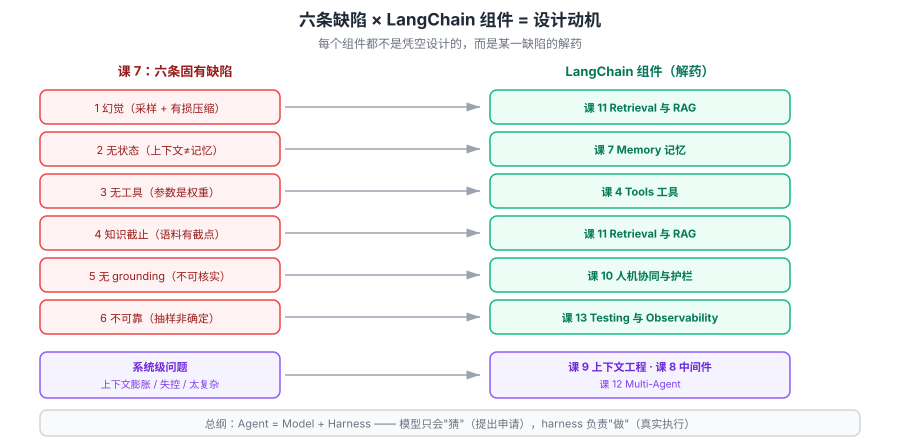

# 课 9：收束——从模型缺陷到 LangChain 组件

> 📖 结论已按主干课原文核对（核对于 2026-09-21 ｜ 来源：[主干课 1 LangChain 是什么](../../../../langchain/stages/1-入门与模型层/lessons/lesson-01-LangChain是什么.md)、[LangChain overview](https://docs.langchain.com/oss/python/langchain/overview)）
> ✅ 本教程**全部 9 课已完成**；课 3-4 本机真训、课 5-8 真调 API，实测数据贯穿始终

## 🎯 本课目标

把课 7 的缺陷清单与 LangChain 组件焊成一张**映射总表**——看到任一组件，能说出它在补哪个缺陷。这是本教程的**交付终点**。

### 💡 一句话本质

**这一课是交付终点：LangChain 的每个组件都不再是 API，而是针对课 7 某条具体缺陷的解药——看懂了缺陷，组件就是必然的；看不懂缺陷，组件就只是要背的名词。**

### ⚖️ 处境对照

| | 不懂这一课 | 懂了这一课 |
|---|---|---|
| 看 LangChain 文档 | 一堆 API 要记 | 每个组件都**对应一个已知问题** |
| 新技术出现 | 又要从头学 | 先问"**它在补哪条缺陷**"，立刻定位 |
| 设计系统 | 照抄示例拼组件 | 按**缺陷清单**逐条设防，缺什么补什么 |
| 判断方案 | 看流行度 | 看它**补的是不是你的真问题** |

### 🗺️ 本课地图

| 步 | 这一站 | 你会拿到什么 |
|---|---|---|
| 1 | 第一幕：回到开头那个只会猜词的机器 | 首尾呼应 |
| 2 | 第二幕：组件不是 API，是解药 | 换个看法 |
| 3 | 第三幕：拆三块 | 映射总表 / 重读课 1 / 边界与去向 |
| 4 | 第四幕：核对一遍 | 每条映射回原文验证 |
| 5 | 第五幕：收束 | 全教程一句话带走 |

### 🖼️ 一眼全局图



> 看图：左边是**课 7 的六条缺陷**，右边是**主干的组件**，中间箭头是"谁补谁"。六条缺陷**每一条都有对应的组件**——这就是本教程要交付的全部内容。

---

## 第一幕：场景引入

回到课 1 的开头。

那时候它只是一个**只会猜下一个词的机器**（课 2）。预训练让它记住了海量文本（课 3），后训练让它学会了好好说话（课 4）。

然后你调用它，发现：

- 同一个问题，**每次答案都不一样**（课 5）
- 塞进去的长文档，**中间的内容它没重点看**（课 6）
- 它**会编**、**不记事**、**不会算数**、**不知道今天几号**、**答得毫无根据**（课 7）

六条缺陷，一条不少。

**现在回头看，这些"问题"其实是一份需求说明书。**

每一条缺陷，都精确对应着 LangChain 里的一个组件。把课 7 那张表和 LangChain 的组件列表并排放在一起——**你会发现它们严丝合缝**。

这不是巧合。**LangChain 就是照着这份缺陷清单长出来的。**

---

## 第二幕：认知冲突

学 LangChain 最常见的困境：**组件太多，记不住。**

Models、Messages、Tools、Agents、Streaming、Memory、Middleware、Context Engineering、Guardrails、Retrieval、Multi-Agent、Testing……

十几个名词，每个都有 API，每个都有参数。**背了忘，忘了背。**

问题出在学习方式：**把它们当 API 记。**

换一个看法——**它们不是 API，是解药**。

> **你不记"Middleware 的参数有哪些"，你记"它是在补'模型会失控'这条缺陷"。**
>
> 参数会变、API 会改，但**"模型会失控，所以需要有人管"这件事不会变**。

一旦建立了这个视角：

- 遇到新组件 → 先问"**它在补哪个缺陷**" → 立刻知道它该放在系统的什么位置
- 遇到新框架 → 先问"**它补的是不是同一个缺陷**" → 立刻知道它和 LangChain 是什么关系
- 设计系统 → 拿**课 7 的缺陷清单**逐条过 → 缺哪条补哪条，不会漏

---

## 第三幕：层层揭示

### 知识点 1：缺陷 ↔ 组件映射总表

#### 核心交付：这是本教程的终点

先回顾课 7 的六条缺陷：

| # | 缺陷 | 根因（机制） |
|---|---|---|
| 1 | **幻觉** | 采样 + 有损压缩 |
| 2 | **无状态** | 上下文是工作区不是记忆 |
| 3 | **无工具** | 参数是权重，不是计算器 |
| 4 | **知识截止** | 语料有时间截点 |
| 5 | **无 grounding** | 输出不锚定可验证来源 |
| 6 | **不可靠** | 抽样导致非确定性 |

现在，逐一对应到主干组件：

| 缺陷 | 主干组件 | 补了什么 | **剩下什么没补** |
|---|---|---|---|
| **1 幻觉** | [课 11 Retrieval 与 RAG](../../../../langchain/stages/3-可控性与可靠性/lessons/lesson-11-Retrieval检索与RAG.md) | 给事实来源，让"编"不必要 | **检索错了照样编**；仍可能曲解原文 |
| **2 无状态** | [课 7 Memory 记忆](../../../../langchain/stages/2-Agent核心/lessons/lesson-07-Memory记忆.md) | 历史由应用拼进请求 | **窗口有限**，长会话要裁剪/摘要 |
| **3 无工具** | [课 4 Tools 工具](../../../../langchain/stages/2-Agent核心/lessons/lesson-04-Tools工具.md) | 算数/查库/联网交给真工具 | **模型可能调错工具或给错参数** |
| **4 知识截止** | [课 11 Retrieval 与 RAG](../../../../langchain/stages/3-可控性与可靠性/lessons/lesson-11-Retrieval检索与RAG.md) | 用时检索，知识可更新 | 依赖**检索质量** |
| **5 无 grounding** | [课 10 人机协同与护栏](../../../../langchain/stages/3-可控性与可靠性/lessons/lesson-10-人机协同与护栏.md) | 人工审核 + 引用溯源 | **人依然是最后一道关** |
| **6 不可靠** | [课 13 Testing 与 Observability](../../../../langchain/stages/4-组合与工程化/lessons/lesson-13-Testing与Observability.md) | 结构化断言 + 多次采样 | **不能变可靠**，只能"测出来" |

#### 还有三个组件在补"系统级"问题

上面六条是**模型**的缺陷。但把模型接进系统后，还会产生**系统级**问题：

| 系统级问题 | 主干组件 | 补了什么 |
|---|---|---|
| 长会话成本爆炸、上下文膨胀 | [课 9 上下文工程](../../../../langchain/stages/3-可控性与可靠性/lessons/lesson-09-ContextEngineering上下文工程.md) | 压缩、淘汰、隔离（课 6 已论证其必需性） |
| 模型会"跑偏"、需要流程管控 | [课 8 Middleware 中间件](../../../../langchain/stages/3-可控性与可靠性/lessons/lesson-08-Middleware中间件.md) | 重试、审批、日志 |
| 单智能体不够用 | [课 12 Multi-Agent](../../../../langchain/stages/4-组合与工程化/lessons/lesson-12-Multi-Agent多智能体.md) | 拆分复杂任务 |

#### 基础三课不是解药，是"接口"

| 组件 | 作用 |
|---|---|
| [课 2 Models 模型层](../../../../langchain/stages/1-入门与模型层/lessons/lesson-02-Models模型层.md) | 统一接模型的接口（本课解释了那些**参数存在的理由**） |
| [课 3 Messages 消息体系](../../../../langchain/stages/1-入门与模型层/lessons/lesson-03-Messages消息体系.md) | 统一对话的表示 |
| [课 5 Agents 智能体核心](../../../../langchain/stages/2-Agent核心/lessons/lesson-05-Agents智能体核心.md) | 把组件组装成循环 |
| [课 6 Streaming 流式输出](../../../../langchain/stages/2-Agent核心/lessons/lesson-06-Streaming流式输出.md) | 体验层（课 6 实测的首字延迟） |

#### 常见误区

> **误区：组件越多系统越好，全用上。**

每个组件都有**成本**（延迟、token、复杂度）。正确做法是**按缺陷清单逐条过，缺什么补什么**——不需要 RAG 的场景硬上 RAG，只会更慢更贵。

#### 一句话记住

> **六条缺陷 × 主干组件一一对应；每个组件都是某条缺陷的解药，没有一个是凭空设计的。**

---

### 知识点 2：回到开头——重读 Agent = Model + Harness

#### 一句话定义

**Agent = Model + Harness**：模型负责"想"，harness（模型循环之外的一切）负责让它"做成事"——**这个公式就是本课映射表的总纲**。

#### 直觉建立：工位配置的比喻

主干课 1 的原文（L152）：

> harness 就是你给他的**工位配置**：一本员工手册（提示词）、一套工具与账号权限（工具）、主管的例行检查机制（中间件）。同一个"员工"，工位配置不同，产出天差地别。

用本教程的视角重新翻译这段话：

| 比喻 | 对应 | 在补哪条缺陷 |
|---|---|---|
| **员工本人** | Model | —（他就是课 1-4 讲的那个猜词机器） |
| **员工手册** | 提示词 | 部分缓解幻觉 |
| **工具与账号权限** | Tools | **缺陷 3 无工具** |
| **主管的例行检查** | Middleware | 系统级管控 |
| **资料柜** | Retrieval / RAG | **缺陷 1、4、5** |
| **他的工作笔记** | Memory | **缺陷 2 无状态** |
| **质检** | Testing | **缺陷 6 不可靠** |

**"模型是大脑、工具是手脚"这个比喻为什么准确？**

因为课 7 实测已经证明了它：

- **大脑**（模型）：会想、会生成、会猜——但**会编**（缺陷 1）
- **没有手脚**：实测 `8934567 × 2345678` 算错约 4300 万（缺陷 3）
- **没有记忆**：实测第二轮完全不记得"我叫陈默"（缺陷 2）

> **大脑再好，没有手脚和笔记本，也干不成事。** 这就是 harness 存在的全部理由。

#### 核心原理：模型只"提出申请"

主干课 1 的原文（L172）：

> 模型没有任何执行能力。它"调用工具"的本质，是生成一段结构化的请求文字；真正去执行、把结果送回来的，是 harness。

**这条和课 2 的"猜下一个词"首尾呼应**：

```
课 2：它只是在猜下一个词
  ↓
课 9：所以它的"调用工具"也只是猜出一段"我想调这个工具"的文字
  ↓
真正执行的是 harness
```

> **这是全教程最重要的一处闭环**：课 2 埋下的"它只会猜词"，在课 9 得到了完整的工程解释——**正因为它只会猜词，所以执行必须放在它外面**。

#### 示例演示：用本课视角重读一段消息流

主干课 1 实测的消息流（L202）：

```
第 1 行：你说的话           → HumanMessage
第 2 行：空内容 + tool_calls → 模型只"提出申请"，一个字都没说
第 3 行：工具的真实结果      → ToolMessage（执行在 harness）
第 4 行：模型综合后的回答    → AIMessage
```

**第 2 行是空内容**——这条实测证据，把"模型只猜词"和"执行在 harness"两件事**焊死在了一起**。

#### 一句话记住

> **Agent = Model + Harness：模型只会"猜"（提出申请），harness 负责"做"（真实执行）——课 2 的伏笔在此闭环。**

---

### 知识点 3：本教程的边界与去向

#### 一句话定义

**本教程教你"理解模型"与"看懂组件动机"，不教你"训练模型"或"写生产代码"**——边界必须说清楚，否则你会带着错误的期待往下走。

#### 本教程做了什么

| 阶段 | 交付 | 实测情况 |
|---|---|---|
| 阶段 1（课 1-4） | 它是怎么造的 | **课 3、课 4 本机真训**字符级 n-gram（语料 10,178 字） |
| 阶段 2（课 5-7） | 调用时发生了什么 + 六条缺陷 | **课 5-7 真调 API**（百炼 `qwen3.8-flash`） |
| 阶段 3（课 8-9） | 三条改造路线 + 组件映射 | **课 8 真测 RAG/Prompt**；微调未实测 |

#### 本教程**没**做什么（边界声明）

| 没做 | 原因 | 去哪学 |
|---|---|---|
| **真微调** | 需 GPU 与训练数据，成本过高 | 见下文资源 |
| **手写 Transformer** | 本教程定位是"理解"不是"实现" | [The Illustrated Transformer](https://jalammar.github.io/illustrated-transformer/) |
| **RAG 工程实现** | 切片/向量库/检索调优是独立专题 | [主干课 11 Retrieval 与 RAG](../../../../langchain/stages/3-可控性与可靠性/lessons/lesson-11-Retrieval检索与RAG.md) |
| **生产部署** | 涉及运维、成本、合规 | [主干课 13 Testing 与 Observability](../../../../langchain/stages/4-组合与工程化/lessons/lesson-13-Testing与Observability.md) |

#### 想继续深入的方向

| 方向 | 对应 |
|---|---|
| **把 LangChain 真用起来** | [主干全课程目录](../../../../langchain/02-课程目录.md)（13 课） |
| **理解 Transformer 细节** | [The Illustrated Transformer](https://jalammar.github.io/illustrated-transformer/) |
| **训练自己的模型** | [LoRA 论文](https://arxiv.org/abs/2106.09685) |
| **RAG 工程实践** | [RAG 原始论文](https://arxiv.org/abs/2005.11401) + 主干课 11 |
| **幻觉研究前沿** | [幻觉综述](https://arxiv.org/abs/2311.05232) |

#### 示例演示：一张自测表

学完本教程，你应该能不看资料回答：

| 问题 | 答案在哪课 |
|---|---|
| 为什么同一问题每次答案不同？ | 课 5（抽样） |
| 为什么 T=0 也不保证复现？ | 课 5（**实测**：服务端浮点/批处理） |
| 为什么长文档中间的内容容易漏？ | 课 6（注意力权重偏好首尾） |
| 为什么模型会算错大数乘法？ | 课 7（**实测**算错约 4300 万） |
| 为什么不能用微调注入公司知识？ | 课 8（会变的知识 → RAG） |
| Memory 组件为什么必须存在？ | 课 9（缺陷 2 无状态） |

**答不上任何一条，回去重看那一课。**

#### 一句话记住

> **本教程交付的是"看懂机制"的能力；有了它，任何新组件你都能自己定位它在补什么。**

---

## 第四幕：实操验证

本课是收束课，验证方式是**回原文核对每一条映射**。

```bash
# 核对 Agent = Model + Harness 的原文依据
cd D:/projects/learning/langchain
$env:PYTHONIOENCODING='utf-8'
Select-String -Path 'langchain/stages/1-入门与模型层/lessons/lesson-01-LangChain是什么.md' `
  -Pattern 'Harness|工位配置|没有任何执行能力'
```

**核对结果**（2026-09-21 实测）：

```
L146: Agent = Model + Harness——模型负责"想"（理解与生成），
      harness（模型循环之外的一切：提示词、工具、中间件）负责让它"做成事"
L152: harness 就是你给他的工位配置：一本员工手册（提示词）、
      一套工具与账号权限（工具）、主管的例行检查机制（中间件）
L172: 模型没有任何执行能力。它"调用工具"的本质，是生成一段结构化的请求文字；
      真正去执行、把结果送回来的，是 harness
L216: harness（外围配套）：模型循环之外的一切（提示词、工具、中间件）
```

**三条引用全部命中原文，非凭印象。**（这正是课 3 评审时抓出的同类错误——凭印象引用主干"课 13"，核验后发现主干只到课 11）

> **动手建议**：
> 1. 打开[主干全课程目录](../../../../langchain/02-课程目录.md)，任选一个你没学过的组件，先猜它补哪条缺陷，再去看验证
> 2. 拿课 7 的缺陷清单，逐条问自己："**我现在做的这个项目，这条缺陷防住了吗？**"
> 3. 重跑阶段 2 的三个脚本（`l5-*`、`l6-*`、`l7-*`），确认你能解释每一行输出

> ⚠️ **诚实说明**：
> 1. 本课的映射关系是**按主干课标题与课 1 原文**建立的，未逐课精读 13 课正文。若某组件的实际内容与映射不符，以主干正文为准。
> 2. **映射表是"理解框架"不是"官方分类"**——一个组件往往同时补多条缺陷（如 RAG 同时补 1、4、5），表中按**最主要**的一条归类。

---

## 第五幕：体系收束

### 全教程一条主线

```
课 1-2  它只是个猜下一个词的机器
课 3-4  预训练给它知识，后训练给它礼貌（但不给它知识）
课 5-6  调用时：抽样让它不可控，注意力让它偏看首尾
课 7    → 六条固有缺陷（枢纽）
课 8    三条改造路线
课 9    → 缺陷 × 组件 = LangChain 的设计动机（终点）
```

**从"它只会猜词"出发，走到"所以 LangChain 要这样设计"。**

### 三句话带走全教程

> **① 模型每步都在抽签，不是查表**——所以答案会变、会编、不可靠（课 5、课 7）
>
> **② 六条缺陷没有一条能靠模型自己解决**——它们写在架构里（课 7）
>
> **③ 所以 LangChain 的每个组件都是解药**——看懂缺陷，组件就是必然的（课 9）

### 最重要的一个判断

> **不要等"更强的模型"来解决这些问题。**
>
> 更强的模型会让幻觉**更像真的**——课 4 实测已经显示：后训练让模型"答得更像样"，但**没有让它更有知识**。
>
> 所以本课开头那句"六条缺陷是一份需求说明书"，是**永久有效**的：模型会换代，这份清单不会。

### 回到第一幕

课 1 开头那个"只会猜词的机器"，现在你能完整说出它为什么需要这些配件了：

| 因为它…… | 所以需要…… |
|---|---|
| 只会猜词，不会执行 | **Tools**（执行放在它外面） |
| 每次调用都是重生 | **Memory** |
| 会编、不知今天几号 | **Retrieval / RAG** |
| 输出不锚定来源 | **Guardrails + 引用** |
| 同样输入输出不同 | **Testing** |
| 上下文会膨胀 | **Context Engineering** |

**LangChain 不是"调模型的 SDK"，是"给模型补短板的工具箱"。**

### 一句话带走

> **看懂了六条缺陷，LangChain 的每个组件都从"要背的 API"变成"必然的解药"——这就是本教程交付的全部。**

---

## 🧭 本课导航

**⬅️ 上一课**：[课 8：改模型的三条路](../lessons/lesson-08-改模型的三条路.md)

**➡️ 下一课**：**本教程已完结** → [主干全课程目录](../../../../langchain/02-课程目录.md)（13 课，把原理变成代码）

**↩️ 返回**：[阶段 3 概览](../overview.md) ｜ [课程目录](../../../02-课程目录.md)

**🗺️ 全局位置**：阶段 3「怎么改与全局收束」第 2 课 / 共 2 课，**全教程第 9 课 / 共 9 课——交付终点**。

---

## 📚 参考资料

- [LangChain overview（Agent = Model + Harness 出处）](https://docs.langchain.com/oss/python/langchain/overview) — 本教程映射表的官方依据
- [RAG 原始论文](https://arxiv.org/abs/2005.11401) — 缺陷 1、4、5 的解法出处
- [幻觉综述](https://arxiv.org/abs/2311.05232) — 缺陷 1 的研究现状
- [The Illustrated Transformer](https://jalammar.github.io/illustrated-transformer/) — 想深入注意力机制的下一步
- [LoRA 论文](https://arxiv.org/abs/2106.09685) — 想真做微调的下一步
