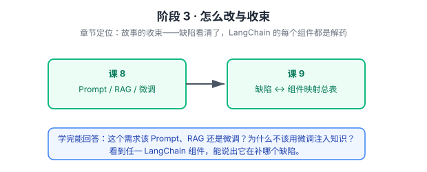

# 阶段 3 · 怎么改与全局收束

> 章节定位：故事的收束——**所以 LangChain 为什么要那样设计**。
> 前两阶段攒下的问题清单（六条缺陷），在这一阶段逐一对应到解法：Prompt / RAG / 微调三条路，以及 LangChain 组件与缺陷的一一映射。

> 看图：先看三条改模型的路各改什么、代价是什么（课 8），再把两阶段攒下的缺陷清单与 LangChain 组件焊成一张总表（课 9）。

## 🎯 阶段目标

从"知道模型缺什么"走到"知道该用什么补"，最终能把 LangChain 的任一组件还原成"它在补哪个缺陷"。这是本教程的**交付终点**——之后再写 LangChain 代码，看的是机制而不是 API。

## 学习重点

- Prompt ——不换模型，换输入；最便宜，但占上下文
- RAG ——不换参数，换知识；可更新，是私域知识的正解
- 微调 ——换参数，改风格与格式；**不能注入知识**
- 三条路选型——什么信号选哪条，常见误用
- 缺陷 ↔ 组件映射总表——本教程的核心交付物

## 必须掌握的知识点

| 课 | 必须掌握 |
|----|---------|
| 课 8 | 能判断"这个需求该 Prompt、RAG 还是微调"；能说清"为什么不该用微调注入知识" |
| 课 9 | 看到 LangChain 任一组件，能说出它在补哪个缺陷 |

## 对应课

- 课 8：改模型的三条路
- 课 9：收束——从模型缺陷到 LangChain 组件

## 回扣 LangChain

| 本课知识 | 回扣到 |
|---------|--------|
| 三条路选型 | [课 11 Retrieval 与 RAG](../../../langchain/stages/3-可控性与可靠性/lessons/lesson-11-Retrieval检索与RAG.md)、[课 4 工具](../../../langchain/stages/2-Agent核心/lessons/lesson-04-Tools工具.md) |
| 缺陷 ↔ 组件映射 | [全课程目录](../../../langchain/02-课程目录.md) |

## 阶段状态

- [x] 课 8 改模型的三条路（2026-09-21 完成）
- [x] 课 9 收束：从模型缺陷到 LangChain 组件（2026-09-21 完成，全教程收官）
