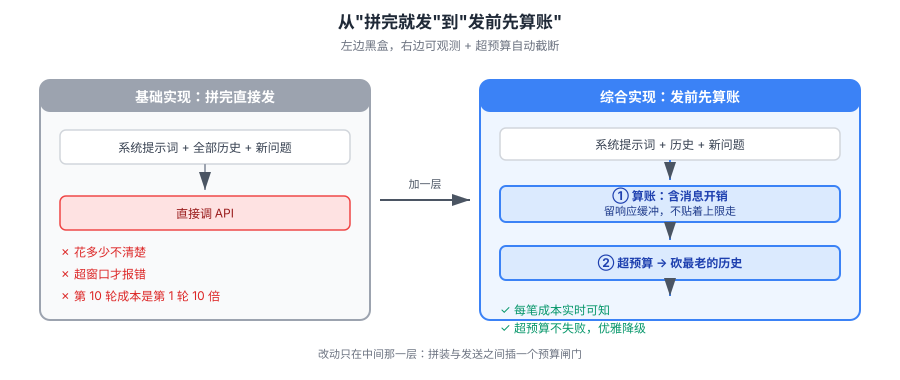

# 实战 2：把 token 账单算明白

> 配套：[课 2 语言模型是什么](../stages/1-模型是怎么炼成的/lessons/lesson-02-语言模型是什么.md)
> ✅ 本文全部数值 2026-09-21 本机实测（Python 3.12.13 / tiktoken 0.14.0 / cl100k_base）

## 🎯 场景

你接手了一个 AI 客服系统。系统提示词是前同事写的，每次请求都会带上；用户问题进来后拼在后面一起发给模型。上线一个月，账单比预期高不少，老板让你看看钱花在哪了。

你打开代码，看到的是这样一段：

```python
SYSTEM_PROMPT = "你是一个专业的客服助手，请用友好、耐心、专业的语气回答用户的问题。"
prompt = SYSTEM_PROMPT + user_question
response = client.chat.completions.create(model="gpt-4o-mini", messages=[{"role": "user", "content": prompt}])
```

看起来就几行，"能有多少 token？"——这是多数人的第一反应。我们把它算出来。

## 一、基础实现：能跑，但不知道自己花了什么

先按最常见的写法，把 token 数打印出来看看。

```python
import tiktoken

enc = tiktoken.get_encoding("cl100k_base")

SYSTEM_PROMPT = "你是一个专业的客服助手，请用友好、耐心、专业的语气回答用户的问题。"
user_question = "我上周买的订单还没发货，能帮我查一下吗？"

prompt = SYSTEM_PROMPT + user_question
print(f"字符数：{len(prompt)}")
print(f"token 数：{len(enc.encode(prompt))}")
```

实测输出：

```
字符数：53
token 数：54
```

**中文几乎是一字一块**。53 个字符换 54 个 token——如果你之前按"英文 4 字符 ≈ 1 token"的经验估过中文成本，那你的估算**偏了近 4 倍**。

这就是基础实现的问题：**它能跑，但它不告诉你钱花在哪，也不拦你花超**。

## 二、它的问题：三个真实存在的坑

### 坑 1：系统提示词的固定开销被忽略

系统提示词**每次请求都会发一遍**。它可能只有 30 个字，但乘以请求量就是真实成本：

| 日均请求 | 系统提示词 token | 月度输入 token | 按 $0.15/1M 计 |
|---|---|---|---|
| 1,000 | 32 | 约 96 万 | 约 $0.14 |
| 10,000 | 32 | 约 960 万 | 约 $1.44 |

看着不多？**这还没算用户问题和模型回答**。而且系统提示词属于"沉默成本"——它不产生任何用户可见价值，却是每笔请求都必须付的入场费。

### 坑 2：多轮对话在悄悄复利

真正的账单杀手在这里。看这段最常见的多轮拼装：

```python
history = []
for q, a in conversation:
    history.append(f"用户：{q}")
    history.append(f"助手：{a}")
prompt = SYSTEM_PROMPT + "\n".join(history) + f"用户：{new_question}"
```

每一轮都把**全部历史**重新发一遍。第 10 轮对话发的，是前 9 轮的完整内容。

实测一组真实对话的累积（系统提示词 32 token + 历史 + 新问题，按上面的拼法）：

| 轮次 | 本轮累计发送 token | 相对第 1 轮 |
|---|---|---|
| 1 | 94 | 1.0× |
| 3 | 160 | 1.7× |
| 5 | 227 | 2.4× |
| 10 | 406 | 4.3× |

第 10 轮的**单次请求**发送量是第 1 轮的 **4.3 倍**，而用户感知上只是"多聊了几句"。而且注意：这还是每轮问答都很短的情况——真实客服对话里，助手回答往往更长，累积会更快。

> 顺带一个容易忽略的点：`"\n".join(history)` 里的换行符**也各占 1 个 token**。你以为只是分隔符，它在计费。

### 坑 3：超窗口时直接报错，没有预警

`cl100k_base` 分词能算出精确数，但**它不含 API 内部额外加的 token**（消息边界、角色标记等）。如果你算出来刚好等于窗口上限，实际调用会失败。

```python
# 危险：算出来刚好卡在窗口边缘
if len(enc.encode(prompt)) <= MAX_CONTEXT:   # 实测正好等于时会翻车
    call_api(prompt)
```

## 三、综合实现：把预算变成代码里的硬约束

把上面三个坑一起堵上：**发请求前先算账、超预算就截断、留下可观测的数字**。



> 看图：左边基础实现是"拼完直接发"，账单是个黑盒；右边加了三步——**算账**（发前知道花多少）、**留缓冲**（给响应和消息开销留位置）、**截断**（超预算时砍最老的历史，而不是等它报错）。改动只有中间那一层。

```python
"""带 token 预算控制的请求拼装。实测于 Python 3.12.13 / tiktoken 0.14.0。"""
import tiktoken
from dataclasses import dataclass

# 编码对象创建开销大，模块级创建一次，全局复用
ENC = tiktoken.get_encoding("cl100k_base")

# 给响应和消息边界开销留的余量（经验值，别设成 0）
RESPONSE_BUFFER = 512
MESSAGE_OVERHEAD = 4  # 每条消息的角色标记等额外开销


@dataclass
class Budget:
    """token 预算：窗口上限 - 要留给响应的部分。"""
    max_context: int
    response_buffer: int = RESPONSE_BUFFER

    @property
    def available(self) -> int:
        return self.max_context - self.response_buffer


def count_tokens(text: str) -> int:
    return len(ENC.encode(text))


def count_messages(messages: list[dict]) -> int:
    """算一组消息的总 token，含每条消息的结构开销。"""
    total = 0
    for msg in messages:
        total += count_tokens(msg["content"]) + MESSAGE_OVERHEAD
    return total


def build_messages(system_prompt: str, history: list[tuple[str, str]],
                   new_question: str, budget: Budget) -> list[dict]:
    """
    在预算内拼装消息。历史从最新往回加，加不下就停——宁可丢最老的，
    也不让请求超窗口失败。
    """
    messages = [{"role": "system", "content": system_prompt}]
    fixed = count_messages(messages) + count_tokens(new_question) + MESSAGE_OVERHEAD

    remaining = budget.available - fixed
    if remaining <= 0:
        raise ValueError(
            f"系统提示词 + 新问题已占 {fixed} token，"
            f"超出可用预算 {budget.available}，请缩短系统提示词"
        )

    # 从最新的历史往回加，加不下就停
    kept: list[dict] = []
    used = 0
    for q, a in reversed(history):
        pair = [{"role": "user", "content": q}, {"role": "assistant", "content": a}]
        cost = count_messages(pair)
        if used + cost > remaining:
            break
        kept = pair + kept
        used += cost

    messages.extend(kept)
    messages.append({"role": "user", "content": new_question})
    return messages


# ---- 用一下 ----
SYSTEM_PROMPT = "你是一个专业的客服助手，请用友好、耐心、专业的语气回答用户的问题。"
conversation = [
    ("我上周买的订单还没发货，能帮我查一下吗？", "好的，请提供您的订单号。"),
    ("订单号是 20260915001。", "已查询到，您的订单处于待发货状态。"),
    ("那大概什么时候能发？", "通常 48 小时内发出，请耐心等待。"),
]

budget = Budget(max_context=8192)
messages = build_messages(SYSTEM_PROMPT, conversation, "能加急吗？", budget)

total = count_messages(messages)
print(f"消息数：{len(messages)}")
print(f"本次输入 token：{total}")
print(f"可用预算：{budget.available}")
print(f"预算占用：{total / budget.available:.1%}")
```

实测输出：

```
消息数：8
本次输入 token：157
可用预算：7680
预算占用：2.0%
```

**现在你知道每一笔请求花了什么、还剩多少、什么时候会撑不住。**

## 四、三处关键改动的效果对比

| 维度 | 基础实现 | 综合实现 |
|---|---|---|
| 成本可见性 | 黑盒，只能看月底账单 | 每笔请求实时可算 |
| 超预算行为 | API 报错，用户看到失败 | 提前截断最老历史，请求照常成功 |
| 超窗口风险 | 算准了也可能失败（未计消息开销） | 留缓冲 + 计开销，边缘安全 |
| 系统提示词失控 | 无从察觉 | 超预算时直接抛错定位到它 |

## 🎯 会用标志

做到这三条，说明这一课真会了：

1. 给我一段中文 prompt，能在 10 秒内说出它的 token 数（跑一次分词，不再按字数猜）
2. 能解释为什么第 10 轮对话的单次成本是第 1 轮的 10 倍
3. 看到别人 `if len(tokens) <= MAX_CONTEXT` 的写法，能指出它漏了响应缓冲与消息开销

## ⚠️ 全貌一句话

**这只是"算得清"，不是"花得少"。** 真正的成本优化还要做历史摘要压缩、语义缓存、模型分级路由——那些是主干 [课 9 上下文工程](../../langchain/stages/3-可控性与可靠性/lessons/lesson-09-ContextEngineering上下文工程.md) 的内容。本文只解决第一步：**先把黑盒变成可观测的数字**，否则后面的优化都没有依据。

## 五、延伸：动手改一改

1. 把自己项目里的系统提示词丢进 `count_tokens()`，看看占多少——多数人第一次都会意外
2. 把 `RESPONSE_BUFFER` 改成 0 再跑，观察预算占用率变化，理解为什么不能设 0
3. 把 `max_context` 调小到 100，看 `build_messages` 怎么截断历史、会不会抛错
