# HTTP 课程手册

> 课程状态：Phase 5《收尾三件套》已完成
>
> 课程范围：5 个阶段 / 15 课 / 45 个知识点
>
> 当前状态：Phase 2 课程正文、Phase 3 综合实战、Phase 4 课程手册与 Phase 5 收尾三件套均已完成；本手册是“第二入口”，用于回顾、查表、做决策和排障。
>
> 版本与事实口径：HTTP 语义以 RFC 9110–9114 为主，HTTP/3 结合 RFC 9114、RFC 9000、RFC 9001；TLS 1.3 结合课程正文标注的 RFC 9846/9849（核查于 2026-09）。历史数字、协议状态与课程正文中的联网核查标记以原课为准。

## 0. 如何使用这本手册

这不是 15 篇正文的拼接版，而是一份面向三种任务的索引：

1. **复习**：先看阶段结论和每课“一图总结”，再回原课补细节。
2. **排障**：先走“排障总流程”，按症状跳到 HTTPS、缓存、性能、认证、CORS 或协议演进章节。
3. **做决策**：使用文末“决策清单”，把“要不要启用”“在哪一层处理”“怎样验证”写成条件—动作—证据。

每课都保留以下入口：

- **一句话本质**：这课解决的核心问题。
- **处境对照**：故事冲突与工程现实的对应关系。
- **一眼全局图**：原课的核心图或同源 Mermaid 图。
- **本课地图**：3 个知识点与可操作能力。
- **速记 / 误区 / 命令卡 / 官方文档**：用于二次查阅。

## 1. 课程全景：从“请求是什么”到“如何证明它哪里慢”

### 1.1 课程目标与故事主线

本课程的目标不是背 HTTP 头字段，而是形成一条完整的工程推理链：

> 能读懂一次请求 → 能解释连接和安全 → 能拆解性能 → 能看懂中间人 → 能理解协议演进 → 能用证据定位问题并做取舍。

故事主角是一位负责 Web 服务的工程师。最初的问题是“按钮点了没反应”，随后逐渐遇到：状态码争议、连接反复建立、HTTPS 变慢、证书失败、缓存旧数据、P99 偏高、代理/CDN 行为不一致、HTTP/2 仍然卡顿、登录失效和 CORS 报错。课程最后把这些问题统一到一张证据链上。

### 1.2 五阶段路径

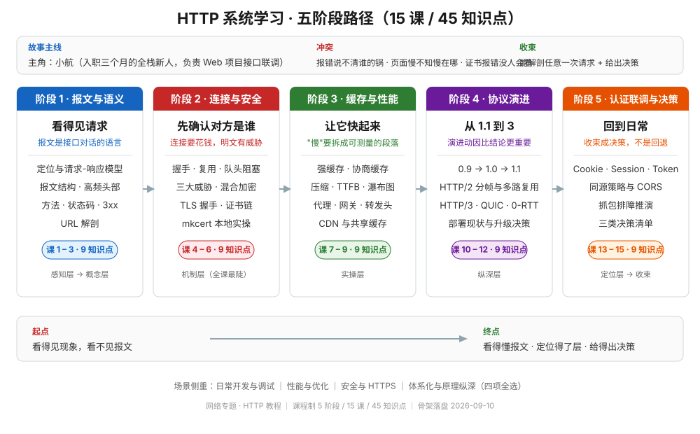

| 阶段 | 要回答的问题 | 课程 | 阶段产出 |
|---|---|---|---|
| 1 · 报文与语义 | 请求和响应到底由什么组成？语义如何表达？ | 1–3 | HTTP 报文读法与方法/状态码判断卡 |
| 2 · 连接与安全 | 连接怎样建立、复用，HTTPS 怎样建立信任？ | 4–6 | 连接成本、TLS、证书诊断卡 |
| 3 · 缓存、性能与中间层 | 为什么同一个 URL 会返回不同结果，慢在哪里？ | 7–9 | 缓存决策、Timing 拆解、中间层路径图 |
| 4 · 协议演进 | HTTP/1.1、HTTP/2、HTTP/3 分别解决了什么？ | 10–12 | 协议选择与降级判断卡 |
| 5 · 应用安全与排障 | 登录、跨域和慢请求如何用证据闭环？ | 13–15 | 认证/CORS/抓包排障决策清单 |

### 1.3 一条请求的总地图


这张图也解释了为什么“HTTP 问题”通常不能只看某一行响应：同一次失败可能发生在 DNS、TCP、TLS、代理、缓存、浏览器安全策略或应用代码任意一层。

## 2. 阶段一：报文与语义——先学会读懂一次请求

阶段问题：**客户端究竟向服务器表达了什么，服务器又用什么方式回答？**

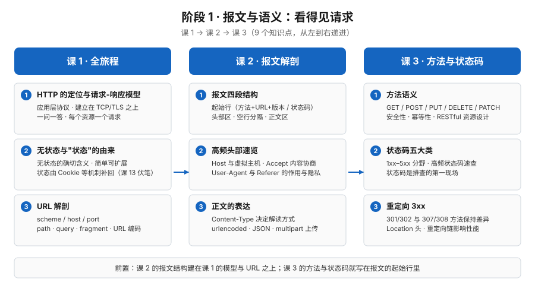

### 第 1 课《HTTP 是什么：从一次请求开始》

[阅读原课](stages/1-报文与语义/lessons/lesson-01-一次网页加载的全旅程.md)

#### 一句话本质

HTTP 是应用层的请求—响应协议；URL 负责定位资源，报文负责表达意图和传递表示。

#### 处境对照

“提交按钮没反应”不一定是按钮坏了，可能是浏览器发出了错误的方法、路径或参数，也可能是服务器已经响应但前端没有正确处理。先把一次交互还原成 HTTP，才有共同语言。

#### 一眼全局图

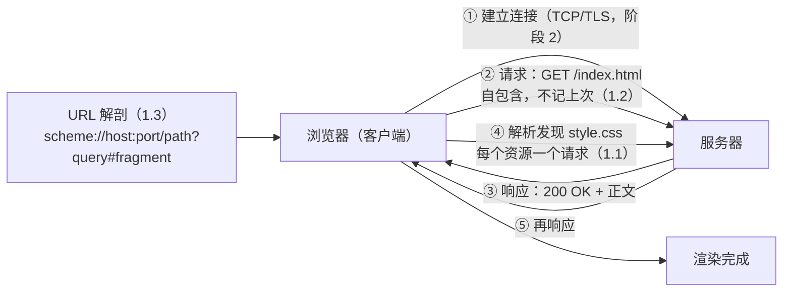

#### 本课地图

| 知识点 | 你要掌握什么 |
|---|---|
| 1.1 HTTP 的位置与作用 | 区分应用层协议、传输层连接和浏览器渲染；知道一个页面由多次请求组成。 |
| 1.2 无状态与请求—响应 | 理解请求自包含、服务器不天然记忆上一次请求；状态要靠 Cookie、Session 或 Token 等机制承载。 |
| 1.3 URL 结构 | 能区分 scheme、host、port、path、query、fragment，并知道 fragment 通常不会发送给服务器。 |

#### 速记

- **HTTP 管内容的表达，不管底层字节怎么可靠送达**；可靠传输是 TCP/QUIC 的职责。
- **无状态不是“不能有状态”**，而是协议本身不替你保存会话状态。
- **URL 是地址和请求目标，不等于完整 HTTP 请求**；方法、头和正文仍然重要。

#### 常见误区

- 把 URL 的 `#fragment` 当成服务器端参数。
- 以为一次页面打开只有一个 HTTP 请求。
- 以为 HTTP 负责保证“送达、顺序和重传”。

#### 命令速查卡

```bash
python3 -m http.server 8000
curl -sv http://127.0.0.1:8000/
curl -s -o /dev/null -w 'code=%{http_code} total=%{time_total}\n' http://127.0.0.1:8000/
```

#### 📖 文档核对与 📚 官方文档

- [MDN：HTTP overview](https://developer.mozilla.org/en-US/docs/Web/HTTP/Overview)
- [RFC 9110：HTTP Semantics](https://www.rfc-editor.org/rfc/rfc9110)
- 原课中的 `📖 文档核对` 与 `📚 官方文档` 保留完整入口，请回到[第 1 课](stages/1-报文与语义/lessons/lesson-01-一次网页加载的全旅程.md)查看。

#### 三句话收束

1. 浏览器看到的页面，是多次 HTTP 请求—响应共同产生的结果。
2. HTTP 以无状态请求表达意图，状态需要由应用机制额外携带。
3. 读 HTTP 的第一步，是从 URL、方法、报文和响应四件事开始。

### 第 2 课《HTTP 报文：请求和响应的共同语言》

[阅读原课](stages/1-报文与语义/lessons/lesson-02-报文解剖.md)

#### 一句话本质

HTTP 报文由起始行、头部、空行和可选正文组成；头部声明“正文是什么、面向谁、能否缓存、如何处理”。

#### 处境对照

前端说“我发的是 JSON”，后端却按表单读取，问题通常不在 JSON 字符串本身，而在 `Content-Type`、请求方法和正文编码没有对齐。

#### 一眼全局图

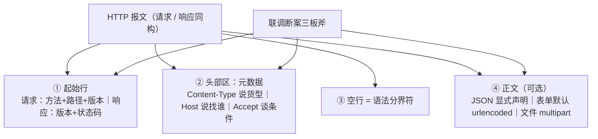

#### 本课地图

| 知识点 | 你要掌握什么 |
|---|---|
| 2.1 报文四段结构 | 能从原始文本中找出起始行、头部、空行和正文，并知道空行是语法分界。 |
| 2.2 关键头部字段 | 能解释 `Host`、`Content-Type`、`Content-Length`、`Transfer-Encoding`、`Accept` 的基本职责。 |
| 2.3 内容协商与编码 | 能区分媒体类型、字符集、内容编码和传输编码，避免把 gzip 当成 JSON 类型。 |

#### 速记

- `Content-Type` 描述“我发送/返回的正文是什么”。
- `Accept` 描述“我希望收到什么”。
- `Content-Encoding` 描述正文是否经过 gzip、br 等编码；解码后才是原始表示。
- `Content-Length` 是长度声明；HTTP/1.1 还可能用 chunked 传输未知长度正文。

#### 常见误区

- 只改正文，不改 `Content-Type`。
- 把 `Accept` 当成服务器必须满足的保证。
- 把 `Transfer-Encoding: chunked` 当成业务正文格式。

#### 命令速查卡

```bash
curl -sS -X POST http://127.0.0.1:8000/api \
  -H 'Content-Type: application/json' -d '{"name":"Ada"}'
curl -sS -X POST http://127.0.0.1:8000/upload -F 'file=@demo.txt'
curl -sS -X POST http://127.0.0.1:8000/form -d 'name=Ada&role=admin'
curl -sS -H 'Host: example.test' http://127.0.0.1:8000/
```

#### 📖 文档核对与 📚 官方文档

- [MDN：HTTP messages](https://developer.mozilla.org/en-US/docs/Web/HTTP/Messages)
- [MDN：HTTP headers](https://developer.mozilla.org/en-US/docs/Web/HTTP/Reference/Headers)
- [RFC 9110：HTTP Semantics](https://www.rfc-editor.org/rfc/rfc9110)

#### 三句话收束

1. 起始行表达动作或结果，头部表达元数据，正文承载表示。
2. 空行不是装饰，而是头部和正文之间的边界。
3. 联调时先同时核对方法、头部和正文，不要只盯着正文字符串。

### 第 3 课《方法与状态码：语义才是契约》

[阅读原课](stages/1-报文与语义/lessons/lesson-03-方法与状态码.md)

#### 一句话本质

方法描述“想做什么”，状态码描述“服务器处理到什么结果”；安全性和幂等性决定失败重试能否放心进行。

#### 处境对照

团队争论“这是 400、401 还是 500”，本质是在定位责任边界：请求不合法、身份未通过，还是服务端处理失败。状态码是排障分流器，不只是数字。

#### 一眼全局图

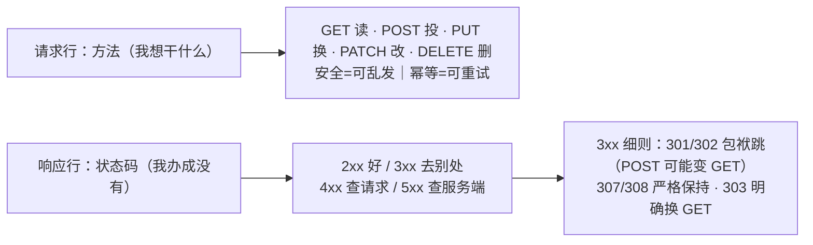

#### 本课地图

| 知识点 | 你要掌握什么 |
|---|---|
| 3.1 方法语义 | 能区分 GET、POST、PUT、PATCH、DELETE 的典型语义，并理解安全与幂等。 |
| 3.2 状态码族 | 能用 2xx/3xx/4xx/5xx 快速判断成功、重定向、客户端责任和服务端责任。 |
| 3.3 重定向与错误分流 | 能解释 301/302/303/307/308 的方法保持差异，并用状态码指导下一步取证。 |

#### 速记

- **幂等不是“结果一定不变”**，而是同一请求重复执行的预期效果等价。
- 401 常表示“需要认证或认证无效”，403 常表示“身份已知但无权访问”。
- 301/302 的历史兼容行为可能改变 POST；需要保持方法时优先理解 307/308。

#### 常见误区

- 把所有写操作都写成 POST，失去语义和重试边界。
- 看到 401 就直接判断“密码错”，忽略认证头、Cookie、过期和代理剥离。
- 看到 500 就继续让客户端重试，导致服务端副作用放大。

#### 命令速查卡

```bash
curl -si http://127.0.0.1:8000/redirect
curl -sS -X POST -d 'x=1' -i http://127.0.0.1:8000/redirect
curl -sS --post301 --post302 --post307 -X POST -d 'x=1' -i URL
```

#### 📖 文档核对与 📚 官方文档

- [MDN：HTTP request methods](https://developer.mozilla.org/en-US/docs/Web/HTTP/Reference/Methods)
- [MDN：HTTP response status codes](https://developer.mozilla.org/en-US/docs/Web/HTTP/Reference/Status)
- [RFC 9110：Methods and Status Codes](https://www.rfc-editor.org/rfc/rfc9110)

#### 三句话收束

1. 方法和状态码共同构成接口的语义契约。
2. 安全性与幂等性决定请求能否预取、重试和缓存。
3. 状态码先做责任分流，细节再回到响应头和正文取证。

## 3. 阶段二：连接与安全——让请求可靠地到达正确的服务器

阶段问题：**请求发送前，连接如何建立和复用；在不可信网络上，怎样确认对方并保护内容？**


### 第 4 课《连接管理：握手、复用与队头阻塞》

[阅读原课](stages/2-连接与安全/lessons/lesson-04-连接管理与队头阻塞.md)

#### 一句话本质

新连接要支付 DNS、TCP/TLS 和首包等待成本；Keep-Alive 能摊薄握手，但 HTTP/1.1 的串行请求会产生队头阻塞。

#### 处境对照

瀑布图里出现 30 个资源和大片“等待”，常见原因不是服务器代码慢，而是每个资源重复付连接成本，或同一条 HTTP/1.1 连接被队头请求堵住。

#### 一眼全局图

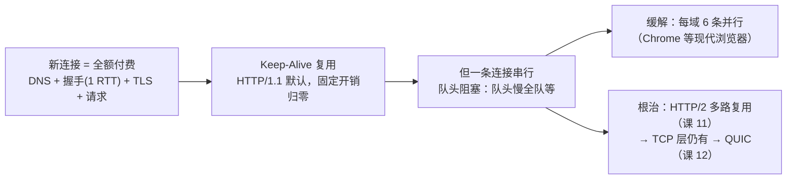

#### 本课地图

| 知识点 | 你要掌握什么 |
|---|---|
| 4.1 连接建立成本 | 能在 Timing 中区分 DNS、TCP、TLS、请求发送和响应等待。 |
| 4.2 持久连接与复用 | 能解释 Keep-Alive 如何摊薄握手成本，以及何时连接会被关闭。 |
| 4.3 队头阻塞 | 能区分 HTTP/1.1 应用层串行阻塞和后续 HTTP/2/TCP 层阻塞。 |

#### 速记

- 复用解决“重复握手”，不自动解决“数据顺序依赖”。
- HTTP/1.1 常用多连接并行缓解队头阻塞，但连接数过多也会放大资源消耗。
- HTTP/2 把请求拆成流并行发送；TCP 丢包仍可能让整条连接等待。

#### 常见误区

- 把 Keep-Alive 当成“永不关闭”。
- 认为连接复用必然让所有请求同时完成。
- 为 HTTP/2 继续机械保留 domain sharding，反而增加连接和 TLS 成本。

#### 命令速查卡

```bash
curl -sS -o /dev/null -w 'connect=%{time_connect} total=%{time_total}\n' URL
curl -sS -w 'num_connects=%{num_connects}\n' URL URL
curl -sv URL
```

#### 📖 文档核对与 📚 官方文档

- [MDN：Connection management in HTTP/1.x](https://developer.mozilla.org/en-US/docs/Web/HTTP/Guides/Connection_management_in_HTTP_1.x)
- [MDN：HTTP persistent connection](https://developer.mozilla.org/en-US/docs/Web/HTTP/Guides/Connection_management_in_HTTP_1.x)
- [RFC 9112：HTTP/1.1](https://www.rfc-editor.org/rfc/rfc9112)

#### 三句话收束

1. 首请求慢，先看连接成本；复用后慢，才更可能是服务处理或传输问题。
2. Keep-Alive 让连接可复用，但 HTTP/1.1 仍受串行队头阻塞约束。
3. 诊断性能时必须把“连接次数”和“等待段落”一起看。

### 第 5 课《HTTPS：明文的三大威胁与加密原理》

[阅读原课](stages/2-连接与安全/lessons/lesson-05-HTTPS加密原理.md)

#### 一句话本质

HTTPS = HTTP over TLS：用加密保护机密性，用认证和完整性保护通信对象与内容，并通过握手协商后续的对称会话密钥。

#### 处境对照

“强制 HTTPS 后请求变慢”不是 HTTPS 不值得用，而是每条新连接多了 TLS 握手；正确的工程问题是测出成本、复用连接，并确认是否真的完成了可信握手。

#### 一眼全局图

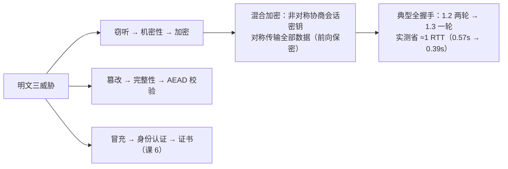

#### 本课地图

| 知识点 | 你要掌握什么 |
|---|---|
| 5.1 明文传输的三大威胁 | 能把窃听、篡改、冒充分别映射到机密性、完整性、身份认证。 |
| 5.2 混合加密 | 能解释非对称密码适合协商、对称密码适合传输，以及 AEAD 和前向保密的作用。 |
| 5.3 TLS 握手 | 能按 TLS 1.2/1.3 的消息轮次理解协商、认证、密钥派生与加密应用数据的过程。 |

#### 速记

- 加密正文只能解决“别人看不懂”，证书还要解决“你连的是谁”。
- 非对称密码不是用来加密全部网页数据的；它承担身份认证和密钥协商。
- TLS 1.3 的典型全握手减少往返；PSK、0-RTT、ECH 是特定条件下的扩展，不能当作所有请求都零延迟。

#### 常见误区

- 认为 HTTPS 只提供加密，不提供身份认证和篡改检测。
- 认为证书里“有公钥”就等于证书可信。
- 把 `--insecure` 当成修复证书问题；它只是关闭客户端校验。

#### 命令速查卡

```bash
curl -sv https://example.com/ -o /dev/null
curl -sS -o /dev/null -w 'tls=%{time_appconnect} total=%{time_total}\n' https://example.com/
curl --tlsv1.2 --tls-max 1.2 -sS -o /dev/null -w '%{time_appconnect}\n' https://example.com/
openssl s_client -connect example.com:443 -servername example.com
```

#### 📖 文档核对与 📚 官方文档

- [MDN：Transport Layer Security](https://developer.mozilla.org/en-US/docs/Web/Security/Defenses/Transport_Layer_Security)
- [RFC 8446：TLS 1.3](https://www.rfc-editor.org/rfc/rfc8446)
- [RFC 9846：TLS 1.3 protocol update](https://www.rfc-editor.org/rfc/rfc9846)
- [RFC 9849：TLS 1.3 protocol update](https://www.rfc-editor.org/rfc/rfc9849)

#### 三句话收束

1. 明文的三大威胁分别是窃听、篡改、冒充。
2. TLS 用证书确认身份，用握手协商密钥，用 AEAD 保护应用数据。
3. HTTPS 性能要靠测量和连接复用优化，而不是因握手成本放弃安全。

### 第 6 课《证书与信任链：浏览器为什么相信它》

[阅读原课](stages/2-连接与安全/lessons/lesson-06-证书与信任.md)

#### 一句话本质

证书校验不是“看证书有没有过期”，而是同时验证名称、时间、签名链、用途和约束，最终把服务器公钥绑定到目标身份。

#### 处境对照

浏览器能打开，curl 却失败，常见差异在信任根、SNI、代理环境、证书链补全或客户端校验策略，而不是“HTTPS 在浏览器里才有效”。

#### 一眼全局图

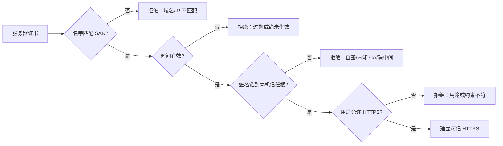

#### 本课地图

| 知识点 | 你要掌握什么 |
|---|---|
| 6.1 证书与 CA | 能说明证书、公钥、私钥、CA 和信任根之间的绑定关系。 |
| 6.2 信任链校验 | 能按 SAN、有效期、签名链、用途和约束逐项排查证书失败。 |
| 6.3 TLS 诊断 | 能用 `openssl s_client`、`curl -vI` 识别 SNI、链缺失、自签和域名不匹配。 |

#### 速记

- SAN 是现代名称匹配的核心字段；证书的 Common Name 不能替代完整的 SAN 判断。
- 服务器可能发了叶子证书，却没发客户端需要的中间证书。
- `-k/--insecure` 只适合隔离实验，不应成为生产修复方案。

#### 常见误区

- 只看浏览器地址栏的锁，不记录具体证书链和校验错误。
- 把“证书过期”当成所有 TLS 失败的总称。
- 在客户端关闭验证来掩盖服务端证书部署错误。

#### 命令速查卡

```bash
openssl s_client -connect host:443 -servername host -showcerts
curl -vI https://host/
curl --cacert ./ca.pem -vI https://internal.example/
```

#### 📖 文档核对与 📚 官方文档

- [RFC 5280：PKIX certificate and CRL profile](https://www.rfc-editor.org/rfc/rfc5280)
- [RFC 9525：Service Identity in TLS](https://www.rfc-editor.org/rfc/rfc9525)

#### 三句话收束

1. 信任的对象不是“这张证书”，而是校验通过的身份绑定链。
2. 证书排障要逐项核验名称、时间、链、用途和客户端环境。
3. 诊断工具输出比“浏览器能不能打开”更适合做工程证据。

## 4. 阶段三：缓存、性能与中间层——把“慢”和“旧”拆开

阶段问题：**响应为什么不是每次都回源，性能瓶颈究竟落在哪一段？**

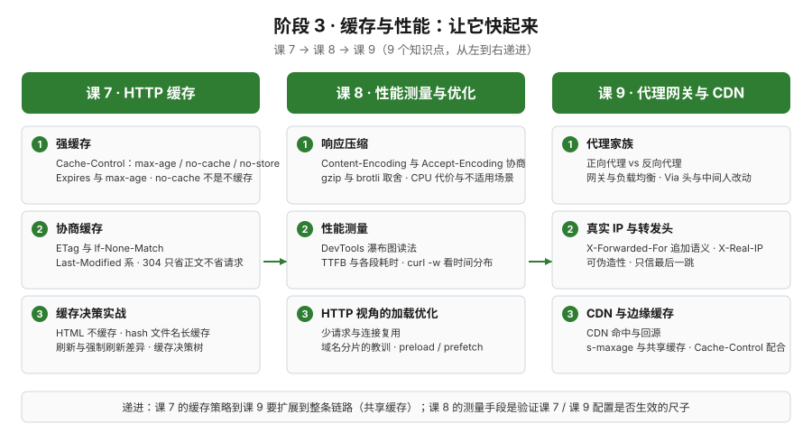

### 第 7 课《HTTP 缓存：为什么浏览器会返回旧数据》

[阅读原课](stages/3-缓存与性能/lessons/lesson-07-HTTP缓存.md)

#### 一句话本质

缓存把“是否需要重新请求”和“是否需要重新传输正文”拆成两层：强缓存可以不发请求，协商缓存发请求但可能只得到 304。

#### 处境对照

HTML 已更新，用户却看到旧页面；或者接口明明没变，服务器仍被大量请求打满。排查缓存时不能只问“有没有缓存”，要问缓存在哪一层、由谁控制、用什么证据验证。

#### 一眼全局图


#### 本课地图

| 知识点 | 你要掌握什么 |
|---|---|
| 7.1 缓存分层与强缓存 | 能区分浏览器缓存、共享缓存/CDN，以及 `max-age` 命中时为什么请求根本不会发出。 |
| 7.2 协商缓存 | 能用 `ETag`/`Last-Modified` 与 `If-None-Match`/`If-Modified-Since` 解释 304。 |
| 7.3 缓存策略设计 | 能为 HTML、带指纹静态资源、个性化接口和共享 CDN 内容选择不同策略。 |

#### 速记

- `Cache-Control: no-cache` 通常表示“使用前要验证”，不等于“不保存”。
- `no-store` 才是“不要存储”；敏感响应不能仅靠 `no-cache` 表达禁止落盘。
- 带内容哈希的静态资源适合长时间 `immutable`；HTML 往往需要较短 TTL 或协商验证。
- 共享缓存要额外考虑 `s-maxage`、`Vary`、鉴权和用户个性化边界。

#### 常见误区

- 看到 304 就认为服务器没有做任何工作；协商请求仍然消耗连接、鉴权和处理资源。
- 给带 Cookie 的个性化响应配置公共缓存，却没有检查缓存键和 `Vary`。
- 用清空浏览器缓存替代对响应头的验证。

#### 命令速查卡

```bash
curl -sS -D - -o /dev/null URL
curl -sS -H 'Cache-Control: no-cache' -D - -o /dev/null URL
curl -sS -H 'Cache-Control: max-age=0' -D - -o /dev/null URL
curl -sS -H 'If-None-Match: "etag-value"' -D - -o /dev/null URL
```

#### 📖 文档核对与 📚 官方文档

- [MDN：HTTP caching](https://developer.mozilla.org/en-US/docs/Web/HTTP/Guides/Caching)
- [MDN：Cache-Control](https://developer.mozilla.org/en-US/docs/Web/HTTP/Reference/Headers/Cache-Control)
- [RFC 9111：HTTP Caching](https://www.rfc-editor.org/rfc/rfc9111)

#### 三句话收束

1. 先判断“请求有没有发出”，再判断“发出后有没有传正文”。
2. 缓存正确性靠响应头、缓存键和验证请求共同保证。
3. HTML、指纹静态资源、个性化数据必须分策略，不能一把梭哈。

### 第 8 课《性能测量与优化：把“慢”拆成段落》

[阅读原课](stages/3-缓存与性能/lessons/lesson-08-性能测量与优化.md)

#### 一句话本质

性能优化不是先打开某个开关，而是把一次请求拆成 DNS、连接、TLS、等待首字节、下载等段，找到最长段后再对症下药。

#### 处境对照

P99 达到 3 秒时，带宽只是可能性之一。真实瓶颈可能是 DNS、TCP/TLS 握手、服务端排队、响应体过大、连接未复用，或者浏览器加载顺序不合理。

#### 一眼全局图


#### 本课地图

| 知识点 | 你要掌握什么 |
|---|---|
| 8.1 内容编码与传输效率 | 能解释 `Accept-Encoding`、`Content-Encoding`、gzip/Brotli 的收益与 CPU/缓存变体成本。 |
| 8.2 Timing 分段测量 | 能用 DevTools Timing 和 `curl -w` 拆出 DNS、连接、TLS、TTFB、下载时间。 |
| 8.3 加载与资源优化 | 能按关键路径选择连接复用、压缩、合并、preload、prefetch 等动作，并说明副作用。 |

#### 速记

- `TTFB` 高，先看服务端排队/处理、代理回源和连接阶段；下载耗时高，才重点看响应体和带宽。
- HTTP/2 下不要机械做 domain sharding；多域名会削弱连接复用并增加握手。
- `preload` 是“当前页面马上需要”，`prefetch` 是“未来可能需要”；用错会抢占关键资源带宽。
- 优化必须有基线、分位数和回归验证，不能用一次主观体感代替测量。

#### 常见误区

- 看到“总耗时”就直接压缩正文，忽略 DNS、TLS 或服务端等待。
- 把 gzip/Brotli 当成免费收益，忽略动态压缩 CPU、压缩级别和缓存变体。
- 用更多连接解决所有问题，在 HTTP/2/3 环境下反而放大连接管理成本。

#### 命令速查卡

```bash
curl -sS -o /dev/null -w \
  'dns=%{time_namelookup} connect=%{time_connect} tls=%{time_appconnect} ttfb=%{time_starttransfer} total=%{time_total}\n' URL
curl -sS -H 'Accept-Encoding: br, gzip' -D - -o /dev/null URL
curl -sS -I URL
```

#### 📖 文档核对与 📚 官方文档

- [Chrome DevTools：Network performance](https://developer.chrome.com/docs/devtools/network/)
- [MDN：Content-Encoding](https://developer.mozilla.org/en-US/docs/Web/HTTP/Reference/Headers/Content-Encoding)
- [MDN：preload](https://developer.mozilla.org/en-US/docs/Web/HTML/Attributes/rel/preload)
- [MDN：prefetch](https://developer.mozilla.org/en-US/docs/Web/HTTP/Reference/Headers/Link)

#### 三句话收束

1. “慢”是总账，优化前必须拆成可验证的时间段。
2. 最长段决定第一优化动作，其他漂亮指标暂时都靠后。
3. 每个优化都要同时写收益、代价和验证方式。

### 第 9 课《代理、网关与 CDN：请求的中间人》

[阅读原课](stages/3-缓存与性能/lessons/lesson-09-代理网关与CDN.md)

#### 一句话本质

请求路径中可能存在正向代理、反向代理、网关和 CDN；它们会转发、终止 TLS、改写头部、缓存响应或承担安全策略，因此必须把“谁看到、谁修改、谁负责”画出来。

#### 处境对照

所有请求都先到一个网关，用户以为自己直接访问应用；生产出现真实 IP 丢失、缓存命中不一致或 CDN 与源站响应不同，原因往往是中间层职责没有被显式建模。

#### 一眼全局图


#### 本课地图

| 知识点 | 你要掌握什么 |
|---|---|
| 9.1 代理与网关家族 | 能区分正向代理、反向代理、网关、负载均衡与 CDN 的典型位置和职责。 |
| 9.2 转发头与信任边界 | 能解释 `Via`、`Forwarded`、`X-Forwarded-For`、`X-Real-IP`，并识别客户端伪造风险。 |
| 9.3 CDN 缓存与回源 | 能用命中/未命中、`Age`、`X-Cache`、`s-maxage`、`Vary` 等证据判断请求是否回源。 |

#### 速记

- 正向代理代表客户端，反向代理代表服务端；判断关键是“代理替谁说话”。
- `X-Forwarded-For` 不是天然可信字段，应用只能信任自己明确配置的代理链。
- CDN 命中节省回源距离和源站压力，但缓存键、失效、鉴权和个性化边界必须清楚。

#### 常见误区

- 把客户端传来的 `X-Forwarded-For` 直接当真实 IP。
- 看到 CDN 响应就认为一定命中缓存，不检查 `Age`、缓存状态和回源日志。
- 把网关、反向代理和 CDN 当成同一个组件，导致排障责任不清。

#### 命令速查卡

```bash
curl -x http://proxy.example:8080 -v https://example.com/
curl -sS -H 'Forwarded: for=192.0.2.10;proto=https;host=example.com' URL
curl -sS -D - -o /dev/null URL | rg -i 'age|via|cache|vary|forwarded'
```

#### 📖 文档核对与 📚 官方文档

- [MDN：Proxy servers and tunneling](https://developer.mozilla.org/en-US/docs/Web/HTTP/Proxy_servers_and_tunneling)
- [MDN：Via](https://developer.mozilla.org/en-US/docs/Web/HTTP/Reference/Headers/Via)
- [MDN：Forwarded](https://developer.mozilla.org/en-US/docs/Web/HTTP/Reference/Headers/Forwarded)
- [RFC 7239：Forwarded HTTP Extension](https://www.rfc-editor.org/rfc/rfc7239)

#### 三句话收束

1. 中间层不是黑盒，必须把它们画成请求路径的一部分。
2. 转发头的价值取决于信任边界，字段名本身不提供真实性。
3. CDN 排障至少要同时看客户端响应头、边缘状态和源站证据。

## 5. 阶段四：协议演进——同一套语义，换不同的运输方式

阶段问题：**HTTP/1.1、HTTP/2、HTTP/3 各自解决什么，又把什么问题留了下来？**


### 第 10 课《HTTP/1.1 与协议奠基》

[阅读原课](stages/4-协议演进/lessons/lesson-10-HTTP1.1与协议奠基.md)

#### 一句话本质

HTTP/1.1 把持久连接、Host、多种消息长度表达和更成熟的缓存/范围请求等能力制度化，同时保留文本报文和串行队头阻塞。

#### 处境对照

遗留系统需要一台 IP 服务多个域名，响应正文长度事先未知，页面又加载几十个资源。HTTP/1.1 的头字段和连接规则正是这些现实约束下形成的协议地基。

#### 一眼全局图

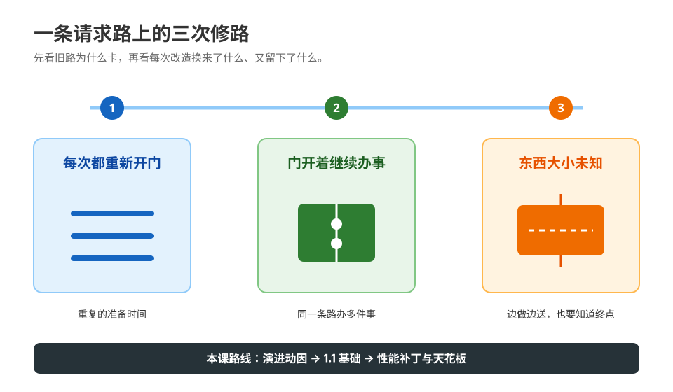

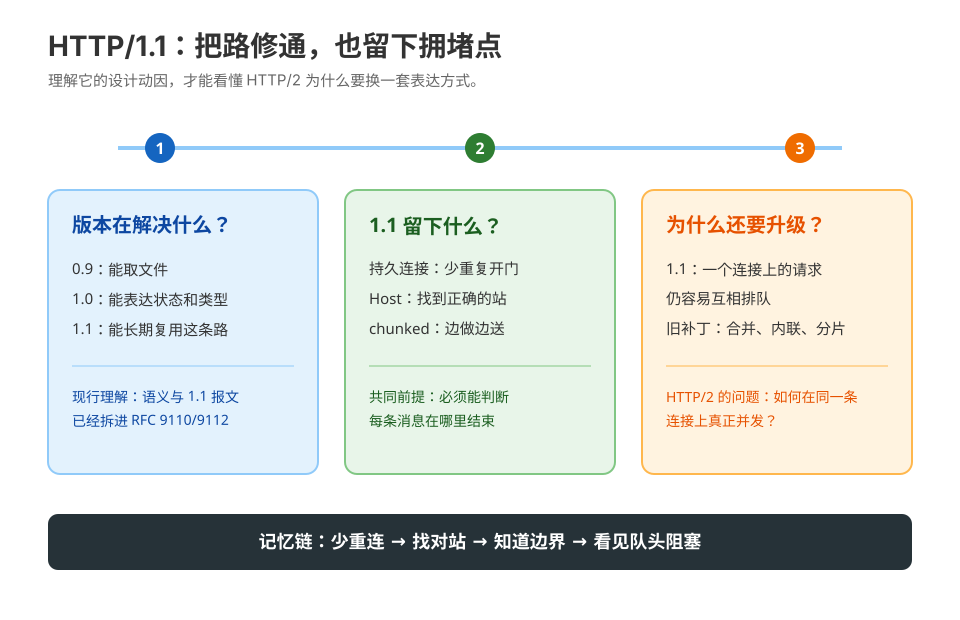

#### 本课地图

| 知识点 | 你要掌握什么 |
|---|---|
| 10.1 版本与历史边界 | 能说明 HTTP/1.0 到 HTTP/1.1 的关键演进，不把历史实现细节误当成当前规范。 |
| 10.2 持久连接与消息长度 | 能用 `Content-Length`、chunked 和连接关闭判断一条响应在哪里结束。 |
| 10.3 性能技巧与上限 | 能解释合并、内联、雪碧图、domain sharding 的历史动机及其在新协议下的副作用。 |

#### 速记

- `Host` 让一台服务器/IP 能承载多个虚拟主机，是 HTTP/1.1 的关键基础。
- `Transfer-Encoding: chunked` 解决“发送时还不知道最终长度”的问题，但它不是压缩。
- HTTP/1.1 优化常围绕减少请求数和并行连接；HTTP/2 后应重新评估这些技巧。

#### 常见误区

- 只看 TCP 连接关闭判断正文结束，却忽略 `Content-Length`/chunked 的消息语义。
- 认为 HTTP/1.1 的每个请求都必须新建 TCP 连接。
- 在 HTTP/2/3 环境照搬 domain sharding 和大规模资源合并。

#### 命令速查卡

```bash
curl --http1.1 -v https://example.com/ -o /dev/null
curl --http1.1 --no-keepalive -v https://example.com/ -o /dev/null
python3 stages/4-协议演进/labs/lesson-10-http11-foundations-lab.py
```

#### 📖 文档核对与 📚 官方文档

- [MDN：Evolution of HTTP](https://developer.mozilla.org/en-US/docs/Web/HTTP/Guides/Evolution_of_HTTP)
- [MDN：Connection management](https://developer.mozilla.org/en-US/docs/Web/HTTP/Guides/Connection_management_in_HTTP_1.x)
- [MDN：Host](https://developer.mozilla.org/en-US/docs/Web/HTTP/Reference/Headers/Host)
- [RFC 9112：HTTP/1.1](https://www.rfc-editor.org/rfc/rfc9112)

#### 三句话收束

1. HTTP/1.1 的核心贡献是可复用连接、虚拟主机和明确的消息边界。
2. 文本可读性带来易调试，也带来头部重复和串行请求限制。
3. 任何历史性能技巧都要放回协议版本和真实资源图中重新判断。

### 第 11 课《HTTP/2 与多路复用》

[阅读原课](stages/4-协议演进/lessons/lesson-11-HTTP2与多路复用.md)

#### 一句话本质

HTTP/2 保留 HTTP 语义，却把报文编码为二进制帧，并用流在一条连接上交错承载多个请求，从而减少串行等待和重复头部。

#### 处境对照

页面有几十个静态资源，HTTP/1.1 只能依靠有限的并行连接；换成 HTTP/2 后请求可在同一连接交错发送，但 TCP 丢包仍可能拖住整条连接。

#### 一眼全局图

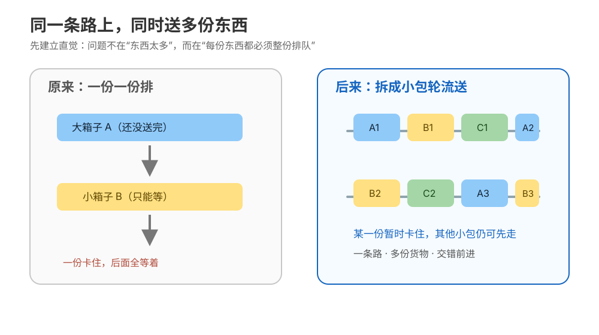

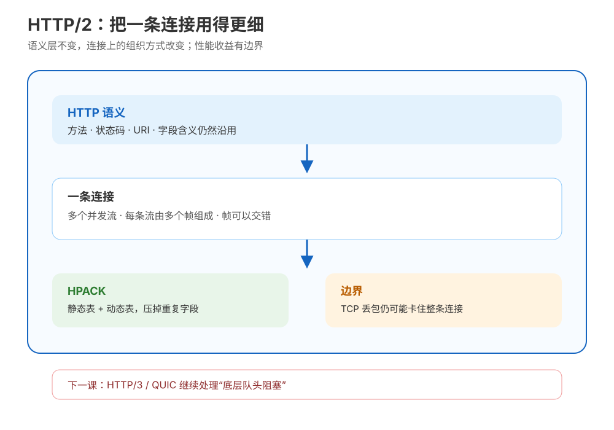

#### 本课地图

| 知识点 | 你要掌握什么 |
|---|---|
| 11.1 二进制分帧 | 能区分帧、消息、流、连接，理解 HTTP 语义没有因为二进制编码而改变。 |
| 11.2 多路复用与队头阻塞 | 能解释 HTTP 层队头阻塞被缓解，但 TCP 层丢包仍可能阻塞同一连接上的流。 |
| 11.3 HPACK、Server Push 与优先级 | 能说明头部压缩和优先级的作用，知道 HPACK 不是加密，Server Push 已被主流浏览器工程上弃用。 |

#### 速记

- 一个 TCP/TLS 连接上有多个逻辑 stream；帧可以交错发送。
- HPACK 通过静态/动态表减少重复头部，不提供机密性。
- HTTP/2 的“多路复用”不是“不会阻塞”；共享 TCP 的可靠有序语义仍然存在。

#### 常见误区

- 以为 HTTP/2 是另一套业务语义，实际上方法、状态码和大部分头部语义仍来自 HTTP。
- 把多路复用等同于 QUIC 的独立传输流。
- 为 Server Push 设计新业务依赖，却没有验证浏览器和客户端支持状态。

#### 命令速查卡

```bash
python3 stages/4-协议演进/labs/lesson-11-http2-framing-lab.py
curl --http2 -v https://example.com/ -o /dev/null
curl --http1.1 -v https://example.com/ -o /dev/null
curl --http2 --parallel URL1 URL2
```

#### 📖 文档核对与 📚 官方文档

- [MDN：HTTP/2](https://developer.mozilla.org/en-US/docs/Glossary/HTTP_2)
- [RFC 9113：HTTP/2](https://www.rfc-editor.org/rfc/rfc9113)
- [RFC 7541：HPACK](https://www.rfc-editor.org/rfc/rfc7541)
- [Chrome：Removing HTTP/2 Server Push](https://developer.chrome.com/blog/removing-push)

#### 三句话收束

1. HTTP/2 主要改变表达和运输方式，不改变 HTTP 的基本语义。
2. 多路复用减少了应用层排队，却没有消除 TCP 层队头阻塞。
3. 看到 HTTP/2 不能只问“开没开”，还要看连接、丢包、流优先级和资源加载顺序。

### 第 12 课《HTTP/3 与 QUIC》

[阅读原课](stages/4-协议演进/lessons/lesson-12-HTTP3与QUIC.md)

#### 一句话本质

HTTP/3 把 HTTP 映射到 QUIC：QUIC 在 UDP 之上提供加密、可靠传输、独立流和连接迁移，目标是降低共享 TCP 连接导致的队头阻塞影响。

#### 处境对照

HTTP/2 已经多路复用，移动网络切换或单个丢包时仍可能整体受影响；产品提出“上 h3”时，正确动作是验证客户端、网络和回退路径，而不是只改一个协议开关。

#### 一眼全局图

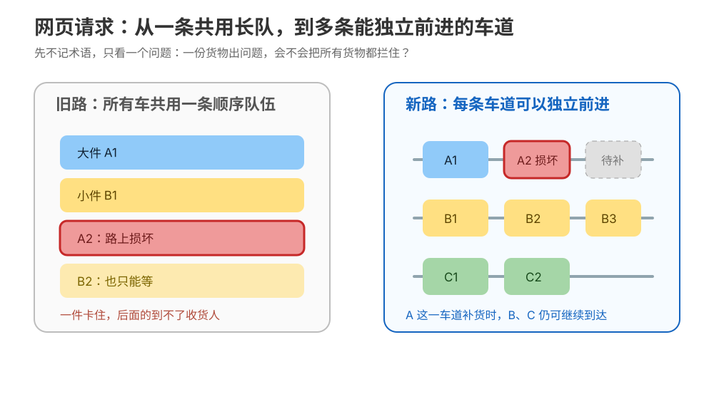

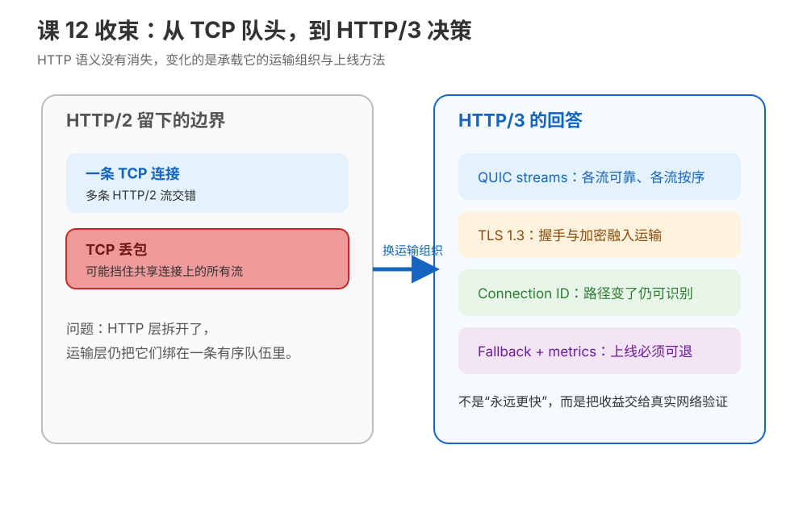

#### 本课地图

| 知识点 | 你要掌握什么 |
|---|---|
| 12.1 QUIC 分层与可靠性 | 能解释“QUIC 使用 UDP”不等于“不可靠”，可靠性、拥塞控制和 TLS 都由 QUIC/TLS 协同提供。 |
| 12.2 流、握手与迁移 | 能理解独立流、1-RTT/0-RTT、连接 ID 和网络迁移的收益与限制。 |
| 12.3 HTTP/3 部署与回退 | 能用 Alt-Svc、客户端支持、网络可达性和 HTTP/2/1.1 fallback 设计渐进部署。 |

#### 速记

- HTTP/3 的独立流降低了一个流的丢包对其他流的影响，但应用依赖仍可能形成自己的等待。
- 0-RTT 有重放风险，不能把带副作用的请求无条件放进去。
- UDP/443 不通时必须有可用的 TCP 上 HTTP/2/1.1 回退路径。

#### 常见误区

- 把 UDP 当成“应用自己处理所有可靠性”。
- 认为启用 Alt-Svc 后所有客户端立即使用 HTTP/3。
- 用 HTTP/3 解决服务端慢、数据库慢或缓存错误等非传输层问题。

#### 命令速查卡

```bash
python3 stages/4-协议演进/labs/lesson-12-quic-concepts-lab.py
curl --http3-only -v https://example.com/ -o /dev/null
curl --http3 -v https://example.com/ -o /dev/null
curl --alt-svc /tmp/http3-alt-svc.txt -v https://example.com/ -o /dev/null
```

#### 📖 文档核对与 📚 官方文档

- [MDN：HTTP/3](https://developer.mozilla.org/en-US/docs/Glossary/HTTP_3)
- [RFC 9114：HTTP/3](https://www.rfc-editor.org/rfc/rfc9114)
- [RFC 9000：QUIC Transport](https://www.rfc-editor.org/rfc/rfc9000)
- [RFC 9001：Using TLS to Secure QUIC](https://www.rfc-editor.org/rfc/rfc9001)

#### 三句话收束

1. HTTP/3 的关键不是“UDP 更快”，而是 QUIC 提供独立流和连接迁移。
2. 0-RTT、迁移和 Alt-Svc 都有适用边界，不能脱离请求语义和网络条件。
3. 协议升级的验收标准是可观测、可回退、对业务无破坏。

## 6. 阶段五：认证、联调与决策——从“报错”走到证据闭环

阶段问题：**身份、浏览器安全策略和排障工具如何协同，才能把线上问题定位到责任层？**

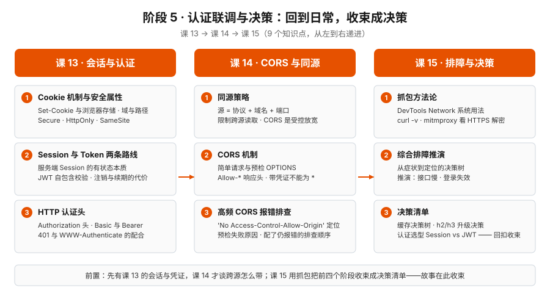

### 第 13 课《Cookie、会话与 Token：登录状态放在哪里》

[阅读原课](stages/5-认证联调与决策/lessons/lesson-13-Cookie会话与Token.md)

#### 一句话本质

登录不是一个字段，而是“客户端携带凭据、服务端验证身份、应用决定权限”的状态管理协议；Cookie/Session 与 Token 只是状态所有权的不同安排。

#### 处境对照

用户每次刷新都被踢回登录页，或者敏感数据出现在错误缓存里。排查重点包括 Cookie 属性、域/路径、SameSite、过期时间、Bearer 头是否经过代理，以及服务端 401/403 的分流。

#### 一眼全局图


#### 本课地图

| 知识点 | 你要掌握什么 |
|---|---|
| 13.1 Cookie 属性与作用域 | 判断 `Domain`、`Path`、`Secure`、`HttpOnly`、`SameSite`、`Max-Age/Expires` 是否符合场景。 |
| 13.2 Session 与 Token | 比较服务端保存状态和客户端携带声明，在撤销、扩展、轮换和泄露面上的差异。 |
| 13.3 认证头与令牌边界 | 区分 401/403、Cookie/Bearer，以及 JWS/JWE 的签名/加密边界。 |

#### 速记与误区

- `HttpOnly` 降低脚本读取 Cookie 的风险，但不能替代 CSRF 防护；`Secure` 和 `SameSite` 也必须按部署环境配置。
- JWT/JWS 的签名验证不等于内容加密；Base64URL 编码不提供保密。
- Token 不是“无状态魔法”：撤销、轮换、过期、受众和密钥管理仍然是服务端责任。
- 不要把 403 当成“没有登录”，否则前端可能无限刷新凭据。

#### 命令速查卡

```bash
curl -c /tmp/http-cookie.txt -i https://example.com/login
curl -b /tmp/http-cookie.txt -i https://example.com/me
curl -H 'Authorization: Bearer TOKEN' -i https://example.com/me
curl -sS -D - -o /dev/null https://example.com/me
```

#### 📖 文档核对与 📚 官方文档

- [MDN：Using HTTP cookies](https://developer.mozilla.org/en-US/docs/Web/HTTP/Guides/Cookies)
- [MDN：Set-Cookie](https://developer.mozilla.org/en-US/docs/Web/HTTP/Reference/Headers/Set-Cookie)
- [MDN：HTTP authentication](https://developer.mozilla.org/en-US/docs/Web/HTTP/Guides/Authentication)
- [OWASP：Session Management Cheat Sheet](https://cheatsheetseries.owasp.org/cheatsheets/Session_Management_Cheat_Sheet.html)

#### 应用实战入口

配套实战：[Cookie 会话与 Token](应用实战/13-Cookie会话与Token.md)。

#### 三句话收束

1. 登录状态的核心问题是状态放在哪里、谁能修改、如何撤销。
2. Cookie 属性决定浏览器何时自动携带凭据；Token 方案仍需要完整生命周期设计。
3. 认证排障先看凭据是否携带，再看身份验证，最后看权限授权。

### 第 14 课《CORS 与同源策略：浏览器为什么拦你》

[阅读原课](stages/5-认证联调与决策/lessons/lesson-14-CORS与同源策略.md)

#### 一句话本质

同源策略限制脚本读取不同源的响应，CORS 是服务器通过响应头和预检明确授权浏览器放行的协商机制。

#### 处境对照

前端运行在 `localhost:5173`，API 在 `localhost:8000`；后端日志显示请求成功，浏览器却提示 CORS。因为“服务器是否处理请求”和“浏览器是否允许脚本读取响应”是两件事。

#### 一眼全局图

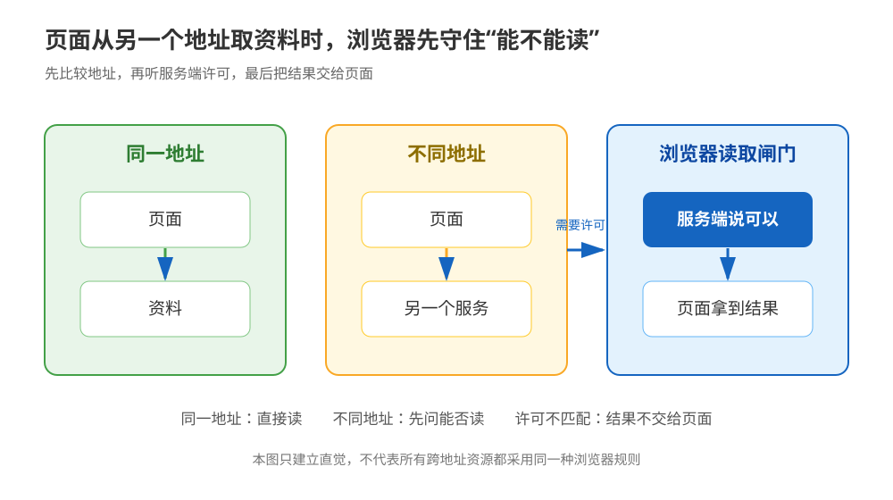

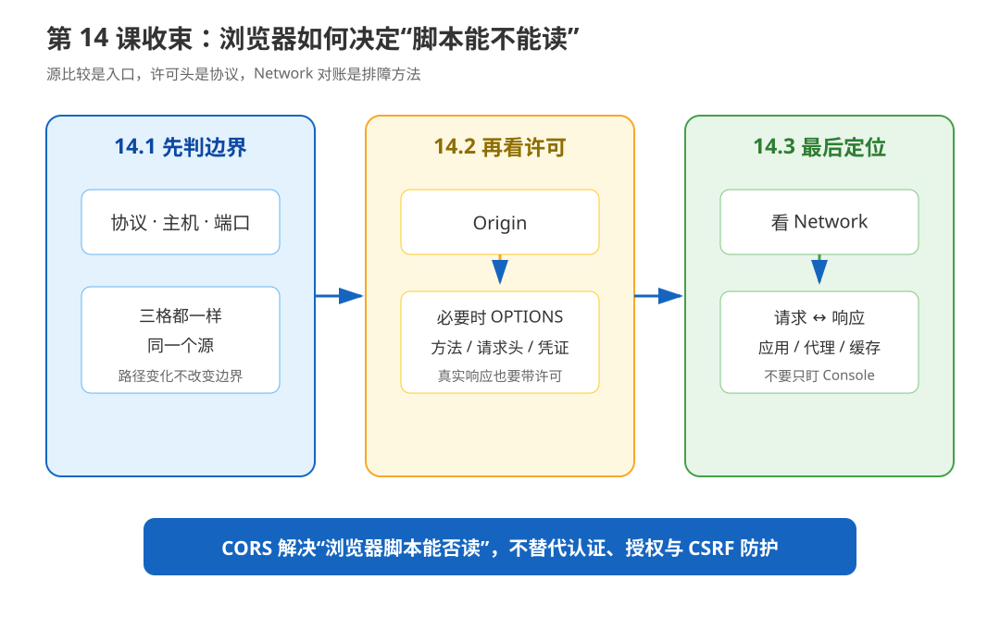

#### 本课地图

| 知识点 | 你要掌握什么 |
|---|---|
| 14.1 Origin 与同源策略 | 按 scheme、host、port 判断 origin 是否相同，区分浏览器安全边界和服务器路由。 |
| 14.2 CORS 与预检 | 判断何时触发 OPTIONS，正确配置 `Origin`、`Access-Control-Allow-Methods/Headers`。 |
| 14.3 错误阶梯与验证 | 区分预检失败、实际请求失败、缺 ACAO、凭据通配符冲突，并分别用浏览器和 curl 验证。 |

#### 速记与误区

- `localhost:5173` 与 `localhost:8000` 是不同源，因为端口不同。
- CORS 是浏览器执行的读取策略；curl 发出请求，但不会替浏览器执行同源策略。
- 携带凭据时不能使用 `Access-Control-Allow-Origin: *`；预检通过也不等于实际响应可读。
- 只给 POST 加 ACAO、不给 OPTIONS 配置允许方法和请求头，是最常见的配置缺口。

#### 命令速查卡

```bash
curl -i -X OPTIONS https://api.example.com/data \
  -H 'Origin: http://localhost:5173' \
  -H 'Access-Control-Request-Method: POST' \
  -H 'Access-Control-Request-Headers: content-type, authorization'
curl -i -X POST https://api.example.com/data \
  -H 'Origin: http://localhost:5173' \
  -H 'Content-Type: application/json' -d '{}'
```

#### 📖 文档核对与 📚 官方文档

- [MDN：Same-origin policy](https://developer.mozilla.org/en-US/docs/Web/Security/Same-origin_policy)
- [MDN：CORS](https://developer.mozilla.org/en-US/docs/Web/HTTP/Guides/CORS)
- [WHATWG Fetch：CORS protocol](https://fetch.spec.whatwg.org/#http-cors-protocol)
- [MDN：Origin](https://developer.mozilla.org/en-US/docs/Web/HTTP/Reference/Headers/Origin)

#### 应用实战入口

配套实战：[CORS 与同源策略](应用实战/14-CORS与同源策略.md)。

#### 三句话收束

1. CORS 报错不等于服务器没有收到请求。
2. 预检和实际请求是两次可能独立失败的 HTTP 交互。
3. 排障时必须同时记录浏览器控制台、OPTIONS、实际响应和服务端日志。

### 第 15 课《抓包排障与决策清单：课程收束》

[阅读原课](stages/5-认证联调与决策/lessons/lesson-15-抓包排障与决策清单.md)

#### 一句话本质

抓包不是“看一大段文本”，而是用不同观测工具建立请求证据链，再把症状映射到协议、连接、中间层或应用责任。

#### 处境对照

用户说“页面很慢”或“登录失败”，一句描述无法定位。需要把浏览器 Network、curl、服务端日志、代理/CDN 信息和必要的抓包证据对齐到同一个请求。

#### 一眼全局图


#### 本课地图

| 知识点 | 你要掌握什么 |
|---|---|
| 15.1 观测工具 | 选择 DevTools、curl、mitmproxy、服务端日志等视角，并说明每种工具看不到什么。 |
| 15.2 慢请求重构 | 用 Timing、状态码、响应头和服务端时间线重构一次请求的等待链。 |
| 15.3 决策清单 | 把认证、CORS、缓存、代理、HTTP/2/3 和 TLS 问题转成有证据的条件分支。 |

#### 速记与误区

- 浏览器适合看真实体验和安全策略；curl 适合复现协议交互；mitmproxy 只在授权的隔离环境使用。
- 每条证据至少带 URL、方法、时间、状态码、关键请求/响应头和复现条件。
- 先确认现象，再定位最长/最早失败段，再验证责任层，最后改配置；不要先清缓存或关闭校验。

#### 命令速查卡

```bash
curl -v URL
curl -sS -o /dev/null -w \
  'dns=%{time_namelookup} connect=%{time_connect} tls=%{time_appconnect} ttfb=%{time_starttransfer} total=%{time_total}\n' URL
curl --trace-time --trace-ascii /tmp/http-trace.txt URL
python3 stages/5-认证联调与决策/labs/lesson-15-capture-debugging-lab.py
```

#### 📖 文档核对与 📚 官方文档

- [Chrome DevTools：Network reference](https://developer.chrome.com/docs/devtools/network/reference/)
- [curl：命令行手册](https://curl.se/docs/manpage.html)
- [mitmproxy：Getting started](https://docs.mitmproxy.org/stable/overview/getting-started/)
- [MDN：Server-Timing](https://developer.mozilla.org/en-US/docs/Web/HTTP/Reference/Headers/Server-Timing)

#### 三句话收束

1. 没有证据的“慢”和“失败”只能算症状，不是根因。
2. 多工具交叉验证，才能把浏览器策略、网络路径和服务端处理区分开。
3. 本课把前 14 课的知识变成了一个可执行的排障决策系统。

## 7. 跨课框架：遇到 HTTP 问题先问哪三件事

### 7.1 三个定位问题

面对任何 HTTP 异常，先不要急着改头部或重试，先回答：

| 问题 | 典型证据 | 对应章节 |
|---|---|---|
| 请求到底发出去了吗？ | DevTools 请求行、curl `-v`、DNS/连接/TLS 时间 | 课 1、课 4、课 15 |
| 哪一层先产生了异常？ | 状态码、Location、证书错误、CORS 控制台、代理/CDN 头 | 课 3、课 6、课 9、课 14 |
| 响应是否被复用或改写？ | `Age`、`ETag`、`Vary`、`Via`、`Server-Timing`、协议版本 | 课 7、课 8、课 9、课 10–12 |

### 7.2 现象到章节的路由表

| 现象 | 第一跳 | 第二跳 | 暂时不要做的事 |
|---|---|---|---|
| 页面第一次打开慢，第二次快 | 课 4：连接是否复用 | 课 7：是否命中缓存 | 不要先把所有资源打包成一个大文件 |
| TTFB 高，下载很快 | 课 8：看 TTFB/服务端等待 | 课 9：看代理/CDN 回源 | 不要先压缩响应体 |
| HTTPS 握手失败 | 课 6：SAN、时间、链、SNI | 课 9：代理是否终止 TLS | 不要用 `-k` 作为生产修复 |
| 401 / 403 | 课 13：凭据是否携带、身份是否有效 | 课 3：状态码语义 | 不要让前端无条件刷新凭据 |
| 浏览器 CORS 报错但 curl 成功 | 课 14：预检和实际响应 | 课 15：对齐浏览器与服务端证据 | 不要用 `no-cors` 隐藏问题 |
| HTTP/2 仍然卡顿 | 课 11：TCP 丢包/流等待 | 课 8：长请求与加载优先级 | 不要直接宣布升级 HTTP/3 |
| CDN 返回旧数据 | 课 7：缓存控制与验证 | 课 9：缓存键、`Vary`、回源 | 不要只清浏览器缓存 |

### 7.3 一张证据卡

```text
现象：谁在什么时间、什么环境、如何稳定复现？
请求：方法 / URL / Origin / Host / Cookie或Authorization / Content-Type
响应：状态码 / Location / Cache-Control / ETag / Vary / Server-Timing
时间：DNS / connect / TLS / TTFB / body / total
协议：HTTP/1.1、HTTP/2 或 HTTP/3；是否发生回退
路径：客户端 → 代理/网关/CDN → 源站；谁添加或修改了什么
假设：最可能的责任层，以及支持它的证据
动作：修复、降级、升级或暂不改动
验证：改动前后如何对照；回滚出口是什么
```

### 7.4 课程总原则

1. **先语义，后性能**：方法、状态码、报文边界错了，优化没有意义。
2. **先分段，后优化**：先知道最长段，才知道该改 DNS、连接、TLS、服务端还是正文。
3. **先信任边界，后相信头部**：Cookie、转发头、缓存头都必须放回它们的发送者和接收者关系里判断。
4. **先验证回退，后升级协议**：HTTP/2/3 是运输能力，不是业务慢的万能药。
5. **先保留证据，后清理现场**：不要一上来刷新、重试、清缓存或改配置。

## 8. 官方文档总路由

本课程正文已在每课保留 `📖 文档核对` 和 `📚 官方文档`。需要横向查阅时，可从课程本地索引进入：

| 主题 | 本地路由 |
|---|---|
| MDN HTTP 总览 | [MDN HTTP Web Index](web-index/mdn-http/index.md) |
| HTTP 规范 | [HTTPWG Web Index](web-index/httpwg/index.md) |
| RFC 原文 | [RFC Editor Web Index](web-index/rfc-editor/index.md) |
| curl 命令与调试 | [curl Web Index](web-index/curl/index.md) |
| Chrome Network 面板 | [Chrome DevTools Web Index](web-index/chrome-devtools/index.md) |
| 本地证书实验 | [mkcert Web Index](web-index/mkcert/index.md) |
| Fetch / CORS 规范 | [WHATWG Web Index](web-index/whatwg-html/index.md) |

### 8.1 规范按问题查找

- HTTP 语义、方法、状态码、缓存、条件请求：RFC 9110、RFC 9111。
- HTTP/1.1 消息语法：RFC 9112。
- HTTP/2 帧、流和设置：RFC 9113；HPACK：RFC 7541。
- HTTP/3 与 QUIC：RFC 9114、RFC 9000、RFC 9001、RFC 9204。
- TLS 1.3：RFC 8446 及课程正文标注的后续协议更新。
- 代理转发字段：RFC 7239；Bearer Token：RFC 6750。

## 9. 应用实战索引

课程目前有两篇单课应用实战，另有一个跨阶段结课项目。只在需要动手时进入，不把应用代码当成协议规范本身：

[打开 HTTP 应用实战索引](应用实战/INDEX.md)

| 应用 | 适合什么时候做 | 主要回收的能力 |
|---|---|---|
| [13 · Cookie 会话与 Token](应用实战/13-Cookie会话与Token.md) | 学完课 13 | 会话状态、凭据轮换、Cookie 属性与授权边界 |
| [14 · CORS 与同源策略](应用实战/14-CORS与同源策略.md) | 学完课 14 | 精确来源、预检、凭据与浏览器验证 |

本课程没有独立的 `源码解析/` 目录；协议代码只在各课实验和结课项目中作为验证材料。

## 10. 决策清单：从知道概念到选择动作

### 10.1 是否需要 HTTPS / TLS 调优

| 条件 | 动作 | 验证证据 |
|---|---|---|
| 传输包含登录态、个人数据或业务机密 | 必须使用 HTTPS；校验证书链和域名 | `curl -v`、`openssl s_client`、证书监控 |
| 首请求慢，复用后正常 | 保留 HTTPS，优先优化连接复用和握手次数 | `time_appconnect`、`num_connects`、Timing |
| 证书校验失败 | 修复 SAN、有效期、中间链、信任根或 SNI | 客户端错误原文与完整证书链 |
| 只想临时隔离服务端问题 | 可在本地使用 `--insecure` 做对照 | 只保留实验记录，不进入生产配置 |

### 10.2 如何选择缓存策略

| 响应类型 | 默认倾向 | 必查项 |
|---|---|---|
| HTML 入口 | 短缓存或协商缓存 | 发布后旧入口、`ETag`/`Last-Modified` |
| 带内容 hash 的 JS/CSS/图片 | 长缓存 + `immutable` | 文件名确实随内容变化 |
| 个性化 API / 登录后数据 | 私有或不缓存 | Cookie、Authorization、缓存键和 `Vary` |
| CDN 可共享的公共内容 | `s-maxage` / 明确失效策略 | `Age`、命中率、回源、发布回滚 |

### 10.3 何时选择 HTTP/1.1、HTTP/2、HTTP/3

| 选择 | 适合条件 | 不能承诺什么 |
|---|---|---|
| HTTP/1.1 | 兼容性优先、简单内网服务、客户端能力有限 | 不会自动解决串行队头阻塞 |
| HTTP/2 | HTTPS 已稳定、资源并发多、客户端/代理支持成熟 | 不能消除 TCP 丢包带来的连接级阻塞 |
| HTTP/3 | 移动网络、丢包/迁移场景有证据，UDP/443 可达 | 不会修复慢数据库、慢业务或错误缓存 |

升级前至少记录：真实协商版本、握手与 TTFB 基线、错误率、客户端覆盖、代理兼容性、UDP/443 可达性、HTTP/2/1.1 回退和回滚开关。

### 10.4 认证与跨域

| 场景 | 首先确认 | 常见修复 |
|---|---|---|
| 401 | 凭据是否发送、格式是否正确、是否过期 | 修复 Cookie/Authorization 携带和轮换 |
| 403 | 身份已识别但权限被拒 | 修复授权规则、资源归属或 CSRF 防护 |
| OPTIONS 失败 | `Origin`、请求方法、请求头是否在允许列表 | 给预检返回明确的 ACAO/ACAM/ACAH |
| 实际请求成功但浏览器读不到 | 实际响应缺 ACAO，或凭据与 `*` 冲突 | 返回精确 origin、正确 `Vary: Origin` 和凭据配置 |

## 11. 命令总卡

### 11.1 看到报文

```bash
curl -v URL
curl -i URL
curl -sS -D - -o /dev/null URL
curl --trace-time --trace-ascii /tmp/http-trace.txt URL
```

### 11.2 看时间

```bash
curl -sS -o /dev/null -w \
  'dns=%{time_namelookup}\nconnect=%{time_connect}\ntls=%{time_appconnect}\nttfb=%{time_starttransfer}\ntotal=%{time_total}\n' URL
```

### 11.3 看认证、缓存和 CORS

```bash
curl -c /tmp/cookies.txt -i URL/login
curl -b /tmp/cookies.txt -i URL/me
curl -H 'Authorization: Bearer TOKEN' -i URL/me
curl -H 'If-None-Match: "etag-value"' -D - -o /dev/null URL
curl -i -X OPTIONS URL -H 'Origin: http://localhost:5173' \
  -H 'Access-Control-Request-Method: POST'
```

### 11.4 看协议与证书

```bash
curl --http1.1 -v URL -o /dev/null
curl --http2 -v URL -o /dev/null
curl --http3 -v URL -o /dev/null
openssl s_client -connect host:443 -servername host
```

## 12. 复习路线与阶段出口

### 快速复习（约 30 分钟）

按“一条请求总地图”从左到右走一遍：课 1 → 2 → 3 → 4 → 5 → 6 → 7 → 8 → 9 → 10 → 11 → 12 → 13 → 14 → 15。每课只看“一句话本质、一眼全局图、三句话收束”。

### 排障复习（约 60 分钟）

1. 先读第 7 节的现象路由表。
2. 对照第 11 节命令卡，采集一条真实或本地实验请求。
3. 按第 7.3 节写证据卡，不允许只写结论。
4. 回到对应原课和实验补足细节。

### 阶段出口

| 阶段 | 通过标准 |
|---|---|
| 1 | 能手写请求/响应结构，解释方法、状态码和 URL 边界。 |
| 2 | 能拆连接/TLS 成本，解释证书信任链失败。 |
| 3 | 能判断缓存命中/304，拆分 Timing，并画出代理/CDN 路径。 |
| 4 | 能比较 HTTP/1.1、HTTP/2、HTTP/3 的收益、遗留问题和回退条件。 |
| 5 | 能把登录失败、CORS 和慢请求写成可复核证据卡。 |

完成这五项后，Phase 5 的三份收尾资料——《实战经验》《排障速查手册》《场景解法库》——已作为可直接调用的工作资料收束，而不是新的概念课。

## 13. Phase 3 结课综合实战：HTTP 请求诊断实验场

本项目把全课程串成一条可重复验证的闭环：

> 复现症状 → 记录请求/响应 → 拆分耗时 → 判断协议语义 → 选择修复 → 复测 → 写证据卡

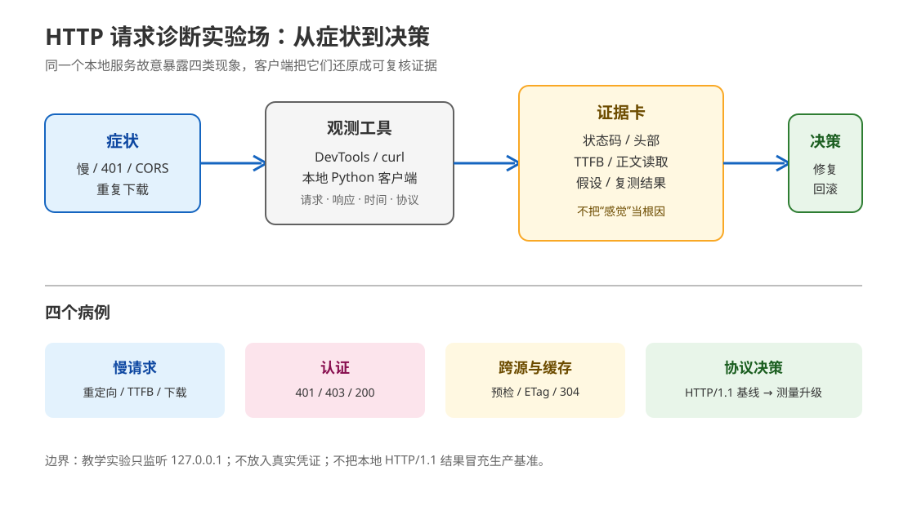

### 13.1 项目要求

在本地实验场完成四个病例，并为每个病例留下证据卡：

| 病例 | 需要证明什么 | 主要知识点 |
|---|---|---|
| 慢请求 | 302、首字节等待、正文读取分别留下什么证据 | 3.3、4.1、8.2、15.2 |
| 登录失效 | 缺凭证、凭证错误、凭证正确分别为何是 401、403、200 | 3.2、13.3 |
| 跨源与缓存 | 预检拒绝、ETag/304、指纹资源长缓存如何区分 | 7.2、7.3、14.2、14.3 |
| 协议决策 | 何时有足够证据升级 HTTP/2/3，如何回退 | 6.2、11.2、12.3、15.3 |

### 13.2 项目知识地图

项目没有把 45 个知识点都硬贴到代码上，而是区分“代码真正覆盖”和“设计决策回顾”：

- 报文与语义：状态行、关键头部、正文长度、302/304/401/403 等分支。
- 连接与安全：connect/TTFB 测量、HTTP/1.1 基线、证书与代理信任边界。
- 缓存与性能：`ETag`/`If-None-Match`、`no-cache` 与 `immutable`、四段耗时。
- 中间层与协议：转发头信任、实际协商版本、UDP/443、回退条件。
- 应用安全与排障：Bearer、OPTIONS 预检、浏览器/ curl 三种观测镜头。

### 13.3 四个设计决策

1. **安全边界**：只监听 `127.0.0.1`，token 仅用占位符，不安装抓包 CA，不解密第三方流量。
2. **可观测性**：连接、TTFB、正文读取、总耗时分段记录，服务端用 `Server-Timing` 提供教学证据。
3. **错误语义**：401、403、304、204 等状态码保持语义，不用 200 淹没问题。
4. **协议决策**：本地以 HTTP/1.1 为基线；HTTP/2/3 只根据真实协商、网络和回退证据决定，不冒充压测结果。

### 13.4 运行与验收入口

```bash
python3 'network/http/projects/HTTP请求诊断实验场/实现/run_cases.py'
python3 -m unittest discover \
  -s 'network/http/projects/HTTP请求诊断实验场/实现' -p 'test_*.py' -v
```

完整的需求、覆盖矩阵、反例、证据卡、设计决策和验收清单见：[HTTP 请求诊断实验场 README](projects/HTTP请求诊断实验场/README.md)。

> 项目交付状态：已完成并通过本地病例运行、回归测试、Python 3.9.6 编译检查和 SVG 结构检查（核查于 2026-09）。

## 14. Phase 5 收尾三件套

课程正文负责建立概念，Phase 3 项目负责把概念串成一次可运行闭环；Phase 5 把它们分别收束为学习态、使用态和设计态三份资料：

| 需要做什么 | 入口 | 使用方式 |
|---|---|---|
| 想理解为什么会崩 | [实战经验](08-实战经验.md) | 按 8 个故障模式阅读五段式：症状 → 根因 → 排查 → 修复 → 预防 |
| 现在就要止血排障 | [排障速查手册](09-排障速查手册.md) | 按症状倒查；第一步止血，随后按条件分支定位，没匹配就转 `debug` |
| 要设计一条可演进的方案 | [场景解法库](场景解法库/INDEX.md) | 先想 30 秒，再展开三条解法比较代价、边界、替代路线和回退 |

Phase 5 的 6 个场景覆盖 4 个经典设计题与 2 个规模压力题，共 18 个解法和 18 张逐解法机制图。它们不新增 45 个知识点，而是把已有知识点放回认证、缓存、幂等、代理信任、十倍流量和移动弱网等决策处境。
